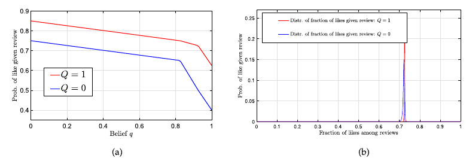
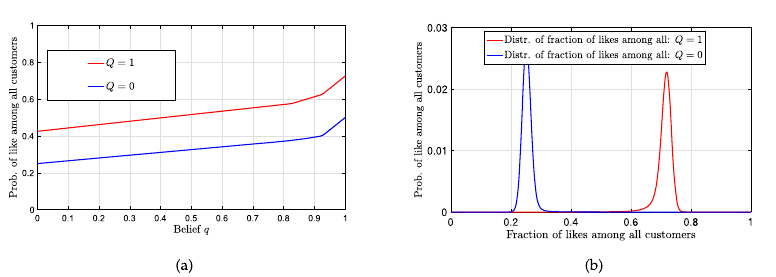

# LEARNING FROM REVIEWS: THE SELECTION EFFECT AND THE SPEED OF LEARNING

# 2 Environment

Product: unknown to both side

Rating system:

- Collect from previous customers
- provide a rating
- new customers observe it
- purchase with ex ante type
- ex post preference

## 2.1 Customers' Problem, Rating System

$Q\in\{0, 1\}$: True quality of the product

$t\in\mathbb{N}$: new customerm arrive time

$u_t = \theta_t + \zeta_t + Q - p\quad (1)$: **material utility** of customer $t$

- $\theta_t$: ex ante type of the customer
  - independently continuous $F_\theta$
- $\zeta_t$: ex post idiosyncratic preference term
  - independently continuous $F_\zeta$
  - sometimes combined $F_{\theta, \zeta}$
- $p$: price of the product
- $\theta_t, \zeta_t$: customer private info

Procedure:

- $t$ observe rating and $\theta_t$
- whether to by
- if buy: experience **material utility**
- $r_t$: review
  - $-\underline{K},\dots,\overline{K}$: reviews
  - $\mathcal{R} = \{-\underline{K},\dots,\overline K \}$
  - $\overline K$: like, $-\underline K $ : dislike
- $b_t$: purchase decision
- $r_t$: review decision
- $a_t\in \mathcal{R}\cup \{ N \}$: action
  - $a_t = N$: no purchase ($b_t$ = 0)
- $\mathcal A = \mathcal R \cup \{ N \}$: set of actions
- $h_t = \{ a_1,\dots,a_{t-1}\}$: history ($h_1 = \oslash$)
- $\mathbf\Omega$: rating system
  - $\Omega_t$: rating avaliable to $t$

---

### Purchase decision

- $t$ observe $\Omega_t$
- $B_t :\Omega_t\times\mathbb R^3\rightarrow\{0, 1\}$: purchase decision
  - rating system & ex ante type $\theta_t$ & ex post idiosyncratic preference $\zeta_t$ & price $p$
- $\mathbf B = \{ B_t\} ^ \infty_{t = 1}$: collection of purchase decision strategies
  - $B_t(\Omega_t, \theta_t) = 1\quad$if and only if$\quad \theta_t + \mathbb E \left[\zeta_t\right] + q_t - p \ge 0$: Bayes-Nash equilibrium
  - $q_t = \mathbb P _{\{(\theta_S, \zeta_S\}_{S=1}^{t-1}}\left[Q=1\mid\Omega_t\right] \quad$ 
(2)
: the belief of $t$

## 2.2 Review decision

$\lambda_{-\underline K }\le \dots\le \lambda_{-1}\le \lambda_1\le\dots\le\lambda_{\overline K} \in \mathbb R$: threshold

$$
r_{t}=\left\{\begin{array}{ll}
-\underline{K} & \text { if } u_{t}<\lambda_{-\underline{K}}, \\
i & \text { if } \lambda_{i-1} \leq u_{t}<\lambda_{i}, -\underline{K} < i < 0, \\
0 & \text { if } \lambda_{-1} \leq u_{t}<\lambda_{1}, \\
i & \text { if } \lambda_{i} \leq u_{t}<\lambda_{i+1}, 0 < i < \overline{K}, \\
\bar{K} & \text { if } u_{t} \geq \lambda_{\bar{K}} .
\end{array}\right.\quad (3)
$$

---

#### Assumption 1 - Richness

$\theta, \zeta$, random variable, drawn from $\left[\underline \theta, \overline\theta\right], \left[\underline \zeta, \overline\zeta\right]$, so that

- $\overline\zeta + \overline\theta - p > \lambda\_{\overline K}, $
- $\underline\zeta+\overline\theta - p + 1 < \lambda_{-\underline K}$

why $\overline\theta$ ?

- lower may not purchase
- $Q = 0$ for most favorable review, $Q = 1$ for least favorable review , these are not fully revealing ablout the quality

#### Remark 1

---

# 3 Full history

- $\Omega_t = h_t$

## 3.1 Learning Dynamics

[(2)](#2) becomes:

$q_t = \mathbb P _{\{(\theta_S, \zeta_S\}_{S=1}^{t-1}}\left[Q=1\mid h_t\right]$

$l_t = \dfrac{q_t}{1-q_t} = \dfrac{\mathbb P_{\{(\theta_S,\zeta_S)\}_{S=1}^{t-1}}[Q=1\mid h_t]}{\mathbb P_{\{(\theta_S,\zeta_S)\}^{t-1}_{S=1}}[Q=0\mid h_t]}$ 
(4)
 : associated likelihood ratio

$\pi(a;F_{\theta,\zeta},Q,q)$: probability of action $a\in \mathcal A$,

- given joint distribution of $\theta, \zeta$
- price $p$
- thesholds when true quality is $Q$, belief is $q$

$$
\begin{array}{l}
\pi\left(a ; F_{\theta, \zeta}, Q, q\right) \\
\quad=\left\{\begin{array}{ll}
\mathbb{P}_{\theta, \zeta}[q+\theta+\mathbb{E}[\zeta]-p<0], & \text { for } a=N, \\
\mathbb{P}_{\theta, \zeta}\left[q+\theta+\mathbb{E}[\zeta]-p \geq 0, \theta+\zeta+Q-p<\lambda_{-\underline{K}}\right], & \text { for } a=-\underline{K}, \\
\mathbb{P}_{\theta, \zeta}\left[q+\theta+\mathbb{E}[\zeta]-p \geq 0, \lambda_{a-1} \leq \theta+\zeta+Q-p<\lambda_{a}\right], & \text { for }-\underline{K} < a < 0, \\
\mathbb{P}_{\theta, \zeta}\left[q+\theta+\mathbb{E}[\zeta]-p \geq 0, \lambda_{-1} \leq \theta+\zeta+Q-p<\lambda_{1}\right], & \text { for } a=0, \\
\mathbb{P}_{\theta, \zeta}\left[q+\theta+\mathbb{E}[\zeta]-p \geq 0, \lambda_{a} \leq \theta+\zeta+Q-p<\lambda_{a+1}\right], & \text { for } 0 < a < \bar{K}, \\
\mathbb{P}_{\theta, \zeta}\left[q+\theta+\mathbb{E}[\zeta]-p \geq 0, \theta+\zeta+Q-p \geq \lambda_{\bar{K}}\right], & \text { for } a=\bar{K} .
\end{array}\right.
\end{array}
$$

$\mathbf \pi (F_{\theta,\zeta},Q,q) = (\pi(a;F_{\theta,\zeta},Q,q): a\in\mathcal A)$: vector of probabilities

$$
\begin{aligned}
l_{t} & =\frac{q_{t}}{1-q_{t}}=\frac{\mathbb{P}_{\left\{\left(\theta_{s}, \zeta_{s}\right)\right\}_{s=1}^{t-1}}\left[Q=1 \mid h_{t}\right]}{\mathbb{P}_{\left\{\left(\theta_{s}, \zeta_{s}\right)\right\}_{s=1}^{t-1}}^{t-1}\left[Q=0 \mid h_{t}\right]}=\frac{\mathbb{P}_{\left\{\left(\theta_{s}, \zeta_{s}\right) \zeta_{s=1}^{t-1}\right.}\left[h_{t} \mid Q=1\right]}{\mathbb{P}_{\left\{\left(\theta_{s}, \zeta_{s}\right)\right\}_{s=1}^{t-1}}^{t h}\left[h_{t} \mid Q=0\right]} \\
& =\prod_{s=1}^{t-1} \frac{\pi\left(a_{s} ; F_{\theta, \zeta}, Q=1, q_{s}\right)}{\pi\left(a_{s} ; F_{\theta, \zeta}, Q=0, q_{s}\right)}
\end{aligned}
$$

(5)

#### More detailed on (5)

$\dfrac{\mathbb P [Q=1\mid h_t]}{\mathbb P [Q=0 \mid h_t]} = \dfrac{\mathbb P [h_t \mid Q = 1]\mathbb P [Q=1]}{\mathbb P [h_t \mid Q = 0]\mathbb P [Q = 0]}$

using that $\mathbb P [Q=  1] = \mathbb P [Q = 0]$ we get the third equation

$\mathbb P[h_t \mid Q ] = \prod_{s = 1}^{t -1} \mathbb P [a_s \mid Q ] $, notice that $h_t$ is composed from $a_s$,

$\mathbb P [a_s \mid Q ] = \pi (a_s; F_{\theta,\zeta}, Q, q_s)$ with this we get the fourth equation.

---

$l_{t+1} = l_t \times \dfrac{\pi(a_t; F_{\theta, \zeta}, Q = 1, q_t)}{\pi (a_t; F_{\theta, \zeta}, Q = 0, q_t )}$

$l_{t+1} = l_t \times \dfrac{\pi(a_t; F_{\theta, \zeta}, Q = 1, q_t)}{\pi (a_t; F_{\theta, \zeta}, Q = 0, q_t )}, \quad \text{w.p. } \pi(a_t; F_{\theta,\zeta}, Q, q_t), a\in \mathcal A \text { for } t \ge 1$

## 3.2 Complete learning

### Theorem 1:

If $\overline\theta + \mathbb E [\zeta] - p \ge 0, q_1 \in(0, 1)$, then $q_t\rightarrow Q$ almost surely

Proof

$Z(a_t | l_t ) = \dfrac{\pi (a_t ; F_{\theta, \zeta}, Q = 1, q = q_t ) }{ \pi ( a*t ; F*{\theta, \zeta}, Q = 0, q = q_t)}, \forall a_t \in \mathcal A, $
(A-1)

: likelihood ratio

#### Part 1 : when $\overline \theta + \mathbb E [\zeta] - p > 0$

$$
\begin{aligned}
& \mathbb{E}_{a \sim \pi\left(F_{\theta, \zeta}, Q=0, q=q_{t}\right)}\left[Z\left(a \mid l_{t}\right) \mid h_{t}\right] \\
& =\mathbb{E}_{a \sim \pi\left(F_{\theta, \zeta}, Q=0, q=q_{t}\right)}\left[\frac{\pi\left(a ; F_{\theta, \zeta}, Q=1, q=q_{t}\right)}{\pi\left(a ; F_{\theta, \zeta}, Q=0, q=q_{t}\right)}\right] \\
& =\sum_{a \in \mathcal A }\pi(F_{\theta,\zeta}, Q = 0, q = q_t)\left[\frac{\pi\left(a ; F_{\theta, \zeta}, Q=1, q=q_{t}\right)}{\pi\left(a ; F_{\theta, \zeta}, Q=0, q=q_{t}\right)}\right] \\
& =\sum_{a \in \mathcal{A}} \pi\left(a ; F_{\theta, \zeta}, Q=1, q=q_{t}\right)\\
& =1 .
\end{aligned}
$$

$$
\begin{aligned}
&\mathbb E [l_{t + 1} \mid\mathcal F_t]\\
&= \mathbb E [l_t \times Z(a_t\mid l_t)\mid \mathcal F_t]\\
&=\mathbb E[l_t \mid \mathcal F_t ] = l_t\\
&\Rightarrow l_t\text{ forms a martingale}
\end{aligned}
$$

$l_t = \dfrac{q_t}{1-q_t} < \infty, l_t \ge 0$

---

#### Martingale convergence theorem

**Statement:**

$\{X_n\}_{n=1}^\infty$ is a submartingale (or martingale, or supermartingale) with respect to a filtration $\{\mathcal{F}_n\}$.

Suppose one of the following conditions holds:

1. $\{X_n\}$ is bounded in $L^1$, i.e., $\sup_n \mathbb{E}[|X_n|] < \infty$.

2. $\{X_n\}$ is bounded almost surely, i.e., there exists a constant $K$ such that $|X_n| \leq K$ almost surely for all $n$.

3. $\{X_n\}$ is a non-negative supermartingale, i.e., $X_n \geq 0$ almost surely for all $n$.

Then, $\{X_n\}$ converges almost surely (a.s.) to a limit $X_\infty$ as $n \to \infty$.

If, in addition, $\{X_n\}$ is uniformly integrable, then $X_\infty$ is integrable, and
$
\lim_{n \to \infty} \mathbb{E}[|X_n - X_\infty|] = 0.
$

---

$l_t \rightarrow l_\infty$ almost surely

$$
\begin{aligned}
& Z\left(a=\bar{K} \mid l_{t}\right) \\
& =\frac{\pi\left(a=\bar{K} ; F_{\theta, \zeta}, Q=1, q=q_{t}\right)}{\pi\left(a=\bar{K} ; F_{\theta, \zeta}, Q=0, q=q_{t}\right)} \\
& =\frac{\mathbb{P}_{\theta, \zeta}\left[q_{t}+\theta+\mathbb{E}[\zeta]-p \geq 0, \theta+\zeta+1-p \geq \lambda_{\bar{K}}\right]}{\mathbb{P}_{\theta, \zeta}\left[q_{t}+\theta+\mathbb{E}[\zeta]-p \geq 0, \theta+\zeta-p \geq \lambda_{\bar{K}}\right]} \\
& \text{notice the over part is >= -1 and the below part is >= 0} \\
& =1+\frac{\mathbb{P}_{\theta, \zeta}\left[q_{t}+\theta+\mathbb{E}[\zeta]-p \geq 0, \theta+\zeta-p-\lambda_{\bar{K}} \in[-1,0)\right]}{\mathbb{P}_{\theta, \zeta}\left[q_{t}+\theta+\mathbb{E}[\zeta]-p \geq 0, \theta+\zeta-p-\lambda_{\bar{K}} \geq 0\right]} \\
& \text{let over part q is 0, below part q is 1}\\
& \geq 1+\frac{\mathbb{P}_{\theta, \zeta}\left[\theta+\mathbb{E}[\zeta]-p \geq 0, \theta+\zeta-p-\lambda_{\bar{K}} \in[-1,0)\right]}{\mathbb{P}_{\theta, \zeta}\left[1+\theta+\mathbb{E}[\zeta]-p \geq 0, \theta+\zeta-p-\lambda_{\bar{K}} \geq 0\right]},
\end{aligned}
$$

Prove the upper part > 0 :

Let $\Delta_1 = \min \{ 1, \overline \theta + \mathbb E [\zeta] - p\} > 0$

$$
\begin{array}{l}
\mathbb{P}_{\theta, \zeta}\left[\theta+\mathbb{E}[\zeta]-p \geq 0, \theta+\zeta-p-\lambda_{\bar{K}} \in[-1,0)\right] \\
\quad \stackrel{(a)}{\geq} \mathbb{P}_{\theta, \zeta}\left[\theta \geq \bar{\theta}-\Delta_{1}, p+\lambda_{\bar{K}}-\theta-1 \leq \zeta \leq p+\lambda_{\bar{K}}-\theta\right] \\
\quad \stackrel{(\text { b) }}{>} 0,
\end{array}
$$

(A-2)

for detailed (b), we have:

$$
\begin{aligned}
&p+\lambda_{\overline K} - \theta - 1 \\
&\le p + \lambda_{\overline K} - \overline \theta + \Delta_1 - 1\\
&\le p + \lambda_{\overline K} - \overline \theta < \overline \zeta\\
\\
&p+\lambda_{\overline K} - \theta - 1 \\
&\ge p + \lambda _{-\underline K} - \overline \theta - 1 \\
&> \underline \zeta
\end{aligned}
$$

(refer to [Assumption 1](#assumption-1---richness))

$\min_l Z(a = \overline K \mid l) - 1 \ge \epsilon > 0$

$$
\begin{aligned}
&\mathbb P _{a\sim \mathbf \pi (F_{\theta,\zeta}, Q = 0, q = q_t)}[|Z(a\mid l_t )- 1 | \ge \epsilon \mid l_t]\\
&\ge \pi ( a = \overline K; F_{\theta, \zeta}, Q = 0, q = q_t)\\
&\ge \mathbb P_{\theta, \zeta}[q_t + \theta + \mathbb E[\zeta] - p \ge 0, \theta + \zeta - p \ge \lambda_{\underline K }]\\
&\ge \mathbb P_{\theta, \zeta } [\theta + \mathbb [\zeta] - p \ge 0 , \theta + \zeta - p \ge \lambda_{\overline K }]\\
&\ge \mathbb P_{\theta, \zeta } \left[\theta\ge\overline\theta - \dfrac{\Delta _2}{2}, \zeta\ge \overline\zeta - \dfrac{\Delta_2}{2}\right]\\
&> 0
\end{aligned}
$$

where $\Delta_2 = \min\{\overline\theta + \mathbb E [\zeta] - p,\overline\theta + \overline\zeta - p - \lambda_{\overline K }\} > 0$

(A-3)

with [(A-2)](#(A-2)), [(A-3)](#(A-3)):
$$
\begin{aligned}
&\mathbb P_{\{(\theta_s,\zeta_s)\}^t_{s = 1}}[|l_{t+1} - l_t|\ge\delta\epsilon]\\
&\text{with } l_{t+1} = l_t\cdot Z(\cdot \mid l_t)\\
& = \mathbb E_{\{(\theta_s,\zeta_s)\}^t_{s = 1}}[\mathbf 1\{|l_t(Z(\cdot\mid l_t ) - 1)|\ge \delta\epsilon\}] \\
&\ge  \mathbb E_{\{(\theta_s,\zeta_s)\}^t_{s = 1}}[\mathbf 1\{l_t\ge\delta\}\mathbf 1 \{|(Z(\cdot\mid l_t ) - 1)|\ge \epsilon\}] \\
&=  \mathbb E_{\{(\theta_s,\zeta_s)\}^t_{s = 1}}[\mathbf 1\{l_t\ge\delta\}\mathbb P_{\theta, \zeta } [\mathbf |(Z(\cdot\mid l_t ) - 1)|\ge \epsilon \mid l_t ]] \\
&\ge\eta\mathbb E_{\{(\theta_s,\zeta_s)\}^t_{s = 1}} [ \mathbf 1 \{ l_t\ge\delta\}] \\
&= \eta\mathbb E_{\{(\theta_s,\zeta_s)\}^t_{s = 1}} [l_t> \delta]\\
\end{aligned}
$$

$l_t\rightarrow l_\infty$ almost surely ( martingale convergence theorem ) $\Rightarrow P_{\{(\theta_s,\zeta_s)\}^t_{s = 1}}[|l_{t+1} - l_t|\ge\delta\epsilon]\rightarrow 0 $

$\Rightarrow P_{\{(\theta_s,\zeta_s)\}^t_{s = 1}}[|l_{t} > \delta ]\rightarrow 0$

$\Rightarrow  l_t\rightarrow 0 $ in probability

with $l_t\rightarrow l_\infty$ almost surely

$\Rightarrow \mathbb P[l_\infty = 0] = 1$

notice $l_t = \dfrac{q_t}{1 - q_t} \Rightarrow q_t \rightarrow 0$ almost surely $\square$

this ends the part 1 proof

[return to part 1](#part-1--when-overline-theta--mathbb-e-zeta---p--0)

#### Part 2: when $\overline\theta + \mathbb E[\zeta] - p < 0$

Let $\Delta = -(\overline\theta + \mathbb E [\zeta] - p) > 0$

notice $\Delta > 1 \Leftrightarrow \overline + \mathbb E[\zeta] - p + q \le -\Delta + 1 < 0$, no purchase happen

$\forall q \ge \Delta$, with [Assumption 1](#assumption-1---richness) and similar to [(A-2)](#(A-2))

$\theta\ge\overline\theta - ( 1 - \Delta)$

$\Rightarrow \underline\zeta < \lambda_{-\underline K} + p - \overline\theta - 1 \le \lambda_{-\underline K } + p - \theta - 1 \le \lambda_{\overline K } + p - (\overline\theta - (1 - \Delta)) - 1 < \overline \zeta$

$\Rightarrow \max _{q \in[\Delta, 1]} \frac{\mathbb{P}_{\theta, \zeta}\left[\theta+\mathbb{E}[\zeta]+q-p \geq 0, \theta+\zeta+1-p \leq \lambda_{-\underline{K}}\right]}{\mathbb{P}_{\theta, \zeta}\left[\theta+\mathbb{E}[\zeta]+q-p \geq 0, \theta+\zeta-p \leq \lambda_{-\underline{K}}\right]}<1$

the over part and below part difference is bounded by:

$ \mathbb{P}_{\theta, \zeta}\left[\theta \geq \bar{\theta}-(1-\Delta), \lambda_{-\underline{K}}+p-\theta-1 \leq \zeta \leq \lambda_{-\underline{K}}+p-\theta\right]>0 $

--- 

Theorem shows: 

- $ \bar{\theta}+\mathbb{E}[\zeta]-p \geq 0 $ is sufficient for complete learning 
  - starting from any initial belief 
- when not hold:
  - for sufficiently pessimistic beliefs about $Q$(quality of product)
    - all customers stop buying it 

Notice:
- most positive assessment of expected utility: 
  - hightest ex ante valuation $\bar \theta $
  - $ \bar{\theta}+\mathbb{E}[\zeta]+q-p $
    - $ q $ is the public belief at the time of purchase

when: $ \bar{\theta}+\mathbb{E}[\zeta]-p<0 $

- notice whole will $<0$
  - once belief reach pessimistic level:
    - the most positive valuation stop purchasing
    - consequently beliefs remain stuck at $q$

#### Assumption 2: $ \bar{\theta}+\mathbb{E}[\zeta]-p>0 $ 

## 3.3 Speed of learning 

Characterize the speed of learning under full history 

Introduce KL(Kullback-Leibler) divergence 

#### Definition 1 : KL Divergence 

> $ D(\boldsymbol{\mu} \| \boldsymbol{\nu})=\sum_{i=1}^{m} \mu_{i} \log \left(\frac{\mu_{i}}{\nu_{i}}\right) $

> - two strictly positive distributions :
>   - $ \boldsymbol{\mu}=\left(\mu_{1}, \ldots\right. $, $ \left.\mu_{m}\right) $ 
>   - $ \nu=\left(\nu_{1}, \ldots, \nu_{m}\right) $
> - defined on a finite set $ \{1, \ldots, m\}, \mathrm{KL} $

#### Definition 2 : Speed of learning 

> For a rating system with exponentially fast (complete) learning:
> - $ \lim _{t \rightarrow \infty} \frac{1}{t} \log q_{t} $ : the speed of learning 
>   - when $ Q=0 $
> - $ \lim _{t \rightarrow \infty} \frac{1}{t} \log (1- q_{t} )$
>   - when $ Q=1 $
> -  a rating system has faster learning than another one :
>   - speed of learning is greater for both $Q = 0$ and $Q = 1$

#### Theorem 2: 

> Suppose:
> -  Assumptions 1 and 2 hold 
> - Then : learning is exponentially fast
>   - that is: $ q_{t} $ almost surely converges exponentially to $ Q $
> 
> For $Q = 0$: almost sure have:
> - $ \lim _{t \rightarrow \infty} \frac{1}{t} \log q_{t}=-D\left(\pi\left(F_{\theta, \zeta}, Q=0, q=0\right) \| \boldsymbol{\pi}\left(F_{\theta, \zeta}, Q=1, q=0\right)\right) $
> For $Q = 1$: almost sure have:
> $ \lim _{t \rightarrow \infty} \frac{1}{t} \log \left(1-q_{t}\right)=-D\left(\pi\left(F_{\theta, \zeta}, Q=1, q=1\right) \| \pi\left(F_{\theta, \zeta}, Q=0, q=1\right)\right) $

Tell us:

Learning under full history:

- exponentially fast 
- is governed by the **KL** divergence between:
  - probability distribution of possible actions (i.e., $ a \in \mathcal{A} $ )
    - when the underlying quality is $ Q $
    - public belief is $q = Q $
  - and the probability distribution
    - when underlying quality is $1-Q $
    - still $q=Q$

Three components to intuition:

-  the ability of users to overcome the selection effect and combine (the independent components of) past reviews
   -  can achieve because: they know the distribution of
past reviews and can draw the correct inferences from them
- the speed of learning is given by KL divergence is intuitive as well
  - think of distinguishing $ Q=0 $ from $ Q=1 $ as a binary hypothesis testing problem 
  -  The best error exponent for a binary hypothesis testing problem from independently-drawn samples is given: 
     -  by the KL divergence between the probability distributions of these samples conditional on the two hypotheses
- both probability distributions in the KL divergence condition on $q=Q$
   -  because: under full history, each customer correctly reasons about previous users’ beliefs, which are converging to $Q$
   -  enables the effective filtering out of selection effect

## 3.4 The Selection Effect 

Because : 

the composition of customers purchasing the product :
-  influenced by information at time $t$ (summarized by $q_t$)

Then :

the distribution of reviews depends on this information. 

For example:

with full history, when the public belief $q_t $ is very low:
- only customers with very high $\theta $ purchase
- these customers are much more likely to enjoy a high material utility 
-  leave a positive review than the
average customer

### Example 1 : 

> A rating system : 
>
> $ p=0, \zeta=0, \theta \sim \mathcal{U}[-1,1] , Q=0 $
> 
> When $ Q+\theta \geq 0 $
> - leave a positive review ("like")
> 
> Suppose:
> - $ q \approx 1 $
>
> then all customers purchase 
> - because: $ \theta+q \approx \theta+1 $ greater than zero 
>
> Then :
>
>  ex ante valuation of customers who have purchased the product : 
> - uniformaly distributed over $[-1, 1]$
> - half is positive 
>
> In contrast : 
>
> $ q \approx 0 $
>
> - only customers with positive $\theta $ purchase the product
> - conditional distribution of ex ante valuations is uniform over $[0, 1]$ 
> - all reviews will be positive

Selection effect impact the speed of learning:

Suppose:

that customer $ t $ (in addition to $ h_{t} $ ) observes the ex ante valuation of previous customers :

- $ \theta_{s} $ for $ s=1, \ldots, t-1 $

In this setting:

- extra information remove selection effect 
  - because: current customers can condition on past customers' valuation 
  - learning is faster 
  - extra information regarding distribution of previous customers' preferences increases the speed of learning 

# 4 Summary statistics 

Characterize the conditions for:
- complete learning
- speed for more realistic rating system 
  - where platform provides summary statistics of reviews
  - by past customers

## 4.1 Learning Dynamics 

Summary statistics will not see full history 

- only observe a vector of statistics $\mathbb S $ 
  - include the fraction of review in a subset of all review 

Formally:

$T$ : a nonempty subset

- of all possible actions $\mathcal A $

a partition of $T $: A rating system $ \left\{T_{1}, \ldots, T_{m}\right\} $

- i.e. $ T=\bigcup_{i=1}^{m} T_{i} $ and $ T_{i} \cap T_{j}=\emptyset, i \neq j \in[m] $

- such that:
  - for any $i>j $:
  - reviews in $ T_{i} $ are more positive than the reviews in the set $ T_{j} $

$\tau $: the times $ t $ at which an action in $ T $ occurs

- $\tau $ will be the number of reviews left so far 

So:

-  customers observe the number of actions in the
set $T $
- know their own $\tau $
- for user $\tau $:
  - rating system takes the form: $ \Omega_{\tau}=\mathbf{S}_{\tau-1} $
  - report information from the first $\tau - 1 $ reviews

A summary statistic: $ \mathbf{S}_{\tau} \in \mathbb{R}^{m} $ with its $ i $ th entry representing fraction of past reviews in $ T_{i} $

that is :

$ \mathbf{S}_{\tau}(i)=\frac{1}{\tau} \sum_{s=1}^{\tau} \mathbf{1}\left\{a_{s} \in T_{i}\right\}, \quad i \in[m] $

Examples: 

- The fractions of each one of $ \underline{K}+\bar{K} $ reviews are reported.
  -  $ \mathbf{S}_{\tau} \in \mathbb{R}^{m} $ where $ m=\underline{K}+\bar{K} $
  -  $ T=\mathcal{R} \backslash\{{0\}}$,
  -  $ T_{1}=\{-\underline{K}\}, \ldots, T_{\underline{K}}=\{-1\}$,
  -  $ T_{\underline{K}+1}=\{1\}, \ldots, T_{\underline{K}+K}= $ $ \{\bar{K}\} $.
-  Averages of the scores of past reviews
-  rating system reports only the fraction of reviews that give the highest score: 
   -  $ a=\bar{K} $
   -   out of the available $ \underline{K}+\bar{K} $ options. 
   -   In this case, $ T=\mathcal{R} \backslash\{0\}$
   -   $ T_{2}=\{\bar{K}\}$,
   -   $ T_{1}=T \backslash T_{2} $ 
   -   the rating system is represented by: $ \mathbf{S}_{\tau} \in \mathbb{R}^{2} $ 
       -   $ \mathbf{S}_{\tau}(2)=\frac{1}{\tau} \sum_{s=1}^{\tau} \mathbf{1}\left\{a_{s}=\bar{K}\right\}, \quad $
       -   $ \quad \mathbf{S}_{\tau}(1)=1-\mathbf{S}_{\tau}(2)$

Key object: expectation of qality $Q$

- conditional on the information avaliable from the rating system at time $t$ : $q_t$

the relevant information is summarized by : vector $ \mathbf{S}_{\tau} $ after $ \tau $ purchases
- written as: $ q_{\tau}=\mathbb{P}_{\left\{\left(\theta_{s}, \zeta_{s}\right)\right\}_{s=1}^{\tau -1}}\left[Q=1 \mid \mathbf{S}_{\tau}\right] $

In contrast to full history case:

$q_\tau $ is not public belief because :

- $ \mathbf{S}_{\tau} $ is only observed by the customer making the $ \tau $ th purchase

The likelihood ratio implied by belief $q_\tau$ takes an analogous form to [(4)](#4) :

#### (7)

$ l_{\tau}=\frac{q_{\tau}}{1-q_{\tau}}=\frac{\mathbb{P}_{\left\{\left(\theta_{s}, \zeta_{s}\right)\right\}_{s=1}^{\tau-1}}\left[Q=1 \mid \mathbf{S}_{\tau}\right]}{\mathbb{P}_{\left\{\left(\theta_{s}, \zeta_{s}\right)\right\}_{s=1}^{\tau-1}}\left[Q=0 \mid \mathbf{S}_{\tau}\right]}=\frac{\mathbb{P}_{\left\{\left(\theta_{s}, \zeta_{s}\right)\right)_{s=1}^{\tau_{-1}-1}}\left[\mathbf{S}_{\tau} \mid Q=1\right]}{\mathbb{P}_{\left\{\left(\theta_{s}, \zeta_{s}\right)\right\}_{s=1}^{\tau-1}}\left[\mathbf{S}_{\tau} \mid Q=0\right]} $.

Because :

- future customers do not observe $ \mathbf{S}_{\tau} $ 
- cannot compute $ q_{\tau} $ 

So:

the likelihood ratio $ l_{\tau} $ is no longer a martingale

Then: 

we develop a different approach to study its asymptotic properties.

$ \pi\left(i ; F_{\theta, \zeta}, Q, q, T\right)=\mathbb{P}_{\theta, \zeta}\left[a \in T_{i} \mid a \in T, q, Q\right], \quad \forall i \in[m] $.

- the probability 
  - of observing an action profile $ a $ 
  - in the set $ T_{i} $ 
  - conditional on the action profile being in $ T $ 

#### (8)

$ \mathbf{S}_{\tau+1}=\frac{\tau}{\tau+1} \mathbf{S}_{\tau}+\frac{1}{\tau+1} \mathbf{Y}_{\tau+1}, \quad \forall \tau \geq 0 $

- The governing stochastic process 
  - for $ \mathbf{S}_{\tau} $ 
  - given the true quality $ Q $
- $ \mathbf{Y}_{\tau+1} \in \mathbb{R}^{m} $
  - $ \mathbf{Y}_{\tau+1}=\mathbf{e}_{i}, \quad $ w.p. $ \pi\left(i ; F_{\theta, \zeta}, Q, q_{\tau+1}, T\right) $
    - $ \mathbf{e}_{i} \in \mathbb{R}^{m} $ 
    - is the $ i $ th canonical basis vector, $ \mathbf{e}_{i}=(0, \ldots, 0,1,0, \ldots, 0) $

In computing [(7)](#7) :

- agents know  there may be unobserved actions
- but : because 
  - the information observed by agent who did not leave a review
  - is the same as the information available to the next agent
- Bayesian customers can consistently compute posterior probabilities

## 4.2 Negative and Positive Selection

Intuitively:

- negative selection corresponds to the case
  - belief $ q_{t} $ becomes more favorable to $ Q=1 $
  - reviews become less likely to be positive
  - "negative selected"
- Positive selection
  - as belief $ q_{t} $ becomes more favorable to $ Q=1 $
  - reviews are more likely to be
positive

### Definition 3:

> Consider a rating system with $ m $ review options:
> 
>  $ T_{1}, \ldots, T_{m} $ such that
> 
> - for any $ i^{\prime}<i$
> - $\mathbb{P}\left[a \in \bigcup_{j=i}^{m} T_{j} \mid a \in \bigcup_{j=i^{\prime}}^{m} T_{j}, q, Q=1\right]> $ $ \mathbb{P}\left[a \in \bigcup_{j=i}^{m} T_{j} \mid a \in \bigcup_{j=i^{\prime}}^{m} T_{j}, q, Q=0\right] .{ }^{12} $
> 
> The rating system has negative selection if
> - for any $ i^{\prime}<i$, 
> - $ \mathbb{P}\left[a \in \bigcup_{j=i}^{m} T_{j} \mid a \in\right. $ $ \left.\bigcup_{j=i^{\prime}}^{m} T_{j}, q, Q\right] $ is decreasing in $ q $
>   - that is, if the probability of more favorable reviews is decreasing in belief $ q $.
> The rating system has positive selection if
> - for any $ i^{\prime}<i$,
> - $ \mathbb{P}\left[a \in \bigcup_{j=i}^{m} T_{j} \mid a \in\right. $ $ \left.\bigcup_{j=i^{\prime}}^{m} T_{j}, q, Q\right] $ is increasing in $ q $
>   - that is, if the probability of more favorable reviews is increasing in belief $ q $.

In both:

as $q_t $ becomes more favorable:

-  customers with
lower ex ante valuations (lower $\theta $) 
- more likely to purchase the product.

With negative selection:

-  these additional purchases decrease the likelihood of favorable reviews
  
With potsitive selection: 

- they increase the likelihood of favorable reviews

Negative or positive?

- depends on:
  - review options available to customers
  - the distribution of the random variables $\theta  \zeta$

Next proposition:

- present simple sufficient conditions for selection 
  -  in terms of the primitives of the model
  -  given a rating system with $ m=\stackrel{\rightharpoonup}{K}-\ell+1 \geq 2 $ review options 
     -  that reporting the fraction of all reviews
        -  reviews that are more favorable than $\ell $
        -  for some $ \ell \in\{-\underline{K}+1, \ldots, \bar{K}-1\} $
        -  i.e., the set $ T $ is $ \{\ell, \ldots, \bar{K}\} $ and we have $ T_{1}=\{\ell\}, \ldots, T_{m}= $ $ \{\bar{K}\}) 

### Proposition 1 : 

> For any $ \ell \in\{-\underline{K}+1, \ldots, \bar{K}-1\} $
> 
>  consider a rating system that : 
> - reports the fraction of all reviews 
>   - are more favorable than $ \ell $
> 
> If :
> 
> - $ \theta $ has a uniform distribution 
> - and $ \bar{\theta} \geq \max \left\{p-\mathbb{E}[\zeta], \lambda_{\bar{K}}-\underline{\zeta}+p\right\} $, 
> 
> then :
> 
> for any $ i^{\prime}<i,$
> 
> $ \mathbb{P}\left[a \in \bigcup_{j=i}^{m} T_{j} \mid a \in \bigcup_{j=i^{\prime}}^{m} T_{j}, q, Q=1\right]> $ $ \mathbb{P}\left[a \in \bigcup_{j=i}^{m} T_{j} \mid a \in \bigcup_{j=i^{\prime}}^{m} \bar{T}_{j}, q, Q=0\right] $, 
> 
> and we have:

> 1. If the hazard rate $ \frac{f_{\zeta}(x)}{1-F_{\zeta}(x)} $ is decreasing in $ x $,
> 
>  then :
> 
>  this rating system features negative selection.

> 2. If the hazard rate $ \frac{f_{\xi}(x)}{1-F_{\xi}(x)} $ is increasing in $ x $
> 
>  then :
> 
>  this rating system features positive selection.

Example: 

### Example 2

> Negative Selection: 
> 
> Consider a rating system with : 
> 
> two review options 
> - reporting the fraction of the most favorable review: 
>   - $ \bar{K} $ (i.e., $ T=\{\bar{K}-1, \bar{K}\}, T_{1}=\{\bar{K}-1\} $, $ T_{2}=\{\bar{K}\} $ with $ \bar{K} \geq 2 $ ).
> 
>  This rating system features negative selection when :
> 
> -  $ \zeta $ has decreasing hazard rate (e.g., when the distribution of $ \zeta $ is Pareto) 
> - $ \theta $ is uniform with $ \bar{\theta} \geq \max \left\{p-\mathbb{E}[\zeta], \lambda_{K}-\underline{\zeta}+p\right\} $.
> 
> Positive Selection: Consider the same rating system, but now suppose that :
> 
> - $ \zeta $ has increasing hazard rate (e.g., when the distribution of $ \zeta $ is uniform) 
> -  $ \theta $ is again uniform with $ \bar{\theta} \geq \max \left\{p-\mathbb{E}[\zeta], \lambda_{\bar{K}}-\zeta+p\right\} $.
> 
> A simpler, even if less realistic, example of positive selection :
> 
>  rating system with  two review options 
> - reports the fraction of "likes" among all customers 
> - that is
>   - $ T= $ $ \{-1,0,1\} \cup\{N\} $ 
>   - $ T_{1}=\{-1,0\} \cup\{N\}
>   -  T_{2}=\{1\} $ with any distribution of $ \theta $ and $ \zeta $

The selection effect is more pronounced when :

-  customers have access to sum-
mary statistics (rather than the full history as in the previous section)
  - because:  customers do not know the exact belief with which the previous actions were taken
- when there is negative selection
  - suppose the rating system exhibits negative selection and $Q=0$
  - as $q_t $ approaches 0:
    -  only customers with very high $\theta $ purchase the product
    -  tend to leave more positive reviews
 -  makes it more difficult for $q_t $ to converge to 0 
 -  also explains:
    -  with positive selection: 
       -  the selection effect will be less burdensome for learning
       -  less harmful to the speed of learning
    -  because as $q_t $ approaches 0:
       -   more favorable reviews become less likely
       -   helps faster convergence to 0

## 4.3 Complete Learning

Define **separation**:

- it enables customers to filter out the selection effect for rating systems
  - with summary statistics

Intuitively: 

- requires : 
  - the distribution of at least one review option under $Q = 1$ :
    - to be nonoverlapping with its distribution under $Q=0 $

Formally:

### Definition 4-Saparation 

> A rating  system $ \left(T_{1}, \ldots, T_{m}\right) $ satisfies the weak separation condition if :
> 
> - there exists a subset of reviews $ \mathcal{S} \subseteq[m] $ such that : 
>   - the range of functions $ \sum_{i \in \mathcal{S}} \pi\left(i ; F_{\theta, \zeta}, Q=0, q, T\right) $ and $ \sum_{i \in \mathcal{S}} \pi\left(i ; F_{\theta, \zeta}, Q=1, q, T\right) $ (as functions of $ q $ ) are weakly separate 
>
> formally either or:
> 
> - $ \min _{q \in[0,1]} \sum_{i \in \mathcal{S}} \pi\left(i ; F_{\theta, \zeta}, Q=0, q, T\right) \geq \max _{q \in[0,1]} \sum_{i \in \mathcal{S}} \pi\left(i ; F_{\theta, \zeta}, Q=1, q, T\right) $
> - $ \min _{q \in[0,1]} \sum_{i \in \mathcal{S}} \pi\left(i ; F_{\theta, \zeta}, Q=1, q, T\right) \geq \max _{q \in[0,1]} \sum_{i \in \mathcal{S}} \pi\left(i ; F_{\theta, \zeta}, Q=0, q, T\right) $

Strict separation condition if above inequalities strict 

### Theorem 3 : 

> Suppose Assumptions 1 and 2 hold,
>  consider a rating system with summary statistics.

> - The strict separation condition is sufficient for complete learning
> - For $m = 2$ reviews and negative selection:
>   - the weak separation condition is necessary and sufficient for complete learning

First part of theorem: 

- with summary statistics, the strict separation is sufficient for complete learning

Second part :

- establishes a partial converse to this result: 
  -  for rating systems with $m = 2$ reviews and negative selection
     -  the weak separation condition is necessary 
     -  being sufficient for complete learning

if [Assumption 2](#assumption-2--barthetamathbbezeta-p0-) did not hold

- purchases would stop with positive probability
- there would be no complete learning

We have a example:

- absence of weak separation 
  - will lead to failure of complete learning 
    - with negative Selection
  - but not necessarily with positive selection 

### Example 3

> Consider a rating system with two review options 
> 
> "like" and "dislike" denoted by $ \bar{K} $ and $ -\underline{K} $.
> 
>  Suppose : 
> - $ p=0 $ 
> -  a customer leaves review $ \bar{K} $ when her material utility is positive. 
> 
> let the distribution of $ \theta $ be close to : 
> -  a distribution with two equally likely point masses at $ -7 / 8 $ and $ 1 / 2 $
> 
>  the distribution of $ \zeta $ 
> - close to four equally likely point masses at $ -7 / 4,-1 / 4,1 / 4 $, and $ 7 / 4 $ 

for (a):

- presence of negative selection:
  - curves are downward sloping
- no weak separation :
  - the ranges of $ \pi\left(\bar{K} ; F_{\theta, \zeta}, Q=0, q\right) $ and $ \pi\left(\bar{K} ; F_{\theta, \zeta}, Q=1, q\right) $ being overlapping

for (b) :

- distribution of the number of “likes” among 1000 reviews for both $ Q=1 $ and $ Q=0 $
- complete learning fails
  - beliefs in the overlapping range customers cannot identify the underlying quality

If (in contrast) :

- rating system reports fraction of “likes” among all (potential) customers

Then : 

- upward sloping
  -  positive selection
-  Even though weak separation again fails
   -  (the ranges of $ \pi\left(\bar{K} ; F_{\theta, \zeta}, Q=0, q\right) $ and $ \pi\left(\bar{K} ; F_{\theta, \zeta}, Q=1, q\right) $ are overlapping )
   -   the distributions of the number of “likes” among 1000 customers for$ Q = 1$ and $Q = 0$ are distinct 
       -   ensure complete learning 

The separation condition is stated :

- about $ \pi\left(i ; F_{\theta, \zeta}, Q=0, q, T\right) $
  - probabilities of realization of different review combinations 

Next lemma:

- simple property of distribution of ex ante valuation 
  - sufficient for this condition to be satisfied 

### Lemma 1 : 

> Consider a rating system :
> 
>  reports the fraction of each review among all reviews
> 
>  that is : 
> 
> $ T=\mathcal{R} $ 
> 
>  $ T_{1}=\{-\underline{K}\}, \ldots, T_{m}=\{\bar{K}\} $ 
> 
> - $ m=\bar{K}+\underline{K}+1 $
> 
> For any distribution on $ \zeta $ :
> 
>  if the hazard rate $ \frac{f_{\theta}(x)}{1-F_{\theta}(x)} $ is monotonically increasing in $ x $ :
> 
> - then the strict separation condition holds.

A consequence :

for a rating system :
- reports the fraction of each review among all reviews 

strict separation is satisfied 

- for a wide range of distributions of $\theta $
- including uniform and normal

## 4.4 Speed of Learning 

conditional on complete learning:

the speed of learning 

- under summary statistics

is governed by a KL divergence measure 

- closely related to the full history case

### Theorem 4:

> For a given rating system $ \left(T_{1}, \ldots, T_{m}\right) $ : 
> 
> suppose Assumptions 1 and 2 and the strict separation condition hold.
> 
> Then learning is exponentially fast 
> 
> in particular :
> 
> for $ Q=0 $, we almost surely have :
>
> - $ \lim _{\tau \rightarrow \infty} \frac{1}{\tau} \log q_{\tau}=-D\left(\pi\left(F_{\theta, \zeta}, Q=0, q=0, T\right) \| \pi\left(F_{\theta, \zeta}, Q=1, q=1, T\right)\right) $
>
> for $ Q=1 $, we almost surely have :
>
> - $ \lim _{\tau \rightarrow \infty} \frac{1}{\tau} \log \left(1-q_{\tau}\right)=-D\left(\pi\left(F_{\theta, \zeta}, Q=1, q=1, T\right) \| \pi\left(F_{\theta, \zeta}, Q=0, q=0, T\right)\right) $

Intuition on KL divergence determines the speed of learning :

- similar to the full history case 

Difference :

- consider $Q=0$
- with full history :
  - the probability distribution under the alternative hypothesis was still conditioned on $q = 0$
  - now conditioned on $q=1$
- Difference is a consequence of the selection effect
- Under full history :
  -  when drawing inferences from past reviews
     -  customers know the public belief at each point
     -  correct for the selection effect
        -  by conditioning on the public belief
        -   at the time the review was left
 -   not possible with summary statistics :
   - forces a user into the following inference :
     - if $Q = 1$ : 
       -  the belief of all other customers (which she does not observe) is very likely to have also converged to $q=1$.

Specifically:

- consider customer $t$’s learning problem for some large $t$ :
- both full history and summary statistics settings :
- customer $t$ is facing a binary hypothesis testing problem 
- About the belief of customer $t$ regarding previous customers’ beliefs:
  - With full history:
    - observes their public beliefs and conditions on them
  - With summary statistics :
    -  does not observe their beliefs
    -  draws inferences about their belief
       -  conditioning on her expectation
       -  $q$ is converging to $Q$
    -  that is :
       -  $ q \approx 0 $ under the null hypothesis 
       -  $ q \approx 1 $ under the alternative hypothesis 
 
 This explains :

 - in [Theorem 4](#theorem-4) : 
   - the distributions being compared have $q = 0$ and $q = 1$
 - in [Theorem 2](#theorem-2) :
   - under full history, these distributions both condition on the same $q$ 

We will investigate :

- the implication of this difference 
- on the speed of learning 
- under full history and summary statistics 

in Section 5

### Remark 5

> Notice: 
> 
> the results in [Theorems 3](#theorem-3-) and [4](#theorem-4) apply 
> - even we consider more general summary statistics. 
> 
> In particular:
> 
>  a general summary statistics can be represented 
> 
> - by a mapping :
>   - from the fraction of each of the $ k=\underline{K}+\bar{K}+ 1$  reviews 
>   - among previous customers
> - that is:
> 
> - $ f: \Delta^{k} \rightarrow \mathbb{R}^{m} $, 
>   - $ \Delta^{k}=\left\{\left(x_{1}, \ldots, x_{k}\right) \in\right. $ $ \left.[0,1]^{k}: \sum_{i=1}^{k} x_{i}=1\right\} $

# 5 Comparison of rating systems 

- start with a comparison of full history and summary statistics
- move to a characterization of :
  - different review options affect the speed of learning
- provide examples of fast and slow learning 
  - as the rating system is modified

## 5.1 Full history v.s. Summary Statistics 

Natural conjecture:

- full history  lead to faster learning

We show:

- when negative selection :
  - learning is indeed faster under full history
- when positive selection
  - in fact slower

### Proposition 2

> Consider a rating system with summary statistics : 
> 
> - reports the fraction of reviews in sets $ T_{1}, \ldots, T_{m} $ 
>   - $ T=\bigcup_{i=1}^{m} T_{i} $ 
> - that is, $ \mathbf{S}_{\tau}(i)=\frac{1}{\tau} \sum_{s=1}^{\tau} \mathbf{1}\left\{a_{s} \in T_{i}\right\} $ 
>   - $ \tau $ is the number of reviews in $ T $ (i.e., $ \tau=\#\{a \in T\}) $, 
> 
>  a rating system with full history : 
> 
>  reports the sequence of reviews in the sets $ T_{1}, \ldots, T_{m} $. 
> 
> Suppose that [Assumptions 1](#assumption-1---richness) and [2](#assumption-2--barthetamathbbezeta-p0-) and the strict separation condition hold (so that there is complete learning under both full history and summary statistics).
> 
>  Then: 
> 
> 1. If the rating system has negative selection: 
> 
> - the speed of learning under full history is greater than under summary statistics.

> 2. If the rating system has positive selection
> 
> - the speed of learning under summary statistics is greater than under full history.

Intuition:

- the speed of learning is determined
  - by the problem of distinguishing :
  - the distribution of reviews under the true state
    - $Q = 1$
  - and their distribution under the alternative state
    - $Q = 0$
- As discussion in [Theorem 2](#theorem-2) and [4](#theorem-4)
  - under full history:
    - users observe the public belief
    - $q=1$
  - with summary statistics:
    - users infer that when $ Q=1 $, we must have $ q=1 $
    -  when $ Q=0 $, then we must have $q=0 $
-  Then :
   -  under full history:
      -  distinguish $ (Q=1, q=1) $ from $ (Q=0, q=1) $
   -  under summary statistics:
      -  distinguish $ (Q=1, q=1) $ from $ (Q=0, q=0) $
   -   exacerbates the selection effect, leading to slower learning
- Because :
-  under negative selection
   -  false favorable reviews are quite likely when $ q=0 $
      -  even if $ Q=0 $
      -   making the task of distinguishing the two distributions more difficult
-  under positive selection:
   -  the combination $ (Q=0, q=1) $ generates more false favorable reviews than $ (Q=0, q=  0 )$, 
      -  because: by the definition of positive selection
      -  favorable reviews are less likely
          -  when $q=0$
   -  consequently :
   -  distinguishing $ (Q=1, q=1) $ and $ (Q= $ $ 0, q=0) $ is easier than distinguishing $ (Q=1, q=1) $ from $ (Q=0, q=1) $
   -  leading to faster learning under summary statistics than full history.

This example illustrate the results of Proposition 2:

> EXAMPLE 4: Consider a rating system with two review options 
> 
> - $ T=\{\bar{K}-1, \bar{K}\} $
> - $ T_{1}=\{\bar{K}-1\}, T_{2}=\{\bar{K}\} $ 
>   - they reports the fraction of the most favorable review among the most favorable two review options
> - that is : $ S_{\tau}(2)=\frac{1}{\tau} \sum_{s=1}^{\tau} \mathbf{1}\left\{a_{s}=\bar{K}\right\} $ 
>   - $ \tau $ is the number of reviews in the set $ \{\bar{K}-1, \bar{K}\} $. 
> 
> Suppose :
> 
> - the distribution of $ \theta $ is uniform 
> - $ \bar{\theta} \geq \max \left\{p-\mathbb{E}[\zeta], \lambda_{\bar{K}}-\underline{\zeta}+p\right\} $ 
> - the distribution of $ \zeta $ is Pareto
> 
> so that : 
> 
> this rating system features negative selection (as in [Example 2](#example-2)). 
> 
> Suppose that:
> 
>  the conditions in Theorem 3 are satisfied 
> 
> so that :
> 
> there is complete learning under both full history and summary statistics. 
> 
> Then :
> 
>  the speed of learning under full history is greater than under summary statistics.
> 
>  However , with the same rating system but now $ \zeta $ having a uniform distribution :
> 
>  there is positive selection
> 
>  the speed of learning under summary statistics is greater than full history.

## 5.2 Learning from refined rating systems 

Show **more refined** rating systems:

- faster learning 
  - both full history and under summary statistics

Consider :

- a rating system $ \boldsymbol{\Omega} $ 
- review options $ \mathcal{R}=\{-\underline{K}, \ldots, \bar{K}\} $ 
- thresholds $ \Lambda=\left\{\lambda_{-\underline{K}}, \ldots, \lambda_{\bar{K}}\right\} $

We say : $ \boldsymbol{\Omega}^{\prime} $ is "coarser" than $ \boldsymbol{\Omega} $

If:

- the review options in $ \boldsymbol{\Omega}^{\prime} $ are fewer 
- have thresholds $ \Lambda^{\prime}=\left\{\lambda_{i_{1}}, \ldots, \lambda_{i_{m}}\right\} $ 
  -  $ i_{1}<\cdots<i_{m} $ 
  -  $ i_{j} \in \mathcal{R} $ for $ j=1, \ldots, m $.

### Proposition 3:

> Consider a rating system with either full history or summary statistics
>
> suppose Assumptions 1 and 2 and the strict separation condition hold (so that there is complete learning).
> 
>  Then : 
> 
> the speed of learning is always faster under a more refined rating
system.

Intuition:

- the more refined rating system $ \boldsymbol{\Omega} $:
  - provides strictly more information 
    - about the utility of previous users (and, therefore, their preferences) 
  - than the less refined $ \boldsymbol{\Omega}^{\prime} $, 
  - thus makes it easier for customers to distinguish between : 
    - the probability distributions of reviews induced under the true state of nature 
    - and the alternative.

### Remark 3: 

> we extend [Proposition 3](#proposition-3) to rating systems :
> 
> - with general summary statistics (as mentioned in [Remark 2](#remark-2)). 
> 
> In particular:
> 
> for a general summary statistic $ f: \Delta^{k} \rightarrow \mathbb{R}^{m} $ 
> 
> and a noninjective function $ g: \mathbb{R}^{m} \rightarrow \mathbb{R}^{m^{\prime}}$,
> 
> $ h=g \circ f $ will represent a coarser summary statistic
> 
> Proposition B-5 shows that this general form of coarsening always reduces the speed of learning.

Application of [Proposition 3](#proposition-3) :

rating systems :

- report an average score of past
reviews 
- rather than reporting detailed fractions of reviews
  -  that fall in different categories.

When review thresholds remain unchanged:

- a rating system reporting average scores is less refined 
  -  than a rating system reporting detailed fractions

- and from [Proposition 3](#proposition-3):
  - leads to slower learning 

Another application  :

to rating systems that have "targeted information." 

In particular:

platforms such as Amazon offer information about:

- the reviews of groups of customers with certain characteristics. 

For instance:

for a book at the intersection of climate science and economics:

- Amazon separately depicts:
  -  reviews among customers who are interested in economics 
  - as well as reviews among customers who are interested in climate science.

Providing information on reviews by groups of customers is a form of refinement

we make this intuition precise in Appendix B.3.7

- establishes that this type of targeting always leads to faster learning.

Notice:

when the platform alters the review options:

- users’ thresholds might also change
-  reducing the informativeness of their reviews. 

For example:

- when the review options are noncomparable between two rating systems 

- or when additional options change the users’ review thresholds. 

The next example shows that:

- a greater number of review options may lead to slower learning.

### EXAMPLE 5: 

> Assume : 
> 
> - $ \zeta $ is uniform over $ [-2,2]$, 
> - $ \theta $ is uniform over $ [-1,1] $
> - $ p=0 $. 
> 
> Consider the following two rating systems: 
> 
> - (i) there are two review options $ \{-1,1\} $, with threshold 0
>   - that is: the review is 1 if and only if the utility is nonnegative
> - (ii) there are three review options $ \{-2,-1,1\} $, with thresholds $ -1 / 2 $ and $ 1 / 2 $
>   - that is: 
>      - the customer chooses -2 if her utility is below $ -1 / 2 $;
>      - $-1 $ if her utility is between $ -1 / 2 $ and $ 1 / 2 $; 
>      - 1 if her utility is above $ 1 / 2 $. 
> 
> It can be verified that :
> 
> - even though the second rating system has more review options
> 
> - it leads to slower learning.

## 5.3 Fast and Slow Learning from reviews 

we provide several examples illustrating :

how 

- different aspects of the rating system 
-  the extent of heterogeneity among customers 

affect the speed of
learning. 

Example B-1 illustrates:

how a small refinement of a rating system can lead to a very large change in the speed of learning 

- because the refinement provides a review option 
  -  has a much higher likelihood ratio when $Q = 1$ than when $Q = 0$

Examples B-2 and B-3 show that: 

an increase in ex post heterogeneity (a wider support or greater variance of $ \zeta $ ):

- reduces the speed of learning 

because: reviews become less informative about the underlying quality of the product.

In particular: 

in Example B-3 we consider a setting 

-  both $ \theta $ and $ \zeta $ are normally distributed (with $ \mathbb{E}[\zeta]=0 $ and $ \operatorname{var}(\theta)=1 $ )
-  and then study :
   -  how the speed of learning changes 
   -  as a function of $ \operatorname{var}(\zeta) $ and $ \mathbb{E}[\theta] $. 
- The speed of learning: 
  -  is decreasing in $ \operatorname{var}(\zeta) $ 
  -  and increasing in $ \mathbb{E}[\theta] $. 

The intuition for the former result is that: 

- more disperse ex post preferences make reviews less informative. 

The intuition for the latter result is that:  

- higher $ \mathbb{E}[\theta] $ implies that:
  -  customers who purchase the product 
     -  are more likely to have a positive experience
  -  exacerbating the selection effect 
  -  slowing down learning.

# 6 Conclusion 

For interesting directions: 

- it is important to study how platform decisions, 
  - including:
    - design of rating systems and pricing
    - interact with user learning. 
  - We take a first step in this direction in Appendix B. 
  - In Appendix B.3.8, we show that:
    - if the platform would like to maximize participation by users, 
    - then it will always choose a rating system that:
      -  maximizes the speed of learning.
  -  In Appendix B.3.9, we show that:
     - our learning and speed of learning results generalize to some environments 
       - where the platform also chooses an endogenous sequence of prices 
       - to maximize revenue. 
- another interesting direction is to introduce more strategic interactions between users 
  - (our analysis of review decisions intended to influence future purchasing behavior in Appendix A.2.2 is one step in this direction). 
- it is important to:
  -  move beyond Bayesian learning 
  -  investigate what types of rating systems robustly aggregate information 
     -  when agents use simple learning rules. 
- a fruitful area for future research would be: 
  - to close the gap between :
    - theoretical models of learning 
    - and the burgeoning empirical literature 
      - on behavior in online markets
    - which highlights :
      - both the role of selection effects 
      - and user incentives.

placeholder

placeholder

placeholder

placeholder

placeholder

placeholder

placeholder

placeholder

placeholder

placeholder

placeholder

placeholder

placeholder

placeholder

placeholder

placeholder

placeholder

placeholder

placeholder

placeholder
