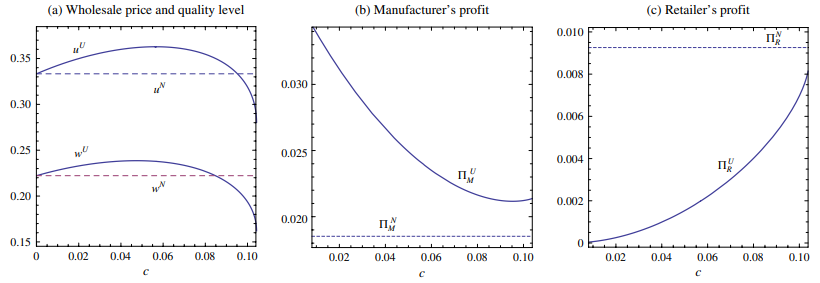
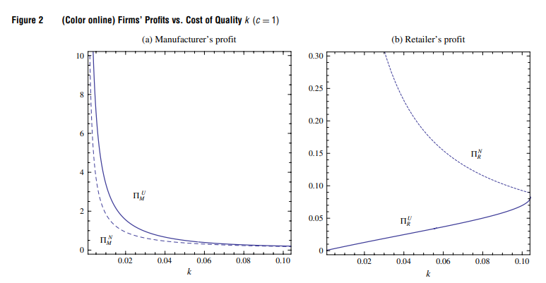
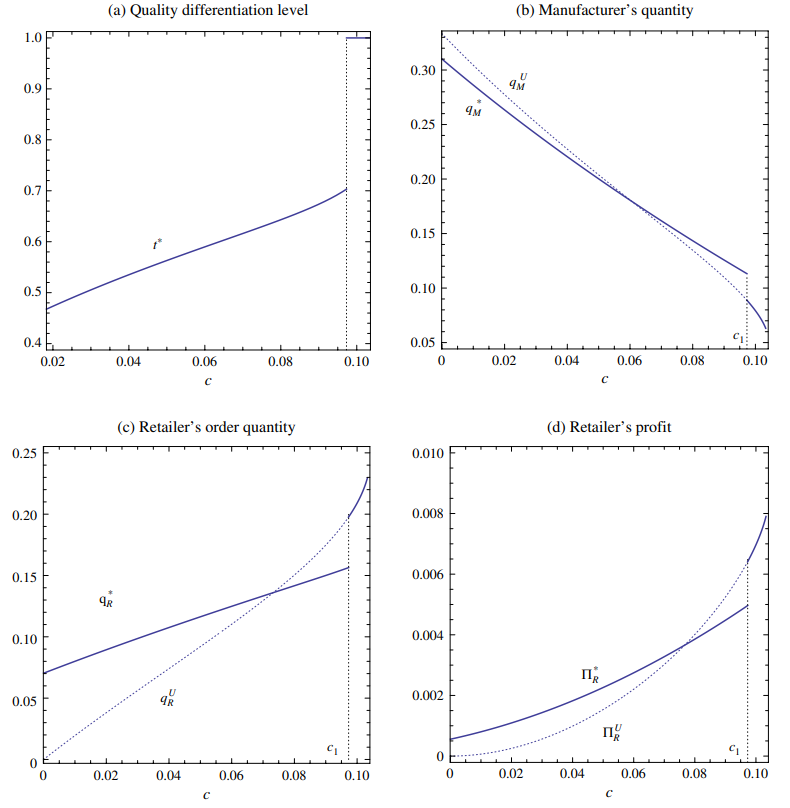
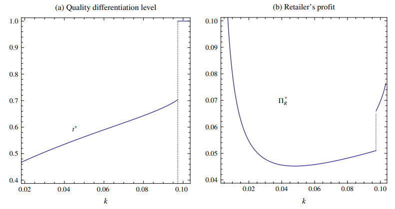
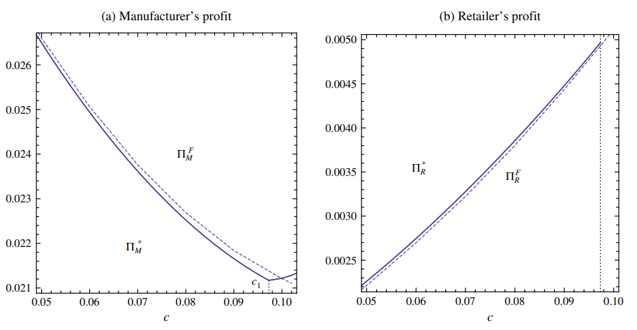
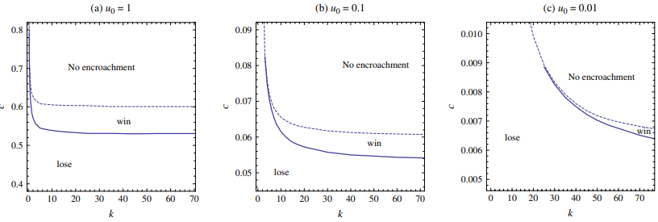
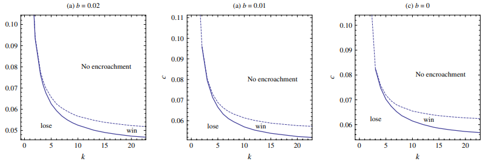

# Quality in Supply Chain Encroachment

# 3 Model and Benchmark Analysis

## 3.1 Basic Model 

$ U(u, p ; \theta)=\theta u-p $: Consumerm surplus 

- $u>0$: quality 
- $p$: price 
- $\theta\in[0,1]$: sensitivity

$q = 1-p/u$: demand 

$p = u(1-q)$: inverse demand function 

$ku^2$: manufacturer unit cost 

---

Timeline:

1. manufacturer decide $u$, $w$
2. retailer decide $q_R$
3. manufacturer decide $q_M$ (if exists)

## 3.2 Benchmark: No Encroachment

We have:

$ \Pi_{R}^{N}\left(q_{R}, w, u\right)=\left(u\left(1-q_{R}\right)-w\right) q_{R} $

By maximize it, we have:

$ q_{R}^{N}(w, u)=\frac{1}{2}-w /(2 u) $

Then for manufacturer:

$ \max _{w, u}\left(w-k u^{2}\right) q_{R}^{N}(w, u)=\max _{w, u}\left(w-k u^{2}\right)\left(\frac{1}{2}-\frac{w}{2 u}\right) $

Then:

$ w^{N}(u)=\frac{k u^{2}}{2}+\frac{u}{2} $

Then:

$ \Pi_{M}^{N}(u)=\frac{u(1-k u)^{2}}{8} \quad $ and $ \quad \Pi_{R}^{N}(u)=\frac{u(1-k u)^{2}}{16} $

Finally:

$ \Pi_{M}^{N}=\frac{1}{54 k} \quad $ and $ \quad \Pi_{R}^{N}=\frac{1}{108 k} $

# 4 Encroachment with Uniform Quality

## 4.1  Sequential Quantity Decisions

for manufacturer:

$ \max _{q_{M}}\left\{\left(w-k u^{2}\right) q_{R}+\left(u-u q_{M}-u q_{R}-c-k u^{2}\right) q_{M}\right\} $

Then we get:

$ q_{M}^{u}\left(q_{R}, w, u\right)=  \left(\frac{1}{2}-q_{R} / 2-c /(2 u)-k u / 2\right)^{+} $

Then for retailer:

$ \max _{q_{R}}\left(u\left(1-q_{R}-q_{M}^{U}\left(q_{R}, w, u\right)\right)-w\right) q_{R} $

Then we get:

$ \begin{array}{l}q_{R}^{u}(w, u)=\frac{1}{2}-\frac{w}{u}+\frac{k u}{2}+\frac{c}{2 u} \quad \text { and } \\ q_{M}^{u}(w, u)=\frac{1}{4}+\frac{w}{2 u}-\frac{3 k u}{4}-\frac{3 c}{4 u} .\end{array} $

For manufacturer:

$ \begin{array}{l}\max _{w, u}\left\{\left(w-k u^{2}\right) q_{R}^{U}(w, u)\right. \\ \left.\quad+\left(u-u q_{M}^{u}(w, u)-u q_{R}^{U}(w, u)-c-k u^{2}\right) q_{M}^{u}(w, u)\right\} .\end{array} $

Then:

$ w^{U}(u)=\frac{k u^{2}}{2}+\frac{u}{2}-\frac{c}{6} $

$ \begin{array}{c}q_{R}^{U}\left(w^{u}(u), u\right)=\frac{2 c}{3 u} \text { and } \\ q_{M}^{U}\left(w^{U}(u), u\right)=-\frac{k u}{2}-\frac{5 c}{6 u}+\frac{1}{2} .\end{array} $

Then:

$ \begin{array}{l}\Pi_{M}^{u}(u)=\frac{k^{2} u^{3}}{4}+\frac{k c u}{2}+\frac{7 c^{2}}{12 u}-\frac{k u^{2}}{2}+\frac{u}{4}-\frac{c}{2} \quad \text { and } \\ \Pi_{R}^{U}(u)=\frac{2 c^{2}}{9 u}\end{array} $

---

Weg get, retailer is better off with encroachment if and only if:

$ \frac{3\left(u-k u^{2}\right)}{4 \sqrt{2}}<c<\frac{3\left(u-k u^{2}\right)}{5} $

### Proposition 1

> (i) There exists a threshold $ \tilde{c} $ such that the manufacturer encroaches if and only if $ c<\tilde{c} $. 
> 
> (ii) Under encroachment, (a) the product quality $ u^{u} $ is first increasing and then decreasing in $ c $, and (b) there exists a threshold $ c^{u} $ such that $ u^{U} \geq u^{N} $, if $ c \leq c^{u} $ and $ u^{U}<u^{N} $ otherwise. 
> 
> (iii) When encroachment happens, the manufacturer always wins, $ \Pi_{M}^{U}-\Pi_{M}^{N}>0 $, and the retailer always loses, $ \Pi_{R}^{U}-\Pi_{R}^{N}<0 $.

## 4.2 Simultaneous quantity Decisions

### Proposition 2 

> (i) When both firms choose quantities simultaneously, there exists a threshold $ \tilde{c}^{\prime} $ such that the manufacturer encroaches if and only if $ c<\tilde{c}^{\prime} $. Under encroachment, there exists $ c_{L} $ such that the retailer always loses $ \left(\Pi_{R}^{S}<\Pi_{R}^{N}\right) $, whereas the manufacturer loses $ \left(\Pi_{M}^{S}<\Pi_{M}^{N}\right) $ if and only if $ c_{L}<c<\tilde{c}^{\prime} $. (ii) The manufacturer is more likely to encroach under simultaneous than under sequential quantity decisions: $ \tilde{c}<\tilde{c}^{\prime} $.

# 5 Encroachment with Quality Differentiation

- $u$: direct channel 
- $tu (t\in (0, 1] or t \ge 1)$: indirect channel 

### Proposition 3

> Under encroachment, the manufacturer never offers a product of strictly lower quality through the direct channel.

$\begin{array}{lccc}
\hline
c & t^{*} & u^{*} & q_{M}^{*} \\
\hline
0 \leq c < c_{1} & t^{*} = \frac{6}{5} - \frac{2}{5} \sqrt{4 - \frac{5c}{k u^{* 2}}} < 1 & u^{*} > \sqrt{\frac{4c}{3k}} & q_{M}^{*} > 0 \\
c_{1} < c \leq c_{2} & t^{*} = 1 & u^{*} < \sqrt{\frac{4c}{3k}} & q_{M}^{*} > 0 \\
c > c_{2} & \text{N/A} & \text{N/A} & q_{M}^{*} = 0 \\
\hline
\end{array}$

### Proposition 4

> (i) There exist two thresholds $ c_{1}<c_{2} $ that characterize the manufacturer's equilibrium decisions as given in Table 1. 
> 
> (ii) When encroachment happens, the manufacturer always wins $ \left(\Pi_{M}^{*}>\Pi_{M}^{N}\right) $ and the retailer always loses $ \left(\Pi_{R}^{*}<\Pi_{R}^{N}\right) $.

### Corollary 2

> Given $ c>0 $, as $ k $ increases (i) the manufacturer becomes less likely to encroach or quality differentiate (i.e., both $ c_{1} $ and $ c_{2} $ decrease); and (ii) the retailer's profit first decreases and then increases.

# 6 Extension 

## 6.1 Segmentation Through the Retailer 

No direct channel, two product through retailer:

$w_1, w_2, u_1, u_2$

### Proposition 5

> When encroachment happens, the manufacturer always wins $ \left(\Pi_{M}^{*}-\Pi_{M}^{N 2}>0\right) $, and the retailer always loses $ \left(\Pi_{R}^{*}-\Pi_{R}^{N 2}<0\right) $

## 6.2 Encroachment with Fixed cost of Quality 

$\max (ku^2, kt^2u^2)$: fixed cost of quality 

### Proposition 6

> Under encroachment, (i) quality differentiation is not optimal (i.e., $ t=1 $ ) and (ii) the manufacturer always wins and the retailer always loses.

## 6.3 No Quality Commitment for Direct Channel

(i) the manufacturer announces the product quality $ u_{R} $ and the wholesale price $ w $; 

(ii) the retailer chooses the order quantity $ q_{R} $; 

(iii) the manufacturer determines the product quality $ u_{M} $ and selling quantity $ q_{M} $.

### Proposition 7

> If the encroaching manufacturer cannot commit to a level of quality in the direct-channel product, then quality differentiation across channels is always optimal.

## 6.4 Generalized Cost Function

$\begin{cases}
b&u\le u_0\\ 
b+k(u-u_0)^2&u>u_0
\end{cases}$: unit cost

### Proposition 8

> There exists a threshold $ \bar{k}>0 $ such that 
> 
> (i) if $ k \leq \bar{k} $, then the retailer always loses from encroachment; 
> 
> (ii) if $ k>\bar{k} $, then there exist $ \underline{c} $ and $ \bar{c} $ such that the retailer wins from encroachment when $ \underline{c}<c<\bar{c} $.

