# Supplier Encroachment with Multiple Retailers

# 3 Model Setting 

$s$: Supplier 

$r_i, i = 1, 2, \cdots, n$: Retailers 

$n$: number of retailers 

$w$: wholesale price 

$p=a-Q$: inverse demand function 
- $a>0$: market potential 
- $Q$: total quantity in market 
- $p$: market clearing price 

For $Q$:

- $Q = \sum_{i=1}^nq_{r_i}$: Only retailer 
  - $q_{r_i} $: $r_i $ retailer's quantity 
- $Q = \sum_{i=1}^nq_{r_i} + q_s$: Encroachment
  - $q_s$: selling quantity 

$c$: supplier unit selling cost 
- $c\in(0,a)$

$0$: retailer's unit selling cost 

---

Decision sequence:

1. Supplier decide $w$
2. retailers determine $q_{r_i}$ simultaneously 
3. supplier decide $q_s$

# Analysis 

## No Supplier Encroachment 

Profit function:

$ \pi_{s}=w \sum_{j=1}^{n} q_{r_{j}} $ 
$ \pi_{r_{i}}=\left(a-\sum_{j=1}^{n} q_{r_{j}}^{n}-w\right) q_{r_{i}}^{n} $

$r_i $'s order given $w$:

$ q_{r_{i}}(w)=\dfrac{a-w}{(n+1)}, i=1,2, \cdots, n $

Then $w$:

$w^n = \dfrac{a}{2}$

Then:

$ q_{r_{i}}^{n}=\dfrac{a}{2(n+1)}, \pi_{r_{i}}^{n}=\dfrac{a^{2}}{4(n+1)^{2}} $ and $ \pi_{s}^{n}=\dfrac{n a^{2}}{4(n+1)} $

Then:

### Proposition 1

> When the supplier cannot encroach into the retail market, in equilibrium,
>
> 1. the optimal wholesale price $ w^{n} $ is independent of $ n $, the number of downstream retailers;
> 
> 2. each retailer's order quantity $ q_{r_{i}}^{n} $. $ i=1,2, \cdots, n $, decreases in $ n $ while the total demand of all retailers $ \sum_{j=1}^{n} q_{r_{j}}^{n} $ increases in $ n $;
> 
> 3. the supplier's profit $ \pi_{s}^{n} $ increases in $ n $ while that of a retailer $ \pi_{r_{i}}^{n} $ decreases in $ n $. The total supply chain profit $ \pi_{c}^{n}=\pi_{s}^{n}+\sum_{j=1}^{n} \pi_{r_{j}}^{n} $ increases in $ n $.

## 4.2 Potential Supplier Encroachment 

Now:

#### (1)

$ \pi_{s}=w \sum_{j=1}^{n} q_{r_{j}}+\left(a-\sum_{j=1}^{n} q_{r_{j}}-q_{s}-c\right) q_{s} $

Then:

#### (2)

$ q_{s}\left(q_{r_{i}}\right)=\left(\frac{a-\sum_{j=1}^{n} q_{r_{j}}-c}{2}\right)^{+} $

Then:

$ \pi_{r_{i}}=\left(a-\sum_{j=1}^{n} q_{r_{j}}-q_{s}\left(q_{r_{i}}\right)-w\right) q_{r_{i}} $

Then:

#### (3)

$ \left(q_{r_{i}}(w), q_{s}(w)\right)=\left\{\begin{array}{ll}\left(\frac{a+c-2 w}{(n+1)}, \frac{a-(2 n+1) c+2 n w}{2(n+1)}\right) & \text { if } w>\frac{(2 n+1) c-a}{2 n} ; \\ \left(\frac{a-c}{n}, 0\right) & \text { if } \frac{(n+1) c-a}{n}<w \leq \frac{(2 n+1) c-a}{2 n} ; \\ \left(\frac{a-w}{(n+1)}, 0\right) & \text { if } w \leq \frac{(n+1) c-a}{n} .\end{array}\right. $

Then we get:

$ \pi_{s}(w)=\left\{\begin{array}{ll}n w \frac{a+c-2 w}{(n+1)}+\left(\frac{a-(2 n+1) c+2 n w}{2(n+1)}\right)^{2}, & \text { if } w>\frac{(2 n+1) c-a}{2 n} ; \\ w(a-c), & \text { if } \frac{(n+1) c-a}{n}<w \leq \frac{(2 n+1) c-a}{2 n} \\ n w \frac{a-w}{(n+1)}, & \text { if } w \leq \frac{(n+1) c-a}{n} .\end{array}\right. $

Following Proposition:

### Proposition 2

> When the supplier has the option to encroach into the retail market, the supplier encroaches only when his unit direct-selling $ \cos t c \leq \underline{c} $ and never encroaches when $ c>\bar{c} $, where:
>
> $ \bar{c}=\frac{2(n+1)^{2}+n \sqrt{2(n+1)}}{2(n+1)(2 n+1)} a $ and $ \underline{c}=\frac{n+2}{2+3 n} a $

### Table 1 Equilibrium Wholesale Price, Quantities and Profits: Potential Encroachment
$$
\begin{array}{lcccc}
\hline 
 & \text{Encroachment occurrence (EO)} & \text{Threat of encroachment (TE)} & \text{No encroachment (NE)} \\
\hline 
& \boldsymbol{c} \leq \boldsymbol{\underline{c}} & \underline{\boldsymbol{c}} < \boldsymbol{c} \leq \overline{\boldsymbol{c}} & \boldsymbol{c} > \overline{\boldsymbol{c}} \\
\hline 
\boldsymbol{W}^{en} & \dfrac{(n+2) a - n c}{2(n+2)} & \dfrac{(2n+1) c - a}{2n} & \dfrac{a}{2} \\
q_{r_{i}}^{en} & \dfrac{2c}{(n+2)} & \dfrac{a - c}{n} & \dfrac{a}{2(n+1)} \\
q_{s}^{en} & \dfrac{(n+2) a - (2 + 3n) c}{2(n+2)} & 0 & 0 \\
\pi_{r_{j}}^{en} & \dfrac{2c^{2}}{(n+2)^{2}} & \dfrac{(a - c)^{2}}{2n^{2}} & \dfrac{a^{2}}{4(n+1)^{2}} \\
\pi_{s}^{en} & \dfrac{n c((n+2) a - n c)}{(n+2)^{2}} + \dfrac{((n+2) a - (2 + 3n) c)^{2}}{4(n+2)^{2}} & \dfrac{((2n+1) c - a)(a - c)}{2n} & \dfrac{n a^{2}}{4(n+1)} \\
\hline
\end{array}
$$

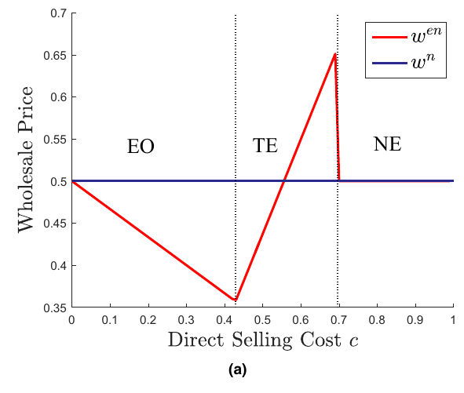

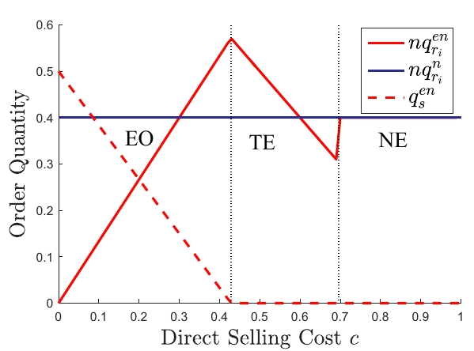

### Corollary 1

> When the supplier has the option to encroach into the retail market, in equilibrium
> 
> 1. the two direct-selling cost thresholds $ \underline{c} $ and $ \bar{c} $ both decrease in $ n $;
> 
> 2. the optimal wholesale price $ w^{e n} $ decreases in $ n $ under encroachment occurrence while increases in $ n $ under the threat of encroachment.
> 
> 3. Each retailer's order quantity $ q_{r_{i}}^{e n} $ decreases in $ n $. Nonetheless, the total order quantity $ \Sigma_{j=1}^{n} \eta_{r_{j}}^{e n} $ remains constant (i.e., $ \Sigma_{j=1}^{n} q_{r_{j}}^{e n}=a-c $ ) under the threat of encroachment, and increases in $ n $ under encroachment occurrence.

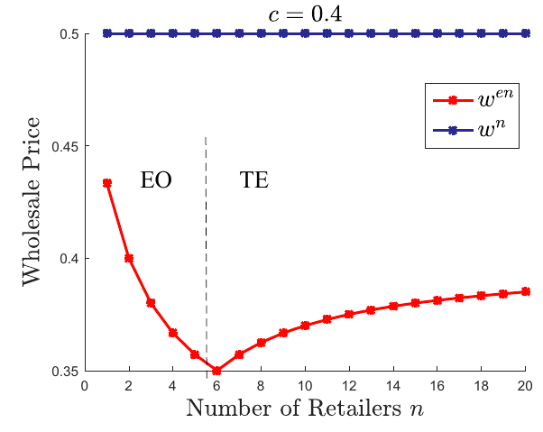

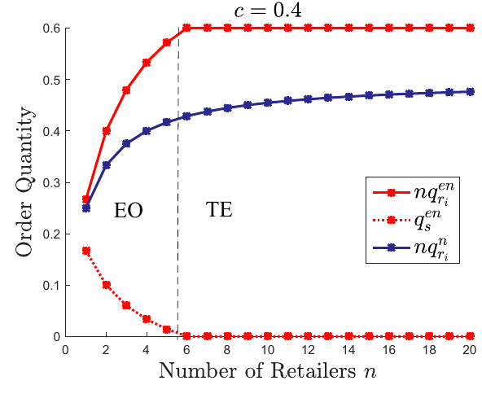

## 4.3 Impact of Supplier Encroachment

### Proposition 3

> When the supplier can encroach into the retail market, in equilibrium
>
> 1. if the number of retailers $ n>4 $, a retailer is always worse off with supplier encroachment. 
> 
> 2. if $ n \leq 4 $, a retailer can benefit from supplier encroachment when the direct-selling cost $ c \in\left[\underline{c}_{r}, \bar{c}_{r}\right] $, where $ \underline{c}_{r}=\frac{\sqrt{2}(n+2) a}{4(n+1)} $ and $ \bar{c}_{r}=\frac{2(n+1)-\sqrt{2} n}{2(n+1)} a $.

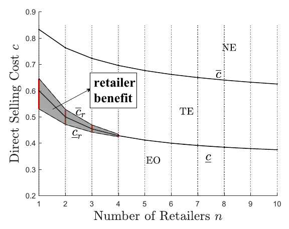

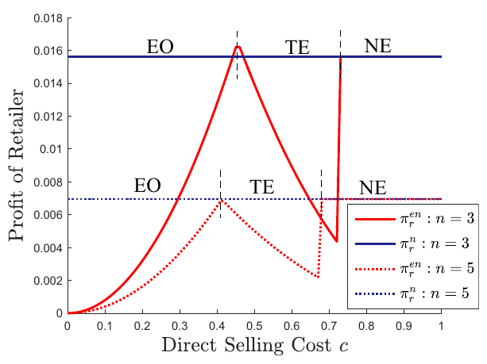

### Proposition 4

> When the supplier can encroach into the retail market, in equilibrium
>
> 1. if the number of retailers $ n<3 $, the supplier always benefits from having the option to encroach into the retail market. 
> 
> 2. if $ n \geq 3 $, the supplier becomes worse off when being endowed with the option of encroachment if his direct-selling cost $ \mathcal{C}_{s} \leq c \leq \bar{c}_{s} $, where $ \underline{c}_{s}=\frac{(n+1)(n+2)-\sqrt{n(n+1)(n-2)(n+2)}}{5 n^{2}+7 n+2} a $ and $ \bar{c}_{s}=\min $ $ \left\{\frac{(n+1)(n+2)+\sqrt{n(n+1)(n-2)(n+2)}}{5 n^{2}+7 n+2} a, \frac{2(n+1)^{2}-n \sqrt{2(n+1)}}{2(n+1)(2 n+1)} a\right\} $.

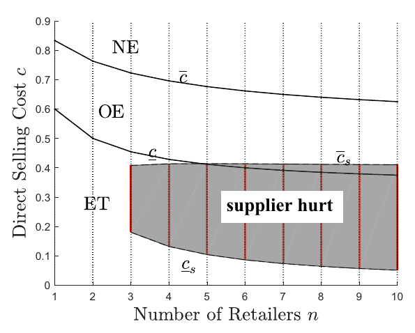

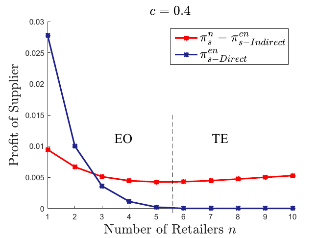

# Discussion 

## 5.1 Market Penetration via Channel Expansion

### Proposition 5

> When there are $ n $ incumbent retailers in his indirect distribution channel, the supplier should encroach into the retail market and direct sell when his direct-selling cost
>
> $\begin{array}{c} c \in\left[0, \frac{n+2-\sqrt{n^{2}-n+2}}{5 n+2} a\right] \cup\left[\frac{2(n+1)(n+2)-\sqrt{2 n(n-1)(n+2)}}{2(2 n+1)(n+2)} a,\right. \\ \left.\frac{2(n+1)(n+2)+\sqrt{2 n(n-1)(n+2)}}{2(2 n+1)(n+2)} a\right] . \end{array} $
>
> Otherwise, the supplier should enroll a new retailer into his indirect channel.

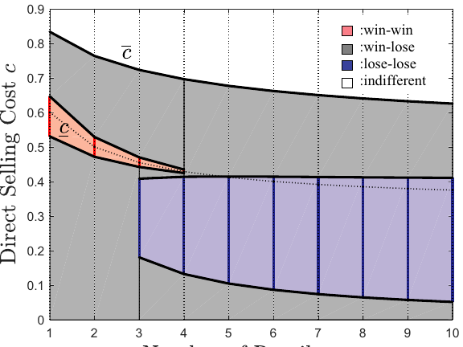

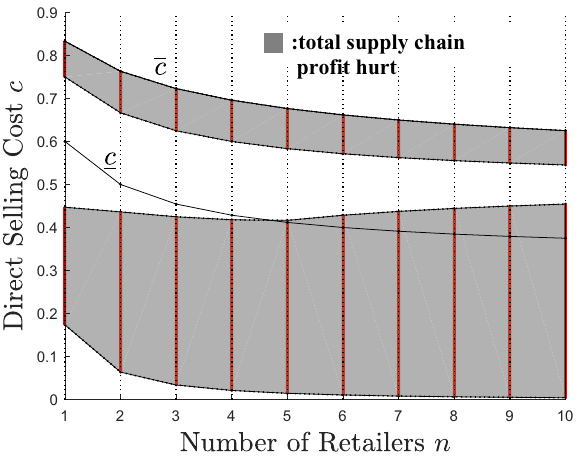

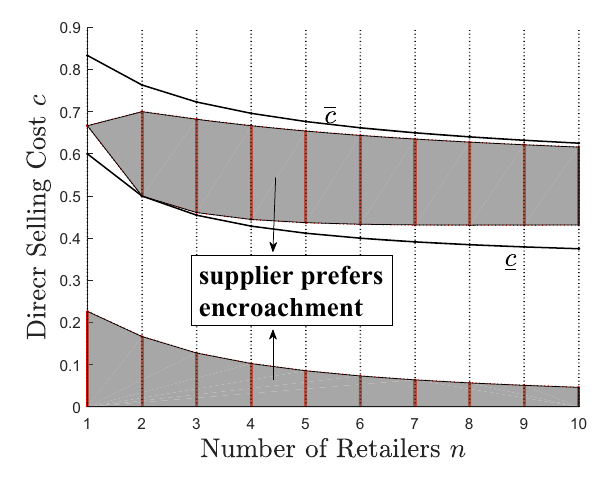

## 5.2 Imperfect Product Substitution

Then:

$ p_{r_{i}}=a-\sum_{j=1}^{n} q_{r_{j}}-\theta q_{s^{\prime}}, i=1,2, \cdots, n $ and $ p_{s}=a-q_{s}-\theta \sum_{j=1}^{n} q_{r_{j}} $

- $ 0<\theta \leq 1 $

$ \begin{array}{l}\pi_{s}=w \sum_{j=1}^{n} q_{r_{j}}+\left(a-\theta \sum_{j=1}^{n} q_{r_{j}}-q_{s}-c\right) q_{s^{\prime}} \\ \pi_{r_{i}}=\left(a-\sum_{j=1}^{n} q_{r_{j}}-\theta q_{s}-w\right) q_{r_{i}}, i=1,2, \cdots, n\end{array} $

### Proposition 6

> When the channels are imperfect substitutes, the equilibrium wholesale price, quantities and profits are as shown in Table 2. Moreover,
>
> 1. if $ n \leq\left[\frac{2\left(2-\theta^{2}\right)+2 \sqrt{2\left(2-\theta^{2}\right)}}{\theta^{2}}\right] $, the retailer can benefit from supplier encroachment when $ c \in\left[\underline{c}_{r-\theta}, \bar{c}_{r-\theta}\right] $, where $\begin{array}{l}\text { where } \quad \bar{c}_{r-\theta}=\frac{\sqrt{2\left(2-\theta^{2}\right)}(n+1)-n \theta}{\sqrt{2\left(2-\theta^{2}\right)}(n+1)} a \\\underline{c}_{r-\theta}=\frac{4(n+1)-(3 n+2) \theta^{2}-2(1-\theta) \sqrt{2\left(2-\theta^{2}\right)(n+1)}}{2 \theta \sqrt{2\left(2-\theta^{2}\right)}(n+1)} a\end{array}$
>
> 2. if $ n \geq 3 $, the supplier becomes worse off when being endowed with the option of encroachment when $ c \in\left[\underline{c}_{s-\theta}, \overline{\mathcal{C}}_{s-\theta}\right] $, where 
> 
> $ \underline{\mathcal{C}}_{s-\theta}=\frac{4 n^{2} \theta^{2}-8 n^{2} \theta+4 n^{2}+n \theta^{2}-8 n \theta+8 n-2 \theta^{2}+4}{(2-\theta)^{2} n^{2}+\left(8-4 \theta-\theta^{2}\right) n+4-2 \theta^{2}+\theta \sqrt{n\left(-n^{2}+n+2\right)\left(2 \theta^{2}-4 n+3 n \theta^{2}-4\right)}} a $, and 
> 
> $ \bar{c}_{s-\theta}=\min \left(\frac{\left((4-2 \theta) n+4-2 \theta^{2}\right)(n+1)-\theta^{2} n \sqrt{2(n+1)}}{4 n^{2}-2 n \theta^{2}+8 n-2 \theta^{2}+4} a\right. $, $ \left.\frac{4 n^{2} \theta^{2}-8 n^{2} \theta+4 n^{2}+n \theta^{2}-8 n \theta+8 n-2 \theta^{2}+4}{(2-\theta)^{2} n^{2}+\left(8-4 \theta-\theta^{2}\right) n+4-2 \theta^{2}-\theta \sqrt{n\left(-n^{2}+n+2\right)\left(2 \theta^{2}-4 n+3 n \theta^{2}-4\right)}} a\right) $. where 
> 
> $ \bar{c}_{\theta}=\frac{\left((4-2 \theta) n+4-2 \theta^{2}\right)(n+1)+\theta^{2} n \sqrt{2(n+1)}}{\left(4 n+4-2 \theta^{2}\right)(n+1)} a $ and $ \mathcal{c}_{\theta}=\frac{4-2 \theta^{2}+\left(4-2 \theta-\theta^{2}\right) n}{4-2 \theta^{2}+\left(4-\theta^{2}\right) n} a $.

### Corollary 2

> When the direct and indirect channels are imperfect substitutes, the thresholds stated in Proposition $ 6, \bar{c}_{r-\theta}, \underline{c}_{r-\theta}, \bar{c}_{s-\theta}, \underline{c}_{s-\theta} $ all decrease in $ \theta $

$\begin{array}{|c|c|c|c|}
\hline 
 & \text{Encroachment occurrence} 
\boldsymbol{C} < \underline{\boldsymbol{C}}_{g}
& \text{Threat of encroachment} 
\underline{\boldsymbol{c}}_{\theta} < \boldsymbol{c} \leq \overline{\boldsymbol{c}}_{\theta}& \text{No encroachment} 
c \geq \overline{\boldsymbol{c}}_{\theta}\\
\hline 
W^{\text{en}} & \dfrac{\left(4 - 2 \theta^{2} + n \theta^{5} + 4 n\left(1 - \theta^{2}\right)\right) a - n \theta^{3} c}{8(1 + n) - 2(3 n + 2) \theta^{2}} & \dfrac{\left(2 \pi + 2 - \theta^{2}\right) c - \left(2 \pi(1 - \theta) + \left(2 - \theta^{2}\right)\right) a}{2 \pi \theta} & \dfrac{a}{2} \\
\hline 
q_{r_{i}}^{en} & \dfrac{2(1 - \theta) a + 2 c \theta}{4(1 + n) - (3 n + 2) \theta^{2}} & \dfrac{a - C}{n G} & \dfrac{a}{2(n + 1)} \\
\hline 
q_{s}^{\text{en}} & \dfrac{\left(4 - 2 \theta^{2} + \left(4 - 2 \theta - \theta^{2}\right) n\right) a - \left(4 - 2 \theta^{2} + \left(4 - \theta^{2}\right) \pi\right) c}{8(1 + \pi) - 2(3 n + 2) \theta^{2}} & 0 & 0 \\
\hline 
\pi_{r_{j}}^{en} & \dfrac{2\left(2 - \theta^{2}\right)(a(1 - \theta) + c \theta)^{2}}{\left(4(n + 1) - (3 n + 2) b^{2}\right)^{2}} & \dfrac{\left(2 - \xi^{2}\right)(\bar{a} - c)^{2}}{2 \pi^{2} \theta^{2}} & \dfrac{a^{2}}{4(n + 1)^{2}} \\
\hline 
\pi_{s}^{en} & \dfrac{\left(4 - 2 \theta^{2} + m \theta^{2}\right)(a - c)^{2} + 8 n(1 - \theta)(a - c) a + 4 n c^{2}}{16(n + 1) - 4(3 n + 2) \theta^{2}} & \dfrac{\left(\left(2 \pi + 2 - \theta^{2}\right) c - \left(2 n(1 - \theta) + 2 - \theta^{2}\right) a\right)(a - c)}{2 \pi \theta^{2}} & \dfrac{n a^{2}}{4(n + 1)} \\
\hline
\end{array}$

## 5.3 Costly Channel Expansion 

$f$: fixed cost to enroll a retailer 

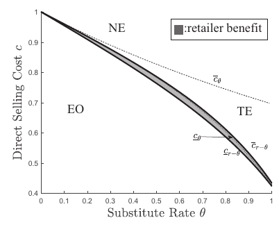

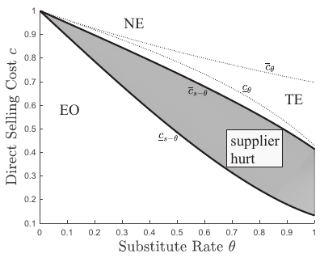

### Proposition 7

> When the supplier can proactively choose the number of retailers to enroll into his indirect channel, the equilibrium encroachment strategy, the optimal number of enrolled retailers and equilibrium profits are presented in Table 3, where $ n^{\text {enf }} $ is a real number, $ n^{e n f *} $ is an integer, 
> 
> $\bar{c}_{f}=\frac{a+\sqrt{2 f}+\sqrt{2(2-\sqrt{2}) a \sqrt{f}-2 f}}{2} \text { and }_{c_{f}}=\frac{2 \sqrt{2 f}+a}{3} $

$
\begin{array}{|c|c|c|c|}
\hline 
 & \text{Encroachment occurrence} 
\text{(EO) } c \leq \underline{c}_{f} & \text{Threat of encroachment} 
\text{(TE) } \underline{\boldsymbol{c}}_{f} < \boldsymbol{c} \leq \overline{\boldsymbol{c}}_{f} & \text{No encroachment (NE)} 
\boldsymbol{c} > \overline{\boldsymbol{c}}_{f} \\
\hline 
n^{\text{ent}} & c \sqrt{\dfrac{2}{7}} - 2 & \dfrac{a - c}{\sqrt{2 f}} & \dfrac{a}{2 \sqrt{f}} - 1 \\
\hline 
n^{\text{enf*}} &  \arg \max _{n \in\left\{\left\lfloor n^{e n t}\right\rfloor,\left\lfloor n^{e n t}\right\rfloor+1,\left\lfloor n^{n t}\right\rfloor,\left\lfloor n^{n t}\right\rfloor+1\right\}} \pi_{s}^{e n f}(n)  & & \\
\hline 
\pi_{r_{j}}^{\text{enf}}\left(n^{\text{enf}}\right) & f & f & f \\
\hline 
\pi_{s}^{\text{enf}}\left(n^{\text{anf}}\right) & (c - \sqrt{2 f})^{2} + \dfrac{(a - c)^{2}}{4} & (c - \sqrt{2 f})(a - c) & \dfrac{(a - 2 \sqrt{f})^{2}}{4} \\
\hline
\end{array}
$

### Proposition 8

> When retailers make their ordering decisions sequentially
>
> 1. if $ n \leq 6 $, retailer $ r_{1} $ can benefit from supplier encroachment when $ c \in\left[\underline{c}_{r-S}, \bar{c}_{r-S}\right] $, where 
> 
> $\begin{array}{l} \underline{c}_{r-S}=\min \left\{\frac{2^{n}+1}{2^{n+3 / 2}} a, \underline{c}_{S}\right\}, \\ \bar{c}_{r-S}=\left(1-\frac{2^{2 n}-2^{n+1}+2}{\sqrt{2^{n+2}\left(2^{3 n-1}+2^{2 n}-2-2^{n} \sqrt{2^{n-1}\left(2^{n}-2\right)}\right)}}\right) a \text { and } \\ \underline{c}_{S}=\left(2^{n}+1\right)\left(3 \times 2^{2 n}-2^{n+1}+2-\sqrt{2^{n+3}\left(2^{n}-2\right)}\right. \\ \frac{\left.\left.-2 \sqrt{2} \sqrt{\left(2^{n}+1\right)^{-1}\left(2^{2 n}-2^{n+1}+2\right)\left(2^{n}-1\right) \sqrt{2^{n+1}\left(2^{n}-2\right)}-2^{n}\left(2^{n}-2\right)}\right)\right)}{9 \times 2^{3 n}-13 \times 2^{2^{n}}+2^{n+4}-2-\left(2^{n+1}+2\right) \sqrt{2^{n+1}\left(2^{n}-2\right) a}} \end{array}$
> 
> 2. Retailer $ r_{i}, i=2,3, \cdots, n $, is always worse off with supplier encroachment. 
> 
> 3. if $ n \geq 2 $, the supplier becomes worse off when being endowed with the option to encroach if $ c \in\left[\underline{c}_{s-S}, \bar{c}_{s-S}\right] $, where $ \underline{c}_{s-S}= $ $ \frac{2^{n}\left(2^{n}+1\right)-\sqrt{2^{n}\left(2^{n}-1\right)\left(2^{n}-3\right)\left(2^{n}+1\right)}}{5 \times 2^{2 n}-3 \times 2^{n}} a \quad $ and $ \quad \bar{c}_{s-S}= $ $ \frac{2^{3 n}-2^{n} \sqrt{2^{n+1}\left(2^{n}-2\right)}-\sqrt{2^{n}\left(2^{2 n-1}-2^{n}+1\right)\left(\left(2^{n}-1\right) \sqrt{2^{n+1}\left(2^{n}-2\right)}+2\right)}}{2^{n}\left(2^{2 n+1}-2^{n+1}+2-\sqrt{2^{n+1}\left(2^{n}-2\right)}\right)} a $.

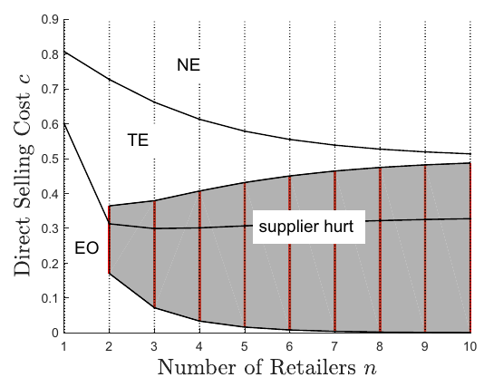

