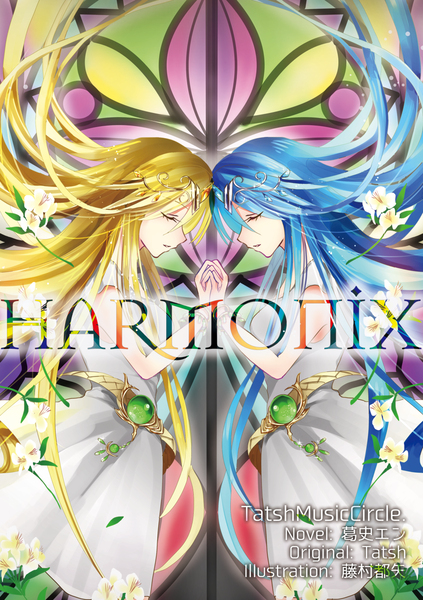
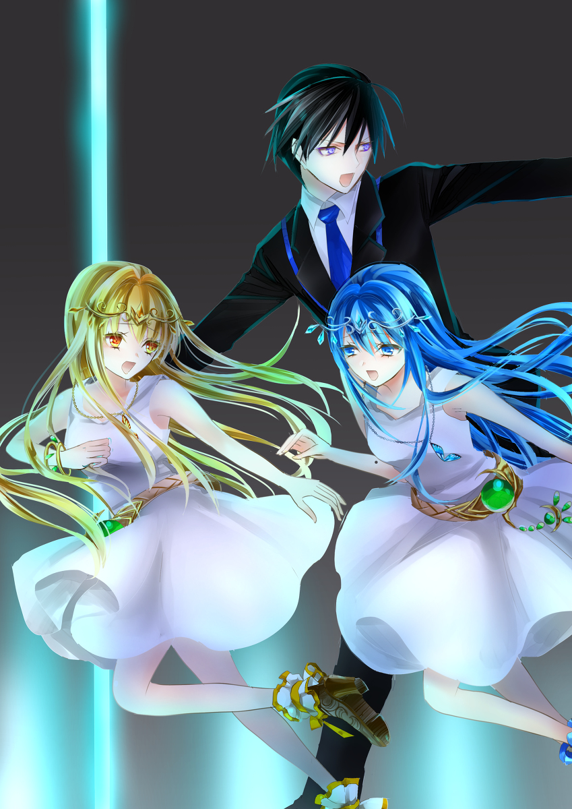
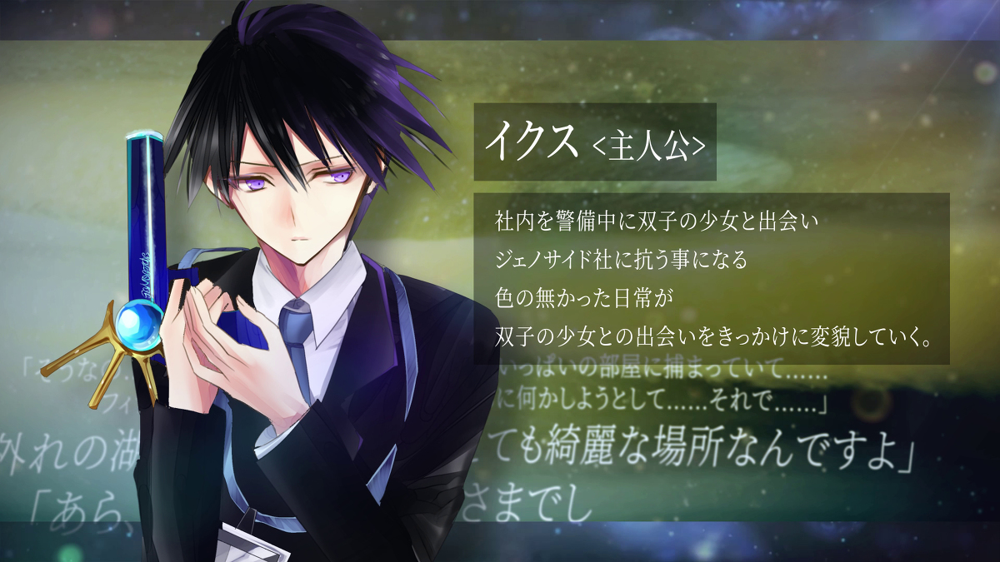
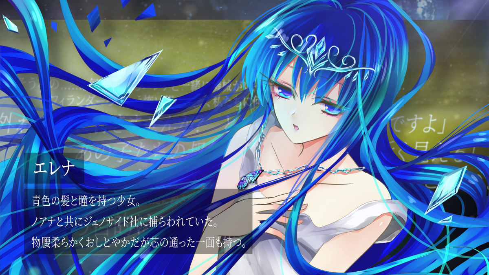
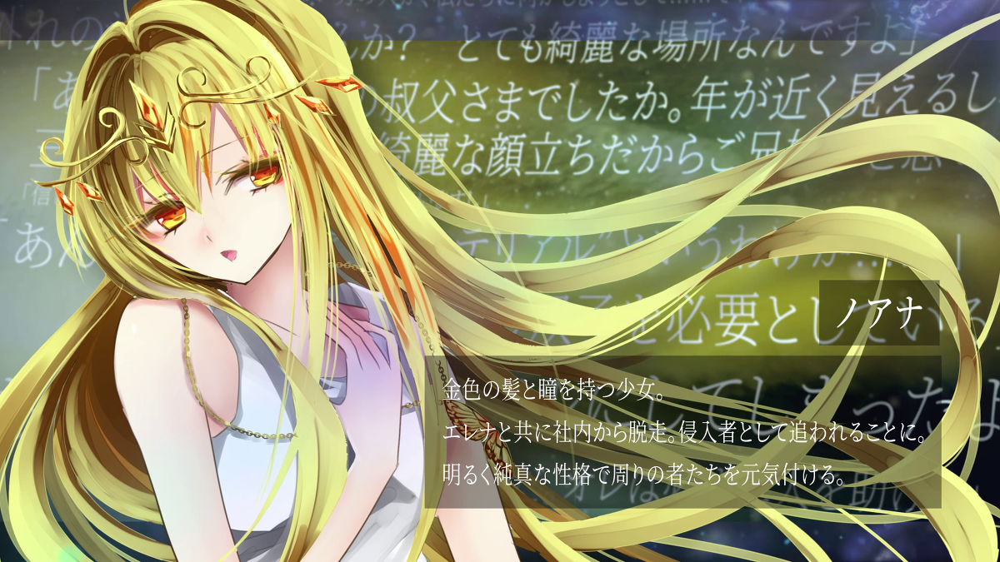

原文来源: [pixiv novel 12254460](https://www.pixiv.net/novel/show.php?id=12254460)
系列: 音楽†SFファンタジー HARMONIX
顺序: 1

### Prologue　双子の少女

「エレナさん、ノアナさん。先に行ってください」

　庇う形で先を走らせていた二人の少女に声をかけ、自身は銃を抜きながら振り返る。慣れた動作で追っ手に照準を合わせるが、その手は今にも震え出しそうだ。

　今、イクスが銃口を向けているのは、つい先ほどまで同僚だった者たちだ。

　侵入者は即座に排除がジェノサイド社のルール。侵入者の少女たちを庇ったイクス自身も今は射殺対象となっていた。
　追っ手の中には当然見知った顔も見られる。イクスは動揺するなと自身に言い聞かせた。一瞬でも迷えばこちらがやられる。そうなる前に、対処する必要があった。

　とはいえ、彼らをできるだけ殺したくはない。狙うなら脚か、肩。もしくは武器だと瞬時に判断する。
　極めて冷静な思考の先で、イクスの身体がそれを追従しようとしたとき、

「イクス様！！」

　背後から悲痛なまでの声が投げかけられた。

　思わず振り返ると、祈るように胸の前で両手を握りしめるエレナの姿が見えた。深い水の中を思わせる蒼色の髪がふわりと舞い、同色の美しい瞳が不安げにこちらへ向けられている。自分ではなくイクスの身を案じているのだと、その揺れる瞳から察せられた。

「エレナ、危ないよ！　イクスくんの邪魔になっちゃう！！」

　もう一人の少女、ノアナがそんなエレナの手を必死に引いている。エレナと鏡映しのような見目をしたノアナだが、髪と瞳の色だけが異なる。エレナの落ち着いた蒼とは対照的に、ノアナの髪と瞳は太陽を思わせる暖かな金色だった。

　二人とも肩の露出した白色のワンピースに、簡素なブーツを履いているだけだ。むしろそれが、この少女たちの美しさを際立たせていた。趣向を同じくするお揃いの銀細工の髪飾りや、蝶の羽根を象ったアクセサリーもとても良く似合っている。

　ようやくノアナがエレナの手を引いて走り出したものの、ノアナもしきりにイクスを気にしている様子だ。この先に敵の気配はないから、追っ手たちから見えなくなる所まで逃げて欲しいのに、いつまでもイクスの姿が見える範囲を超えようとしない。

「お人好しな双子だ……」

　イクスは呆れながら、再度追っ手と向かい合った。相手は三人だ。

　先頭の一人が銃を構えようとしたのを見て、その肩口を撃った。衝撃から銃を手放して驚愕を浮かべている。その顔をイクスは見知っていて、心がズキリと痛んだ気がした。

　それに耐えて二発目を準備する。残る二人も無力化せねばならない。

　状況確認。一人は既に銃を構えており、もう一人は先ほど無力化した追っ手の影に隠れていて撃ち抜くのは困難。一度射線を切ることも考えたが、自分が避けることで万が一にでも背後の少女たちに当てるわけにはいかなかった。

　即座に行動を決めた。

　銃を構えていた側が発砲。銃口から飛び出した弾の軌道を読み切り、自らも発砲してそれを打ち落とす。銃声の余韻が廊下に尾を引いた。

　弾丸を弾丸で落とされるという事態に呆然となった相手。次の弾でその脚を撃ち抜く。

　残るは一人。無力化した追っ手の影に身体が隠れていて狙える場所がなかった。

　それでもイクスは構わず撃った。目にも止まらぬ早撃ちだが、あさっての方向に放たれている。

　しかし次の瞬間、突如として高らかな金属音が空中で鳴り響いたかと思うと、壁に当たった弾が鋭角に曲がり、その軌道を変えた。それが必然の軌道とばかりに、弾丸は最後の追っ手の脚を死角から撃ち抜いた。

　仕上げとばかりにイクスはダン、ダン、ダンと三発の弾丸を放ち、追っ手の銃を全て破壊する。これで機動力と武装の排除が完了だ。

　あっという間の出来事だった。廊下には三人分のうめき声だけが重く響いている。

　そんな追っ手たち——元同僚をイクスは一瞥して、迷いを振り切るような気持ちで一度ゆっくりと目を閉じた。

　すぐに踵を返して、二人の少女の元へ急ぐ。

「イクス様！　お怪我は！？」

「イクスくん！　怪我してない！？」

　声を揃えて、抱きつかんばかりに双子が出迎えた。

「大丈夫です。それより急ぎますよ。じきにまた追っ手がかかる」

　かわいそうなくらい取り乱すエレナとノアナをなだめながら、イクスは先を急いだ。

おそらくジェノサイド社から脱出するだけでは不十分だ。列車に乗って、遠くまで逃げる必要があった。そしてその後はどうする？

（オレは何をやっているんだ……）

　この先を想定しながらイクスは思った。今日も代わり映えのしない一日を無為に過ごすはずだったのに、とんだ事態に巻き込まれたものだと。

　それ以上に不思議なのはこの双子だった。イクスがこの二人の少女と出会ったのはつい先ほどのことだ。侵入者として追われる彼女たちを、本来はイクスも追う側の人間だったはずなのだ。

　なのにそれができなかった。気がつけば、ジェノサイド社と同僚たちを裏切り、二度と引き返せない道を歩み出している。

（オレはどうしてこんな事を……）

　不思議なことに後悔の念は微塵も湧いてこない。

　むしろ、今度こそは絶対に離れてやらないとばかりに、必死に身を寄せてくる二人の少女を放っておくことはこの先もどうやらできそうもないと柄にもなく強い使命感を抱いていた。

