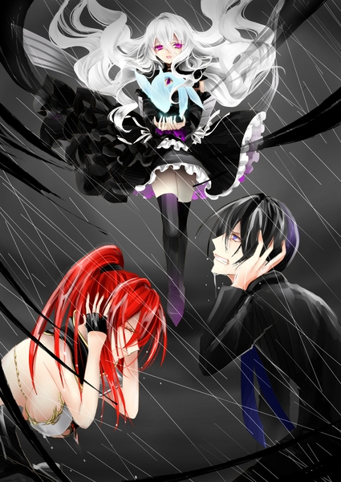
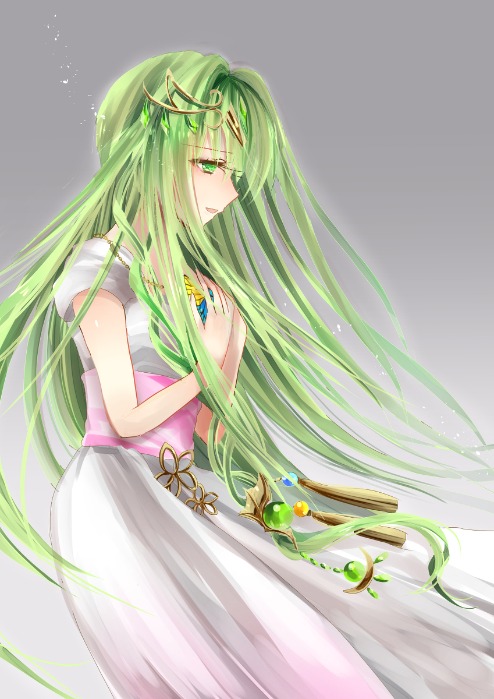

原文来源: [pixiv novel 13928581](https://www.pixiv.net/novel/show.php?id=13928581)
系列: 音楽†SFファンタジー『TEARED』HARMONIXシリーズ
顺序: 3

屋敷に戻る頃には雨が降っていた。

すっかり濡れてしまった髪から水滴が流れ、イクスの視界を悪くした。

「おかしいな……さっきまで晴れてたのに」

山の天気は変わりやすいと言うものの、これだけのどしゃ降りにあうのも珍しい。漠然と嫌な予感がイクスの脳裏をよぎった。

「イクスくん、行こう。急がないと……」

「ええ………………」

同じくずぶ濡れのレイラに向かって頷き、屋敷の入口へと走って向かう。雨のせいだろうか。屋敷は不思議なほどに静まり返っていた。はじめてここに来た時よりも陰鬱な気配を漂わせている。

嫌な雨だ。

見ると、門の前でメイドが立っていた。急いできたのだろうか。傘もささずに立っている。わざわざ出迎えに来てくれたらしい。

「すみません、わざわざ……ん？」

駆け寄ったイクスがメイドに声をかけるが、反応がない。門の前で立ち尽くすメイドの顔はぞっとするほどに虚ろだった。

「！？だ、大丈夫ですか！？」

声をかけながらイクスが肩を揺さぶっても何も言わない。それどころか、糸の切れた人形のようにその場に倒れこんでしまう。

「レイラさん、これ……！」

「うん、何かあったんだ……！！気を引き締めて――きゃあ！？」

不意に、雷のような衝撃がイクスとレイラを襲った。

視界が黒く眩む。

びゅうびゅうと、叩きつけるように泣き叫ぶ風が全身を揺さぶった。その強い轟音が“音”であることに一拍遅れて気付く。かきむしりたいほどの胸の苦しさにイクスはその場で崩れ落ちた。

頭の中で少女の笑い声が聞こえる。無邪気なのに、どこか悪意をはらんだ不気味な笑い声だった。

「あら、遅いお帰りね」

いつの間にか、目の前に黒い少女が立っていた。フリルのドレスを優美な黒に染め上げ、凛とした華のような佇まいだった。こんな雨の中だと言うのに不思議と濡れることなく、悠然とイクスを見下ろしている。冷えた瞳が紫に輝いた。

どこかで見たことがある気がして、イクスは必死に少女を見つめる。長い白髪に紫の目。夜を思わせる真っ黒いドレス。マテリアルの所持者を襲撃しているとして、ジェノサイド社に警戒されていたあの少女だ。

「でも残念。マテリアルはもう、頂いてしまったの」

少女の両手には青いマテリアルが抱えられていた。凍りついてしまったかのように澄んだ、水魚のマテリアル。ロードの持ち物であったはずのものだ。

ロードから奪われたのだ。

理解しても、イクスは動けずにいた。何故か指がぴくりとも動かせない。疑問に思うイクスの心を読んだかのように少女は笑った。

「ええ、そうよ？あなたを止めているのは私。あなたの“心”を捕らえているのはこの私よ」

白くて細い指先がイクスの胸を軽くつつく。息苦しさが増したような気がして、イクスは小さく呻いた。耳元でがなりたてる風の“音”が止まない。風が絡み付く糸となって、手足を縛り付けているようだ。逃れようとすればする程、風の糸は全身に絡まりついた。

「ほどけないでしょう？ほどけないのよ……ふふふ、ねえ、赤い髪の素敵なお姉様？あなたも、諦めてしまいましょう？苦しいでしょう？辛いでしょう？いいのよ、諦めて。お人形になってしまった方が楽でしょう？」

隣に居たレイラもイクスと同じように膝をつき、苦悶の表情を浮かべている。イクスと同じ“音”に襲われているのか、耐えがたいものを聞いているかのように片耳を手でふさいでいた。

「誰……あなたは……」

レイラの質問を少女は笑った。

「くだらない問いかけね、お姉様。私に名前はないわ。ティアは私たちに名前をくれないんだもの」

ティア。

イクスは無意識のうちにその名を呟いた。

「あら嬉しい。黒い髪のお兄様、私の名前を呼んでくださるのね。久しぶりに聞いたわ、その音の響き。ティアもきっと喜ぶんじゃないかしら？」

黒いドレスの少女は不思議なことを言った。まるで“ティア”が己の名であるかのように言いながらも、“ティア”を別人のように扱う。少女のあどけない顔立ちに浮かぶ、妖艶な笑みがどこかアンバランスさを感じさせた。

「お礼に、お兄様とお姉様の心はそのままにしておいてあげる。傷付けないわ。私、本当は誰かを傷付けるのは嫌いなの。本当よ？目的のためには手段を選ばないけれど、それは、そういう役割ですもの。許してくださいまし」

「……………」

イクスは何も答えられない。胸の圧迫感が増し、呼吸すらも難しい。

遠のく意識の片隅で少女の笑い声が聞こえていた。目の前の少女の鈴を鳴らしたような可憐な声と、“音”と入り混じる非現実的な幼子の笑い声。現実と幻想の境が曖昧になり、視界が灰色に染まりつつある。

「会えて嬉しかったわ、黒い髪のお兄様。赤い髪のお姉様。それでは、ごきげんよう――あら？」

意識を失いかけていたイクスを救い上げたのは暖かな“音”だった。胸の奥に切ない痛みが訪れる。しかし、黒いドレスの少女が纏う“音”に与えられる暴力的な痛みに比べれば、ほのかに人肌の熱を持った優しい痛みだった。

イクスの知っているこの“音”はロードのマテリアルの“音”だ。

ティアに抱えられていたロードのマテリアルが危うい光を放ちながら、水魚を生み出す。生まれ落ちた水魚はイクスたちに見向きもせずに、真っ直ぐに空へと向かった。雨の水を吸いこみ、少しずつ大きくなりながらぐるぐると空を泳ぐ。

やがて水魚はイクスたちの上に影を落とし、屋敷の屋根を覆いつくすまでに成長した。無理をして大きくなったかのように、その水の塊はゆらゆらと揺れている。応じるかのように、雨足が強くなった。

地面を激しく叩きつける水の音に、イクスたちを縛り付けているまがまがしい“音”が更に遠ざかる。視界は悪いが、胸の苦しさは和らいだ。

そして、ロードのマテリアルは少女を水圧で押しつぶそうとでも言うのだろうか。水魚は形をほどき、滝のように少女に襲い掛かった。

「聞き分けのない子……」

ぽい、と。興味をなくしたように少女がロードのマテリアルを地面に放る。代わりに彼女の右手が宙に掲げられた。

少女の小柄な体に流水が叩きつけられる、その直前に少女の全身を紫の光が覆う。美しい刹那の閃光。まるで雷だ。

少女が掲げた手の中で小ぶりな結晶がまがまがしい光を放っている。灯りのない夜を思わせる漆黒のマテリアルだった。

今まで見たこともない恐ろしい色に染まったマテリアルにイクスが動揺していると、蝶番が悲鳴をあげるような耳障りな“音”が鼓膜を貫いた。少女の持つマテリアルが強く光り、再び胸をわしづかみにされたような苦痛がイクスを襲う。

少女に降り注がんとしていた水が雷に吹き散らされ、四散する。水魚であった水がすべて流れ切った後も、少女は一滴たりとも濡れることなくそこに立っていた。

「残念ね。弱い子は、どんなに頑張っても報われないの。そんなこともわからない悪い子は、壊してしまおうかしら？」

黒いドレスの裾が蠱惑的に揺れる。フリルから覗いた細い脚が地面に転がるロードのマテリアルの上に乗せられた。高いヒールが水魚のマテリアルにかかる。力を込めればマテリアルを踏み砕いてしまいそうだ。

ダメ。

レイラがか細く静止の声をあげる。しかし吐息のようなその声は少女を止める力など持たなかった。

イクスも止めようと必死に手を伸ばす。泥をかきわけ、身動きの取れない体で前へ、前へと腕の力だけで進む。

ダメだ。そのマテリアルは、人間に戻さなくてはならないんだ。会わせなくてはならない人が居るのだから。そのマテリアルの正体は――。

だがイクスの動きはあまりにも弱々しく、少女は気付いた様子すらなく優雅に笑った。

「石になってしまった人生に、意味なんてないもの。いっそ、私が壊してあげる」

今にもマテリアルを踏み砕かんと少女の膝に力が込められる。

「ダメ！！ロードさん！！！」

エレノアナの悲鳴が聞こえた。唐突に雨空をつんざいた悲鳴に誰もが動きを止める。見れば、エレノアナが蒼白の顔色で屋敷から飛び出し、何かを掴もうと手を伸ばしていた。

エレノアナの手をすり抜けて、駆動音が迫った。黒いドレスの少女に真っ直ぐへと駆け抜ける車いす。どしゃぶりの雨の中、枯れ木のような腕が大きく伸ばされ、少女を押しのける。やせ細った体が車いすから放り出され、勢いづいた二輪の移動器具が大きな音を立てて地面にぶつかった。

「わしの孫を返せ！！！！」

地面に放り出されてもなお、老人はマテリアルに手を伸ばすことをやめなかった。少女を押しのけ、水色の水晶を両腕で抱え込み、守るように体を丸め込む。大地にしたたかに打ち付けられたロードは低くうめき、そのまま動かなくなった。

「ロードさん！！！！」

エレノアナがロードを追いかけ、弱った老人の体を抱きかかえる。体を動かすと痛むのか、ロードが呻く。だが息はある。エレノアナは心底安堵したようによかった、と呟き、まだ敵が居ることに気付いて顔を上げた。
黒いドレスの少女がエレノアナを見下ろしている。

エレノアナの顔が泣きそうに歪んだ。こらえ切れない痛みに泣き出しそうなエレノアナの表情は怖がっているというよりも、心の底から悲しんでいるように見えた。
いつの間にか、すべての“音”がやんでいた。少女の呪いの“音”も。ロードのマテリアル――タヌタの切ない“音”も。

ふらつきながらも立ち上がったレイラが茫然と呟く。

「今、孫って……おじいちゃん、知ってたの………？そのマテリアルが、タヌタだってことに……」

ロードは何か答えようとしたのだろう。だが、激しくせき込むだけで言葉が出てこない。老人の口からついに血があふれだした。エレノアナがさらに泣きそうな顔になる。

雨から守るようにロードを抱きしめ、迷うことなく服の袖でロードの口を拭うエレノアナ。ロードの手はひどく震えている。それでもしっかりと、取り落とさないように水魚のマテリアルを、己の孫を抱えていた。

「お願いします……このマテリアルは見逃してください……お願いします……。この子を、取らないで。ロードさんが傷付いて、泣いているこの子を……」

エレノアナはドレスの少女を見つめた。少女は表情を消して、そんなエレノアナを見つめ返していた。

「……素敵なおじい様ね。羨ましいわ」

エレノアナの訴えが通じたのか、少女は目を閉じて踵を返した。

「そのマテリアルはタヌタと言うのね。なら、私の探しているマテリアルではないわ。ごきげんよう、可愛いお魚さん。素敵なおじい様。石になっても、人として求められるなんて素敵なことね」

あまりにもあっさりと引いた少女の目的が気にならないわけではない。だが、今はロードを屋敷に運び込むことが先決だ。

ぎこちない動きでなんとかイクスは立ち上がる。頭がひどく痛み、全身を無気力感が蝕む。体が震えるのは漆黒のマテリアルが奏でる“音”の残り香か、それとも。

「ロードさん、しっかり……今、タヌタを人間に戻しますから……」

「あ……ロードさんもさっき、自分の孫だって…………」

エレノアナが顔を上げてイクスを見る。不安そうに大きな瞳が揺れていた。

「タヌタを見つけてきたよ」

エレノアナをこれ以上不安にさせないよう、イクスはできるだけ優しく笑いかけた。
だからそれまでは死んでくれるなよ。病で痩せ細ったロードの軽さに、イクスは祈るような気持ちで屋敷へと急ぎ戻った。

自室のベッドに横たわらせたロードの息が細い。

イクスは迷わずにキュアを取り出し、水魚のマテリアルに突きつける。

鍵を開ける要領でキュアをひねると、光り輝く位相幾何学的な文様が現れ水色の結晶体を覆いつくした。視界を染めるほどの強い光があふれる。

白く奪われた視界の中でイクスは何か違和感を覚えた。鍵が回りきれていないような、妙な手応えがあった気がした。嫌な予感を抱えたまま光が消えるのを待つ。

煙がはけるように光が収まると、そこには誰も居なかった。水色の澄んだマテリアルだけが何事もなかったかのように鎮座している。

もしや、キュアが壊れたのだろうか。イクスは信じられない気持ちで自分の手元にある鍵を見下ろす。
そんな、と声をあげたのはレイラだった。

「キュアを使ったのに何で戻らないの！？」

動揺するイクスとレイラを置いて、マテリアルの元まで真っ先にエレノアナが駆けて行った。

「タヌタくん…………そこにいるんですか？タヌタくん……」

マテリアルに話しかけるエレノアナ。しかしタヌタから返答はないらしく、少女の顔色が曇った。

「どうして……タヌタくん、なんですよね？お願いします、答えてください……！」

「何でこんなときにキュアの調子が…………！！ちょっと貸して！！」

イクスは促されるままにキュアをレイラに渡し、マテリアルを改めて見る。マテリアルは置物のように沈黙していた。サルビアの花畑で見た、水でできた魚が現れる様子もない。まるで対話を閉ざしているかのような反応だった。

「タヌタ………………」

か細い声がタヌタを呼んだ。振り向けば、ロードが目を覚ましていた。眩しそうに目をすがめ、水色のマテリアルを見つめている。

「タヌタや、出ておいで……大丈夫じゃよ……」

イクスは聞いたことのないロードの声色に驚いた。あの厳めしくも力強いロードの弱りきった様子に驚いたのは勿論のこと。子ども好きの優しいお爺さんのような表情が、今までイクスが見知ったロードとは別人のようだった。

「タヌタ…………」

マテリアルの表面が揺れた。水面のように波打つマテリアルから小さな水の魚が一匹現れる。それは不安そうにマテリアルの影に隠れながらロードを見ていた。
ロードが笑って、また声をかける。

「おいで、タヌタ…………」

小さな魚がおずおずとマテリアルの影から出てくる。最初はゆっくりと、周りの反応を確かめるように泳ぐ。やがて、耐えきれなかったように水の小魚はロードの元へ急ぎ足で向かった。

ロードが伸ばした手の、その指先にちょんと水魚が触れる。ロードの人差し指に水の滴が浮かび、流れ落ちた。

「悪かったのぉ。わしがつまらん意地を張ったから、お前も出てこれんかったろう…………」

マテリアルの正体がタヌタであると確信している様子のロードにイクスは戸惑った。

「ロードさん、マテリアルの正体に気付いていたんですか……」

「お前たちが、マテリアルの素材について話していた時から、もしかしてとは思っとった」

「なら何故……」

「言ったじゃろう。会わせる顔がないと…………わしは、子どもはうまく育てられん……わしはたぶん…………おらん方がいい…………わしが死んだ後にお前たちがマテリアルを戻してくれれば、タヌタは屋敷の者が面倒を見るなり、実家に返してくれるなりするから、そっちの方がいいと思ってたんじゃよ…………わしは、おらん方がいい」

そう思っていたはずなのに、とロードはため息のような笑いをこぼした。

そうなのだろうか。会いたいと願うなら会えばいいじゃないか。単純なことのようにも思えるのだが、口に出せば否定されることは容易く想像できた。

イクスがなんと言えば良いのかと迷っていると、代わりにエレノアナが声をあげた。

「そんなの勝手です！！！」

大きな声にイクスは驚く。

エレノアナが怒っていた。迫力がないのは、目に涙を溜めているせいだ。肩を震わせて、泣き出しそうなのを堪えているのが目に見えて、痛々しさの方が目立った。

「ロードさん、タヌタくんに会いたいって言ってたじゃないですか！！！なのに、タヌタくんのこと知ってるのに、ずっと一人で黙ってて……自分が亡くなった方が良いなんて、そんなの、ロードさんの勝手じゃないですか！！」

「そんなに簡単な話じゃないんじゃよ。どれだけ想っていてもいない方がいい人間も居るんじゃ」

「大好きな人が亡くなって良かったなんて誰も思わない！！！」

エレノアナが言っているのはロードのことだけではないのだろう。エレノアナの両親もつい最近亡くなっている。思えば、それがエレノアナとイクスとの出会いのきっかけでもあった。

もしかしたら、彼女の両親が今も生きていればエレノアナとの旅はなかったかもしれない。イクスが彼女の淹れるコーヒーの味を知ることはなかったのかもしれない。マテリアルの“音”を知ることなく、ただ乾いた日常を送る元のイクスのままだったのかもしれない。

それはぞっとしない想像だ。だけど、それでもエレノアナの両親が亡くなって良かったなんてイクスだって思えなかった。

「大切な人が亡くなると、悲しいんですよ……もう二度と会えないって思うと……っ！どんな理由があっても、いない方がいいなんて、絶対言わないで…………！！」

両親の死を知ったときのエレノアナの泣き腫らした顔を思い出せば未だに心が痛む。今、泣き出しそうなエレノアナが再び同じ悲しみに襲われていると考えると、イクスも何故か泣き出しそうなほどの想いに胸が詰まった。

「…………誤魔化す必要なんてないんだよ」

レイラがぽつりと呟く。落ち着いた様子で、真っ直ぐにロードを見ている。

傍に立っていたイクスだけが、指先が白くなるほど握りしめられたレイラの拳に気付いていた。

「自分が居なくなった方が良かったんだ、とか。何もできないんだったらいない方がマシとか。そんな風に、自分を誤魔化すことなんてない。好きなら、好きでいいじゃん。会いたいなら、会えばいいじゃん。誰も、責めないよ」

レイラは静かに、真っ直ぐに。そしてどこか自分に言い聞かせるかのように語った。

「誰かが責めたって……ロードおじいちゃんがタヌタくんに会えなくて苦しんでることを知ってる私たちは責めないよ」

ロードは笑った。弱りきったような、嬉しそうな笑みだった。

「わしは…………ずっと誰かにそう言ってもらいたかったんじゃろうなぁ」

「会いたかったら、会いたいって言っていいんだよ、おじいちゃん」

「そうだな……。わしは、ずっとタヌタに会いたかった……」

そう言って、ぱたり、とロードの手が力尽きた。

「ロードさん！！」

慌ててエレノアナがベッドの傍に駆けつける。

「ロードさん、しっかり！！しっかりして！！タヌタくんがロードさんのことを呼んでます！おじい様、死なないでって！！お願い、死んじゃいや……！」

マテリアルから生まれた水魚も動揺したようにロードの周りを泳ぎ回った。

移動した跡に水滴が残る。指先に、額に、頬に。濡れた感触に意識をわずかに取り戻したのか、ロードの目が少しだけ開いた。

ぼんやりと、何かを目が探している。視線の先に水魚が飛び込み、くるくると泳ぎ回る。やがて水魚ははっとしたようにエレノアナに何かを訴えかけた。

「え？キュアを、もう一度……？」

エレノアナを通して伝わったタヌタの言葉の断片にイクスとレイラが弾かれたように顔を見合わせ、キュアを見下ろす。

「エレノアナ、キュアをもう一度使えばいいのか？」

「た、たぶんそうだと思います！」

それでどうなるのかはわからないが、もうそれしかできることはない。イクスは再びキュアを手に取り、マテリアルに差し込んだ。カチャリとはまるべきところにキュアがはまるような手応えが返る。

キュアとマテリアルの接触面から広がった位相幾何学的な文様が白く光り、部屋中を柔らかな光で包む。
光の奥でぼんやりとしたヒトがたの何かが動いた。

「……おじい様」

弱々しい少年の声が聞こえた。

「タヌタ」

ロードは目を開けていられない様子で、眩しそうに声の主へと手を伸ばす。

「タヌタ、そこにおるのか……」

孫を探して緩慢に伸ばされる老人の手を、小さな手が掴み取った。

「おじい様……」

ふっくらとした頬が可愛らしい、あどけない少年がロードの傍に立っていた。その姿を目に映したロードはタヌタだ、と喜ぶ。

「ああ……やっと、戻ってきてくれたんじゃな、タヌタ……無事でよかった……」

「おじい様、ボク……」

人の姿に戻ったタヌタはたれ目がちの温和そうな少年だった。頬がふっくらとしていて、笑うときっと可愛らしいのだろう。しかし、今の彼の表情は曇っていた。

親に怒られるとわかった時のような心細そうな顔でタヌタは瞳に後悔をにじませていた。

「ごめんなさい……ボク、いい子じゃなくって……」

「そんなことを言うな。わしの自慢の孫がそんな風に言われてしまうとおじい様は悲しいのお」

「だって」

タヌタは苦しそうに言った。

「ボクはお父様に似てるんでしょ……？」

タヌタは父に似ているとかつてロードは言っていた。タヌタはそれを気にしていたらしい。いつから、タヌタの心に影が落ちていたのかはわからない。だが、父と己が似ている恐怖が随分と長い間タヌタになじんでいるように見えた。

「ボクはお父様に似ていて……お父様はおじい様を困らせてばかりの悪い子だったんだよね……？だから、おじい様は……お父様が“キライ”で……」

幼いタヌタは“キライ”という言葉の力が強すぎるかのように怯えた様子を見せた。

ロードはそんな孫を宥めるように、ただ優しく笑った。孫の不安ごと吹き飛ばそうとするかのような、肩の力が抜けた柔らかい笑みだ。

「自分の子どもが嫌いな親なんて居らんよ。もちろん、自分の孫が嫌いになるおじいちゃんもな」

「ボクが悪い子でも？」

「悪い子だとは思わんがのぉ。もし、悪い子だったとしても会いたいと思うよ」

「ホントに？」

「ホントじゃよ」

ロードは眩しそうにタヌタを見つめた。不安げな孫の向こうに別の誰かを見るかのような、遠い追憶の表情が一瞬、老人の顔に映る。

「ホントに……会いたかった」

ほんの刹那の回想だった。それだけで、心残りがあるような、しかし長年の葛藤が解けて満たされてもいるような顔をロードは浮かべた。

「タヌタ、お前は素直に生きるんじゃ……おじい様のように、意地を張りすぎて大切なものを見失わんようにな……」

ロードは眠たげに目を細め、今にも眠ってしまいそうな様子を見せた。はっとなったタヌタが祖父の手を強く掴む。

「おじい様！おじい様、死んじゃやだよ！」

「ありがとう、タヌタ…………お前たちも、ありがとうな。よくタヌタを見つけてくれた……最後までこんな死にかけの老人に付き合わせてしもうたの……」

イクスたちに優しい眼差しを向け、目を閉じるロード。まるでこれから一眠りでもするかのような安らかな表情に不穏な未来を感じたのだろう。タヌタが泣き出しそうな声でロードを呼ぶ。

「おじい様！！」

「大きくなったな、タヌタ……。お前にまた会えて……わしは幸せじゃよ……」

ロードはタヌタの手をそっと握り返し、微笑みを浮かべる。短い再会だったが、満ち足りた表情だった。
孫の手を握り、幸せそうな顔でロードはそのまま長い眠りについた。

屋敷を出ると、どしゃぶりが嘘だったかのような快晴が広がっていた。雨上がりの澄み切った空気が漂っており、少しだけ肌寒い。イクスは深呼吸を一つする。疲労感も手伝って、徹夜明けの早朝を迎えたかのような気分だった。

ロードの屋敷は騒然としていた。倒れていた使用人たちが目覚めはじめ、タヌタを見つけたからだ。その傍で眠るロードも見つけ、喜んでいいのか嘆くべきなのか、複雑そうにしていた。イクスたちも同じだ。一度にあまりにも多くのことが起こりすぎて、気持ちの整理がつけられない。

確かなのは一つ。タヌタを連れてきて、ロードのマテリアルを解放した以上、ここに居る理由は最早ない。ロードの死去とタヌタの帰還でバタバタとしている屋敷からそっとイクスたちは立ち去った。

「……挨拶の一つくらい、しても良かったかもしれませんね」

しばらく過ごしたロードの屋敷を振り返り、イクスはしみじみと呟く。来た時は鬱蒼としていた屋敷が今はどこか違って見える。庭では赤いサルビアが生き生きと咲き誇っていて、なつかしさのようなものが込み上げた。

「いいのよ。屋敷の主が亡くなって、でも次の主が帰ってきて。私たちに構ってる余裕もないでしょ。立つ鳥跡を濁さず、ってね」

「でも、ボク、まだお礼もちゃんと言えてないのに。ひどいですよ」

予想外の声が聞こえてきてイクスたちは固まる。目線を下げると、頬を膨らませたタヌタが立っていた。目元にはまだ泣きはらした跡が残っている。だがその表情は思ったよりも明るい。

「ボク知ってます。そういうの、ハクジョウ、って言うんですよ」

「難しい言葉を知っているのねぇ」

「ボク、怒ってるんです！からかわないでください、レイラさん」

「おんやぁ、私たちの名前も知ってるのね」

「知ってますよ！」

ぷっくりと頬を膨らませたタヌタがレイラに抗議する。

「イクスさんに、レイラさんに、エレノアナさん。マテリアルになってる時のことは、ちゃんと全部覚えてるんですから！」

不思議な心地だった。マテリアルになっていた頃のタヌタを知っているから、イクスはついあの水魚の名残をタヌタに探してしまう。厳めしかったロードの顔立ちとは真逆の、穏やかで柔和な顔立ちの少年だ。あの優しい“音”の持ち主だと言われれば、確かにそうだと頷ける。

タヌタはふと切ない表情になり、イクスたちに向かってぺこりと頭を深く下げた。

「助けてくれて、ありがとうございます。まさか、人間に本当に戻れるなんて思ってませんでした。それにおじい様のことも」

「ロードさんには……大したことはできませんでした。ごめんなさい。私はロードさんについていたのに……」

エレノアナが悲しげに目を伏せる。気落ちしている様子のエレノアナに、タヌタは首を横に振った。

「ううん。エレノアナさんがおじい様を外に連れ出してくれたから、ボクとおじい様はまた会えたんです。イクスさんとレイラさんも、おじい様をたくさん元気づけてくれて……」

「いや、俺はあんまり何もできていないかな……」

「私も別に？車いすは作ったけど」

「でも、皆さんに会ってからおじい様は元気になりました。だから、ありがとうございます」

どうしてもそれだけ伝えたくて、タヌタは屋敷を一人で抜け出してきたらしい。

「お礼できるものも何もないんですけど……」

しゅんとうなだれる少年にイクスは小さく笑った。ロードが自慢するだけある。性根が真っ直ぐな、可愛らしい子どもだ。

「お礼はいらないよ。俺たちが勝手にやったことだから」

「絶対にいつか、お礼をします。待っててくださいね！」

「うふふ、君が大きくなったら、だね」

少年の宣言にレイラが挑発的に笑う。それにムッとして、絶対ですからね！と念を押すタヌタに見送られて、イクスたちは屋敷の敷地を出た。

門で振り返ると、タヌタが大きく手を振ってくれている。それに軽く手を振り返したところで、ふとイクスの視界の端に黒い影が映った。

「……ん？」

「イクスくん、どうしたの？」

「今、何か……あ、いや。気のせいだと思います」

「そう？」

庭に点在している灰色の石像。その後ろで何か人影のようなものが揺らめいた気がしたのだ。だが瞬きをしている間に、影は消えてしまった。

見間違いだったんだろうかとイクスは首をひねりながら、屋敷を後にした。

ロードのマテリアルを人間に戻すという目標を達成したイクスたちはひとまずキャンピングカーに戻ってきていた。思いのほか長くロード邸に滞在していたからだろうか。車内に戻るとイクスは張りつめていた気が抜けて安心感に襲われた。

イクスの指が無意識にネクタイを緩める。屋敷を襲撃した少女や、未だ作られ続けているマテリアルのこと等、色々とまだ考えることはあるのだが今日はもう動けそうにない。疲労感に身をゆだねてソファに倒れこむ。

「あーーー！！イクスくんズボラだよそれは」

すかさずレイラがとがめてくる。口調は責めているようだが、目は面白いものを見つけたかのように楽しげだ。

「うっ……ちょっと疲れちゃって……すみません」

「ま、いいけどね。私も色々あって、ちょっと疲れちゃった。エレノアナちゃーん！コーヒーお願い！」

「……………」

「エレノアナちゃん？」

エレノアナは考え事をしているようだった。ロードの屋敷を出てから沈み気味であったことには気付いていたのだが、思っていたよりも落ち込んでいる様子にイクスはソファから身を起こす。

「エレノアナ？」

「……え？――あ、ごめんなさい！ちょっとぼーっとしてました！えっと、コーヒーですよね！今淹れますね！」

「はい、ストップ」

キッチンに向かおうとしたエレノアナをレイラが止める。

「エレノアナちゃん、なんか無理してない？」

「えっ？全然してませんよ！私は大丈夫です！！」

ぐっ、と握りこぶしを作って明るく笑うエレノアナはいつも通りに見える。しかし、つい先ほどまでの思いつめたような横顔が綺麗に消えていることが却ってイクスを不安にさせた。

「エレノアナ、何か気になることがあるなら言ってくれないか？」

「イクスさんまで！本当に大丈夫ですよ？」

「大丈夫って顔、してなかったわよ」

「それは…………」

レイラの圧に負けたようにエレノアナが言葉を詰まらせる。

「えっと、ちょっと、ロードさんのことで色々考えちゃって……」

目を伏せて、表情を陰らせたのはロードとの別れを悼んでいるからなのだろう。
イクスやレイラとて、素直ではない老人とのお別れに対して何も感じていないわけではない。しかし、ロードと過ごしている時間は少しだけエレノアナの方が長い。イクスとレイラ以上に、何か考えてしまうことがあるのかもしれなかった。

「でも、本当に大丈夫なんです。悲しいって言う気持ちはちょっぴりありますけど……でも、ロードさんは最後に笑ってました。最初は眉間にぎゅーってしわを作ってたロードさんが、とっても優しい顔になって……。タヌタくんも戻ってきましたし、これから大変かもしれませんけど、タヌタくんには屋敷のみなさんも居ますし。だから………」

そこまで言って、エレノアナは言葉に詰まった。再び顔を曇らせ、目を伏せた少女の口からぽろりと本音がこぼれ出る。

「……私、気付けなかったなぁって。タヌタくんのこと」

エレノアナはロードの傍にいながら、タヌタの居場所に気付けなかったことを悔やんでいた。

「それは仕方ないわよ。私たち、タヌタくんと会ったことなかったんだから。おじいちゃんも何も言わなかったし……」

「それは……そうかもしれないけど…………でも。私だって、あのマテリアルがタヌタくんだったら素敵だなって、思ってたのに。それを言わなかったのは、私も同じで…………ううん」

エレノアナはそんなことが言いたいんじゃないと首を振った。

「もっと早く、タヌタくんとロードさんを会わせてあげたかった、な……」

しょげるエレノアナにイクスはどうしたらいいのかわからずに黙り込んだ。

エレノアナの想いは真っ直ぐだ。誰であれ、目の前に悲しんでいる人間が居れば同じように傷付く。そして自分のことであるかのように、何かできないかと必死に考える。

ロードとタヌタの再会はあまりにも短かった。それがどうしようのないものだったとしても、考えずにはいられないのだろう。もしもっと早くタヌタの居場所に気付いていれば。もし、ロードの頑なな心にもっと働きかけていたのならば。何かが良い方向へ変わっていたのではないかと考えてしまうのだろう。

悪い方向の想像はいくらでも出てくる。ロードももっと孫に話したいことがあったのではないのか、とか。中途半端な再会が逆に幼いタヌタを傷付けてはいないだろうか、とか。考えても仕方のないことばかりあふれてくる。

それをどうしようもないことだったとイクスならば割り切れる。きっと、レイラだってそうだろう。過去は変えられないし、未来に訪れることを先に知ることはできない。やれることはやったと言い聞かせれば、事実はどうであれ、そんな気がしてくる。

そういう風に上手く割り切ることができないエレノアナをイクスは慰めたいと思いながらも、自分の気持ちから逃げることのない少女を眩しく思った。

「うーん……ダメですね！ちょっと、落ち込んじゃってるみたいです。ロードさんが笑ってたから、それで良かったって思うことにします！悲しいことばかり考えていても、前を向けないから…………」

ぱっと表情を明るくして笑うエレノアナ。朗らかな態度だが、どこか無理をしているようにも見えた。

「俺は…………その」

もし無理をしているのならやめてほしい。

イクスに未来をくれた少女には傷付かないで、笑っていてほしい。だが、傷付いていることをエレノアナに隠されるのはイクスにとってもっと辛いことであるような気がした。

落ち込まないでくれと慰めるのも間違っている気がして、イクスはただ、思っているままの言葉を口にした。

「エレノアナの、人に対して真っ直ぐなところが好きだよ。後ろから支えてくれるような、前に立って引っ張ってくれるような……誰に対しても真剣になれるエレノアナが好きだ」

こぼれそうなほど大きくエレノアナの瞳が見開かれる。エレノアナの目を見つめ返すと、緑の瞳の奥にイクスが映り込んでいた。エレノアナの目に映った自分の顔が思っている以上に真剣そうで、まるで違う誰かを見ているような不思議な気持ちにイクスはなった。

「俺は、エレノアナが好きだよ」

「やめてください……」

強い拒絶にイクスははっとする。

「泣いちゃうから、やめてください」

笑みを崩し、泣き出しそうなエレノアナがそこにいた。ロードが亡くなったことに傷付いているのが見て取れて痛々しい。だが、それがエレノアナだ。

「えっと、その……だから、俺は…………」

「――泣いちゃいなさいな」

レイラの腕がエレノアナの背中に回った。優しくエレノアナの肩を叩きながら、レイラがイクスに笑いかける。

少しだけ涙が見えるレイラの瞳にイクスが驚く。視線に気付いたレイラがフッ、と相好を崩し、仕方ないでしょ？とでも言うかのように美しく笑って、空いていた手でイクスの肩を叩いた。
エレノアナとイクス、二人をまとめて抱きしめるように引き寄せるレイラ。三人の距離が近づいて小さな輪ができた。

「いいのよ、悲しい時は泣いちゃって。泣きたくなるのは、誰かを大事に想ってた証でしょ？」

そうだ。出会ってそう間もない人のためにでも心を砕けるエレノアナだから、イクスも力になりたいと思うのだ。

「………………」

目の前のエレノアナの顔がくしゃりと歪んだ。泣きそうなのに、唇を噛み締めて涙をぐっとこらえているエレノアナを見ていると、イクスも何故か目が潤むのを感じた。

「……イクスさん、レイラさん。お願い、してもいいですか？」

レイラとイクスが頷くと、エレノアナはおずおずと口を開いた。恥じ入るような小さな、掠れた声が発せられる。

「考えてしまうんです……。ロードさんを私が部屋から連れ出したから、寿命を縮めてしまったんじゃないか、とか。ずっと近くに居たタヌタくんにも気付けずに、最後の最後にちょっとだけ会わせて、却ってひどいことをしてしまったんじゃないかって。ロードさんにも、タヌタくんにも申し訳なくて……。だから……」

だから、とエレノアナは言葉を詰まらせた。

「頑張った……って言って…………もらえませんか……？」

ぽたり、とエレノアナの緑の瞳からひとしずくの涙が零れ落ちた。

「私がやったことは余計なことなんかじゃなかったって……できることはやったよ、って……嘘でもいいから……」

「嘘なんかじゃない」

イクスは本心からそう言った。

エレノアナの頑張りが、真心が、嘘であるものか。

「エレノアナがロードを部屋から連れ出したから、ロードもタヌタに会いたいって思えたんだ。エレノアナじゃなきゃできなかったことだよ」

「うん、エレノアナちゃんはえらい、えらいよ！」

ぐっとレイラがイクスとエレノアナを抱き寄せる。近くなった距離に、イクスも恐る恐るエレノアナとレイラの背中に手を回した。

「エレノアナはいつも頑張ってるよ。ロードさんのことだけじゃない。そうやって頑張れるエレノアナが居るから、俺の世界は今、明るくて、生きているのが楽しくて、だから……俺は、そんなエレノアナが――」

その先はエレノアナに遮られて言うことはできなかった。イクスの胸元に頭突きするようにエレノアナが飛び込む。顔は見えなくなったが、細い両肩が震えていて、泣いているのだとわかった。

崩れ落ちそうな少女の体をレイラとイクスの二人で支える。

「イクスさんはずるい……です」

そう呟いて、急に堰を切ったように泣き出したエレノアナに何か余計なことを言ってしまったかと慌てるイクス。しかし、よくやったと微笑むレイラと目が合い、言葉を間違えてはいないことに安堵した。

しばらく泣いてから顔をあげたエレノアナはどこかすっきりとした顔をしていた。赤い目元に残る涙の跡をぬぐいながら、ふわりと笑う。

「ごめんなさい……ありがとうございます。元気、出てきました」

「無理はしないでくれ。悲しんでいるエレノアナを見るのも俺は嫌だけど……無理をされる方が見ていて辛い」

「…………むぅ」

「え、エレノアナ？」

何故か、見るからにむくれてしまうエレノアナ。赤く染めて頬をふくらませてそっぽを向く少女に、また変なことを言ってしまったかとあたふたするイクス。今度はレイラに思いっきり背中をどつかれてしまう。

「な、何するんですかレイラさん！？」

「ひーどい男よね、こいつ！ね、エレノアナちゃん！」

「はい………！」

「え、ええ……」

本気で責められている訳ではなさそうだが、思い当たるところのない、ひどい言われ様にイクスの眉尻が下がる。

「そんなひどい男のイクスくんにコーヒーでも淹れてもらわないとね！」

急にレイラが無茶苦茶なことを言い出した。

このキャンピングカーには手軽に淹れられるインスタントコーヒーなど積んでいない。つまり、ここでコーヒーを淹れたいのなら、エレノアナが毎日使っている本格的なコーヒーメーカーと戦わなければならないということになる。

「俺が！？」

「おやぁ～？イクスくんは傷心中のエレノアナちゃんを働かせないとコーヒーも淹れられないのかな～？」

「い、淹れられますよ……淹れられますけど……」

インスタントコーヒーなら……と言い出しそうになった口をイクスは無理矢理閉じた。

「でも、美味しく淹れられるかはわからな――」

「……私も、イクスさんが淹れたコーヒー飲みたいです」

「うっ」

照れながら、ぎこちなく甘えるようなエレノアナの視線にイクスは言葉を詰まらせるしかない。

「わ、わかった……ちょっと待っててくれ」

苦戦を予感しながらもイクスは台所に向かった。

「イクスくん、これ美味しくない」

「……美味しいのを飲みたかったら自分で淹れてください」

自分でも微妙な味だとわかっていたイクスは目をそらした。本格派のコーヒー豆とコーヒーフィルターに大敗し、他でもないイクスの手によって生成されてしまった泥のようなコーヒーをやけっぱちな気分で飲み干す。
苦くはない。むしろ味がない。色と香りのついたお湯のようだ。

エレノアナにこれを飲ませないで済んでよかった、と少女が泣き疲れてソファで眠ってしまったことに安堵するイクス。イクスが台所で苦戦している様子をどこか楽しそうに眺めながら眠気と戦っていたエレノアナだが、淹れ終わる少し前に睡魔に負けて深く寝入ってしまっていた。

「エレノアナ、ぐっすり寝ていますね」

「無理ないわ。疲れたんでしょ」

「俺たちがいない間、ロードさんとどんな話をしていたんでしょうね？」

「さあ……ま、楽しい話でもしてたんじゃない？あ、ほっぺぷにぷに」

レイラが寝ているエレノアナの頬を指で突いた。熟睡しているエレノアナが起きることはなさそうだ。

「レイラさん……エレノアナで遊ばないでください……」

「あはは！イクスくんもつついてみる？」

「…………しません」

エレノアナの頬は染み一つなく、ふっくらとしていて柔らかそうだ。レイラの指に押されて餅のようにぷにぷにとする頬っぺたに触ってみたくないわけがない。

頷きかけたイクスは咳払いをして頬っぺたの誘惑を断った。

「そっかー、しないかぁ」

特に残念そうでもない様子でレイラがイクスの淹れたコーヒーを飲む。ソファの背もたれに二人で寄りかかりコーヒーを飲んでいると、なんとなく、沈黙が落ちた。

ちらりとイクスがレイラの方を見ると、ぼんやりと考え事をしているようだった。ロードのことだろうか。それとも、マテリアルのことだろうか。ひょっとしたらそれ以外のことについて何か思いふけるような物を抱えているのかもしれない。

いつもおちゃらけているが、大人びた側面も隠し持つレイラの心は簡単には見通せない。そんなレイラの本心が知りたいとイクスは思った。衝動のように、レイラのことをもっと知りたいと思ったイクスは、気付けば口を開いていた。

「何か悩み事ですか？」

「んー……そう見える？」

「うーん。見える。……気がします」

「あはは、そっかぁ。見えるかぁ。じゃあ、悩んでるのかなぁ」

イクスがレイラの方に向き直ると、レイラは目を伏せて微笑んだ。視線は合わない。陰りのような憂いがレイラの横顔に広がり、赤い瞳には郷愁が光った。

「悩みたいわけじゃないんだけどねぇ」

「レイラさんの話、聞きますよ」

「んー…………そう、だねぇ」

レイラは曖昧な返事を返した。また沈黙が落ちるが、イクスはただレイラの言葉を待った。レイラの口から話してほしいとは思うが、無理に聞き出したいわけではない。

そのまま会話が流れても構わないくらいの気持ちだったが、やがてぽつぽつとレイラが言葉をこぼしはじめた。

「……なんかさ、ロードさんのことで、パパのこと思い出しちゃって。私、パパが死んじゃったときは何もできなかったから」

手の中に収めたマグカップを揺らすレイラ。黒いコーヒーがくるくると渦巻く。

レイラの父が亡くなったのも最近のことだ。レイラの父はジェノサイド社の研究員としてマテリアルを完成させたが、最終的にはジェノサイド社の意向に逆らい、フィランダーに始末された。

「ねえ、イクスくん。ちょっとした昔ばなしを聞いてくれる？」

「もちろんですよ」

「マテリアルは元々ね、ママの形見だったんだ」

「え……どういうことですか？」

「マテリアル……って言っても、今のマテリアルとは全然違うから、マテリアルプロト、って感じかな。
ママはね。いつも寝る前の私に“音”を聞かせてくれてたの。子守歌、って言って、声で“音”を奏でるの。綺麗で、優しい、音の旋律。私はその“音”が大好きだった」

「レイラさんのお母さんは、病気になったんですよね……たしか治るのが難しいような……」

レイラは優しく頷いた。

「治療方法がない病でね。パパも色々頑張ったけどダメでさ……。ママが病気で居なくなって、うまく寝付けなくて泣く私のためにパパが作ってくれた“音”の鳴る箱。蓋を開けると、”音”が溢れる不思議な小箱。それが最初のマテリアル。
ママの子守歌とはちょっと違うけど、私はパパの作ってくれた小箱が大好きだった。パパが私のために作ってくれた“音”だもん。それだけで、嬉しかった。聞いているだけで胸が暖かくなった」

レイラの手が無意識に宙をなぞった。レイラの細長い手に収まる程度の小さな小箱。それがはじめのマテリアルだったのだろう。

その“音”を思い出すようにどこか遠くを見つめていたレイラの表情がふと曇る。

「…………だけど、私は気付かなかったんだ。ママが居なくなって寂しいのは私だけじゃなかったってことに。
パパは小箱の“音”じゃ満足しなかった。ママの子守歌がどうしてももう一度聞きたくて、研究を続けた。私がもういいよ、って言ってるのに全然聞いてくれなくて。“音”の研究を続けて…………」

レイラはその先を言うことを躊躇って、唇を震わせた。

「それがフィランダーの目に止まった…………」

そしてレイラの父はフィランダーの元でマテリアルを完成させたのだろう。人間の“音”を奏でる、不思議な力を持つあの美しいクリスタルを。

「ごめん、私変な話してるね。何が言いたかったんだっけ……。パパが作ったマテリアルが、最初は私がきっかけって言いたかったんだっけな……。だから、なんか…………うん。なんか複雑でさ。ごめん、うまく言えてないや。わけのわかんないこと言ってごめんね」

「いえ、レイラさんの話ですから、もっと聞きたいです」

「あはは！ほんっとに、嫌なやつなんだから！」

「えっ、嫌な…………ええっ！？」

嫌われてしまっただろうか。イクスが冷や汗を流していると、レイラが楽しそうにイクスの背中を叩いた。
「いっ……！？」

「誉めてんの！そこがイクスくんの“素敵なところ”ってね！」

「誉められてる気がしないんですが…………」

「あはは！気にしない、気にしない！！」

笑いながら、よいしょ、と勢いよくソファの背もたれから離れるレイラ。話は終わりらしい。ぐっとコーヒーを飲み干したレイラは先ほどより気分が浮上しているように見えた。

「ね、イクスくん」

「はい」

「ありがとね」

「俺はなにも…………」

イクスは何もできていない。気の利いた返しもできず、ただ黙って聞いていただけだ。

「ううん。イクスくんに話して、なんかスッキリしちゃった。抱え込むってよくないわね。ふふふ、今ならすっごいもの作れちゃいそう」

「あははは…………」

レイラがすごいものと言ったらとんでもないものができあがりそうだ。本当に籠りきりで研究をはじめたら、エレノアナにも手伝ってもらって監視しようと心に決めるイクス。

「無理に考えないようにするから、ダメだったのかもね。私、パパが居なくなっちゃったのが思ってたより寂しかったみたい。だから、悲しいことを誤魔化すみたいに何かしなきゃ、って、必死に考えてた。マテリアルをこの世界から早くなくさなきゃ、って」

「レイラさん…………」

「誤魔化してちゃダメだね。ほんとに」

ふとイクスが思い出したのはレイラの潤んだ瞳だった。エレノアナが泣いていた時、レイラも何かを堪えているように見えた。

「……あの、レイラさん。泣いても、大丈夫ですよ。俺、誰にも言いませんから…………」

「そーゆところ！ほーんとバカね」

レイラが目を細めて、ご機嫌な猫のように笑った。

「そういう時は黙って抱きしめるのよ」

「え。ええええ！？いや、その…………それは、えっと……」

「何、私を抱きしめるのは嫌？」

「嫌なわけじゃ！だけど…………」

その服だと胸が……。こぼれそうになった一言を慌てて飲み込む。改めてレイラの大胆な服装を意識してしまい、慌てて目をそらすイクス。

クスクスと笑うレイラには何かを察知されている気がする。

「ふふふ、イクスくんもまだまだね」

「……………………」

なんとなく悔しい気持ちで、イクスは黙って明後日の方向を向いた。
