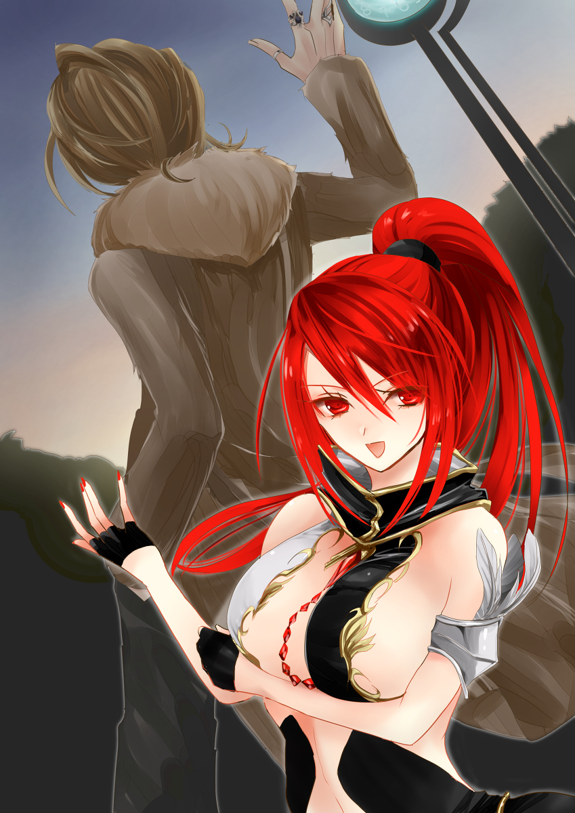
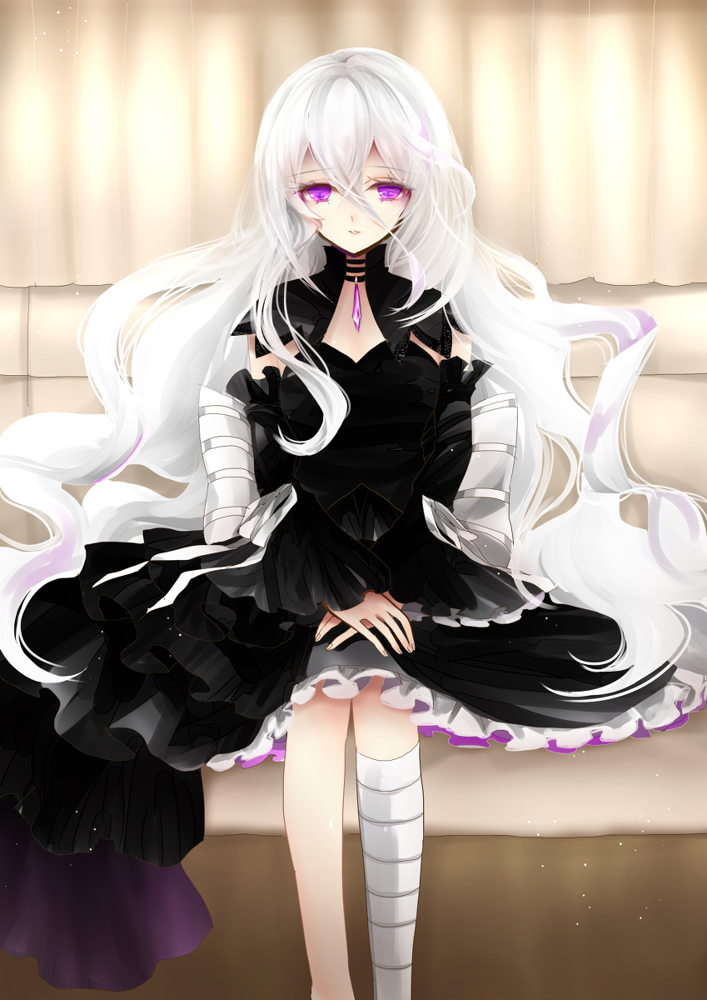
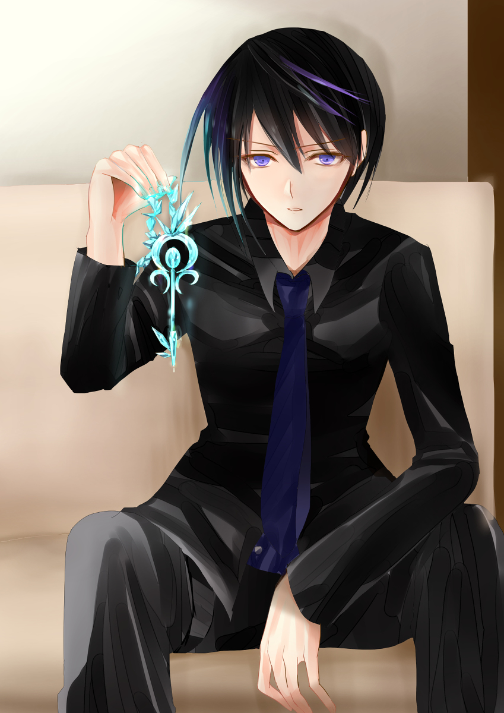

原文来源: [pixiv novel 13928681](https://www.pixiv.net/novel/show.php?id=13928681)
系列: 音楽†SFファンタジー『TEARED』HARMONIXシリーズ
顺序: 4

翌朝目覚めるとエレノアナがむくれていた。

「イクスさんのコーヒー……」

頬は膨れているが、昨晩よりは随分と元気そうにみえた。

「また、いつか淹れるさ。……たぶん」

恨めしげな視線からそっと目をそらすイクス。

誰だって、一度した失敗は二度もしたくないものだ。二度目も失敗する未来が見えているときは特に。

「……イクスさん、パパが嘘を吐く時の顔とそっくりの顔してます」

「うっ」

「うふふ、淹れてあげればいいじゃん。たまにはああいう味もいいわ」

「昨日は美味しくないって言ってたじゃないですか」

「うん。目が覚めるような味よね！」

「結局美味しくないってことじゃないか……」

事実とは言え、そんな何度も言わなくていいじゃないか。ちょっぴり悲しい気持ちでイクスはため息を吐いた。

「そんなことより、これからどうするかの話をしよう」

「そうね。エレノアナちゃんにも話さなきゃいけないことがあるし……」

「私に、ですか？」

キョトンとするエレノアナ。ロードとの別れから立ち直りはじめたところのエレノアナをそっとしておきたいところだが、タヌタを探す途中にイクスたちが見た光景を話さないわけにはいかないだろう。

街外れで見つけたマテリアル製造施設について二人はエレノアナに説明した。マテリアルが作られ続けていると聞いたエレノアナはやはり不安を露わにする。

「マテリアルが……？ジェノサイド社はなくなったん、ですよね……？」

「そのはずだ。だけど残党が居るのかもしれない。前に会った、機動隊服の男は覚えてるか？」

「えっと……服屋を出た時の？」

「ああ。ジェノサイド社の治安部隊だとか言ってた奴だよ。あいつが居たんだ」

「単なる残党かどうかは、わからないけどね」

どこか憂鬱そうにレイラは言った。

どういうことかとエレノアナとイクスが問いかけると、レイラは困った顔をした。

「妙に統率が取れてたなって。あの男、ゲイスだったっけ……あいつらをまとめてる奴が居るみたいだったから」

「フィランダー以外の、ジェノサイド社の幹部が残党を率いているという可能性は？」

イクスはかつてジェノサイド社に勤めていたが、幹部勢の話に詳しいわけではない。ただの警備員だったのだ。ジェノサイド社のトップシークレットであるマテリアルの製造に関わっていたレイラの方が上層部については詳しい。

「うーん。マテリアルの売買はほとんどフィランダーが一人で進めていたはずなのよ。あいつ、自分以外の誰かを信頼できるような奴じゃないしね。……だから、本社にあったマテリアルの製造装置を壊せば、二度とマテリアルは作れないと私は思ってたんだ」

かつてイクスたちの前に立ちふさがり、エレノアナをマテリアルにしようとしていたジェノサイド社の幹部フィランダー。目的のためには手段を選ばない冷酷な男だ。

イクスたちがジェノサイド社を倒壊させたときにフィランダーは失脚したはずだが、彼が残したマテリアル研究はまだ生きている。それも、本社があった都市から離れたこんな山奥で、マテリアルを製造する施設が稼働していたのだ。あれだけ大掛かりな施設を数週間で作ることは不可能だろう。フィランダーではない何者かの手によって、マテリアルはずっと作られ続けていたのだ。

フィランダー以外にもマテリアル売買を進めようとする者が居ると思うと、イクスの顔が自然と強張る。

「フィランダーには実は協力者がいた……ってことですかね……」

「もしくは、黒幕ね。ゲイスの口ぶりじゃ、フィランダーの相棒っていうかボスって感じだったもの」

あの、とエレノアナが控えめに手をあげた。

「フィランダーのボスってことは、ジェノサイド社の社長さんじゃないでしょうか？」

「それがねぇ……死んでるよのねぇ」

レイラはあえて軽い口ぶりを選んでいるようだった。困ったように大げさに肩をすくめる。

「フィランダーって、どこか他所から幹部として招かれたらしいんだけど。招いた当時のジェノサイド社のトップは、フィランダーが来てから数か月で亡くなっちゃったの」

「それって、フィランダーに……？」

イクスは不吉な予感を覚えた。イクスの予感を肯定するように、レイラは皮肉げに言い放つ。

「さあ？“事故死”らしいよ？」

「…………真相は闇の中、ってことですか」

「ま、その後も幹部連中にパタパタ不運が起きてね。ジェノサイド社の実権はいつの間にかフィランダーの手の中に転がりこんでいた。ここまで来ればみんなおかしいことはわかっていたけど……それを言えば、消されちゃうからさ」

フィランダーに逆らった者には死が与えられる。イクスの同僚でも、彼の不興を買って命を落とした者が居る。あまりにも横暴なやり口だったが、逆らえる者が居なかったからこその圧政だったのだろう。

「じゃあ、フィランダーはいったいどこから来たんですか？ジェノサイド社に来る前は一体何を？」

「それを知ってた人間は、全員もう生きてないわ」

レイラは静かにそう言った。

マテリアル研究の被害者はマテリアルにされた者たちだけではない。重々しい事実に三人は黙り込んでしまう。

その沈黙をおもむろに破ったのもまた、レイラだった。

「………それに、イクスくん、気付いてた？施設の入口」

「入口？何かありましたっけ？」

「印があったの。丸で囲まれた、螺旋……遺伝子みたいな形をした……」

そんな模様、あっただろうか。施設の入口を思い出そうとするイクスだが、そこに注視した記憶がない。

「いえ。見ていない気がします」

「そっかぁ。あそこにあった模様、ジェノサイド社のマークじゃなかったのよ。だから気になっててさ……覚えておいても損はないかもね」

さらさらと紙に模様を書きつけるレイラ。ひとねじりされた短い遺伝子図が丸に囲まれたシンプルな模様だ。生命の設計図を小さく囲い込んだその模様の意味はわからない。だが、確かに覚えておいて損はないように思えた。

「で？これからどうする？マテリアルを作り続けている施設を放っておくわけはないよね？」

レイラの提案にエレノアナもイクスも頷く。

「イクスさん、レイラさん。マテリアルにされた人たちも元に戻してあげたいです」

「ああ。だが、敵の正体は知っておきたいな……」

施設に再び向かい、暴れ回ることは簡単だ。だが、マテリアルを作り続けている者の正体がわからないままではすっきりしない。

「あの黒いドレスの女の子なら何か知っているかもしれない」

ぽつりと漏らしたイクスにエレノアナが目を瞬かせる。

「ロードさんのマテリアルを奪おうとした子ですか？そういえば、ジェノサイド社に警戒されていた女の子って、あの子ですよね……？」

ロードの屋敷に向かう前に見た、ジェノサイド社の顧客情報にあの少女の情報は混ざりこんでいた。マテリアル所持者を襲い回っている、ジェノサイド社の警戒対象だ。

直接対峙した後も彼女がマテリアルを奪おうとする理由はよくわからない。だが、どうにも目当てのマテリアルがある様子だった。探しているマテリアルでなかったからタヌタは見逃されたのだろう。

「ああ。たしか、ティアって言ってたかな。彼女はゲイスたちに追われているみたいなんだ」

ゲイスらと何らかの因縁を抱えているあの少女なら、イクスたちの知らない情報を握っているかもしれなかった。

「それに、妙なマテリアルも持っていたしな……」

「黒いマテリアルですね。とても悲しくて、苦しい“音”を奏でる……」

エレノアナは痛ましげに顔を歪めた。

「妙な力を持つマテリアルだったな……エレノアナはあのマテリアルの声も聞こえたのか？」

「うん……たぶん、聞こえました。嵐の“音”が混じっていて、よく聞こえなかったんですけど……。でも、小さい女の子が泣いている声がしました。“傷付きたくない”、“傷付けたくない”。“誰か助けて“って叫ぶ声が」

「そうか……なら助けてあげないとな」

「はい！もしまたあの黒いドレスの子に会えるならですけど……」

「みょーにマテリアルの力を使いこなしてたわよね、あの子。武器にみたいにさ」

レイラはどこか不本意そうに言った。マテリアル開発者の娘として、武器のように扱われるマテリアルが面白いはずもない。

「あの黒いマテリアルも助けたいです」

「そうね、私たちがゲイスたちを調べる中でまた必ず出てくるでしょ。きっと無関係じゃないはず」

そう言って、気分を切り替えるようにパン！とレイラが手を打った。

「じゃあ、一度街で情報収集しましょうか。詳しそうな人に心当たりもあるし」

「「詳しそうな人？」」

レイラの言う心当たりが誰の事かわからず首を傾げる二人。エレノアナと並んでキョトンとするイクスを見て、レイラはくすくすと笑った。

「忘れちゃった？居たじゃない、私たちに施設のことを教えてくれた人」

「………あ」

そういえば、イクスとレイラに施設のことを教えてくれたのは謎の派手な男だった。名も名乗らずに、情報だけ押し付けて風のように去っていた男を思い出す。あの派手さなら、街で聞き込めば居場所くらいわかりそうだ。

「あの人からもうちょっと詳しい話を聞けないか調べてみましょう！」

「そういえば、レイラさん……あの人ってもしかして……」

「さあ？本当にイクスくんが考えてる通りかどうかは、本人に聞かないとわからないわね。そういう意味でも、もう一度話を聞きに行きましょ」

三人は街に降りるべく、さっそく支度をはじめた。

しかし、結局イクスたちは謎の派手男の居場所を聞き込むことはなかった。キャンピングカーのドアを弱々しく叩くノック音が事態の急転直下を告げる――。

「誰か……誰かいませんか……！助けてください……！お願い、誰か……！」

車のドアの向こうから聞こえた声に三人ははっと顔を上げた。

「今行きます！！」

「ちょっと、エレノアナちゃん！」

迷いなくドアを開けに行ったのはエレノアナだ。止めようと手を伸ばすレイラを横目に、イクスは太もものホルスターに手を伸ばす。ドアの向こうの切羽詰まった声からは厄介ごとの臭いがした。

いつでもエレノアナとレイラを守れるようにとイクスが構えていると、キャンピングカーのドアがエレノアナによって開かれる。

開いたドアから小柄な影が転がり込むのが見えた。

「！――伏せろ！！！」

ドアの向こうからキャンピングカーの中を狙う銃口が目に入り、イクスは叫ぶ。即座に反応したレイラが動いた。事態を飲み込めていないエレノアナに覆いかぶさるようにレイラはその場に倒れこんだ。

「きゃあ！！」

悲鳴をあげたのはレイラでもエレノアナでもない。キャンピングカーの中に逃げ込んだ小柄な人影だ。足を銃弾が掠めている。

ふくらはぎから血を流しながら、小柄な人影が奥へと這っていこうとする。地面に広がる黒いドレスの裾と長い白髪に一瞬、イクスの目が奪われる。苦痛に歪んだ紫の瞳と視線がぶつかった。見たことがある顔の少女がそこにいた。しかし、彼女の怯え切った目があまりにも予想と違っていて、戸惑いを覚えるイクス。

しかし戸惑いを他所に、イクスの指は違わずに引き金を引いた。逃げ込んできた少女を狙う銃口の少し下。引き金にかけられた人差し指をかすめるようにイクスは弾丸を解き放った。

「うぐっ！！」

狙い通りに敵が銃を取り落とす。

「何やってやがる、この役立たずが！！！！」

銃を落とした黒服の男を、酒に焼けたしゃがれ声が怒鳴りつけて蹴り倒した。黒いヘルメットを目深かにかぶったずんぐりむっくりとした図体が怒りながら、ぽてぽてと走ってくる。ヘルメットが少しばかり大きく、歩く度に位置がずれるのを直しながらその男はイクスを睨みつけた。

ゲイスだ。なら、追われているこの黒いドレスの少女はやはり、ティアだろう。ロードの屋敷でイクスたちを追い詰めた少女は今、弱々しくゲイスから逃げようと地面を這っている。脅威であった漆黒のマテリアルを持っている様子はない。

よく見ればゲイスの手には黒い石が握られていた。屋敷で見た時よりもかなりくすんでいるが、少女が持っていたマテリアルと同じものであるようだった。

「ははっ、どこに逃げてんだ！これさえ取り戻せばこっちのもんだろうが！おら、止まりやがれ！！！！」

ゲイスが黒いマテリアルを掲げる。稲妻のような光が走り、イクスははっと身構えた。

またあの呪いのような“音”がくる。嵐のような暴風と、悪夢を思わせる幼子の笑い声。もはや鳴りはじめる前から耳にこびりついた“音”がイクスをぎくりとさせた。

しかしゲイスが持つマテリアルは一瞬光りはしたものの、結局“音”を奏でることはなかった。掲げられた手の中でじっと黙り込んでいる。

「………………」

間があった。

ゲイスがマテリアルを掲げた体勢のまま、何が起こったかよくわかっていないような顔をしている。やがて、“音”が鳴っていないことに気付き、苛立たしげにマテリアルを持つ手を振った。

「おい！鳴れ。鳴れ！！！何黙ってんだ！！！！なんとか言えよ、オイ！！！」

何度もゲイスがマテリアルを振りかぶるが、うんともすんとも言わない。

やがて苛立ちが限界を超えたのか、ゲイスはマテリアルをその場に投げ捨てた。そしてその上に足を振り下ろした。

「この！このっ！！本当にお前は役立たずだな！！マテリアルになっても何の役にも立ちやしねぇ！！」

まるで子どもが起こす癇癪のようだ。気に入らない玩具に八つ当たりをする子どものように、ゲイスは何度もマテリアルを踏みつける。何度も足蹴にされた漆黒のマテリアルが土に汚れ、輝きを失っていく。

命の輝きを失い、死んでいってしまう。不吉な予感にイクスは息を飲んだ。

「やめて！！！！！」

エレノアナが飛び出して、ゲイスを止めようとした。間一髪でレイラがその動きを止める。

外に居るのはゲイスだけではない。銃を構えた黒服の男たちが何十人と控えていて、キャンピングカーはすっかり囲まれてしまっている。

向けられた銃口が見えていないかのようにエレノアナは必死に黒いマテリアルへと手を伸ばした。

「やめてください！！痛いって言ってる！！やめて、って！助けてって！！！」

「はぁ？ただの石ころがそんなこと言うかよ！こいつはただの！役立たずのクズ石だ！」

「違う！！！！その子は人間です！！！！！」

「訳のわかんねぇことを言う嬢ちゃんだな。うるせぇんだよ、黙りやがれ！！」

「どうして聞こえないの！！！泣いてるのに！痛いって！やめてって――えっ？」

不意に、エレノアナが驚きの声をあげた。青ざめて、そんな……と呟く少女。

「どういうこと…………？」

急に動きを止めたエレノアナにレイラがしっかりとしがみついていることをイクスは確認する。エレノアナとゲイスの会話が襲撃者たちの注意を持っていった中、こっそりと移動していたイクスにレイラだけが気付いていた。イクスが運転席にたどり着いたことに気付いたレイラはエレノアナにさらに強く抱き着き、イクスに向かってゆっくりと頷く。

イクスは頷き返し、アクセルを踏み込んだ。

「あーーー、クソッ！お前ら！！！車ごと蜂の巣にしてやれ！！！！！」

ゲイスの命令に黒服の男たちが戸惑う気配があった。その戸惑いの一瞬がイクスたちを救った。キャンピングカーに加速の猶予を与え、タイヤが土埃をあげて回りだす。

車の正面にも黒服の男たちがいたが、イクスは構わず人垣の中に突っ込んだ。

迫りくる大型車に黒服の男たちが逃げ惑う。慌てる襲撃者たちを尻目に、扉を開けっ放しのままキャンピングカーが進む。

ゲイスの怒声を聞きながらハンドルをさばいて黒服の男たちを振り切るイクス。銃弾が来ないことを確認してから、レイラが慎重に車のドアを閉めた。

黒いドレスの少女は深々と頭を下げて礼を言った。

「助けていただいて、ありがとうございました。本当に……みなさんに助けてもらっていなかったら、どうなっていたことか……」

打ち抜かれた少女の足には包帯が巻いてある。手当を終えたエレノアナが薬箱に消毒液や包帯をしまい込んだ。

「無事でよかったです。えっと、あなたは…………」

エレノアナもその少女に見覚えがあったのだろう。戸惑ったように首を傾げる。

イクスとレイラも同じ思いで黒いドレスの少女を見た。精巧な作りをした人形を思わせる、華奢な少女だ。その顔立ちは間違いなく屋敷でイクスたちを襲った少女と同じものだった。

しかし弱々しくはにかむ表情からは、前に感じた威圧感が消え失せている。鮮やかで妖艶な笑みを浮かべる少女であったはずだが、今の彼女は吹けば飛んで行ってしまいそうなほどに頼りない。その代わりに、穏やかな木漏れ日のような優しさが紫の瞳からあふれ出ていた。

「私は……そうですね。ティアと呼んでください」

やはり少女は不思議な言い回しで名を名乗った。

「ティア……じゃあ、君はやっぱり、ロードの屋敷で襲ってきた“ティア”なんだな？」

「あの時は、ごめんなさい。“ティア”のせいでみんなを傷付けてしまった……」

ティアは陰りを含んだ表情で謝った。

「あなた……ううん。あなたたち、って言った方がいいのかな。あなたたちって、双子ってわけじゃなさそうだね」

戸惑いがちに言ったレイラがちらりとエレノアナを見る。双子と言えば、確かに思い浮かぶのは二人の少女に分裂していたエレノアナのことだ。エレノアナは一時期、エレナとノアナという別個の人間に分かたれていた。マテリアル研究に巻き込まれて二人の人間に分裂してしまったエレノアナが居るくらいなら、複数の心を宿してしまった人間が居てもおかしくはないのかもしれない。

たとえば、一つの体で複数の心を持つような存在とか。

「多重人格……」

「はい」

ティアはイクスの呟きに迷わず頷いた。

「この“ティア”の体の中には、複数の人間の心が住み着いているんです。ティアは私たちに名前をくれなかったから、みんなティアって名乗ることにしてますけど」

レイラが眉をひそめた。

「そうなったのは、マテリアルにされかけたせいなのかな」

「…………いいえ」

ティアは微笑んだ。涙は流していないのに、深く悲しんでいることがわかるような切ない微笑みだった。

「私たちは生まれつき、こうなんです。物心ついたときにはもう、心の中に色々な人格が住んでいて……代わりばんこで表に出て遊んでいました。今は、随分と寂しくなってしまったんですけど……」

「寂しくなった、って？」

イクスが尋ねるが、ティアは曖昧にほほ笑んだまま答えなかった。

「でも、みなさんにお会いできてよかった」

ゲイスから逃げながら、イクスたちを探していたのだとティアは語った。どういうことかとイクスたちが尋ねると、言い出しづらそうに目を伏せる。

「それが……あの子……タヌタくん、でしたよね。彼がさっきの人たち……ゲイスたちに連れ去られてしまったんです」

「えっ！？タヌタくんが！？」

エレノアナが真っ先に驚いたおかげでイクスは声を出さずに済んだ。

タヌタと別れたのは昨日のことだ。そのわずかな時間の間に何があったのかと疑問を抱くイクスたち。ティアは肩身が狭そうに、さらに俯いた。

「ごめんなさい……たぶん、私のせいです………。“私たち”がタヌタくんを見逃したから……それで、何かあると思い込んだゲイスが私を呼び出す餌としてタヌタくんを攫ったんです」

「何かあるって……そっか。あなた、マテリアルを集めてるんだっけ。それで唯一見逃したのがタヌタくんだったってこと？」

レイラが尋ねると、ティアは困った顔をする。

「集めてるってわけじゃあないんですけど……。でも、結果的にはそうなるのかな。マテリアルをお金で買うような人たちが、マテリアルを持ち続けていることが……私は我慢ならなかったから」

「だから、ジェノサイド社に警戒されていたんですね」

「…………ええ。そうです」

ティアは眉尻を下げてエレノアナに頷いた。

「でもあのクズ男に狙われた理由、それだけじゃないんでしょ？」

「………………………」

レイラの問いかけはティアの胸に鋭く刺さったようだった。目を閉じ、深い葛藤を見せるティア。目を閉じてじっとしていると生気の乏しい色白の頬が際立ち、まるで等身大の人形のようだ。

「彼らが狙っていたのは、私の持っていたマテリアルです」

「あの黒いマテリアルのことよね？」

「そう……あれは人の心を操る力を持つ、危険なマテリアルなんです。わがままな子だから、扱いは難しいけど。その気になれば他人を思うがままに操ることだってできるんです」

ロードの屋敷で使用人たちの意識をまとめて刈り取ったマテリアルの恐ろしさはイクスにも理解できた。

心を縛る、とあの時のティアは言っていたが、身動き一つできずに意識を奪われそうになった恐怖をまだイクスは覚えている。イクスもレイラも立ち上がることすらできなかったのだ。何より、あの呪いのような“音”を長時間聞いていたら心が壊れてしまいそうだった。

「ティアは、あのマテリアルと心を通わせているように見えましたけど……？」

「さあ……。“私”でいるときは、あの子、言うこと聞きませんから」

ぎょっとするような冷えた声色がティアの口から飛び出た。表情を変えることなく、淡々と少女は語る。

「可哀そうな子ですよ。マテリアルになる前から虐げられて、独りぼっちで。助けてくれる人もいなくって。泣いてるうちに心がどす黒く染まってしまった可哀そうな子」

――だから、あの子なんて大っ嫌い。
吐き捨てるように呟くティア。その紫の瞳には強い侮蔑が宿っていた。

――お願いします。タヌタくんを助けてもらえませんか。

ティアは辛そうに唇を噛み締めてイクスたちに頭を下げた。タヌタは前にイクスとレイラが訪れた、街外れの施設に連れていかれたらしい。

頼まれずともイクスたちは元よりそのつもりだった。ティアが面識のないはずのタヌタを気にかけていることに驚きつつも、三人は彼女のお願いに快く頷いた。

今はレイラがハンドルを握り、車を施設に向かわせている。エレノアナは先ほどまで何かとティアの世話を焼いていたが、二人分のココアを置いてレイラの様子を見に行った。マグカップを持っていったからレイラの分の飲み物でも届けに行ったのだろう。

残されたティアとイクスの二人の間に気まずげな沈黙が落ちる。

イクスが適当な話題を探していると、ティアの幼い顔立ちが気になった。両手でマグカップを握りしめる少女は子どもと言っても差し支えのないくらいの年齢に見える。そんな子が一人でジェノサイド社から逃げ回っていることにイクスは疑念を抱いた。

「ティアはどうして一人で旅をしているんだ？」

「それは……なんとなく、流れで……ですかね……」

ティアは言葉を濁らせた。

「そういうイクスさんたちは、どうして旅を？」

あまり話したくない事情があるのだろう。ティアは詳しく話すことなく、イクスに問い返した。

「“流れで”、かぁ。俺たちも流れで、かなぁ」

“流れで”という言葉が言い得て妙で、イクスは苦笑する。自分がマテリアルを人間に戻す旅なんかに出るとは、ほんの少し前までは思ってもいなかったのだ。

「？」

「笑ってごめん。旅に出る前のことを思い出して」

「旅に出る前のこと、ですか」

「ああ。エレナとノアナ……エレノアナに会う前のことを、ちょっと」

「そうですか………」

ティアは曖昧に笑った。

少しばかりの沈黙が流れた後、おずおずとティアがイクスに声をかける。

「あの……タヌタくんを人間に戻したのはあなたたち……ですよね？」

ティアは半信半疑な様子だった。

イクスはマテリアルの存在を知ってからほどなくして、マテリアルを人間に戻す方法であるキュアのことも知った。しかしティアはそうではなかったのだろう。

ティアがいつから一人で旅を続けているのかはわからないが、その間ずっと、マテリアルを人間に戻せるとは知らずに過ごしてきたのだ。マテリアルになってしまった人間をさっぱり元に戻せると聞いても、すぐには信じられないだろう。

「ああ。マテリアルになってしまった人間を元に戻す方法があるんだ」

「それは私にもできますか？」

「このキュアを使えばできる。一つしかないから、ティアにあげることはできないけど……」

イクスはキュアを取り出し、ティアに差し出した。ティアは受け取らずに、鍵のようなそのアイテムをじっと凝視する。

「キュアを使いたい人が居るのか？」

イクスがそんな質問を投げかけたのは、ティアがマテリアルを集めていることを思い出したからだ。

「たしか、ティアは探しているマテリアルがあるんだよな？」

「はい。大切な人が他人に利用されているのは嫌だったので。だから、みんなを集めようと思って……」

「みんな？」

ティアが探しているマテリアルは一つではないらしい。疑問に思ったイクスが問いかけると、ティアは口を閉ざした。また曖昧に笑ってごまかそうとした少女は、うまく笑えずに口元を引きつらせる。
あまり喋りたい話ではないらしい。

「言いたくないなら、良いんだが……」

「……詳しく話したら、私に協力してもらえますか？」

「マテリアルになった人を元に戻したい、ということなら喜んで。俺たちはそのために旅に出たんだから」

安心させようとイクスは笑みを浮かべる。そんなイクスを見て、ティアは眩しそうに目を細めた。

「…………多角的な性格の持ち主からは良質なマテリアルが生まれるという話を聞いたことはありますか？」

「確か、前に会ったジェノサイド社の幹部がそんなことを言っていたような……まさか」

嫌な予感がイクスを襲う。

そういえば、少女は自分の心中に住む人格たちについて、“今は、随分と寂しくなってしまった”と言っていた。

一人の中に複数の心を持つティア。彼女をマテリアルにしたら、いったいどんな形になるのだろうか。

「多重人格も多角的な性格って言えそうでしょう？だからティアもマテリアルの材料として、とある男に狙われたんです。」

「ゲイスか」

考えるまでもない。ゲイスの狙いは、ティアの持っている漆黒のマテリアルだけではなかったのだ。ゲイスとはじめて出会った時、あの男はレイラとエレノアナを狙っていた。今から考えれば、二人をマテリアルにして売り飛ばそうと目論んでいたのだろう。

人をマテリアルに変えて、それを売りさばきながらも平然としていられる男の神経が信じられない。

イクスはふつふつと怒りが沸き上がってくるのを感じた。

「あの男がティアも狙っていたのか」

「バカな人なんです。“ティア”をマテリアルに変えれば、ある会社の幹部にしてやるってそそのかされて。お金をたくさん積まれて。その気になったゲイスに“ティア”は捕まってしまいました」

自分のことでもあるはずなのに、ティアは他人事であるかのように説明する。

「そして“ティア”は醜い石の姿に変えられてしまいました。しかし、“ティア”の複雑な心をすべてマテリアルにするのは難しかったようです。“ティア”のうちの何人かはマテリアルになることを免れ、こうして、“ティア”の体も石にならずに残っています」

「あの漆黒のマテリアルもティアの一人なのか？」

「そうですよ？」

ティアは何故かくすくすと笑った。

「あの子は私たちの中で一番わがままで、悪い子なんです。みんなあの子が大嫌い」

「自分のことなんだろう……？」

「どうでしょうね。感覚的には、腐れ縁みたいな感じです。離れたいのに離れられない隣人。でも、同じところに住んでるから、嫌いでも、ある程度協力はしなくちゃいけない。だからあの子がマテリアルに変えられたとき、私は正直清々したんです。これで、あの子の顔をもう見なくて済む、って。……ふふ、自分と同じ顔なんですけど」

ティアは笑い続けるが、まったく楽しそうには見えなかった。自虐的な笑みが痛々しい。嫌いだ、と言う度にティア自身が傷付いているかのようだった。

「清々したはずなのに……なんでか、あの子を放っておけなかった。石になって、もう戻らないって思ったら、なんででしょうね」

ティアは笑みを消してうつむいた。

「……涙が止まりませんでした」

「ティア……」

「あんな泣き虫、消えちゃえ。どっか行っちゃえばいいって思ってたのに。あの子ったら、マテリアルになってまで泣くんです。寂しいから行かないで、って。私を置いていかないで、って」

イクスはティアの持っていた漆黒のマテリアルが奏でる“音”を思い出す。悲痛な叫びのような“音”だった。辺り構わず喚き散らすように暴力的で、世界をすべて呪うかのように強いマテリアルだ。

エレノアナは漆黒のマテリアルが泣いていると言っていた。あの歪んだ“音”はひょっとして、“ティア”の泣き声だったのだろうか。

「あの子が可哀そうになって……私は何度もあの子を壊そうと思いました」

「え………」

「だって、戻らないって思ってたから。一生、石になったまま力だけを利用されて、苦しむくらいだったら終わらせてあげようって。あの子も私が壊そうとしても嫌がらなかった。だから壊そうと思えばいつだって壊せたんです。でも壊せなかった……」

「生まれたときからずっと一緒に居るんだろう？家族みたいなものじゃないか。壊せるわけないさ」

「……あなたが思うような、単純な話ではないです。私たちの関係はもっと複雑で……あの子は本当は、壊された方が幸せなんです。人間に戻ったって、あの子は幸せになれないんだから」

ティアは自分の考えを譲るつもりはないようだった。しかし、“でも……”と弱々しく呟く。

「でも……私の我儘を言うなら、あの子を私たちのところに帰してあげたいんです。あの子は一人だとずっと泣き続けてしまうから。あの子の笑顔を見ることなくお別れするのは、私も嫌なんです。お願いします、イクスさん。あの子を助けるために、あなたたちの力を貸してはもらえませんか」

ティアが深々と頭を下げる。迷うまでもない。イクスの答えは決まっていた。

「もちろんだ、ティア。俺たちはそのために旅してるんだから」

「あなたが嫌って言ったって、人間に戻すから。安心してちょーだい」

「あ、レイラさん」

運転席からレイラが出てきていた。気付けばキャンピングカーは木々の影に停められていた。

「ついたわよ。一息ついたら、タヌタくんを助けに行きましょう。あと、“ティア”ちゃんたちもね」

レイラは茶目っ気たっぷりにウィンクを飛ばした。

敵地に忍び込む危険を考えると、武器のないエレノアナと怪我人であるティアを連れていくことはできなかった。

「イクスさんとレイラさんを待っていますから……絶対、帰ってきてくださいね」

不安そうにしながらも、エレノアナは留守番を決めたようだった。ティアもその隣で控えめに頷く。

だが、頷いた途端にティアは急に地面に崩れ落ちた。頭が痛むようで、苦しげにうめく少女の様子に三人は慌てた。

「ティアちゃん！？」

エレノアナが隣にしゃがみこみ、少女の小さな肩を支える。

「………っさ……」

「ティアちゃん、大丈夫ですか！？」

「うるさいわ。“ちゃん”だなんて、気安く呼ばないでくださる？」

凛とした言葉の響きは気高い女王のようだった。

同じ人物から発された声のはずなのに、先ほどまでのティアとはまるで別人が喋っているように聞こえる。ギンッ、とエレノアナを睨みつける眼差しも、先ほどまでのティアのものであるとは思えない。

人格が入れ替わったのだ。

多重人格だと聞いていても、その変わりようにイクスは驚いてしまう。

「ティア……？まるで……別人じゃないか……」

「何を惚けたことを仰っているのかしら、黒い髪のお兄様。だからそう言っているでしょう？私たちは別の人間なの。たまたま同じ体を使っているだけ」

しゃがんでいたティアが立ち上がると、尚更その雰囲気の違いが露わになる。伸びた背筋に艶やかな笑み。イクスはその立ち振る舞いに見覚えがある気がした。

「もしかして、君はロードの屋敷で会った“ティア”？」

「名を呼んでくださるのは嬉しいけど。そう何度も犬を呼びつけるように呼ばれるのも考えものね」

「犬って……」

「例えよ。まあ、あまりに気安いようでしたら、その喉笛、噛み切ってしまうかもしれないけど？」

「このティアちゃん……ティアさん？は物騒なんですね」

「だから、気安く呼ぶなと言っているでしょう」

呆れたようにエレノアナを睨みながら、少し乱れた髪をかき上げて軽く整えるティア。

「私も行くわ」

「えっ……いや、その怪我じゃあ」

ティアは止めようとするイクスを無視してキャンピングカーから降りた。足に負った怪我など感じさせない、しっかりとした足取りだった。

「おバカね。あなたたちも、二番目の私も。あの漆黒のマテリアルはティアの心なのよ。傍にこの体がない状態で元に戻したら、あの子の心が迷子になってしまうかもしれないじゃない」

「そ、それはそうかもしれないけど……だけど」

「二番目って今言ったけど……さっきまでいたティアが“二番目”の子ってことかな」

慌てるイクスと対照的に、レイラは読めない笑みでティアを観察している。積極的に止める様子はなさそうだ。

「そうよ、あの子が二番目。頼りない次女でしょ。本人はしっかり者の長女のつもりだけど」

「じゃあ、あなたは何番目なのかしら？」

「五番目と呼ばれているわ」

「へぇ……じゃあ、三番目と四番目の子はマテリアルになったのね」

「そうねぇ………」

ティアがくすりと笑う。

あどけない表情に浮かぶ妖艶な表情にイクスは思わず背筋を震えさせた。敵意がないとわかっていても、五番目のティアはどこか不吉なものを感じさせた。

「死んでしまったわ。ずっと昔に」

「「「え？」」」

「さ、行きましょう。可愛いお魚さんが待っているわ」

このティアは留守番をするつもりなどないらしい。イクスたちを置いて、勝手に森の奥へと歩きはじめてしまう。そう簡単には止められそうにない。

あまりの傍若無人ぶりにイクスたちが唖然としていると、ティアが長い髪をたなびかせて振り向いた。

「何をぐずぐずしているの。置いていってしまうわよ」

「置いていくって……ティア、施設の場所わかるのか？」

「愚問ね、黒い髪のお兄様。私、ここから逃げ出したのよ？ついておいでなさい。地下牢に行くわ」

「地下牢……？」

ティアはここにある施設でマテリアルにされたらしい。迷いない足取りは道を知っているからなのだろう。

「マテリアルを作る部屋の隣にある部屋から行けるのよ。攫ってきたマテリアルの材料はしばらくそこに閉じ込められるの。私のような半端にマテリアルになってしまった厄介者もね。ゲイスのことだもの。きっと、あの可愛いお魚さんもそこに居るわ」

エレノアナとわかれたイクスたちは、ティアに連れられて再びマテリアル製造施設の奥深くへと向かった。

施設はどこか慌ただしい雰囲気に包まれていた。入口にあった閉鎖中を示す鎖はそのままだが、建物内に入るための扉の前には堂々と監視が立っており、施設の窓からは灯りすらもこぼれ出ている。敷地内では入口以外にも数人の警備員が物々しく辺りを見回っていた。

イクスたちは少し離れた茂みに隠れて様子を窺う。

「……なんか、探してる雰囲気だね」

レイラが小声で呟く。確かに、警備員たちは何かを探しているようにも見えた。

「私が来るとわかっているからでしょう。……それにしたって、予想以上の大捕り物ですけれども」

タヌタはティアをおびきだすためにゲイスたちに連れ去られたと言う。なら、ティアを捕らえるために警戒態勢を敷いていても不思議ではない。だがそう説明したティア自身が、不可解そうな顔をしていた。

「ティア。何か気になることがあるのか？」

「ええ……彼らは表立っては動けないはずだから、ここまではしないと踏んでいたのだけど。何か事情が変わったのかしら……」

「表立って動けないって、ゲイスたちのことか？」

「ゲイスだけではなく、この施設に居た者すべてよ。だって、ジェノサイド社は崩壊してしまったのでしょう？なのに、ここだけ正常に稼働していたらおかしいと思われてしまうわ。せっかく隠れていたのに、目立ってしまって仕方がない。それは彼らも歓迎しないでしょう」

「彼らって…………もしかして、ゲイスたちはただのジェノサイド社の残党ではないのか？」

残党の割には妙に統率が取れているとゲイスたちを怪しく思い、ジェノサイド社を取り仕切っていたフィランダーのさらに背後に黒幕が居るのではと言っていたのはレイラだったか。傍で隠れているレイラを見ると、彼女の視線は施設の入口に向けられていた。

レイラの視線の先には円で囲まれたマークがある。遺伝子構造を象ったマークが施設の入口にひっそりと彫り込まれている。確かにあれは、ジェノサイド社では見たことのない模様だ。

「『ゲノム』」

ティアはぽつりと一言こぼした。

どういうことかとイクスとレイラが視線で問いかけると、ティアは説明を続けた。

「私も詳しくは知らないのだけど。フィランダーのことは知っていらして？」

「ああ……元々俺たちはフィランダーの居たジェノサイド本社に居たんだ」

「そう。あら？でも、あなた方がキュアを持っていると言うことは……」

ジェノサイド社が崩壊した理由は“事故”として報道されているが、ティアは何かに勘づいたように眉を上げた。探るようにレイラとイクスを見る。

「……いいえ。今はいいわ」

だがすぐに視線を施設に戻す。詮索しないことに決めたらしい。敵地の真ん前で説明することでもないので、イクスもほっと胸をなでおろす。エレノアナがマテリアルとして狙われていた話からはじめると、随分と長話になってしまう。

「フィランダーを知っているならば話は早いわね。彼は元々ゲノム社の幹部だったらしいわ」

「ゲノム……“遺伝子”、ね……」

レイラが再び入口のマークを見やる。ティアも頷いた。

「ええ、ゲノムのマークだと思うわ。フィランダーがここを作るとき、わざわざ彫らせたものだもの。きっと、ここをマテリアル研究の本拠地にするつもりだったのではないかしら」

「……研究基盤を作った後は、本社の方の研究所は用済みってことね。遅かれ早かれ、ジェノサイド本社自体も始末するつもりだったのかしら……」

レイラは涼しい表情を作っていたが、怒りのようなものを目に宿している。レイラの父が始末されたのは、きっとここの研究所ができた後に違いない。キュアを開発していなかったとしても父が始末される運命にあったと思えば、レイラが心穏やかでいられないのも理解できた。

「さあ？何のためにフィランダーがジェノサイド社を隠れ蓑にしていたのかはわからないわ。でも、ジェノサイド社に隠しておきたかったものをたっぷりとここに隠したのは確かね。あの黒服の機動隊もその一つ。彼らはジェノサイド社の者ではないのよ。どこかにあるゲノムの根城から来たの」

「ゲイスもゲノムから来たのか？」

「…………そうねぇ」

イクスの問いかけにティアは少しだけ顔を曇らせた。

「彼はちょっとだけ特別なの。元々はジェノサイド社に所属していた、しがない平社員よ。別に大した取り得もないわ。そうね、大口を叩くことだけは昔から得意だったかしら？まあ、そんな男なのですけど。彼はある日、大失態を犯して解雇を宣告されたわ」

「解雇？でも、なんだか幹部になるとかなんとか言ってなかった？」

レイラが疑問に思い、首をひねった。ティアはそんなレイラを見て薄く笑う。

「ええ。世紀の大逆転……と言うべきなのかしら。ゲイスは解雇されるはずだったのだけど、その寸でで、とても良いことを思いついたの。きっと、あの男の人生の中で最も優れた案だったのではないかしら」

楽しそうにティアは笑う。侮蔑の色はない。だが、心底楽しんでいるわけでもなさそうだった。

「優れたマテリアルの材料を上層部に捧げる欲望と裏切りの計画。名誉と地位を求めてゲイスはこの施設で行われていた上層部の会議に飛び込んだの。マテリアルの材料……生贄を引き連れて。そこに居たのはジェノサイド社の者ではなく、ゲノムの者たちだったのだけど。そして、裏切られた生贄の子羊が……うふふ。ご存じのあの子よ」

「裏切られた……？」

レイラはその一言が引っ掛かったように眉根を寄せた。

「待って、ティアとゲイスは前から知り合いだったの？」

「ふふふ。鋭いのね、赤い髪のお姉様。だけど、今はここまで。さあ、こちらへ」

ティアは何故か施設から離れる方向へと進みだした。引き留めようとしたイクスの手をするりと抜けて、茂みの奥へと滑り込む。

「ティア、どこに行くんだ？」

「普通に入ったら、警備員たちに見つかってしまうでしょう？秘密の抜け道を教えてあげる。“私たち”がここから抜け出すときに使った道よ。ちょっと窮屈だけど、勘弁してちょうだいね」

ティアはそれ以上の説明をするつもりはないようだった。

ティアはイクスとレイラを下水道へと誘った。ここから地下牢へ侵入できるらしい。

「本当はゲノムの幹部たちが使う道らしいの。だから幹部以外は知らないわ。もちろん、ゲイスもね」

少女が説明した通り、敵と出会うこともなく三人は道を進む。突き当りに来たところでティアは足を止めた。目の前には地上へ向かう梯子が伸びている。

「ここよ。ここを上がればすぐ地下牢に出るわ」

「俺が最初に行く。レイラさん」

「うん、後ろの警戒は任せて。頼んだよイクスくん」

イクスが梯子を上りきると、出口はマンホールのようなもので蓋がされていた。音を立てないように蓋をずらし、空いた隙間から外の様子を窺う。

黒い廊下がぼんやりとした灯りに照らされている。ゲノム社の施設内で間違いなさそうだ。人の気配がないことを確認してからイクスは下水道から抜け出た。後からティアとレイラも続く。

長い廊下のような空間だった。壁にはずらりと空っぽの牢屋が並んでいる。ここが地下牢なのだろう。

奥の方には上階へ向かう階段が見えた。タヌタを閉じ込めているとしたら、あっちの方だろうか。イクスが階段へ向けて歩こうとすると、同じ方向から少年の声が聞こえた。

「誰か、そこにいるんですか？」

タヌタの声だ。

はっとなり、レイラとイクスはそちらへ駆け寄る。

「タヌタ！」

「タヌタくん！」

「イクスさんにレイラさん！？どうしてここに……」

「タヌタが攫われたって聞いて助けに来たんだ」

階段に最も近い牢屋の中にタヌタは座り込んでいた。あちこちに小さな擦り傷はあるが、元気そうに見えた。無事でよかったとイクスはほっと息をつく。

「ボクのことをいったい、誰から…………？」

「私よ」

カツカツと靴音を立てながらティアが牢屋の前に立った。タヌタが驚いて目を見開く。

「あれ、あの時の女の子？」

「気安く“女の子”だなんて呼ばないでちょうだい。……ふぅん、思いのほか元気そうじゃない。安心したわ」

複雑そうにティアとタヌタが見つめあう。タヌタは敵であったはずの少女が何故ここにいるのか気になっているようだった。ティアの方はなんとも言えない表情でタヌタを見ていた。

二人の視線に割り込むようにレイラが牢屋の入口に近づき、手をかける。軽く引っ張ってみるレイラだが、当然のように鍵がかかっていた。

「とりあえずこの牢屋を開けないとね。うーん……爆破しちゃう？」

「レイラさん、それ中に居るタヌタは無事ですか？」

「もう、そんな危ないことしないってば！吹っ飛ばすのは鍵のところだけよ」

「意外と荒っぽいのね、お姉様は。でも困ったわね……あのマテリアルさえ奪われていなければことは簡単だったのだけど……」

ティアの言っているマテリアルとはあの漆黒のマテリアルのことだろう。この施設内にあるだろうかとイクスが考えていると、あ……とタヌタが声をあげた。

「タヌタ？どうかしたのか？」

「あ、あの……。えっと………」

タヌタは何故か迷うような素振りを見せた。ちらりとティアを窺うように見上げる。

「あの……君にとって、あのマテリアルは大事なものなんだよね？」

「何かしら、急に」

「ねぇ、大事なもの、って思っていいんだよね？」

「…………酷い質問をするのね。私にそれを答えさせるのは酷だわ。ええ。でも、ええ。あの子は私の大切な子だわ」

ティアは不服そうに頷いた。

「……そっか」

するとタヌタが立ち上がり、鉄格子まで近づいたかと思えば、突然その鉄格子を上りはじめた。両手を器用に使い、上へと上っていく。

何事かと三人が見ていると、タヌタは何かを取って地面に降りてきた。

「じゃあ、これ。君に返すよ」

タヌタが差し出したそれを見て、ティアがふらりと鉄格子に近づき手を伸ばす。

タヌタはマテリアルを持っていた。禍々しいほどの黒一色に染まったマテリアル。ティアが持っていた時よりも少しくすんでしまっているようにも見えるが、ゲイスが奪ったマテリアルに間違いない。

「ど、どうしてこれを！？」

ティアが驚いて声をあげる。信じられないものを見たかのように戦きながら、壊れ物に触れるような慎重さで少女はマテリアルを受け取った。

タヌタはニッと笑う。

「盗んだ！」

「どうやって！？」

「このマテリアルを持ってたおじさんが一人で見張りに来たんだけど。そのまま寝ちゃったから、その隙に盗っちゃった。
それで、咄嗟に鉄格子の上に隠して、おじさんを起こしてみたんだ。黒いドレスの女の子がマテリアルを持ってっちゃいましたよ、って。おじさんはそれを信じて、侵入者を探しに行っちゃった。怪しまれもしなかったから、隠さなくてももしかしたらバレなかったかもね」

おじさんと言われているのはきっとゲイスのことだろう。油断した隙にタヌタにマテリアルを奪い返されていたらしい。

盛大ないたずらが成功したように胸を張るタヌタにレイラが感心の声を漏らした。

「それで入口の方が慌ただしかったのね……ティアがもう侵入していると思ったから……」

「せっかく奪ったマテリアルを子どもにまた奪われるなんて、相変わらずのおまぬけさんね、あの男は………」

ティアはため息を吐いて、少しだけうなだれた。

「まあいいわ。礼を言うわ、お魚さん」

「お礼はいいけど……お魚さんじゃなくて、タヌタって呼んでほしいなぁ。ボクもう魚じゃないよ」

「あら。でもあなたの心はお魚さんのままじゃない。さあ、少し待っていなさい。牢屋の鍵を取ってきてあげるわ」

そう言って、ティアは階段を上っていた。

「待ってくれ、ティア！一人じゃあ危ない」

「お黙りなさいな、黒髪のお兄様。お気持ちは嬉しいけど、一人で十分よ。いえ、二人で十分、と言うべきかしら？」

イクスの制止を軽く受け流し、階段の上の部屋へと消えていくティア。無鉄砲にも思えるティアの行動が心配になり、イクスはため息を吐く。

「大丈夫かな……」

「まあまあ。なんか考えがあるみたいだし、私たちは大人しく待っていましょ」

レイラが見越した通り、ティアは無事に地下牢に帰ってきた。無傷であることに安心するイクスだが、少女の隣に黒服の男が居ることに気付いて警戒を高めた。

ゲノムの社員だろう。男は異様に無口だった。階段をふらふらと降りる男の手には鍵束が握られている。まるで何かに操られているかのような足取りだった。

――操られている？

イクスはティアを見る。

その視線だけで、ティアはイクスが正解に至ったことに気付いたようだった。唇にうっすらと邪悪さを乗せて、妖艶に笑う。

「正解よ、黒い髪のお兄様。この子は今、私のお人形さんなの」

レイラが進み出て、ティアの操る男から鍵束を受け取った。地下牢の鍵なのだろう。この束の中の一つが、タヌタの牢を開ける鍵になる。

「うまくいったみたいね。心を操るマテリアル……だっけ。前にティアに襲われたときは、ただ苦しいだけだったけど」

「本来はこういう使い方をするマテリアルなのよ。おぞましい“音”で人を虜にし、言いなりの傀儡にする。あの子がこんな力を持つようになるなんて、皮肉よね」

二人の会話を聞いていたタヌタが首を傾げる。

「ヒニクって、どうして？」

「この子は傀儡……お人形さんのような人生を生きてきたの。そんな子が、人をお人形さんにしてしまう力を持った。それを皮肉と言わずに何と言うのかしら」

「お人形さんみたいな人生……だから、その子は泣いてたの？」

「あら。お魚さんにはあの子の泣き声が聞こえたのかしら？」

「うーん……。おじさんが寝てた時にね、マテリアルの“音”が聞こえたんだ。それが泣いているみたいだったから……。それで、おじさんと一緒に居るのが嫌なのかな、って思って盗っちゃったんだ。可哀そうだったから……」

「一緒に居るのはきっと、嫌ではないと思うわよ」

「そうなの？」

「一緒に居るのに、見てもらえないのが辛いだけ。可哀そうなのは違いないけれどもね」

ティアは慈しむように漆黒のマテリアルを両手で包み込んだ。五番目のティアを名乗る彼女にしては珍しい、愛しいものを見るような優しい表情だった。

「ほんと……困った子」

カチャン、と牢が開く音がした。レイラが目当ての鍵を見つけて、鉄格子の扉を開けたのだ。ティアが操ることをやめたらしく、鍵束を持ってきた男がバタリと地面に倒れる。

タヌタは解放できた。できればここの施設を停止させ、マテリアルにされた人たちを元に戻したいところだが、ここはいったん戻るべきだろう。子どもであるタヌタを連れていてはあまり派手には動き回れない。

「レイラさん」

「ええ。二人とも、一回戻りましょう」

イクスたちが戻ろうとした、その時だった。

誰かが階段を下りてくる音が聞こえてくる。複数の足音が聞こえてくる中、何かにいら立っているようにガチャガチャと激しい足音が目立った。

イクスの警戒を強めさせたのは、漂ってきた匂いだ。吸い込むと喉に引っ掛かりそうな灰の匂い。イクスと同じく、その匂いに気付いたティアが途端に表情を変えた。険しい目で階段の方を睨みつける。

そしてその男はやってきた。

「ティアじゃねぇか……はは！戻ってきてたんだな！！手間ぁ、かけさせやがって」

サイズ違いの黒いヘルメットを揺らしながらゲイスが笑う。口元にくゆらせていたタバコを捨て、足で踏みつぶした。じゅっ、と地面と靴裏に挟まれたタバコが音を立ててへし曲がる。

ゲイスは相変わらず手下のようにぞろぞろと何人もの黒服の男を付き従えている。

怪我をしているティアとタヌタを守りながら奴らを相手にできるだろうか。イクスはホルスターに手を伸ばしながら計算を巡らす。レイラと二人で時間稼ぎにしばらく徹すれば、ティアとタヌタは来た道から逃げられるだろう。そこからは、死に物狂いでなんとかするしかない。

厳しい戦いになると腹をくくり、構えたイクスだったが、そのイクスの横を悠然と黒いドレスがすり抜けた。ティアが凛と背筋を伸ばしてゲイスの真正面に立つ。

「……ばかな人」

ティアが哀れむようにゲイスに言う。

「私はあなたの“ティア”じゃないわ。私は五番目の――」

「知るかよ。お前のごっこ遊びはクサイんだよ！心の“お友達”に順番なんざつけて、あだ名みたいにして、何が楽しいんだか」

「……相変わらず、あなたの心に響く言葉はないのね」

ゲイスはティアが多重人格であることを理解していない様子だった。ティアが演技をして人格を使い分けていると信じているらしい。

もしそうだとしたら、ティアは天性の役者だと言えるだろう。だが、ゲイスの言葉に傷付いたように笑むティアの姿を見てしまうと、イクスはとても疑う気持ちにはなれなかった。

「私たちは本当に、違う魂を持っているのよ。何度も言っているのに、わからないのね。ティアの精神の複雑なあり方には縋り、マテリアルにしようとしたのに……」

「いいマテリアルが取れりゃ俺はなんでもいいんだよ！ははっ、昔から一人芝居が上手い奴だったからなぁ！もしかしたらと思ったら、本当に芝居の数だけマテリアルができやがった！！グズのお前が役に立つ日が来るとは思わなかったぜ！」

「お前………」

何故そこまで人の心を傷付けられるのか。イクスは低く唸る。

「ティアはお前の道具じゃない。一人の人間なんだぞ。それを、どうしてそんな風に言えるんだ……！」

「はぁーーー？人間だぁ？何もしらねぇやつが何言ってんだ。部外者はすっこんでろ、って……お？」

心底馬鹿にしきった声をあげるゲイス。イクスに視線をよこすと、そこではじめて見覚えのある青年であることに気付いたらしい。

ゲイスはにやりと下卑た笑みを浮かべた。

「誰かと思えば、綺麗なねーちゃんに囲まれてた兄ちゃんじゃねぇか！！あの緑の綺麗な髪の女はどうしたよ？そこのティアに乗り換えたのか？ははははは！」

否定してやる優しさすら沸き上がらないような下衆の勘繰りだった。他人を馬鹿にしきった不愉快なゲイスの笑いにイクスは顔をしかめる。

「何がおかしいんだ……」

「いやぁ」

ゲイスは嫌らしく笑い、ティアの持っている漆黒のマテリアルを指さした。

「心の一部が石くずになっちまった女にハマるなんざ、兄ちゃんも趣味が悪いと思ってなぁ」

「お前がティアをマテリアルに変えたんだろう……！！！」

「あ～？なんだ、そんなことまで聞いてたのか。へへっ、ホントに物好きだな。まっ、そうじゃなくても、そいつは不気味で、使い道のねぇグズだよ。おいティア、よかったなぁ？お前みたいなグズを拾ってくれるやつがいて」

「ティアがグズなら、あなたはクズね。人としての心はないの？」

レイラの声には確かな怒気が宿っていた。その手にはすでに銃が握られている。今にも飛び掛かりそうなレイラを止めたのは、ティアだった。

「いいのよ、赤い髪のお姉様。私は慣れているわ」

「慣れてりゃいいってもんじゃないでしょ！！！ティアも言われっぱなしでいるんじゃない！」

「いいの。……いいのよ、何を言っても無駄なのだから。わかりあえない人というものが、この世界には存在するの」

視線をそらさずに真っ直ぐにゲイスを睨みつけているティア。しかしその瞳は深い悲しみに揺れていた。漆黒のマテリアルを握りしめる両手は痛みにこらえているようにも見える。

「仕方がないのよ……」

「やっとわかったのか、ティア！俺の手をわずらわせやがって……。お前が逃げ出したせいで俺は大恥かいたんだぞ！！ほら、とっととこっちに来い！」

諦めたように呟いたティアにゲイスは嬉しそうに手を叩いた。

「今度こそ、お前を完全なマテリアルにしてやるよ！お前だって、石になった方が役に立てるんだ。嬉しいだろ？お前が完全なマテリアルになったら、ひひっ、どんな強いマテリアルになるんだろうな？」

「そう、そんなに楽しみにしていたの」

ティアが一歩前に出る。まさか自ら捕まるつもりだろうか。イクスとレイラが緊張して見守っていると、ティアは毅然とした態度で腕を伸ばした。漆黒のマテリアルを持った手がゲイスの前に突き出される。

「でも残念。あなたが完全なマテリアルになったティアを見る日はないわ。――やりましょう、“ティア”」

ティアはゲイスを睨みつけたまま言い放った。その目は怒りで燃えているように見えた。

「あなたはもう、昔みたいに無力なんかじゃない」

黒いドレスが風を受けて翻る。パリッ、と小さく何かがはじけるような音がした。雷のような光がティアの体に纏わり付き、少女を神秘的な存在に変えていく。

恐ろしくも美しい魔女のような佇まいでティアがゲイスたちの前に立ちふさがった。

遠くから呪わしい叫びの嵐が聞こえてきた。漆黒のマテリアルが妖しく光り、壮絶な“音”を奏ではじめる。
聞いているだけで苦しくなるような“音”にイクスは思わず胸を抑えた。崩れ落ちてしまいそうになるのを必死で耐えながら、ティアから目を離すまいと顔を上げ続ける。

だがティアの可憐な唇から吐かれたその言葉が聞こえてきた途端、イクスは己の耳を疑った。

「その力を存分に見せて差し上げなさい。――あなたの大事なお父様にね」

「ゲイスがティアの父親だって！？」

イクスは思わず驚きの声をあげた。

華奢な黒いドレスの少女とずんぐりとした体型の男を見比べる。似ているとこを見つける方が難しく、親子と言われてもにわかには信じがたかった。

だがそれ以上に信じがたい事実に気付き、イクスは言葉にできないほどの衝撃に襲われた。

「お前……自分の娘をマテリアルにしたのか！？」

金のために自分の子どもをマテリアルの素材にする人間が居ることはレイラから聞いてはいた。だがイクスはその話をどこか遠い話として聞いていた。実際に自分の娘を金と地位のために差し出した男を今、目の前にして、イクスは自分の世界が揺らぐような驚きを感じた。

家族の間には切っても切れない縁がある。少なくとも、イクスはそう思っている。時に暖かく、時にまどろっこしいような見えない絆がある。

それをこの男はどうして、容易く断ち切ってしまえるのだろうか。

「だから部外者は黙ってろってんだ！！テメェのガキをどうしようが、テメェの勝手だろうが！」

「そんな、身勝手な……ぐっ」

急に“音”の重苦しさが増し、イクスは顔をしかめる。

「ごめんなさい。少し、苦しいわよ。でも、すぐ終わるから……」

嵐の“音”がする。切なくも苦しい“音”に混じる、激しく風を切る嵐の音は確かに誰かが泣き叫んでいるようにも聞こえた。

漆黒のマテリアルが奏でる“音”を聞いていると魂が下の方へ、下の方へと引っ張られる感覚がした。大きさを増していく“音”にイクスはついに片膝をついた。レイラとタヌタもすぐそばで体勢を崩す。

ゲイスの後ろに居た黒服たちも同じ苦しみに苛まれているようだった。イクスたちよりも聞こえている“音”が強いのか、それとも精神力の問題なのか、バタバタと意識を失い倒れていく。

そんな中、不思議とゲイスだけは平然とその場に立っていた。突然倒れはじめた黒服の男たちに驚き慌てているものの、苦しんでいる様子はない。

「お、おい！？お前ら、なにふざけてんだ！起きろ、おい！起きろってんだろ！！！」

「……そう。本当に、あなたの心にはこの子の声が響かないのね」

ティアの言う通り、ゲイスには漆黒のマテリアルが奏でる“音”が聞こえていないようだった。ゲイスにとって、ティアのマテリアルは文字通り“ただの石”なのだろう。

ティアのもの静かな声が悲しげに響いた。

「ティア！！！テメェが何かしたのか！！！！また余計なことしやがって！！！！」

「あ――」

ゲイスがティアに向けて手を振り上げた。殴られると理解した瞬間、ティアは全身を強張らせた。避けようともせず、自分を庇おうとする動きすら見せず、茫然と振り上げられた手を見ている。

止めようと立ち上がろうとするイクスだが、まだ鳴りやまない漆黒のマテリアルの“音”が全身に重く纏わり付き、足を踏み出すことすらままならない。

このままでは――。

「ティア………！」

ティアが殴り飛ばされる未来を想像して叫ぶイクス。

だが、ゲイスの手が振り下ろされる寸前で、ティアの前に飛び込んできたものがあった。

それは小柄な影で、ティアの代わりにゲイスの手に殴られると、勢いよく吹き飛んだ。牢屋の鉄格子にぶつかり、崩れ落ちて、苦しそうにせき込む。

タヌタだ。タヌタがティアを庇ったようだった。殴り飛ばされた頬はすでに赤く腫れている。

「テメッ、このガキ！！！邪魔すんじゃねぇ！！」

自分の邪魔をしたのが捕まっていたはずの少年だと気付くと、途端にゲイスはいら立ったようだった。大声でタヌタに怒鳴りつけるが、当のタヌタ自身は飄々と立ち上がる。

「女の子に手をあげる男はダサイんだよ、おじさん」

「んだとコラ！！！！！」

ゲイスが顔を真っ赤にして怒り出す。

今にも暴れだしそうなそんな父親の様子に気付いていない様子で、ティアは茫然とタヌタの元に駆け寄った。

「あなた、どうして……」

「だって、泣いてたから………」

タヌタはちょっとだけ困ったように眉尻を下げた。

「え………」

タヌタに言われて、はじめて気付いたようにティアの目からひとしずくの涙が零れ落ちる。ティアは自分の手のひらに落ちた涙を、ありえないものを見るかのように凝視した。

「私……え？」

「大丈夫。ボクが君を守るから」

動揺するティアを背中に庇い、タヌタがゲイスを睨みつける。

「どうして……？私、あなたのおじい様に酷いことをしたのに……それに、マテリアルだったあなたにも……」

「あっ、そんなこともあったっけ。でも、男は女の子を死んでも守るものだから。そんな細かいことは気にしないよ」

胸を張って言い放つタヌタ。だが、すぐにむずかゆそうに頬を染めて、照れたように笑った。

「お父様の受け売りだけどね」

「いいお父様ねぇ。そこだけは」

「よくやったな、タヌタ。でも、タヌタだけにいい恰好をさせるわけにはいかないかな」

レイラとイクスも立ち上がり、ティアを庇うようにゲイスと対峙する。

漆黒のマテリアルの“音”は止んでいた。黒服の男たちは全員気を失っており、残る敵はゲイスだけだ。容赦をするつもりはない。

「お、おいおい……俺のケツにはやべぇ人がついてるんだ……俺に手を出したらその人が黙っちゃいねぇぞ！」

劣勢を悟ったゲイスがたじろぎ、後ろににじり下がる。逃走の気配を見せたゲイスの真横を狙ってレイラが引き金を引いた。

ゲイスの頬を銃弾が掠めていく。

「ヒッ！？」

「あらあら。その”やべぇ人”って、今すぐ駆けつけてくれるのかなぁ？」

「誰が来ようと、同じことだ。ティアは連れて行かせない」

「ひゅー、ひゅー！イクスくん、痺れるぅ！」

「茶化さないでくださいよ、レイラさん……」

イクスを茶化しながらもレイラは獰猛な笑みを浮かべている。戦えそうにもないゲイス相手だが、容赦をするつもりはないらしい。いつもなら非戦闘員に手をあげるようなレイラではないのだが、今回ばかりは腹に据えかねているということだろう。

イクスとしても同意見だ。己の欲望のためだけにマテリアルを作ってきたゲイスを見逃してやるつもりはない。

レイラとイクスが意気込んだところで、その声は飛び込んでいた。

「いいなぁ」

はじめ、イクスはそれが誰の声なのかわからなかった。ただ、反射的にうすら寒いものを感じて、身を震わせた。

「タヌタくんは楽しそうでいいなぁ。そっかぁ、タヌタのおじいちゃんは死んじゃったもんね。もう嫌われることもなくて、いいなぁ」

幼い口調で、誰かが悪意を吐き出した。誰がそんなことを、とイクスは顔を強張らせる。振り向くと、ティアが驚いたように自分の口に手を当てていた。

パリッ、と静電気のような音が鳴る。

「ティア………？」

イクスが思わず声をかけると、ティアは慌てて首を振った。

「ち、違うわ！今のは私じゃなくて……で、でもあの子はマテリアルになってるはずなのに、どうして……」

ティアが動揺した様子で自分の手の中のマテリアルを見下ろす。暗雲を閉じ込めたように、暗い闇がマテリアルの中で渦巻いていた。

心臓のようにどくりと漆黒のマテリアルが胎動する。黒い雷のような光がマテリアルを覆い、暴れ回る。ティアの手のひらの上で荒れ狂っていた光はやがて腕を駆けのぼり、少女の全身を駆け巡った。

「あ……ああああああああああああ！！！！？」

悲鳴をあげるティアの体に雷が次から次へと入り込んでいく。光がいくつも重なり眩しさを増し、やがてはティアの全身を黒く塗りつぶした。

「ティア！！！！」

イクスが手を伸ばすが、何かに弾かれたように吹き飛ばされてしまう。光はますます強さを増し、その場に居る者すべての視界を黒く塗りつぶした。

「まさか……マテリアルが暴走している！？」

レイラの驚きの声がイクスの耳に飛び込んだ。

『パパも死んだら、ティアのこと大事にしてくれる？タヌタのおじいちゃんみたいに』

くすくすとあどけない声が嘲るように笑う。悪意を孕んだ笑い声を聞きながら、イクスの意識は闇に飲まれていった。

小鳥のさえずりのような“音”が聞こえてくる。揺れる水面が奏でる美しい旋律。澄んだ湖の底から太陽を眺めるような、暖かな気持ちにイクスは包まれていた。

金色に光る何かがイクスに手を伸ばす。

「イクスくん！！」

何だろう、とイクスが手を伸ばすと、金色に光る何かがイクスの手を掴み返す。

すると青色の光が現れ、同じようにイクスの手をそっと掴んだ。

「イクス様……起きてください……」

揺れる水面の下でイクスはぼんやりとその二つの光を見上げていた。両手を取られ、上へと引っ張られる。
なんだか前にも同じようなことがあった気がしたが、うまく思い出せない。

金色の光と青色の光は寝ぼけるイクスを見て、楽しそうに笑った。

「「もう、イクスさん！！起きてください！！！！」」

重なった二つの声は、エレノアナのものによく似ていた。二つの色がイクスを沈んでいた湖の底から勢いよく引っ張り上げる。

水面から顔を出す寸前で、イクスは目を覚ます。

とてもいい夢を見ていたような気がしたが、目覚めた瞬間に忘れてしまった。少しだけ残念な気持ちでイクスは目を開けた。

「イクスさん！！！！」

すると、目の前にエレノアナの顔があった。蜂蜜のような金色と海のような青を混ぜ合わせた、澄んだ緑色の目が潤んでいる。いつかエレナとノアナの二人と見た奇跡の光景、“グリーンフラッシュ”に良く似ていた。
綺麗だ、とイクスはぼんやりする頭で考えた。

「き……」

「イクスさん！！！よかった！！！！」

幸か不幸か、イクスの口が思ったままのことを喋りだす前に、エレノアナがイクスに飛びついた。心底安堵したような様子のエレノアナにようやく、只事ではない何かが起きたことにイクスは気が付いた。

「あれ、俺は……あっ！ティアは！？それに、レイラさんとタヌタは……！」

雪崩のように、気を失う前に起きた出来事を思い出す。ティアが漆黒のマテリアルに飲み込まれてしまったはずだ。迸る眩しい光に飲み込まれて意識を失ってしまったイクスだが、一緒に居た他の仲間は無事だろうかと上半身を起こして首を回す。

そこはまだ、ゲノム社の施設の地下牢の中だった。マテリアルに飲み込まれる前のティアに昏倒させられていた黒服の男たちはまだ気絶している。

「おっはよー、イクスくん。私よりお寝坊さんだなんて、珍しいじゃない」

レイラはすでに目覚めていた。その隣でタヌタがほっとした顔をした。

「よかった、イクスさん。目が覚めたんですね」

どうやら目を覚ましたのはイクスが最後だったらしい。まだ少しぼんやりとする頭を抱えながら立ち上がるイクス。

「いったい、何が……」

「マテリアルの“音”に当てられたのよ、私たち。様子がおかしいことに気付いたエレノアナが迎えに来てくれなかったら危なかったかもね」

「エレノアナが………」

目が合うとエレノアナがにっこりと笑う。何故かエレノアナに久しぶりに会ったような安心感があった。

「……ありがとう。助かったよ」

「すごいことになってたので、イクスさんたちが無事か気になって……追いかけてきちゃいました」

「すごいこと？」

「起きたらティアも、ゲイスもいなくなっちゃってさ。外で何か起きてるのかも……行ける、イクスくん？」

レイラに問いかけられて頷くイクス。

「はい。行きましょう！」

じゃあ、とエレノアナが施設内に続く階段を指さした。

「あそこから出ましょう。そうすれば、わかると思います」

階段の麓まで来た時点で、イクスは違和感に気付いた。風が流れている。冷えた風が階段を沿って、地下牢へと流れ込んでいるようだった。

妙な予感を感じながら階段を上ると、そこにあるはずだった壁や天井がない。施設を覆っていた黒い壁はなくなり、代わりに暗雲がたちこめる夜空が広がっていた。

今にも雨が降り出しそうな空には奇妙な物体が浮いている。何かの建物だろうか。真っ黒い外壁はどこかで見たような気もするが、はっきりしたことはわからない。あちこちを何か輝く石のようなものに侵食されていて、全体像がはっきりしないからだ。石化は今も続いているようで、建物らしきシルエットが刻々と形を変えていく。

何か別の生き物に生まれ変わろうとしているかのようだ。

激しい稲光が時折走るその物体は、今にもはち切れそうな緊張感があった。巨大な爆弾が宙に浮いているような不吉な予感にイクスは襲われる。

「あれは、一体………」

茫然とイクスが呟くと、レイラが悔しそうに答えた。

「たぶん、マテリアルだと思う。暴走してるけどね」

「マテリアル……じゃあ、あれはティアが！？」

「たぶんね。ここにあったゲノム社の施設を飲み込んで、丸ごとマテリアルに取り込もうとしているみたいね……」

マテリアルが施設を飲み込みつくしたらどうなるのかはレイラにもわからないらしい。マテリアルの暴走自体、稀なのだ。だが、あそこまで強力な力を持つティアのマテリアルが暴れ出せばとてつもない被害が出ることだけは確かだった。街の真上にマテリアルの化け物は浮いており、街に被害が出る可能性も大いにあった。
宙に浮かぶマテリアルの化け物に対して、イクスたちが何かできるかもわからない。だが、イクスたちはティアの元に向かうことに決めた。

「私も今回は行きますよ！もしかしたら、できることがあるかもしれない」

「ボクも……一緒に行っていいですか？」

イクスは少し悩んだが、エレノアナとタヌタに頷いた。

「わかった。だけど危なくなったらすぐに逃げてくれ」

「「はい！」」

さっそく向かおうとするイクスたちにレイラが声をかける。

「先に行っててくれる？後で追いかけるから」

「レイラさん？一緒に行かないんですか？」

「うん、ちょっと取ってきたいものがあって。私は一回車に戻るわ」

何を取りに行くのかと問いかけると、レイラは少し困った顔をした。

「ティアのマテリアルは強いでしょ？だから、念のためね……」

レイラが言葉を濁した理由は気になるが、時間がない。きっと、レイラのことだから必要なものなのだろう。後で追いかけると彼女が言ったのだ。レイラは必ず追いかけてくる。
イクスたちはレイラと一旦わかれて、先にティアのマテリアルの元へ向かうことにした。

街で一番高いビルをイクスたちは上っていた。宙に浮く巨大なマテリアルに届くかはわからない。だが、少しでも近い場所に向かおうとイクスたちは階段を駆け上がった。

屋上まで出ると、黒い施設の壁が視界に飛び込む。施設の壁の材質を青色のマテリアルが蝕んでいる。建物の壁を食らったマテリアルは先端の方から少しずつ色を澱ませ、漆黒へと染まりつつあった。すべてが侵食されるまで、もうそんなに猶予はなさそうだ。

イクスたちが近くで見ようと屋上の縁まで行くと、稲光が行く手を阻む。暗雲と雷がマテリアルの化け物を守るように空に渦巻いていた。
