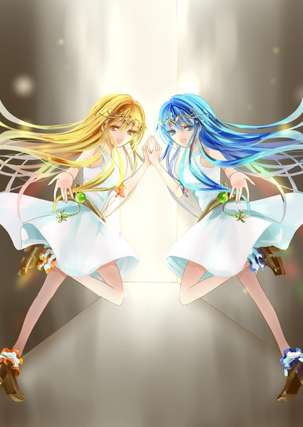

原文来源: [pixiv novel 13928777](https://www.pixiv.net/novel/show.php?id=13928777)
系列: 音楽†SFファンタジー『TEARED』HARMONIXシリーズ
顺序: 6

光の道は無限に続いていくようにも思えた。ぼんやりと足を進めていたイクスだが、はっ、と我に返る。
気付いたらエレノアナが消えていた。二色の光も、黒龍となったティアも消え、漆黒に塗りつぶされた世界で一人きりだった。

「ここは………いったい？」

道があるのかすらわからない暗闇の中、遠くの方に光が見える。あそこに向かえば何かわかるだろうか。だが、こんなに暗くては足元が見えない。地面に穴が開いていても気付けないだろう。イクスが逡巡していると、明るい声がイクスを呼んだ。

「何してるの、イクスくん！！早く行かないと！！」

暗闇の空間すらも明るく感じはじめるような、朗らかな少女の声だった。

「……ノアナ？」

金色の髪の少女がイクスの傍に現れた。蜂蜜のようにとろける瞳にイクスを映し、満面の笑みを咲かせる。

「正解！！えへへ、イクスくんだーーー！」

ノアナは嬉しそうにイクスに飛びついた。わっ、と体勢を崩しながらもなんとかノアナを受け止める。そんなノアナを別の少女が嗜めた。

「ダメよ、ノアナ。イクス様にご迷惑をかけたら……」

「エレナ……」

青色の髪の少女、エレナはイクスが名を呼ぶと嬉しそうにはにかんだ。深海のように深い瞳にイクスをしっかりと映してから、一礼をする。

「お久しぶりです、イクス様。またお会いできて嬉しいです」

「あ、ずるいエレナ！私も、私もまた会えて嬉しいよ！！イクスくんは？」

「嬉しいに決まってるじゃないか……いや、会ってないわけじゃないんだけど。でもこうやってエレナとノアナに会えるのも嬉しいよ」

ノアナとエレナはかつてマテリアルにされかけたエレノアナが双子にわかれてしまった時の姿だ。そのエレノアナとは毎日顔を合わせているのだから、厳密に言えばこれは“再会”ではない。だがそれでもイクスはノアナとエレナと再び会えたことが嬉しかった。

「私たちも同じ気持ち！いつも会ってるのに“久しぶり”って、ちょっと不思議だけどね」

「二人になって、イクス様への感謝と敬愛もいつもの二倍ですよ」

「あーーー！エレナ、それ私が考えたセリフ！エレノアナになった時に私が言ったやつじゃん！」

「考えたのはエレノアナだから、わたくしたちでしょう？独り占めはダメよ、ノアナ」

「そういうこと言うのは私の担当！勝手に盗っちゃダメ！っていうか、意味逆！！エレノアナになって二人の気持ちが合わさって二倍だね、ってあの時は言ったの！」

「あら、二人になってしまっても、イクス様への想いは半減しないでしょう？」

「うっ、それはそうかも……そっか。じゃあやっぱり二倍であってるね」

光のない空間に居ると言うのに、イクスはつい和んでしまう。相変わらずこの二人は仲が良い。エレナとノアナは“エレノアナ”でありながら、“エレナ”と“ノアナ”でもある。不思議な感覚はするが、当然の事実であるようにするりとイクスは納得してしまう。

一つだけ不思議なことがあるとすれば、ティアの心の中で二人に再会することができた理由だろうか。

「ところで、二人は何でここに居るんだ？エレノアナと一緒にティアの心の中に入ったんだと思ったんだが……」

イクスが問いかけると、エレナとノアナは無邪気に笑った。

「だって心の中だよイクスくん！当然、私たちの出番だよね！」

「だって心の中ですもの、イクス様。当然、わたくしたちがご案内いたしますわ」

どうやら二人の中ではこの再会は当然のものらしかった。

「……エレノアナって、実は心が二つに分かれたままとか、ない……よな？」

「ないよ？キュアを使ったから元通りになったじゃん」

「ありませんよ？エレノアナはティアちゃんのように多重人格ではありませんもの」

「そうか……」

女性の心は神秘だと言うが、こういうことだろうか。イクスは首を傾げながらも、ひとまず双子との再会を喜ぶことにした。

はっ、とエレナとノアナが急に手を叩いた。流石双子と言うべきか、二人は寸分狂わず同じタイミングで何かに気付いたようだった。

「エレナ、こうしちゃいられないんだった！」

「そうでしたね、ノアナ。イクス様、では参りましょう」

双子がイクスの手を片方ずつ取って引っ張る。ノアナはグイグイと。エレナはしずしずと。だがどちらも有無を言わさない様子でイクスをどこかへ連れて行こうとする。向かっている先は遥か遠くに見える光のようだ。

「どこに行くんだ？」

「ティアちゃんの心の奥だよ、イクスくん！」

「この道の果てに泣いているティアちゃんが居ます。少しだけ遠いですけど……」

「頑張って歩こうね！」

「わかった。道案内は頼むよ」

イクスが頼むと双子は嬉しそうに破顔し、元気よく頷いた。

イクスたちは暗闇の道を歩き続け、光の門にたどり着いた。門の中に足を踏み入れた途端に、パッと周りの景色が変わる。

思っていたよりも暗い場所に出た。涼しい風が吹く、満月の夜だ。辺りを見回すと、どうにも見覚えのある場所のように見える。見覚えのあるものを探すイクスの目に赤いサルビアの花畑が飛び込んできた。

「ここは……ロードの屋敷か？」

「正解よ、黒い髪のお兄様。もちろん、私の記憶の中のものであって、本物ではないのですけれど」

「――ティア！」

「こんばんは。いい夜ね」

白髪の髪と紫の瞳の少女がイクスに声をかけた。強い意思を感じさせる大人びた表情を浮かべているこのティアは“五番目”のティアだろう。

ロードの屋敷の庭には灰色の石像がいくつか点在している。そのうちの一つに気だるげに寄りかかり、腕を組んだ体勢でティアはイクスを睨みつけた。

「レディの心に土足で踏み入るなんて不躾な方なのね」

「え！？す、すまない。……でも、ティアを助けるにはこれしかないと思ったんだ」

「あら、別に責めてるわけではないのよ？ただ、会って間もない女のために、こんなところまで来るなんて。よっぽどのお人よしか、ただのバカね」

「そ、そうかな？」

どこか不機嫌そうなティアにイクスは弱り果てた。確かに、心の中を見られていい気分はしないのかもしれない。そう思ったイクスにノアナがこっそり耳打ちした。

「ティアちゃんはありがとうって言いたいのにうまく言えないだけだから、大丈夫だよ！」

「聞こえているわよ、黄色い蝶々さん。勝手なことは言わないでくださるかしら。感謝をしていることは……そうね。否定はしないけれど」

「私たちは蝶々なんだ？」

「だって、そうでしょう？表と裏ではなく、左右が異なる蝶だなんて珍しいこと。左右の大きさが異なっていたら不格好でしょうけど、あなたたちは美しいシンメトリーなのね。私たちなんかよりも余程の希少種じゃない」

「私たち珍しいんだって、エレナ」

「普通だと思うわ、ノアナ」

「ねー！」

「あらあら、仲の良いことね。私たちも見習わなくてはならないのかしら」

どうでも良さそうにティアが言った。

「それで？助けに来たと聞こえた気がするけれど。何をしに来たのかしら。今更あの子を救うなんて、私は無理だと思うわよ」

「マテリアルを人間に戻すには本人の意思が必要なんだ。だから説得しに来た」

「説得ねぇ……まあ、頑張ってみればよろしいのではなくて？あの子はあの中よ」

ティアがロードの屋敷を示す。現実世界にある屋敷もひっそりとしていたが、ここはそれ以上に人の気配がない。屋敷にある窓はすべて黒いカーテンで閉ざされていて、異様な雰囲気を醸し出していた。

「ロードの屋敷に、ティアが……」

「――タヌタとティアは少しだけ似ているでしょう？」

ティアは石像に背を預け、どこでもない場所を眺めていた。

「マテリアルとして望まれた者同士、というだけですけれど。でも、あの子がタヌタと自分を同一視するには十分だった。勝手に、自分と同じような存在だと思ってしまったのね」

「それは……でも」

「ええ。望まれた意味はまったく違うのにね」

確かにロードははじめ、タヌタが人間に戻ることを望んでいないかのような言動を取っていた。しかし、とイクスは目を伏せる。それは、ゲイスが己の地位のためにティアをマテリアルに変えたこととはまったく別の話だ。ロードの言動の裏には、ゲイスとは異なり、いつもタヌタへの深い思いやりがあった。

「だけど、それでもあの子は縋りたかったの。自分が父親に愛される可能性にね。だからあの子にとってタヌタとロードの屋敷は切望の象徴なのよ」

「それは、君にとっても？」

イクスはつい問いかけてしまう。今まで話してきた三人のティアたちは違う人格だと本人たちが言っていた。なら、物事の捉え方もそれぞれで異なるのではないだろうか。

「私たちを別の人間として扱ってくださるのね。嬉しいわ、素敵なお兄様」

機嫌を良くしたティアが口元に手を当てて上品に笑う。

「私は切望できるほど、夢見がちではないわ。言ったでしょう、わかりあえない人というものがこの世界にはあるのよ。今更、あの男が意見を翻したところで、私は受け入れられないでしょうし……」

ティアは言葉を区切った。

「……でも、いつまでも諦めないあの子がたまに、少しだけ、羨ましいわ」

ティアは“あの子には内緒”だと言い、イクスの背をそっと押した。屋敷に入るためのドアがひとりでに開く。中は見通せないほどの暗闇が広がっており、ランタンの光が一つだけゆらゆらとイクスを待っているかのように揺れていた。

「さあ、どうぞ奥へ。あの子が待っているわ。無理にとは言いませんけれど……あの子を連れ帰って頂けたら嬉しいわ」

「必ず連れて帰るよ、約束する」

「うふふ、百年に一度の王子様が、あなたであることを願うわ」

イクスたちは五番目のティアに見送られ、屋敷の中へと踏み込む。あまりの暗さに双子はぎゅっとイクスにしがみついてきた。ティアの心の入口にあった闇は平気だったが、この薄暗さは苦手らしい。

屋敷の内装は記憶にあるものと随分変わっていた。ずっと奥まで豪奢な宮殿のような廊下が続いていて、左右の壁にはドアらしきものが一つもない。灯りの消えたキャンドルだけがずらりと闇の奥まで続いていた。その最奥でランタンの光が揺れている。

廊下の奥からは微かに風の音が流れてきていた。よく耳を澄ませると、それが誰かの泣き声であることがわかる。不気味な光景だったが、イクスはただもの悲しい気持ちになった。

泣き声に混じって流れる“音”のせいだ。漆黒のマテリアルが奏でていた嵐の“音”ではない。優しい“音”が螺旋を描いて、眠るように深い暗闇へと落ちていく。誰かの指がたどたどしく、“音”を一つずつ奏でているかのような、美しくも切ない旋律だった。何か美しいものを抱えながらも、すべてが諦めになだれていくような“音”。これがティアの本当の“音”なのだろうか。

「……綺麗な音だね、イクスくん」

「……悲しい音ですね、イクス様」

「ああ………」

それ以外、イクスはなんと言えばいいのかわからなかった。代わりに廊下の奥から返答が返った。

「ティアのマテリアルの“音”ですよ。黒く濁る前は、こんな“音”だったんです」

廊下の奥でランタンが揺れる。足音もなく、先ほどわかれたばかりの少女が現れた。その表情は穏やかだが、どこか弱々しい。“二番目”のティアだ。

「イクスさん。約束、守ってくれたんですね。あの子を助けてくれるって……」

ティアは深々と頭を下げた。

「それが俺たちの旅の目的だから」

「誰かに気にかけてもらえるって嬉しいんですね。それが、どんな理由であれ……。あの子が欲しがっていたのは、これだったのかも」

ティアは胸の奥に生まれた何かを噛み締めるように瞳を閉じた。その表情はいつも通り、はにかむ様な曖昧な笑みを浮かべている。しかし、どこか困惑のようなものが笑顔の奥に見え隠れしていた。

「では、こちらへどうぞ。ここから先は光がないから……私についてきてください」

ティアの持つランタンの灯りに導かれて、イクスたちは廊下を奥へ、奥へと進んでいく。廊下はやがて石畳の階段に変わり、一同は地下へと降りて行った。塔を下っていくように、螺旋の階段をぐるぐると下る。ひんやりとした冷気が底から吹き上げ、冥府への入口に向かっているかのようだった。

何も言わずにエレナとノアナがイクスにしがみ付く。イクスの腕を掴んだ二人の手のひらの体温に、イクス自身もどこか救われていた。

「ここです」

階段の一番下には木造の錆びた扉があった。ティアが扉を押すと、蝶番が悲鳴を上げる。中は巨大な広間となっており、大きな木の箱が等間隔に並んでいる。どこかに灯り取り用の窓があるのだろうか。上を見上げるとどこからか白い月光が地下に差し込んでいた。

広間の奥にはまた木造の扉が一つある。泣き声と“音”はそこから流れ込んできているようだった。

「あの奥のドアが、あの子の居るところに繋がっています」

「ティアちゃん、ここって……何？」

ノアナが不安そうにティアに尋ねた。

「何……ううん。説明が難しいですね。強いて言うなら、“墓地”でしょうか？」

「お墓……」

等間隔に並ぶ箱の一つにティアが近づき、イクスたちを手招いた。中を恐る恐る覗き込むと、イクスたちを案内しているティアと同じ顔の少女が箱の中で眠っている。敷き詰められた黒い薔薇に埋もれる少女はおとぎ話の姫のようにも見えた。

「心が死んでしまった“ティア”はここで眠っているんです」

「三番目と四番目のティアちゃんは亡くなってしまったと聞きました……ここにいらっしゃるのですね」

エレナにティアが頷き返す。

「よく覚えていますね。……あの子が一回ね。普通になろうと思った時があったんです。多重人格じゃない、ただの普通の女の子になろうって……」

「……多重人格じゃなくなったら、今私たちの前に居るティアはどうなっちゃうの？」

「死にますよ。人格が居なくなるって、そういうことですから。“自分を殺す”ってシャレになりませんよね。
それで、あの子が普通になりたいがために、たくさんの私たちが死にました。だから私はあの子が嫌い。私が居たら、自分が普通になれないんだって泣きじゃくるあの子が大嫌い。自分だけ棚に上げて“普通”になろうだなんて、許せない」

激しい感情を語りながらも、ティアは穏やかなに微笑んだままだ。感情と表情の乖離にイクスは少し薄ら寒いものを感じた。

「私だって、平穏に、普通に生きたいのに。たまたま最初に生まれた人格だからって、あの子はいつも自分ことばっかり。だから、あの子なんて消えちゃえばいいのにってずっと願ってました」

「だけど、俺たちにマテリアルになったティアのことを助けてくれって言ったのは君だった」

「……妹みたいなものだからかもしれませんね。結局、あの子を見捨てることができなかった。ほんとに、困っちゃいますよね」

沈黙が落ちた。ティアは何かを思い出すかのように目を閉じている。

やがて目を開けたティアはにっこりと笑って、イクスたちを奥の扉へと導いた。

「さあ、イクスさんたちは、あの子を人間に戻してあげてください。お願いします。その後は、私がなんとかします」

「その後？どういうことだ？」

「あの子がマテリアルから人間に戻っても、すべて解決するわけじゃあないから……ゲイスとのしがらみがなくなるわけでも、あの子の……ううん。私たちの心の傷がなくなってしまうわけではないから。

でも、あの子が立ち上がれないなら、今度は私がちゃんと助けてあげなきゃなって今は思っています。生まれた順番は二番目ですけど、私の方がどう考えてもお姉ちゃんですからね！私がしっかりしないと！」

ティアは澄んだ瞳に強い決意を宿して、イクスたちを見送った。

広間の奥にあった扉を抜けた途端、イクスは煙っぽさを感じて顔をしかめた。空気が灰でざらついている。無数の吸い殻と、タバコが燃え尽きた後の灰が木板を張り巡らせた床の上に散らばっている。

先ほどまで居た地下広間とはまったく異なる光景が広がっていた。フローリングを床に敷き詰めた、薄汚れた小さな部屋の中にイクスたちは居た。ベッド一つ以外には家具の類はなく、閉め切られた窓を覆う黒いカーテンだけが揺れていた。

足元は灰まみれだ。タバコの吸い殻のようにも見えるが、それだけではこの灰の量は説明できそうにない。何か大きなものが燃え尽きてしまった後のようにも見えた。

窓が閉め切られた煙ったい部屋の隅で、一人の少女が膝を抱いて座り込んでいる。少女――ティアは声を押し殺して、一人きりで泣いていた。

「おい、グズ！！！テメェのせいだぞ！！！！」

前触れもなく、部屋中に怒声が鳴り響いた。部屋の隅でうずくまるティアの肩がびくりと揺れる。

「俺の人生はテメェのせいで滅茶苦茶だ！テメェが普通じゃねぇから！何にもうまく行きやしねぇ！！」

「お前の人生がうまく行ってないことにティアは関係ないだろう。うまく行くための努力を、お前がしてるとは思えない」

ゲイスの怒声に、イクスは思わず言い返した。

「おかげで俺は一生笑いもんだ！テメェみたいなグズが生まれたから、死ぬまで笑いもんだ！！なんで、テメェはそうなんだよ！！」

しかしゲイスはイクスの言葉を黙殺した。聞こえてもいない様子だ。イクスが戸惑っていると、部屋の隅からぽつりと少女が呟いた。

「……無駄だよ。それ、本物じゃないから」

あどけないその声が合図だったようにゲイスの怒声が止む。ゲイスは部屋に一つしかないベッドに横たわっているようだった。シーツからは枯れ木のような腕が覗いていて、イクスはぎょっとする。シーツをめくると憤怒の表情のゲイスが天井を睨みつけていた。その顔は先ほど会ったゲイスの顔と変わらない。腕だけが年齢を重ねてしまったかのように細く、弱々しいものになっていた。

「タヌタのお爺ちゃんは最後にタヌタに優しかったから。だからね、パパも死ぬ前にはティアに優しくしてくれるかなって思ったんだ」

ティアが顔も上げないままに語る。イクスたちに言い聞かせていると言うよりは、独り言を漏らしているようだった。

「でも、想像もできなかった。夢の中だけでも、私に優しくしてくれるパパに会いたかったのに。何も思いつかないの。何も」

年老いたゲイスの姿も想像できず、ゲイスの優しい言葉すらも思いつかない。腕だけがロードと同じように年老いた、歪な幻覚がベッドに横たえられていた。

「ティアは頑張っていい子にしてたんだよ。マテリアルにされたときも、本当は怖かったけど我慢したの。ティアが必要だって言ってくれたから。でも、マテリアルになってもパパは全然褒めてくれなかった。いつもみたいに殴ったり蹴ったりするだけで、ティアのことを全然見てくれないの。

タヌタはいいな。マテリアルになってお爺ちゃんに大事にされて。最後は人間の方が良いって言ってもらえて。なんでティアはダメなんだろう」

ティアがゆっくりと顔を上げた。

「ねえ、お兄ちゃん。どうしてタヌタは良くて、ティアはダメなの？」

「ティア………」

少女は目元に涙の跡を残したまま、イクスに問いかけた。紫の瞳は涙も枯れて、暗く淀んでいる。殴られたのか、頬は赤く腫れていた。よく見れば服の裾から青あざや火傷の跡も覗いている。

「わかんないよ、誰か教えてよ……」

傷と、罵声と、涙。それだけがティアの世界だった。

イクスはどう答えていいかわからずに黙り込んだ。エレナとノアナも何も言うことができなかった。
しかし不意に双子は互いに目配せしあい、何かを決意したように頷きあった。

「「ティアちゃん」」

部屋の隅でうずくまるティアの傍に座り込み、双子は少女の手を片方ずつ取った。左手をエレナが、右手をノアナが。優しく両手で包み込むようにティアの手を握る。

「私たちもね、どうしようもないって思ってるのに、諦めきれないことってあるよ」

「ティアちゃんのお話とは違いますけど、でも、わたくしたちもどうしようもないことを、どうにかしたくて苦しくなることがあります」

「私たち、ママとパパにまた会いたいって思ってももう会えないんだ」

「仕方ないとわかっています。もう、乗り越えたつもりではいるんです。でも、それでもふとした瞬間に、二度と会えないことがもの悲しい時がある」

ふと、“音”が聞こえた。ティアの“音”ではない。木々のさざめき、少しだけもの悲しい夕焼けの湖畔を思わせるこの穏やかな“音”はエレナとノアナのものだ。言葉よりも雄弁に、優しい気配が部屋を包み込む。

「でもね、悲しいことばっかり考えたら前に進めなくなっちゃうかなって私たち思ったんだ」

「悲しいこと、辛いと思っていることを忘れる必要はありません。自分の気持ちに嘘はつけませんから。でも、ずっと同じ場所に居る必要もないでしょう？」

「私たちは、引っ張ってくれる人が居たからそうやって考えられたんだ」

「こんなわたくしたちでも、良いと言ってくださる方が居たから、少しずつでも笑える未来の方へ歩き出そうと思えたんです」

「一人じゃ、立ち上がるのも大変だもんね」

「転んだ時は、誰かの手が必要でしょう？」

言いながら、エレナとノアナはイクスの方を見た。視線を受けて、え？とイクスは目を見開く。そんな大層なことをした覚えはなかった。そんなイクスの反応がわかっていたように双子がくすくすと笑う。

「……ティアにはそんな人いないもん。ティアを助けてくれる人なんて……」

「じゃあ、問題です！どうして私たちはここに居るんでしょう！」

ノアナが元気よく手をあげてティアに尋ねた。

「え……それは………どうして？」

はっ、と気付いたようにティアが目を丸くした。心底不思議そうな顔をする。

してやったりとばかりにノアナが満面の笑みを浮かべた。

「正解は、ティアちゃんに会うためでーす！」

「ティアに……？なんで？」

「泣いてる子を放ってはおけませんから。ね、イクス様？」

イクスは迷わずに頷いた。怖がらせないようにそっとティアに近づき、少女の真正面にしゃがみ込む。そのままイクスはコツンと自分の額をティアの額に当てた。ティアの紫の瞳が眼前に広がる。

エレナとノアナとは違い、イクスは“音”を奏でることができない。だが、ティアを放っておけないと思っているこの想いが少しでも伝わるようにと願った。少なくとも、ティアを泣かせたまま帰ることはできない。
涙と困惑で揺れる少女の目から視線をそらさずに、イクスは笑った。

「昔さ。俺が泣いてる時、母さんがよくこうやってくれてたんだ」

ためらいがちに手を伸ばすイクス。そっと伸ばした手をティアの頭の上に置いた。下手に触ると髪をくしゃくしゃにしてしまいそうで、遠慮がちな手つきでティアを撫でる。

「何も聞かないでさ。ずっと泣き止むまでこうしてくれた。だから、えっと……」

イクスが見つめるティアの瞳がくしゃりと歪んだ。

ティアはしばらく泣いていた。押し殺していた声が少しずつ大きくなって、今まで堪えていたものをすべて吐き出すように泣いた。

しばらくしてからイクスたちから少し離れ、目元をこすりながらためらいがちに口を開いた。

「お姉ちゃんたちが言ってることはちゃんとはわかんないよ……でも、ねえ……ティアは消えなくてもいい？人間に戻って、皆にまた会いに行っても……いいかな？」

「「「勿論！」」」

イクスたちは声を揃えて頷いた。イクスはティアと目線を合わせて、少女の背中を押すように穏やかに見つめた。

「他の“ティア”たちも待ってるよ。君のことを頼んだ、って二人にも言われたからさ」

「え……でも、ティアは酷いことしたのに？みんな、ティアのことは嫌いって言ってたのに……」

「それでも、ティアに会いたいってさ。ちゃんとティアのことを待ってる人は居るんだよ。ちゃんと、謝りにいかないとな？」

「うん……！」

ティアが嬉しそうに破顔する。だが、すぐに顔を曇らせた。

「た……タヌタにも会いに行って……いい、かな。タヌタにも酷いこと、言っちゃったから、もう会いたくないって言うかな……」

「タヌタもティアのことを心配してたよ。戻ったら、タヌタにも謝りに行けばいいさ」

「――そっか」

何かを噛み締めるようにティアが目を伏せる。少女がそれからゆっくりと顔を上げると、その表情には溌剌とした希望が宿っていた。

「ティア、頑張るよ！」

ティアが笑顔を浮かべると、夢から覚めるように部屋を白い光が包みはじめた。天井がなくなり、壁がなくなり、灰もどこかへ消えてしまう。朝日のように柔らかな光がティアを照らし出した。

ティアの目元に残っていた涙の跡を辿るように、新しい涙が一つ零れ落ちた。キラキラと輝きながら光に消えていく涙は、宝石のようにティアを美しく見せた。

ゆっくりとイクスの意識も遠ざかり――
