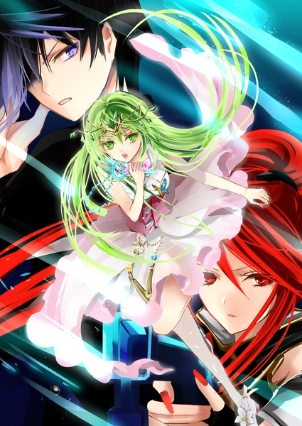
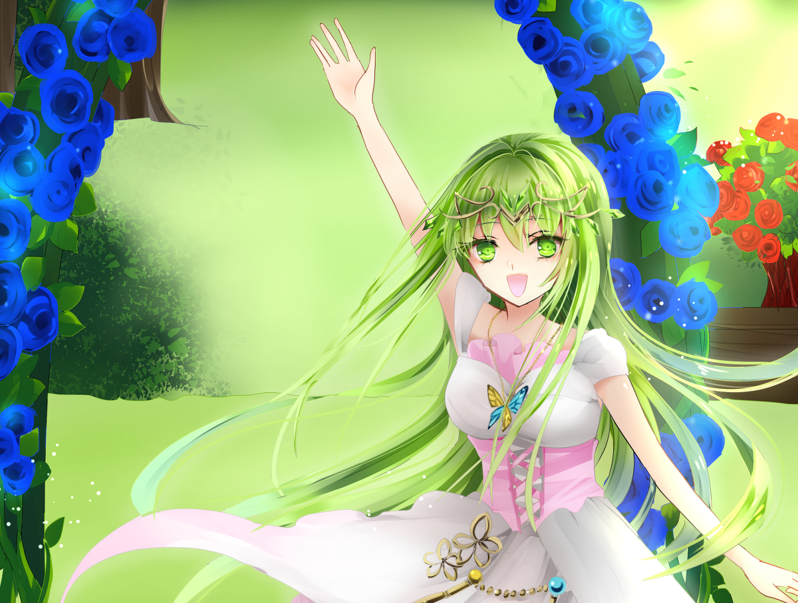
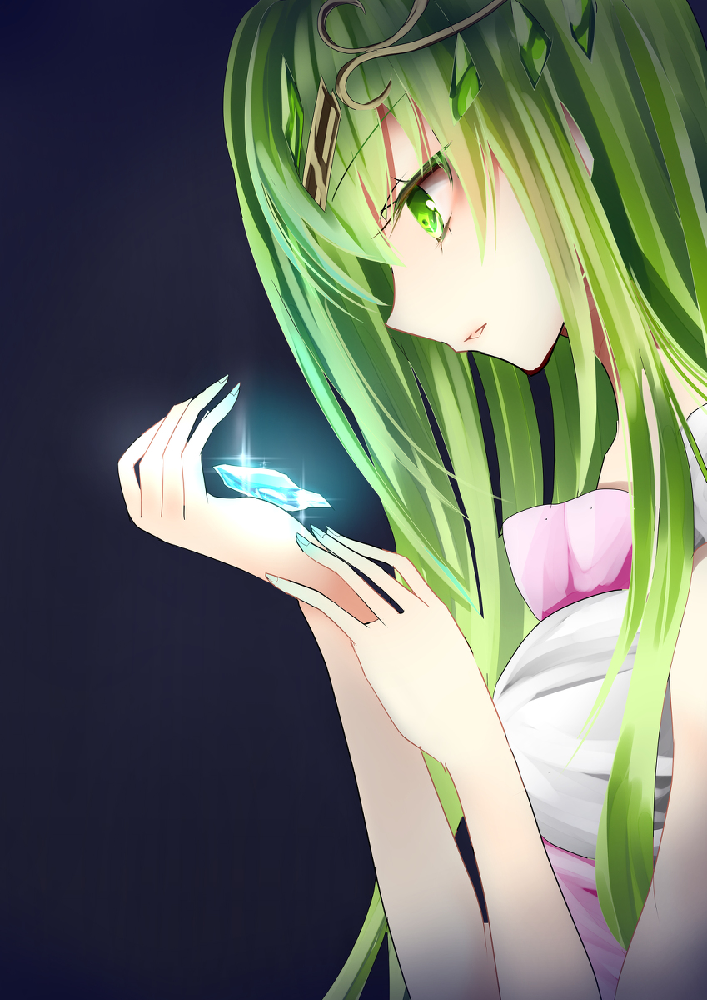
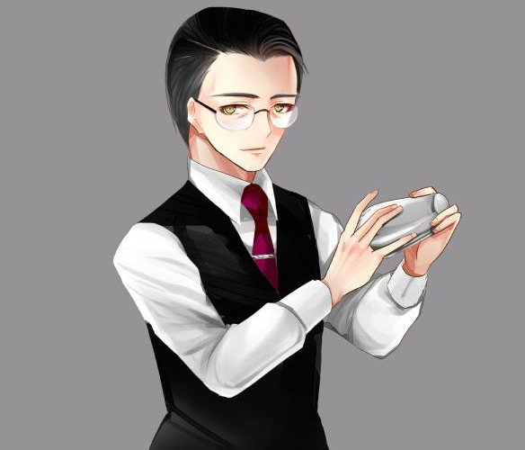
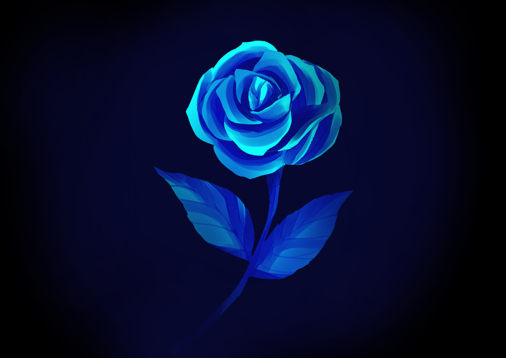
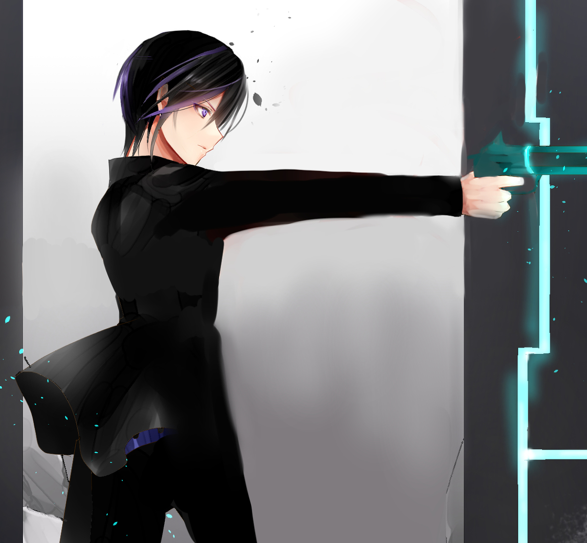
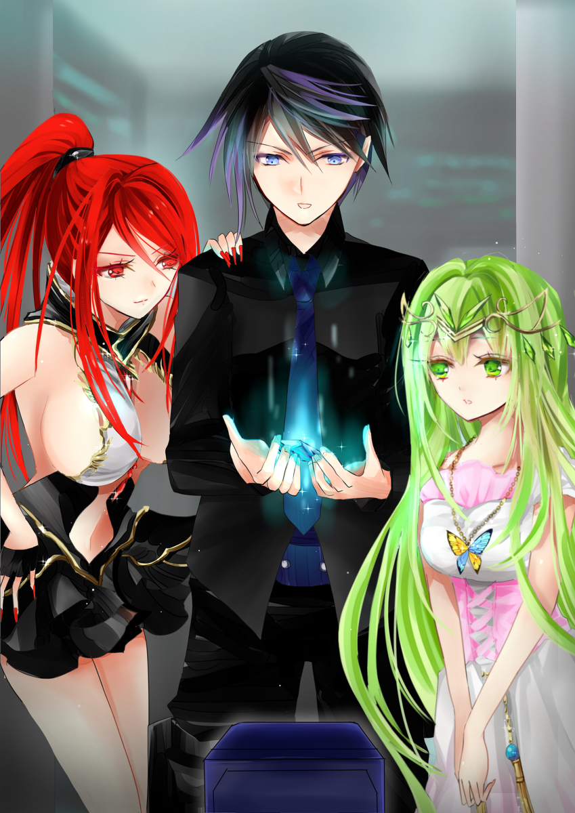

原文来源: [pixiv novel 13949509](https://www.pixiv.net/novel/show.php?id=13949509)
系列: 音楽†SFファンタジー『MYSTIQUE』HARMONIXシリーズ
顺序: 1

曲がりくねった石畳の道がイクスの視界いっぱいに広がっている。
なだらかな坂になっている道を辿り、二つ目の角を曲がると青薔薇の看板が見えてきた。

Bar『MYSTIQUE』。今回のイクスたちの目的地だ。

「へぇ……お洒落じゃない？こういうBarって最近あんまり見ないよね」

　玄関口に飾られたランタンをレイラが赤いマニキュアで塗られた指で示す。教会のステンドグラスをぎゅうっと球状に圧縮したような小さなランタンだ。明りが灯ればきっと夜道を美しく照らしだすのだろう。

「この地区自体がお洒落ですよね！レンガのおうちなんてロマンチックです！」

　はしゃぐエレノアナの桃色のワンピースがふわりと揺れる。暖かみのあるレンガ造りの家はエレノアナの柔らかな雰囲気に良くなじんでいた。

世界中の景観が高層ビルや警備ドローンに埋め尽くされつつある中、この付近にはまだ改革の波が押し寄せていないらしい。

快晴の空を見上げると、レンガの屋根が立ち並ぶ向こうに黒いビル群が見える。旧世代の景観が残っているのは、このほんの一握りの一角だけだ。時代の流れに取り残されたレンガの町並みは映画の世界に迷い込んだような非日常感にあふれている。

「ここに、マテリアルの持ち主が居るんだな」

　マテリアルとは人間を素材にして作られる、“音”を奏でる結晶体だ。レイラの父により開発され、最新の娯楽としてジェノサイドという企業が一部の人間に売りつけていた。

　かつてジェノサイド社と戦ったイクスの手元には“キュア”と呼ばれるマテリアルを人間に戻す道具がある。ジェノサイド社と共に立ち向かった仲間、エレノアナとレイラと一緒にイクスはマテリアルにされた人間を解放する旅を続けていた。

MYSTIQUEのマスターがマテリアルを購入したという情報を得たイクスたちは、さっそくそのBarへと足を運んでいた。

「まだ開いてないみたいね」

　closedの札が下がったドアをじっと見つめるレイラ。その隣でエレノアナがそっと窓から店内を覗き込む。電気は消え、人の気配がない。窓から差し込む麗らかな太陽光がBarカウンターに降り注ぎ、カウンターの上に飾られた鉢植えに咲く大輪の薔薇を陽気で包んでいた。真昼の明るさに少しばかり色をくすませているが、それでもなお鮮やかに赤と青の二色が店内を彩っている。

「あそこに飾ってある薔薇、とても綺麗ですね！看板にも青い薔薇が描いてありますし……薔薇で有名なお店なんでしょうか？」

「“神秘の薔薇”ってトコロかしら？素敵な趣味じゃない？」

「お褒めにあずかり光栄です、お客様。当店では薔薇を使用したカクテル等のご用意もあります。お時間がありましたら、ぜひお立ち寄りください――今日は休店日なんですけどね」

　柔らかな声がイクスたちに向けられた。振り向くと、細長いシルエットの男が一人立っていた。黒いシックなベスト、首元をしっかり閉めた白いシャツ、そして整えられた髪が男を生真面目なバーテンダーに見せるが、洒落たマリンブルーのネクタイと細いフレームの眼鏡がどことなく堅すぎない、暖かな雰囲気を作り出していた。

　物腰柔らかに、しかし少しばかり大仰に男が一礼を取る。何かの買い出しの帰りだろうか。その片手には小さな紙袋が抱えられていた。

「もしかして……ここのBARの人ですか？」

　エレノアナの問いに男が微笑み、頷く。

「はい。MYSTIQUEのマスター、ヤスと申します。あまりにも熱心に見られていたようでしたので、ついお声をかけてしまいました」

「ねえ、今、薔薇を使ったカクテルって言った？薔薇を入れるの？お酒に？」

　強く興味を惹かれたようにレイラが目を見開く。

「ええ。当店のオリジナルカクテルです」

「へぇ……薔薇を飲むなんて、面白いわね。そういえば、食用の薔薇なんてものもあるって聞いたことがあるけど。ここで育てているの？」

「店の裏手に薔薇園があって、そこで育てていますよ。御覧になりますか？」

「あ……でも、お休みなんじゃ……」

　ためらいがちに尋ねるイクス。語気が弱くなるのは、店の裏手にあるという薔薇園に心惹かれているからだ。遠慮よりも好奇心が勝り、イクスの身体が少し前のめりになる。

　そんなイクスの思いを読んだかのようにマスターは優しく微笑んだ。

「いいえ、これも何かの縁……どうぞお立ち寄りください」

　Barのマスターに案内されて店の裏手に通されたイクスたちは、庭に足を踏み入れた瞬間に絵本の世界にでも迷い込んだ錯覚に陥った。

　薔薇庭はレンガの建物に囲まれ、まるで中庭のようになっていた。空を見上げると赤茶のレンガに区切られた青空が雲を漂わせていて、急に時間の流れが遅くなったかのような穏やかな雰囲気が漂う。

　物静かな庭園で耳を澄ますと微かな小鳥の声がどこからか聞こえてきた。静閑としているが、音がないわけではない。木の葉のざわめき、ひゅるりと舞うそよ風の囁き。普段、耳にしていても意識すらしない自然音に囲まれて青々と生い茂る蔦や木々。そんな風景画のような光景を彩るように、色とりどりの薔薇が咲き誇っている。中でも目立つのが、とびきり鮮やかな色に輝く赤薔薇と青薔薇だ。

　風のさわやかな匂いに混じって、香しい薔薇の甘さが漂う。薔薇は匂いの強い植物だとイクスは聞いたことがあったが、思っていたよりも優しい香りがした。

「わぁ……！イクスさん、イクスさん！見てください、薔薇のアーチがありますよ！」

「本当だ……。凄いな。なんか……」

　なんだか、現実じゃないみたいだ。

　青い薔薇が咲き誇るアーチの下で楽しげにエレノアナが笑っている。アーチを見回すエレノアナがくるくると回る度に、薄桃のスカートが天使の羽のように翻った。

「ふふっ、可愛いお姫様みたいね、エレノアナちゃん。ねー、イクスくん？」

「うん……そう、ですね」

　楽しげなエレノアナはそう、まるで童話の世界のお姫様のようだ。小さい頃に読んだ絵本に、こんな挿絵はなかっただろうか。

「ええ！？お姫様ですか！？そんな、あ、でもそしたらイクスさんは……」

　はっと何か気付いた顔をしたエレノアナが思わず、と言ったように自分の頬を両手で挟んだ。徐々に赤く染まっていく頬を目ざとく見逃さなかったレイラの口元が笑みを描いた。艶やかで、悪戯っぽいレイラらしい笑みだ。情熱的な赤い瞳が満足げな猫のように細められる。

「おんやぁ～～？エレノアナちゃんは今何を考えてのかな～～？」

「な、なんでもないです！なんでもないんです！」

「童話のお姫様って来たら、もちろん出てくるのはお――」

「レイラさん！」

「あはは！エレノアナちゃんったら慌てすぎよ！仕方ないわね、イクスくんには黙っといてあげる」

「え？何の話ですか？」

「秘密！ね、エレノアナちゃん！」

「はい！秘密です！」

　良くわからないが、レイラとエレノアナが楽しそうにしていた。どうにも自分にも関わっているような気がするのだが、と首をひねりながらもつい口元が緩んでしまうイクス。大切な仲間である二人が楽しそうにしていると、イクスもつられて暖かな気持ちになった。

「もう、レイラさんってば……薔薇って言うなら、レイラさんが一番薔薇です！」

「まあ、髪も目も赤いものね。でも私はお姫様って感じでないでしょ？」

「女の子は全員お姫様なんですよ？レイラさんは薔薇のお姫様です」

「私がお姫様ねぇ……城で大人しくなんかできないから無理じゃないかなぁ。まあ、エレノアナちゃんも大人しくはしてなさそうだけど」

「はい！お姫様になってもイクスさんとレイラさんと一緒に旅がしたいです！」

「うん、百点満点！元気なのはいいことね！」

「はい！……って、あ！ご、ごめんなさい、マスターさん！すっかりはしゃいじゃいました……」

　薔薇園の光景にはしゃいでいたエレノアナが慌ててマスターの傍まで駆け寄る。イクスたちを案内したマスターは庭園の入口で変わらない穏やかな笑みでエレノアナとレイラのやり取りを見守っていた。

　その眼差しがまるで何かを懐かしんでいるようにも見えて、イクスは目を瞬かせた。マスターの微笑んでいる表情が一瞬、ひどく悲しそうな顔に見えた。

「フロイライン・ルージュ――“紅の令嬢”」

「フロイライン・ルージュ？」

　レイラを見つめながらマスターがぽつりとこぼした言葉を思わず繰り返すイクス。紅の令嬢。レイラをまるでそのまま表しているかのような言葉だった。レイラの容姿でまず目を惹くのはその赤い髪と瞳だ。燃えるような色合いは情熱的で苛烈だが、端整な容姿には確かにどこか気品があり、“令嬢”と言われればしっくりときた。

「当店の看板商品……MYSTIQUEのオリジナルカクテルです。まるで、レイラさんのために作られたカクテルだと思いまして」

「お姫様の次はお嬢様ねぇ……。自分に例えられるとちょっと複雑な気分だけど……カクテルには興味があるわ。さっき言ってた、薔薇のカクテルのこと？」

「……ええ。良ければお作りしましょうか？――いいえ。ぜひ、作らせてください。“彼女”もきっと、あなたを見たらそうしたでしょうから」

「“彼女”？」

「この薔薇園を作った人です。……彼女の理想は赤い大輪の薔薇でした。まるで、あなたのような。フロイライン・ルージュには彼女の夢が詰まっているんです」

　傍に咲いていた赤い薔薇に視線を落とし、そっとその花弁に触れるマスター。薔薇を傷付けないように、薔薇を守る棘で傷付かないように、ためらいがちにマスターの指が薔薇を撫でる。その横顔を見ていると、断わるわけにはいかないという気持ちがイクスの中に沸き上がった。

「ぜひ、作ってもらえませんか？レイラさんにそのカクテルを」

　思わず口走ってしまってから、いいですかと確かめるようにレイラの方に視線を飛ばすイクス。視線の先に居るレイラはとびっきりの笑顔で頷き、ぱちりと茶目っ気のあるウィンクを飛ばした。

「……ありがとうございます。では、店内の方へ」

　マスターに連れられてBar店内に戻る。店の裏口に手をかけたところで、イクスはエレノアナがついてきていないことに気付いた。

「エレノアナ？」

「あ、イクスさん。ごめんなさい、ちょっと……」

　振り向くと、エレノアナが地面から何かを拾い上げているところだった。宝石の一粒にも似た、小さくて綺麗な結晶の欠片だ。ピカピカに磨かれた表面は綺麗すぎて、返ってガラス玉のようにも見えた。欠片がまとう淡い青色の光になんだか見覚えがある気がして、イクスはじっとエレノアナの拾い物を見つめる。

「これ……マテリアルか？」

「それにしては、小さくて、なんか違うような……マテリアルの……“模造品”というか……。“音”も鳴らなくって……。普通の宝石とかではないとは思うんですけれど」

　エレノアナが自分の感覚をたぐるように慎重に言葉を口にする。

　そうだ、とイクスは今更ながらにこの店にきた目的を思い出す。イクスたちはマテリアルの持ち主が居ると聞いてMYSTIQUEを訪れたのだ。

　この欠片はマスターの持っているマテリアルと何か関係があるのだろうか。見通せない暗雲が渦巻いているような不安がイクスの中で渦巻いた。

　マスターの手が裏口の鍵を閉める。MYSTIQUEに踏み入ったイクスたちは改めて店内を見まわした。

こじんまりとした店だった。味わい深い木目のインテリアとオレンジの明かりが親密な空間を作り出している。イクスはしばらく惚けたように壁一面にずらりと並んだボトルを見つめた。どのボトルも異なるラベルが貼られていて、形もサイズも異なる。種々様々に輝くボトルが並んでいると、ジュエリー・コレクションを眺めているような気分になった。

「少々お待ください。今、準備をしてまいりますので……」

「あ！あの……すみません」

　マスターに声をかけられ、イクスは本題を思い出した。

「あの……実は俺たちマテリアルという物を探していて」

「マテリアル……ですか？」

　マスターは意外そうにイクスに聞き返した。

「はい。“音”が鳴る結晶……宝石のような物です。MYSTIQUEのマスターがマテリアルを持っていると聞いて俺たちはここに来たんです」

「“音”……」

　イクスの説明に少し考える素振りを見せるマスター。

「……宝石と言われれば、心当たりはあります。しかし、 “音”が鳴ったかどうかは……。その、マテリアル、と言うものではないと思います」

「“音”が鳴らない……？」

　訝しげにレイラが呟く。マテリアルは“音”を楽しむために作られる――作られてしまった結晶だ。それが“音”が鳴らないということがあるのだろうか。

「それじゃあまるで失敗作のような……そんなものを、ジェノサイド社が売るかしら……？」

「ジェノサイド社、ですか？最近、本社が倒壊したと言う？」

　マスターが予想外の単語を聞いたかのように目を見開く。ジェノサイド社の壊滅のニュースはこの町まで届いていたらしい。その顛末に関わっているイクスは内心ぎくりとしながらも、平静を装ってマスターに頷き返した。

「は、はい。そのジェノサイド社です。MYTIQUEのマスターがジェノサイド社からマテリアルを購入したと聞いたんですけど……」

「…………そうか、ジェノサイド社か……。いいえ、その会社から宝石を買ったことはありません」

「そんな……だけど情報が間違ってるなんてことはないはずなんだけどな……」

　困惑したようなマスターと似たような表情をイクスも浮かべる。どうにも話が今一つかみ合わない。助けを求めてイクスがレイラの方を見ると、レイラはレイラで何か考え込んでいるようだった。

　ふと、エレノアナが閃いたように顔を輝かせる。

「あ、あの！さっき、薔薇園でこれを拾って……マテリアル………みたいなものだとは思うんですけど……。光り方とかは、とてもマテリアルに似ているんです。心当たりはありませんか？これ、マスターさんが落としたものだったりとか……」

エレノアナは先ほど拾ったばかりの、淡い光を放つ青い結晶の欠片をそっと手のひらに乗せてマスターに差し出した。

　マスターが欠片を手に取り、検分するように目を細める。

「…………いいえ。私が落としたものではありません。お客様が薔薇園を訪れることもありますから、なんとも……」

「そうですか………」

　心なしか肩を落とすエレノアナ。そんなエレノアナとマテリアルに似た結晶の欠片を見比べながら、マスターは何かを思い出すように慎重に口を開いた。

「………しかし、確かに私の手元にもこのように不思議な光を放つ宝石はありました」

「本当ですか！それは今――」

　イクスが身を乗り出すと、ゆっくりとマスターが首を横に振る。

「ですが、今は別の人の元にあります」

「え…………？」

「わけあって手放してしまいまして……」

驚くイクスたちを見て、困ったような顔をするマスター。マテリアルを手放したことには何か事情があるようだった。

「それは、今誰が持ってるの？」

　レイラがすかさず尋ねる。

「…………………」

　マスターは何故かしばらく黙り込んでしまった。顎に手を当て、何かを考え込んでいるようだ。じれったい数分が流れて、ようやくマスターが再び口を開く。

「………これも、運命の思し召しか…………」

「え？」

　　ぽつりとマスターがこぼした一言が聞き取れずに聞き返すイクス。しかしマスターは曖昧に微笑んで、ゆっくりと首を横に振った。

「いえ………。当店の常連のお客様が今はその宝石を持っています……ほとんど毎日のようにいらしていますので、明日また来ていただければ会うことは可能だと思います。……そうですね、少々エキセントリックな方ですが……悪い方ではないので、話は聞いてもらえるかと。あなた方も、何か理由があってマテリアルをお探しのようですし」

　そこまで語ったマスターは場の雰囲気を変えるようにイクスたちに微笑みかけた。ロマンチックなBarのマスターに相応しい、穏やかで、どこか神秘的な笑みだった。

「この話の続きは、後ほど……。カクテルの材料を取ってまいりますので」

　イクスたちはマスターに勧められるままにカウンター席に腰を下ろした。

　マスターがカクテルの用意をしている光景をイクスは漫然と眺めていた。見慣れない銀色の水筒のようなものに、氷が詰められていく。マスターの指先が手慣れたように動く様はまるで手品を披露するようだった。

「でもどうしてマテリアルを手放しちゃったの？」

　カウンターに肘をついてレイラがマスターに問いかける。

「賭けに負けたから、ですかね」

「賭け？それって、なんかの比喩？」

「いえ、文字通り賭博の話です。常連客同士で良く賭け事をしているのですが、たまに私もそこにお邪魔させてもらうことがありまして。一回、大きく負けが込んで……その時にね」

「へぇ……なんか意外だね」

　予想外の返答にレイラが少し驚いたような表情を浮かべた。物腰の柔らかなマスターと賭け事のイメージが結びつかず、イクスも首をひねる。

「知り合い同士の勝負で賭けるにしてはすごいモノを賭けましたね。マテリアルなんて簡単に手に入るわけじゃないのに……」

「どうしてもその宝石が欲しいと言われたんです。私も賭けの内容に釣り合わないと、最初はお断りしたのですが、どうしても、と何度も言うもので。最終的にはお渡しすることにしました」

　マスターは困ったように笑った。

「望まれてこそ輝くのが宝石という物ですからね」

　銀色の筒に蓋が被せられ、マスターの両手の中に収められる。中にカクテルの材料が収められているらしい。それを振って混ぜているのだと一拍置いて理解するイクス。

理解が遅れたのは、マスターの振る筒から漏れ出る音がなんとはなしにマテリアルの奏でる“音”を思わせたからだ。水の重みが筒の底にぶつかる音と、微かに聞こえる涼やかな氷の音。マスターの腕の動きに合わせて自在に音が変化する様子は、依然レイラが扱った“楽器”と呼ばれる“音”を操る道具に相通じるものがあった。

　やがて、三人分のカクテルがグラスに注がれ、カウンターに並べられる。青、ピンク、そして赤。三色の美しい色合いの液体がグラスの中で揺れている。グラスの縁を彩るように、そっと薔薇の花が飾られた。

「エレノアナさんの分はノンアルコールでお作りしています」

　どうぞ、と三人の前に差し出されたカクテルにイクスは息を飲む。イクスの前に出されたのは青薔薇のカクテル。深い海のように澄み切ったブルーマリンが美しい。一口飲むと、引き締まった酒の辛さに舌がぴりりと痺れる。それでいて爽やかな飲み心地だった。

　エレノアナの前に置かれたのはピンクの薔薇のカテルだ。イクスとレイラのグラスに飾られた薔薇よりも少し小振りで、可愛らしい。

「これ、美味しいです……！甘いけど、甘すぎなくて……ちょっとだけ蜂蜜みたいな味がするのは……薔薇のジャム、でしょうか？」

「よくおわかりですね。当店で育てた食用薔薇を煮詰めてジャムにしたものを材料として使っております」

「お母さんに薔薇のジャムを作ってもらったことがあって……ちょっとだけ、その時の味に似てたので」

　わくわくした様子でピンクのカクテルを飲むエレノアナ。

　その隣に座るレイラの前に出されたのが赤薔薇のカクテル、フロイライン・ルージュだ。店内の灯りに照らされ、見る角度によって炎のような光を揺らめかせる赤いカクテルの上に大輪の赤薔薇が誇らしげに咲いている。すらりと背の高いカクテルグラスに収められた紅色のカクテルは確かに“令嬢”の名を冠するにふさわしかった。

「薔薇のカクテル……綺麗。……綺麗ね」

　レイラの赤い目が魅入られたようにカクテルグラスを見つめている。ゆっくりとカクテルを一口含み、口元を小さくほころばせるレイラ。どうやら気に入ったらしい。大切なものをもらったように、一口ずつ嬉しそうにカクテルを飲んでいく。

「このカクテルは、薔薇園を作った人が考えたの？」

「彼女と私が二人で考案したレシピです。……ああ、フロイライン・ルージュの素案は彼女が一人で作ったものですが……」

　レイラの様子をどこか懐かしむ様な目で見ていたマスターが困ったように笑う。どういうことかとレイラが視線で促すとぽつぽつとマスターが語り始める。

「元々は、レシピ勝負をしていたんです。私と彼女の二人で。薔薇を使ったカクテルを作る、と二人で意気込んだのは良かったのですが……私は青薔薇を使いたくて、彼女は赤薔薇を使ったカクテルを作りたかった。
……ええ、なので、勝負をすることにしたんです。互いに考えたカクテルを互いに試飲してもらって、この店の看板カクテルをどちらかに決めよう、と」

「じゃあ、俺が飲んでる方のカクテルがマスターさんの考えたものってことですか？」

「そうなりますね。元は私が考案したものです。彼女と二人で、その後も試行錯誤で味の調整をしましたから……そちらも結局は二人で作ったようなものなのですが」

　イクスは自分のカクテルグラスに目を落とす。海のように深い青色の液体がゆらゆらと揺れている。マスターのこだわりをこめて考えられたのがこのカクテルなのだろう。

「青薔薇の方が好きなんですか？」

「……好きかどうか、というよりは、何を理想に置くかという話とでも言いましょうか」

　こんな話をご存じでしょうか。

　ふと、マスターがイクスたちに問いかける。細いフレームの眼鏡の奥にある目が楽しそうに光る。

「青薔薇は自然界には存在しないんです」

「え？でもこれには青い薔薇が……」

　思わず自分の手元にある青薔薇をじっくりと見るイクス。まさか偽物だとでも言うのだろうか。恐る恐る、神秘的な青色に染まった花弁に手を触れる。生きた花のビロードのような感触があった。間違いなく本物の薔薇のように見える。

「薔薇は様々な色を持って生まれてくる。しかし、その中に海の青色だけは存在しなかった。悲しみを表す色だから、あえて花の女神が青い薔薇は咲かせなかったとも言われております。存在しないものは人の情熱を駆り立てる。多くの者が我こそはと青い薔薇の実現に挑み――敗れていきました。だから青薔薇はかつて“不可能”という花言葉を持っていた」

「聞いたことあるわ。薔薇は生まれつき、青い色素を持たないのよね？でも、確か……それ、結構前の話よね？」

「そう。不可能と言われていた青薔薇の再現に成功した者が現れた。そして青い薔薇の花言葉はそれ以降、“夢は叶う”に変わりました」

「夢は叶う……」

　途方もない話にイクスはぼんやりと青薔薇のカクテルを見下ろす。この薔薇がかつて存在していなかったと思うと、不思議な気分にもなる。

「私にとって、自分の店を持つことは長年の夢でした。かつては不可能だと思っていましたが……でも、私の夢は確かに叶った。だから、この店のオリジナルカクテルを出すとなった時に、真っ先に青薔薇のカクテルを作ることを考えたんです」

「でも、看板カクテルは赤薔薇のカクテルの方なんですか？」

　エレノアナがレイラとイクスのカクテルを見比べながら訪ねる。するとマスターは緩やかに苦笑した。困った、とでも言いだしそうな顔のまま、暖かい視線をレイラのグラスに注いでいる。

「彼女の情熱に負けてしまいました。思えば、あれが初めて負けた賭けかもしれませんね」

　きっと大切な人だったのだろう。赤薔薇のカクテルを見るマスターは優しい顔をしていた。

「薔薇をグラスに沿えるのは彼女のアイデアだったんです」

「そうなの？薔薇を丸々飾るなんて、驚いたけど……」

「どうしても、薔薇を出したかったそうです。お客様を傷付けないように、ちゃんと棘を抜いて。……人の心には棘がありますからね」

「え？」

　それがいったいどういう意味なのかとマスターを見つめるイクス。マスターは謎めいた微笑みを浮かべて、イクスに視線を返した。

「彼女の信念です。面白い人だったんですよ」

　なんとなく踏み込むことを躊躇わせるような、不思議な微笑みだった。

　イクスたちはMYSTIQUEに明日また訪れる約束をして店を出た。マテリアルの持ち主に会うためだ。石畳の道を歩き、しばらくしたところでエレノアナが店の方を振り向いた。

「なんだか寂しそうでしたね、マスターさん……」

「まあ、なんかあったんでしょうね」

　マスターの言う“彼女”はきっと居なくなってしまったのだろう。深く聞かずとも、それだけは察することができた。

「何があったんだろうな……」

「さあねぇ。そりゃあ聞かなきゃわかんないけど。でも……もしかしたらマスターさんは置いていかれちゃったのかもね」

「置いていかれた？」

「わかんないけど……ちょっとだけ、置いてかれる気持ちってやつはわかるからさ……」

　エレノアナと並んでMYTIQUEの方を見つめていたレイラの目が伏せられる。滲み出るようなほのかな哀愁にイクスも胸が微かに痛む。

「レイラさん……」

　レイラの父親はマテリアルの騒動に巻き込まれて命を落とした。置いていかれてしまった者の痛みは知っているのだろう。

顔をくもらせたイクスを見て、レイラはくすくすと笑った。

「ああ、パパのことじゃないよ？パパにも確かに、置いてかれちゃったけど。今考えてたのはパパじゃなくって……」

　レイラがイクスをその赤い目で捉える。苛烈で、情熱的で、曇り一つない美しい目だ。

「初めて会った時のイクスくん」

「……え？」

「ううん、エレノアナちゃんと会う前のイクスくんかな。……ちょっとだけ悔しいけどね」

　誰にも聞かせるつもりがないような、小さな声でレイラが呟いた。

「見た目は普通なんだけど。たまに、ふとしたことでどっか行っちゃうような……そんな感じがしたんだ」

「えっ？イクスさんが、ですか？」

「昔のことよ？エレノアナちゃんがあの時のイクスくんに会ったらびっくりするかも。何て言うか、生きる気力がない……ってのもちょっと違うのかな。執着がない、って言うか」

「………………」

　咄嗟にイクスは何も言い返させなかった。何かを言わなければと開いた口がそのまま閉じられてしまう。胸がずしりと重くなったのは図星を突かれたからだろう。

「いつか、イクスくんはジェノサイド社から居なくなっちゃうのかもな、ってずっと思ってた。何も言わずにある日、どっか行っちゃうんじゃないかって」

「俺は……」

「――まっ！そしたらまさか、一緒に旅に出ることになるなんてね！人生ってどう転ぶかわかんないものねぇ」

「……そんな風に俺思われてたんですね」

　イクスは傷付いたような声を漏らしてしまう。口に出してからしまった、と思った。レイラの言葉に傷付いたわけではないのだ。どちらかと言えば、これはイクス自身の問題に過ぎない。どう説明しようかと迷っているうちに、レイラが少し申し訳なさそうな表情に変わった。

「あー、ごめん。勝手なこと言ってさ。なんとなーく思ったこと言っただけだから。テキトー言っただけ。ね？だからあんま気にしないで」

「いえ。たぶん、レイラさんは間違ってないと思います。ちょっと、あー………」

　イクスは空を仰ぐ。本音を伝えるのは難しい。だけど、ちゃんと言わなければレイラを傷付けてしまう。覚悟を決めるために大きく深呼吸をしてから、イクスはたどたどしく言葉を紡いだ。

「……ちょっと思い当たる節があって。レイラさんは俺のこと、よく見ていてくれてるんだなって……思ったんです」

　思い出したのは随分と昔のことだ。古ぼけた記憶のはずなのに、まだうまく直視することができない。

　本当はずっと知っていた。乾いた心を、色の無い世界しか映らない目をなんと言うのか、イクスは知っていたのだ。

　人はそれを諦めと言うのだと、心のどこかでイクスはわかっていた。そんな己をレイラに見透かされていたのかと思うと、イクスは落ち着かない気持ちになった。誰にも気付かれていないと思っていた。誰にも気付かれていないと思っていたからこその諦めだったのに――。

　持て余す感情が胸の中で渦巻いていて、イクスは困ってしまう。これをどうすればいいのか、今のイクスにはわからなかった。だけど、嘘偽りなく言えることが一つだけある。

「……あの、いつか話したいことがあるんです。レイラさんと、エレノアナに。まだ今は話せないけど……話せるようになったら。その時になったら、聞いてもらえますか？」

　いつになく真面目な顔をするイクスを見て、エレノアナとレイラが顔を見合わせる。そしてぴたりと息を合わせたかのように二人そろって破顔する。

「もちろんですよ、イクスさん！私で良ければ喜んで！」

「エレノアナ……ありがとう……」

「なーに言ってるのよ、イクスくん。聞くに決まってるじゃない。イクスくんが思ってる以上に、私はイクスくんに興味があるんだからね？」

「え……そ、そうなんですね」

　くすくすと笑うレイラに何故だかどきまぎとしてしまうイクス。平静を取り繕ったものの、落ち込み気味だった気持ちがすっかり晴れるほどの動揺に襲われた。

「ふふふ、楽しみにしてるからね？」

「………はい」

　この人にはやっぱり勝てないなぁ。心底楽しそうに目を細めるレイラにイクスは苦笑する。
　随分と長いこと肩にのしかかっていた重みが、なんとなく少し軽くなったような心地がした。

　日が沈み始めたことに気付いたイクスたちはひとまず宿を探すことにした。MYSTIQUEのマスターに聞いたところ、この通りにホテルはないらしい。古い時代のロマンチズムを思わせる街通りから離れて、繁華街の方に向かえば何かしら泊るところはあるとのことだった。

マスターに教えられた方向に向かって、石畳の道を歩いていると、数十分ほどで道の端まで辿り着いた。先ほどまでは風の音が聞こえるほどに静かだった町並みがにわかに騒々しいものへと変わる。まるで世界が切り替わるかのようにビル街がイクスたちの前に広がった。

立ち並ぶビルの隙間から大通りのような道が見えて、種々様々な人々が無秩序に行き交う様子が見える。ゆったりと空を泳ぐ飛行艇からは色とりどりのノボリがぶら下がって何かの店の近日オープンを高らかに喧伝していた。

「なんか、現実に帰ってきてみたいな感じがするわね」

「夢みたいな街角でした……お店も……」

　エレノアナがまだ少しぼうっとしたようにため息を吐く。イクスも心地よい疲労感のようなものと、名残惜しさを感じて、来た道の方を振り返った。

「寂しいような、ほっとしたような感じがするのは何なんだろうな……」

「あら、イクスくんってば都会っ子なのね。地元もこんな感じなの？」

「まあ、ここまでじゃないですけどそれなりには……。町はずれの方に行くとちょっと古い感じの施設もありましたけどね」

　先ほど思い出した古い記憶に引きずられて、故郷の思い出がイクスの脳裏に浮かんでくる。故郷のことを思い出すのも随分と久しぶりだった。

「へー、どんなの？」

「たとえば、射撃場とか……アナログ式って言うんですかね。本物の銃を持って、木でできた的を狙うような」

「うわっ、それ昔の資料かなんかで見たことある！ええっ、私たちが生きてる時代にまだそういう施設あったの！？」

「レイラさんの方が都会っ子じゃないですか……」

　アナログ式の射撃場はそこまで古臭いものではない。……はずだ。

　そんな話をしていると、ふとレイラがドームのような建物の前で足を止めた。ちょうど建物から人が出てくると、ネオンと電子音が走る店内が見える。ゲームセンターに似た雰囲気だが、噂をすればなんとやら、どうやら射撃場らしい。最新のレーザー銃で的を狙い、ポイントを競うようだ。

　射撃、と見てイクスは思わず店を凝視してしまう。そんなイクスの反応を知っていたかのようにニッとレイラが笑った。

「ちょっと寄ってかない？腕、なまってないか見てあげる」

「……お手柔らかにお願いします」

　苦笑するイクスだが、その目は好戦的に光っている。

レイラの射撃の上手さは良く知っている。相手の意識の間隙を突くトリッキーな射撃を駆使し、時には体術を織り交ぜながら器用に立ちまわるレイラは敵にまわせば非常に厄介だ。しかし、単純な射撃技術なら負ける気はまったくしない。最近は満足に訓練もできていなかったから、良い肩慣らしになるだろう。

ちょっぴりだけアルコールが入っていたからだろうか。イクスにしては珍しい、挑発的な笑みがその口元に浮かんでいた。

射撃場に入り、まずはレイラから撃つことになった。スタッフから装備品を受け取り、所定の場所に立つレイラ。

「ねえ、イクスくん。イクスくんが私に勝ったら……ご褒美あげよっか？」

　銃を構えたレイラが挑発的に笑う。安全用のゴーグルの下で赤い目がイクスを面白がるように流し見た。
　準備は万端らしい。

「ご褒美？」

「そう、ご褒美。私がなんでもイクスくんの言うことを聞く、とか」

「いいんですか、そんなこと言って。俺が勝ったら困るのレイラさんですよ」

「へぇー、そんなカッコイイこと言っちゃっていいのかなー？やっぱり勝てそうにないから勝負しません、はナシだからねー？」

　レイラの前のスクリーン画面に“PLAYER1 STAND BY”の文字が表示される。あの画面にランダムで表示される的を撃ち抜き、射撃の素早さと精度を競い合うのだ。

　カウントダウンが始まり、３、２、１……“GO!”。

　瞬時に的が8つ現れる。レイラの指が引き金を引いたかと思えば、次々に的のど真ん中をレーザーが貫いた。挑戦者の反応の素早さに驚いたかのように、画面の表示がパッと消える。真っ暗になってしまったスクリーン画面をレイラは静かに見据え、標的が現れるのを待っていた。

　すると、唐突に危機感を煽るようなアラートが鳴り始めた。画面が真っ赤に染まるや否や、無数の的が現れる。大・小様々なサイズの的は不規則に画面中を動きまわった。一つ一つの的の速度はバラバラで、パニックになってしまえば最後、的を一つ追うことすら難しい。

しかしその程度レイラの集中力は揺らがなかった。縦横無尽に駆け抜ける的をレイラは全て漏らすことなく撃ち抜く。

　結果は全弾的中。“ALL COMPLETE”だ。結果を見たレイラがゴーグルを外してイクスたちに振り向いた。

「うーん、ちょっと真ん中からズレちゃった」

　てへへと舌を出してみせるレイラの背後で獲得ポイントが表示される。1000点中965点。この店での最高得点が更新されたとアナウンスが流れ、他の客がざわめいた。命中率、射撃速度、精確性を表したパラメーターが伸び、精確性以外がパラメーターバーの上限に達する。的の中央からいくつか外れてしまったショットがあったのだろう。だがそれ以外は完璧だ。

「レイラさん、すごいです！お店の最高得点ですよ！！」

　スクリーン画面前から戻ってきたレイラをエレノアナが興奮気味に迎える。

「当てること自体は難しくないのよ。制限時間も緩かったしね」

「ええっ！私、全然見えませんでした！的がたくさんありすぎて……」

「そう？全部で50個くらいしかなかったと思うけど」

「56個でしたよ」

　レイラが外したゴーグルを受け取りながら画面前へと向かうイクス。店から貸し出されたレーザー銃に指を引っかけ、くるりとまわす。愛用している自分の銃よりは随分と持ち手が太く、重い。だが問題はない。これくらいの差異なら調整が効く。

スクリーン画面に“PLAYER2 STAND BY”が表示された。イクスが腕をまっすぐ伸ばすと、スクリーンに映った文字にぴたりと照準が合う。伸ばした腕と銃口が一本の線で結ばれたような心地良い感覚がイクスの口元を緩ませた。

「ありゃ？なんか逆に火、付けちゃったかな？」

「レイラさん」

　振り向かずにイクスはレイラに声を投げかける。

「もし俺が負けたら、なんでもレイラさんの言うこと聞いてあげますよ」

　的の動きは十分に確認できた。レイラの言う通り、制限時間も緩く、大した数でもない。なんたって、スクリーン画面に映った的は反撃してこないのだ。まさしく動く的を当てるだけのゲームに過ぎない。レイラの敗因はイクスに後手を譲ったことだろう。

　――まあ、先手だったとしても負けないけどさ。

　３、２、１……“GO!”。

　開始の合図と共に現れた8つの的に向けてイクスは引き金を振り絞る。全弾命中、オール・クリア。狙い通り、ど真ん中だ。銃の違いによる誤差の修正は完璧。不確定要素は排除された。
　赤いアラームが鳴り響くが、身構える必要すらない。

　温いゲームだ、とイクスは口元をそっとつり上げた。

　スクリーン画面前から戻ってきたイクスを観客たちの大喝采が迎えた。レイラはどこか得意げに表情を緩ませて、エレノアナは感動に目を潤ませながら、イクスの快進撃を称える。

「おめでとう、イクスくん」

「満点！！イクスさん、ま、満点です！！」

「まあね」

　スクリーンに映るプレイ・リザルトが金色に光っている。命中率、射撃速度、精確性、全て文句なしの満点だ。わかっていた結果とは言え、キラキラとした目で見上げてくるエレノアナにイクスは照れくさい気持ちになる。

「すごいじゃない、イクスくん。相変わらず、気持ち悪いくらいの精密射撃ね」

「気持ち悪いってなんですか」

「褒めてるの！！」

「あいたた……」

　パシッ、とレイラに背中を叩かれて苦笑するイクス。レイラの頬が少しだけ赤く染まっている。いつも通りの表情を作ろうとしたレイラだったが、結局、すごいものを見た興奮でへにょりと嬉しそうに笑った。

「ふふっ、ほーんと、すごかった……」

「最後のパンパンパン！ってすごかったです！的が三つ横に並んだ瞬間に撃ったの！！」

「人間と違ってプログラム相手だったからできただけだよ。よく見ると、どの的も通るルートは決まってたからさ」

「それを狙ってやるところが化け物じみてるのよねぇ。ねえ、イクスくんはなんでそんなに射撃が上手いの？」

「あ、それ、私も気になります！昔からやっていたんですか？」

「あー……まあ、そう、かな」

　イクスは歯切れ悪く頷き返す。堂々と答えられなかったのは後ろめたさがあったからだ。

「いつからやってたの？」

「ジェノサイド社の訓練校に入る前、地元のスクールに通っていた頃です。さっき言った、潰れかけの射撃場が近所にあって……ちょうど良かったんです」

寂れた射撃場は一人になるには打ってつけの場所だった。イクス以外の者が立ち入ることは少なかったし、その少ない来訪者も当時のイクスと同じような影を抱えた者たちだった。

イクスが射撃を始めた理由は誇れるようなものではない。始めた頃はただの憂さ晴らしだった。なんでも良かったのだ、あの頃に抱えていた鬱屈を紛らわせるものならば。

的を人に見立てて、その中央を撃ち抜く。

一人、二人、と引き金を引いて倒していく度に、肩の力が抜けていった。息苦しくて仕方なかった呼吸がなんだかマシになる。

そのうち、なんのために引き金を引いているのかも忘れられた。より精確に。より素早く。的を撃ち抜くための機械の一部になったかのように思考が冷却される。その瞬間だけは自分が好きになれた。

「あの頃は授業もサボって、一日中射撃場に居ましたね……」

「へぇ？意外と不良だったんだ？」

「まあ……問題児ではありましたね」

　当時のイクスの銃への執着は依存めいていた。銃を持っている時だけは気持ちが楽になる。だからそれ以外のものは全て放り出して、より精密な射撃を求めた。

「でも、その結果が今だと考えると、まあ……意味はあったのかな」

「ありましたよ、きっと！」

　エレノアナが明るく笑う。

「今のイクスさんはすっごいかっこいいんですから！！ね？」

「そうかな……」

　そうだといいな。エレノアナの言葉がじわりとイクスの胸に広がり、暖かい気持ちになる。そう言ってもらっただけでも、射撃の腕を磨いた価値があったのかもしれないと思えた。

　気付けばどっぷりと陽が沈んでしまっていた。急いで宿を見つけなければと射撃場を出ようとしたイクスたちは射撃場のオーナーに呼び止められ、足を止める。

「最高得点獲得おめでとうございます！当店では店内ハイスコアを更新したお客様に景品をお渡ししております。どうぞこちらへ！」

「へー、そんなのあるんだ。受け取りなよ、イクスくん」

　レイラに促され、景品交換カウンターまで来るイクス。景品としてオーナーから渡されたのは小さな箱だった。指輪を入れるような高級感があるその小箱をそっと開けると、宝石の欠片がクッションの上に置かれている。青く漉き取ったその欠片はあまりにも澄んでいて、まるでガラス玉のようにも見えた。

　その欠片を見た時、ふとイクスは既視感のようなものを覚えた。直観が“これはただの宝石ではない”と訴えている。手に取ってみると宝石自体が淡い光を放っており、青い澄んだ光がイクスの手のひらを照らしている。つい先ほど似たような物を見たことを思い出して、エレノアナを見る。エレノアナも真剣な顔つきでイクスに頷き返した。

　MYSTIQUEの薔薇園で拾ったマテリアルと同じものだ。やはり“音”は鳴らないが、この神秘的な青い光はマテリアルにしか見られないものだ。

「レイラさん……さっきは聞けなかったんですけど、これってマテリアルだと思いますか？」

「Barの薔薇園でエレノアナちゃんが拾ってたヤツね。見た目はそれっぽいけど……ううん……」

　レイラは悩ましげな表情で欠片を睨みつけるようにしながら考え込み始めた。エレノアナも戸惑ったようにその欠片を凝視した。

「やっぱりマテリアルに似てるけど……ちょっと違う気がします。“不完全”と言うか……」

　そんなイクスたちの様子を見たオーナーが驚いたような声を上げる。

「お客様、その宝石についてご存知で？」

「えっと……はい！たぶん、マテリアルと言われる物だと思います」

　エレノアナが不安そうな表情を咄嗟に引っ込めて、明るくオーナーの言葉に頷いた。

「マテリアル……なるほど、この町にしかない物だと思っていましたが、他の町にもあるようですね」

「え、ええ。珍しいことには変わりありませんけど……」

　動揺を隠せないままオーナーの言葉に頷くイクス。ジェノサイド社が限られた人間に売っていたマテリアルに似たものが何故このような所で景品になっているのだろうか。マテリアルに良く似ているのにあまりに小さく、“音”が鳴らないことも気にかかる。

「これは一体どうしたんですか？」

　イクスが尋ねると、オーナーは気さくに肩をすくめた。

「この町でたまに売りに出る、珍しい光る宝石ですよ。どこで採れるのか、誰が売ってるのかはわからないんですけどね。そんなに数は出まわってないんで、中々のレア品ですよ！偶然見つけたんで、ここの景品にしようって買ったんです」

　まさか1000点を叩き出す人が出るとは思いませんでしたけど、とオーナーは朗らかに笑った。
　イクスたちの視線が自然とマテリアルの欠片に集まる。

「……どういうことなんだろう」

　レイラが険しげな表情でマテリアルの欠片を見つめる。イクスはただ首を横に振った。考え込んでいた3人だったが、答えは出ない。ひとまずイクスたちはオーナーと別れて射撃場を出た。

　射撃場から一歩出たところでレイラがあ、と声を上げた。どうしたのかとイクスとエレノアナが振り向くと、にんまりとご機嫌な猫のようなレイラの表情が目に飛び込んでくる。レイラの視線の先に居るのはイクスだ。

「れ、レイラさん……？」

　レイラのこの顔はからかわれる前兆だ。何が飛んでくるのかとイクスが冷や汗を流してたじろいでいると、そっとレイラが距離を詰めてきた。

「ねぇ、イクスくん？」

　レイラの手がイクスの肩に触れる。指先が優しく触れるだけの感触にイクスの心臓は跳ね上がった。耳に熱が集まるのを感じる。

「そう言えば、ご褒美まだだったね」

「えっ？」

　なんの話かと動揺するイクス。

「言ったでしょ。私に勝ったらなんでも言うこと聞いてあげる、って」

「あ、そう言えば……いや、でも……」

　距離が近すぎて、妙な話をされているような心地になってくる。“なんでも”の一言がグルグルとイクスの頭の中を巡って、沸騰してしまいそうだ。

「どうしたい……？」

　レイラの体がイクスの正面にまわり込み、上目がちに覗き込んでくる。赤い瞳が扇情的にきらめいた。

「おっぱい、触らせてあげよっか？」

　赤いネイルがレイラの豊かな胸を押す。柔らかそうに白い二つの山が指の形にへこんだ。
　おっぱい。

　そこから目が離せない。イクスは自分の頭がボンッと音を立てて茹るのを感じた。

　イクスがすっかり固まっていると、ぽつりとレイラのものではない声が聞こえた。

「………イクスさん」

「あっ、え！？」

　声の方をイクスが見ると、エレノアナが居る。当然だ。三人で店を出たのだから。

　しかし、いつでも明るく朗らかなエレノアナが頬を膨らませてむぅ、とイクスを睨んでいた。たまにレイラの胸元へと視線が逸れて、更に悩ましげな表情で口をとがらせる。

「………………」

「え、エレノアナ……？」

「………………………」

　ついには自分の胸を見下ろして悲しげな表情になるエレノアナ。何もしていないはずのイクスなのだが、後ろめたさを感じてしまい慌てる。

「え、エレノアナ！？いや、その、これは………！」

「あはは！！ごめん、ごめん！！はい、エレノアナちゃんにイクスくん返してあげる！」

　清々しい笑顔でレイラがイクスの背中を押す。よろけたイクスがエレノアナの方に倒れると、少女の緑色の瞳と視線がぶつかった。

「むぅ………」

　ご機嫌斜めな視線をイクスに向けたまま、エレノアナが近づいてきたイクスの服の裾を掴まえる。身長差があるせいで、エレノアナに服を掴まれているとイクスは少ししゃがみ込むような体勢になってしまう。戸惑うイクスに関わらず、そのままエレノアナはズンズンとイクスを引っ張っていく。

「エレノアナ？あの、えっと、ごめん。えっと、その、え、エレノアナ！」

　何とかしてエレノアナの機嫌をなだめようとするイクスの背後から、諸悪の根源であるレイラが楽しそうに笑う声が響いていた。
