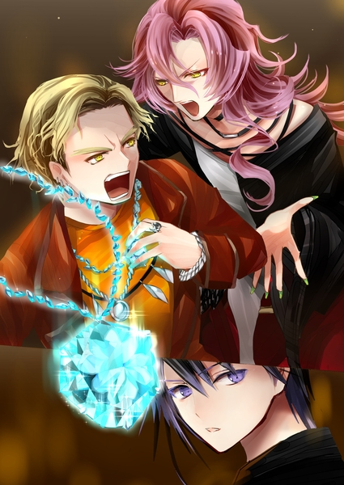
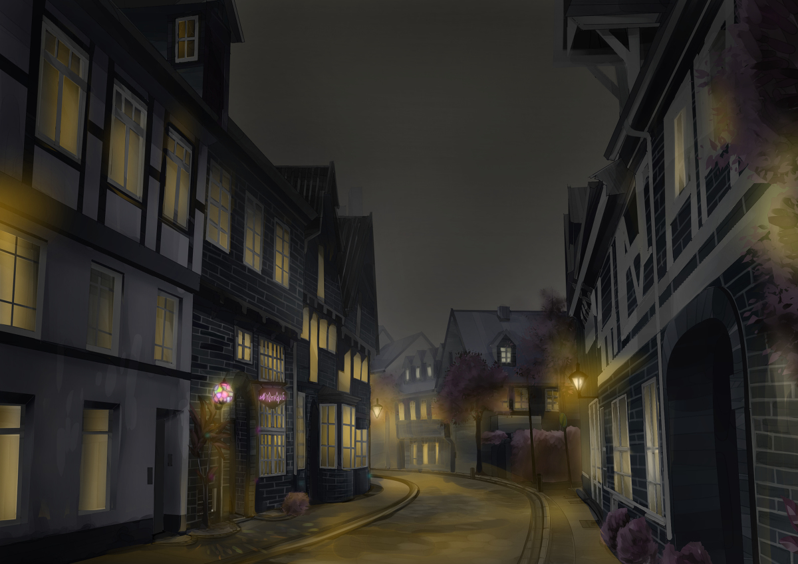
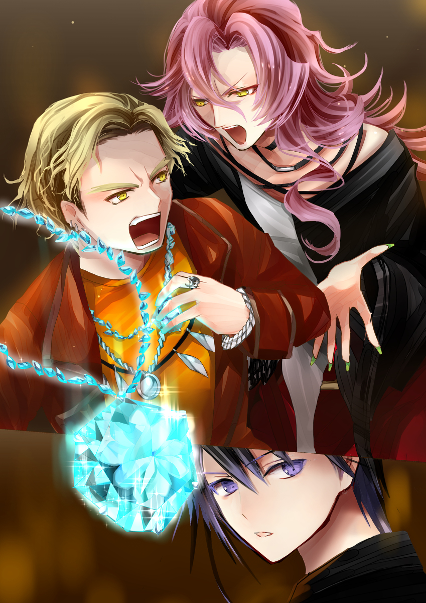
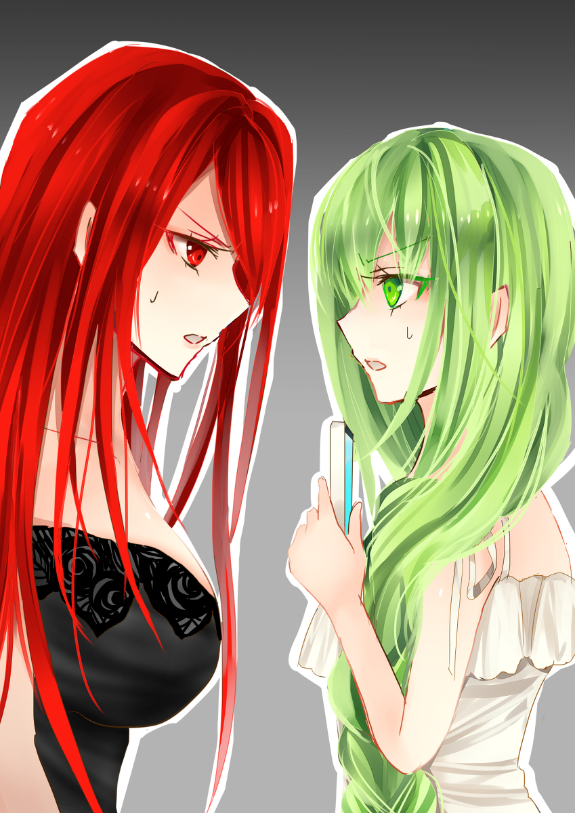

原文来源: [pixiv novel 13949510](https://www.pixiv.net/novel/show.php?id=13949510)
系列: 音楽†SFファンタジー『MYSTIQUE』HARMONIXシリーズ
顺序: 2

Barの入口にはまだclosedの看板が下がったままだった。しかし昨日来た時とは違って、窓から明かりが漏れている。もうじき店が開く頃だろう。

太陽が沈み、暗くなった夜道を暖かな街灯光が照らしていた。Barの玄関口に提灯のように吊るしてあるランタンも灯り、石畳の上に小さな虹色の光が落ちている。ステンドグラスが石畳に投射されているようなその光を見て、エレノアナは楽しそうに目を輝かせた。

「イクスさん！道がキラキラしてます！」

　どうやら機嫌はすっかり直ったらしい。昨日、宿を見つけるまでずっと服の裾を引かれていたイクスは安堵しながらエレノアナに頷いた。

「ビルの光とかライトアップとは違って、これはこれで……なんて言うんだろう。いいな」

「本当にお洒落ね。どこでこういうの売ってるんだろう？」

「こちらの店の物は全てハンドメイド品でして。そう言っていただけると、嬉しいですね」

　イクスたちは後ろから声をかけられて振り向いた。見知った顔にエレノアナが顔を輝かせる。

「あ、マスターさん！」

「ご来店ありがとうございます。今鍵を開けますね」

　エレノアナに軽く一礼をするMYSTIQUEのマスター。イクスたちはマスターに案内されて店内のカウンター席に腰を下ろした。開いたばかりの店には他の客はおらず、しっとりとして落ち着いた雰囲気が流れていた。

「実はフロイライン・ルージュは今、諸事情あって封印中なんです。他の薔薇のカクテルはお作りできるのですが……。なので、昨日のことは他のお客様にはどうかご内密に」

　そう言いながら、マスターが三つのグラスをカウンターの上に置く。マテリアルの今の所有者が来るまで待とうとイクスたちが頼んだカクテルだ。酒には詳しくないから、と作るカクテルはまたマスターに任せてある。

　レイラの前には赤色のカクテルが置かれる。“キッス・イン・ザ・ダーク”、闇の中の口づけを表す情熱のカクテルだ。刺激的な辛さにチェリーリキュールの甘さが潜む。

　イクスの前には菫のカクテル、“ブルームーン”。類い稀なものを意味するその一杯は、神秘的な青紫に染まっている。落ち着いた色合いだが、舌触りは甘い。

　エレノアナにはノンアルコール・カクテルの“シンデレラ”。柑橘のジュースを元に作られた、朗らかなオレンジ色のカクテルだ。甘酸っぱさと溌剌とした色合いがエネルギッシュな姫君を思わせる。

「イクスさん、これ美味しいです！」

　一口飲んだエレノアナが顔を輝かせる。イクスも自分のカクテルを飲んで頷いた。

「菫のカクテルなんてあるんだな……」

「へぇ、カクテルも色々あるのね」

　レイラは上機嫌にグラスを傾けつつ、赤いカクテルを光に透かして楽しんでいた。照明灯の当たり加減で色合いを変えるカクテルはまるで炎が揺らめいているかのようだった。

「ふふ、マスターさんはお酒の趣味もいいんだね。これ、気に入っちゃったかも」

「光栄ですね」

　カウンターの向こうでマスターが洒落た一礼を返す。気取っているように見えかねない動作だが、店内のアンニュイな雰囲気に良く似合っていた。

「昨日のカクテルもすっごい美味しかったけど……封印中だったの？看板カクテルって言ってなかった？」

「ああ、それは……色々とありまして」

「そっか。色々あるなら仕方ないわね」

　言いづらそうにしたマスターを見て、あっさりと質問を取り下げるレイラ。飄々としていながらも確かに感じられる気遣いにマスターは敵わない、とでも言うかのように苦笑した。

「ありがとうございます。――少しこの場を離れます。どうぞ、おくつろぎください」

　イクスたちに見送られて店の裏手にマスターが消えていく。薔薇園の様子を見に行ったのだろう。

店の裏口には『薔薇園』と書かれたプレートがぶら下がっている。Barの客が自由に立ち寄れるようになっているようだった。

「後で私たちも見に行く？夜の薔薇園もまた雰囲気が違いそうね」

「行ってみたいです！」

　エレノアナの目がキラキラと輝く。

「さっき通った夜の石畳の道も綺麗で……カクテルも美味しくって。なんだか違う世界に迷い込んだみたいです……」

　酒精の入っていないはずのカクテルを飲みながら、ほんわかと赤く頬を染めるエレノアナ。夜の帳と共に開くBarでの一幕。夜ごと紡がれる人と酒と出会いの物語――。

「ヤスちゃーーーん！もう店開いてるぅー？」

そんな泡沫の夢のような一時を壊したのは勢い良く開いた入口のドアと、強烈なジャンクフードの臭いだった。

「いやね、これが美味いんだよ。ちょうどここに来るまでの道にあるからいつも買って行くんだけどさ、これより美味いものはちょっと食べたことがないねぇ。あっ、ヤスちゃんの飯が不味いわけじゃないんだよ、これが。ただコイツが美味すぎるってだけで。格が違う、って言うか」

　ファストフード店のハッシュドポテトを片手に乱入してきた男はこの店の常連客の一人らしい。男は見慣れない顔を見つけるや否や、新しいアトラクションでも見つけたかのようにイクスたちの傍に寄ってきた。赤らんだ顔を見るに、もうすでに随分と出来上がっている。

　他店のジャンクフードを食べながらイクスに絡む男をいつの間にか戻ってきていたマスターがやんわりと窘めた。

「お客様、他の店のものは食べ終わってからでお願いしますよ」

「いやー、すまん、すまん！またうっかり！でも、ほら、ね？最近は持ち込みオーケーです、とかあるじゃない？これくらい目を瞑ってよ。ね！オネガイ！」

　手を合わせてウィンクをしようとする中年男性。しかしうまくできずにぎゅっと両目を瞑ってしまっている。

「っていうかね、兄ちゃん！若いのにこんな店に来るなんて珍しいねぇ！いやー、ベッピンさんも連れてて、いやぁー、オジサンびっくり！眼福だね、ガンプク」

　主にレイラの胸辺りを見ながらうんうんと頷く常連客。励ますようにイクスの肩をバシバシと叩いたかと思うと、そのまま気安く肩を抱いてきた男に、はぁ……と気のない返事を返すイクス。顔にかかる息が酒臭い。

「ホント通だねぇ、わかってるねぇ。今時はこういうの全然流行らないだろ？だ、か、ら！逆にいいんだよ」

「そ、そうですか…………？」

「ちょっとカビ臭いくらいがいいって言うか。独特の味だなぁ。あ、チーズ？チーズバーガーみたいなもんだ。おっ、俺今上手いこと言った？美味いだけに、なんちて。ははははははは！」

「はぁ……」

　半ばため息のような相槌がイクスの口から漏れる。一瞬でどこかの大衆居酒屋に迷い込んでしまった気分に陥った。

「いやー、美味い、美味い！ネ、兄ちゃん！俺もうずっとここの店通っててさ、プロみたいなもんだから聞きたいことあったらなんでも聞いてよ。プロだからね、プロ。あ、風呂じゃないよ、って、そんなん間違えるかいな！はははは！」

「あはは…………」

　愛想笑いを返すことしかできないイクスを見て、マスターが動こうとした。しかし、その前に艶やかな男の声がイクスに絡む酔っ払いを窘めた。

「ちょっとアンタ。また人様に迷惑かけてんじゃないでしょうね？」

　深みのあるテナーの声色に対して、たおやかさを感じる口調にイクスは目を瞬かせる。

背の高い、すらりとしたモデルのような体型の男がBarの入口に立っていた。入ってきたばかりの様子で、夜風に乱れた髪を整えながらイクスたちに近づいてくる。

体の中心に沿って走る線で左右二色に区切られた斬新な服を男は見事に着こなしていた。白と黒のはっきりとしたコントラストが目に眩しいが、男には不思議と似合っている。長い足を包む細身のズボンはこれまた鮮烈なスカーレットの色で、いっそう男の存在感を際立たせていた。

「ど、ドランク……」

　イクスに絡んでいた酔っ払いが怯んだように一歩後ろに下がった。どうやらドランクと呼ばれたこの細身の男のことが苦手らしい。ようやく解放されたイクスはすぐさま酔っ払いから距離を置いた。

「私のハンナちゃんの店であんまり“オイタ”してると、お仕置きするわよ」

「ヤスちゃんの店だろ……」

「似たようなもんでしょ。ほら、可哀そうな青年から離れて。とっとと自分の席につきなさいな」

　高圧的な女王のように顎で店の奥を指し示すドランク。イクスに絡んでいた酔っ払いはその動作に乾いた笑いを漏らしながら、降参とばかりに手を上げた。

　その隙にマスターがやんわりと酔っ払いに声をかけながら開いている席にビールを置いた。

「いつものものでよろしかったですか？」

「あっ、ヤスちゃん！俺のいつもの一杯、わかってんじゃん！」

　イクスに絡んでいた男はこれ幸いとばかりにマスターがビールを置いた席にいそいそと向かっていった。

「ごめんなさいね。ああいう馬鹿ばっかりじゃないんだけど。酒が入るとどうにもハメを外しちゃうみたい」

　はぁ、とドランクが物憂げなため息を漏らす。些細な動きから妙な色香のようなものが漏れ出る。何となく目が惹きつけられていたイクスははっと我に返って、慌てて頭を下げた。

「あ、いえ。すみません、助けていただいてありがとうございます」

「いいのよ。可愛い男の子は好きよ。勿論、可愛い女の子もね」

　イクスの背後に居たエレノアナとレイラに軽いウィンクを飛ばして店の奥へと向かっていくドランク。

ドランクは途中ですれ違ったマスターを捕まえ、肩にしなだれかかるようにして嫣然と笑った。

「ねーえ、ヤスちゃん。今日は私と一勝負どう？」

「……おや？ご指名ですか？いえ、ですが今日は遠慮しておきましょう。昨日、手ひどく負けたばかりですので。賭けるものがありません」

「あら珍しい。私の無敗のマスターが負けちゃうなんて。私が負かしたかったのに。ねえ、勝ったらハンナちゃんのこと――」

　ドランクの声が潜められ、それ以上は聞こえなかった。いくつか言葉を交わしてからマスターからドランクが離れる。挨拶代わりか、マスターの頬に熱烈なキスをしてドランクも自分の席に向かっていった。微塵も表情を変えず、穏やかに微笑み続けるマスターにイクスはほのかに尊敬の念を抱いた。

「さっきはありがとうございました。Barのマスターも大変ですね……」

カウンターに戻ってきたマスターに感謝の意を込めて小さく頭を下げ、こっそりと呟くイクス。マスターは肩をすくめつつ、苦笑を浮かべた。

「様々なお客様と出会えるのも店主の醍醐味ですよ」

「でも、ドランクさんの方はともかく、さっきの酔っぱらいの方の言い草はあんまりじゃない？」

　レイラが腕を組んで、ちらりと店の奥に座った先ほどの酔っ払いを見る。口元に笑みは浮かんでいるが、少しばかり不機嫌に見えるのは気のせいではないだろう。

「この店が時代に合っていないのは事実ですから」

　マスターが静かに目を伏せると、穏やかだった表情が憂いを帯びる。

「押し寄せる時代の波には中々勝てませんね。昔なじみのお客様は一人、また一人と来なくなってしまって。別のお客様から、 “もう来ないと言っていた”と言われることもありましてね。最近は連日のように常連のお客様も減っていて……」

「こんな素敵なお店なのに、どうして……。私、こんなお店だったら何度でも来たいです！お店の中も外もかっこよくて、お酒も美味しくて……あっ、私が飲んでるのお酒じゃないですけど……」

「ありがとうございます。そのように言ってもらえるだけで、嬉しいものですね」

　必死で励まそうとするエレノアナに、笑顔を取り戻すマスター。

「まあ、最後までこの店は私が守り抜きますよ。“彼女”が愛してくれた店ですから」

「あの彼女って――」

「……おや」

　イクスが尋ね返そうとしたところで、マスターが店の入口の方に視線を向けた。また新しい客が入ってきたようだ。

「うぃーーっす」

　気だるげなその声を聞いてイクスは目を見開く。うまく思い出せないが、どこかで聞いたことがある声だった。店の入り口で傷んだ茶髪の青年が立っている。どこかで見たことがある顔のように思えた。

　青年は店に入るなり店内をぐるりと見回し、顔見知りらしい相手に手を振った。イクスたちを横切って店の奥のテーブルに向かっていく。青年の進行方向には長い足を組んでグラスを傾けるドランクが居た。目的地はドランクの居るテーブルらしく、そこに辿り着くなり親しげに声をかけた。

「なんだ、もう来てたんスか、ドランクさん」

「今日はちょっと早く来たのよ。ビーちゃんこそ早いわね？」

「いや、今日は早めに上がれたんで。つーか、色々あって仕事にならなかったんスけど。ドランクさんはもうご機嫌斜めッスか」

「あら、わかっちゃう？人が少ないうちにのんびりしたかったんだけど、もう絡み酒でクダを巻いてるヤツが居てねぇ」

どうやら互いにこの店の常連客らしい。

「って、あら？ビーちゃん、それ……」

「おっ、気付いちゃいます？これアレですよ！ついにヤスちゃんに勝ったから戦利品？みたいな？」

「うっそ！？ヤスちゃんが昨日負けたって、ビーちゃんに負けたの！？ちょっと、それ私が狙ってたヤツなの！渡しなさいよ」

「ダメ！これは俺のッス！」

「あっ、そう言えばこの前の掛け金！勝ったの私なのに、ビーちゃんまだ払ってないでしょ。借金よ、借金。借金チャラにしてあげるからそれ渡して」

「ちょっと、ちょっと！あの金額じゃこれと釣り合わないっしょ！あ、金はまた今度で。ほら、給料日前で財布すっからかんなんですよ今日」

「もう、またぁ？まったく、ビーちゃんは……。まあいいわ。ビーちゃんにそれ取られちゃったんだったら、また別の方法考えればいいか」

　常連客同士の会話を眺めていると、青年が自分の胸元から何かがキラキラと輝いている物を取り出して掲げるのが見えた。

「あれは……！？」

　見覚えのある青年の正体を思い出そうとしていたイクスだが、青年の首からぶら下がった物を見つけた瞬間に既視感はどこかへ飛んで行った。

チェーンで繋がれたネックレスの中央に宝石のような物がはめられている。うっすらと神秘的な光が揺らめいている様を見れば、目的の客が現れたのだとわかる。

「レイラさん、エレノアナ。マテリアルだ……！」

　青年がアクセサリーのように首からぶら下げていたマテリアルは台座にはめられたダイヤの形をしていた。無数の花弁を持つダリアの花のように細かなカット面を持つ豪奢なダイヤだ。普通の宝石なら光を取り込んで虹色の乱反射するところを、この宝石はまるで星のように自ら青い光を放って輝いている。

「やっとお出ましね。わかりやすくて何よりだわ」

「綺麗……本当に宝石みたいなマテリアルですね……」

「そうね。でも……“綺麗な花には棘がある”って言うのよねぇ」

　レイラは口元に笑みを乗せたまま、ゆっくりと目を細める。

「“音”が鳴らないマテリアル……確かめてみましょうか？」

　組んでいた足を解いて立ち上がる素振りを見せたレイラにならい、エレノアナとイクスも椅子から降りる。
マテリアルの持ち主と接触しようとしたイクスは顔を上げたところで、自分に向けられた視線に気付いた。

イクスたちが話しかけようとしていた、当の青年がイクスを見ていた。マテリアルの話が聞こえたのかと思えば、そういうわけでもなさそうだ。まるで何かを探っているかのようにイクスを不躾に見つめている。

「……お前、イクス？」

「え？」

　青年が近づいてきてイクスの名を呼んだ。近くで顔を見れば、やはり見覚えのある顔立ちだった。どこで会ったのかとイクスが記憶をたぐっていると、青年は久しぶりに会った親友のように親しげな笑みでイクスの肩を抱いた。

「やっぱり！！お前、“幽霊イクス”だろ！」

　“幽霊イクス”。その呼び名を聞いて、瞬時に苦いものがイクスの胸をせり上がる。大したことではないとわかっているのに逃げ出したくなった。

「俺だよ。ビリー！お前の同級生のビリーだよ。久しぶりだな！」

　悪意のない笑いにイクスは咄嗟になんでもないようなフリをした。はにかもうとして失敗したような引きつり笑いがイクスの口に浮かぶ。

「ああ………久しぶり」

　できれば会いたくなかったよ。そんな本音さえも反射的に隠してしまう。

嫌なら言えばいいじゃないかと誰かが言っていたことを思い出す。それができないから、苦しくて仕方なかったんだ。

見えない何かに押しつぶされている心地がした。ジェノサイド社で淡々と銃の腕を磨いていた時には忘れていた息苦しさだ。

地元のスクールを卒業してから随分と経っているが、当時の憂鬱はしっかりとイクスの胸にこびりついていた。

別に大したことがあったわけじゃあない。当時のイクスはまるで自分に言い聞かせるようにそんな事ばかり考えていた。

今のイクスは昔の自分を振り返っても、やはり大したことがあったようには思えない。ただ、“合わなかった”だけだ。それが距離感なのか、性格なのか、それともそれ以外の何かなのかはわからない。ただ、自分一人だけが歩幅一歩分だけずれてしまったような居心地の悪さが影のように付いてまわった。

“幽霊”なんてあだ名だってそうだ。無口で落ち着きがあることは角度を変えてみれば、存在感がないとも言える。スクールに通っていた頃のイクスの前髪が伸ばしがちで、目元を隠していたことも影響していたのかもしれない。

その他大勢に埋没するには少しだけ“普通”が足りなくて。怯え嫌うには不気味さが足りない。そんな宙ぶらりんな存在に“幽霊”なんて名前を付けた彼らに悪意はなかった。目についた、ちょっとだけ珍しいものに自分たちだけの名前を付けてふざけていただけ。ジャンケンをする時に勝手に作り上げた必殺技だとか、仲間内だけで通じる造語めいたスラングだとか、そんな他愛無い子どもの遊びの一環でしかない。

だけどそんな名前を付けられた方はたまったもんじゃない。“幽霊”と言われる度に、存在感の無さだけがイクスのアイデンティティを塗りつぶしていく。別に今まで気にならなかった伸ばし放題の前髪も、自分の言葉足らずで無口なところも、気付けば重大な欠陥のように思えてきた。それならば明るく振舞おうと努力はしてみたものの、できたことは前髪を切るくらい。

　すると、切りそろえた髪を見た友人たちに、気にしてたのか、と腹を抱えながら笑われて更に居たたまれない心地になった。そういうわけじゃないけど、となんでもないフリで笑い返しながら、心の奥では暗く淀んだ何かがフツフツと煮えたぎっていた。

似合っていたのに、なんて言われると、あるのかないのかもわからない言葉の裏を見つけてしまって自己嫌悪に陥る。幽霊みたいな恰好がお前にお似合いだ、なんて誰も言っていないのに、誰もが自分のことをそんな風に喧伝してまわっているとしか思えなかった。

“幽霊”ではない自分を求めているのに見つからない。“幽霊”の名前から逃げられない。直せない欠陥を抱えた欠陥人間にでもなった気分だった。

こんな大したことのないやり取りで地の底まで落ちていける自分が最低な人間のように思えて。そして親や友人、教師たちもそんな考えを否定してはくれなかった。

「うわっ、マジで久しぶりじゃん。お前、え？何年ぶり？」

　かつての友人であったビリーと再会し、イクスは忘れていたはずの息苦しさを感じていた。

「どうだろう……そう言っても、三、四年ぶりとかかな」

　ただの同級生に会っただけだと言い聞かせながら、いつも通りを心掛ける。久しぶりの自己暗示は昔よりもイクスになじみ、少しだけ呼吸が楽になった。

「お前がBarに来るってマジありえねぇ！えー、お前酒飲むの？幽霊イクスが？うわぁ。ってか、マジ懐かしいんだけど！へえー、お前が、へーーーー！」

「普段はあんまり飲まないんだけど、今日はちょっとね……」

「だよな。お前絶対酒とか無理だろ！もう見りゃわかるもん！」

　心から嬉しがっているかのようにビリーは笑った。

「あ、ってかさ！お前今何してんだよ？」

「あー……それは」

　答えづらい質問にイクスは困った顔になる。視線が自然とビリーの持つマテリアルに落ちた。マテリアルを解放する旅をしている、と言って通じる気がしなかった。基本的にこの同級生はイクスの話を聞かないからだ。

「なぁんだよ、やっぱりお前仕事見つかんなかったのかよ！ジェノサイド社も落ちたんだろ？」

「いや……ジェノサイド社はなんて言うか……」

「俺言ってやったのにさ。お前には無理だ、って！そんな高望みしたら就職も上手く行かないに決まってんじゃん？ったく、イクスはたまにそういう変な冒険するよなー」

　予想していた通り、説明する暇もなくビリーの中で話が進んでいってしまう。こうなると何を言ってもビリーの思い込みは覆せない。

「あっ、俺、今度店長になるんだよ」

　イクスの話はそれで終わり、ビリーが自慢げに近況の話をし始めた。話に熱が籠り、どちらかと言うとこちらが本題のようだった。

「しかも“ジャバ”だぜ、“ジャバ”。お前知ってる？」

「いや………」

「えーーー！？お前、ジャックバーガー知らねぇの！？うっわ、遅れすぎ。Barとか埃臭いとこで浸ってる場合かよ！お前そのままだとヤバイって」

　どうやらこの町で最近流行り始めたバーガーショップについて話しているようだった。ジェノサイド社の周辺にはなかった店だ。

「ごめん。この町は今日来たばっかりでさ」

「お前、ホントそういうとこさぁー！ったく、しゃーねぇな。俺んとこ来いよ。このビリー店長様が可哀そうなイクスくんを雇ってやるよ」

「ああ、うん。いや、ありがとう。でもいいよ。気持ちだけもらっとく」

「遠慮すんな、って！」

「本当に大丈夫だから……今、旅しててさ。実は、マテリアルって言う――」

「いやいやいや！自分探しの旅とかマジで流行らないから！やめとけって！俺らもういい歳だろ？トガってんのカッコイイとか、そういう時代は終わっちゃったのよ。これからはビジネスで金を稼いでいかないと、マジでいい笑いもんになるぜ」

「うーん……と」

　どう説明したものかとイクスは頭を悩ませる。

ビリーが持っている宝石がマテリアルと呼ばれる物であること。マテリアルは人間を素材に作られていること。マテリアルになってしまった人たちを元に戻すためにイクスたちが旅をしていること。そこまで説明してようやく、ビリーにマテリアルを譲って欲しいと言うことができる。

　そこに行き着くまでが途方もない道のりのように感じられた。諦めたいところだが、それではマテリアルにされた人間を助けられない。

それに、マテリアルには暴走する危険性もあった。マテリアルの素材となった人間の心が淀むと周囲の人間に害を及ぼすこともある。マテリアルを持ち続けていればビリー自身も危険にさらされるかもしれなかった。

「いやぁ～、ちょうど良かった！今日すげぇことがあったから聞いてくれよ！俺の居る店、オープン直前だったんだけど急に店長が居なくなってさ。あのクソ店長俺のロッカー勝手に開けてたみたいで――」

「あー……ビリー、あのさ」

「それで、警察にもすっげぇ話聞かれてさ。だけどその代わりに……って、お？あそこに居る二人って……」

「ビリー。それよりさ。ちょっと大事な話をしたいんだけど……」

　思うところはあるが、同郷の友人だ。みすみす危ない目に合わせるわけにもいかなかった。
つらつらと話し続けるビリーを遮って、なんとか会話の突破口を開こうとするイクスだが、ビリーはすでにイクスに対する興味を失っていた。その視線はレイラとエレノアナに向けられている。

「それ、あの美女と美少女より大事な話じゃないだろ、絶対。え、あれお前の知り合い？」

「知り合いって言うか仲間かな。いや、じゃなくて。ちょっと、三分でいいから聞いてくれないか？」

「うわ、仲間ってお前。ダセェ言い方すんなよ！」

「ビリー。わかった、一分でいいから」

「うっひょ、マジでいい女！ハンナちゃんも良かったけど、こりゃたまんねぇわ」

「ビリー……」

「ちょっと紹介してくれよ、イクスくん。いや、やっぱいいわ。んんっ、ごほんごぼん。俺、ちょっと一発決めてくる」

　イクスの話など完全に耳に入っていない様子で咳払いをするビリー。傷んだ髪を手櫛で整えてから、やけに颯爽とレイラとエレノアナの前まで歩いていった。

「お姉さんたち～！イクスくんの知り合いなんだって？俺ビリーって言うんだ。イクスの、まあ、親友みたいなものかな！俺にもよろしくしてくれよ！」

「ビリー、お前な………」

　――親友って、初耳なんだけど。

イクスは頭痛のようなものを感じて、額を押さえた。

「ちょっと、イクスくん……」

「あ、え？お姉さん？」

　ビリーを素通りしてレイラがイクスの元まで来た。イクスの耳にそのままレイラの口が近づいた。

「知り合いって言ってるけど、本当？」

　小さく耳打ちする、艶のある声にイクスは心臓が跳ねるのを感じた。

「まあ……同級生ですね」

「ふぅん」

　平静を取り繕って返事を返すと、レイラは面白くなさそうに相槌を打った。

「すみません、たぶん、あいつにも悪気はないんですよ……」

「だからって言って、なんでも言っていいことにはならないでしょ」

　ぴしゃりと冷たく言い放つレイラに驚くイクス。レイラが怒っていた。

　自分のために怒ってくれているのだと察し、イクスは困った顔になる。波風を立てるほどのことではない。だが、味方ができた様な嬉しい気持ちが込み上げた。

「レイラさん……。だけど、マテリアルが」

レイラに目で訴えるイクス。今はイクスのことより、ビリーからマテリアルを譲り受ける方が先決だ。
「……後で、イクスくんはお説教だからね」

「え、ええ？」

　渋々と納得してくれたレイラだったが、ぽつりと一言だけ不穏な言葉をこぼした。動揺するイクスを置いて、ようやく立ち尽くしているビリーに向き直る。

「私はレイラよ。こっちはエレノアナ」

「はじめまして、エレノアナです」

　ぺこりと頭を下げるエレノアナ。いつもと変わらないように見えるが、イクスの勘違いでなければ少しだけ元気がない。

「私たちは元々ジェノサイド社でイクスくんと知り合ったの」

「え？ジェノサイド社ってあの大企業の……」

　イクスがジェノサイド社に居たことを示唆するようなレイラの発言に目を見開くビリー。イクスとレイラを見比べながら、理解が追い付いていないような顔をした。

「そこで、私たちはマテリアルという物を知ったんです。今、ビリーさんが首から下げている物です」

　そんなビリーの前でエレノアナが訴えた。

「マテリアルは元々人間なんです。それを知った私たちはマテリアルを元の人間に戻す旅をしています」

「“マテリアル”……へー、なんか光ってるとは思ったけど、そんな大層な名前がついてたのかコレ」

　ビリーが胸元にぶら下がるマテリアルを摘まみ上げる。どうやら自分の持つ宝石がマテリアルだとは知らなかったらしい。

「マテリアルは不思議な“音”を奏でる結晶……宝石なんだ」

　イクスが説明を引き継ぐと、うさんくさそうにビリーが顔をしかめる。

「音ぉ？なんだそれ。元々人間とか、わけわかんねぇし。ただの珍しい光る石だと思うぜ」

「ちょっと触ってもいい？」

「あっ、ちょっと、お姉さん！？」

　ビリーの許可を待たずにマテリアルに触れるレイラ。マテリアルを手のひらに乗せたかと思うと、思案するように目を細める。

「本当に何の“音”もしない……どう、イクスくん？」

　レイラに促されてイクスもマテリアルを手に取る。ビリーが不満げな声を上げたのは気付かないフリをした。

通常、マテリアルは触れた瞬間に“音”を奏で始める。情景や感情を聞く者の心に流し込み、胸を揺さぶる複雑で摩訶不思議な“音”だ。だがどれほど待とうとも、ダイヤのマテリアルはイクスの手の中で沈黙したままだった。見た目は完璧なマテリアルだと言うのに、“音”だけが足りない。

「レイラさん、そういえば、空虚な心の持ち主から作られたマテリアルは“音”を奏でないんでしたよね？」

　イクスが尋ねると、レイラは返答に詰まったかのような微妙な表情になった。

「そう……だけど。そういうマテリアルは見た目もがらんどうになるのよ。くすんだガラス玉みたいになる、って言えばいいのかしら。光もすごく薄くなるし……。こんな、宝石みたいに綺麗なマテリアルにはならないわ」

「なら、これはマテリアルじゃなかったり……いや、まさか、そんなはずはないか……」

「エレノアナちゃんはどう思う？」

　レイラに促されて、エレノアナもビリーのマテリアルに手を伸ばした。マテリアルを持つイクスの手にかぶさるようにエレノアナの手がマテリアルに触れる。しばらく何かに聞き入るように目を瞑っていたが、エレノアナにも何も聞こえなかったらしい。エレノアナは静かに首を横に振った。

「何も聞こえませんね……なんとなく、マテリアルではあると思うんですけど……」

「エレノアナが言うなら、そうなんじゃないか？」

「た、たぶんですけどね。何か確かめる方法があればいいんですけど……」

「確かめる方法……あ、そうだ」

　イクスはふと思い立って、自分の懐から鍵状の細工品のような物を取り出した。青く澄んだ水晶でできたかのようなそれは、神秘的な光を自ら放っている。

「うわっ、なんだよそれ。それも、“マテリアル”ってヤツか？」

　イクスの取り出した物と自分のマテリアルを見比べるビリー。二つの結晶体が放つ光は非常に良く似通っていた。

「いや、これは“キュア”だ。マテリアルを人間に戻すための道具だよ。キュアを使って、人間に戻ればマテリアルだと断定できるんだが……」

「ヤダよ。本当に“マテリアル”だったら俺の宝石ちゃんが人間になっちゃうじゃん」

　取りつく島もなさそうなビリーにイクスは深いため息を吐く。どうやって説得したものかとイクスが頭を悩ませていると、エレノアナがあの、と口を開いた。

「お願いします……！もしそれがマテリアルなら、ちゃんと人間に戻してあげたいんです。ずっとマテリアルのままは辛いから……」

「んー、そうだなぁ」

　ビリーは悩むように顎に手を当てた。んーーー、と声を出しながら、大げさな身振りで右を見たり、左を見たりしてわざとらしく悩む。

「エレノアナちゃんがそこまで言うなら俺も考えちゃうなぁ」

「本当ですか！じゃあ！」

「でも、一つだけ条件がある」

「条件？」

　ぐっ、と顔をエレノアナに近づけるビリー。その動作にイクスは嫌な予感を覚えた。ビリーの手が無遠慮にエレノアナの髪に触れようとしているのを見た瞬間、イクスは動いていた。

「エレノアナちゃんが俺にキスしてくれたら――痛たたたた！？」

「ビリー、やめろ」

　後ろからビリーの腕を掴み、無理矢理エレノアナから引き離す。急に引っ張られたビリーが抜け出そうと暴れるが、イクスの手はびくともしなかった。

「お前何すんだよ！？痛いだろ！？」

「それ以上エレノアナに変な絡み方をするならこっちにも考えがある」

「か、考えってなんだよ……」

「………………」

「う……」

　イクスは答えずにじっとビリーを見下ろした。無言の圧力にビリーがたじろぐ。

「じょ、冗談だよ！ジョーク、ジョーク！！そんなに怒るなって、な？」

「………………」

　疑うような視線をビリーに向けるイクス。念を押すようにもう一度睨みつけてからビリーを解放する。ビリーは放されるや否や、数歩後ろに下がって掴まれていた腕を痛そうにさすった。

「ちょっとふざけただけだろ……なんだよ、幽霊イクスのくせに……」

「なんとでも言え。次はないからな」

「ちっ、わぁーってるよ！けっ、あー、もう、つまんねぇーの！！俺飲みなおすわ！！もうどっか行けよ！！」

　いら立ったようにそっぽを向くビリー。足音を立てながらイクスたちから離れようとする青年を慌てて引き留めたのはエレノアナだった。

「あ、待ってください！マテリアルのことがまだ……」

「エレノアナちゃぁん！！」

　エレノアナに声をかけられただけでビリーは相好を崩し、機嫌を直す。イクスたちに向けていた背中をくるりと翻して、にやけた面でまたエレノアナに近づいた。

「いやーー、俺もあげたいのはやまやまだけどさ。タダってわけにはいかないし」

「そんな……」

「とりあえずさ、明日また俺に会いに来てよ。あ、それともこれから一緒に俺の家で飲みなおす？」

「ビリー」

「うっ……な、なんだよ！口説くだけならタダだろ！あー、イクスが怖くてごめんなー、エレノアナちゃん！これ、俺の端末ID。今日の夜、こっそりチャットしようぜ」

「え……？」

「じゃね～！」

　エレノアナにメモを一枚渡して去っていくビリー。メモを見てみると、数桁のIDが書き込まれている。ジェノサイド社製の情報端末にプリインストールされているチャット機能で使われるIDだ。このIDで検索すればビリーとのチャットルームに入ることができる。

「もらっちゃいました…………」

「捨てればいいんじゃない？」

　どうしようと戸惑うエレノアナをレイラがばっさりと切り捨てた。

「ええ！？でも……」

「捨てればいいと思う」

「イクスさんまで！？」

　ビリーは常連客の輪の中に戻ってしまい、これ以上の話をするのは難しそうだった。薔薇園を覗く気分でもなくなってしまって、三人はそのままMYSTIQUEを後にした。

　イクスたちは昨晩止まったホテルに戻ってきていた。部屋にあがるや否や、にっこりと笑うレイラがイクスの腕を掴む。

「で？イクスくん？」

「な、なんですか？」

　何故か怒気を感じるレイラの笑顔の意味に心当たりがなくて、逃げ腰になるイクス。何か怒らせるようなことをしてしまっただろうかと考えていると、Barでの一幕を思い出す。そういえばレイラに叱られる予定があったような。

「なんでイクスくんはあんなヤツに言われっぱなしなのかなぁー？」

　ビリーのことを話しているのだと察して、イクスは途端に困った顔になった。はっきりとした答えはイクスの中にもない。

「それは……いや、そんなに気にしてないんで……」

「んなわけないでしょ」

　イクスが自分に吐いた言い訳ごとレイラはばっさり切り捨てた。

「アイツ、あからさまにイクスくんのこと馬鹿にしてたじゃない。どーして私のイクスくんはちゃんと言い返してくれないのかなーー？」

「うーん……まあ、ビリーとは色々ありましたけど、昔のことですし」

「私が怒ってるのはさっきのこと！！」

　眉をつり上げて怒った顔を作るレイラにイクスはますます困り果てる。イクスはビリーが思っているような人間ではないことを言えばいいだけの話ではあるのだ。お前は勘違いしていると一言、言うだけ言ってみればいいだけなのだが、なんとなく何事もなかったかのように流してしまう。それは長年染みついた癖のようなものだった。

　だが怒っているレイラを見ると、何故だろうか。

「私は……私のイクスくんが馬鹿にされるのがイヤなの！」

　駄々をこねるようにムッとしているレイラを見ていると、わずかに嬉しさのようなものがイクスの中に込み上げてきた。答えに困っているのに、悪い気持ちはしない。その不思議な感覚にイクスはむず痒さを覚えた。

「……イクスくん、なんでちょっとにやけてるのよ」

　レイラが呆れたようなジト目でイクスを見た。慌ててイクスは首を横に振る。

「に、にやけてませんよ！」

「いーや！にやけてる！！」

「にやけてるわけじゃ……でも、そうですね。なんか……」

　自分の頬が緩んでいないか確かめるイクス。触った感触では良くわからない。どちらかというと、頬の筋肉が固いような気がする。

「なんだか、代わりに怒ってくれる人が居るっていいな、とちょっと思ったり、しないことも……」

「イクスくん……」

「う……すいません……」

　呆れたようなレイラの様子に場違いな感想を抱いてしまったような、居たたまれなさを感じる。だが、それでも嬉しいと思う気持ちは消えなかった。

「まったくもう」

　そんなイクスの心中を察したようなレイラがため息を吐く。

「しょうがないなぁ。本当に気にしてないなら、まあいいけど。ああいうのは放っておくといくらでも調子に乗るから、言わなきゃいけない時はビシッと言うように！」

「はい、レイラさん」

「返事だけはいいんだから。ねー、エレノアナちゃん？」

「…………イクスさん」

「え、エレノアナ？」

　はっきりとは言えないが、いつものエレノアナと様子が違う気がして戸惑うイクス。エレノアナに笑顔はないが、特に大きな感情が浮かんでいるようにも見えない。あえて言うのならば、どことなく拗ねているような気配はあった。

「エレノアナ……なんか……怒ってないか？」

「怒ってません」

「いや、でもなんか」

「怒ってないです」

　淡々と返す様子が逆に怖い。恐々と様子を窺うイクスをじっ、と穴が開きそうなほど見つめているエレノアナ。

「怒ってはないですけど……もやもやしてます」

　やっぱり怒ってるんじゃないか。

　賢明にもイクスはその言葉を飲み込んだ。

「ご、ごめん。本当に。二人がそこまで気にするって思わなかったから……」

「だって、イクスさんが苦しそうな顔をしていました」

「え……」

　ドキリと鼓動が激しく蠢いた気がした。思わず目を見開いてエレノアナを見つめ返すイクス。
「そんな顔をするまで、我慢してほしくないです。イクスさんは私の“大切”ですから」

「え、ええっ！？」

　エレノアナの言葉にもう一度心臓が跳ね上がる。イクスは自分の顔がみるみる赤くなるのを感じた。
　イクスの反応にキョトンとしていたエレノアナだが、やがてイクスの赤面が移ったように頬を赤く染めた。

「た、大切って勿論、仲間としてですよ……！！」

「あっ、う、うん。わかってる！」

　慌てて付け足したエレノアナにイクスも焦って頷く。少しだけエレノアナの言葉を残念に思う自分に気付いて、尚更焦る。

エレノアナは仲間だ。それ以上の何かはない。

「んーーーー、甘酸っぱい青春ねぇ」

「「れ、レイラさん！！」」

　変な雰囲気になってしまったのを慌てて打ち消そうと躍起になるエレノアナとイクスをレイラが邪魔しにかかる。からかわれてはたまらないと二人が非難の声を上げれば、レイラはからりと楽しそうに笑った。

「あはははは、じょーだん、じょーだん！でもイクスくん。私もエレノアナちゃんと同じ意見よ。イクスくんの苦しそうな顔は見たくないわ」

「レイラさん……ありがとうございます」

「イクスくんは私の“大切”だから……ね？」

　イクスは引いたはずの熱が性懲りもなくぶり返す気配を感じた。

「……レイラさん、からかってますね？」

「あはははは！拗ねるな青年！！」

　じっとりと睨まれて、レイラは楽しそうにイクスの背中を叩く。完全にからかわれている。

　この人にはやっぱりどうしても勝てそうにないとイクスは苦笑しつつ、ため息を吐いた。

「拗ねてないですよ……」

「ふふふ、勿論、イクスくんとエレノアナちゃんはどっちも同じくらい大切よ。ねーーー、エレノアナちゃん！」

「は、はい！私もレイラさんが大切です！」

「ふふふ、両思いだね、私たち！」

　イクスへの説教と言っていたのはどこへやら。二人ではしゃぐレイラとエレノアナを見ていると、イクスも穏やかな気持ちになる。

　二人と話しているうちに、ビリーと会ってから抱えていたもやもやとした気持ちはどこかへ飛んで行ってしまった。驚くほど心がスッキリしている。何故あれほどまでに息苦しかったのかも思い出せないくらい、胸に幸せがあふれていた。

　だから今度は素直にその言葉が口からこぼれ出る。エレノアナやレイラに気付かれないほどに小さな声で、本心を吐き出す。

「…………苦しそう、か。…………そうか、たぶん苦しかったんだろうな……」

　イクスは自分が地元のスクールに通っていた時代に思いを馳せる。あの時は誰もイクスが苦しんでいることを認めてすらくれなかった。イクスの葛藤は他人にとってなんでもない日常の一部でしかなかった。

　だからずっと諦めていたのはイクス自身だ。自分が苦しいと主張することも、自分自身が傷付いていると認めてやることも全て諦めていた。結果、ただ漠然としたもやのような重苦しさだけが胸に詰まっていった。

　傷跡にすらもならなかった、見えない心のしこり。それを今更だけど傷だったとイクス自身が認めてやれたなら。……今更だけど、誰かの前で弱さをさらけ出すことを許されるのなら。レイラとエレノアナがイクスの代わりに、痛かったんだと憤ってくれるのなら。

　何かがやっと変わる気がした。その何かをイクスはきっと長らく渇望していた。

　
　お前、幽霊みたいだな。

　伸びた前髪を指さしながら言われた言葉にイクスはまず驚いた。そんな言葉を面と向かって誰かに言うような人間が実在するとは思っていなかったからだ。

　だが、自分が“そんな言葉”を投げかけられるに値する人間なのだと気付いた途端、じわじわと鈍い痛みが胸に広がる。

　痛みをごまかすようにイクスは慌てて自分に言い聞かせた。まさか、悪意があって言ったことではないだろう。ゲラゲラと楽しそうに笑う同級生たちの顔を見れば、彼らの発言に大した意図はないことはくみ取れた。

　だが、自分にそう言い聞かせてみてもイクスはうまく笑うことができなかった。返事に困り、黙り込んでしまったイクスに対して、同級生たちは更に幽霊だとはやし立てた。

　――幽霊って喋らないんじゃね？

　誰か言った一言にそうだそうだと騒ぎ立てる同級生たち。その中心にいたのがビリーだった。イクスを取り囲んで騒ぎ立てていた彼らの顔も名前もおぼろげだが、その時のビリーの言葉だけは何故かしっかりとイクスの胸に残っていた。

　『お前もう一生黙っとけよ。そっちの方が絶対いいぜ』

　その一言でイクスはクラスでの発言権を全て取り上げられた気持ちになった。後で冷静になって考えてみれば、きっと、なんでもないようなことだった。ただクラメイト同士でふざけあっていただけに過ぎない。ビリーが“幽霊”というキャラクター性を確立させる方法について語っていたのだろうと理解はできた。

　理解できてもなお、息苦しさはちっとも晴れなかったのだが。

　それからビリーたちはよくイクスに絡んでくるようになった。その度に見えない何かが胸に降り積もっているかのように息苦しくなり、段々とクラスには居づらくなった。

　行きたくないことに対して、明確な理由があったわけではない。ただ、行きたくなかった。スクールに向かう足取りは重く、朝から家に帰ることしか考えておらず、重い足がスクールではない方向に向かうようになるまでそう時間はかからなかった。

　どちらかと言えば真面目な方だったイクスについたサボリ癖を教師や両親も初めは心配していた。しきりに何があったのかと問いかけてくる大人たちだったが、正直なところ煩わしいだけだった。

　何があったのかだなんてイクスにもわからない。ただ、行きたくなかったのだ。

ただ“行きたくない”としか言えないイクスにいつしか大人たちは呆れかえった。やがて好きにしろとばかりにイクスに関わらなくなったが、彼らの視線はいつも物言いたげだった。

落胆されている。

大人たちが隠そうとしているその感情に気付けないほど、イクスも鈍くはなれなかった。

別に何かを言われたわけではないし、何か悲劇的な事件があったわけでもない。ただ、見えない何かに押しつぶされるかのように、理由のない息苦しさだけが増していく。

　そんな時に辿り着いたのが射撃場だった。

　初めは時間を潰す場所を探していただけだった。スクールに行くような素振りで家を出てからスクールの終わる時間まで居座れる場所を探しているうちに、町外れの方へとイクスの足は向かっていった。

舗装された道路が途切れ、半ば森になりつつある場所にその施設は立っていた。随分と古く、鉄でできた外壁は錆び付いている。稀に中から発砲音や打倒された的の音が甲高く鳴り響く建物は当時のイクスにはちょうど良く不気味だった。

　人が居ない場所ならどこでもいい。一見、廃施設のようにも見える建物の錆び切ったドアを開けてイクスは中へと足を踏み入れた。

　そこでイクスは人生で初めて射撃に出会う。

　そしてそのままのめり込むように射撃場に通いつめるようになった。

　言ってみれば逃避の一種だった。

　誰にも会うことなく、現実を忘れられるものならきっとなんでも良かったのだ。それがたまたま、イクスにとっては射撃だっただけのこと。

あの時抱えていた葛藤はまだ心のどこかにこびりついている。しかし、その代償のように得た射撃の腕をなしに、今のイクスはあり得ない。あの日々がなければジェノサイド社に追われるエレノアナを守ることもできなかったし、レイラがイクスに声をかけてくることすらなかっただろう。

そう言えば、レイラがはじめてイクスの射撃に興味を持って話しかけてきた時は大いに戸惑ったものだった。それからやたらと構われるようになって、時々煩わしいほどだった。でも、嫌だったかと言うと、そうではないと胸を張って言える。無茶苦茶だったが、レイラに構われるのは嫌いではなかった。

「――イクスくん？」

「え？」

「ぼーっとして、どうしたの？」

「あ……いや」

　レイラに声をかけられて、意識が現実に戻る。昔のことを思い出しているうちに回想にふけってしまっていたらしい。

素直に昔のことを考えていたと言うべきだろうかとイクスは悩み、結局やめた。まだ、今は言いづらい。

「……レイラさんと会った時のことをちょっと思い出して。今、自分の射撃が唯一の取り柄だ、って胸を張れるのはレイラさんのおかげかもしれないなって思ったんです」

「ありゃ。私はそれ以外にもイクスくんのいいところ、たくさんあると思うけど？ま、最初に惚れ込んだのは勿論、射撃の腕だったけどね」

「レイラさんと話すようになったきっかけはそうでしたね」

　レイラがやたらとイクスの射撃の腕を気に入り、持ち前の強引さでイクスを射撃訓練やら新開発の銃の性能試験やらに引っ張りまわしたのだ。その時にレイラが直々に開発した銃は今もイクスに愛用されている。下手をしたら命を落としかけないレイラの無茶苦茶な身体能力検査に当時は辟易とさせられたものだが、射撃の腕を認められるのは悪い気はしなかった。

　自信と言う言葉にはやや縁遠いイクスだが、射撃だけは誰に対しても誇れるようになったのはレイラに毎日のように褒め称えられたからだった。

「少しだけ今の自分が好きになれたのはレイラさんがきっかけでした。それに………」

　イクスはエレノアナを見て、口元を緩ませる。エレノアナがイクスの話を聞いて、まるで自分が傷付いたかのように瞳を潤ませていた。しかし、唇をぎゅっと噛み締めているのは泣くまいと意地を張っているかららしい。

　優しくて強い少女の心にイクスは何度救われただろうか。

「不思議と、今は他人に何を言われてもあんまり気にならないんですよ。もっと怖いことを知ってますから」
　イクスに見つめられていることに気付き、エレノアナが首を傾ける。

「怖いこと、ですか？」

「それは………」

　君を失う方が怖い。

　口から出そうになった言葉がイクスの喉元で引っ掛かる。良くわからないが、すごく恥ずかしいことを自分が言おうとしていた気がして、耳が熱くなるのを感じた。

「色々、かな」

「………イクスくーん？今、何考えたのかなー？」

「な、なんでもありませんよ！」

「ふーん？」

　平静を取り繕うイクスだが、ニヤニヤと笑うレイラには何かを察されている気がした。

「とにかく！！今はレイラさんとエレノアナが居るから、俺は怖いものなしってことです。レイラさんとエレノアナのためなら、どんなヤツにも負ける気がしませんよ」

「「………………」」

　エレノアナとレイラがピタリと動きを止めた。笑顔のまま石のように固まるレイラと、潤んでいた涙を引っ込ませてぽかんと口を開けるエレノアナ。思ってもみなかった反応に慌ててイクスは二人を見比べる。

「え、……え！？俺、なんか変なこと言いました？」

　ようやく硬直が解けたレイラは暑いとでも言うように顔を手で煽った。エレノアナもへにょりと脱力してレイラの肩にしなだれかかる。

「あー、びっくりした！……これもイクスくんの取り柄の一つかしら？」

「かもですけど……心臓に悪いからやめてほしいです……ちょっとだけ……」

「やっぱりイクスくんはひどい男よねー、エレノアナちゃん」

「はい、レイラさん！！」

「ええ………」

　二人の妙な反応の理由がわからずにイクスは困ったように頬をかいた。

　ビリーの件をエレノアナとレイラがそれ以上追求することはなかった。イクスが気にしていないなら、構わないという結論に落ち着いたらしい。

「それにしても………今回のマテリアルは妙ね」

　話は自然とビリーの持っているマテリアルに移った。

「ビリーさんの持っていたマテリアル、“音”が鳴りませんでした……」

「元の持ち主だったマスターも“音”は鳴らないって言ってたよなぁ」

「薔薇園と射撃場で手に入れた欠片も“音”は鳴りませんでしたね……」

　エレノアナが小箱を取り出して、中身を確認する。マテリアルと言うにはあまりにも小さい欠片が二つ箱の中で鎮座していた。薔薇園で拾ったものをなくさないよう、射撃場で貰った小箱に入れたのだ。

「うーん……顧客情報の中に買われたマテリアルの写真とかあれば早かったんだけど」

レイラが悩ましげに呟きながら、自分の情報端末をいじる。

レイラの指が端末の画面を操作すると、空中に青みがかった映像が映し出された。穏やかな表情で微笑むMYSTIQUEのマスターの写真が映っている。レイラの情報端末にはジェノサイド社から盗み出したマテリアルの顧客情報が入っており、イクスたちはこの情報を元にマテリアルの持ち主を見つけ出していた。

「あのマスターがジェノサイド社からマテリアルを手に入れたのだけは間違いないと思うわ。じゃなきゃ、ジェノサイド社の機密情報に彼の名前が載っているはずないし」

「なら、やっぱりビリーが今持っている宝石がマスターの買ったマテリアルということですか」

「断定はできないけど、可能性は高いと思う。ああいうふうに光を放つ鉱物が自然界にあるって聞いたことないし。“音”が鳴らない以外は、本当にマテリアルなのよねぇ」

　ふと、エレノアナが閃いたように指を立てた。

「ロードさんやティアちゃんのマテリアルには不思議な力がありましたよね。マスターさんのマテリアルも何か特別な力を持っているって考えられませんか？その関係で“音”が鳴らないとか……」

　ロードとティアはかつてイクスたちが関わったマテリアル所持者だ。どちらのマテリアルも人知を超えた力を持っていた。

　確かに、今回のマテリアルも同じように特別な力を持っていることは考えられる。納得しつつもイクスは顎に手を当てて考え込んだ。

「それはありえるかもしれないけど……どんな力があったら“音”が鳴らなくなるんだ？」

「う、うーーん……。お、“音”が聞こえなくなる力……？」

「あはは、そのまんまじゃない！」

　レイラがくすくすと笑いながら、投射していた映像を消す。これ以上考えてもしょうがないと思ったのだろう。考えるのをやめて、お開きとばかりに情報端末をテーブルに転がした。

「まあ、今はなんとも言えないわね。……もしかしたら、“音”が鳴る条件とかがあるのかもしれないけど」

「“音”が鳴る条件ですか」

「特定の人間が触った時とか、マテリアルがどこどこにある時とか……わかんないけど」

　ひょいと肩をすくめたレイラがソファに倒れ込む。レイラが少し疲れたように欠伸するのを見て、イクスは時計を見上げた。

　気付けば深夜に近い。パタパタと寝る準備を始めるイクスたち。

　そんな中、パジャマに着替えたエレノアナがふとテーブルの隅にある紙切れを見つけて動きを止めた。ビリーからもらった端末IDだ。結局エレノアナは捨てずに宿までビリーのメモを持って帰っていた。

「どうしよう………とりあえず、登録だけしようかな……」

　自分の情報端末でビリーの端末IDを検索するエレノアナ。それを見つけたイクスがやんわりとエレノアナを止めようとした。

「エレノアナ……ビリーのことは無視してもいいんだぞ」

「でも……もらってしまいましたし。もう遅いですし、連絡はしませんけど」

「待って、エレノアナちゃん！チャットルーム登録すると、登録された相手にも通知が――」

　レイラの忠告は一歩遅かった。え？とエレノアナが顔を上げたが、『チャット：ビリーを登録しますか？』と表示された画面の上に乗せられた少女の指を止めることはできなかった。エレノアナの指がポン、と軽い動作で『はい』の文字をタップする。

　ピロリン、と登録済みを知らせる通知音が悲しげに鳴った。

「……通知、飛んじゃうんですか？」

「飛んじゃうわね」

　神妙な顔を問いかけるエレノアナに向かって、レイラも神妙な顔で頷く。

「…………ビリーさんのこと、起こしちゃいます？」

「起こしちゃうっていうか、もしかしたら起きてるんじゃないかしら。それでエレノアナちゃんがチャットルームに登録したって知ったら……」

　ピロリン。ピロリン。ピロリン。ピロリリリリリンリンリン。

　ビリーから何通ものメッセージが飛んできた。『こんばんは』『！』『（無数のハートマーク）』『（キスする男のスタンプ）』『ラビュー！』『エレノアナちゃんマジ天使』等々。怒涛のように押し寄せるメッセージにエレノアナはふるふると震えながら固まってしまった。

　そんなエレノアナの端末を持つ手の上にレイラの手が優しく重なった。

「……エレノアナちゃん、その端末叩き壊していい？」

「ご、ごめんなさい……」

「あ、エレノアナちゃんは悪くないわよ！ただちょっと」

　端末の向こうでビリーがにやけ面をしていると思うとムカつく。
　そう言って、にっこりと笑うレイラの目はあまり笑っていなかった。

　エレノアナは少し泣きそうになりながらもビリーに返信していた。何度かやり取りを終わらせようとしているのだが、その度にビリーが駄々をこねている様子だった。

「そ、ろ、そ、ろ、寝、ま、す……うぅ、眠いです……」

「通知切って、適当に寝ちゃえばいいのよ、エレノアナちゃん」

「でも…………」

「でもじゃない！あんまり夜更かしするとイクスパパが怒るわよ～？」

「え！？俺！？」

「ほらほら、うちの不良エレノアナちゃんに言ってやってよ、パパ！」

　もう数秒で日付が変わる。確かに、エレノアナにこれ以上夜更かしさせるのも良くはないだろう。

「うーん……わかった。俺からチャットを止めるようにビリーに言ってみるよ」

「えっ、イクスさん？」

「ちょっと、端末貸してもらっていいか？」

「あ、はい……」

　エレノアナから端末を受け取り、画面を見るイクス。ちょうどまたビリーからメッセージが飛んできて、うんざりとため息を吐く。だが、メッセージの内容を見た瞬間、イクスは目を瞬かせる。

『あれ、すごい音が鳴ってる』

「………音？もしかして、マテリアルか？」

　チャットルームの隅にある通話ボタンを押して、ビリーに電話を繋げる。短いコール音の後、ビリーの大声がイクスの耳を貫いた。

『エレノアナちゃーーーーーん！！！電話してくれるなんでマジで、マジ！！わーーー、なんなら今から俺の家来る？来ちゃう？ワンナイトしちゃう？？』

「ビリー、俺だ」

　イクスが声を出した瞬間、端末の向こうで沈黙が落ちた。

『イクス、テメェ！！俺の夢を返せ！！なんだよ！！！俺、てっきりエレノアナちゃんが……え？まさか、今までのチャットもお前が……』

「ちょっと静かにしてくれないか。確かにうっすら何か“音”が……？」

　ビリーがわめき立てる声の向こうで、微かに何かの音色が流れている気配があった。だが、電話越しでは良く聞き取れない。

『なんだよその言い方。イクスのくせに……。チッ、音はあれだよ。ヤスちゃんの宝石から鳴ってるんだよ。あー、そういや音が鳴るとかお前言ってたっけ？さっき急に鳴り出して――』

　不意にビリーが言葉を詰まらせた。

『ん……なんだ、あれ。なんか、動いてるような……？』

「ビリー？」

　急にビリーが戸惑ったような声を上げた。イクスが問いかけるが上の空の様子で一向に返事を返さない。

『……なんか変だからちょっと見てくるわ』

「何が変なんだ？」

　ビリーが端末をテーブルか何かに置いたような音がした。足音が遠ざかっていき、しばらく沈黙が落ちる。
静まり返った部屋で、何かの“音”が少し離れたところから流れているのが聞こえた。その“音”になんとなくイクスは不気味なものを感じ、ビリーを呼び戻そうとした。

「……ビリー？」

　恐る恐るイクスがビリーの名を呼ぶ。返事はない。

代わりに“音”が近づいてきた気がした。より明瞭に聞こえたその“音”にイクスはぞっとした。

悪意が笑っているかのような“音”だ。

甘やかで美しい“音”だった。だが聞いている者の背筋を凍らせるほどにそら恐ろしいものを孕んでいた。嫣然と微笑む悪魔を思わせるその旋律にイクスは身震いをする。

　まさか、あのマテリアルが？

　茫然とイクスが立ち尽くしていると、ピッ、と短い電子音の後に“音”が途切れた。通話が切れたらしい。端末の画面を見ると、通話終了の表示が出ている。

　それからもう一度電話をかけたが、ビリーが出ることはなかった。送信したメッセージには既読済のマークがすぐに付くが、返事はない。唐突に途絶えてしまったビリーからの連絡に、イクスたちは不安を隠せなかった。
