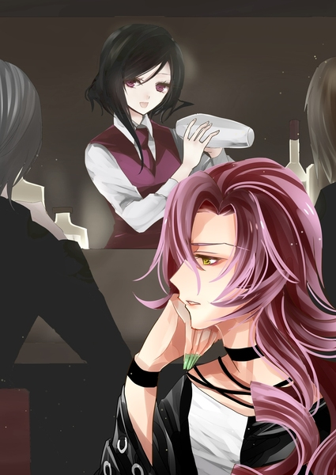

原文来源: [pixiv novel 13949511](https://www.pixiv.net/novel/show.php?id=13949511)
系列: 音楽†SFファンタジー『MYSTIQUE』HARMONIXシリーズ
顺序: 3

ビリーと連絡が取れないままイクスたちは再びMYSTIQUEに訪れた。昨日ビリーが来た辺りの時間に店に入るが、やはりマテリアルを首から下げた青年の姿はない。

「ビリーさん……どうしちゃったんでしょう………」

　エレノアナが憂いを帯びた呟きをこぼす。

端末の向こう側から流れる“音”はレイラとエレノアナの耳にも入っていた。不吉なものを思わせるあの“音”にエレノアナは不安を隠せないでいた。

「まだビリーさんはお見えになっていませんよ」

　イクスたちに向けて穏やかな声が話しかけてきた。

「あっ、マスターさん！」

　イクスたちが振り向くとMYSTIQUEのマスターであるヤスがそこに立っている。胸に手を当てて、深く一礼をするマスター。昨日と変わらない黒のベストとシャレ柄のネクタイのスマートな装いだが、薄手のコートを一枚羽織り、片手には小さい紙袋を持っている。

「どこかに出かけるんですか？」

　イクスが問いかけると、マスターは頷いた。

「ええ。少し食材が足りなくなったので買い足しに」

「ねえ、マスターさん。マテリアルのことでちょっと気になることがあるんだけど」

　レイラがマスターを引き留める。イクスたちが昨晩のできごとを話すと、マスターは難しい顔をした。

「“音”が……そうですか……」

「マスターさんがマテリアルを持ってた時に何か変なことはなかった？たとえば、真夜中に何か起きる、とか」

「いえ……あの宝石は基本的に家に置いておりまして。職業柄、真夜中は店の方に居ますからなんとも……」

　申し訳なさそうにするマスター。真夜中にマテリアルの様子を確かめたことはないと言う。やはりマテリアルの“音”は聞いたことがないらしい。

「そっか……ごめんなさい。引き留めちゃったわね」

「いえ。……ああ、そうだ。薔薇園の方は見ていかれますか？夜はライトアップをしているので、昼間見るのとは少し違った雰囲気ですよ」

「あっ！薔薇園！そうでした、今日こそ夜の薔薇園が見たいって思ってたんです！」

「ご案内いたしますよ」

　出かける途中だったようだが、イクスたちに案内を申し出るマスター。イクスたちが断る間もなく、マスターが店内に戻って裏口の扉を開けた。暖かみのあるオレンジの街灯光が薔薇園の方から漏れ出ている。

　ふらりと引き寄せられるようにエレノアナが裏口に近づいた。うきうきとしているエレノアナを追いかけてレイラとイクスも薔薇園に通じるドアをくぐる。

　店の裏口を抜けると、暖炉の炎にも似た暖かな光に包まれた小さな薔薇の花園が広がっていた。一昨日来たはずのところなのに、違う場所に迷い込んでしまったような気分になるのは何故だろうか。昼間に訪れた一昨日とは異なり、Barに居る客たちの喧噪が微かに聞こえてくる。人の生活音があるだけで、暖かみのある空間に変わっていた。

　昼とは異なる光景を見せる薔薇園に息を飲んで見惚れていた三人だったが、ふとレイラが庭のあちこちに設置してあるランプに近づいた。街灯のようなランプの灯りが頭より少しだけ高い位置にある。昼間目立たなかったのは、地面から伸びる棒のようなランプの支えに薔薇のツタが巻き付いているからだろう。光が灯っていない昼間ではただの飾りのように見える。

「そういえば店の物は全部ハンドメイドって言ってたけど……このランプもマスターさんが作ったの？」

「……ええ。彼女が作る薔薇園をどうしても一緒に作ってみたかったんです。ですが、昔の私は花の育て方一つわかりませんでしたから。代わりに、こういうランプのような小物づくりなら、と……」

「器用なのね」

「ええ。彼女にも言われました」

「このガラスとかどうやって加工し――痛っ」

　ランプに手を伸ばそうとしたレイラが慌てて手を引っ込める。怪我でもしたのかとひやりとするイクス。

「レイラさん？大丈夫ですか！？」

「あー……大丈夫、大丈夫。ちょっと薔薇の棘が刺さっちゃっただけ」

　イクスが駆け寄って覗き込むと、レイラが指先を抑えている。血が出ているようには見えないが、良く見ると白い指先の先端に黒い小さな点がのっている。近くで見ると細い棘がレイラの指先に刺さっているようだった。

　マスターも少し慌てたようにレイラの元に駆け寄って刺さってしまった棘を見る。

「申し訳ありません。お客様に庭園を解放しているため基本的にトゲは抜いてあるのですが、残っていたようで……」

「いいの、いいの！これくらいそのうち抜けるから大丈夫よ」

「私ピンセット持ってます！刺さった棘は放っておいたらダメなんですよ。ばい菌みたいなものですから」

　エレノアナがポケットからかわいらしい子袋を取り出した。中には針や糸などのちょっとした裁縫キットが入っている。そこから小指ほどの長さの小振りなピンセットを取り出したエレノアナがレイラの指を取った。

　テキパキと手慣れた手つきでピンセットをレイラの指先に当て、棘を引き抜く。

「綺麗に抜けたから大丈夫だと思いますけど、もし腫れたら病院で見てもらいましょう」

「そういえば、棘って放っておくと血管に入って心臓に刺さるんだったか……？」

　怖い話を思い出してしまい、うっすらと顔を青ざめさせるイクス。

「それは実際には滅多にないそうです。血管に入るほど小さな棘が残ることって本当に稀なんです。でも、棘の欠片が残っていて化膿しちゃうことは珍しくなくて……ほんとは、消毒できればいいんですけど……」

「店の方に消毒液があるからお持ちしましょう。少々お待ちください」

　マスターが店内に一度戻り、消毒液で満たされた小瓶とガーゼを持ってくる。小瓶を受け取ったエレノアナがレイラの指先に消毒液を振りかけて、ガーゼで優しく拭き取った。

「ありがと、エレノアナちゃん。慣れてるわね」

「うちの庭にも薔薇がありましたから。たまにうっかり棘が刺さっちゃって……私より、お母さんの方が良く怪我してたけど……あっ、マスターさん、消毒液ありがとうございました！」

「いいえ。お役に立てたようで、何よりです。元々は当店の手落ちでしたので……エレノアナさんは薔薇はお好きですか？」

　それはふと思いついたかのような質問だった。軽い口調でマスターに尋ねられたエレノアナは迷わずに頷く。

「はい！薔薇だけじゃなくて、お花も、木も全部好きですけど。ここの薔薇園は大事にお手入れされているのが分かって……とっても好きです！」

「ああ、そう仰っていただけると嬉しいものですね。ありがとうございます」

「だけど、こんなに奇麗なのに棘があるって言うのも勿体ない話だな……ちょっと危なっかしいって言うか」

「違いますよ、イクスさん！棘は薔薇を守るためにあるんです。棘があるからこそ、薔薇は安心して綺麗に咲けるんですよ。それに……棘があるからこそ真っ直ぐ立ってられる」

「真っ直ぐ立ってられる？」

　問い返すイクスにエレノアナは笑顔で頷いた。

「棘を壁とか、木とかにひっかけて自分が倒れないようにするんです。まるで、傍の居る人の手を握ってるみたいで、素敵でしょう？」

「はは、エレノアナらしい考え方だな。棘だけど、手を握ってるみたい、なんて」

「すがった人の手を己の棘だらけの手で傷付けてしまった薔薇は……どうすればいいのでしょうね……」

マスターの呟きに思わずイクスたちはそちらに目を向ける。マスターはエレノアナの方を見ていなかった。

レイラの指先に棘を刺したランプに絡みつく薔薇をぼんやりと眺めている。マスターの視線の先にある薔薇の花弁は深い海のように青い。問いかけ自体もイクスたちではなく、己に問いかけているかのような様子だった。

「どれだけ丹念に抜いたつもりの棘でも……長く触れ合えば触れ合うほどいつか相手の指に刺さってしまう。そして皮膚の下を傷付けた棘に、刺した方は中々気付けないもので……。傷付いていたことに気付くのが遅すぎた時……私は、本当はどうすれば良かったのか……」

「……それは、マスターさんの大切な人の話ですか？」

　どこかへと想いを馳せるマスターに近づくこともなく、されど遠ざかることもなく、その場に立ってエレノアナが問いかけた。きっと、マスターの言う“彼女”のことなのだろう。彼女について語るマスターの顔はいつも影がある。

「……人の心には棘がある。それが彼女の……ハンナの信念でした」

　マスターは彼女の名前を呼ぶことをひどく躊躇うような様子を見せた。その名前を呼べば大切な何かをこぼれ落としてしまうと思っているかのように、慎重に、怯えすらも見せながら彼女の名前を口にする。

「誰かに心を差しだそうとしても、その棘で大切な人を傷付けてしまう。だからこそ人は、大事な人を傷付けないように丁寧に、丹念に、棘をすっかり抜いてしまおうとする。自分を守る棘をすっかり抜いてしまった心を、きっと真心と言う――」

「だから、棘を抜いた薔薇をカクテルに飾ろうとしたんですね」

「はい。MYSTIQUEのオリジナルカクテルを作った時に、彼女が決して譲らなかったところです。不思議な……本当に、不思議な人だった」

「素敵な考えだと思います。会って、お話してみたいです」

「……彼女も皆さまにお会いできていたら、きっと喜んだと思います。きっと私も……――申し訳ありません。妙な話をしてしまいましたね」

　陰りを含んでいた表情を微笑みで打ち消し、いつも通りの様子に戻ったマスター。話題を切り上げようとしたマスターを止めたのはエレノアナだった。

「あ、あのっ！」

　上ずり気味の声がエレノアナの喉から出る。

「棘は、抜けばいいんだと思います！」

「え……？エレノアナさん……？」

「刺さった棘は、抜いて、消毒すればいい。棘が刺さったことに気付くのが遅くて、腫れてしまって、痛くても。棘を抜けば、傷はいつか癒えます。えっと……それじゃあ、ダメ……ですか？」

　それはマスターの独り言のような問いかけに対する答えだった。勢い良く声を上げてから、話しているうちに徐々に尻すぼみになっていく。少しうつむきがちに、自信がなさそうにしながらもマスターと目は合わせ続けるエレノアナ。

　そんなエレノアナの肩をレイラが優しく叩いた。いつもの悪戯っけのある笑みに優しさを乗せて、エレノアナの傍に寄り添う。

「そうね。私も別にさっき棘が刺さったくらいじゃあどうこう思わないし。というか、人同士って、そんなもんじゃない？ねー、イクスくん？」

「えっ？あ、はい………はい。たぶん、そうだと思います。刺さった棘は抜けばいいし……自分で抜けない棘を別の人が抜いてくれることもある。それでいいんだと思います」

　レイラに話を振られて、慌てたイクスの口からぽろりと考えていたことがこぼれ出る。

自分に向けられた棘は悪意によく似ていて、それでいてもっと臆病なものであることをイクスは漠然と理解していた。理解できてしまうのは恐らく、自分も同じ棘を持っているからだろう。

　他人から傷付けられたら、同じ分だけ傷付いてくれることをこっそりと心の片隅が願う。どこかでやり返してやれと囁く悪魔が居る。でも、そんなことをしても指先に刺さってしまった棘が取れることはない。必要なのは、化膿する前に棘を抜くことだけ。きっと、それだけで良かった。……それだけで、息苦しかった世界は随分と楽になった。

「膿を抱えてるのは、辛いですからね。あ……俺は、なんて言うか、そこまで大げさなことは今までありませんでしたけど」

「……もし、皆さまにもっと早く出会えていればと思います。彼女が居る時に、もし出会えていれば……私は彼女を追いかけられたかもしれません。もしそうできていれば……」

　静かな悔恨の沈黙が流れる。マスターはもう居ない誰かの姿を探すように薔薇園を見渡した。イクスもその視線を追ってみるが、そこには当然のように誰もいない。暖かく照らし出された色とりどりの薔薇だけが、誇らしげに咲き誇っている。

「棘は抜けても、過去はなかったことにはできませんからね……おっと。長話が過ぎましたね。買い出しに行かなくては。これにて私は失礼いたします」

　哀愁を消して立ち去ろうとしたマスターだったが、すぐにイクスたちに振り向いて穏やかに笑いかけた。

「ああ、もし何か飲みながらビリーさんを待たれるようでしたら、ご注文はカウンターに居る彼にお願いします。彼もいい腕のバーテンダーですよ」

　店内では若い男がバーテンダーとして客の相手をしていた。昨日は見なかったが、彼もこの店の店員なのだろう。

「へぇ？マスターさんよりも？」

　くすくすと笑いながら軽口を叩くレイラ。少しだけ砕けた態度は先ほどの空気を払拭したがっているマスターに合わせてのことだろう。

「それはぜひ、お客様自身でお確かめを」

「ふふ、なるほど？あ、ねえ。赤薔薇のカクテル……フロイライン・ルージュは今は作っていないのよね？」
「はい。申し訳ありませんが……

「いいの、いいの。じゃあ昨日のと同じものを今日も頼もうかなぁ。昨日のカクテル、私びっくりしちゃった。すごい好きな味だったからさ……一昨日のも辛口めで美味しかった。ねぇ、どうやって私の好みがわかったの？」

「まさか！ただの偶然ですよ」

「ホントに？」

　レイラが探るような目を向けると、マスターは穏やかな微笑を浮かべたまま頷く。柔らかな物言いだが、真意を図りかねるような謎めいた笑みだ。

「あるいは、“運命”と言うべきかもしれませんね。Barは巡り会いですから。人と人。あるいは、人と酒。縁もゆかりもなかったはずのものたちが惹かれあう場所。――ああ、そうだ。バッカスの話はご存知ですか？」
　イクスたちは顔を見合わせた。きょとんとしながら、レイラが思案げに答える。

「バッカスって……お酒の神様だったっけ？あんまり詳しくはないけど」

「はい。酒場には時おり、酒精の神バッカスが訪れて出会いを導くと言われます。彼はかつて月の女神の女官に恋をして、熱烈に追い求めました。バッカスは求める者たちの神なのです」

「お酒の神様と月の女神様ですか……！ロマンチックですね！」

　古い神々の逸話に目を輝かせるエレノアナ。ただの男女の恋話だが、神話と言われると不思議と神秘的なものに思えてくる。

「神の手により紡がれる、奇跡的な出会い。それを古の人々は“運命”と呼んだのです。お客様が運命の一杯にMYSTIQUEで出会えたのならば……それはきっと古の神々の思し召しですよ」

　では、ごゆっくり。

　少しばかり大仰な一礼をしたマスターが庭を出ようとする。その後ろ姿を見て、レイラは目を細めた。

「……ねえ。もう一個だけ聞いていい？」

「ええ、なんなりと」

　声をかけられて足を止めるマスター。

「あなたはどうしてマテリアルを譲ったの？ビリーにねだられたくらいじゃ理由にはならないわ。だって、あいつは別にあのマテリアルが欲しかったわけじゃない。ただ新しいアクセサリーが欲しかっただけ。そうでしょ？」

　マスターは振り向かなかった。しばらく返答を考えるように黙り込んだが、イクスたちからその表情は見えない。

「それは………」

　やがて聞こえてきたマスターの声は少し掠れていた。

「あの宝石の本当の持ち主が居なくなってしまったから……かもしれませんね」

　表情が見えなくともわかることがある。マスターは深い失意に飲み込まれた様子だった。頼る術をなくしてしまったかのような弱々しさに驚くイクスたち。

イクスたちが何も言えないでいると、マスターはドアを開けて店の中へと消えていった。

　イクスたちが薔薇園から店内に戻ると、ちょうどタイミングを合わせたように一人の男が店に入っていった。すらりとした長身を見間違えるはずもない。昨日、イクスを酔っ払いから助けたドランクだ。

　ドランクは店に入るなりカウンターをしばらく熱心に見つめていたが、やがてつまらなさそう舌打ちをした。

「ヤスちゃん居ないのね。やっとハンナちゃんのこと聞けると思ったら、居ないだなんて……」

　ひとり言をこぼしてため息を吐くドランク。マスターを探していたらしい。

「マスターはさっき買い出しにでかけましたよ」

「あら、あなたは昨日の……」

　見るからに意気消沈したドランクを見かねてイクスが声をかけた。振り向いたドランクがイクスの姿を見つけて少しだけ微笑んだ。イクスのことを覚えていたらしい。

「また来たの？物好きねぇ」

「あの、“ハンナ”という方のこと、昨日も言ってましたけどどういう人なんですか？この店のマスターの大切な人……なんですよね？」

「あら、聞こえてたの？」

「あ、すいません……耳に入って……」

「いいわよ、別に。隠し事ってわけじゃないし。ほら、そこの子たちも物欲しそうな顔してないで、近づいてきなさいな」

　ドランクはレイラとエレノアナに手招きしながら、カウンター席に腰かけた。隠し事ではないと言いながらも、秘密の話をするようにイクスたちに顔を寄せる。

「前ね、この店にハンナって店員が居たの。ハキハキしてて、気もまわる、可愛い子でね。お客さんにすっごい人気だったのよ」

　よほどそのハンナと言う女性を気に入っていたのだろう。ドランクは遠い目をして、ここではないどこかを眺めた。その横顔は陰りを帯びて、どことなく傷付いているようにも見えた。

「まぁ、こんなオッサンばっかの店に可愛い女の子が居たらどうなるか、なんとなくわかるでしょ？色々と“オイタ”したヤツらがいてね。ハンナちゃんはいつも笑ってたけど、本当は嫌だったんでしょうね。ある日、急に辞めちゃったのよ」

　ハンナはある日急に店を辞め、それきり行方をくらませてしまったらしい。行先を知っているのは恐らく、雇い主であるマスターだけだった。

マスターが自分の店をオープンした当初からハンナが手伝っていることもあって、二人の仲は良かった。そのため、常連客からやっかみを買ったマスターが絡まれることもあった。しかしその度にマスターは酔っ払いたちをうまく言いくるめ、何故か賭け勝負に持っていっていた。昔取った何かの杵柄なのか、マスターは賭け事には無敗だった。少なくともハンナが店を辞めるまでは、賭けに負けたことはなかったらしい。

ビリーが持っていたマテリアルも元々はマスターが賭けで手に入れた物だった。一晩だけMYSTIQUEに訪れたスーツの男がマスターに挑んだが、負けが込んでしまい、現金の代わりに差し出したのがあのマテリアルだったと言う。

しかしマスターの無敗はハンナが店を辞めてしまってからすっかり鳴りを潜めてしまった。賭け事自体あまりやらなくなったが、賭けても掛け金を巻き上げられる側になることが多い。幸運の女神に見放されてしまったのだと常連客は噂していた。

「ハンナちゃんが居なくなった時、あのヤスちゃんがすっごい落ち込んでてねぇ。ほんとにお店畳んじゃうんじゃないかってあの時は思ったわ。最近は持ち直したみたいだから、それは良かったんだけど……まあ、気持ちは持ち直しても店は中々ねぇ。最近、本当に毎日のようになじみのヤツらも来なくなっちゃって。“オイタ”してたヤツらがごっそり居なくなったのにはちょっと清々したけど、全員居なくなっちゃったらこの店も潰れちゃうわ。こういうところに新規のお客さんなんてそうそう来ないし……」

「そういうあなたも、随分とハンナちゃんに入れ込んでたみたいだけど。“オイタ”した一人だったんじゃないの？」

　レイラが腕を組んで、視線を流すようにドランクを見た。瞬間的にドランクの顔が憤怒に染まっても、まるでそれを予想していたかのようにレイラは涼しげな顔をしていた。

「ハンナちゃんを傷付けるばっかりのそこらの馬鹿と私を一緒にしないで！」

「そう？それならいいけど」

　落ち着いているレイラの対応にドランクも少し冷静さを取り戻したようだった。乗り出しかけた体を元に戻し、憂鬱げなため息を吐く。

「私はあの子を守りたいだけよ。そりゃ、あの子の特別になれたら、とは思ってるけど。他のヤツらとは違って、私は真剣なの。……本当に、あの子が大事なの」

　そこまで言って、ドランクは我に返ったように一つ咳払いをした。ドランクが気分を切り替えるように髪をかき上げると、微笑みがその口元に戻る。

「でも、ハンナちゃん、本当にどこに行っちゃったのかしら……。店にも家にも居なくて……ほんとに心配なのよね」

「………ん？」

　何故かイクスは男の言葉に違和感のようなものを感じた。何かがおかしい気がして首をひねるが、何が引っかかっているのかがわからない。

　しかしイクスの思考はエレノアナの驚いたような声ですっかりどこかに飛んで行ってしまった。

「あれ！？それ……マテリアルですか！？」

「「え！？」」

　慌ててエレノアナの視線の先を見るイクスとレイラ。ドランクのコートのポケットからキラリと光るシルバーのチェーンが垂れ下がっている。その先にはネックレスのような物が繋がっており、淡い光を放つダイヤがポケットの隙間からちらりと顔を覗かせていた。

「それは、ビリーが持っていた……！」

　イクスが驚いてマテリアルを凝視するとドランクはキョトンと自分のコートから垂れるチェーンを見やった。

「え？ああ、これね。ビーちゃんの持ってた宝石よ。マテリアル、って言うのね。今日起きたらこれがうちのポストに入ってたの。ビーちゃんが借金のカタに置いていったらしくって」

　話を聞くと、ビリーはドランクにいくらかの借金をしていたらしい。ビリーが賭けで負けた分の支払いをずっとためていたが、昨晩ようやく返してきたのだ。

「メモも一緒にポストに入っててね。『もうMYSTIQUEには来れない。今までの借金をこれでチャラにしてくれ』って。何があったか知らないけど、また常連客が一人減っちゃったみたいねぇ」

「ビリーが……。あいつが、そう簡単に手に入れたマテリアルを渡すかな……」

「さあねぇ。そこは私もちょっと意外だったけど。でも、こうして私の手元にあるわけだし。ビーちゃん、やっぱり忙しくなったのかしら。仕事してる店の店長が急に居なくなったから、自分にお鉢が回ってきそうとは言ってたけど……まさか急に来なくなるなんてねぇ」

「ビリー本人は見ていないんですか？」

「見てないわ。というより、ビーちゃんはよく私の家がわかったわね……連れてきたことあったかしら？ハンナちゃんとヤスちゃんは確か知ってるはずだけど……」

　男の返答にイクスは不安を覚えた。やはり昨晩からビリーの姿を見た者は居ない。ビリーがほとんど毎日のように通っているこの店にも来る気配はなく、行方知れずのままだ。

「ねえ、ビリーの働いてる店の店長が居なくなったって、どういうこと？何かあったの？」

　レイラの問いにドランクは少し考え込む素振りを見せた。

「そうねぇ……なんか言ってた気はするけど……ああ、そうそう！確か、一昨日の夜、店のバックヤードが荒らされてたみたい。暴れたみたいにしっちゃかめっちゃかで……ビーちゃんのロッカーのドアが無理矢理こじ開けられててね。ビーちゃんったらひどいのよ！ヤスちゃんの宝石を店のロッカーに忘れていってたのよ！居なくなった店長さんもその宝石を盗もうとしてロッカーを開けたんじゃないかってビーちゃんが言ってたわ」

「でも、実際にはなくなってなかったのよね？」

「……言われてみればそうね。盗もうとしたけど、何かあって盗めなかったのかしら？まあ、そもそも貴重品を置いていくな、って話なんだけど！」

　ドランクが憤慨していると、エレノアナがおずおずと手を上げた。

「あ、あの……！そのマテリアル、ちょっと見てもいいですか？」

「うん？ええ……まあ、見るだけならいいけど」

　ドランクがエレノアナにマテリアルを渡す。そっと両手で青く輝く宝石を受け取ったエレノアナが神妙な面持ちでマテリアルを見つめた。

　しばらくマテリアルを見つめていたエレノアナだが、やがて諦めて肩を下ろした。

「……ダメです。“音”、鳴りませんね……」

「音？」

　ドランクが不思議そうな顔をした。まさか宝石から“音”が鳴るとは思わなかったのだろう。イクスたちが昨晩の話を含めてマテリアルについて話すと、ドランクはケタケタと笑った。

「宝石が音？ビーちゃんが急に店に来ないとか言い出したのも宝石のせいかも、って？まさか！きっと悪い夢でも見たのよ。宝石が人を襲うなんて、おとぎ話じゃあるまいし」

　マテリアルの危険性を訴えて何度もイクスたちは説得を試みたが、ドランクは聞く耳を持たなかった。元々人間であるマテリアルを元に戻すために譲って欲しいと説明しても、イクスたちの話を信じる様子はない。
　くすくすと楽しそうに笑いながらもドランクはマテリアルを決して譲らない姿勢を見せた。

「ごめんなさいね。もうこれの使い道は決めてるの。ずっと前からね」

　結局ドランクを説得することはできず、イクスたちは不安を感じながらも一度Barから引き上げることにした。帰り支度をしながらずっと考え込んでいたレイラが、ふと帰り際にドランクにもう一つ質問をした。

「あ、ねぇ。他に変わったことってなかった？」

「そうねぇ。変わったこと……ああ。ないことはないわよ」

　ふと、ドランクが本心の読み取りづらい笑みを浮かべた。ぞっとするほどに美しいその笑みにイクスの背筋が粟立つ。

「ロッカーが荒らされた夜に、ビーちゃんの家の周りに不審者が出たみたい。ストーカーか、変質者か知らないけど。ほんと、物騒な街よね、ここ」

　MYSTIQUEから宿に戻るまでの帰り道、イクスたちはずっと黙り込んでいた。それぞれが先ほどの出来事に思うことがあった。消えたビリーの行方に、ドランクの手元に移動していたマテリアル。何かが起きているのは確かだった。

　イクスが気になっているのはビリーのことだ。

　イクスは歩きながら自分の端末を取り出してチャットルームを立ち上げる。ビリーの端末IDをイクスも登録し、何通かメッセージを送信していた。どれも既読は付くものの、読まれているような気配はない。連絡の取れないビリーに対する苛立ちのような心配が胸に渦巻いていた。

「ビリーさん、どうしたんでしょう……」

　イクスの気持ちを読み取ったかのようにエレノアナが呟いた。イクスも複雑な気持ちで昨晩の通話を思い返す。

「電話をかけた時、マテリアルはまだビリーの手元にあったんだ。その後に何かあって、マテリアルがドランクさんの手元に渡った……」

「『もうMYSTIQUEには来れない』ってビリーからのメモには書いてあったんだっけ。来れなくなったからって、借金を清算するようなヤツには思えなかったけど。そこら辺、イクスくんはどう思う？」

「そうですね。俺もスクールの卒業以来はずっと会ってなかったんですけど。そういう、義理堅い方じゃなかったと思います。まあ、どちらかって言うと、踏み倒す方がアイツらしいですね」

　ビリーに何があったのかははっきりとはわからない。だが本人が進んでマテリアルをドランクに渡したとはイクスも思えなかった。

　気になるのは電話越しに聞こえたマテリアルの“音”だ。昼間は黙したままのマテリアルが“音”を奏でていたことにイクスは不吉な予感を覚えていた。マテリアルは時として不思議な力を宿す。その力がいつでも平和的な方向に用いられるわけではないことを、イクスたちはすでに知っていた。

　それに恐らく、マテリアルに関わって消えたのはビリーだけではない。ドランクが話していたビリーの店での騒動にもマテリアルが絡んでいる気がイクスはしていた。

「やっぱり……マテリアルが何かしたんでしょうか……」

　エレノアナもイクスと同じ予感を抱えていた。よりいっそう不安そうに目を伏せる。

「何かあったとしたら、やっぱりマテリアル絡みだと俺も思う。だけど、そうだとしても、なんでドランクさんがビリーの持っていたマテリアルを持ってたんだろう……」

「うーん。マテリアルがビリーさんを襲った後、自分で移動してドランクさんの家のポストに入った、とか……どうでしょう……？」

　言っているエレノアナ本人が自分の発言を訝しむような顔をしている。徐々に語気を弱め、最終的には自信なさげに眉尻を下げた。

　くすくすとレイラが笑う。

「なんだか怪談みたいな話ね。ほら、良くあるじゃない。呪いの宝石に魅了された持ち主が次々に不幸に見舞われる、ってヤツ」

「怖いこと言わないでくださいよ、レイラさん」

「だって、ちょっとそれっぽくない？まあ、流石にマテリアルが自力で移動したとは私は思わないけど」

「で、ですよね……」

　　しょんぼりと落ち込むエレノアナの頭をレイラが軽く小突いた。

「切り出し方としてはいい、って言ってるのよ。エレノアナちゃんの話で思い出したんだけどね。昨日の夜ビリー以外の誰かがあの部屋に居た気がするの。そいつがマテリアルをドランクさんの家に持って行ったんじゃないかしら」

「「別の誰か？」」

　エレノアナとイクスが声をそろえた。同じ方向に首を傾ける二人を見てレイラがおかしそうに笑いつつ、説明を続けた。

「イクスくんも気付かなかった？通話、向こうから切れちゃったじゃない」

「え、ええ……それが、どうかしましたか？」

「かかりっぱなしの通話が勝手に切れるってありえないでしょ。端末の電源が切れたらそりゃ通話も切れるけど、メッセージの既読は付くから端末は通話が切れた後も生きてたんだと思う。ってことは……」

　レイラがピンと人差し指を立てた。

「通話を切った誰かが居たってことじゃない？もし、もしよ？特別な力でマテリアルが自力で移動できたとして。マテリアル……って言うか、マテリアルになった人間がそこまで気にするとは思わないのよね。だいたい人間ってのは、力を持った途端に万能になった気分になって、細かいこと気にしなくなるからさ。だからマテリアルでもビリーでもない、別の誰かが一人居たんじゃないかなって」

　少しだけ皮肉げにレイラは言った。マテリアルの開発者を父に持つレイラには、マテリアルを取り巻く人間模様に思うところがあるのだろう。

「確かにレイラさんの言う通りかもしれませんね。ビリーだったら黙って切ることはないだろうし……」

「じゃあ、ビリーさんの部屋に居た人はちょっと細かい人だったのかも、ですね」

「あるいは、ビリーの部屋で物音が立つのを私たちに聞かれたくなかったか……。まっ、証拠はないから、勘だけどね。でも、こういう勘あんまり外したことないのよ」

　勘と言いながらもレイラの瞳には確信が宿っていた。少なくとも、マテリアルが自分で移動したと考えるよりはよほど現実味がある考えだ。

「でも誰がビリーさんの部屋に居たんでしょう？」

「そうだなぁ。今のところ、一番怪しいのはマテリアルを持ってるドランクさんだと思うけど……でもあの人がなんでビリーを狙うのかがわからないな……」

　ビリーとドランクは同じ店の常連客同士でしかない。ドランクがビリーを襲ってマテリアルを奪ったとしても、動機がわからなかった。

確かにビリーはドランクに借金をしていたが、ドランクが返済を迫っていた様子もない。たとえもし、ドランクがビリーから借金のカタとしてマテリアルを奪い取ったとして、それをイクスたちに見せるような真似をするだろうか。ビリーが自分の家を知っていることにドランク自身も疑問に思っていたようだし――

「あれ？」

　ふとイクスは何か引っかかるものを感じて目を瞬かせた。そして、あっ、と声を上げて目を見開く。先ほどBarで話していた時に感じた違和感の正体がわかったのだ。

「ドランクさん……ハンナの家をどうして知ってたんだ？」

　ただの常連客であるドランクが何故、元店員ハンナの家を知っているのだろうか。それに、聞いた時は聞き流してしまったが、MYSTIQUEのマスターとハンナもドランクの家を知っているとも言っていた。

　もしや、三人には店員と常連客以上の関わりがあったとでも言うのだろうか。今更ながらにドランクが言っていた“マテリアルの使い道”とやらが気にかかる。ドランクは前からマテリアルを欲しがっていたようだった。店に入ってくるなりマスターを探していた様子だったから、マスターが絡んでいるのだろう。

はっきりとは言えないが、不安のようなものがイクスの中で渦巻いた。

　イクスたちはいつの間にか足を止め、三人で視線を交し合っていた。

「何か……嫌な予感がします」

「俺もだよ、エレノアナ。一回店に戻って、もう少しドランクさんに話を聞いてみよう」

　イクスの脳内でマスターの残した言葉が渦巻いている。

　マスターはマテリアルの本当の持ち主が居なくなったと言っていた。それはきっとハンナのことだとイクスは半ば確信していた。だが、何故ハンナは居なくなったのだろうか。マスターが決して踏み込ませなかった先が今になって気にかかる。

　Barに戻ろうとしたところで、イクスの耳がレイラの小さな呟きを拾った。

「…………最近減った常連客、か」

「レイラさん？」

「……………ううん。なんでもない。早く戻りましょう！」

　複雑そうな顔をしたレイラを疑問に思いながらも、イクスはひとまずBarへの道を急ぐことにした。
　時刻はじきに深夜12時を示そうとしていた。
