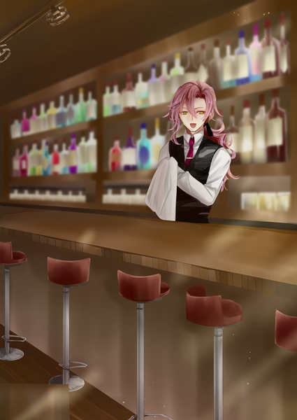
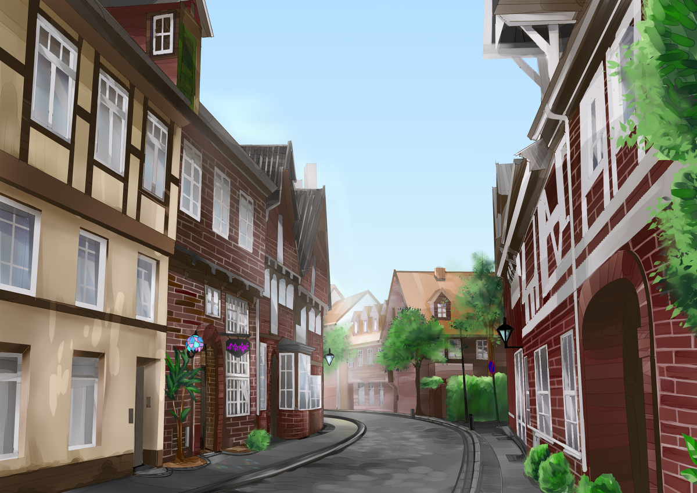
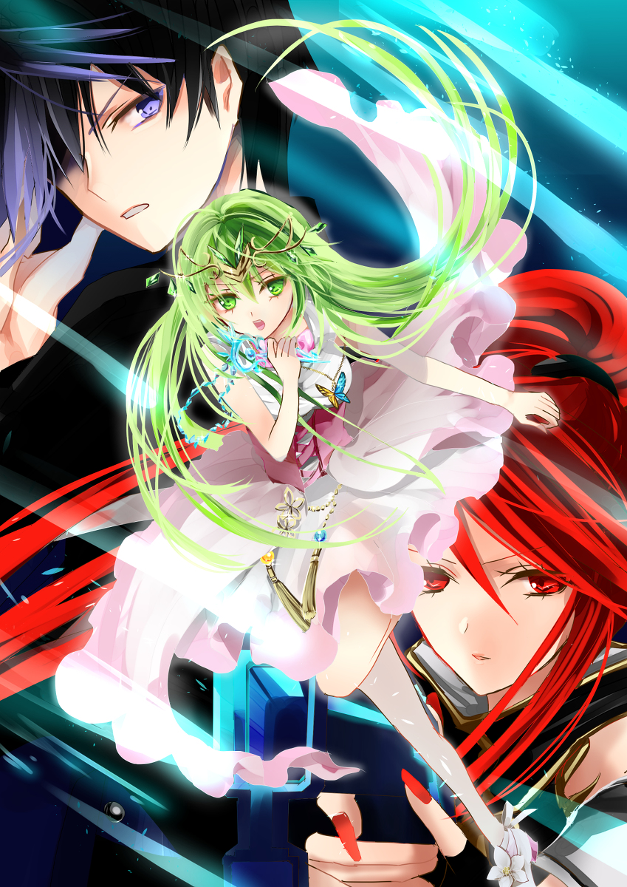

原文来源: [pixiv novel 13949513](https://www.pixiv.net/novel/show.php?id=13949513)
系列: 音楽†SFファンタジー『MYSTIQUE』HARMONIXシリーズ
顺序: 5

なだらかな坂になっている石畳の道を辿り、二つ目の角を曲がるとこじんまりとした店が見えてくる。ステンドグラスの丸いランプを提灯のようにぶら下げたBarには変わらずに『MYSTIQUE』の看板がかかっていた。

まだ日中の明るい時間帯にも関わらず明かりがついており、中には人の気配がする。

ドアに下げられた札にはclosedとあるが、イクスは迷わずにドアノブをひねった。暖かなオレンジの色の電灯が窓から差し込むポカポカとした陽光と合わさり、ひだまりのような空間を作り出していた。カウンターの向こうでグラスの手入れをしていた男が店内に入ってきたイクスたちに気付いて振り向いた。

「あら、早かったわね」

グラスを磨いていたドランクがイクスたちを見つけて少し照れ臭そうに笑った。今のMYSTIQUEのマスターは彼だった。

前マスターであるヤスは店を畳み、どこかへと去って行ってしまい行方知れずになっている。ヤスの持っていたマテリアルが解放され、復讐を続けることができなくなったからだ。

何も言わずに姿を消したヤスの本心はイクスにはわからない。しかし微笑みを消して肩を落とす姿は、どこか安堵しているようにも見えた。

大量にあったマテリアルの欠片は試しにキュアを使ってみたところ、普通のマテリアルと同じように人間に戻せることがわかった。売り払われてしまったマテリアルのいくつかは行方がわからなかったが、ほとんどの被害者は人間に戻せた。

元々血気盛んな節のある元常連客たちは仕返しをするために血眼になってヤスを探しているという。ヤスの行った行為は許されることではないが、できることなら彼らに見つからずに居てほしいと願ってしまうイクスだった。

主をなくしたBarは存続が危ぶまれたが、最終的にはドランクが名乗りを出て全てを引き継いだ。今はドランクがMYSTIQUEの守り主だ。ドランクは前マスターの負債も引き受けるつもりなのか、未だ見つからないマテリアルの欠片も買い集めていくつもりだと言っていた。ある程度欠片が集まりきったら、キュアを持ってまたこの店を訪れることをイクスたちも約束した。

「そうだ、真昼のカクテルはいかが？ちょっと背徳的で素敵な味よ？あ、エレノアナちゃんはノンアルコールね」

「はい！お願いします、ドランクさん！」

　カクテルグラスを取り出したドランクを見つけて目を輝かせるエレノアナ。イクスたちは促されるがままにカウンター席に並んで座った。

カウンターに設置された真新しいコーヒーマシンをエレノアナが目ざとく見つけて目を輝かせる。

「あれ？そのコーヒーマシン、前はなかったものですよね？」

「ふふ、気付いちゃった？これからたまに昼もお店開けとこうと思ってね。コーヒーとケーキを出して喫茶店みたいにするのはどうかなって」

「素敵ですね！お昼の時間帯だったら窓からここの町並みも綺麗に見えて、ロマンチックです！」

「でしょう？昼の町並みが見れないこと、実はずっと不満だったのよ。薔薇園も夜しか入れないなんてもったいないし。これからは外がよく見えるようにテラス席も作るわよ！」

　エレノアナとこれからのMYSTIQUEを語るドランクの表情は明るい。ヤスのマテリアルに襲われた日はかなり憔悴していたからイクスたちも心配していたのだが、今は吹っ切れているように見えた。

　カウンターの向こうでテキパキとカクテルの準備をするドランクを見てレイラが目を細める。満腹な猫のような嬉しそうな微笑みだ。

「なんだか張り切ってるわね、ドランクさん」

「そう？そうかもしれないわね。ヤスちゃんが帰ってくるまで私がこの店を守らなきゃ、って考えたらなんだかやる気がわいてきちゃって」

「マスターさん……ヤスさんが帰ってくるって思ってるんだ？」

「帰ってくるわ、きっと。ハンナちゃんもヤスちゃんも。だって、二人ともここが大好きだったんだもの。大切な思い出は中々捨てられないのよ。初恋がずっと心のどこかに残っているようなものね」

　くすりと笑ったドランクの横顔は、見ているものを男女問わずどきりとさせるような不思議な色香があった。イクスがぼんやりとドランクを眺めていると、不意に視線がドランクのものとぶつかった。茶目っけたっぷりにばっちりとウィンクが飛んでくる。

「ふふ、イクスちゃんにはちょっと早かったかしら？」

「あはは………」

　なんとも言い返せずにイクスはただ苦笑を返した。

「ありがとうね、イクスちゃん。エレノアナちゃんに、レイラちゃんも」

「俺たちはマテリアルを解放したかっただけです」

「そうだとしても、私が助けられたのは変わらない事実よ。……ヤスちゃんのことも、ありがとうね」

「え……？」

　イクスたちに礼を言うドランクは少し寂しそうだった。長い横髪を手持ち無沙汰に指でいじりながら、どこか遠くへと思いを馳せるように目を伏せる。

「私じゃヤスちゃんのこと止められなかったから。それに、きっとあなたたちが駆けつけてくれなかったら私、自分のしでかしたことも知らないままでいたわ。ヤスちゃんもハンナちゃんも傷付けていることに気付かないまま、ずっと、のうのうと……」

　ドランクの口からついため息がこぼれた。

「はぁ……深酔いなんかするもんじゃないわね、まったく」

　がっくりとうなだれるドランクにレイラがくすくすと笑った。

「恋にも酒にも？」

「そうそう！恋にも酒にも！ほんと、昔の言い伝えって中々に的を得ているわよねぇ」

「言い伝えって？」

「バッカスのお話よ。お酒の神様なんだけど、知ってるかしら？」

　ドランクの問いかけにレイラが頷く。前にヤスが言っていた酒の神がそんな名前だった。

「確か、月の女神の女官に恋をして、熱烈に追い求めた神様だったわよね？前にヤスさんが言ってた。出会いを導く神様だって」

「ヤスちゃんがそんな風に言ってたの……。そう。相変わらず、優しい嘘つきさんね」

　ドランクは何故か悲しげに窓の外へと視線を移した。居なくなってしまった誰かの面影を探すようにぼんやりと石畳の町並みを見つめている。

「バッカスはね……月の女神の女官に恋をして、酒に酔った勢いに任せてしつこく女官を追いかけたの。どこまでも追いかけてくるバッカスに怯えた女官は月の女神に必死に助けてくれるように祈った。すると、月の女神は女官の願いを聞き入れて、彼女を助けてあげた。……女官を石の姿に変えて、バッカスが何もできないようにしたの。
酔いが覚めて、石になった女官を見たバッカスはすごく後悔したわ。二度とこんなことはしないと誓い、その証として自分の作った葡萄酒を女官だった石に捧げた。すると石はみるみる葡萄酒の色を吸って、美しい宝石の姿に変わった……」

　ヤスはロマンチックに聞こえるように説明をいくらか省いていたのだろう。ドランクが語る神話はイクスたちが思っていたよりも悲劇的な結末だった。

「私も宝石に変えられるかしら、この店と、この店で過ごした思い出を…………」

　ドランクは心のどこかに負ってしまった傷を隠すように、優しく微笑んだ。

　大切に思っている人を守っているつもりで傷付けていた。その罪にドランクはこれからも悩まされ続けるのだろう。

　けれども、悩みながらもドランクは前を向こうとしている。この先どうしたらいいのかなどわからないが、わからないなりにMYSTIQUEを守りながら進んでいこうとする決意がそこにはあった。

「変えられますよ。だって、ドランクさん自身が宝石みたいに素敵な人ですから！」

「あら、エレノアナちゃんったら嬉しいこと言ってくれるじゃない――ん？」

　ドランクがカクテルの用意をしていると、急に店のドアがバン！と大きな音を立てながら乱暴に開いた。イクスたちが驚いて振り向くと、怒り狂った様子の男がそこに居た。

傷んだ髪と動く度にジャラジャラと無数のシルバーアクセサリー。イクスの元同級生のビリーだ。ヤスにマテリアルの欠片に変えられていたビリーだったが、イクスたちのキュアのおかげで元の人間の姿に戻っていた。

「おいヤス、話は聞いたぜ！！テメェが俺に妙なことしたのはわかってんだ！騒がれたくなきゃ慰謝料払え…………って、あ？ドランクさん！？」

「あら、ビーちゃんじゃない！ハァイ、元気？」

　大方、ヤスの行いをどこからか聞いて、問い詰めに来たのだろう。問い詰めるどころかゆすろうとしていた気配すらあり、イクスは重々しいため息を吐く。マテリアルの欠片に変えられてもなお、ビリーに変わりはないようだった。

「なんでドランクさんがここに？つーか、なんでお前まで居るんだよ、イクス」

「ドランクさんに呼ばれて来たんだよ。元気そうで何より」

「ああ！？ぜんっぜん元気じゃないっての！変な石に変えられたから頭も痛ぇし、肩もすげぇ凝るし！腕も妙に突っ張ってる感じがして良く寝れねぇんだよ、どうしてくれんだ！」

「あー……そうか、それは大変だな……」

　ビリーの大げさな訴えを聞いて、店内を呆れた雰囲気が流れる。真面目に捉えたのはエレノアナだけだった。

「ええ！？マテリアル化にそんな後遺症が……」

「エレノアナちゃん、大丈夫よ。ないから。そんな後遺症、ないから。……当たり屋とかってあんな感じなのかしら？」

　小声で呟いたレイラの一言があまりにもしっくりときて、イクスは咄嗟に吹き出しそうになった。ビリーの顔は至って真面目なのだから笑ってはならないと思いつつも口元が少し緩んでしまう。

「ヤスさんは居ないよ。俺たちもどこに行ったか知らないんだ」

「はぁーーー！？シッポ巻いて逃げたのかよ、アイツ！クソダセェ！人の迷惑も考えねぇで、逃げるなんてクズじゃん」

「ちょっと、ビーちゃん？」

　ドランクの声に剣呑なものが宿った。びくりとビリーの肩が揺れる。カツカツとヒールを立てながら近づいてくるドランクにビリーは二、三歩後ろに下がった。

「な、なんすかドランクさん……？」

「ヤスちゃんは確かに人様に迷惑かけたけど、そこまで言われる謂れはないんじゃないかしら？」

「え？いや、でも……ほら、俺、肩とか、頭とか痛い……ような、そうでも、なくなってきたような……」

「何、私とやる気？」

「い、いや！そ、そんなまさか！あはははは……あっ、俺、ちょっと用事思い出したんで、もう行きますね！あはははは！」

　ドランクとやりあってまで意見を通そうとは思わないらしい。ビリーは大量の冷や汗を浮かべてじりじりとドアの方へと後退していった。そのまま脱兎のごとく逃げ去る。あまりにも鮮やかな逃げ足にイクスは思わず唖然としてしまう。

「な、なんだあれ……」

「失礼しちゃうわねぇ、まったく」

　そう言いながらもドランクはしてやったりの表情を浮かべている。ああ言えばビリーが逃げ帰ることを予想していたようだ。

「そう言えばだけど……ビリーだけじゃなくって他の常連さんにもドランクさんってちょっと怯えられてなかった？」

　レイラが尋ねると、ああ、とドランクが少し困った顔をする。

「私が“オイタ”したヤツらをコテンパンにしたことって、常連の間じゃ有名なのよ。だから、アイツらは私を怒らせないようにしてる、ってワケ」

　ハンナを傷付けたドランクの行いがこの先MYSTIQUEを守るために役立ちそうだと、何とも言えない微妙な笑いをこぼすドランク。

「複雑な気持ちだけど、まっ、使える武器は使わないと、でしょ？」

　ビリーが開きっぱなしにしたドアをドランクが閉める。追い出してやったとばかりにパンパンと手を満足げに叩く強かさにイクスは苦笑した。頼もしいことこの上ない。

「っと。アイツらの話よりも。――お待たせいたしました。当店自慢のオリジナルカクテル、フロイライン・ルージュです。どうぞお召し上がりください」

　イクスたちの前にルージュの液体で満たされたグラスが三つ置かれる。エレノアナの分だけ少し色合いが薄いのは、ノンアルコールのレシピで作られているからだろう。三つのグラスにはそれぞれ大輪の赤薔薇が飾られていた。

　見覚えのあるカクテルにエレノアナが目を見開く。

「あっ、これ……！？ハンナさんとマスターさんが二人で作ったカクテルですよね！？」

「あら？エレノアナちゃんたち、このカクテルのこと知ってたの？」

　エレノアナの反応が予想外だったのだろう。ドランクも驚いた顔でイクスたちを見た。

「は、はい！マスターさん……あっ、ヤスさんに作ってもらって。……あ、この話、秘密のお話、だったような……」

　しまった、と動揺するエレノアナにくすくすと笑うレイラ。

「良いんじゃない？マスターはもう代替わりしてるんだから、時効よ、時効！」

「そう……言うものですか？」

「そーゆーもんよ。でも……ドランクさん、良くレシピ知ってたわね。こういうのってお店の秘密のレシピじゃないの？」

「そりゃ教えてもらったことはないけど。何回飲んだと思ってんのよ。一応、オープン当初からMYSTIQUEの常連やってたのよ？目の前で淹れてもらえるから、材料もだいたい分かるしね。我ながら中々の再現度だから、安心して飲んでちょうだい」

「あら本当ね。違いなんてわからないくらい……うん！やっぱりこれ、美味しいわ！もう飲めないかと思ってたから嬉しいサプライズね！」

　さっそく一口飲んだレイラが歓声を上げる。マスターの作ったカクテルが好みだったと言っていた言葉に嘘はなかったのだろう。心の底から嬉しそうにカクテルグラスを傾けていく。エレノアナもレイラに習ってグラスから一口飲み、ほわりと幸せそうに笑う。

「甘くて美味しいです！これにも薔薇ジャムが入っているんですね！」

「良かったぁ。自分で試飲した時は中々の出来だと思ったけど……やっぱり人に飲んでもらうと自信がつくわね」

　張っていた肩の力を抜いて、ほっとため息を吐くドランク。自信に満ち溢れているドランクにしては珍しい表情だ。だが、ぎこちないながらも前マスターから受け継いだ店を守りたい気持ちがありありと伝わってきて、イクスたちも暖かい気持ちになる。

　もし自分がマテリアルだったら、きっととても暖かい“音”を奏でたんだろうな。思わずそんなことをイクスが考えていると、本当に“音”が聞こえてきた。夕陽で温められた石畳を思わせる、暖かみのある“音”が流れている。短く鳴ったり、長く伸びあがったりとはしゃいで踊るように響き渡るその“音”は、酒のほろ酔いに任せて大切な人をダンスに誘うかのようなロマンチックな“音”だった。

　まさか、本当に“音”を奏でてしまったのかと慌てて自分の身体を見下ろすイクス。当然のようにそこには何の異変もない自分の身体がある。エレノアナとレイラも驚きながら辺りを見回している。気のせいではなく、本当に“音”が流れているらしい。

　耳を澄ませていたエレノアナが椅子から降りて、カウンターの裏にしゃがみこんだ。あっ！と少女が驚いた声を上げる。

「マテリアルの欠片！？カウンターの下に落ちてたんですね……！」

　立ち上がったエレノアナの片手には見たことのあるような結晶の欠片が乗せられていた。薔薇園や射撃場で入手した欠片はどこかガラス玉を思わせたのに対し、この欠片はまるで本物のマテリアルであるかのように強く輝いていた。興味深そうにしげしげとレイラが欠片を見つめる。

「拾いそびれてるのがあったのね……って言うか、ヤスさんのマテリアルで作られた欠片は“音”が鳴らないはずじゃ……ううん。でも実際に鳴ってるわけだし……」

「俺には理由は分かりませんけど……でも、いい“音”だと思います」

「それは間違いないわね」

「はい！私もとても素敵な“音”だと思います。このお店が大好きだった人の“音”なのかもしれませんね」

　マテリアルの欠片を胸に抱きしめたエレノアナが優しく笑う。マテリアルの欠片にされた人間の想いが乗り移ったかのように慈愛に満ちた瞳で店内を見回して、踊るようにくるりと体をターンさせた。

「これも、マテリアルの“音”なのね」

　“音”が聞こえて、ヤスのマテリアルを思い出してしまったドランクの顔は強張っていた。しかし、イクスたちの様子を見てゆっくりと緊張が取れていく。改めてマテリアルの欠片が奏でる“音”を聞いて、嬉しそうにドランクの口元がほころぶ。

「……ヤスちゃんのマテリアルの“音”は怖かったけど、これは……楽しそう。MYSTIQUEにぴったりの“音”じゃない？」

　ドランクの視線に気付いたエレノアナが自分の椅子に戻り、マテリアルの欠片をカウンターの上に乗せる。店内の灯りに暖かく照らし出された結晶の欠片をドランクの指がつん、と突いた。

「歓迎するわ、お客様。でも次来る時は人間の姿でお願いね？」

　ドランクに答えるようにマテリアルの欠片が輝きを増す。本物の宝石の欠片であるかのように、美しい光を内部で乱反射させていた。“音”が遠慮をなくしたように、更に高らかに店中に響き渡る。

　ロマンチックに見つめ合い、足さばき軽やかに踊るかのような“音”が流れる中、イクスも自分のグラスを傾ける。カクテルを一口含むと、柑橘のさわやかさを含んだ甘い味が舌に広がる。舌に乗せた甘いカクテルを飲み込むと、ぴりりと刺激的な後味が喉に残り、鼻から微かな薔薇の芳香が抜けた。

　これは美味しい。酒の味をあまり気にしたことのなかったイクスだが、レイラとエレノアナと同じように自分の口元が緩むのを感じた。

　イクスの表情で味の感想を聞きとったドランクが胸に手を当てて大仰気味の一礼をする。MYSTIQUEの前マスターを思わせる礼をしたドランクはゆっくりと顔を上げ、少し照れたように笑った。

ここにしかない、格別な時間がMYSITQUEの店内を満たしていた。

To be continued….

最後まで、読んで頂きまして、誠にありがとうございました！
楽しんでもらえたなら、なによりです。
イクス、エレノアナ、レイラの旅は、まだまだ続きます。
PART４以降も制作予定ですので、一行の旅にお付き合い頂ければ
それ以上に嬉しい事はありません！

©TatshMusicCircle.2020
原作&監修:Tatsh 
小説:Takatano Takuma
イラスト:藤村都矢
Assistant Staff:LiK-K
https://ameblo.jp/tatshblog
