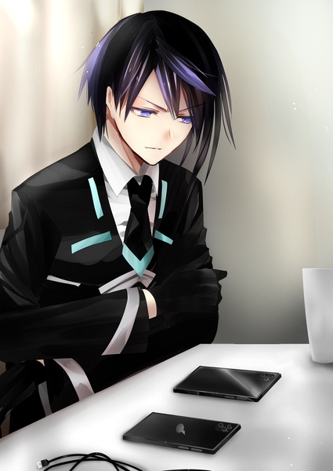
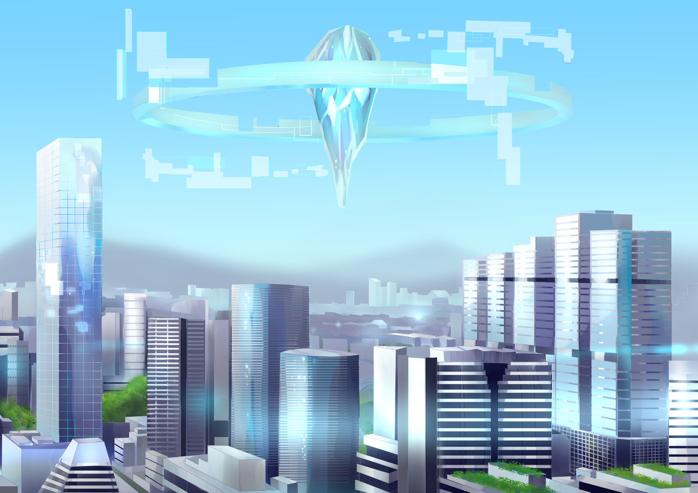
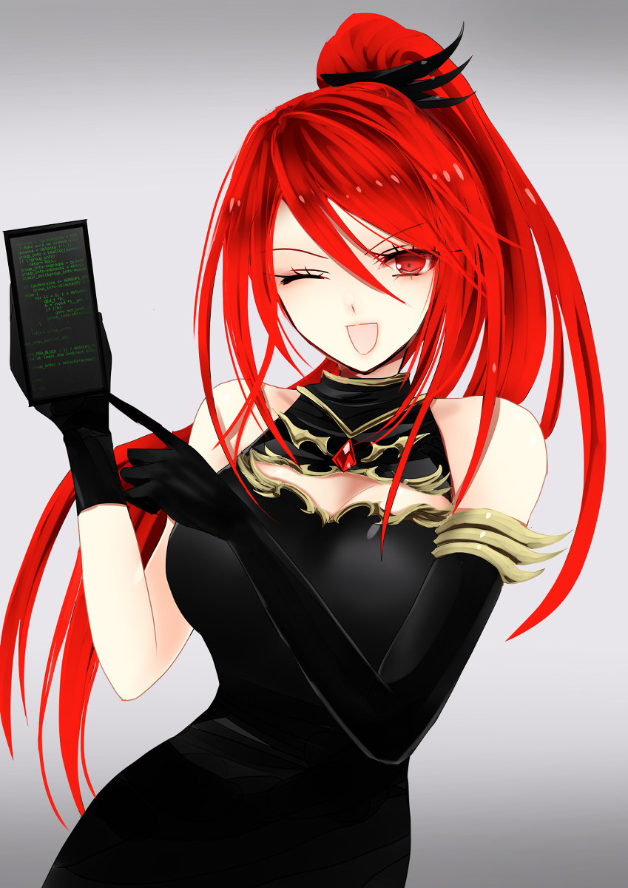

原文来源: [pixiv novel 15071375](https://www.pixiv.net/novel/show.php?id=15071375)
系列:  音楽†SFファンタジー『Xenophobia〜レクトシティ』HARMONIXシリーズ
顺序: 1

イクスはテーブルの上に並べた二台の端末を難しい顔でじっと見比べていた。
片方の端末は以前イクスがジェノサイド社に勤めていた頃に支給された物だ。平均的な成人男性の手のひらにちょうど収まる、メタリックな黒いフレームはシンプルで持ち手を選ばない。画一化を好むジェノサイド社らしいデザインだと言える。

もう片方は先日立ち寄った街でイクスが新しく買い替えた端末で、オレンジ社と言う近年急成長中の企業から発売された物だ。艶を抑えたマットな黒フレームで、背面にはデフォルメされたオレンジのマークが浅く刻まれている。
持った時の手にしっくりと来る感触が気に入って購入した物だったが、もう少し考えるべきだっただろうかとイクスはため息を吐く。せっかく端末を買い替えたと言うのに、あまりにも代わり映えがしない。遠目から見れば、持ち主であるイクスでさえもこの二台の違いが分からなかった。

「イクスくんって、黒が好きなの？」

　瓜二つの二台の端末をちらりと見て、燃えるような赤い髪の女性がイクスに問いかけた。彼女はレイラ。イクスの元同僚であり、今は共に旅をしている仲間だ。

「そういうわけでもないんですけど……」

「でも服とかも前から黒いの良く着てたよね。今もだけど」

「まあ……なんと言うか。………無難だから、つい」

端末を変えるついでに服も新調したのだが、イクスの服は相も変わらずの黒基調だ。グレーとライトブルーのシックなライン模様が気に入って買ったのだが、やはりいつもの服装とあまり代わり映えがしない。

「あははは！なんだかイクスくんらしい選び方ね！」

ハンドルを切りながらケラケラとレイラが笑う。そんなレイラもいつも通りタイトなブラックドレスを纏っているが、首元と胸元を飾る金飾りが以前よりも凛とした気品を感じさせる。同じ黒色の服でありながら、どうしてこうもレイラには映えるのか。イクスは少し悔しいような気持ちで窓の外を見るフリをしてそっぽを向いた。
イクスたちはレイラのキャンピングカーに乗って次の目的地であるレクトシティを目指していた。
レイラの母が亡くなったときに娘に遺したこのキャンピングカーは移動する宿泊施設のような充実ぶりで、三人寝泊まりしても余裕のある広さに加えてキッチン、トイレと風呂まで完備してある。イクス、レイラ、そしてもう一人、緑髪の少女エレノアナの三人はこのキャンピングカーで寝泊まりしつつ、『マテリアル』と呼ばれる物を探して旅を続けていた。
マテリアルとは聞く者の心を揺さぶる“音”を奏でる、澄んだ結晶のような物体だ。その“音”は時に人を癒し、時に不可思議な力で人を傷付ける。そんなマテリアルの材料は生きた人間である。
ジェノサイド社の手によって開発され、各地に散らばってしまったマテリアルを回収して元の人間に戻すことがイクスたちの旅の目的だった。
イクスのもう一人の旅の仲間であり、かつてマテリアルに変えられてしまっていた少女エレノアナはと言うと、イクスとレイラの会話も聞こえていない様子で熱心に自分の端末を操作していた。デコルテを露わにしたＡラインワンピースの、胸元から左右に大きく広がる布地が薄桃の天使の羽のようにソファの上に広がっている。
エレノアナの手にはやはり買い替えたばかりの真新しい端末が握られている。ポップなツートンカラーデザインの端末で、背面には大きな青とオレンジのハートマークが描かれている。バラエティ豊かなフレームデザインがティーンズの人気を呼んでいるマイクロドア社製の端末だ。
今まで使っていた端末とは使い勝手がかなり違うらしく、買い替えてからここ数日、エレノアナはずっと端末画面と向き合っている。旅に出る前は都会から離れた、のどかな山際で暮らしていたエレノアナだ。今まで端末を活用する機会もあまりなかったため、そもそも情報端末を使いこなせていなかったのだが、ここに来て急に操作方法に詳しくなっていた。今ではもしかしたらイクスよりも情報端末を使いこなしているかもしれない。

「うーん……」

そんなエレノアナが突然悩んでいるような声を漏らした。相変わらず難しい顔で自分の端末を見比べていたイクスが顔を上げる。

「エレノアナ、どうかしたのか？」

「ミシェアのアカウントを作ったんですけど、プロフィール写真をどうしようかなぁって思って……」

「みしぇ……みしぇあ？」

聞きなれない単語だった。何かのアプリだと言うことはわかったが、どんなものか想像もつかずにイクスは目を瞬かせた。エレノアナが端末から顔を上げて、同じような表情でイクスを見る。
パチパチと瞬きをして小首を傾げながら、エレノアナはくるりと端末をひっくり返してイクスに画面を見せた。エレノアナの端末画面に映った、たくさんの写真が上から下へとゆっくり流れていく。友達同士で楽しそうに遊んでいる写真だったり、美味しそうな食べ物の写真だったりと、華やかな物ばかりが並んでいた。

「写真を撮って、色んな人に見てもらうアプリ……でしょうか？さっき見つけたばっかりなので私も良く分かっていなんですけれど……」

「写真投稿に特化したＳＮＳ、ってところかしら。結構有名なヤツよね」

「レイラさんもミシェア使ってますか？」

頼れる先輩を見つけたようにエレノアナの目が輝いた。レイラが頷くのを見て、更にエレノアナの表情が輝く。

「うん。もっぱら、他の人の写真を見るだけだけどね。後でアカウント交換する？」

「はい、是非！」

「そう言えばミシェアはマイクロドア社の端末には最初からインストールされてるんだっけ？」

「そうなんです！端末の設定をすると自動的にミシェアのアカウントも作られるみたいなんです。せっかくだし、使ってみようかなぁって」

レイラも良く知っている有名なアプリらしいが、イクスにはやはり聞き覚えがなかった。流行を乗りこなすタイプでは確かにないが、適度にはついて行っているつもりだったのに、と少し悲しい気持ちになる。
ちょっとした疎外感にしょんぼりとするイクスを見て、レイラが何かに納得したようにああ、と呟いた。

「イクスくんはずっとジェノサイド社の端末使ってたんだっけ？」

「え？まあ、はい……。支給された端末をずっと使ってましたけど……」

「じゃあ聞いたことないのも無理はないかも。ミシェアって、ジェノサイド社製端末だとインストールできないのよ」

「そういうこともあるんですか？」

「そういうこともあるのよ。あんまり派手って、言うか、俗っぽい？ものはジェノサイド社に弾かれちゃうの。審査入れてるから最新のアプリもすぐにはインストールできないしね。社用端末としてはそれで正解なんだろうけど、そこら辺はちょっと不便なのよねぇ」

「そうだったのか……」

今まで使ってきた方の端末に視線を落とすイクス。今まで何も不便を感じたことはなかったが、ただ単に使いこなせていなかっただけだったらしい。そのミシェアというアプリはオレンジ社製の方にはインストールできるのかと調べようとしたところで、あれ？とレイラに疑念の視線を投げかけた。

「レイラさんもジェノサイド社端末、使ってましたよね？それに、買い替えてないはずじゃ……なんでそれでミシェアのアカウントを持っているんですか？」

「ふふふん」

キャンピングカーのルームミラー越しにレイラの得意げな顔が見えた。自分の発明品の出来栄えを自慢するときと同じ顔だ。
ハンドル片手にレイラが何かを取り出し、イクスに見せつけてくる。赤一色に塗られた、シンプルな端末がレイラの手の中に納まっている。端末の背面にはイクスの新端末と同じ、デフォルメされたオレンジのマークが描かれていた。オレンジ社製の端末だ。

「じゃーん、二台持ち！」

「「に、二台持ち！？」」

情報端末を二台だなんて、一体なんのためにだろうかとイクスとエレノアナが驚く。

「どうしてもオレンジ社の端末が手放せなくてね～～！初代機種からずっとオレンジは追いかけてるの！これは九世代目の機種で、イクスくんが持っているヤツの色違いよ」

「追いかけてるって……まさか、九世代まで全部持って……？」

恐る恐るイクスが問いかけると、レイラはとても幸せそうな笑顔を浮かべた。

「もちろん揃ってるに決まってるじゃない！全部ちゃんとまだ動くわ！」

それって、実質十台持ちって言うんじゃないだろうか。ツッコミを入れるべきか迷ったイクスだったが、レイラがあまりにも嬉しそうな顔をしていたため何も言わずにそっと口を閉じた。
レイラの所有端末の多さはひとまず放っておいて、とりあえずどうしたものかと自分の端末画面を見下ろす。

「あ！イクスさんも、ミシェアやってみますか？」

すると、エレノアナがイクスの端末画面にミシェアのインストールページが映っていることに目ざとく気付いた。仲間二人が楽しそうに喋っているものだからイクスも気になってアプリを調べてみたのだが、インストール寸前のところでイクスの動きは止まってしまっていた。

「うーん。どうしようか迷ってる、かな。楽しそうだけどちょっと使いこなせそうになくて……」

華やかなアプリ紹介画面がどうしてもイクスを躊躇わせた。SNSの利点である不特定多数の人間との交流を活用できた試しなどないし、そもそも写真すらここ数年一度も撮ったことがない。写真を見て楽しめる感性も、たぶん、あまりない。

「あら、イクスくんはSNS苦手なタイプ？」

「そうかもしれませんね。前に流行ったブログとかもやってはみたものの、全然更新できなかったし……」

「うわぁ！ブログとか懐かしいわね――っと。着いたわよ、イクスくん、エレノアナちゃん！」

緩やかに速度を落とし、キャンピングカーが停車する。
イクスが窓の外を見ると巨大な電光掲示板に“ＷＥＬＣＯＭＥ ＴＯ ＬＥＣＴＣＩＴＹ”の文字が映っていた。目的地のレクトシティに着いたらしい。

「あれ？」

キャンピングカーが停まると同時にエレノアナが困惑の声を上げた。そちらにイクスが視線を戻すと、情報端末の画面を指で突きながら首をひねっているエレノアナが居る。

「どうかしたのか？」

「なんか急に……アプリが見れなくなっちゃって……あ！アンテナマークが０本です！」

「ああ……電波が入ってないんだな。あれ、でも俺の端末は普通に使えてるけど……」

こんなところで端末が繋がらなくなるなんて珍しい、とイクスが自分の情報端末を確認すると、そちらは問題なく使えるようだった。
どういうことなのかとエレノアナとイクスが顔を見合わせる。
その答えはレイラが持っていた。

「そういえば、マイクロドア社の情報端末はレクトシティだと使えないらしいわね」

「ええ！？そうなんですか！？」

「“適格物”リストにマイクロドア社は載ってなかったわ……この都市のお眼鏡には適わなかったみたい」

悪戯っぽく笑うレイラが分厚い紙の束を持ってひらひらとかざしてみせる。エレノアナとイクスも目を通させられたそれは“レクトシティの法律”とも呼ばれる長いリストだ。リストには、レクトシティ市長を中心とした議会によって選び抜かれた企業や商品が記されている。このリストに記載された物しかレクトシティでは取引が許されないと言う。

「レクトシティの情報端末はオレンジ社のみ。これ、テストに出るから覚えておくよーに！」

冗談めかして言うレイラだが、あながち冗談とも言い切れない。レクトシティに入るには適格物リストを暗記してしまうのが一番早い、と言われているからだ。
レクトシティは入都市前に審査を受ける必要がある。ＩＱテストと簡単な身体能力検査に加えて、いくつかの質問への回答を求められるのだが、この質問が適格物リストを元に出題されるとのことだった。
そんな適格物リストの末尾の方にマテリアルが載っていた。レクトシティではどうやらマテリアルの売買が行われているらしい。
それを知ったイクスたちはさっそくレクトシティ入都市を目指して予習をしていたのだが、長すぎるリストを前に早々にイクスは根を上げていた。
最初の数枚で諦めたイクスと違って、エレノアナは善戦した方だろう。リストの半分までは読み進めたところで、目がしょぼしょぼすると呟きながら買い替えたばかりの情報端末の設定に移ってしまった。
最後に残ったレイラはリストを読破できたのだろうかとイクスが目で尋ねかけると、レイラの口元が不敵につり上がった。
ふっふっふっ、と自慢げに笑いながら自分の情報端末画面を突き出してくる。そこには黒一色の背景と緑文字だけで構成された、古めかしさを感じるサイトページが表示されていた。画像もアニメーションもなにもなく、飾りと言えば文字と同じ色のシンプルな横線だけだ。
サイトページのトップには丸みのあるポップ体で“裏レクトシティ板”と書かれている。

「レイラさん、それは？」

「レクトシティの隠しサイト……ううん。裏掲示板みたいなものかしら？あんまり大声で言えないぶっちゃけ情報みたいなものを書き込んでいるみたいね」

「けいじばん？」

その言葉の響きが聞き慣れないものだったのだろう。エレノアナが目をパチパチと瞬かせる。

「掲示板は昔のチャットツールみたいなものね。匿名で不特定多数の人が書き込んだり、書き込みを読める、ってところはちょっと違うけど」

「裏掲示板なんてよく見つけましたね……。ああ言うのって、普通の人には見つけられないようにするんですよね？」

「見つけられる人には見つけられるように作るもんなのよ。メールアドレスを登録させて、定期的に変わるパスワードをメルマガ形式で配信するなんてちょっと古風だけど。見た目怪しいから、まっとうな人にはちょーーっと見つけづらいかもね」

「あはは……」

それを見つけてしまったレイラはどうなるんだろう、と言う疑問をイクスはそっと飲み込んだ。

「それで、その掲示板がどうかしたんですか？」

「入都市審査の対策とかも載っててね。良く出る質問一覧とかもあったのよ。掲示板なんて好き勝手書き込めるからどこまで正確かはわからないけど……ちょっとだけ見てから行かない？」

分厚い紙束を放り出し、端末を掲げてウィンクするレイラ。画面に映っている質問一覧は数十個と言ったところだろうか。途方もない長さのリストを読破するよりはよっぽど覚えやすそうだった。
