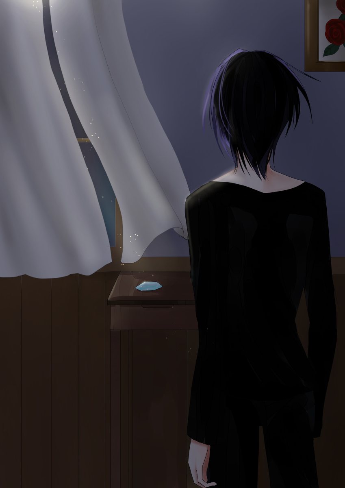

原文来源: [pixiv novel 15071418](https://www.pixiv.net/novel/show.php?id=15071418)
系列:  音楽†SFファンタジー『Xenophobia〜レクトシティ』HARMONIXシリーズ
顺序: 4

小鳥の名付けを終えてすぐ、エレノアナは電池が切れたように寝入ってしまった。イクスもその後すぐに眠りについたのだが、どこからか物音が聞こえた気がして夜中にふと目が覚めた。目だけを開けてじっと周囲の様子を窺っていると、少し離れたところから小さな話し声が聞こえてきた。

「……ハピネス。バカね。バカバカしい……幸せの青い鳥なんて……」

優しい声だった。
シキだろうか。なんとなくそんな気がして、イクスは人影に声をかける。

「……シキ？まだ寝てなかったのか？」

ベッドから起き上がり、そろりと声が聞こえる方へとイクスは足を進めた。寝入っているエレノアナとレイラを起こさないようにと、小さな声でシキを呼んだ。

「――イクス」

ひそめられたシキの声がイクスの名を呼び返す。真っ暗に明かりを落とした部屋では離れたところに居るシキの顔は見えない。だが、イクス、と呼んだシキの声色が何か特別な感情を帯びているように感じられて、イクスを落ち着かない気分にさせた。
レクトタワーから飛び出してきたときのシキの眼差しを何故だか思い出す。あの時、冷たく怜悧なアイスブルーの目が強く何かを訴えかけていた。まるで助けを求めているようだと咄嗟にイクスは感じたのだ。だからシキを追いかけて、助けようとした。

「……シキ？そこに居るのか？」

もう一度、シキに呼びかける。だがイクスの呼びかけに答えはない。
こっちの方に居るだろうかとあてずっぽうで手を伸ばす。暗闇の中で何かがするりと手をすり抜けた、気がした。冷たい風が手を撫で、はっとイクスは自分の指先に視線を落とした。
よく目を凝らせば、部屋の奥でカーテンの影が揺れている。窓が開いているようだ。そこから夜風が部屋に吹き込んでいた。カーテンの隙間から細くこぼれる月光が窓際のナイトテーブルをうっすらと照らしている。青く輝く光がナイトテーブルの上にある気がして、イクスは慎重に窓の方に近付く。拳大の、青く光る結晶が一つ、寂しげに転がっていた。シキのマテリアルだ。
マテリアルだけを置いて、幻のようにシキはイクスたちの前から姿を消した。

---

うぅん、とエレノアナは深刻そうな表情でマテリアルを見つめていた。夜のうちにホテルを出てしまったシキが残していったマテリアルを指でつついたり、横から眺めたりしながら、可愛らしい声で唸っている。

「………むぅ」

「いつも元気にエレノアナちゃん……ふわぁ～……」

まだ起きたばかりで眠たげなレイラが寝言のようなものを呟いて、目をこすりながらあくびをこぼす。シキが行方をくらませたことを先ほど伝えたのだが、驚いた様子はない。鋭いレイラのことだからどこかで予想していたのか、もしくは起きたばかりで頭が回っていないだけか。とりあえず支度をさせようとして、イクスはぼうっとしているレイラに声をかけた。

「レイラさん、とりあえず顔洗ってきてください。あと、そろそろ出発するから着替えてください」

「ふわぁ～い……ん～～」

レイラが当然のように着ていたパジャマの裾をたくしあげはじめた。イクスの動揺にも気付かず、そのまま着替えようと胸元まで裾をひっぱりあげたところで、ようやくイクスが慌ててレイラを止めにかかる。

「って、ここで脱がないでください！着替えは脱衣場の方で！ちょっ、レイラさ……っ！え、エレノアナ、助けてくれ！」

「はい！イクスさん、ちょっと待っててください！」

「エレノアナ！？」

マテリアルの観察に忙しいエレノアナはイクスの危機に気付いていない様子で、返事だけは元気に返した。いつもであればイクスと一緒に慌てふためきながらレイラの支度を手伝うのだが、今日に限っては気になることがあってそれどころではないらしい。おかげでイクスは、そこら中にポイポイと着ていた服を投げ捨てるレイラから必死に視線をそらす羽目になった。

---

「キュアを使ってみたらいいんじゃないかな」

さっきよりは目が覚めた様子でコーヒーを啜るレイラ。粉末のインスタントコーヒーだが、コーヒー好きのエレノアナが淹れただけあって美味しいらしい。ソファに腰かけたレイラが満足げに目を細めながら行儀悪く足をブラブラさせている。

「なんか気になってるんでしょ、エレノアナちゃん」

「はい……なんか、マテリアルだとは思うんですけど、違和感があって……」

「なるほど……キュアを使えば、マテリアルにされた人間が元に戻るはずだ。確かに、それで何かわかるかもしれませんね」

「本人に戻る気があったらね～」

キュアはイクスたちが持っている、マテリアルを人間に戻すための道具だ。キュアは鍵のような形をしていて、マテリアルと良く似た青い結晶でできている。鍵の先端にあたる部分をマテリアルに差し込むようにして使用するのだが、たまにキュアがうまく働いてくれない場合があった。マテリアルにされた人間自身が、元に戻ることを望んでいない場合だ。

「とりあえず、やってみるか。エレノアナ、キュアを使うからちょっと離れてくれ」

「はい……」

マテリアルに顔を近づけてじぃっと見ていたエレノアナが渋々と離れる。離れた後もまだ何かが気になっているようで、落ち着かない視線をマテリアルに浴びせ続けていた。
そんなエレノアナの様子に苦笑しながら、そっとキュアをマテリアルに差し込むイクス。鍵を開ける要領でキュアを捻る。キュアが発動すれば位相幾何学的な文様が宙に浮かび上がり、白い光を放ちながらマテリアルを元に人間に戻すのだが――。

「あれ……」

イクスは困惑してキュアとマテリアルを見比べた。キュアが光らない。浮かび上がるはずの位相幾何学的な文様はまったく現れず、何もない宙に突き付けられたキュアだけがイクスの手に握られていた。

「これは、どういうことだ……？」

「発動もしない……？イクスくん。本人が戻るつもりないときでも、毎回発動はしてたよね、一応？」

「はい、そうだったと思います」

「キュアが壊れた……わけでもなさそうね」

イクスからキュアを受け取り、光にかざしながらしげしげと検分するレイラ。しばらくあちこち見ていたが、小さなため息を吐いてすぐにイクスにキュアを返した。

「ダメ。今の不発の原因不明。……マテリアルに反応すらしてないみたいね」

「マテリアルの方の問題でしょうか？」

「わからないわ。エレノアナちゃんが感じてる違和感ってやつが何か関係しているのかもね」

結局、シキが置いていったマテリアルを解放することはできなかった。マテリアルに良く似た水晶なのかと思えば、マテリアルの最大の特徴である“音”は鳴る。とても小さな”音”なので、マテリアルに触れてじっと耳を澄ませていなければ聞こえない“音”だ。何か透明で鋭利なもの――割れたクリスタルがぶつかり合ったときの音に良く似ている。深い水底で砕けた水晶片がゆらりとゆらりと揺蕩いながら、破片同士がぶつかり合っているような、美しくも繊細な”音”だった。
その静かで寂しげな“音”はどこか、シキのアイスブルーの瞳に似ているとイクスは思った。

---

解放できないマテリアルの謎はひとまず置いて、イクスたちはカフェで朝ごはんを取っていた。香ばしい匂いを漂わせるトーストを目前にして、情報端末の画面をじっと見つめるイクス。

「……うーん」

やっぱりこの都市にＭＭバーガーはないらしい。一店舗でもないものかと情報端末で探していたイクスは諦めて操作画面を閉じた。

「イクスくん、調べ物は終わった？」

イクスに話しかけながら、食べ終わったクロワッサンの粉が指についていることに気付いたレイラが皿の上で軽く指を擦り合わせてから指先をナプキンでぬぐう。
イクスも情報端末をしまって、自分のトーストにようやく手を付けた。熱々のトーストの上でバターがほどよく溶けている。

「はい。昨日行けなかったバーガーショップを調べていて……MMはなかったんですけど、モステリアはありました」

「もすてりあ？イクスさん、それもハンバーガーのお店ですか？」

スプーンを片手に首を傾げるエレノアナ。自分の分のデニッシュを食べ終えて、デザートのヨーグルトに手を付けている。とろりとした金色のはちみつがプレーンヨーグルトの上でキラキラと飴のように輝いていた。

「ああ、有名なチェーン店の一つだよ。そっちも普通に美味しいと思う」

「イクスくんはちょっと不満そうだけどね～。まっ、今晩行ってみるだけ行ってみましょう！」

パン、と気持ちを切り替えるように手を打つレイラ。ところで、と言いながら表情を輝かせて自分の端末画面をイクスとエレノアナに見せつけた。

「イクスくんとエレノアナちゃんに朗報です！じゃじゃじゃじゃーん！」

レイラの端末画面にはメッセージのやり取り画面が表示されている。メジャーなメーカーの情報端末には必ずインストールされているような通常のチャットアプリとは少し見た目が違うように見えた。送信されたメッセージを囲う吹き出しが丸っこくてポップな雰囲気だ。二人のユーザーが会話している履歴のようだが、レイラ自身はその会話に含まれていない。片方のユーザー名が“Ｍｒ．Ｆ”になっているのを見て、あれ、とイクスは目を瞬かせた。

「それって、もしかして……」

「そ！さっきのフリマアプリにチャット機能があるみたいでさ。チャット履歴、抜いてきちゃった～」

「す、すごいですね……」

イクスは感嘆しながらも、嬉しそうに胸を張るレイラに気圧されて身を引いた。
一歩間違えればレクトシティじゃなくても犯罪だが、レイラの笑顔には一点の曇りもない。開発に夢中になっているときのレイラを思わせるはしゃぎように、イクスは微笑ましいような、困ったものを見るような気持ちになった。

「さ、さすがレイラさんです！ですね……？」

エレノアナも驚いた様子でレイラとレイラの端末画面を何度も見比べている。

「このタイプのアプリにしては珍しいんだけど……直接会ってマテリアルを渡す約束をしてるみたいなの」

「！……レイラさん、場所はわかりますか？」

「もっちろん！ねえ、しかも取引は今日の夕方みたい。どうする？」

目を細めて、挑発的に尋ねるレイラ。マテリアルの売買が行われるとなれば、イクスたちの答えは決まっていた。

「「もちろん行きます！」」

「よろしい！では、マテリアルの取引現場に潜入と行きましょう！」

声をそろえて首肯したイクスとエレノアナにレイラがマテリアルの取引現場を伝える。今いる場所からかなり離れた、レクトシティの端に近い場所だった。

---

１６時１５分。
マテリアルの取引が行われる十五分前にイクスたちは取引現場に着いた。イクスはとある違和感にすぐに気付く。

「あれ……誰もいない……？」

取引の少し前の時間だが、周囲に人の気配はない。物陰に隠れながらイクスたちはしばらくマテリアルの取引が始まるのを待っていたが、一向に人が来る気配がない。
取引の予定時間を二十分すぎた時点で、レイラが弱った様子で呟いた。

「ごめん、情報が間違ってたのかも……」

「そんなはずはないです！チャットではＦさんはここに来ると言っていました！」

「俺も同意見です。レイラさんがアプリから取り出したメッセージにははっきりと取引現場の名前が書いてありましたよね？」

「うーん。そうなのよ……メッセージでやりとりしていた取引現場は間違いなくここなのよね……。ニセのデータを抜かされたにしても、わざわざダミーのメッセージまで用意して騙そうとするとは思えないし………。……ううん、ダメね。今日は一回引き上げましょう」

怪訝そうにしながらも引き上げることを提案するレイラ。
イクスとエレノアナが頷いて、帰ろうとしたその時だった。
ふと、その言葉を聞いていたかのように黒塗りの車が一台、イクスたちの横を通り抜けていった。強い突風にイクスたち三人は慌てて腕で顔を庇う。
今の車はなんだったのかとイクスが視線で追いかけようとするが、黒塗りの車両はあっという間に走り去り、イクスたちの視界から消えていった。轟音でエンジンを吹かせながら車が走り抜けていった後は、静けさだけが残る。

「今のって……マテリアルの取引に来た車………とかでしょうか？」

エレノアナが少し不安げに呟く。

「さあね。取引はしてなかったから、違うかも。だけど……どうも嫌な感じね」

まるでこっちの動きを見張っていたかのようだ、とレイラは険しい表情で車が去っていた方角を睨みつけた。
