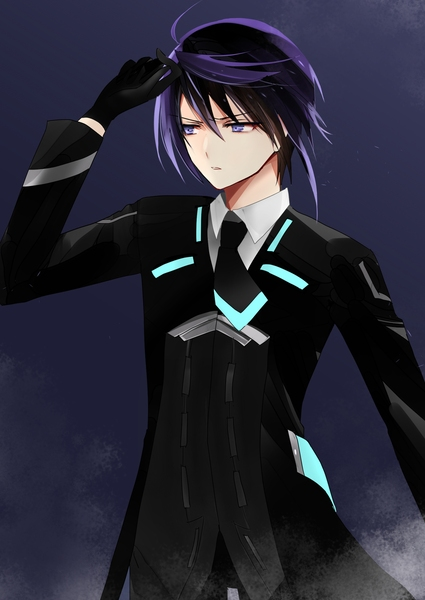
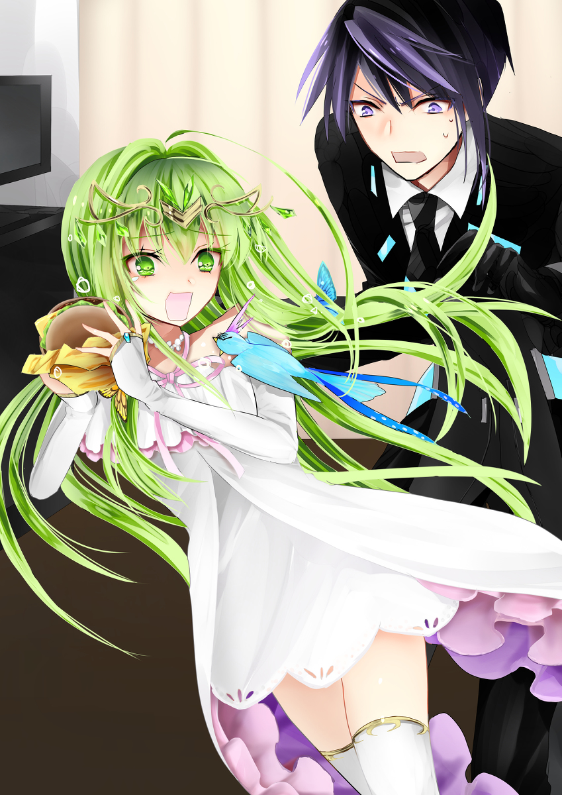

原文来源: [pixiv novel 15071432](https://www.pixiv.net/novel/show.php?id=15071432)
系列:  音楽†SFファンタジー『Xenophobia〜レクトシティ』HARMONIXシリーズ
顺序: 5

作戦会議のために一回ホテルに戻ることに決めたイクスたちは、その途中で晩御飯調達のためにハンバーガーショップ『モステリア』を訪れていた。
注文カウンターの前にできている十人弱の列の最後尾に迷わず並ぶイクスとレイラ。エレノアナはその後ろでぽかんとカウンターとその上に表示されているメニューの看板を見比べていたが、イクスが呼んでいることに気付いて慌てて同じ列に並ぶ。

「メニューから好きなものをこっちのカウンターで頼んで、あっちの列で受け取るんだ」

「特にこだわりないなら、セットで買っちゃえばいいんじゃないかな。ポテトもつけちゃおうよ」

「ふわぁ……」

目を白黒させているエレノアナに苦笑しつつ、イクスはメニュー表を店員からもらい、エレノアナに手渡す。エレノアナがファーストフード店に来るのは初めてらしい。真剣な表情でセットメニューを黙読しはじめた。

「Мサイズって、どれくらいの大きさなんでしょうか……？」

ハンバーガーや飲み物のサイズに種類があることに気付いたエレノアナが独り言のように呟く。どうだったかな、とイクスは記憶を思い返した。ジェノサイド社に勤めていたときは別チェーン店のＭＭバーガーにしか行かなかったため、記憶が遠い。

「モステリアはどれくらいだったかなぁ。小さめだった気はするけど……」

「まあまあ、余ったら食べてあげるから。イクスくんが」

「俺がですか！？」

「ふっふっふっ。間接キスを狙うなら、ちょっと残すのがオススメよ、エレノアナちゃん！」

「「かんせつき……っ！？……レイラさん！」」

エレノアナとイクスの抗議の声がぴたりとそろった。レイラを見てみると、にやりと悪戯な猫のような笑みを浮かべている。

「レイラさん……からかわないでくださいってば……。はぁ、まったく……まあ、でも残ったら俺が食べるから。好きな風に頼めばいいと思う」

「イクスさん……ありがとうございます！じゃあ、えっと……このチーズバーガーを頼んでみます！」

「私は何にしようかなぁ～。イクスくんのオススメは？」

「テリヤキですね」

「あはは、即答！じゃあ私もテリヤキにしようかな」

列の先頭に来たところでイクスが手早く三人分の注文を済ませる。はきはきとした笑顔で注文を受けた店員がレジに打ち込みながらイクスたちに尋ねかけた。

「店内でお過ごしですか？」

「「あ、テイクアウトで」」

「え？て、ていく……あうとで！」

突然の質問に固まったエレノアナが、慌ててイクスとレイラと同じように答える。本当にファーストフード店には行ったことがないんだな、とイクスは微笑ましい気持ちで口元を緩めた。

---

借りているホテルの一室に戻り、イクスはため息を吐きながらネクタイを緩めた。ソファに身体を投げ出すと、わずかな疲労感が四肢を巡る。マテリアルの情報が空振りだったことも疲労感の要因の一つだろう。
戻って早々にくつろぎ始めるイクスを普段であればレイラが見とがめて、楽しそうにツッコミを入れるのだが、今日は何も言ってこない。不思議に思ってレイラの方を見ると、情報端末画面で何かを読んでいる様子が目に映った。

「……なるほどねぇ」

「レイラさん？どうかしましたか？」

真剣なレイラの様子につい声をかけてしまう。

「いんや、ちょっとね。お問合せをしてたのよ」

呼びかけられたレイラは画面から目は外さないまま、イクスに答えた。

「レクトシティに入る前に見せた、掲示板のこと覚えてる？」

「入都市審査の対策が載っていた掲示板ですか？」

「そう、それ。そこの掲示板で聞いてみたの。“最近、行方不明になった人知りませんか？”って」

「“行方不明”……？」

「マテリアルよ。マテリアルが売られているってことは、どっかでその材料を調達してる、ってことでしょ？そこから何か掴めないかな、って聞きこんでみたんだけど……ビンゴだったみたい」

掲示板で集めた情報によると、不法入都市者としてレクトシティに連行された人たちが、そのまま行方をくらませているらしい。レクトシティでは不法入都市者は都市からの追放を言い渡される。追放された者とは連絡がまったく取れなくなるので、秘密裏に始末されているだの、人体実験の被験者にされているだの、物騒な噂が掲示板で流れていた。

「もし本当に不法入都市者をマテリアルに変えているなら、この噂もあながち間違いじゃないのよね……」

独り言のように呟いて考え込むレイラの背後からひょっこりとエレノアナが顔を覗かせる。自分の荷物の整理が終わったのだろう。先ほど買ったばかりのハンバーガーを片手に持ったまま、レイラの情報端末を覗き込んだ。そこに書いてあるレクトシティの後ろ暗い噂を読んで、不安げに顔を曇らせた。

「そう言えば……市長さんに逆らった人も不法入都市者にされてしまう、ってシキさんが言っていましたね……。そういう人たちもマテリアルにされているんでしょうか……？」

「さあね……噂だけじゃあなんとも。でも、連行されている人たちはレクトタワーに連れていかれているみたい。シキもそこから逃げてきたみたいだし。当たってみる価値はあるかもね。問題は、どう中に入るかだけど……」

レクトシティの中心部にそう簡単には侵入できない。もしそこでマテリアルを造っているなら尚更、イクスたちのようなよそ者の目には触れさせないだろう。
だが悩ましげに言いながらも、レイラの表情はあまり暗くなかった。

「何か、手段に心辺りが？」

イクスの予想通り、レイラははっきりと頷いた。口元にうっすらと笑みを浮かべながら、その目は真っ直ぐに掲示板を表示させている自分の情報端末を見つめている。

「ちょっとね。数日かかるかもだけど――」

「ピッ！ピピピピピッ！！」

レイラが何かを言おうとしたところで甲高い鳴き声が上がった。鳴き声が聞こえてきた方を見れば、籠の中で青い小鳥がバサバサと翼を羽ばたかせながら何かを必死に主張している。まだ傷は癒え切ってはいないが、昨日巻いた包帯は既に外れている。あまりにも布を巻かれることを嫌がるため、エレノアナが今朝すべて外してしまったのだ。
大きな傷も残っていない様子で、暴れながら鳴く元気もある。数日中にはもう飛び回れそうな気配があった。随分とパワフルな鳥だとイクスは密かに感心している。

「あ、ピィちゃん！ピィちゃんもお腹空いていますよね。今、ご飯あげますね！」

「「ピィちゃん？」」

聞き慣れない名前にイクスとレイラの声が思わずそろう。

「エレノアナちゃん……その子の名前、ハピネスじゃなかったっけ？」

「はい！ハピネスの、ピィちゃんです！」

小鳥の名前はさっそく省略されていた。呼びやすくはなったが、せっかくの本名を呼ぶ機会がないのはどうなのだろうか。なんとなく、シキが頬をやや膨らませて拗ねそうだとイクスは思った。無表情な彼女がそんな表情をするとは思えないが、何故かふくれっ面のシキがありありと想像できてしまって、イクスはこっそりと吹き出す。

「なるほど……エレノアナちゃんらしいわね！」

同じものを想像したわけではないだろうが、レイラも微笑ましそうに笑っていた。

「「「あっ！」」」

和やかな雰囲気に釣られたわけではないだろうが、ハピネスが急に両足で勢いよく地面を蹴った。そのまま小柄な身体を宙に舞わせる。
ハピネスが飛んだ。
もうそんなに回復したのかとイクスたちが驚く暇もなく、エレノアナの方にまっすぐ飛んでいくハピネス。そのくちばしはエレノアナのチーズバーガーに向けられている。
あちこちについた傷など感じさせないたくましさで、まっしぐらにバーガーのバンズの間に首を突っ込もうとしている。脇目もふらずに一直線にハンバーガーに向かう様子は、なんとなく数日前にシキを追いかけて飛び出していったエレノアナの走りっぷりに通じるものがあるとイクスは思った。

「えっ？え、え、ええええええええっ！？」

迫る小鳥に慌てるエレノアナ。両手に持ったバーガーを反射的に高く掲げることでハピネスの襲撃を回避する。しかし腹を空かせた小鳥はその程度では諦めなかった。小さな両足でエレノアナの胸元の服にしがみつきながら、ピィピィと甲高く鳴く。その目はもちろん、チーズバーガーにくぎ付けだ。

「だっ、ダメです！これは私のチーズバーガーです！」

「ピピィッ！」

「そ、そんなこと言ってもダメ！そもそも鳥にバーガーはダメです！たぶん！」

「ピピピ、ピピィ！ピィーーーーーッ！」

「ダメだってばぁ……っ！」

エレノアナは涙目になりながらもハピネスからバーガーを守る。まるで小鳥と会話しているようだが、イクスは微笑ましく思う前にはらはらしてしまう。確かに鳥にチーズバーガーを食べさせるのは良くなさそうだ。

「エレノアナ、ハピネスを籠に戻すからちょっとじっと……」

イクスは小鳥をエレノアナからはがそうと手を伸ばしかけたところで動きを止めた。小鳥のしがみついている場所が良くない。小鳥に避けられたらエレノアナの胸元をわしづかみにしかねなかった。

「…………」

「イクスく～ん？どさくさにまぎれてを狙うなら、今よ？」

「ね、狙いません」

「ええ～？ほんとにぃ～？」

「しない。しません。本当に、しません！あっ、ハピネス！そんな急に飛ぶと傷が、うわぁっ！？」

「ああああっ！イクスさんの頭の上にハピネスが……！高台から私のハンバーガーを狙って、イクスさんの頭の上にハピネスが……っ！」

「あ、こっちの方が捕まえやすいな」

急に羽を広げて、自分の頭の上に居座ったハピネスに一度は驚いたイクスだが、すぐに今の体勢の方が捕獲しやすいことに気付く。ひょいと頭の上に伸ばした左手で小鳥をつかみ取る。ピィピィと抗議の鳴き声を上げながら、イクスの手の中で暴れまわるハピネス。昨日まで傷で寝込んでいたとは思えないほどの威勢の良さだった。
そのままわたわたとハピネスのご飯の準備を始めたイクスとエレノアナは、レイラがいつからか黙り込んでいたことに気付いていなかった。赤いマニキュアを塗った指先が情報端末画面の上を滑り、素早く文字を入力していく。

「……まっ、ダメもとでやってみましょうか」

動かしていた指を止め、挑発的な笑みを浮かべるレイラ。ポン、と端末画面に表示されている送信ボタンを人差し指で軽やかに押下し、満足げに端末をしまい込んだ。

---

次の日もイクスたちはアプリから抜き出した情報を頼りにマテリアルの取引現場に向かった。今回の取引現場はレクトタワー前のカフェだ。偶然にも、イクスたちが初日に食事をした店でもある。
取引予定の時間よりも数時間早くにカフェに到着し、飲み物を頼んでそれらしき人物を探す。取引がいつ始まるのかと目を光らせつつも、時間を潰すために雑談していると、ふと思い出したようにイクスがエレノアナに尋ねた。

「そういえば、あのマテリアルは今もエレノアナが持ってるのか？」

「はい。ポケットにしまってあります」

大切そうにポケットを軽く押さえながら微笑むエレノアナ。シキが置いていったマテリアルがそこに入っているのだろう。
イクスと出会うきっかけとなったとある事件のせいか、それとも天性の才能なのか、エレノアナはマテリアルに関して非常に敏い。ときにはマテリアルの発明者の娘であるレイラよりも鋭く核心を突くことがある。何度試してもキュアはうまく使えないが、肌身離さず持っていれば何か分かるかもしれないとシキのマテリアルはエレノアナがずっと持ち歩いていた。

「相変わらず、違和感があるんだっけ？普通のマテリアルじゃないみたいな」

「ううん、言葉でうまく言えないんですけど……なんか……“中身が違う”ような……」

「うーん……素材が普通のマテリアルと違うのかしら？」

「そう、かもしれません」

「そっか。……そっかぁ。でも、もしそうだとしたら……」

レイラが表情を曇らせる。どうしたのかとイクスが眺めていると、その視線に気付いたレイラがはっと我に返り、小さく苦笑する。イクスにはその笑いがどこか無理をしているように見えた。

「レイラさん？どうかしましたか？」

「あー、ごめんごめん。イクスくんを心配させるつもりじゃなかったんだけど。ちょっと……」

言うべき言葉に迷うように口ごもるレイラ。いつでもはっきりとした物言いを好むレイラにしては珍しい。

「…………人間以外の素材でマテリアルを造れないか、っていう研究はとっくにやってたのよ。というより、色んな素材で試してみたら、結果的に人間が一番素材として適合した、って言うべきなのかな。その発見に至るまでは何年もの試行錯誤があった。だからね。もし今までとは違う素材でマテリアルを造る方法があるのなら……」

レイラが小さくため息を吐いた。少しだけ憂鬱そうに続きの言葉を口にする。

「その方法を考えたヤツは研究者として、開発者として、私やパパよりも一枚上手ってことよ」

「……レイラさんよりも？」

イクスは信じがたい気持ちで聞き返してしまう。イクスがかつて勤めていたジェノサイド社には優秀な研究員がそろっていた。その中でもレイラはとりわけ異才を放つ人物だった。レイラの父とは直接関わりはないが、そのレイラが認める人物であるのならば同じように優れた研究員だったのだろう。
その二人を超える奇才が居ると言われても、イクスには想像もつかなかった。

「そんなこと、ありえるんですか？」

「おやぁ～？イクスくんは随分と私のことを買いかぶってくれてるのね」

「買いかぶりじゃなくて、事実です。俺が知ってる誰よりも、レイラさんほど頼りになる研究者はいません」

「……うーん、ストレートに褒められると困っちゃうのよね！照れちゃいそうだから」

冗談めかして言いながらも、レイラの頬はほんのりと染まっている。はにかむような笑顔を浮かべるレイラからは先ほどの陰りは感じられなくて、イクスは安堵した。

「俺は事実しか言ってませんよ」

「はい！レイラさんは美人でかっこよくて、すっごい人です！！」

「え、エレノアナちゃんまで……！？」

「えへへ、レイラさんのすごいところもっとありますよ！頭も良くて、機械にも詳しくて、すっごいものたくさん発明していて、スタイルも抜群で、あ、あと……む、胸もおっきくて……」

エレノアナの言葉にうんうんと頷いていたイクスは、最後の一言にもつい大きく頷こうとして慌ててそこだけ聞こえなかったフリをした。
いつもだったら間違いなくからかわれているところだが、幸いにもレイラが珍しく動揺しているおかげで気付かれなかったようだった。

「ちょ、ちょっと、今そういう話じゃなくって！もし、このキュアの効かないマテリアルを造った人間が敵だったら困る、って言いたかったの！」

慌てて話を戻そうとするレイラにイクスとエレノアナは顔を見合わせる。イクスもエレノアナも、本当に事実しか言っていないのに、とレイラの反応に首を傾げながらも話を続けることにした。

「でも、人間以外でマテリアルを造ろう、って研究してた人なら良い人なんじゃあないですか？」

ピン、と指を立てて言うエレノアナ。素直なエレノアナらしい、まっすぐな意見だった。

「うーん……そうね。エレノアナちゃんの言うような、良い人であることを願うわ」

微笑ましそうに表情を緩めるレイラ。しかしその瞳に一瞬、不安の影がかかる。

「じゃなきゃ厄介な敵がいるってことになるもの」

俯き、険しげに手元を睨みつけるレイラの真剣な様子に、イクスとエレノアナは何も返すことができなかった。
その後三人は取引の時間までカフェで辺りの様子を窺っていたが、時間を過ぎてもマテリアルの取引が行われた気配はなかった。仕方なしにイクスたちが帰ろうとしたとき、示し合わせたように一台の車が三人の前を横切っていった。
突風に吹き付けられて、腕で顔を覆うイクス。咄嗟にエレノアナとレイラを背に庇いながら、薄目で道路を見ると黒い車が駆け抜けていくのが見えた。昨日見たものと同じ車のような気がして、必死に目を凝らす。だが車のナンバープレートに夕焼けの光が反射していて、うまく読み取ることができない。得体の知れない車はあっという間に三人の視界から消えてしまった。
マテリアルの取引を行っている者を追い詰めるつもりが、逆に追い立てられているような不安がイクスの中で渦巻いた。

　

---

再びホテルに戻ったイクスたちは頭を突き合わせて、ここ数日の出来事について話し合っていた。ソファのひじ掛けに頬杖をつきながらレイラが深いため息を吐き出した。

「こっちの行動が読まれている気がするのよ……。私たちが取引現場に向かったから、誰も現れなかったような……」

「あの黒い車のことですね」

イクスは取引現場に二回とも現れた黒塗りの車を思い浮かべた。まるでイクスたちが立ち去る瞬間を待っていて、わざと姿を見せつけにきたかのようだった。その行動に強い敵意を感じて、イクスの顔が強張る。

「……偶然では、ないですよね」

「だと思うわ。でも、フリマアプリの情報を抜いたことがバレていたとしても、ね？それをやったのが私たちだってどうやって分かったのかが……よくわからないのよねぇ。最初に取引現場に向かった時点で敵にマークされてるのがとっても嫌な感じ」

「ピィーー？」

レイラがうーんと悩んでいる様子を見て、小鳥のハピネスが首を傾げる。すっかり元気な様子でエレノアナの肩の上を占拠している。小鳥を右肩に乗せた当のエレノアナはぐったりと疲れた様子でうなだれている。昨日と同じように晩御飯をハピネスに奪われそうになり、部屋の中を逃げ回ったからだ。
イクスも止めようとしたのだが、結局エレノアナの晩御飯になる予定だったハンバーグは半分くらい小鳥の胃袋に収まってしまった。小さな体で良く食べる。
病み上がりとは思えない程活力に満ちているハピネスとそれに振り回されているエレノアナを見ていると、見えない敵の不気味さに張りつめていたイクスの気持ちも少し緩む。レイラもだらしなく頬杖をついたまま、のんびりと毛づくろいを始めたハピネスをどこか微笑ましそうに目で追っていた。

「――そういえば、あそこってシキと会ったところだったわね」

ふと思い出したようにレイラが呟いた。言われてみれば、とイクスも頷く。今日張り込みに行ったマテリアルの取引現場であるレクトタワー前でイクスたちは逃げてくるシキと出会った。
何かが琴線に引っかかったのか、だらけていた姿勢からガバッと身を起こすレイラ。忙しない手つきで情報端末を取り出し、何かを調べていく。

「売約済みが二件……明日はモステリアの裏の路地。明後日は……」

フリーマーケット上のマテリアルの情報を調べているらしい。聞こえてきた“モステリア”の名前に反応するイクス。まさかとは思うが、昨日訪れたモステリアのことだろうかとそっとレイラに近付いて情報端末画面を覗き込む。レイラは覗き込んでいるイクスにも見えやすいように端末画面を傾けた。
二件分のマテリアル売買契約についてのメッセージ履歴が画面を流れていく。取引場所の住所が目に入ってイクスは思わず目を大きく見開いた。

「明日と明後日の取引場所って両方、昨日行ったとこじゃないですか！」

明日の取引予定場所はやはりイクスたちが先日訪れたハンバーガーショップの近くだった。そして明後日行われる予定のマテリアル売買の取引会場はなんと、このホテルの正面にあるカフェだ。このホテルに部屋を取ってからずっと、イクスたちの朝ごはんはそこで済ませている。

「それだけじゃなくって、イクスくん気付いてる？」

端末画面がレクトシティのマップに切り替わる。レイラの指が三回マップに触れ、ピンのようなアイコンが触れた場所に現れた。マテリアルの取引が予定されていた三か所に目印を付けたようだ。
ピンアイコンをつけていくレイラの指の動きに、イクスもすぐに気が付く。

「段々、このホテルに近付いてきている……？」

最初に向かった取引現場はレクトシティの端に近いさびれた公園だった。二日目に向かった場所はレクトタワー前のカフェ。そしてその次の取引予定場所がイクスたちのホテルに一番近いモステリアまで迫り、その更に翌日にはホテルの正面まで取引現場が近付いてきている。

「今となってはこのアプリで行われている取引が本物かどうかも怪しいけど……だけど、これ――取引場所だけは偶然じゃない気がするわ」

「私たちがここに居ると分かっているぞ……ということでしょうか……？」

エレノアナもソファの背後から回ってレイラの端末を覗き込んでいる。その目は不安げに揺れていた。

「まっ、あからさまな挑発よね。“お前らの行動は筒抜けだー”なんて」

「だがいったい誰が……」

「今のところ一番怪しいのは、出品者の“Ｍｒ．Ｆ”ってヤツだけど……。うん？アプリ？アプリ……アプリ開発……そっか、アプリ開発か……」

「「レイラさん？」」

レイラは無言でフリーマーケットアプリのダウンロードページを開いた。その一番下まで急ぎ早にスクロールをし、開発元情報を表示させる。アプリ紹介文に比べると小さく控えめな文字で書かれた製作団体名は“エクセレクト・プロダクション”だった。レクトシティの市役所が運営しているらしい。
その下に、更に小さな文字でアプリを実際に開発した企業の名前が書かれている。そこに記載されている“ジェノサイド社”の名前にイクスも、そしてエレノアナも息を詰まらせた。まさかマテリアルを造り出した企業であるジェノサイド社がここで出てくるとは思っていなかった。

「レイラさん、これは一体……どういうことですか？」

「どうもこうもないわ。レクトシティ内部にジェノサイド社も入り込んでいたんでしょうね。シキが言っていた、レクトシティの後ろ暗い噂……あながち間違いじゃあないのかも」

「まさか、本当に不法入都市者をマテリアルに……？」

レクトシティの市役所が運営しているアプリの開発をジェノサイド社が請け負っている。そこに何かしらの強固な結びつきがあることはたやすく想像できた。
レクトシティから追放された不法入都市者はみな行方が分からなくなってしまっている。追放すると見せかけてマテリアルに変えられてしまっているのなら、彼らの行方が分からない理由も、そしてアプリで売り出されるマテリアルの在庫が切れる様子がない理由も納得できた。そしてそのマテリアルがレクトシティの公認の元で売りさばかれているのだとしたら、それは恐ろしいことだとイクスは思った。
世界の理想を集めたと言われるこのレクトシティでそのようなことがまかり通っているとはにわかには信じがたかった。
レイラとエレノアナも同じ考えに至ったのだろう。二人の表情は張りつめていて、顔色も悪い。
選ばれたモノだけがレクトシティに集められる。では、選ばれなかったモノはどうなるのか。捨てられていた小鳥、ハピネスを見て選ばれないモノがいることを理解していたはずなのに、今の今までまともに考えたことがなかったことに気付いてイクスは空恐ろしい気持ちになった。

「……イクスさん？大丈夫ですか？」

「………エレノアナ」

ためらいがちにイクスの肩に触れる手があった。そっとエレノアナがイクスの顔を心配そうに見上げている。誰かに心配されている。その事実があるだけでイクスの胸にじわりと温かさが広がった。

「大丈夫よ。レクトシティが裏で何をやってるにせよ、それが悪いことなら止めればいいだけの話でしょ。ね？」

揺れる炎のようなその強気なまなざしで鮮やかに笑うレイラ。過激な決意が今はこんなにも頼もしい。

「……そうですね。いいえ、そうでした。俺は、俺のできることをするだけ……」

「はい！イクスさんは――」

エレノアナが何かを言いかけて、急にやめてしまう。何度か口を開くのだが、どうにも照れが邪魔をしてうまく言えないようだった。

「――強くてかっこいい人ですから、何があってもきっと大丈夫です」

エレノアナがようやく口にしたのは本当に言いたかった言葉ではなかったのだろう。困ったようにはにかむエレノアナの様子からイクスはそんなことを思う。
だが奇跡のグリーンフラッシュを思わせる、美しい慈愛の瞳は真っ直ぐにイクスと向き合おうとしていた。

「ありがとう……」

何のための感謝の言葉かイクス自身にもまだ良く分からなかった。だが、今イクスの胸を包んでいる穏やかな気持ちは二人の仲間のおかげであることだけは分かっていた。
イクスの表情が和らいだことにレイラも優しく微笑む。だがすぐに、真剣な表情でアプリのダウンロードページに目を落とした。

「……“Ｆ”。まさかねぇ……？」

レイラの視線が滑るようにエレノアナのベッドの方へと移った。ベッド横のナイトテーブルにはシキの置いていったマテリアルがある。

「レイラさん、マテリアルが何か？」

「……うん、気になることがあって」

イクスに問いかけられてもなお、マテリアルを見つめ続けるレイラ。

「ねえ、イクスくん。エレノアナちゃん。ちょっと相談なんだけど――」

マテリアルを指さしながらとある提案をするレイラ。その提案の内容にイクスとエレノアナは驚きつつも、レイラが立てた作戦ならばと頷いた。
