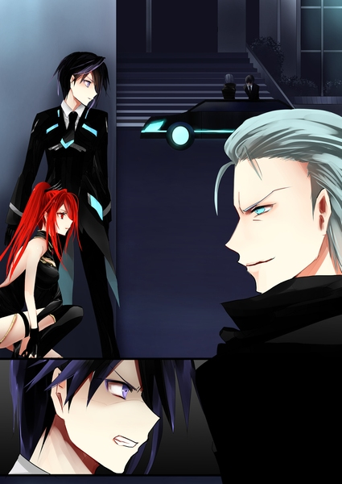
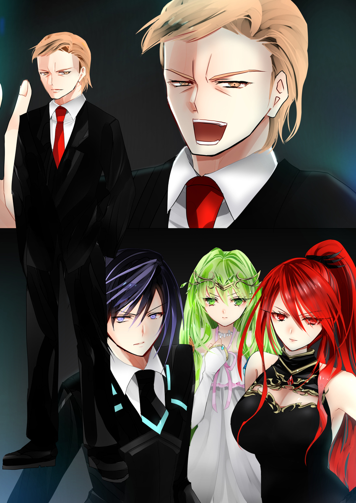

原文来源: [pixiv novel 15071440](https://www.pixiv.net/novel/show.php?id=15071440)
系列:  音楽†SFファンタジー『Xenophobia〜レクトシティ』HARMONIXシリーズ
顺序: 6

レイラの作戦を聞いてから二日後、イクスたちは宿泊しているホテルの2Fにあるロビーに集まっていた。待ち合わせ用に設置されたソファ席の、窓際に一番近いところに座り、それとなく窓の外の様子を確認している。ホテルの正面にあるカフェの様子がここからなら良く見渡せた。
今日の21時にあのカフェでマテリアルの取引が行われる予定だった。

「取引自体はね、たぶん行われているみたいなのよ。昨日も、一昨日も。その前も」

レイラの情報端末にはフリーマーケットアプリを表示されている。イクスたちが取引現場を押さえられなかった日にあった取引は売買成立済みになっていた。

「私たちが居る場所と時間を避けて取引しているんだと思う」

「じゃあ俺たちが来ないときは……」

「うん。約束通りの場所と時間で取引してるはず」

時計を見ると、あと十分で２１時になる。窓の外を見るイクスの視線が自然と険しいものになった。何も見逃すまいと睨みつけていると、ホテルの前の通りを黒塗りの車が通って行った。街灯に照らされて車体を鈍く光らながら、駐車場所を探しているようにゆっくりと速度を緩めて走っている。普通車にしてはスマートなそのフォルムを見て、イクスは確信を抱く。間違いなく、以前取引現場で走り去っていった車だ。
三人は頷き合い、そっと立ち上がる。

「ホテルの駐車場はこの裏でしたよね」

「うん。ここら辺にある駐車場はそこだけよ」

「エレノアナは――」

「私も行きます。そこにマテリアルがあるなら私にもできることがあるかもしれませんから」

敵に近づきすぎないように、とイクスとレイラが言うと力強く頷くエレノアナ。黒塗りの車が停まるであろう駐車場に三人は急ぎ足で向かっていった。

---

イクスたちの予想通り、ホテルの裏手の駐車場に真っ黒な車が一台停まっていた。夜の闇の中でも艶やかさを失わない、黒一色の高級車を見てイクスは誰かを思い出しかける。だがそれが誰であるかを思い出す前に、車の中から現れた人物にイクスは息を飲んで驚いた。
全身を黒色に包んだ壮年の男がゆったりとした動きで車から降りてきた。片手には無骨なアタッシュケースが握られている。あの中にマテリアルが収められているのだろう。アイスブルーの瞳は見る者をぞっとさせるような冷たさを宿している。だが不思議と以前会った時よりも強い感情の揺らぎがイクスには読み取れた。
昏い野望。ぐつぐつと煮えたぎるような激情。酷薄な笑みの下に隠した、その男らしからぬ激しい感情にイクスは警戒を高めた。

「フィランダー……！？」

「”Ｍｒ．Ｆ”――フィランダーがマテリアルをレクトシティで売りさばいていたのね……」

フィランダーはかつてジェノサイド社の幹部であった男だ。ジェノサイド社から離反したイクスを最も追い詰めた男であり、多くの人間を攫いマテリアルに変えていた悪党だった。ジェノサイド本社の倒壊に巻き込まれて行方不明になり、倒壊の責任を取る形で失脚したと聞いていたが、まさかこんなところで出会うとは。
何はともあれマテリアルの取引は止めなければならない。ホルスターから銃を引き抜くと、いつもより随分と軽く感じた。違和感のようなその感触に少しだけ眉間にシワを寄せながらもイクスは身構えて仲間二人に視線を向ける。エレノアナとレイラは決意を宿した目ではっきりと頷き返してきた。作戦準備完了だ。
エレノアナにはそのまま隠れているように指示し、レイラとともに物陰から飛び出す。
アタッシュケースを持って取引現場に向かおうとするフィランダーに、イクスは迷わずに銃口を突きつけた。

「動くな！」

「……なにっ！」

イクスたちに気付き、フィランダーが驚いた様子で足を止めた。

「バカな、お前たちはまだホテルに居るはずでは！」

「やっぱり、私たちの居場所を把握してたのね。――シキが置いていった、あのマテリアルで」

ずっと持ち歩いていたシキのマテリアルをイクスたちはホテルの部屋に置いてきていた。あのマテリアルから敵に行動が漏れているのかもしれないとレイラが言い始めたときは驚いたイクスだったが、フィランダーの反応を見るとレイラの予想が当たっていたらしい。シキのマテリアルを持っていないイクスたちの行動は読めていなかったようだ。

「さしずめ、あのマテリアルが発信機みたいになってたってところかしら。入都市者に渡されるカードの方が発信機になってるかも、って迷ってたんだけど。最初の取引場所がシキと会ったところだったのが気になってさ。読まれてたのは私たちがシキと合流した後の足取りだけみたいだったし。
それに、シキがわざわざあのマテリアルを私たちのもとに置いていったのもちょっと不自然だったしね……。だから、何かあるんだろうなって」

「そんなことで気付いたと言うのか……！」

「それだけじゃあこんな早くには気付かなかったわよ。あんたがバカみたいに”オマエラの居場所は筒抜けだ”なんて主張しなけりゃね」

レイラは悠然と銃を取り出し、イクスと同じように銃口をフィランダーに突きつけた。真っ赤な口紅を塗った唇を笑みの形に吊り上げると、艶っぽい視線をフィランダーに向ける。美しい笑みなのに、隣で見ているイクスですらぞくりとするような凄みのある表情だった。

「まさかとは思ったけど、生きてたなんて。変わらないのね、頭は悪くないくせに人を見下すことに夢中になりすぎるトコ。直した方が良いって私、言ってあげたのに。変わらないどころか、悪化してるんじゃあない？」

レイラの皮肉げな口ぶりが癇に障ったように顔をしかめるフィランダー。しかし、レイラのその態度に少し冷静さを取り戻したようだった。身構えていた姿勢を解き、やれやれと大仰に肩をすくめる。

「……ふっ。なるほど、あのマテリアルの細工に気付いたか。流石だな。てっきりマテリアルの情報を追うのを諦めてしまったのかと思ったよ」

褒めるような口ぶりで笑うフィランダー。だがその口調はまるで聞く者をあざ笑っているようで、人の反感を煽る。

「そう、シキがお前たちに渡したマテリアルには発信機の仕組みがついていたのさ。イクス君、君と君のお仲間が相変わらずのお人よしで助かったよ。あのシキの大根芝居ではどうしたものかと頭を抱えていたのだが。シキを怪しむこともせずに、自分たちの足取りがそれで筒抜けになっていることもつゆ知らず、後生大事にあのマテリアルをずっと持っていてくれたわけだ！」

シキはフィランダーの仲間だったらしい。覚悟はしていたものの、改めてその事実を突きつけられるとやるせなさを感じるイクス。脳裏をかすめるのはエレノアナと一緒に小鳥の名前を考えているシキだ。戸惑いながらも、シキはイクスたちを受け入れてくれているように見えた。それもすべて嘘だったらと思うと、ちくりとイクスの胸を刺すものがあった。

「何故、俺たちの宿泊地近くに取引現場を少しずつ近づけていった？」

胸の痛みを振り切り、今は目の前のことに集中しなければとフィランダーを睨みつける。

「はは！お前たちのためさ！こうでもしなければ……いや。間抜けなお前たちでは、ここまでしても私の存在に気付くかどうか不安だったのだがね。いやぁ、思っていたよりもお前たちの頭も回るようだ。おっと。お前たちの、というよりはレイラ君の……と言うべきかな？」

「お褒めに預かり光栄ね。でも私の大切な仲間たちを見くびってもらっちゃあ困るわ」

「仲間”たち”か……そう言えば、あの少女もお前たちと行動していたな。ちょうどいい。あの極上のマテリアル素材を逃してしまって惜しいと思っていたのだよ。イクス君、今度は君の目の前で彼女をマテリアルにしてあげようではないか！」

「そんなこと、二度とさせると思うなよ……！」

二人に銃口を向けられながらもフィランダーは怯む様子を見せない。余裕をかもしだすフィランダーの態度にイクスは怒りを覚えた。人間から造り出したマテリアルを売りさばいていることに対して、相変わらず何も感じていないらしい。平然と他人を蹴落とし、食い物にするその性はジェノサイド社が倒壊した後も変わっていないようだった。

「さて。三十六計逃げるに如かず――だ。取引はあるが、仕方がない。ここは退散させてもらうとしよう」

「逃げるつもりか、フィランダー！」

「やれやれ、相変わらず君のやり方は強引だな、イクス君。ここで私を倒せばすべてが解決するとでも？」

「そうね。ここであんたをとっちめるより、泳がせておいた方が正解よね。レクトシティが都市ぐるみでこんなことやってるなら、さ」

イクスが答える前にレイラが淡々とフィランダーの言葉を肯定する。ここでフィランダーを止めたところで、レクトシティで行われているマテリアルの取引を止めることはできない。この都市のどこかにあるマテリアル製造機を停止させられなければ、また別の人間がマテリアルの売買を行うだけのことだ。

「利口だな、レイラ君。君の父親も君と同じくらい、利口であったらな……」

「――おまえっ！」

レイラの父は他でもないフィランダーの手で始末されている。だと言うのに、薄ら笑みを浮かべて、他人事のように悔やむかのような態度を見せるフィランダーにイクスの頭は瞬時にのぼせ上った。
食ってかかろうとしたイクスをそっとレイラが制す。はっとしてそちらを見ると、微笑みを浮かべたレイラがイクスを見ていた。

「ありがとう、イクスくん。私は大丈夫。ムカつくけど、ここは抑えて。ね？さっき言ったこと、忘れちゃった？」

レイラの言う”さっき”とは作戦の最終確認をしていたときの話だろう。マテリアルの取引を行っている”Ｍｒ．Ｆ”は誰であれ、一度逃がさなければならないとイクスは前持ってレイラに告げられていた。自分の持っている銃の軽さの理由をイクスは思い出す。

「……レイラさん。わかりました。レイラさんが言うなら……」

本当はここでフィランダーを倒したい。仲間を侮辱されて黙っているようなことはしたくなかった。だが、今だけはこらえなければと歯を食いしばるイクス。

「ははは！それでは失礼するよ！身分も権力もない一般人三人がレクトシティに立ち向かえるのか楽しみしているぞ！」

銃口は下ろさないまま、眼光鋭く睨みつけているイクスをフィランダーはあざ笑った。そのままイクスたちに背を向けて、車の中に乗り込む。
車が発進したのを見計らって、銃を構え直すイクス。フロントミラー越しにイクスを見てにやりと笑うフィランダーが見える。侮蔑を浮かべるアイスブルーの瞳を睨みつけながら、イクスは銃口を少しだけ下に下げた。
そのまま引き金を引く。
音もなく弾が撃ちだされた。手に返る反動はほとんどなく、パシュッ、と空気を緩く割っていくような音を立てて飛んでいく小さな鉛玉。通常の銃弾ほどの速度もなく、人に万が一当たったとしても殺傷力はない。ただし、弾の表面は粘着質で接地面には良く張り付く。
イクスの狙いから寸分たがわず、発射された金属片が黒塗りの車のリアバンパーにくっついた。

「完璧ね！さすがイクスくん！」

発射物が車とともに遠ざかっていくのを見て、レイラが満面の笑みでイクスの肩をバシッと叩いた。

「……まあ、これくらいは」

そんなつもりはなかったのだが、何故かイクスは拗ねた口調で返してしまった。

「拗ねない、拗ねない！またすぐにフィランダーとは戦うことになるんだから」

「拗ねてません。拗ねてませんけど……」

「イクスさん！レイラさん！大丈夫でしたか！？」

こっそりとやりとりを聞いていたエレノアナがそっと物陰から出てくる。その表情は暗い。エレノアナの不安を吹き飛ばすように、レイラはからりと明るい笑みを浮かべた。

「大丈夫よ。さあ、ちょっと待ったらフィランダーを追いましょう」

「えっ？でも、今フィランダーを捕まえても意味がないんじゃあ……？」

「だから、レクトシティの中枢まで案内してもらうのよ。フィランダー自身にね」

「エレノアナ。今、俺がヤツの車に打ち込んだのは銃弾じゃなくて、発信機だ」

自分の情報端末を取り出し、掲げるイクス。画面上で点滅しているビーコンがレクトシティの地図上を走行している。フィランダーの居場所が表示されているのだ。

「えっ！？発信機？じゃあフィランダーの向かった場所がわかる、ってことですか？」

「言ったでしょ、“泳がせる”って。まあ、行先は予想がついてるけどね……」

ふとレイラの表情から笑みが消える。そのまま無言で顔を上げて空を睨むレイラ。レイラの視線の先にあるものが何かわかったイクスも同じようにそれを睨みつけた。
黒い夜空にそびえ立つ、禍々しい塔のようなレクトタワーがそこにある。
今のレクトシティを作り上げたレクト市長がそこに居るはずだった。

---

フィランダーにつけた発信機は、イクスたちの予想通りレクトタワー前で動きを止めた。発信機の反応を追ってきたイクスたちはそびえたつレクトタワーを見上げる。街のネオンの光に下から照らしだされながら、黒い無骨なビルが自らも青いネオンライトを放って夜空を明るく照らしている。
レクトタワーに内設されている市役所はとっくに閉館時間になっていて、ビル内部はひっそりとしている。当然、入口は施錠されているようだった。どうしたものかとイクスとエレノアナは顔を見合わせる。

「裏に回りましょう」

レイラがタワーの裏手を指さす。その手には情報端末が握られていて、何かのホームページが開いているのが見えた。イクスが不思議そうに見ていることに気付き、レイラは端末を掲げてみせた。

「裏レクトシティ板よ。この都市の色んな裏情報を書きこんでるとこ。そこの管理人さんとちょっとやりとりしててさ」

レクトタワーの裏に回ると、レイラは迷わずに裏口のドアを引っ張った。抵抗もなく開くドア。鍵がかかっていなかったらしい。

「わぁ！どうやってやったんですか？」

「ふふーん！私にかかればこんなもんよ！……って言いたいところなんだけどねぇ。開けてもらったのよね」

誰に開けてもらったのか、とイクスは聞こうとしてレクトタワーの中に誰かが居ることに気付く。明かりのないビル内で、カチッとなにかのスイッチが入れられる音がした。まばゆい光が灯り、レクトタワーの床を照らし出す。
水色の制服を着た女性が一人、懐中電灯を片手にイクスたちを出迎えていた。侵入者が現れたことに驚いた様子もなく、イクスたちが近寄ってくるまでじっと待っていた。

「こんばんは、管理人さん」

レイラに呼びかけられて、女性はただ肩をすくめた。

「貴方がたのお名前は聞きません。レクトシティの闇と戦う覚悟がある者たちである。ただそれだけ分かっていれば十分です」

彼女がレクトシティの裏情報を秘密裏に流していた掲示板サイトの管理人らしい。
しかし、と彼女の水色の制服を凝視するイクス。彼女が身に着けているのはレクトシティの入場ゲートに居た担当官と同じ制服だ。

「ここの受付嬢なんです、私」

イクスの疑問を読み取ったようにうっすらと女性は微笑む。

「あのサイトの管理人さんってレクトシティの裏事情に詳しいみたいだったからさ。もしかしたら、内部の人間かなって思ってたのよね。それでとりあえずコンタクト取ってみたってわけ」

「さあ、あまり時間もないので向かいましょう。監視カメラもそう長くはごまかしておけませんし。目的は”音”の結晶の製造室で間違いありませんね？」

イクスたちが頷くと、女性はくるりと背を向けて非常階段の方へと歩き始めた。

---

懐中電灯の明かりだけを頼りに、暗い非常階段を上っていくイクスたち。受付嬢は先導しながら、彼女の知るマテリアルについての情報を語ってくれた。

「私がレクトタワーに着任したときにはもう、“音”の結晶――貴方たちの言うマテリアルの製造は行われていました。常習化していた、と言った方がいいかもしれませんね」

イクスたちが向かっているのはレクトタワーの上層階だ。不法入都市者の多くはそこに連れていかれて、そのまま戻って来ないらしい。レクトタワーに勤めている者は何かがおかしいと噂しながらも、ほとんどが見て見ぬフリをしている。連れていかれた不法入都市者がどこに行ったのか調べようとした者は全員、いつの間にか退職してしまい、行方知れずになってしまうからだ。
レクト市長の意見に逆らった者も同じように、いつの間にか消えてしまっていたり、突然違法行為が発覚して不法入都市者扱いされてしまっている。受付嬢がレクトタワーで働き始めた頃には市長に意見を言える者はすっかり誰も居なくなってしまっていた。メディアもいつしか批判をすることを止め、レクト市長を称える者だけがレクトシティに残った。

「……何かがおかしい気はみんなしてるんです。でも、誰も何も言わないから、こんなものかなってなんとなく納得してしまって。別にレクト市長のやり方がすごい悪いってわけでもないですからね。このままでも良いんじゃないかって……このまま、見えてないことには目をつむっていれば、それでそこそこ幸せなで平穏な生活が続いていくんじゃないかって思ってる。だって、みんなで見て見ぬフリをしているものが暴かれてしまったら、今の自分たちの幸せが変わってしまうかもしれないから……」

そのまましばらく受付嬢は黙り込んでしまった。

「――ここですね」

随分と長い間階段を上っていた気がするが、あるところでようやく受付嬢が足を止めた。ドアの横についているセンサーにカードをかざすと、ドアの施錠が外れる音がした。鉄の扉がゆっくりと開かれ、明かりの灯った廊下に出る。

「この廊下をまっすぐ進んで、突き当りの大部屋です。あそこでマテリアルが作られています」

「受付の人でもここまでは入れるんだ？」

「いいえ、入れませんよ？」

レイラに言葉にくすりと笑って、今しがたセンサーにかざしたカードを受付嬢は差し出した。目の前に差し出され、思わず受け取ってしまうイクス。

「これは？」

「元・上級役員のセキュリティカードです。それがあれば目的の部屋にも入れると思います。ああ、ええっと。レクト市長の政策に反対して、不法入都市者にされてしまった人……って言えばわかります？偶然、くすねる機会があったんで、こっそり持ってたんです」

「なるほど……。でも、どうして居なくなった人のカードがまだ使えるんだ？」

「行方不明になった職員のデータ、ちゃんと消していないんですよねぇ。どうせ二度と使えないから、わざわざ消すのも非効率的だって。人為的なセキュリティ・ホールですよ」

行方不明になった者のカードはどうやら無効化していないようだった。居なくなった者たちが二度と戻ることはないと確信して、レクト市長はマテリアルを造り続けていると言うことだ。その事実に嫌なものを覚えて眉を顰めるイクス。

「……私にできるのはここまでです」

セキュリティカードを受け取ったイクスたちが廊下に足を踏み出すのを見つめながら、受付嬢は非常階段の中にとどまった。

「この先の部屋で何が行われているのか何となく分かっていても――私は動くことができませんでした。直接見ていないから、もしかしたら気のせいかもしれないと目を背けながら」

受付嬢は上ってきた非常階段の方へ視線を落とす。さっき歩いてきた道のはずなのに、明かりのない階段はぐるぐると螺旋を描きながら真っ暗闇の中、どこか暗くて冷たい場所に向かっているように見える。

「この都市は素敵な街です。便利なものがあふれてて、みんなが優しくて。多少どうかと思うかとはあるけれど、他のところに比べればとても生きやすい。”選ばれた”側の私にとっては、ね。そんな私だから、今いるところから、”選ばれない”側に落ちていくのは怖い。だから、これ以上は貴方たちに手を貸せないし、詳しいことも聞きません」

「いや、ありがとう。ここまででも助かったよ」

ここまで案内してきてくれたことに心からの感謝をイクスは覚えた。受付嬢がとつとつとこぼした言葉は、わずかな痛みを伴いながらイクスの胸に染み込んだ。少しだけ懐かしい、胸にちくちくと刺さる小さな痛み。エレノアナとレイラの二人と旅に出てからは忘れかけていた何かだ。
このままマテリアルを製造している部屋に向かおうとして、ふとエレノアナが足を止めて受付嬢の方に振り返った。

「あれ？でも、こうして私たちを入れてくれてるだけでも危険なんじゃ……」

エレノアナの言葉でレイラもまたはっと気付いたように改めて受付嬢に向き直る。

「掲示板の運営自体もかなり危険よね。どうやってレクトシティの目をかいくぐってるかは知らないけど、バレたらヤバいんじゃない？」

「そうでもないですよ。監視の目はまあまあザルなんで。思ってる程、ヤバくはないです。まあ、管理人ってバレたら厄介ですけどね」

「本当に見て見ぬフリをするだけなら、何もしなければ良かったんじゃあないかしら。でも管理人さんはそうしなかった。」

「そうですねぇ」

受付嬢はしばらく考え込んだ。

「私、正義ってくだらないと思うんですよ。正しいことをしたって報われるわけじゃない。でも……」

首をかしげて、真剣に考えながらも言葉をぽつぽつとこぼしていく。正義なんてくだらない。そんな突き放したような言い方にすっかり慣れたような、なんともない口調で言い放ってから、目を閉じて視線を足元に落とす。

「こういうのって報われるためにやるわけじゃないですからね。黙ってられなかったから……ある日、気付いたらカッとなってあんな掲示板作っちゃったんです。作っちゃったからには、そう簡単にはなかったことにできないですよね」

顔をあげた受付嬢は明るい笑顔を浮かべていた。
レクトシティの水色の制服を着た者たちは誰もが綺麗な笑顔でイクスたちを出迎えてくれていたが、思い返してみれば、どれも同じような表情をしていた。
それが決して悪いことだとはイクスは思わない。だが、今、イクスたちを見送る受付嬢の顔に浮かんでいるような、生き生きとした笑顔の方が鮮やかで、魅力的に映る。
心強い味方に背中を押されている思いでイクスは廊下を駆け抜けて最奥のドアへ向かった。

---

受付嬢に教えられた部屋の入口にはセキュリティカードのスキャナが設置されていた。イクス、レイラ、エレノアナの三人は顔を見合わせ、力強く頷く。セキュリティカードを持っていたイクスがそっとスキャナにカードをかざした。
ピッ、と短い電子音が鳴り、鍵が開錠される音が響いた。

「やりました！開きましたよ、イクスさん、レイラさん！」

「ああ。エレノアナは何があっても俺かレイラさんの後ろから出ないでくれ」

「はい！」

「さあ、行きましょう。――止めに行くわよ」

誰が、どんな理由でマテリアルを造っているとしても、必ず止める。三人は覚悟を決めて部屋のドアを押し開けた。
ドアを開けた途端、ブォォンと低い機械の駆動音が聞こえてきた。マテリアルを思わせる青白い光が部屋中のあちこちからこぼれている。
壁や天井までも覆うように部屋全体を得体の知れない装置が埋め尽くしている。どの部品がどのように動くのかイクスにはまったく分からない。だが、なんの機械であるかは知っている。マテリアルを製造するためのものだ。
やはり、と言う気持ちでイクスは引き抜いていた愛用の銃を構え直した。
部屋の中央に男が一人立っている。ちょうどマテリアルを製造していたところだったのだろう。人間が一人入れるだけのスペースに青く澄んだマテリアルが一つ転がっているのを男が拾い上げるところだった。
マテリアルを拾った男はゆっくりとイクスたちの方に振り返った。
てっきり、ここではフィランダーが待ち構えているのだとイクスは思っていた。だが、予想と違って、そこに立っていたのは金髪の男だった。レクトシティの創立者であり、統治者、レクト市長だ。

「君たちは……なるほど。フィランダーが尻尾を掴まれたか。彼は優秀だが、奢りすぎるのが良くないな。人の話をあまり聞かないのも欠点だ」

レクト市長がマテリアル片手にイクスたちに向き直る。驚く様子も、怯えた様子もなく、まっすぐにイクスたちを見据える強い眼差しはポスターに描かれていたレクト市長そのものだ。

「イクス、エレノアナ、レイラ。かつてジェノサイド社を滅ぼしたテロリスト三人とお見受けするが……合っているね？」

「あら、フィランダーから話はすっかり聞いているのね」

「無論だ。あのフィランダーを追い詰めた者たちのことは気になっていたからね」

「なら、マテリアルの材料のことももちろん承知で、貴方はここに居るのよね。レクト市長様？」

レイラが唇を吊り上げて笑う。だがその瞳には激しい怒りが燃えていた。レイラの苛烈な視線になじられても、レクト市長は平然と頷き返した。

「勿論だ、赤い髪のレディ。自分の行いの意味も分からない無能者と私を一緒にしないでもらいたい。私が誰であるか知っているだろう。この私こそがレクトシティの創設者、この都市を一から築き上げた張本人なのだから」

「マテリアルの材料は生きた人間だ！それを、当然のようにマテリアルに変えて、何も知らない住民相手にうりさばいて……！間違っているとは少しも思わないのか！」

「間違っている？」

イクスの非難の言葉にレクト市長は不愉快げに眉を吊り上げた。

「私は間違っていない。間違っていないことの証明こそが、私のレクトシティだ。少年、君はこの都市が、この都市に私とともに住む人々が、”間違っている”とでも言いたいのかね？君一人が、レクトシティの正否を決めようとでも言うのかね。私が築き上げた二十年を！何をもって否定すると言うのか！」

「それは……」

「これは、選別なのだよ」

怯んだイクスの様子に満足げに頷くレクト市長。激高しかけた気持ちを静め、落ち着いた様子で、出来の悪い生徒に言い聞かせるようにレクト市長は語った。

「腐ったりんご一つで樽一つ、腐ったみかん一つで箱一つ。たった一つの個体が、集合体のすべてを腐らせる。そうなる前に腐ったみかんは取り除かれなければならない。腐敗の元がレクトシティを腐らせる前に、私がこの手で取り除いたまでだ」

「彼らは人間だ！取り除く、なんて簡単に言っていいものじゃない…！」

「同じことだよ、少年。統治者は都市を腐らせないために何を取り除くか、常に選び続けなければならない。だからこそ良いものと悪いものを見分けられる特別な人間だけが統治者として成功するのだ。私のように、正しいものを鋭く見抜く目を持っている人間だけがね。君のように衝動のままに、気に食わないことを間違っていると叫ぶだけでは……子どもの癇癪でしかないな」

レクト市長は自らの思想を心から信じているように、堂々と言い放つ。何も分かっていない子どもに仕方なく教えて聞かせるような調子で、イクスの言葉を一蹴した。

「見なさい、このレクトシティを。美しいだろう？完璧だろう！この美しい世界を保つために、不要な物を切り捨てることは過ちではない。何が美しく、何が完璧であり、何が正しいかはこの私が最も良く知っているのだから。少年、君が気にするべきことはこの世界に己が相応しいか。ただ、それだけだ」

それはおかしい。そんなことは間違っている。
そう思うのに、イクスはうまく言い返すことができなかった。何が間違っているのか言葉で言い表すことができなければ、レクト市長の心に届くことはないだろう。分かっているのに、想いを具体的な言葉にしようとすればするほど、答えが手からほどけていくようだ。
そんなイクスを支えるように、そっとエレノアナが横に並び立ってイクスの肩に触れた。労わるような優しい手つきだ。でもエレノアナの指先は少しだけ震えていた。

「でも、居なくなった人を案じている人は居ます。行方を気にしている人は居ます。何かがおかしいと……間違ったことはしていないのに、マテリアルにされてしまう人たちがいることをおかしいと感じている人はいます！」

震えていたエレノアナの指がイクスの肩をそっと掴む。エレノアナのまっすぐな言葉にもらった勇気を少しでも返せるように、イクスは自分の肩を掴んでいるエレノアナの手に己の手を重ねた。
ちらっとイクスを見上げたエレノアナが小さく微笑む。そして覚悟を決めたようにキッ、とレクト市長を睨みつけた。

「貴方とレクトシティの全部が間違っているとは思わないです。でも、これはおかしい。他のすべてが正しかったとしても、今ここでマテリアルにされている人が居るのは間違っています！私がそう思うことを、貴方に間違っていると言われても……それでも、私が今“これは間違っている”と思う気持ちまでを消すことはできません！納得がいかないもの！」

レクト市長はしばらく答えなかった。何か忌々しいものを見るような目でエレノアナを睨みつけている。

「ふん。どうとでも言えばいい」

やがて、レクト市長は苦々しげにそう言った。

「君たちがどう思うと、結果がすべてだ。秩序を性急に壊そうとするものはヒーローではなく、ただのテロリストだよ。君たちこそがレクトシティによっては害悪であり、不要物だ。私の言葉に間違いはないとほどなく証明されるだろう」

レクト市長は素早く身を翻し、すぐ背後にあったドアを押し開けた。そこから奥の部屋に繋がっているらしい。すばやくドアを閉めたレクト市長が部屋の中に消えていく。

「結果こそがすべてなのだから！」

「待て！」

イクスの制止もむなしく、ドアの向こうにレクト市長の姿が消えた。三人は慌ててその後を追って、奥の部屋へと飛び込んだ。
