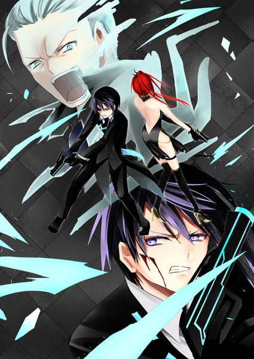
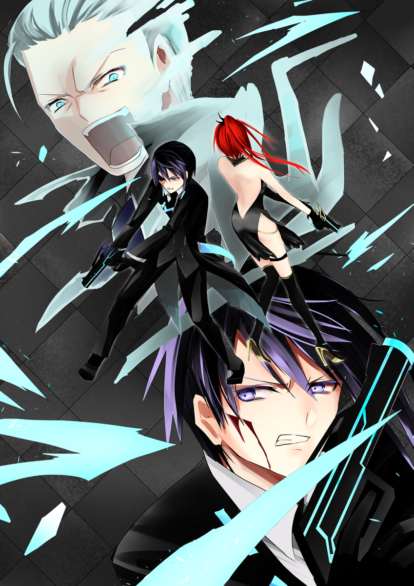
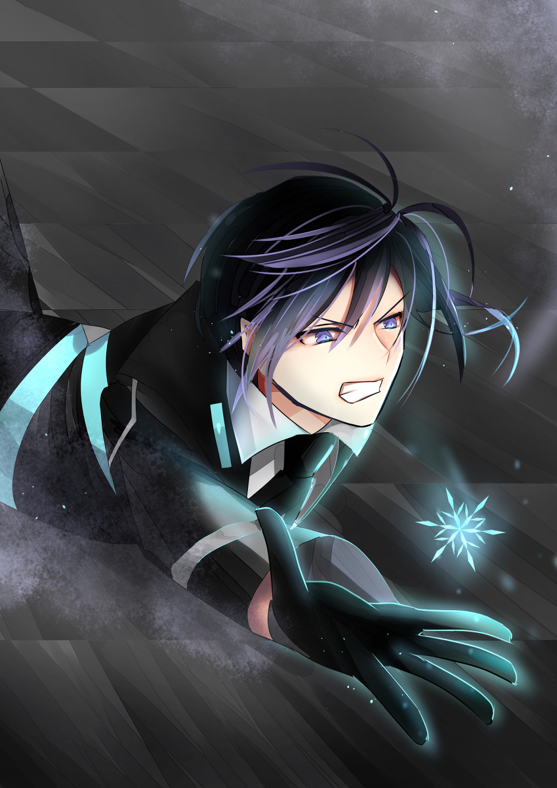

原文来源: [pixiv novel 15071459](https://www.pixiv.net/novel/show.php?id=15071459)
系列:  音楽†SFファンタジー『Xenophobia〜レクトシティ』HARMONIXシリーズ
顺序: 7

市長を追って入った部屋は暗闇に包まれていた。レイラが壁を探り、電気のスイッチを点ける。
ホールのような、がらんとした部屋が広がっている。イクスたちは身構えながら辺りを見回すが、市長の姿は見えない。部屋の奥の方に鉄の扉があり、その中に逃げ込んだようだった。
夜風が部屋の中に吹き込んでいる。大きなガラス戸が開いていて、そこから小さなテラスに出れるようだ。レクトタワー上層階にあるテラスからは日が落ちても活気のあるレクトシティが一望できる。
誰かがテラスに居たのだろうか。まるで先ほどまで人が居たかのような、半開きのガラス戸にイクスが疑念の視線を向けたときだった。

「……え？」

最初にその“音”に気付いたのはエレノアナだった。驚いたように振り返り、今さっき入ってきたばっかりのドアを見るエレノアナ。その瞬間、カチャリと鍵のしまる音がした。

「なっ！？まさか、閉じ込められた……？」

イクスがドアを開けようとするが、ガチャガチャと音が鳴るだけで開かない。戻る道はなく、進むしかないようだった。

「誰もいなかったはずなのに……あれ。これは……“音”……？」

エレノアナの呟きにイクスも耳を澄ませると確かにマテリアルの“音”が聞こえてきた。細かく砕いた水晶がぶつかり合うような、甲高く、澄んだ“音”。美しく、もの悲しく、どこか危うげな緊迫感を孕んだ、鈴の音を思わせるその“音”にイクスは何故かとある人物を頭に浮かべていた。

「……シキさん？」

イクスの想像を肯定するようにエレノアナが呟いた、その時だった。

「ほう、マテリアルの素材を言い当てるか。つくづく君が人間のままでいるのがとても残念だよ。マテリアルにしたらどんな素晴らしいものができあがるか……」

イクスたちしか居ないはずの部屋で、いやらしく笑う男の声が響き渡った。フィランダーだ。いつからイクスたちの侵入に気付いていたのかはわからないが、この部屋でイクスたちを待ち構えていたようだった。
確かにフィランダーが居るような気配をイクスは感じていた。だが肝心の姿が見えない。

「フィランダー！俺の目の前でエレノアナに手を出させるものか！」

「目の前で、か。ははは、では見えていなければどうかな？」

パァン、と火薬が爆ぜる音が聞こえた。反射的にエレノアナを抱きすくめてイクスはその場にしゃがみ込んだ。
エレノアナの肩を銃弾がかすめる。追い打ちのように更に撃ち込まれた銃弾が今度はエレノアナを庇ったイクスの頬をかすめていった。銃弾が飛んできた方向を睨みつけるイクスだが、そこには何もない。

「くそっ……そこに居るのか、フィランダー！」

「居るみたいね、見えないけど……。これマテリアルの力かしら……？」

水晶でできた鈴を鳴らすような“音”が途切れることなく流れ続けている。部屋中に“音”が響き渡っているため、どこから聞こえてきているのかも分かりづらい。イクスたちではない誰かの足音も微かに聞こえているのだが、その足音もマテリアルの“音”に紛れてはっきりと捉えることはできなかった。

「どうして、シキさんがマテリアルに……。あの後、いったい何があったんですか、シキさん！フィランダーに捕まってしまったの…？」

撃たれた肩を押さえ、痛みに顔をゆがめながらなんとか立ち上がろうとするエレノアナ。だが撃たれた恐怖にか、エレノアナの足は震えていた。姿が見えないフィランダーを探そうとするエレノアナをそっとイクスが押しとどめた。

「エレノアナ、無理をするな」

「でも……！シキさんが！」

「エレノアナちゃん、違うわ。シキはきっと元からフィランダーの手先よ。私の居場所が筒抜けだったのはシキが置いていったマテリアルのせい。でも……その味方をマテリアルにするなんて、どういう了見かしら」

「本人が望んだのだよ。マテリアルとなり、私の力になりたいとね。我が妹ながらいじらしいとは思わないかね」

「妹、だと……！？」

まさかフィランダーは実の妹をマテリアルに変えたと言うのだろうか。イクスの中で驚きとともに怒りが沸き上がった。

「なるほどね……どっかで見たことあると思ったら……。フィランダーの妹がジェノサイド社のマテリアル研究チームに居るってパパから聞いたことあるわ。私は直接関わることはなかったけど、すれ違ったことくらいはあったのかも」

「そう言うことだ。最初からお前たちは私の手の中だったと言うことだ！」

嘲笑するフィランダーの声は近くから聞こえているのに、姿はまったく捉えられない。パァンと響いた銃撃音にイクスがはっとするや否や、レイラの悲鳴があがった。

「しまったっ……！」

レイラの右肩から血しぶきがあがった。かすり傷では済まない傷だ。がくりとレイラの体勢が崩れる。

「レイラ……さん？」

地面に崩れ落ちていくレイラの姿がやけにゆっくりと動いているようにイクスには見えた。痛みに顔をしかめているレイラ。宙に舞う血しぶき。

世界のすべてが止まってしまったかのような静かな一瞬、イクスはレイラと目が合っていることに気付いた。赤い、燃える炎のような目がイクスに何かを訴えている。今まさに撃たれたとは思えないほど冷静な光がレイラの目に宿っている。
レイラの唇が開き、声なき言葉がイクスに届いた。

『落ち着いて』

聞こえていないはずのレイラの声が、明瞭にイクスの頭の中で囁く。

『落ち着いて、イクスくん。大丈夫だから』

大丈夫。
……大丈夫。
愛用の銃のグリップを、縋るように握りしめる。手のひらを押し返す硬い金属の感触がイクスの頭をさっと冷えさせた。
見えないくらいがなんだ。落ち着けば倒せない相手ではない。
どんなに不利な状況だろうが、銃撃戦である限りはイクスに負ける要素はないのだから。
クリアになった思考に従い、目をつぶり、手を下ろして自然体を取るイクス。真っ暗になった視界の中、しゃらり、しゃらりと砕けた水晶のような“音”が鳴り響いていた。
レイラとエレノアナは倒れ伏している。後はイクスを倒せば勝利だとフィランダーは考えているだろう。ヤツならばどこを撃つだろうか。深く考えるまでもなく、答えは出た。
後ろだ。
正面からではなく、後ろから。
姿を隠せるというアドバンテージを得ていてもなお、フィランダーが正面突破を狙うことはないだろう。良く言えば慎重。悪く言えば臆病。弾丸は素直に撃ち手の性格を映し出す。
ならば、フィランダーが次に狙うとすればイクスの心臓だ。
意識を背後に向ければ、“音”に紛れていた靴音がはっきりと耳に届いた。カツリ、と真後ろで足を止める音。カツンとフィランダーの指先の爪が引き金に触れる音。
銃口が自分の心臓に向けられた音をイクスは確かに聞いた。

「そこか……！」

振り向き様に銃口を真後ろに向けるイクス。動から静へ。勢いよく振りかぶった銃はぴたりとイクスの狙った場所に照準を引き結んだ。

「なに！？」

フィランダーが上げた動揺の声に覆いかぶさるように、イクスの銃から打ち出された弾丸が吠えた。引き金を引いた腕にかかる反動、硝煙の臭い。
そしてパリン、と水晶が割れるような“音”がした。
イクスの背後で銃を構えていたフィランダーの姿が露になった。アイスブルーの瞳が愕然に揺れている。言われてみれば、シキと色だけは良く似ている。だが、フィランダーの瞳に映る傲慢と残酷さはシキとは似てもつかない。シキは確かにいつも冷たい目をしていた。だが、その中で優しさと温かみがいつも微かに揺れていた。まるでフィランダーの姿を隠していたマテリアルから流れていた“音”のように。
フィランダーの手元は浅く傷ついており、青いマテリアルが床に転がっている。イクスが撃った弾丸は狙い通りフィランダーの手元をかすめてくれたようだ。

「シキから離れなさいよ……このゲス野郎！」

慌ててマテリアルを取り戻そうとしたフィランダーに向けて、間髪入れずにレイラが銃弾を叩きこむ。チィッ、と舌打ちしながらフィランダーは一歩後ろに下がった。

「やってくれたな、イクス！相変わらず癇に障る……！」

「姿が見えない程度で、俺に勝てると思うなよ。特にこいつでね」

フィランダーに愛用の銃を突きつけるイクス。立ち上がったレイラも同じくフィランダーに銃口を向ける。
追い詰めた。
イクスたちがそう思った瞬間、フィランダーが嫌な笑いを浮かべた。

「今回はここまでか、仕方がない。そこまで言うならシキを返してやろう。取り返せるものなら、な！」

フィランダーの足が足元を蹴りつけた。あ、と声をあげる暇もなく、フィランダーに蹴られたシキのマテリアルが宙を舞う。開いたガラス戸の方にマテリアルが飛んでいったのを見てイクスはさっと青ざめた。
シキの瞳を思わせるアイスブルーのマテリアルはあまりに小さく、あまりに軽い。そのまま狭いテラスを乗り越えて、窓の外まで落ちて行ってしまうのではないか。
恐れがイクスを突き動かした。

「シキ！」

シキのマテリアルを掴もうと駆け出すイクス。間に合うはずがないとわかっていながら、それでもイクスは必死にシキのマテリアルへと手を伸ばす。

ふと、止んでいたはずの“音”がイクスの耳に届いた気がした。しゃらり、しゃらりと砕けた水晶がぶつかり合いながら音を立て、まるで小さな笑い声のようにイクスの脳内で響いた。

『本当に……お人よしなんだから』

「諦めるな、シキ！」

シキの声が聞こえた気がしたのは幻だったのだろうか。それすらも分からずイクスはただ必死にシキのマテリアルを掴もうとしていた。
ガラス戸に向かって飛んでいくマテリアル。そのままテラスの方に出て行ってしまうと思われたが、奇跡的にガラス戸の縁にぶつかって部屋の中へと跳ね返った。地面へと落ちていくマテリアルの下に、ようやく追いついたイクスの手が滑りこむ。イクスはよろけながらもなんとかマテリアルをキャッチし、ため息のような安堵の息を大きく吐き出した。イクスだけでなく、それを見ていたレイラとエレノアナもほっと一息を吐く。
フィランダーはその間に姿を眩ませてしまっていた。

---

イクスたちはフィランダーを追うのは諦め、レクト市長の方を追いかけることにした。先ほどのホールのような大部屋を抜けると、今度は少し広めの執務室に出る。レクト市長の執務室だろうか。その執務室の奥で、怯えた様子の市長が床に崩れ落ちていた。
イクスたちと目が合うと、大げさなほどに市長の肩が揺れる。

「クソッ……フィランダーめ！あれほどマテリアルの力を豪語しておきながら逃げたのか……！」

ぶつぶつとフィランダーに怨嗟の声をあげるレクト市長の今の姿は、かつて市民の前で堂々と演説をしていたときの姿からは想像もできない。なんと声をかけるべきかわからないまま、イクスはひとまず市長の方へと近付いていった。

「やめろ、来るな……！私が市長だ！私はこの市の頂点に居るんだ！その私をお前たちは排除するのか、このテロリストどもめ！！」

レクト市長の前で立ち止まるイクス。

「マテリアルの製造を止めてください。俺たちの目的はそれだけです」

「私を止めようとする者は私の敵だ！私の意見に歯向かう奴らは全員敵だった……！君たちも私を取り除こうとしているんだろう……！」

目の前のイクスに向かってだけではなく、かつて自分の前に立ちはだかった全ての者を呪うようにレクト市長は叫んだ。そんな市長をイクスは静かに見下ろした。イクス自身にも不思議だったが、憐れむような気持ちはあまり湧いてこなかった。
ただ、今ならレクト市長とようやくまともに言葉が交わせるような気がした。

「俺は……邪魔だから排除する、という考えはあまり好きになれません」

ずっとレクト市長には伝えてみたかった言葉があった。レクトシティに来てからずっと胸の中でもやもやとしていた思いをゆっくりとイクスは形にしていく。

「戦わなきゃいけないことはある……許せないことも確かにあります。だけど……自分の敵とか、気に食わないものを全部消していって、その先にあるものが理想の世界だとは……どうしても思えないんです」

レクト市長は敵をすべて排除することによってレクトシティと言う理想の世界を作ろうとした。自分に歯向かう者をマテリアルに変えてまで徹底的に排除する姿勢。その裏にある気持ちを“怖い”からだと言ったのはシキだった。
自分と違う考えを持ち出されると、まるで急に自分の家のドアを他人に蹴り破られた気分になる。そうだと言うのなら、今のイクスたちはまさしくレクト市長の家のドアを蹴り破って入ってきてしまったのだろう。だけど、イクスはいつだってそんなつもりはなかった。
そんなことを堂々とできる程の自信はイクスの中にはない。

「誰かのことを真っ向から否定するのは俺は怖いです。それは、たぶん、自分がもし否定されたら……選ばれなかったら、すごく傷付くと思うし、そこまでするほど、俺は“正しい”人間だとも思えない。だけど、誰かが俺の代わりに“正しい”人間として理想の世界を作ってくれるとも思えない……」

完璧な人間が選んだ、間違った物だけを排除した完璧な世界。そんなものがあるとはイクスには信じられなかった。切り捨てられたものたちを傷付けた先にあるものが“完璧”なものだとはどうしても思えなかった。

「………イクスくん」

先ほどよりも落ち着いた様子でレクト市長がイクスの名を呼ぶ。イクスを見上げるレクト市長はどこか茫然としているように見えた。

「だけど君はジェノサイド社を壊滅させた。自分の敵を排除することを選んだわけだ」

「それは……」

ふと、鋭く胸が突かれたように感じた。もう随分と昔のことように思えるが、確かにイクスはあの時ジェノサイド社と敵対する道を選んだ。
何のためにあの道を選んだのかと己に問いかける。
あれは、たぶん、ジェノサイド社の在り方を否定することが目的ではなかった。

「あれは……そうすることが正しいと思ったわけではないです。あの時、俺は大切な物をなくさないようにするのが精一杯で、正しいとか間違っているとか考える時間はなかった」

ジェノサイド社と敵対したとき、イクスは守りたい者の手を取った。そのこと自体に間違いはなかったとイクスは胸を張って言える。だけど、その先はほとんど衝動だった。

「ただ……守りたいもののために戦った。その結果、ジェノサイド社を……フィランダーを倒すことになった。ただそれだけなんです」

「守りたいものか……。君は、自分自身を守ろうとは思わないんだな」

「え………？」

「君の考えは偽善だ。間違っているよ、イクス君。健全な人間ならまず何よりも自分を優先するものだ。それが人間の摂理というものだ」

ゆっくりとレクト市長が首を振る。否定的な言葉を吐き出しながらも、どこか柔らかい雰囲気があった。

「君は政治家には向かないな、イクス君」

レクト市長のいつもの強固な批判とは違うものを感じて、イクスも素直に頷いた。

「……はい。俺もそう思います」

イクスが手を差し出すと、レクト市長がその手を取ってゆっくりと立ち上がる。
何も言わずに視線を交わすイクスとレクト市長。

「……あの」

黙り込んでしまった二人におずおずと話しかける声があった。エレノアナだ。イクスの背後からためらいがちな視線をレクト市長に向けている。

「市長さんも、自分のためにレクトシティを作ったわけじゃないと……思います」

「君は……君がエレノアナくんか」

「え？わ、私のこともフィランダーから？」

「そうだ。だが、それだけではない。君は私のレクトシティに唯一、資格がないのに入都市した者だから良く覚えていた」

「えっ？………あっ！」

どういうことかと首をひねったエレノアナだったが、すぐに何かに気付いたようにはっと目を見開いた。少しだけ青ざめたエレノアナの表情に疑問を抱くイクスとレイラ。予習の甲斐もあり、入都市審査は三人とも問題なく通ったはずだが、何かあったのだろうか。

「世間知らずで、運動能力も取り立てて長けたものもない。君の試験結果を見て、どこの田舎者が来たのかと目を疑ったよ。しかもこれを通せとフィランダーの奴めが言う」

「うっ……」

「エレノアナちゃん、そんなに審査結果悪かったの……？」

恐る恐るレイラが尋ねると、ぎこちない動きでエレノアナがレイラを見た。うっすら涙目になりながらエレノアナは確かに小さく頷いた。
そう言えば、エレノアナは運動能力が特段高いわけではなかったことを今更ながら思いだすイクス。入都市審査の際にあった身体能力検査はイクスやレイラであれば何の苦も無く通過できるものだったが、エレノアナはあくまでも一般人だ。それもどちらかと言うと、動きが俊敏な方ではない。

「そうだ。エレノアナくんの審査結果は非常に悪かった。その上、面談での回答は私が用意したものとは真逆なものばかり。どれほど面談官が正解をほのめかしても、君は意見を変えなかったそうだね。本当に君は協調性がない」

「え、エレノアナ……！？」

まさか、予習していた通りにエレノアナは答えなかったのだろうか。イクスが驚いて声をあげるとエレノアナがついにふるふると震え始めた。

「う、うぅ……だって……だって……！」

「あちゃあ……エレノアナちゃんらしいっちゃあらしいけど……通って良かったわね……？」

そういえば入都市直後のエレノアナは顔色が悪かったことを思い出すイクス。本人も審査に落ちてしまったと思っていたのだろう。エレノアナだけレクトシティの外に取り残されていたかもしれないと思うと、今更ながらにひやりとした。

「ふん。フィランダーが通せと言わなければ決して通しはしなかった」

苦々しげに言うレクト市長。結果的にフィランダーのおかげでエレノアナは入都市できていたらしい。

「でも……私は市長さんとは違う人間です！全部が全部、同じ意見にはなれません！」

「君の行いは勇気とは言わない。無謀と言うのだ。もしフィランダーが居なければ、君は一人だけ入都市審査に落ちていただろう。目的があってレクトシティに来たと言うのに、目先のことに囚われて君はとんだリスクを犯したものだ」

「うっ……そ、それは」

びしばしと鋭い口調で切りこまれ、しりごむエレノアナ。

「……だが、成したいものがあるのなら時として無謀は必要なものだ」

レクト市長は眉間に小さくシワを寄せて、不服そうにも見える表情で小さく呟いた。

「レクトシティを創立したとき、私はただの若手議員の一人にすぎなかった。誰もが口を揃えて私を止めたよ。年長者の顔をして、どいつもこいつも自分より頭の良い人間などいないような口ぶりで、頭ごなしに私に言ったものだ。“お前には無理だ”と」

レクトシティが成立してから二十年間、ずっとレクト市長はこの都市の統治者であり続けた。レクト市長の正確な年齢は分からない。だが見た目は40代後半ぐらいに見えた。
だとすればレクトシティを創立したとき、レクト市長はまだ二十代だ。今の自分とさほど変わらない年齢のときに都市を一つ築いたことに改めて驚きを覚えるイクス。

「無理だと言われ続けて、それでどうした？二十年経った今、レクトシティは素晴らしい都市になった。私が作り上げたものだ。私が成したものだ」

まるで入都市ゲートの前で弁舌をふるっていたときのように熱に浮かされた口調で語るレクト市長。

「……私は間違ってなどいなかった。誰もが無理だ、無謀だと嘲笑う中、私はここまで来たのだ。君たちがどれほど私を間違っていると思っていようが……それでも私は間違っていなかった。決して間違ってなどいなかったのだ」

「それがいつの間にかあなたをあざ笑った人たちと同じようなところに来ちゃったのね」

「――フッ。レディ、君は本当に容赦がないな」

飄々としていながらも鋭いレイラの言葉にレクト市長の言葉から熱が抜ける。レクト市長は激高することなく、むしろ小気味良い物を見るような目をレイラに向けていた。

「……市長さんは、どうしてレクトシティを作ろうと思ったんですか？」

エレノアナの問いかけにレクト市長は小さく笑う。

「決まっているさ。世界は醜い愚か者ばかりで、間違ったものばかりで溢れていた。私だけが正しいものを見ていて、私だけが正しい都市作りをできると確信していたからだ」

ふと、イクスは理解してしまった。レクト市長は反抗的な市民をマテリアルに変えたことを間違ったこととは思っていない。イクスたちに追い詰められてもなお、その考えを変えるつもりはないのだろう。だからこそ、考えを曲げるには排除するしかないのだ。そうやってレクト市長は二十年間レクトシティを作り上げてきた。
レクト市長は俯き、どこでもない場所を睨みつけている。そんな市長を見て、エレノアナがふわりと微笑んだ。

「レクト市長さん。市長さんも、幸福の王子様だったんですね」

幸福の王子様。エレノアナが好きだと言っていた童話の名前だ。

「やっぱり、市長さんも自分だけのために頑張ってたわけじゃあない。誰かを……レクトシティの人たちを幸せにするために頑張ってた。あなたは誰かの幸せを心から願えるような、そんな人です」

「……人を救いすぎて身を滅ぼした王子の話か。あれは自分の身の丈も知らない、愚か者だ。私とは違う」

「はい。私も幸福の王子様のお話はとっても好きなんですけど……最後だけは納得いかないんです。みんなを幸せにした王子様と燕さんが死んでしまって、神様だけは認めてくれた、なんて言う最後は嫌です。生きて幸せになりたい。私も、私の大切な人も一緒に。私の大切な人は誰かのために頑張ってるんだぞ！って認めてもらいたい」

エレノアナの目が真っ直ぐにレクト市長を射抜く。そこから一歩を下がるつもりはないと毅然と胸を張る。

「きっと、燕さんが寒い冬を越せないと知っていたら私は止めます。間違っているとか、正しいとか、そういう問題じゃなくって。大切な人が傷付くのは嫌だから……きっと止めます。燕さんと喧嘩になったとしても必ず止めます。大切な人、だからこそ」

そう言いながら、エレノアナはイクスとレイラをそれぞれゆっくりと見つめた。優しい微笑みを向けられて、イクスの胸が何故かずきりと傷む。悪い気分はしない。だが、心臓が激しく動揺しているのを感じた。
エレノアナがレクト市長に視線を戻したことにイクスは寂しさと同時に安堵のようなものを覚えた。

「……私は市長さんがたくさんの人をマテリアルにしたことは間違っていると思います。罪のない人を傷付けてしまうし……市長さんを助けようとしていた人たちさえも失われてしまう。そんなことをしたら巡り巡って市長さんも傷付いてしまう。だから、マテリアルを造るのはもうやめてほしいんです。私は、あなたが作ったレクトシティのことが好きだから」

ふわりと花咲くような笑みが広がる。嬉しそうにエレノアナはレクト市長を見て微笑んでいた。

「あなたのこともきっと」

嘘や偽りが言えないエレノアナが言ったからこそ、本心からの言葉だと信じられる。
レクト市長は大きく目を見開き、言葉を失ったままエレノアナを見つめた。エレノアナの言葉を受け入れたからこそ、信じがたいものを見つけたように固まっていた。

「……私はそこまで崇高な人間ではないよ」

やっと開いたレクト市長の口からはそんな弱弱しい言葉がこぼれ出た。表情を俯かせたままエレノアナやイクスたちの横を通り過ぎて部屋の出口へと向かっていた。

「マテリアル製造機は廃棄する。私は約束を守る……それが美徳と言うものだからだ」

レクト市長は決して自分の言った言葉を違えないだろう。それだけはイクスにも分かった。
