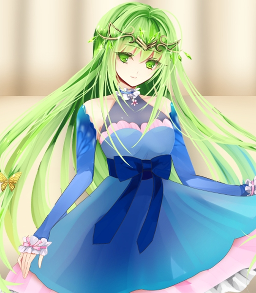
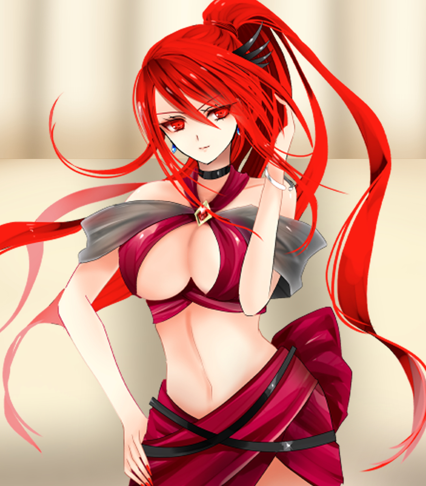
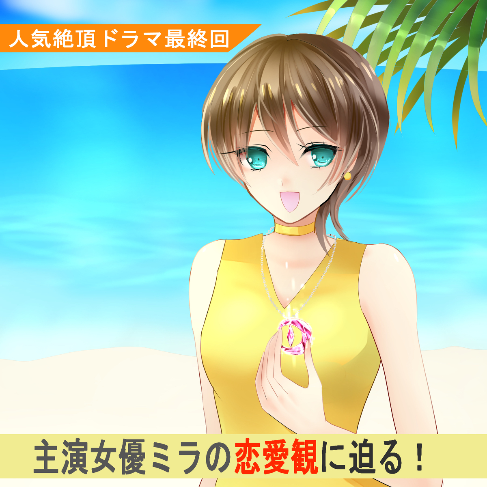

原文来源: [pixiv novel 16180262](https://www.pixiv.net/novel/show.php?id=16180262)
系列: 音楽†SFファンタジー『LOVE WILL』HARMONIXシリーズ
顺序: 1

カラン、と氷がグラスにぶつかり涼しげな音が響いた。
イクスが持ち上げたドリンクグラスの中には飲みかけのアイスコーヒーが揺れている。透明なドリンクグラスに反射する太陽の光が少しまぶしい。
耳をすませば遠くから色々な音が聞こえてくる。砂浜に打ち付ける海の波の静かなさざ波や、水辺ではしゃぎまわる人たちの声。ホットドッグはいかがですかー、なんて商売根性たくましい店員たちのキャッチも聞こえてきて、イクスの口元はついほころんだ。
——まるでこの風景自体がマテリアルの“音”みたいだ。
マテリアルとは不思議な力を持つ“音”を奏でる美しい結晶体だ。複雑で、規則性のあるマテリアルの“音”は人の心を強く揺さぶり、時には人の心を操ることさえある。そんな“音”を恐れた古代の人々はその存在を封印するかのように歴史から葬り去ったのだが、ジェノサイド社という企業がマテリアルという形で復活させてしまった。マテリアルの素材が人間だと知ったイクスとその仲間エレノアナとレイラはジェノサイド社と戦い、今もなお各地に散らばってしまったマテリアルを人間に戻す旅を続けている。

「いいところね」

元・ジェノサイド社の研究員レイラが目を細めて呟く。燃えるような赤い髪と目に、淡麗な容姿。派手な服をいつも品よく着こなすレイラだが、今日の服装はいつも以上に派手……というより、目のやり場に困る。
レイラの呟きに反応してそちらを見たイクスの目にレイラの大きな胸元が焼き付いてしまって慌てて視線をそらした。肌面積が異様に多いが一応水着ではなくドレスの一種、らしい。くびれた腰回りや、うっすらと筋肉ののったしなやかな足を惜しげもなくさらして歩くレイラは、お忍びに来たどこかのモデルであるかのように周囲の視線を集めていた。

こういうリゾート地ともなれば気も緩むのだろう。レイラを見て、カッコイイ、綺麗、とはしゃぎまわる女性たちの声も微かに聞こえてきて、誇らしいような、何故か自分が気恥ずかしいようなむずがゆい気持ちがイクスの中で湧いてきた。

「ね！イクスくんもそう思わない？」

「え、ええ。いいところですね……」

目をそらしたまま頷くイクスを見て、おやぁ？とレイラが笑った。にんまりとチェシャ猫が笑うような声にイクスの肩がびくっと揺れる。

「イクスくーーん？さっきからなんか視線が合わない気がするんだけど～？」

「き、気のせいですよ」

「そう？今も全然視線が合ってない気がするけど～？」

「……レイラさんの方にある、太陽がまぶしくて」

「ふ～ん？まあいいけどさ」

あまりにも苦しい言い訳だったが、レイラはひとまず納得してくれたかのように引き下がった。

「ふふっ、イクスくんも着替えれば良かったのに」

——引き下がったかのように思わせて、服の話題から離れてくれなかった。完全に見透かされている気がして、イクスのこめかみにたらりと冷や汗が流れた。

「ねー、エレノアナちゃん！せっかくのリゾート地なんだから、イクスくんも着替えれば良かったのにねー？」

「え？——あ、イクスさんの服の話ですね！」 

真剣な表情で情報端末を構えていたエレノアナがレイラに話しかけられて、ぱっと顔をあげる。動いた弾みで指が情報端末の画面に触れ、カシャッとシャッター音が鳴った。エレノアナの目の前にあるブルーライムのドリンクをうまく写真に収めようとして、写真アプリとずっと格闘していたらしい。ドリンクを飾るミント色の細長いクッキーが涼しげだ。綺麗に撮れたら、最近はまっているＳＮＳ『ミシェア』に上げるのだろう。
ドリンクの隣では一匹の青い小鳥がたたずんでいる。
ハピネス。エレノアナに懐いてついてきている小鳥だ。エレノアナは“ピィちゃん”と呼んでいる。エレノアナの持つ情報端末を見つめ、小さく小首を傾げたまま微動だにせずにいたところを見ると、写真という概念をかなり理解しているらしい。エレノアナが情報端末を下ろすなり、肩が凝ったと言わんばかりに羽を広げてその場にへちゃりと座り込んだ。
そんなハピネスとドリンクの写真を真剣に撮っていたエレノアナもリゾート地らしい、涼しげなワンピースに着替えていた。かわいらしい服を好むエレノアナにしては珍しく、開いた肩口やシースルー生地の胸元がエレガントさを感じさせる青いワンピースだ。随所にちりばめられた桃色のレース生地がエレノアナの神秘的な緑の髪と瞳と合わさって、どこか神聖な可憐さを醸し出していた。
ピィちゃんとお揃いです、と肩にハピネスを乗せて笑う青いワンピースのエレノアナはいつもより少しだけ大人びて見えて、イクスもどきりとさせられた。

「せっかくお店まで行ったのに、何も買わないなんてちょっともったいなかったですね」

エレノアナがくすくすと笑う。きっと思い出し笑いだろう。

「良いんだ、このままで……どうせ代わり映えしないから……」

そんなつもりはなかったのに、イクスの声は少し拗ねているように聞こえた。
服を買いに行ったエレノアナとレイラ二人に付いてブティックに入ったは良いものの、きらびやかな店内の雰囲気に馴染めずに早々に退散してしまったイクスは先ほどもレイラにからかわれたばかりだった。
その後エレノアナにせっつかれて色々な服を見たものの結局は代り映えしない黒い服ばかりを選んでしまうので、イクスは服の新調を諦めた。好きな服を三枚選んで来いと言われ、いつの間にか同じような黒服を三枚持っていたイクスを見るエレノアナとレイラのなんとも言えない視線を、イクスはまだ忘れていない。

「いつかぜーーったい！イクスくんに黒以外の服着せてやりましょうね！エレノアナちゃん！」

「はい！ピンクとか、チャレンジさせてみたいと思います！」

「頼むからピンクだけはやめてくれ……」

げんなりとため息を吐くイクス。

「だってせっかくカイポールに来たんだから、ねぇ？しっかり楽しんでいかないと！」

「カイポールに来た理由はマテリアルですけどね」

「それはそれ！これはこれ！——ですよ、イクスさん！」

イクスたちはマテリアルの情報を聞きつけてリゾート地『カイポール』を訪れていた。きっかけは遡ること数日前——。

---

イクスたちが生活の拠点としているキャンピングカーの中で、事は起こった。レイラの母が亡くなった際にレイラに遺したこのキャンピングカーは、三人で暮らしていてもさほど不便を感じさせない程に広く、大きい。
ソファに座ってハピネスと戯れていたエレノアナが、あ！と急に慌てた様子で立ち上がったのだ。

「エレノアナ？どうかしたのか？」

「ドラマが！ずっと見ていたドラマがそろそろ始まる時間なんです……！」

「ああ、あの——ええっと、なんとかっていう女優が主演のやつか」

「ミラ！ミラちゃんですよ、イクスさん！ひまわりみたいでとっっても可愛いんです！」

ここ数年、様々なドラマや映画の主演を務めている女優が確かそんな名前だっただろうか、とイクスは記憶をたどる。あまりテレビに関心がないイクスでもミラという名前は聞いたことがある。明るく天真爛漫な、可愛らしい顔立ちの女性だが、意外と実力派らしい。１０代の頃に大手端末メーカーのＣＭでデビューして以来大ブレイクとなり、その後も刑事役、ＯＬ役、令嬢役、スパイ役、と多彩な役柄を演じてきている。
今は超大企業の社長令息に恋してしまった平凡な大学生の役をしていたはず。大恋愛の果てに令息とヒロインが結ばれる、典型的なシンデレラストーリーが今世界中の女性たちに大人気だ。

「そろそろミラちゃんが告白されそうなんです……！海のある別荘地で今度、大きなパーティーが開かれるらしくって！ミラちゃんのお相手の婚約者の発表がある、って噂を聞いたミラちゃんがショックを受けて逃げ出したところで前回終わってしまって……でも絶対、その婚約者ってミラちゃんのことなんですよ！」

「そういえば前回はそんなお話だったっけ」

女優ミラ——が演じている役について熱く語るエレノアナの背後からひょっこりとレイラが顔をのぞかせた。

「あれってそろそろ最終回っぽかったわよね」

「はい！だから絶対見逃せなくて……！」

「そうね！あ、お茶淹れたけど。飲む？」

「飲みます！」

「はーい。あ、これイクスくんの分ね」

「ありがとうございます、レイラさん……」

三人分のマグカップを配ったレイラがいそいそとエレノアナの隣に座り、テレビ画面に向き直った。なんだかんだレイラもドラマの続きを楽しみにしていたらしい。
そういえば先週も二人でそのドラマの話で盛り上がっていただろうか。楽しそうな二人の雰囲気につられて、イクスもテレビに目を向けた。
エレノアナがテレビをつけるとちょうどドラマが始まったところだった。
ヒーローとヒロインのすれ違いが解決するクライマックス回で、横目で見ていたイクスもいつの間にか真剣に見てしまっていた。ストーリーも悪くないが、それ以上にミラの演技が上手い。
自分を追いかけてきたヒーローを見つめるミラの表情は真剣だ。意思の強い瞳からぽろぽろと流れ落ちる涙が印象的で目が離せない。

『私、ずっと貴方のことが——』

ヒロインが静かに、震える声で何かを告げようとする。『ずっと貴方のことが好きだった』。きっと、そう言うのだろう。期待にイクスたちが生唾を飲んだ瞬間、ヒーローがヒロインを抱きしめた。抱きしめられて大きく目を見開くヒロインと“To be continued”の文字が画面に映って、ドラマが終わってしまう。

「ええーーーっ！ここで終わっちゃいました！！」

「もうっ！もう一言！あともう一言だったのにね……！」

「でも、きっとあれ伝わったってことですよね！！」

「あれで伝わらなかったらおかしいでしょ！」

「はい！絶対伝わったと思います！！」

レイラとエレノアナの話に入れないイクスも、心の中で何度も頷く。あれは間違いなく気持ちが通じ合ったはずだ。
三人がドラマの余韻に浸っていると、コマーシャルから切り替わってインタビュー映像が映り込んだ。先ほどのドラマで主演を務めていたミラが大画面にアップで映っている。画面の上部に映ったテロップにまずエレノアナが悲鳴をあげた。

「やっぱり次、最終回みたいです！」

『人気絶頂ドラマ最終回』。途中から見たイクスから見ても盛り上がる回だと思っていたら、やはり次回が最終回のようだった。それに合わせて各演者にインタビューを取ったらしい。そのトップバッターが女優ミラだった。恋愛ドラマに関連するインタビューらしく、ミラの恋愛観について尋ねている。

『ミラちゃんの、好きなタイプはどんな男性ですか？』

『好きなタイプ……はよくわからないんですけど。でも運命の人と結ばれたいな、とはずっと思ってます！』

ドラマの中の役よりも陽気な、はきはきとした声でミラが答える。素の喋り方はこんな風なのか、とイクスは感心に近い気持ちを抱いた。同じ顔で同じ声なのに、演技をしているときとは別人のようだ。

『運命の人ですか！ロマンチックですね！そういえば、そのネックレスが運命の人と何か関係があるとか……？』

『えーっ！？もうっ、どこで聞いたんですか？これ、秘密にしてたのに！！』

ミラが驚いた顔から少しカメラが引いて、彼女の胸元が映り込む。ミラの手が桃色のネックレスに触れていた。三日月を象ったようなデザインのネックレスが、美しく輝いている。太陽光を反射しているだけでなく、自ら光輝いているように見えてイクスは思わず目を見開いた。

「え？あれって……色は桃色だけど……」

レイラも同じことを考えたのだろう。ミラのネックレスを見て慌てて前に乗り出し、食い入るようにテレビ画面を見ている。
ミラの桃色のネックレスは水晶に似た、不思議な淡い光を放つ結晶体で出来ている。色こそ違えども、同じようなものをイクスたちは見たことがあった。

「マテリアル…………」

エレノアナの静かなまなざしがミラのネックレスに注がれている。

「あれ、マテリアルだと思います」

確信を抱いたようなエレノアナの声に答えるように、ミラが朗らかに言った。

『運命の人を見つけてくれる、不思議な力があるネックレスらしいんですよ！運命の人が見つかったときに、この世界のものじゃないみたいな、不思議で綺麗な音が鳴るんだとか……』

イクスたちは自然と互いに顔を見合わせていた。

「……エレノアナちゃんが言うなら、きっとあれはマテリアルね。大人気のミラちゃんの居場所ならすぐ分かると思うから、直接向かってみましょう」

レイラはその場で自分の情報端末を取り出し、真剣な顔で操作をし始めた。情報収集ならレイラの独壇場だ。すぐにミラの居場所も分かるだろう。

『次に、最近のミラさんのストーカー被害についての報道ですが…………』

ふと聞こえてきたインタビューの続きにイクスはテレビ画面に視線を戻した。どうやら少し前からミラはストーカー被害に遭っていたらしい。誘拐未遂、のテロップが画面に映り、イクスの表情が自然と強張る。

「誘拐までしようとしたのか……随分と過激なストーカーだな……」

「ミラちゃんほど人気の女優さんなら、それくらいの事件起きちゃうかもしれません。でも……もしあれがマテリアルなら……」

エレノアナは心配そうに胸元に手を当てていた。不安そうなエレノアナの気配を察したのか、ピィ！と短く鳴いたハピネスがエレノアナの肩の上に上った。

「ピィちゃん……」

そっとハピネスを撫でながら、微笑むエレノアナ。だがその微笑みはやはり固い。

「マテリアルを狙った奴らがミラちゃんごと誘拐しようとしたのかもねぇ——あっ、分かったわよ、ミラちゃんの居場所！」

情報端末を操作しながらも話を聞いていたレイラがあっさりイクスとエレノアナの懸念を言い当てた。そして顔を輝かせて、手に持っていた情報端末の画面をイクスたちに見せてくる。
そこには芸能関係らしき者のＳＮＳアカウントが映り込んでいる。可愛らしく手を振るミラの写真が投稿されており、その背景には青い海と白いホテルらしき大きな建物が映り込んでいた。

「ミラちゃんは今、撮影でリゾート地『カイポール』に居るみたい。この写真から場所を特定している人が居たわ！」

イクスたちの次の目的地が決まった瞬間だった。
