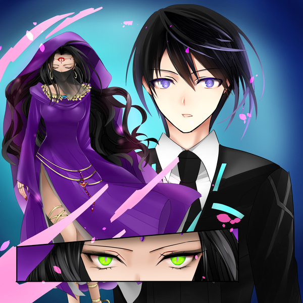
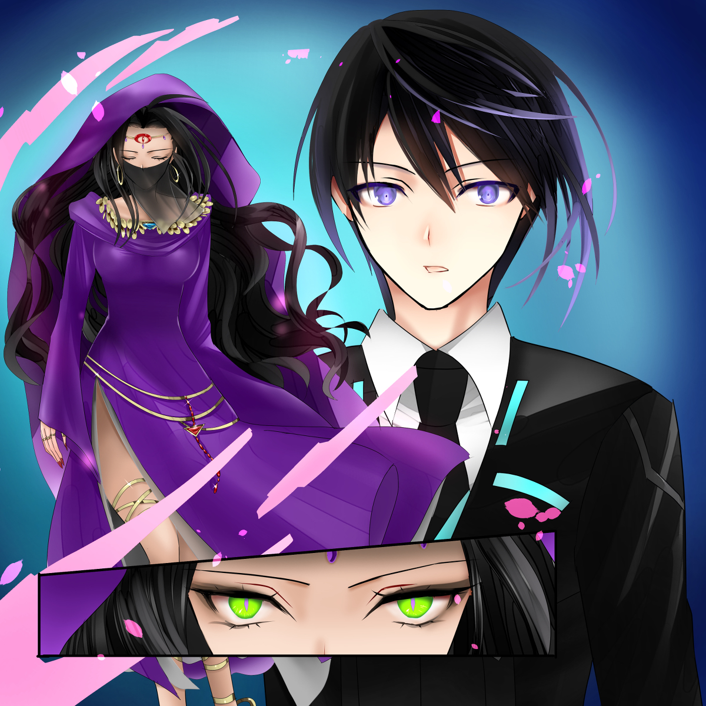
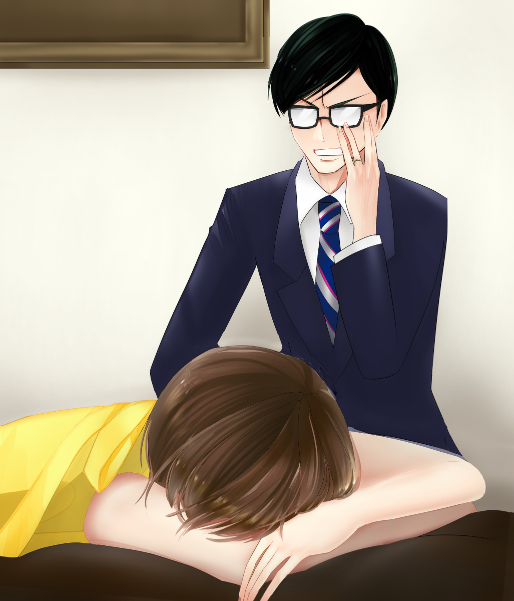

原文来源: [pixiv novel 16180321](https://www.pixiv.net/novel/show.php?id=16180321)
系列: 音楽†SFファンタジー『LOVE WILL』HARMONIXシリーズ
顺序: 4

——ウソツキ。
ホテルまで送り届けたミラは去り際にそんな一言をぽつりとこぼした。目線も合わせずに、ヒールの音を響かせてホテルに帰っていくミラ。その背中に誰も何も声をかけることができなかった。

「ごめんなさい……」

ミラが立ち去った後にぽつりとそうこぼしたのはエレノアナで。

「エレノアナ」

自分に責めている様子のエレノアナに、ゆっくりと首を横に振って慰めの言葉を探したのがイクスだった。だがどう言ってやれば良いのか分からずに言葉が詰まってしまう。

「大丈夫よ。運命の人なんて言っても、ただの占いみたいなものでしょ。今はショックを受けてるけど、そのうちすぐ立ち直るわよ。なんたって、エレノアナちゃんの大好きな大女優ミラ様なんだから！」

イクスがもごもごしているうちに、レイラがカラリと笑ってエレノアナの肩を優しく叩いた。その優しさに安心したのか、エレノアナの口元が緩む。自分の肩の上に置かれたレイラの手の上に自分の手を重ねるエレノアナ。

「レイラさん……はい！きっと、大丈夫ですよね……。イクスさんも、ありがとうございます」

「いや、俺は何も……」

口ごもるイクスを見て、エレノアナは少しだけ明るさを取り戻した表情でくすくすと笑った。

「さ、私たちも自分の仕事をしましょう。イクスくん、キュアをお願い」

ミラから回収したマテリアルを片手に持ちながら、レイラがイクスに向けてウィンクを飛ばす。
頷いたイクスはポケットから淡く光る鍵型の結晶を取り出した。

---

『キュア』はレイラの父が開発した、マテリアルにされた人間を元に戻すためのアイテムだ。紆余曲折あって今はイクスの手に渡っており、イクスたちはキュアを使って世界各地のマテリアルを人間に戻している。
イクスは慎重な手つきでキュアを握り、そっと鍵穴に鍵を差し込むように、マテリアルにキュアを差し込んだ。白い光がマテリアルからあふれ出し、位相幾何学的な模様が浮かび上がる。
視界を埋め尽くすほどの強い光が放たれ、光の奥で人影のようなものが蠢いた。

「まさか、人の姿に再び戻れる日が来るとは……」

光の奥から感嘆の声が聞こえた。
神秘的でありながらどこか艶やかな、静寂と妖艶が同居したような声だった。満月の岬で聞いた、月から滴る雫を思わせる、神秘的なマテリアルの“音”を強く想起させる声だ。
光が晴れると、美しい女性が一人立っていた。
夜風にたなびく鮮やかな紫にイクスは目を奪われて、それがシルクのヴェールであることに気付く。ヴェールの裏地のように映える黒は、絹のように美しい黒髪だ。
ヴェールと同じ色の紫のドレスには深いスリットが入っており、金の足飾りで飾られた褐色の太ももが露わになっている。煽情的な服装だが、それ以上に神秘性を感じるのは彼女の瞳のせいだろう。
金緑——クリソベリルの瞳が妖しく瞬いている。宝石のように美しくも、すべてを見透かすような神秘的な光がその瞳には宿っていた。
自然と自分の背筋が伸びるのをイクスは感じた。

「旅の御方。貴方がたが、私を救ってくださったのですね。感謝いたします」

胸に手を当て、恭しく礼をした女性はソフィアと名乗った。
彼女は占い師であると言う。彼女は各地をさすらう流しの占い師として旅をしていたが、ある日黒服の男たちにさらわれてマテリアルの姿に変えられてしまったとのことだった。

「占い師か……だから、マテリアルの能力も“運命の人”を告げる能力だったのか？」

「私の占い師としての能力が反映されたのでしょうね。私をさらった者たちは、私のように普通とは違う力を持つ者を狙っているようでした」

「特殊な力を持つ女性を狙う奴らかぁ……またジェノサイド社の残党とかが関わってなきゃいいけど」

レイラが深いため息を吐いた。
元々マテリアルはジェノサイド社と言う企業で作り出されたものだった。今はほとんど壊滅状態のジェノサイド社だが、各地に残った残党がまだ細々と活動を続けている。その残党を取りまとめている組織によって、ジェノサイド社壊滅後も未だマテリアルは作り続けられていた。

「あの……そう言えば、なんですけど……前に確か、マテリアルがらみの組織に会ったことがありましたね。名前が、確か、えっと……『ゲノム』」

記憶を探るようにエレノアナが口元を手で軽く抑えながら考え込む。

「ゲノム……」

イクスの脳裏で何かがよぎった気がした。しかし、よぎった何かが完全に形を得る前に、思考の網からすり抜けていってしまう。

「何か、このご恩に報いることができれば良いのですが」

考え込むイクスたちの前でじっと黙り込んでいたソフィアが、ふと静かに切り出してきた。

「私は、マテリアルになる前は恋愛事を主に占っていたのですが……お三方は恋愛占いにご興味は？」

「「えっ」」

イクスとエレノアナが同時に動揺の声をあげる。
重なってしまった声に思わずイクスがエレノアナの方を見ると、エレノアナの頬が瞬時にカッと赤くなった。

「あ、あの……！私……っ！え、ええと……その、れ、恋愛占いは、ちょっと……！」

「あら、いいじゃない？エレノアナちゃん占ってもらえば～？たとえば……好きな人とどうやったら結婚できますかーとか！」

「け、けけけ、結婚っ！？そ、そんな！！ま、まだ早いです！その、最初はお付き合いから……じゃなくって！ダ、ダメです！恋愛占いは……そ、それだけは今はダメッ！」

「エレノアナ……好きな人が居るのか？」

あからさまなエレノアナの反応にイクスは驚いた。だが考えてみればエレノアナも年頃の少女だ。好きな人の一人や二人居るかもしれない。
だけど……とイクスは何とも言えない気持ちになって困ってしまう。
恋愛をするのはエレノアナの自由で、イクスが口を出すべきことじゃあない。だが、その相手にまったく心当たりのない自分が情けないような、今まで一度も相談をエレノアナから受けたことがないことが寂しいような。そんな不思議な気持ちがイクスの中で渦巻いた。

「う、うええええっ！？そ、そんなイクスさん……い、イクスさんの……、どんか……、ば……、う、うぅぅぅぅっ！」

真っ赤な顔でエレノアナは何かを言おうとしているが、結局何も言えないまま撃沈してしまった。両手で顔を覆って、そのまま動かなくなってしまう。

「え、俺なんか変なこと言ったか？」

「うーん。これでこそイクスくんよねぇ。あんまりエレノアナちゃんをいじめちゃダメよ？」

「え、ええ……？」

「で、イクスくんは好きな人居るの？」

流れるようにレイラが笑顔で問いかけてきた。
予想していなかった質問にイクスの心臓がどきりとする。何故か動揺している胸の鼓動を落ち着かせようと、イクスは小さく咳払いをした。

「好きな人……ううん。初恋の人はいましたけど、子どもの頃の話ですし。相手の顔もあんまり覚えてないですね」

「なんかイクスくんらしいわね……安心するわ……」

「だから恋愛占いをされても相手が居ないな……」

自分で言いながらイクスはちょっぴり寂しい気持ちになった。

「そうですか……では、こちらをお礼代わりに……つまらないものですが、一つ忠告を」

ソフィアがさっと腕を横に振るった。紫の袖地がイクスたちの視界を横切る。その紫の鮮やかさに思わず目を奪われていると、いつの間にかソフィアの手には一枚のカードが握られていた。

「どうぞ」

「これは……タロット？」

差し出されるがままにカードを受け取るイクス。カードの表面には輝く三日月が描かれている。

「夜がいずれ来るでしょう。魔物の巣食う、行く手も見えない深い闇夜です。貴方が今の道を進むことを望むのなら……必ずその夜を通り抜けれなければなりません。ですが、月は貴方を見守っています。もし宵闇に恐れる気持ちでくじけそうになったときは、空を御覧なさい。月の光が貴方を導くでしょう。どれほど細い光でも……決して見失わないように……」

まるで何かを予言するようにソフィアはそう言った。

「お気を付けください。私をマテリアルに変えた者たちが彼女を……ミラを狙っているようです。運命は貴方がたの動きにかかっています」

ソフィアのクリソベリルの瞳が妖しく瞬いた。

「では、またいずれ……お会いしましょう」

夜の闇に溶け込むように、ソフィアはどこかへ歩き去った。
不思議な雰囲気を持つ女性だった。存在自体がまるで蜃気楼のようで、今ソフィアと話していたことが夢だったかのようにも思えてしまう。

「占い師か……本当に未来が見えているみたいな言い方だったな……」

「それを仕事にしてるんだから、そりゃそうでしょ！まっ、お天気占いくらいに考えておきましょ！」

レイラはあまりソフィアの言葉を信じていない様子でカラカラと笑った。

「さ、私たちもホテルに戻りましょうか。——の前に、エレノアナちゃん。なんかさっきからすっごい視線を感じるんだけど……私がどうかした？」

笑顔のままくるりとレイラが振り向く。振り向いた先には未だ頬を赤く染めたエレノアナが、顔を覆っている指の隙間からちらちらとレイラを見つめていた。

「あ、あの……レイラさん。あのですね……」

エレノアナにしては珍しく、もごもごと気恥ずかしそうに口ごもっている。
ぐっと目を閉じて、気合いを入れたかと思うと、エレノアナがレイラに向かってぐっと乗りだしてきた。

「こ、この際だから思い切って聞きたいんですけど！レイラさんって好きな人は居ますか！？」

「私の好きな人？そうねぇ……」

まさかレイラにも好きな人が？
イクスは再び動揺してしまった。
レイラなら居なければ居ないとはっきりと言うのではないだろうか。実際、イクスとレイラと同僚だった頃は、『恋愛なんかに興味はない』と豪語していた。そんなレイラが答えを考え込むような素振りを見せたとなると、もしや、知らないうちにレイラもエレノアナと同じく恋をしていたのだろうかとイクスも考えてしまう。

「私に好きな人が居るかは……」

「「す、好きな人が居るかは……？」」

ごくりと息を飲んで答えを待つイクスとエレノアナ。そんな二人を見て、レイラは満面の笑みを浮かべた。

「ヒ・ミ・ツ！」

口元に人差し指を当て、小首をかしげて笑うレイラ。いつもと違うあどけない仕草がまるで可憐な少女のようだった。

---

言いすぎちゃった。
ミラは自室のソファで不機嫌そうにうずくまっていた。カチカチと時計の針の音が静かな部屋に響いている。夜の静けさがやたらと寂しく感じるのは、エレノアナとの時間がそれだけ楽しかったからだろう。
エレノアナが悪くないのはミラも分かってはいたのだ。
運命の人をどうしても知りたいと願っていたのはミラ自身なのに、いざマテリアルを使う直前になって怯んでしまったのもミラだ。エレノアナはそんなミラの背中を優しく押してくれたに過ぎない。
そんなエレノアナにウソツキと言ってしまったのは、ただの八つ当たりだ。

「……せっかく、お友達みたいになれたのに」

１０代の頃から芸能界で仕事をしていたミラには友人と言える人は居なかった。同僚か、敵か。味方はほとんど敵の敵だ。若くして大ブレイクしたミラの周りにはいつも嫉妬がうろついていて、対等な友達なんて作りようがなかった。
そんな中で、はじめて真っ直ぐ向き合ってくれた少女がエレノアナだったのだ。ファンだと言いながらも、『大女優ミラ』を変に神聖化することもなく、芸能人だからと距離を置くこともなく。ただただ、同じ年ごろの友達同士のように普通に接してくれた。
それがミラにとっては思いのほか嬉しかったのだ。
だからこそ、つい自分の口から出てしまった言葉を今くよくよと悔やんでいる。カッとなっていた頭が冷えてからは、後悔で気分が落ち込むばかりだった。

「そう言えばサインすら頼まれなかった……頼んでくれれば、それくらい書いてあげるのに……」

単純にエレノアナがサインをお願いできるタイミングがなかっただけなのだが、そんなことは知らないミラが頬を膨らませる。

「私のファンならそれくらい頼みなさいよね……」

文句を言ってしまうのは、長年芸能界で戦ってきたミラの癖のようなものだった。

「はぁ……違うでしょ、私。だからエレノアナちゃんを責めちゃダメだってば……」

重いため息がミラの口からこぼれ出る。

「あのー、ミラさん？」

ミラの部屋に居た、一人の男が気だるそうにミラに声をかける。ミラのマネージャーだ。夜中だと言うのに隙なくスーツを着こなしているのは少し前まで仕事をしていたからだ。

「私は夜中に何も言わずにホテルを抜け出して、スタッフ総出の捜索騒動を起こした貴方をお説教してるんですけど。ミラさん、聞いてます？」

「聞いてないわ」

「ちょっと……」

「良いから私の話を聞きなさいよ。ねぇ、どうすればいいと思う？」

説教も不満もまるっと無視するミラ。反省の様子すら見せない女優にマネージャーは頭を抱える。こういう時のミラには何を言っても無駄だと知っているマネージャーは説教を諦めた。

「はぁ……まったく貴方は……。マネージャーの仕事に人生相談は入ってないんですけど」

「何よ、ケチ」

「よくわかりませんけど、ご友人とケンカしたんですか？それで、ミラさんが全面的に悪かったと」

「全面的は言い過ぎ！エレノアナちゃんだって適当なこと言ったし……まあ私を励ますためだけど……せいぜい、私が悪いのは……はち……六割くらい……」

「つまり全面的にミラさんが悪いってことですね」

「アンタのそういうとこ嫌い」

「好かれるために仕事してるわけじゃないんで」

面倒くさそうにため息を吐きながらも、マネージャーはマッグカップをミラの前に置いた。淹れたての暖かいコーヒーだ。

「とりあえず、それ飲んでください」

「……粉から引いてくれた？」

「インスタントに決まってるでしょう、おバカさん」

「……エレノアナちゃんのコーヒーが良い」

「わがまま言わない」

「ケチ。ドケチ」

「言いたい放題なんだから……コーヒー下げちゃいますよ」

「それはダメ」

文句を言いつつも、渋々とコーヒーを飲むミラ。冷えていた体が少し温まった気がして、安堵のため息がミラの口からこぼれた。体が温まれば、心も温まったような心地がする。くよくよしてしまう気持ちもまとめて吹き飛ばそうとミラは大きく深呼吸をした。

「よしっ！もう気にしない！ただの占いみたいなもんだと思って忘れよ！」

「占い？」

「マテリアルで運命の人を占ったの。あ、フォーチュン・ネックレス。あのピンク色のネックレスの話ね」

「ああ……あのうさんくさい……」

「本物だと思ったのになぁ。最高の結婚相手がやっと分かると思ったのに……」

拳をぐっと握りこみ、意気込むミラ。そんなミラに対して、マネージャーの反応は冷ややかだ。

「私としては結婚はまだ止めてほしいんですけどねぇ。断るのも嫌になるくらい大量のオファーが来てるのに、今辞めたら大騒ぎですよ」

もしミラが電撃結婚したとしたら。己に降りかかるであろう大量の仕事やら厄介ごとやらを想像してマネージャーがぶるりと震えた。ただでさえミラに振り回されて削られがちな睡眠時間がどれほど減ってしまうことか。

「今だから良いんでしょ！女優として人気絶頂のときに電撃結婚！そのまま伝説の女優として世界中の人たちの記憶に刻まれるの。どうせ今の人気も私が若いから目立ってるだけだもん。落ちぶれる前に、さっさと結婚して引退したいの！」

「それずっと言ってますけど……ミラさんなら、これからも芸能界に残れると思いますよ？努力家で、ずぶとくて、まじめで、ずぶといんで」

「ずぶといずぶとい、ってうるさいわよ！悪かったわね、可愛げがない性格で！」

「褒めてますよ。一応」

「フンッ！」

——本音なんだけどなぁ。
拗ねてしまったミラを横目で見ながら、マネージャーは心の中でぼやいた。若さと美貌だけでミラは今の立場までのし上がってきたわけではない。10代の頃から変わらない、ひたむきな勤勉さと人並外れた負けず嫌いな性格が今の大女優ミラを形作ったものだ。人気絶頂の今でさえも、ミラは満足せずに自分を磨くことにどん欲だ。十数年もすれば、熟練の役者としても通用するだろう。
だからこそ、ここで結婚引退するのはもったいないとマネージャーは考えていた。だがいくら説得してもミラは聞く耳を持たない様子だった。それどころか、運命の人を告げるネックレスなんて怪しげなものに手を出す始末。

「焦る必要はないと私は思いますけどねぇ」

「分かんないでしょうね。女の価値は歳を取っていくごとに下がっていくの。今のうちじゃないと、最高の相手なんて見つかりっこないのよ」

「価値ねぇ……」

「もうっ！こうなったら、意地でも運命の人とか関係なくいい男を捕まえてやるんだから！！」

「そうですか。あ、一応断っときますね。私結婚してるので。後、プライベートもミラさんと一緒とか、胃が消耗しそうなので、結構です」

「～～～～っ！ほんっと、アンタ嫌い！！」

すげなく断った上に、薬指の指輪を見せつけてくるマネージャーにカチンとくるミラ。

「アンタみたいなくたびれたオッサン、そもそも対象外ですー！あー、もう！イライラする！！なんかさっきから時計の音もうるさく聞こえるし……！」

神経がささくれ立っているからだろうか。カチカチと、規則正しく動く秒針の音がやたらとミラのかんに障った。

「時計？あ、確かに鳴ってますね……でも、この部屋の時計ってデジタルしかないはずじゃ……」

そこまで言ったところで、マネージャーははっと顔を青ざめさせた。

「まさか……っ！ミラさん、急いで部屋を出ましょう！」

「えっ？」

「早く！とりあえず外へ……この音、もしかしたら……」

ミラの手を強引に取ってマネージャーが部屋の出口を目指そうとした。
大きな爆発音とともに閃光が走ったのはそのときだった。
