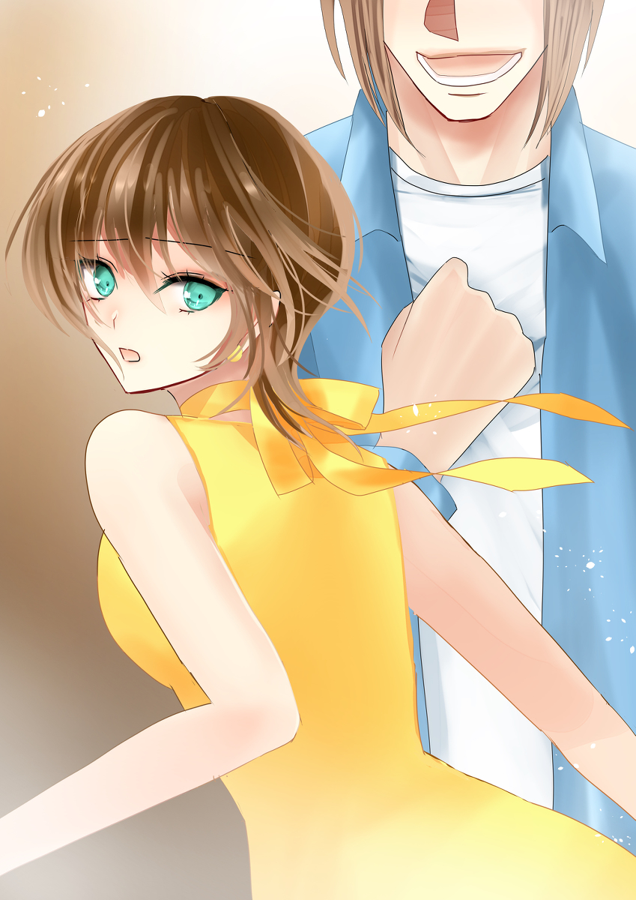
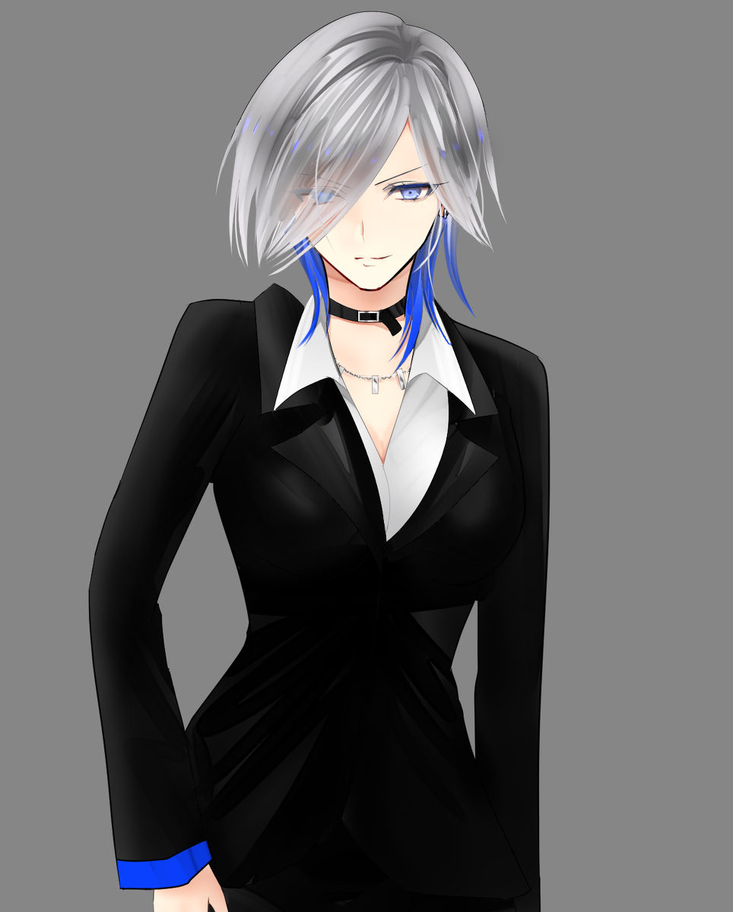
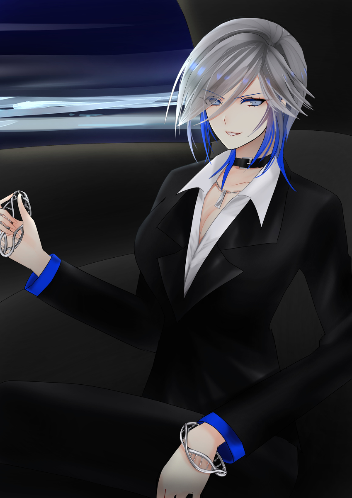
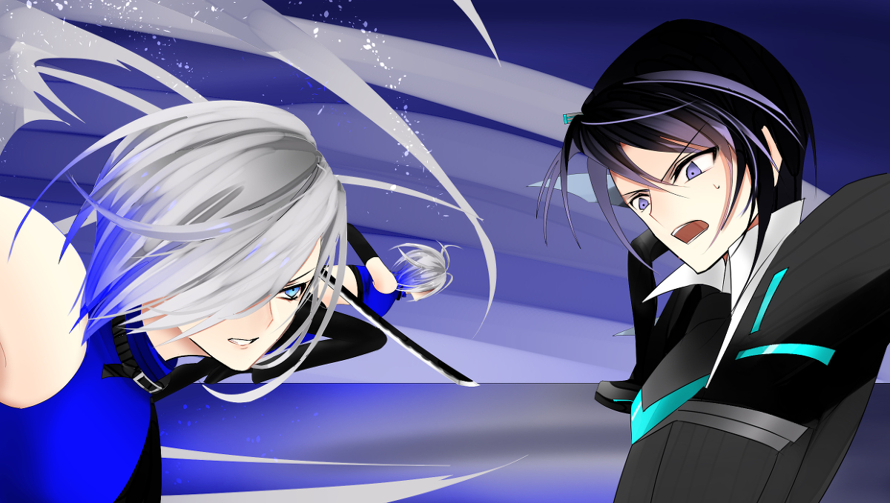
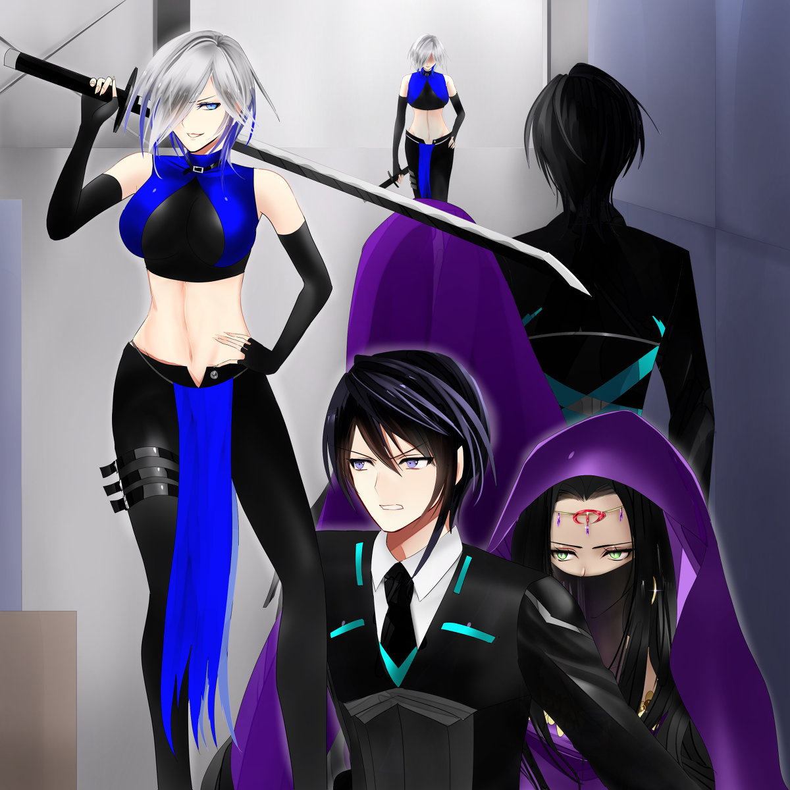

原文来源: [pixiv novel 16180364](https://www.pixiv.net/novel/show.php?id=16180364)
系列: 音楽†SFファンタジー『LOVE WILL』HARMONIXシリーズ
顺序: 6

ミラさん、狙いは貴方です。
だからとっとと逃げろと言うマネージャーの言葉に背中を押されてミラはホテルの階段を駆け下りていた。

「ああ、もうっ！無事じゃなかったら承知しないんだから！」

マネージャーの焦げたスーツと擦りむいた頬を思い出しながら舌打ちをするミラ。
部屋に仕掛けられた爆弾に気付いたのはマネージャーが先だった。カチカチと鳴る音を怪しみ、ミラの腕を掴んで急いで部屋から出ようとした矢先に爆破されたのだ。
音と煙が派手な割には大した爆発ではなく、幸いにも二人とも軽傷で済んだ。だが爆風に吹き飛ばされたときの衝撃で体を打ち付けたらしく、マネージャーの方はすぐに動ける様子ではなかった。
この前、ミラを誘拐しようとした奴らの仕業だろうか。イクスたちが追い払ったあの二人組は手段を選んでくれるようには見えなかった。

――もし動けなくなっているマネージャーと彼らが鉢合わせしたら……。

嫌な予感を振り払うように首をぶんぶんと振るミラ。考えても仕方のないことだ。マネージャーのところにかけ戻りたい気持ちもあるが、自分が居たところでどうにもならないと言い聞かせてただひたすら走る。
ホテルの非常出口が見えてきた。鉄製の扉は大きく開かれていて、後は外に飛び出すだけだ。
しかしミラの足は出口の手前で止まってしまう。ミラの前に立ち塞がるように黒服の男が現れたからだ。

「やっぱりあんたたちの仕業だったのね……！」

以前ミラを誘拐しようとしてイクスたちに追い返された二人組の片方だった。スーツのような黒服に身を包んで、片手に銃を持っている。

「女優ミラ。私たちに着いてきてもらうぞ」

黒服の男がミラに銃口を向ける。
後ずさって別の出口に向かおうとしたミラは、背後から聞こえてきた足音に身を固くした。
もう一人居る。

「おっと、こっちは通行止めだ。諦めて大人しくするんだな」

もう一人、黒い服に身を包んだ女が現れてミラの退路を塞いだ。
撃たれることを覚悟で正面突破でもしてみようか――頭では冷静に考えているのに、どうしても向けられた銃口に身がすくむ。
動けなくなってしまったミラを捕えようと二人が近付いてきて――不意に野太い叫び声がどこからともなく聞こえてきた。

「うおおおおおおおお！」

「な、なんだ！？」

大柄な体躯が非常用出口からホテルの中に飛び込んできた。ミラに銃口を向けている男に体当たりを仕掛けて、そのまま自分も床に転がり落ちる。
衝撃で赤いキャップが吹き飛んでいくのが見えて、ミラは両目を見開いた。

「フォアグラ！？あんた、なんで……！」

「ば、爆発が起きたからミラちゃんが心配で……！この出口がミラちゃんの部屋に一番近いから、もしかしたらって思って……い、いたた…………」

膝でも擦りむいたのか、足を庇いながらもノロノロと立ち上がるフォアグラ。
相変わらずミラの周りをうろちょろしていたらしい。しかしそのことに不快感よりも焦りがミラの中で先立った。
慌ててフォアグラの元まで駆け寄り、ふらついている体を支える。

「何やってんのよ！あんたが来ても意味無いでしょ！早く逃げなさい！」

「嫌だ！」

「はぁっ！？」

「ミラちゃんが襲われてるのに逃げるなんて、嫌だ！ボクは良いから、早く逃げて！」

「なっ……！」

よろめきながらもフォアグラはなんとかしっかりと両足で立った。そしてぐいぐいとミラをホテルの外に押し出す。

「そこを退け！退かなければ撃つぞ！」

フォアグラの背後から黒服の女が銃を向ける。引き金に指がかかったのが見えてしまい、ミラは慌ててフォアグラを出入口から引き剥がそうとした。

「あんた、ほんと何やってんのよ！！逃げろって言ったってあんたじゃ何も出来ないでしょ！？」

「いいからミラちゃん、早く逃げて！」

ホテルの出入口をフォアグラが塞ぐ。
非常用出口は狭い。一度に一人しか通れない出入口の前に太り気味のフォアグラが立ってしまうと、ぴっちりと出入口が肉で埋まってしまう。
ミラの視界から誘拐犯たちが見えなくなった。

「逃げてって言われても……！」

フォアグラに戦う力はない。太り気味で、運動不足で、トロくて、ドジで。
銃を持ってる敵相手をどうにかできるはずがない。フォアグラに比べれば、まだミラの方が戦える。
だと言うのに、彼は出入口の縁をしっかりと掴んで離そうとしなかった。

「時間を稼ぐことはできるから……！ミラちゃんは早く！」

「そんなことできるわけ――」

「早く！！」

肩越しに振り向いたフォアグラの真剣な眼差しにはっとするミラ。
フォアグラの顔は青白くなっていた。冷や汗を流して、顔を引き攣らせながらも、頑なに動こうとしない。
絶対にここは譲らないとその目が言っていた。説き伏せることはできそうになかった。
何より、時間が無い。

「…………絶対、死ぬんじゃないわよ！適当に、あんたも逃げて！」

「ミラちゃんが逃げたらね！」

自分が早く逃げればフォアグラも逃げることができる。自分を待たずにさっさと逃げて欲しい。
そう思いながらも、逃走することしかできない自分にミラは歯噛みした。
ホテルに背を向けて、夜道を駆け出すミラ。

「待て！！クソ、そこを退け！！」

背後から誘拐犯の叫ぶ声が聞こえた。次いで響き渡った発砲音に思わずミラは振り返ってしまった。

「今のは威嚇だ！次は当てるぞ！」

フォアグラの背中ががくがくと震えている。
――ダメだ。殺されてしまう。
それならば自分が捕まった方が良い。引き返そうとしたミラは聞こえてきたフォアグラの呟きに目を見開いた。

「が……頑張るぞ、ファイヤー……」

「えっ？」

「ボクは逃げてばっかりだし、弱いし、何の役にも立たない奴だけど……でもミラちゃんだけは守るんだ！だから、だ、だから…………」

フォアグラの声は酷く震えていた。
今にも泣き出しそうな様子だと言うのに、手はしっかりと出口の縁を握って誘拐犯たちを通すまいと立ち塞がっている。

「頑張るぞ、ファイヤー！頑張るぞ、ファイヤー！頑張るぞ、ファイヤー！！」

「な、なんだこいつ！何を訳の分からないことを……！」

自分を奮い立たせるようにフォアグラが何度も同じ言葉を叫ぶ。
誘拐犯たちには意味が分からないだろう。その言葉の意味を知っているのはこの世でたった二人だけ。
ミラと、そしてミラが女優になるきっかけを作ってくれたあの人だけ。

「……バード」

ぽつりと懐かしい名を零し、ミラは弾かれたように走り出した。ホテルに背を向けて、少しでも遠くへ。
『ボクの秘密の呪文だよ』
頭が混乱していた。大切に閉まっていた思い出の蓋が強引にネジ開けられ、心の中に散乱している。
何か大事なものがこぼれ落ちてしまいそうで怖かった。
それでも今は逃げるしかない。

「このっ！！いいからそこを退け！！」

パンッ、と銃口が弾ける音が聞こえた。
悲鳴は聞こえない。また銃弾が撃ち込まれる音が聞こえる。悲鳴はまだ聞こえない。追手がついてくる音も、まだ聞こえてこない。

「…………ざけんじゃないわよ」

振り向いてフォアグラの元に駆け寄りたい衝動を堪えていると、ミラの口から低い唸り声のような呟きがこぼれ落ちた。

「ふざけんじゃないわよっ！！」

マネージャーも、誘拐犯も、フォアグラも。ふざけるなと叫んで全員まとめてぶん殴りたい気持ちだった。
特にアイツだ。フォアグラは絶対に殴る。色々と、我慢ならないものがある。

「ずっと応援してくれるって言ったじゃない…………死んだら、意味ないんだから……」

どうしてよりによってアイツに助けられなきゃいけないのか。悔しさがミラの胸に込み上げてきて、気付けば嗚咽のようなものに変わっていた。
泣きたくもないのに涙がこぼれ落ちる。
ごしごしと乱暴に目元を拭いながら行く宛てもなく走った。少しでも人の居る方へ。奴らが手出しできないようなところへ。

---

海岸沿いの道路を走っていると、道の先に黒い服を着た人影が見えてきた。街灯の影でじっと何かを待つように佇んでいる。
もしやアイツらの仲間かと怯んだミラは足を止めてしまった。相手もミラに気づいた様子でゆっくりと顔を上げる。
夜の闇で見えにくいが、鋭い顔立ちの青年のように見えた。長めの前髪が海風にそよいでいる。
静かな気配に混じる僅かな殺気と血の気配。見覚えのある気配にミラは呆然と呟いた。

「イクスさん？」

期待が混じった呟きだった。
そんな都合のいいことがあるはずがない。そう思いながらもつい足を止めて相手の正体を確かめようとしてしまった。
夜の闇からくすりと笑う声が聞こえてくる。

「あの裏切り者と知り合いかい？あいつも顔が広いねぇ」

これはイクスではない。
ぞくぞくとする低めのアルトボイス。男性的な荒々しさと女性的な艶がない混ぜになった、危険な声色でくすくすと笑う声。
親しげに細められてもなお眼光鋭い目がミラに向けられる。大型の獣に出くわしたような危機感がミラを襲った。

「……誰？」

「死神」

楽しそうにミラに答える声。

「そう呼ばれてるよ。不本意だけど、そういう運命に生まれたらしくってね……しかしあんただけ逃げてくるとは。あの二人は失敗したみたいだねぇ」

街灯の影にいた人影が動いた。街の灯りに眩しそうに目を細めながら、ミラに近付いてくる。その片手に抜き身の刀が握られているのを見て、ミラの全身に緊張が走る。

「女の子を怪我させるのは好きじゃないんだ。大丈夫、傷付けたりはしない。……一緒に来てくれるだろ？」

エスコートでもするかのようにさし伸ばされた手を。

「…………いいわ。だからあんたの部下もとっとと下がらせてちょうだい」

悔しさが滲み出そうな口元をきゅっと引き締めて、ミラは差し出されたその手を取った。

「ああ、構わないよ。――ターゲットは確保した。お前たちも戻ってこい。……はぁ？デブがなかなか死なない？何を言って――」

「なんて、大人しく捕まると思ったら大間違いよ！！」

掴んだ相手の手を引き寄せながら、蹴りを放つ。
戦ったことなんかない。でも、戦う役ならいくらでもやったことがある。プロの格闘家にだって教わったこともあった。
だから、相手が油断している今なら倒せる。
確信を持って蹴り上げを放ったミラは、手応えがないことに目を見開いた。

「おっと。なるほど、これは手こずるわけだ」

楽しそうな声が背後から聞こえてきたと思えば、ミラの首筋に痛みが走る。
暗くなっていく視界の中で必死に目を凝らしながら振り向くと、正面に立っていたはずの敵がいつの間にかミラの後ろに居た。
余裕の笑みを浮かべながら、そいつはひらひらと手を振る。

「おやすみ、ミラちゃん。ちょっとだけ眠ってておくれ」

――ごめんなさい。
一筋の涙を零したミラはそのまま意識を失った。

---

小さい頃のミラはおままごとが好きだった。
お姫様の役、奥さんの役、喋れるモンスターの役、動物園の象の役。演じるのはなんだってよかった。小学校の帰り道に、仲の良い友達と公園で日が暮れるまでおままごとで遊ぶのが好きだった。
嫌がる男子もおままごとに巻き込んで。たまに男の子たちがいつもやりたがるサッカーやら野球やらに混じったりもして。そんなときは、同い年の男の子になり切ったつもりで口調もちょっと荒っぽいものに変えてみたりなんかした。
私がなる男の子なら、スポーツも得意じゃなくっちゃ。その頃からもうミラの妙なこだわり、あるいは負けず嫌いの性格も健在で、試合で一度ひどく負けてからは夜な夜なサッカーの練習に勤しんだこともあった。
そんなミラに両親は顔をしかめていた。もっとおしとやかにしなさい。遊んでいるくらいなら、勉強をしなさい。おままごとをするのはいいけど、動物の役は止めなさい。男の子の役はやめなさい。そんなことをさせる子たちと遊ぶのはもうやめなさい。
それが貴方のためだと言う両親の言い方が変に癇に障って、喚く、泣く、物をひっくり返すの大騒ぎをしたこともあった。それからはミラのやることに両親もあまり口を挟まなくなった。

『そんなこと言うなんてパパとママは私のこと、大っ嫌いなんだ！私は二人のことこんなに大好きなのに！！こーーーんなにっ！！』

と両手を大きく広げながらも泣きわめく齢６歳のミラに、もしかしたらこの子は将来大女優になるのかもしれないと両親はそろって思ったらしい。
そんな感じで細々とした事件はありながらも、ミラは仲の良い友達と毎日楽しく遊んでいた。でも時の流れは残酷で、自然と、少しずつ、みんなで遊べる日は減っていた。
そろそろ塾があるから。勉強しなくちゃいけないから。家でやりたいことがあるから。段々といつも集まる人数は減っていて、気付けば公園に来ているのはミラ一人になっていた。
夕暮れの公園で子供たちのはしゃぐ声が響く。こんなにも楽しそうな雰囲気なのに、周りを見渡せばミラよりも小さい子ばかりだった。ミラぐらいの年になるともう公園では遊ばないのが“普通”らしい。
ミラは何一つ変わらないのに、周りは慌ただしいスピードで変わっていく。それがトカイの大人になることなんだよ、と昔の親友だった女の子が言っていた。中学校に上がって髪も染めて、お化粧もしはじめたあの子。最近は“学校”じゃなくて“スクール”って言うんだよ、と無邪気に笑う姿に何故だかミラはムカついてしまって、乱闘間際の大喧嘩をした。
それ以来、親友だった子は大っ嫌いな子になった。
半ば意地で一人公園に通い続けていたミラに、ある日小さな転機が訪れた。両親に連れられた親戚の集まりで、仲の良かった“お兄ちゃん”に元親友のことを愚痴ったときだった。

『都会の子たちはすごいなぁ……受験とか、進学とか、もうそんな話してるのか……』

お兄ちゃんはミラの話を聞いて、ぽかんと口を開けていた。人がせっかく相談しているのに、まったく頼りがいがない。しかしミラは彼のそんな平和的でぽやぽやとした、“悪役になるなら世界で一番最後っぽい”ランキング一位なところが割と好きだった。少なくとも、親にもできない相談事を持ちかけようと思える程度には。

『もうっ、ちゃんと聞いてよ！一人じゃおままごとしててもつまんないから困ってるの！とっても、とっても困ってるのよ！』

『わわっ、ごめんごめん！うーん、ミラちゃんは演じるのとかが好きなんだよね。じゃあそういう習い事をしに行くのは？それなら同じ趣味の友達ができるかもしれないし』

『行ったけどつまんなかった』

そこに居る同い年の女の子たちは口を開けばおしゃれや芸能人の話ばかりで、ミラにとっては面白いとは思えなかった。それだけならばまだ構わなかったのだが、素直に興味がないと告げたミラに対する彼女たちの態度が嫌いだった。芸能界や流行に詳しくなければこの先やっていけない、とあざ笑うように忠告するさまが元親友を思い出させて嫌だった。

『大手プロダクション怖っ……11歳の会話じゃないよ……』

『怖くなんかないよ。でも、つまんない』

『そっかぁ。じゃあもう今はそこには行ってないの？』

『うん。もう行きたくないもん』

そっか、とお兄ちゃんはもう一度言って、困ったように小さく笑った。少しだけ残念だと呟いた彼の独り言にミラは首をかしげる。

『残念？どうして？』

『いやぁ……ミラちゃんがテレビに出るところ、ちょっと見てみたかったなって。でも確かに芸能界って、大変って聞くもんなぁ』

『テレビ……』

あの女の子たちと一緒にやっていかなきゃいけないのは心底嫌だが、テレビという言葉には抗いがたい魅力があった。

『わたし、目立つの好き！！テレビ出たい！』

『知ってる。好きなことやってるミラちゃんはすっごい目がキラキラしてて可愛いからね』

『なっ、あっ、あーーーっ！可愛いって言った！ひどい！そう言うの、タラシって言うんだよ！』

『たら……！？ミラちゃんは難しい言葉を知ってるなぁ』

『バカにしないでよ！私もうすぐ中学校なんだから！』

お兄ちゃんは昔からミラのことを可愛がってくれていた。何か事ある度に可愛い、可愛いと頭を撫でてくれるので、物心ついた頃には自分が世界一可愛い女の子だと言う自信がミラにはあった。
だってお兄ちゃんがそう言っていたし。誰もそれを否定しないし。

『私に言うのはいいけど、他の人には言っちゃダメだからね！他の女の子に言ったらフケツ！って嫌いになっちゃうんだから！』

『あはは、分かったよ』

『絶対、分かってない……』

朗らかに笑うお兄ちゃんの眼差しは微笑ましいものを見ているかのようで、ミラは若干の不満を覚えた。そのときは何故こうも自分がむくれてしまうのか良く分かっていなかった。
気付いたときにはもうミラは女優としてデビューして忙しくなっていて、お兄ちゃんに会いに行くことも難しくなっていた。向こうから便りが来ることもなかったから、半ば意地でミラも連絡はしなかった。
お兄ちゃんとミラの年齢はあまりにも離れすぎていた。普通だったらもう彼も結婚している頃だろう。久しぶりに会った彼にあの朗らかな笑顔で結婚相手を紹介されたら、たぶんミラは立ち直れない。現実を直視すれば諦められるのに、どうしても認めたくなくてずるずるとそのときを先延ばしにした。
そうして、なんとも言えない焦りだけがずっとミラの中で募っていた。
女優になった自分にはもう関係ない人だと忘れようとしたこともあった。だけど、どうしてもあの呪文だけは忘れられなかった。
自分の背中を最後に押してくれた、秘密の呪文。

『私、やってみる！女優になるよ！』

『そっか。楽しみにしてる！ミラちゃんなら絶対、大人気の女優になれるよ。あ、でも無理はしちゃダメだよ。テレビに出てなくたって、ミラちゃんは可愛い——』

『やだ。やるなら勝つ』

『お、男らしい……さすがミラちゃん……』

『……でも、嫌なことがあったらお兄ちゃんが助けてくれる？だって、友達は全然できそうにないから……』

『わかった。ミラちゃんはボクが絶対守るよ』

言い出しっぺの法則、なんて言いながらお兄ちゃんはミラに小指を差し出した。ミラもすかさず自分の小指を絡めて、ぶんぶんと振る。
ゆーびきりげんまん、うーそついたらはりせんぼん、のーます。ゆーびきった！
声を合わせて約束の歌を歌って、指切りをする。見えない何かがお兄ちゃんと繋がったような気がして、ミラは大事に自分の小指を握った。

『何かあったらいつでも呼んでね。すぐにミラちゃんのところに駆けつけるから』

そう言って頭を撫でてくれるお兄ちゃんにミラはふくれっ面を返した。

『ずっと一緒に居てくれないの？』

『え、うっ、あ。ボクも仕事とかあるし……ずっとは難しいけど……あ、そうだ』

目を白黒させて困った顔をしていたお兄ちゃんはふと思い立って、ぐっと自分の胸の前で拳を握った。

『……頑張るぞ、ファイヤー』

『なあに、それ？』

『ボクの秘密の呪文だよ。怖いけど、どうしてもやらなきゃいけないときにこっそり唱えるんだ。そうすると、胸の中から勇気が湧いてくるんだ。これを唱えたからには、絶対にやらなきゃ、って』

『秘密の呪文……』

少しだけわくわくする響きだった。
自分しか知らない秘密の呪文。いや、お兄ちゃんとミラしか知らない二人だけの呪文。

『えっと……頑張るぞ、ファイヤー？』

『そうそう。そんな感じ！』

『……頑張るぞ、ファイヤー！うん、これ好き！』

唱える度にお兄ちゃんの能天気で、朗らかな笑顔が思い浮かんで、胸の奥がじんわりと温かくなる気持ちがした。
これなら怖いものなんてない。笑顔で喜ぶミラの頭を撫でて、お兄ちゃんは約束してくれた。
この世界の誰よりも応援してるからね。
そう言ってミラを送り出してくれた大好きなお兄ちゃん。忘れられない、ミラの思い出の人。
彼の名前はバードと言った。

---

「――私が女優になったきっかけは、ざっとこんなものね」

だから鳥は特別なのよ、と心の中でそっとミラは呟く。次エレノアナに会えたときに話してあげようと思っていたのに、どうしてこんな物騒な連中相手に話すハメになったのか。
不機嫌な気持ちでミラは隣をにらみつけた。スーツのような黒服を身にまとった女性が長い脚を組んでそこに座っている。顔にかかった藍色の髪の下の眼光は鋭く、整った顔立ちは中性的で、一見すれば細身の男性のようにも見える。しかし、見せつけるように大きく開かれた胸元から覗くふくよかな双丘が女性であることを示していた。
意識を失ったミラが目覚めると手を拘束された状態で車の後部座席に放り込まれていて、その隣で気絶させた本人が悠然と足を組んで座っていた。
ミラをさらった彼女はグレイと名乗った。

「へぇ……家族と仲良いんだねぇ」

ミラの話を黙って聞いていたグレイは呑気な感想を返した。何かをちゃりちゃりと手で弄りながら、聞く気がなさそうな態度をしていたが、案外しっかり聞いていたらしい。

「ちょっと、今の話の感想がそれ？」

「聞いてた、聞いてた。暇だからって急に身の上話をはじめられて面食らったもんだが。なかなかどうして、面白いじゃないか」

「当然でしょ。インタビュアーにも話したことがない大女優ミラの誕生秘話だもの」

「ああ……そういや、女優サンだったっけ」

「え……私のこと、知らないの？」

女優と知らずに誘拐するとはどういうことなのだろうか。ミラは訝しげにグレイを見る。

「あたしはそういうことにうとくてね……うん。でも、女優って言うなら納得だ。大した胆力だよ、お嬢ちゃん」

「……あんたたち、何者？」

目的が知れない相手に警戒を強めるミラ。
ミラに睨みつけられてもグレイはただ飄々としていた。か弱い女が警戒したところでどうすることもできない——そう言わんばかりの態度だった。

「さてね。何者と聞かれると、正直あたしも良く分からないんだが。こちとらとんでもない秘密主義みたいでさ」

「ふぅん？あんなに強いのに、あんたって下っ端なんだ」

「くくくっ、ほんと、恐れ知らずだねぇ。ま、そういうことさ。あたしが知る限りで良いなら、そうだねぇ……。命の価値を決める連中、ってところかな」

グレイが握っていた拳を開く。中で弄ばれていた銀色のチェーンがきらりと光った。二本の棒が螺旋を描くように交差するデザインのブレスレットだ。
同じブレスレットがグレイの手首にも巻き付いているのが見えた。同じものを何故か二個つけているらしい、とミラはグレイのブレスレットを不思議に思った。

「なによそれ。神様気取りってこと？」

「かもね。にしても、なんであたしに思い出話なんかしたんだい？」

これ以上この話題には触れるなとばかりにグレイが話を打ち切った。ムッとしながらも渋々とミラも引き下がる。

「さっき言ったでしょ。暇だからよ」

ミラの返事には二割ほど嘘が含まれていた。自分に付きまとっていたファンがかつての“お兄ちゃん”だったことにミラはまだ混乱していて、更にその上、彼はもしかしたら大怪我を折っているかもしれないし、自分は得体の知れない連中に攫われてしまったものだから、気を抜けば暴れるなり泣きだすなりしてしまいそうだった。だから、落ち着きたかったのだ。
傷つけるつもりはないと言ったグレイの言葉に偽りはないようで、彼女はミラに無関心な様子でただ隣に座っていた。たとえ誘拐犯とは言え、暇そうに手元を<ruby>弄<rt>もてあそ</rt></ruby>ぶグレイは恰好の話し相手だったのだ。

「暇ねぇ……可愛い顔だけど、あんたは意外と攻撃的なのになるかもね」

「それ、どういう意味？」

「じきに分かるさ。ま、それよりも先に片付けることがあるから、ちょいと待っていておくれ」

車の動きが止まった。どこかに到着したらしい。
グレイが座っている側のドアが開き、黒服の男が顔を出す。夜風の匂いに混じって、微かに海の気配が車内に入り込んできた。海辺のどこかだ。
目を凝らして現在地を確認しようとするミラだが、外があまりにも暗くて何も見通せなかった。

「グレイ。指定ポイントに到着しました」

「運転ご苦労さん。うん、ここなら良いテストができそうだ」

車からグレイが下りて、ミラが一人取り残される。閉じたドアの向こうから微かに二人の会話が聞こえてきた。

「しかし、本当に私たちも待機していてよろしいのですか？迎えがなければいくら奴らと言えども……」

「んー、そういうところ。そういうところが、慢心なんだよなぁ。あっちには抜け目ないのが一人居るってのに」

ごそごそとグレイが懐を漁る気配がする。しばらく物音が続いたかと思えば、ぴこん、ぴこん、とセンサーが稼働しているような機械音が鳴り始めた。車の窓に赤い光が映り込み、グレイの手元に握られた情報端末が照らし出される。画面いっぱいに何かのチャートのようなものが<ruby>蠢<rt>うごめ</rt></ruby>いていて、警告のように赤い光を発している。

「ほぉら。やっぱり仕掛けてあった。きっともうすぐこっちに来るよ」

情報端末の画面が暗くなり、赤い光も消える。闇の中から聞こえてくるグレイの声はひどく楽しげだった。

---

倒れたフォアグラを助け起こしたイクスは手のひらにぬるりとした感触を感じて、目を見開いた。擦り傷どころではない。べったりと体全身についた血と、硝煙の香り。
意識が朦朧とした状態では良く見えていないらしく、己を受け止めた人物を探してフォアグラの視線が彷徨う。何かを掴もうと弱弱しく伸ばされた手をイクスがしっかりと掴み返した。

「黒服の二人組が……ミラちゃんを……ボクが、二人は足止めしたんだけど、もう一人居たみたいで……そのもう一人に……連れていかれて……彼らはあっちの方に……頑張って、追いかけたんだけど……追いつけなくて……」

掠れた声で必死に訴えかけるフォアグラ。だがその体はもう限界であることが見て取れた。

「……良く頑張った。ミラは必ず助けるから、ここからは俺たちに任せてくれ」

「ああ……イクスさんたちが……。それなら、大丈夫か……。よかった……」

——でも、ちょっとだけ、悔しいなぁ。
口元に不器用な微笑みを浮かべてそう小さく呟いたフォアグラは、そのままがくりと意識を失った。

「フォアグラさん！？今、救急隊を呼びます！それまでしっかり……！」

慟哭のような悲鳴を上げたエレノアナだったが、その瞳が動揺で揺れたのはほんの僅かな時間だった。震える手で自分の情報端末を取り出し、救急隊を呼び始める。ちらっとイクスとレイラの方を見て、任せてほしいと言うようにエレノアナが小さく頷いた。

「くそっ……思ったより手荒な奴らだな……。ミラの居場所さえ分かれば……」

「イクスくんって、バイクは乗れたっけ？」

焦りに舌打ちをこぼすイクスに対して、レイラが唐突な問いを差し向けた。ホテルの前に停められた、誰のとも知らないバイクをレイラの目が指している。
イクスは迷いなく頷き、期待を含んだ目線を送る。

「行先が分かればいつでも行けますよ」

先ほど食事をしていたときに、レイラが何か言いかけていたことを思い出したのだ。抜け目ないレイラならばきっと何か手段がある。そんなイクスの期待通りにレイラは不敵に笑って自分の情報端末を取り出して掲げた。
端末画面に地図アプリが展開されており、その上を赤い点が猛スピードで移動している。
発信機だ。
いつの間に仕掛けたのだろうか。周到なレイラにイクスの口元にも彼女と同じような不敵な笑みがこぼれた。

「それがあれば十分です」

「あら、行先だけで良いの？今ならバイクの防犯ロックの外し方も教えてあげるけど」

「大丈夫です。市販の防犯ロックくらいなら俺にも外せますから」

「ふふっ、さすが！頼りになるー♪」

茶目っ気たっぷりに笑いながらイクスに自分の情報端末を投げ渡すレイラ。代わりにイクスが抱きかかえていたフォアグラをレイラに託す。

「私はエレノアナちゃんと彼を病院に連れてくわ。すぐに手当をしないと、マズそうだから。終わったら、すぐ追いかけるけど——」

そう言いながら、さっそくフォアグラの手当を始めるレイラ。いつも通りの茶目っ気のある笑顔を浮かべているが、表情が少しだけ固い。先ほどまでフォアグラが話せていたことが信じられない程に容態が悪い。イクスから見ても、救急隊が来るまで持つか不安になるほどだった。
しかしマップ上を動くスピードからして、相手は車に乗って移動しているようだ。発信機の効果範囲外に逃げられてしまえばミラを追えなくなる。誘拐犯たちの方も急いで追いかける必要があった。
だからここは二手に別れるべきだとイクスとレイラが頷き合う。

「大丈夫です。目的を見誤ったりはしませんよ。ミラを取り返し次第、すぐに引き返します」

「ええ。無理はしないでね。まっ、全員倒しちゃってもいいけど？」

「弾の数が足りれば、考えておきますよ」

既に愛用の銃を構えていたイクスが一番近くのバイクに駆け寄り、素早くタイヤにかけられた盗難防止のロックを見つける。いくつかの桁の数字を入力する電子錠式だ。
見つけるや否や躊躇もせずに防犯ロックに銃弾を一発叩き込むイクス。
ひしゃげながら吹き飛んでいったロックの残骸を乱暴に取り外しながら、イクスはバイクに跨った。
馬の<ruby>嘶<rt>いなな</rt></ruby>きのようなエンジン音を吹かせて、街道に飛び出す。これは己のバイクだとでも言わんばかりの堂々とした、鮮やかな手口だった。

「イクスくん、それ外すって言わない！壊すって言うのよーーー！」

あっという間に遠ざかっていくイクスの背中に向けてレイラが苦笑気味にこぼす。

「――さあ、こっちもしっかりやらないとね。エレノアナちゃん、重傷者の手当をしたことは？」

救急隊を呼び終わったエレノアナがレイラの隣にしゃがみ込み、真剣なまなざしで横たわるフォアグラを見つめる。

「経験はないです。でも、私に手伝えることはありますか？」

「ええ、もちろん。絶対にこの人は死なせないわよ」

「ミラちゃんのヒーローですからね」

レイラとエレノアナは見つめ合い、小さく微笑み合う。

「――逼迫した状況だからこそ笑え。死神は絶望の淵に立つ……」

「レイラさん？」

「ううん。ちょっと嫌な予感がしただけ……大丈夫よ、イクスくんなら」

自分に言い聞かせるようにレイラは小さく呟いた。首を振って気分を切り替えようとしても、何か悪寒のようなものがレイラの背中を這いずっている。振り払うことができない影のような不安に抗いたくて、レイラはもう一度確認するように声に出した。

「大丈夫よね、イクスくんなら」

「はい」

エレノアナが迷わずに頷く。その瞳は強く、ゆるぎない。

「イクスさんも、ヒーローですから」

レイラが抱えている不安をエレノアナが知る由もない。だが仲間の不安を吹き飛ばそうとするかのように力強い瞳で、エレノアナは微笑んだ。
まるでこの先の未来を見透かしたような、迷いのない笑みだった。

---

グレイは岬の先端できっと訪れるであろう男を待っていた。傍らには男女二人の部下が控えている。揃いの黒服を着て、警戒の眼差しで辺りを探る部下二人とは対照的に、グレイは呑気に月見でもしているかのようなのんびりとした佇まいだった。

「ここ、有名な恋愛スポットとやら……らしいねぇ」

夜風が吹き抜ける、物静かな岬。そこはミラとイクスたちがマテリアルで“運命の人”を占った岬と同じところだった。
その岬の地面にぽっかりと巨大な穴が開いており、その中にグレイたちは降りていた。
本来なら土が見えるはずの穴の内側は無機質な白い壁に覆われていて、何かの実験施設のように見える。穴の縁にある地面は不自然なほどきれいに途切れていて、人為的なカモフラージュで穴が隠されていたことが見て取れた。

「ああ、月が少し陰ってきたよ。<ruby>朧月夜<rt>おぼろづきよ</rt></ruby>だ」

穴の中から空を見上げていたグレイが残念そうに言った。美しく輝く満月に、影のような黒い雲がうっすらと覆っている。満月の柔らかな輪郭が灰色の暗がりにうっすらと染まり、白銀の月光をくすませた。

「なあ、月は好きかい？」

グレイが満月を見つめたまま、独り言のように呟く。自分たちに向けて問いかけたのかと部下二人が動揺を見せると、グレイはくすりと笑う。
淡々とした青年の声が返事をした。

「……嫌いじゃあないかな。月がないと、夜道は暗いから」

――イクスは自分の声が落ち着いていることに安堵した。
発信機をたどって岬にたどり着いたイクスはバイクを乗り捨て、穴の縁に立った。
冷気のような張りつめた空気が辺りを覆っている。一人の女がその場の支配者のように悠然と構えていた。スーツを脱ぎ捨て、動きやすいバトルスーツを身にまとい、片手に抜き身の刀をぶら下げている。
待ち構えていたかのようなグレイの様子に更にイクスの警戒が高まる。レイラが取り付けた発信機に気付いていたようだ。その上で、待ち伏せされていたらしい。
グレイたちの居る場所まで降りれば逃げ道はない。だがグレイが漂わせる威圧感が有無を言わさずに降りてこいとイクスに訴えていた。
攫われたミラも見えるところには居ない。このまま見逃してくれそうにもない。イクスに選ぶ余地なさそうだった。
迷いなく穴の中に飛び込み、グレイたちから少し離れた場所に着地するイクス。

「物騒な割には風流なんだな」

グレイから放たれる殺気と威圧がイクスの口をむしろ滑らかにする。生命の危機に対する闘争本能の高揚。強敵に対する理性の歓喜。
嗚呼、まるで死神に直面したかのようだ。

「そうでもないよ。あたしは刀しか知らないからさ。あんたもそうだろ、イクス？」

死神は——グレイは、イクスの名を知っていた。

「こんな出会いになって残念だよ。本当なら、あんたはあたしの物になるはずだったのに。ただの警備員にしとくには惜しいってずっと思ってたんだ」

「お前たちはジェノサイド社か」

イクスは己がかつて所属していた組織の名を口にする。マテリアルの開発元であり、イクスたちが旅をはじめるきっかけになった組織だ。

「ジェノサイド社？いんや？」

グレイは面白そうに笑った。

「あたしたちは人と音の遺伝子を解き明かすもの。……ゲノム社さ」

グレイが刀を振るうと、鎖がぶつかりあう音が鳴る。腕にまきつけられた銀のブレスレットが月光をきらりと反射させた。二本の波打つ線が追いかけ合い、螺旋を描くようにぐるりとグレイの手首を飾っている。その二本の線を繋ぐはしごのように何本かの縦線が走っている。まるで遺伝子のように。
何故気付かなかったのだろうか。グレイの部下である男の手首にも同じブレスレットが巻かれていた。マテリアルを巡る旅の中で、このブレスレットと同じモチーフのマークをイクスは見たことがあった。

「ミラを狙ったのもマテリアルにするためか」

「そういうこと。天才的な女優サマなら良い素材になりそうだからさ……。どんな音になるのか、気になるところだね」

「彼女は今どこにいる？」

「あの扉の向こう。鍵はこの通りさ」

少し離れたところにあるドアを示しながら、片手で鍵をもてあそぶグレイ。鍵が宙に放り上げられたかと思うと、手品のように消えてしまう。グレイを倒さなければ手に入らないと言うことらしい。

「レイラちゃん——彼女にも会ってみたかったんだけどねぇ。一人で来るなんて余裕じゃないか」

「こっちも色々と立て込んでいてな。悪いが、ミラは返してもらうぞ」

「ふふっ、かっこいいねぇ。双翼の子をジェノサイド社から助け出したときもそうだったのかな。エレノアナちゃん、だっけ」

エレノアナはかつてジェノサイド社にマテリアルの素材として捕らわれていた。それを助け出したのがイクスとレイラの二人だった。

「ジェノサイド社はいい隠れ蓑だったのにあんたが吹っ飛ばしちまうからこっちはしばらく大騒ぎだったよ。お偉いさんたちが大慌てで、あたしは見てて楽しかったけど」

「それは良かった、とでも言うべきか？」

「ああ。誇っていいよ。イクス、あんたはいい男だ。あたしはどうしてもあんたのことが忘れられなくてね……」

静かにグレイが刀を構える。応じるようにイクスも愛用の銃の引き金に指をかけた。
陰った月の真下でにやりと笑いながら目を細めるグレイ。優しげにも見える微笑みなのに、見るものをぞっとさせる凄みがあった。

「だから死んでくれ」

カチャリと冷たい音が鳴る。
向けられた殺意の返礼にイクスは無言で銃口をグレイに向けた。

---

刀の襲撃を警戒するイクスの予想に反して、グレイは部下二人に戦闘を任せてその様子を静かに観察している。

「イクス、あたしが直接手を下すに値する男かどうかを見せておくれ」

「構わないが、“流れ弾”を食らっても文句は言わないでくれよ」

襲ってこないからといってこちらが手を抜く必要はない。隙があれば部下もろとも倒すつもりでイクスがそう言うと、グレイは顔をくしゃりとゆがめて笑った。心から楽しんでいるかのような笑いだった。

「あはは！そうだねぇ、文句は言わないよ！――是非こいつらを掻い潜ってあたしに一発入れて見せてくれ」

「…………」

イクスは答えずに引き金を引いた。真っ直ぐにグレイの肩を撃ち抜くはずだった弾丸。目に見えない速度で跳んできた弾をグレイは避けた。
首を傾げるような飄々とした動作で銃弾を回避し、にやりと笑った。

「期待してるよ、イクス」

間髪入れずにまた弾が飛ぶ。今度はグレイたち側がイクスを狙う。グレイの左右に侍っていた部下二人が同時に一発ずつ撃ち込んでくる。心臓に狙いを定めた、牽制ではなく殺害を目的とした攻撃だ。

「くっ……」

奇襲のつもりで放った一撃を悠々と避けられたことに歯噛みしながら、イクスは転がるように銃弾を避けた。
だが部下二人の方は相手ではないことも同時に悟る。もしこれがイクスとレイラだったなら片方が急所を狙い、もう片方が敵の足を狙うだろう。急所を狙う一撃が外れても、確実に相手の機動力を奪うためだ。
とは言え、遮蔽物のない開けた場所で二人を相手取るのはあまりにも危険だった。無機質な壁に覆われた穴の中には隠れるところ一つない。
ならば手っ取り早く一対一に持ち込んでしまおう。
地面を転がって更に叩き込まれる敵の銃弾を避けつつ、近い方の敵を探すイクス。自分の体が転がるとともにくるりと回る視界の端で、銃口をこちらに向ける黒服の女が見えた。地面に仰向けになった体勢から素早く片手で持った銃を持ち上げて、引き金を引く。
目的は牽制。正確な狙いは必要ない。左手の支えなしに放たれた弾丸一発分の反動で右腕ごと銃身が揺れる。銃を取り落とさないように無理矢理グリップを握り込んでぐっと堪える。
そのまま弾の行方を見ることなく両足に勢いをつけて立ち上がるイクス。まだ少し痺れた右手を無理矢理動かし、走りながらまた引き金を引いた。一度狙った的をわざわざまた視認する必要はない。自分と的との間の位置関係は体が覚えている。
イクスは見もせずにまた女に牽制の一発を撃ち込み、その隙に男の方に接近する。
——単純な体術ならイクスよりもレイラの方が強い。組手でイクスがレイラに勝てた試しはない。だが、イクスとて別に体術が苦手と言うわけでもない。
しつこく心臓を狙ってくる銃口を手の甲で叩き、照準を狂わせる。そのまま銃を握る男の手を掴み、引き寄せようとした。
しかしイクスが腕を掴む前に男は慌てて後ろに飛びのいてみせた。隙を狙って捕まえようとしたはずなのに、イクスの手の動作から攻撃を予測されたようだった。

「………？」

何か妙なものを感じて眉をひそめるイクス。確実に一人仕留めるつもりで仕掛けたのに避けられたことにも驚いたが、それ以上に男の避け方には違和感があった。
動きが早すぎる。
イクスの目に狂いがなければ、手の甲で叩いた時点で男は既に後ろに下がり始めていた。取り落とさせるつもりだった銃をしっかり握りこみ、掴まれまいと必死に両腕を自分の体に引き寄せていた。
気にはなったが、熟考している暇はない。背後からトリガーが火を噴く音が聞こえてきて、反射的にその場を飛びのく。

「この……っ、しぶといヤツめ！」

「お前の狙いが甘いだけさ」

正確に言えば攻撃がワンパターン。必ず心臓を狙うと分かっていればいくらでも避けようはある。引き金が引かれるまでわざわざ待つ必要はなく、狙いが定まると同時にその場から移動すればいいだけの話だ。男に接近する間に数発はもらってしまったが、ただのかすり傷だ。戦闘続行に支障はない。
長引けばイクスが不利になる。だから、長引かせなければいい。

「なんとなく思い出したよ。ティアのときに俺たち会ったことがあったな」

軽口のように言いながら、イクスは黒服の男の背後に走り込んで二人から挟み撃ちにされていた状況から脱する。細身で背の高い男を遮蔽物替わりにして女が構えている銃口から身を隠した。

「ティア？何故あのできそこないの名を……貴様、まさか！」

イクスの思惑通りに黒服の男は攻撃する手を止めて、驚いた表情を浮かべた。
どこかで見たことのある男だとはずっと思っていたが、ゲノム社の名を聞いてようやく思い出した。誰かと思えば、かつてティアと言う少女をマテリアルの素材として狙っていた一味の中に居た男だ。高慢そうな物言いとリーダー格のような振舞いでうっすらとイクスの中で印象に残っていた。

「あの時、部隊を指揮してた奴だな」

「あのできそこないに肩入れしていた男か！」

“できそこない”。その言いざまにイクスの中でちりつくような不快感が沸き上がる。

「――彼女のことをできそこないと言う資格はお前にはない！」

冷静さは失うことなく。だが激情を弾丸に乗せて。イクスは体を捻ってその場から飛び退きつつ発砲する。
イクスの放った弾丸がまだ動揺している黒服の男の肩に向けて飛んでいく。正面から狙うこともできたが、わざわざ撃ち込む角度をつけたのは“遮蔽物”をうまく活用するためだ。イクスの正面に居る男には銃口がはっきり見えているため、せいぜいが威嚇射撃にしかならない。身をよじった男があっさりと弾を避けてみせたのはイクスの予想のうちだった。
予想外だったのはその次のアクション。イクスの本当の狙いだった、男の後ろに立っていた女も同じようにその場から飛び退いたことだ。

「……避けた？」

女から見たときに完璧に死角になる位置から仕掛けたはずだった。気付いてから避けるには弾丸は早すぎる。会話によって集中を乱された状態で、死角から撃ち込まれた弾丸を本来なら避けられるはずがない。
だと言うのに、女は傷一つ追うことなく避けてみせた。イクスの方を見もせずに、まるではじめからそこに弾丸が来ることを知っているかのように、軽々と。
先ほど感じたものと同じ違和感にイクスは眉をひそめる。

「……まさか、何かのマテリアルの力か？」

「おっ、気付いたか。流石だねぇ」

思わず零れたイクスの呟きにグレイが嬉しそうに反応した。グレイの人差し指がとんとんと自分の胸元を叩く。その動作に促されて、イクスは二人の戦闘員たちの胸元に目をやった。目を凝らすと、ネクタイに揃いのネクタイピンが刺さっているのが見える。小振りなピンク色の結晶体がきらりと光った。

「ミラのマテリアル……？」

それはミラが持っていた運命の人を告げるマテリアルに良く似た色をしていた。

「それの、まあ、ニセモノってところかな。そいつは複製マテリアルと言うやつでね。うちのエース研究員が開発した人間を素材にしないタイプのマテリアルさ。既存のマテリアルの能力がコピーされてる。多少、効果が変わっちまったり、劣化したりしてるけどね」

「そんなものまでゲノムは造り出していたのか……！」

「そんなものなんて言ってやるなよ。けっこう苦労して造ったみたいだからさ」

だが、ミラのマテリアルを複製したところでどうしたと言うのだろうか。彼女が持っていたマテリアルにできることは運命の人を告げることだけだ。戦闘向きの能力ではない。
そこまで考えたところで、イクスははっと顔をあげた。
——“効果が多少変わる”？

「まさか、未来予知か！」

ミラのマテリアルを岬で満月の光にかざしたときは、未来のミラの光景を映し出していた。それは、広義的には未来予知の範囲だ。
肯定するようにグレイがにやりと笑う。
先ほど違和感は気のせいではなかったらしい。男の回避が早かったのも、女が見もせずに奇襲を避けたのも、イクスの動きを予知していたからのようだ。

「そうだ！貴様の動きはこのマテリアルで見透かせる！貴様が今やっているのは無駄なあがきと言うことだ！」

胸元のマテリアルを誇らしげに示しながら吠える男からも、銃口でイクスを狙う女の方からも慢心が見える。そこにきっと勝機があるとイクスは口角を吊り上げた。

「無駄なあがきかどうかは……これから分かる！」

複製マテリアルの手の内は既に見た。同じ手をそうそう何度も食らうほどイクスも甘い男ではなかった。ミラが持っていたものと同じマテリアルなら、有効打が一つある。
夜空に浮かぶ月へと素早く目線を走らせるイクス。曇り一つない満月がそこに浮かんでいる。しかし周りにある雲がゆっくりと風にたなびいて、満月の輪郭を陰らせようとしていた。

「――１９秒後。そこから、効果範囲の方は……１秒弱ってところかな」

「独り言を言っている暇などないぞ！」

「そのうるさい口をそろそろ黙らせてやろう！」

既に勝ったつもりになっている二人がイクスの呟きなど物ともせずに攻撃を再開する。予想通り、自分の使っている武器の特徴をしっかり理解しているわけではないらしい。
銃口の高さから、相も変わらず二人同時に急所を狙っているのが分かった。引き金が引かれるのを目視で確認したイクスは、ただちに後ろに下がって銃弾を避ける。何度叩き込まれようとも、こんな単調な攻撃を食らうはずがない。
あと１３秒。二人相手でもしのぎ切って見せる。

「クソッ、何故当たらない！？」

黒服の女が苛立たしげに叫びながら銃弾を撃ち込んできた。最低限の動きでイクスが銃弾を避ける未来が見えたのだろう。予知された通り、後ろ向きに走りながら銃弾を避けるイクス。
あと１１秒。あちこち走り回って銃弾を避けることに専念する。二人がかりで狙われているため、休む暇もなくイクスは走る必要があった。ずっと走り続ければ体力の限界が来る。この状況で攻撃を捨てて逃げ回り続けることは本来は悪手だ。
だが時間稼ぎとしてはこれでいい。

「このっ、ちょこまかと……！」

あと８秒。イライラとした様子の男が放った銃弾を迎撃する。わざと足を止めればやはりしっかりと心臓を狙ってくる銃口に向けて、同じ高さからイクスの弾が放たれる。
乱戦になった戦場では稀に銃弾同士の正面衝突が起きることがあるらしい。その確率はおおよそ十億万分の一と言われる。
だが銃弾が撃ち込まれる場所があらかじめ分かっているなら？照準を定めてから引き金を引くまでの動作にかかる時間を把握しているのなら？
狙って銃弾同士の衝突を引き起こすことは容易かった。敵が引き金を引く様子は何度も確認している。彼らは訓練をしっかりと受けたが故に、狙いをつけてから撃つまでの時間が毎回狂いなく一致していた。照準を定める場所までもが毎回同じ。
——多少ランダム性があった方が面白かったんだがな。
引き金を引いた瞬間にはもう結果は決まっている。成功を確信したイクスは好戦的な笑みを浮かべた。
空中で激しい火花が一度だけ散った。
銃弾を撃ち込むと同時に未来の光景を見てしまったのだろう。そのまま目を丸くして動きを止めていた男が、ようやく何が起こったのかを理解して口元をひきつらせる。

「なっ……！銃弾を撃ち落としただと！？き、貴様の動体視力はどうなっているんだ！？」

「普通だよ。ただ、銃弾だけは死ぬほど見てきただけだ」

動揺してくれたおかげで楽に時間が稼げた。
３、２、１。
イクスの待ち望んでいた必勝のタイミングが訪れる。
月が、完全に雲に覆われて陰った。
この弾はもう外れない。確信を持ってイクスは引き金を引く。必要な弾は二発。
予知されない銃弾が吸い込まれるように敵二人の胸元へと飛んでいった。

---

マテリアルの砕け散る音が鳴り響いた。水でできた何か繊細な機器が叩き割られたかのような“音”だった。かつて見た“ハープ”と言う楽器がイクスの脳裏をよぎる。
マテリアルが壊れるときはこんな音がするらしい。できれば知りたくなかったと顔をしかめるイクス。グレイの言葉を信じるなら、戦闘員たちが身に着けていたマテリアルの素材は人間ではない。だが、マテリアルが人間に戻る瞬間を何度も見てきたイクスから見て、マテリアルが砕け散る様は面白いものではなかった。
だが、これで詰みだ。

「なっ……！？バカなっ！！予知の力には何も見えなかったと言うのに！」

撃ち抜かれて破壊されたマテリアルを愕然と見下ろしながら、黒服の男が叫ぶ。

「やっぱり予知できなかったか。もしかしたらとは思ったけど、やっぱり元になったマテリアルと同じように満月の光がないと使えないみたいだな」

雲の動きの速さから月が陰るタイミングを予測して、その瞬間から１秒待ってマテリアルを破壊する。イクスが行ったことはそれだけだ。
１秒待ったのは、マテリアルで読める未来が１秒先程度だと予想していたからだ。そうでなければ、戦闘員たちはもっと落ち着いてイクスの攻撃を避けられたはずだった。予知の力で回避しているにしても、戦闘員たちの動きは少しばかり慌ただしかった。
複製マテリアルが満月の光の下でしか使えないからこそ、グレイはやたらと月を気にしていたのだろう。部下に教えてやらなかったのかとイクスは目で問いかける。
宣言通り、戦闘に参加することなく静かに成り行きを見守っていたグレイはイクスの視線を受けて、ゆるりと微笑んだ。

「聞かれなかったから。マテリアルの基本的な効果はうちのデータベースで調べればちゃんと載ってるから、わざわざ教えてあげなくてもいいかなって。そいつらが知らなかったのなら……やっぱり慢心だね」

マテリアルを失い、戦う意思をくじかれた部下二人に冷えた目を向けるグレイ。

「複製マテリアルのテストは終わりだ。もういいから戻れ。ここから先はあたし一人でいい。――約束通り、実力をちゃんと見せてくれたね、イクス」

グレイは冷たい表情を一転させて、友好的で温かい笑みをイクスに向ける。
そんな親しげな笑みを向けられて、何故かイクスは悪い予感が背筋を這い寄るかのような感覚に襲われた。

「これは独り言なんだけどさ」

バットか何かでも持っているかのように、乱雑な態度で刀を肩にかけるグレイ。刀身の裏、刃のついていない峰の部分で軽く肩を叩きながら、気楽な様子でイクスに近付いてくる。

「あたしは強いヤツが好きでね。だから始末対象を好きになっちまうことが多い。だいたいあたしまで話が回ってくるヤツは並みの戦闘員じゃ手を焼くヤツだからね。でもそういうヤツはすぐにあたしを本気にさせちまう。あたしが本気になって愛したヤツほど早く死んでいく。そんなことを何度も繰り返して、ついには“死神”呼ばわりさ」

ゲノム社の中でもグレイの戦闘能力が優れていることがうかがえる発言だった。刃を交える前からイクスも肌で既に感じている。グレイは強い。純粋な戦闘能力で言えば、イクスが今まで出会った誰よりも強いように思えた。

「今までの獲物の中でも、あんたは特別だよイクス。あんたがジェノサイド社を潰したと聞いたときから、ずっと会いたいと思ってた」

情熱的に囁きながら、身震いするほどの殺気を放つグレイ。執着的な愛と殺意。その両方を同時に胸に抱いて笑うグレイは妖しいほどに美しい。
どしゃぶりの雨を思わせる水色の瞳にイクスが映っている。愛しい獲物を両目でしっかりととらえたグレイは愉悦にうっとりと目を細めた。

「さあ、この死神グレイがあんたの運命を決めてやろう。マテリアルの予言なんざ必要ないよ。――あんたはあたしに殺されて死ぬのさ」

グレイが宣言した瞬間。
イクスの首が刀に跳ね飛ばされた。

---

イクスは自分の全身からぶわりと汗が噴き出すのを感じた。無意識に指が首元に伸びて、皮膚の感触を確かめる。
跳ね飛ばされたと思った首には傷一つなく、呼吸も確かだ。グレイはイクスの目の前からまだ一歩も動いていない。
落ち着け、さっきのはただの幻だ。イクスは大きく息を吸って気を静めようとする。それでも脳内で鳴り響く警鐘は未だやまない。微かに懐かしさを刺激する感覚に、イクスは口元をひきつらせるべきか、笑みの形に緩めるべきかしばし迷った。
これは危機感だ。
生命体が持つ野生の本能。警戒色を見れば毒を恐れるように。暗闇に恐れと安堵を抱くように。無意識の領域に住む直感のようなものがイクスに警鐘を鳴らしている。死にたくなければ早く逃げろ、と。
だがまだミラを助け出せていない。ここで逃げ出すわけにはいかないだろう。何より、グレイが目の前に居る状況で無事に逃げおおせる気もしない。
結局は戦うしか活路はないようだった。

「運命に抗うのかい？」

むしろそれを望んでいるかのようにグレイが問いかけてくる。
イクスは迷いなく頷いた。

「素直に死んでやるつもりはない。……そんなのは運命なんて呼ばないんだ」

油断なくグレイの動きを窺いながら、銃を両手で構えるイクス。グレイとの距離は十分離れている。銃で撃ち合うには少しばかり近すぎる距離。だが刀のリーチでは決して届かない距離だ。
距離を詰められてしまう前に片を付ける必要がある。――近づかれたら、恐らく終わりだ。

「そう」

ちゃり、と控えめな金属音がイクスの耳に届いた。刀の鍔鳴りと言うよりは、コインをはじいたような小さな音だ。グレイの片手からきらりと光る何かが宙に放たれる。チェーンのような何か。……グレイが手首につけていた、ゲノム社のブレスレットだ。

「期待してるよ、イクス」

唐突な動きについ目を奪われてしまったイクスにくすりと小さく笑うグレイ。

「しまった……！？」

そのグレイの声がやけに近くから聞こえて、イクスは血の気が引いていくのを感じた。耳元と言っていいほど近くに迫られている。
考えている暇はなかった。直感に従ってイクスは後ろへと思い切り飛び退いた。
直後、イクスを一陣の風が襲う。服を、髪を、吹き散らして視界を奪いかねないほどの豪風。はらりとイクスの前髪が数本断ち切られて宙に舞った。
イクスの目の前を白銀に光る何かが通り過ぎていった。それがグレイの刀だとすぐには気付くことができなかった。一筋の風とともに、何か己の生命を奪いかねないものが勢いよく通り抜けたと言う危機感だけがイクスの背骨を走り抜ける。
飛び退いた足が着地するよりも早く、イクスの右手が持ち上がる。せっかく両手で構えていたのに、体勢が崩れた際に左手は離してしまっていた。右手だけで握った銃の引き金を引いたのはほとんど無意識のことだった。
グレイの銀髪が月光に照らされてキラキラと舞っている。はっと見惚れるような美しい銀。その真下に、人体の急所があることをイクスは知っていた。
ためらうことすらもできず、本能にそそのかされるがまま、イクスはグレイの頭に弾丸を撃ち込んだ。
当たれば確実に命を奪う必殺の弾丸。いつものイクスなら決して撃たない、人を殺めることを目的とした攻撃。小振りながらも高い殺傷力を持つ、銃の凶悪な本領がいかんなく発揮された一撃だ。
手加減をしている余裕などなかった。殺さなければ、殺される。弱肉強食の摂理がイクスに襲い掛かろうとしているかのようだった。

「ああ、いい一撃だ」

そんなイクスの弾丸を容易く刀でさばくグレイ。
カンッ、と甲高く、耳障りな、金属同士の擦れる音が鳴り響く。通常であれば弾丸など受け止めれば砕け散るであろう刀には、ヒビおろかくすみ一つない。

「いいね。容赦がない。これこそが命の奪い合いだ」

好戦的な言葉を放ちつつも、グレイは飽くまでも冷静だった。落ち着いた表情で刀を構えている。だからこそ、グレイの肌の下でぐつぐつと煮えたぎる闘争心が異様なほどに際立っていた。まるで心臓の鼓動のようにどくり、どくりと脈打つグレイの高揚感がイクスにも伝わってくる。
たった一撃。たった一撃交わしただけなのに、イクスの心臓はうるさいほどに騒ぎ立てていた。上がってしまった息を整えようと深呼吸しようとするが、うまく息が吸えない。緊張で舌の根が張り付いてしまったかのようだった。

「もっと……楽しませておくれ。必死で頑張れば……もしかしたら、あんたなら生き残れるかもしれないからね」

「――――」

イクスは何か言い返そうとした。だが、喉から声を絞り出すことができなかった。代わりに無言で奥歯を噛み締めて次の攻撃に備える。
グレイが刀を構えた途端に、イクスの全身を再び悪寒が襲った。また、グレイの刀が迫ってくる。予感だけははっきりと感じていても、グレイの攻撃を視認することは不可能のように思えた。
避け損ねれば、そこでイクスの命は終わる。避けられても、有効打がなければ結局はこちらが押し負ける。
イクスが攻めあぐねていると、グレイが再び刀を振るった。いつ刀を振り上げたのかもわからない内にイクスの懐に入り込み、頭をかち割ろうとでもしているかのような鋭い振り下ろしが放たれる。
避けている余裕はなかった。イクスは両手でしっかりと握った銃を頭上に振りかぶる。両足をしっかりと地面につけて重心を落としたところで、鉄球で殴られたような激しい衝撃が銃身を襲った。
振りかぶられたグレイの刀がイクスの頭を切り裂く直前で銃身によって受け止められている。一撃受け止めただけでも両手が痺れる。当然だ、銃は攻撃を受け止めるようには作られていない。
ぎしぎしと銃身に体重をかけて、そのまま押し切ろうとするグレイに向けて、イクスは引き金を引いた。狙いもつけず撃ったが、銃口はグレイの方を確かに向いている。この至近距離なら外すことはないだろう。
急所でも、急所じゃなくてもいい。傷をつけて少しでも動きを鈍らせなければ負けるのはイクスの方だ。
——だがグレイはその至近距離からイクスの弾丸を避けてみせた。
イクスの指が引き金にかかると同時にあっさりと身をひるがえして、距離を取る。イクスに見えたのは視界を横切るグレイの銀髪だけだった。はっと気付けば、少し離れたところでグレイが不敵に刀を構えている。
この狂った距離感がイクスを焦らせる。
グレイの動きには、人間ならばあるべき予備動作と言うものがない。射撃で培ったイクスの観察眼ですらも通用しない程に、その動きは唐突ででたらめだ。それでいながら刀を振り下ろす太刀筋は息をのむほどに美しい。

「くそっ……」

厄介な状況で舌打ちしつつも、諦めることだけはできなかった。まだ痺れる銃を構え、攻撃の隙を伺う。

「おや？」

ふとグレイが目を瞬かせた。面白そうに口元を緩めてイクスの方を見ている。
——その時、不意にイクスの目には活路が見えた。
グレイが近付いてくる軌道が見えたのだ。体を軸に回転しながら、左側から接近してくる。舞のように優雅な動きで、滑るようにイクスに近付いたグレイが刀を突き出す。回転の勢いを利用した突き出し。その突きは何故かイクスを肩越しに飛び越して、イクスの後ろに居る何かを狙っていた。
イクスの背後にもう一人、誰か立っている。イクスの肩の向こうで派手な血しぶきがあがった。悲鳴はない。不思議と音は何も聞こえない。飛び散る血しぶきにグレイがうっそりと笑い、口元についた血の雫を舐めとるのが見えた。
そんな、白昼夢のような幻を見た。
今のは一体何だったのだろうか？頭に直接映像を流し込まれたかのような衝撃にイクスが茫然としていると、グレイの姿が視界から消えた。またあの捉えどころのない刃が襲ってくる。
先ほどの幻覚に引っ張られて、イクスは思わず自分の左側の方に視線をやってしまった。そこに煌めく銀髪が舞っているのを見つけて、目を見開く。頭は驚きで凍り付いている。だが戦いに慣れた体は襲い来る危機に冷静に対処しようとしていた。
夢の通りなら、このままグレイが刀を突き出してくる。それなら、突きが放たれる前に腕を奪ってしまうべきだ。密着されてしまったら、イクスに成す<ruby>術<rt>すべ</rt></ruby>はない。
イクスは引き金を引いた。
銃口から走るフレアがやけにゆっくりと爆ぜていく。発砲音と共に撃ちだされた弾丸の向こうにグレイが居る。イクスとグレイの目が合った。グレイの水色の瞳が驚きで見開かれる。
イクスが引き金を引くと同時に、グレイもまた刀を突きだしていた。幻で見た通りの出来事だ。
不意を突かれたグレイの腕がそのまま撃ち抜かれることを期待したイクスだが、グレイは予想外の奇襲にも華麗に対応してみせた。
突き出そうとした刀の軌道を無理矢理捻じ曲げて、弾丸を弾く。弾き返されることはなかったものの、イクスの放った銃弾は軌道が逸れてしまい、グレイの肩を掠めるだけに終わった。
流れるように飛び退いてイクスから距離を取るグレイ。
面白いものを見るようなグレイの目は、イクスの背後に向けられている。イクスは自分の背中がじんわりと温かいことにようやく気付いた。誰かの手がイクスの背に触れている。
それが誰であるか、イクスは何故か手に取るように分かった。

「……ソフィア？」

夜風が吹き抜けて、イクスの肩を艶やかな黒髪と紫のヴェールが撫でていった。

「はい。またお会いしましたね」

神秘的でありながらどこか艶やかな声がイクスに答える。ミラのマテリアルの素材にされていた占い師、ソフィアがイクスの背中に手を当ててそこに立っていた。

「今のは……ソフィアの力なのか？」

「ええ。運命の人を告げる、と言うのは私の能力の一部に過ぎません。本来の力は未来予知です……過ぎた力は毒となるため、口外することは滅多にありませんが」

やはり先ほどの幻覚は未来の映像だったらしい。納得しつつも、不安を覚えるイクス。

「だけど、ソフィアはマテリアルから元に戻ったのに、どうして……」

「細かい話は後ほど。今は、目の前の敵に集中してください」

たおやかながらも威厳のある声がイクスを叱咤した。
並び立つイクスとソフィアを眺めるグレイは不思議な表情を浮かべていた。面白がっているとも、退屈しているともとれる曖昧な笑みだ。

「未来が見える程度じゃ、圧倒的な実力差は崩せない……。さっきイクスがそう証明したのに、今度はあんたらが予知能力にすがるのかい？」

そうだ。未来が見えたところで、状況がイクスにとって不利であることは変わりない。グレイの攻撃を予知して避け続けたところで、いつかは体力の限界が来る。
だがソフィアはきっぱりとグレイの言葉を否定した。

「いいえ。貴方たちは私の本当の能力を理解していない。“運命”と言うものを誤解している」

「へえ？定められた運命を誤解するなんて、そんなことできるのかい？」

「未来は、運命は、そこにあるものではありません。自らの手で手繰り寄せるものなのです」

そっとソフィアの手がイクスの肩にかけられた。

「さあ、イクスさん。貴方の未来をどうか掴み取って。恐ろしいものに感じることもあるかもしれませんが……どうか、恐れずに己を信じて。貴方の望む未来を——」

それは一体どういうことかとイクスが尋ね返えそうとする前に、ソフィアがイクスの肩を強く握った。握られたところからじんわりと熱が広がり、イクスは自分の心臓が激しく脈打ち始めるのを聞いた。
恐れか、高揚か。心臓が何故こうもうるさく騒いでいるのかもわからないまま、イクスの視界は白に飲み込まれた。
目の前には無数の未来が広がっていた。グレイとイクスの戦いの結末がいくつも、いくつも、星が瞬くようにイクスの前に現れては消えていく。
力無く地面に倒れ伏すイクス。ソフィアを庇って刀に貫かれるイクス。グレイと刺し違えるように、最後に力を振り絞って引き金を引きながら意識を失うイクス。
どれを見ても二人の戦いはイクスの敗北で終わっていた。敗北は定められた運命なのだと突きつけるように、何度も何度もイクスは倒れる。
未来が予知できたところで、結末が決まっているのならば何の意味もない。絶望のような無力感がじわじわとイクスを<ruby>蝕<rt>むしば</rt></ruby>んだ。
それでも、とイクスは必死に手を伸ばす。
このまま諦めて引き返すこともできる。だけどどうしても諦められなくて、流れていく様々な未来に必死で目を凝らす。
何か。
何でもいい。何か、グレイに勝つ糸口はないだろうか。
途方に暮れるような長い間、じっと未来を眺めていたイクスはふと視界の端にきらりと光るものを見つけた。
それは、何億の可能性の中でたった一つだけ残っていた未来。だが可能性があるのならばそれに賭ける他ない。
イクスの目に迷いはなかった。

---

イクスは閉じていた目をゆっくりと見開いた。まぶたの裏にはまだあの無数の未来が瞬いているかのようだった。
少しだけめまいがする。心臓もまだドキドキと騒いでいる。
自分を落ち着けようとイクスは小さく息を吸って、ゆっくりと時間をかけて肺を満たしていた空気を吐き出した。
グレイに勝つには、事故を起こすしかない。本来は偶発的に起きる事故を、わざと起こさせる。そのためにはソフィアの力が必要だった。

「……ソフィア、近くの未来を見せてくれることはできるか？」

イクスの唐突な問いかけにもソフィアは動じずに、静かに肯定した。

「数秒先の、最も起こりうる未来ならお見せすることができます」

「次にあいつが襲ってきたら、未来予知をしてほしい」

「分かりました。貴方を信じましょう」

背後でソフィアが頷く気配を感じながら、つるりとした壁に覆われた室内を見渡すイクス。グレイに不自然に思われないように表情を取り繕いながら、じっと目当ての物を探す。
程なくして月光を受けてきらりと光るその物体を見つけて、イクスは心の中で思わず歓声を上げた。距離もちょうどいい。
後は次にグレイが切りかかって来たときに、飛び退くタイミングが分かれば戦える。
チャンスは恐らく一度だけ。狙いに気付かれてしまったら、グレイは二度とひっかからないだろう。
緊張で汗ばんだ両手を銃のグリップに強く押しあてながら、イクスは息を飲んで覚悟を決めた。
一撃は必ず受け止める必要がある。たった二回の応戦ですら死を覚悟したのに、またグレイの切っ先から生き延びなければならない。自信はないが、やるしかなかった。

「作戦会議はもう終わりかい？」

グレイは面白がるように笑いながら、少し離れたところでじっと立っていた。イクスを挑発するようにぽんぽんと自分の肩を峰で軽く叩いている。

「終わってなくても、あたしはもう待ちくたびれたけどね」

——来た。
気安い様子で喋りながら、あの予備動作のない動きでグレイが一気に距離を詰めてきた。一瞬の隙でイクスはグレイを見失い、その間に無音で刀が振りかぶられる。
幻のグレイが真横から現れ、刀を振りかざす。ソフィアの未来予知だ。体を少し傾ければ避けることが出来そうだった。だが、イクスはあえて避けずに自らの銃身でグレイの刀を受け止めた。
銃と刀の鍔迫り合いが起きる。今度はしっかりと姿勢と整えてから受け止められたイクスの方がやや優勢だった。劣勢を悟ったグレイが素早く判断してまた距離を取ろうとする。
再びイクスのまぶたに未来のグレイの映像が映り込んだ。飛び退いたグレイの着地地点がイクスの目に映る。
必要な条件がすべて整った。
未来のグレイの幻が掻き消え、現在のグレイが引き下がる気配を見せはじめた。刀が銃身から離れた瞬間、イクスは素早く銃口を下に下げる。そのまま少し離れた床に向けて銃弾を撃ち込んだ。
勝負は一瞬だった。
銀色に光る小さな物体がイクスの銃弾に弾かれ、白い床を滑っていく。後ろに飛び退きながら、不思議そうにイクスの弾丸の着弾地点を見ていたグレイが目を見開いた。イクスの狙いを悟ったらしいが、もう遅い。
着地寸前で体勢を変えることもできず、グレイはそのまま足を地面に下ろした。見計らったように銀色のブレスレットがグレイの足の下に滑り込み、成す術もなくグレイは足を取られて後ろ向きに転がった。

---

銀色の何かに足を取られたグレイは尻もちをついた体勢のまま、辺りの床をキョロキョロと見渡した。何を自分が踏まされたのかを確認しようとしているらしい。
イクスに銃口を突きつけられてもお構いなしに、足でそれを引き寄せて摘まみ上げた。

「あたしが最初に放り投げたブレスレットか……」

グレイの指の間に銀色のゲノムのブレスレットがぶら下がっている。
イクスが見た未来ではそれは事故だった。イクスとグレイが戦闘を続けている最中、グレイが自分の放り投げたブレスレットの上に誤って着地してしまい、そのまま足を滑らせたのだ。

「俺たちの勝ちだ。ミラを返してほしい」

毒気が抜かれたようにブレスレットをぼんやりと眺めていたグレイだったが、イクスの言葉にゆっくりと顔をあげる。自分に向けられている銃口をじっと見つめてから、苦笑のようなものを顔に浮かべた。

「せっかく勝ったのにトドメを刺さないのかい？お人よしだねぇ」

「俺の目的はミラを取り返すことだけだから」

「ふふっ、まあそういうのも嫌いじゃあないよ」

グレイはあっさりとミラの居る部屋の鍵をイクスに投げ渡した。それから握りっぱなしだった刀を静かに鞘に仕舞い込む。これ以上の戦闘の意思はないらしい。

「……いいのか？」

あまりにもあっさりと渡された鍵に思わず確認してしまうイクス。

「イクスが欲しいって言ったんじゃないか」

「それは、そうなんだが……」

「あたしが命令されていたのは複製マテリアルのテストだけだったからねぇ……できればイクスたちを始末してこいとは言われてたけど、別に必須でもないし。楽しかったから今日はもういいや」

それならば、と銃口を下げようとしたイクスを押しとどめたのは占い師のソフィアだった。

「トドメを刺すべきです。ゲノムは貴方が思っている以上の悪人ですよ」

ソフィアの静かな声には少しトゲが含まれていた。神秘的な占い師らしからぬ、私怨のような何かが感じ取れた。

「そうだ、そうだ。あたしたちは極悪非道だぞー」

トドメを刺される本人でありながら、楽しそうにケタケタと笑うグレイ。軽薄な様子のグレイにソフィアの目にうっすらと険が浮かび上がった。

「っと。ほんとに殺されると困るけどね。まだあたしはやらなきゃいけないことがあるから」

「やらなきゃいけないこと？」

「“夢”……ってほど大したものじゃあないけど。目標というか、なんと言うか。ま、見逃してくれるならありがたく引き下がるとするよ」

「見逃す、か。どっちの話か分からないな……」

こうして銃口は突きつけているものの、イクス自身にはあまり勝利の実感はない。どちらかと言えば、“相手が引いてくれた”と言う思いの方が強い。
複雑そうなイクスの呟きに、グレイは答えずにただにやりと笑った。

「……後悔するかもしれませんよ」

イクスがグレイをこのまま逃すつもりであることを察したのだろう。ソフィアがどこかためらいがちに忠告した。しかしイクスはゆっくりと首を横に振る。

「後悔するって必ず決まってる訳でもないんだろう？」

未来は定まったものではなく、自ら引き寄せるもの。そう言っていたのはソフィア本人だ。

「……仕方ありません。今回は貴方を信じるとしましょう」

イクスの言葉に不服そうにしながらもソフィアはグレイを逃すことに了承したようだった。

「またね、イクス。次に会うときはもっとあたしを楽しませておくれ」

来た時と同じ、飄々とした態度でグレイは帰っていた。グレイの姿が見えなくなったところで、ようやくイクスは大きなため息とともに肩の力を抜いた。
ソフィアが居なければそのまま地面に崩れ落ちていたかもしれない。できれば二度と会いたくない相手だが――彼女がゲノム社に居る限りはそうもいかないだろう。
ミラを助けて早く帰ろうと決意するイクス。無性にエレノアナとレイラに会いたい気分だった。
