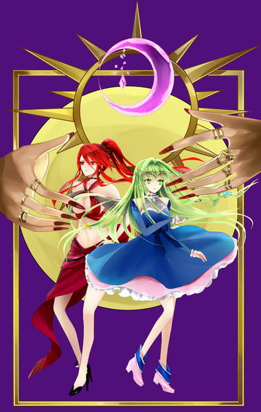
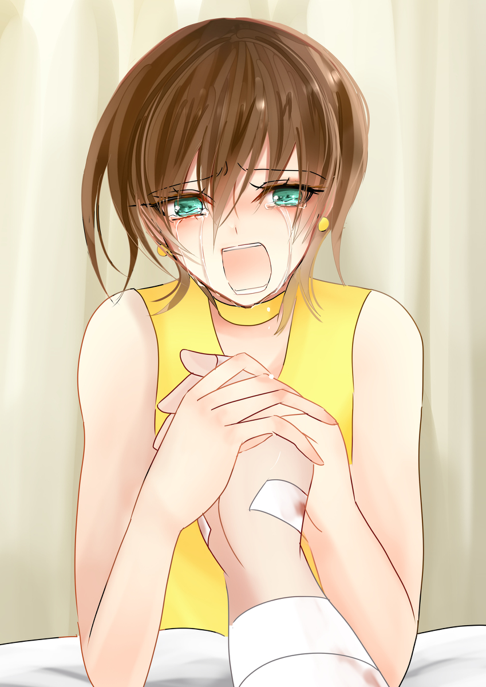

原文来源: [pixiv novel 16180370](https://www.pixiv.net/novel/show.php?id=16180370)
系列: 音楽†SFファンタジー『LOVE WILL』HARMONIXシリーズ
顺序: 7

ミラは監禁されていたものの、怪我一つなく無事だった。
表面上は大きく動揺している様子はない。イクスが来るなり、青ざめた顔でただ『バードは？』と問いかけた。それがフォアグラと呼ばれていた男の本名だとミラは震える声でイクスに説明した。
真剣にイクスを見つめるミラの眼差しに何故かイクスは既視感を覚えた。イクスを見ているようで、ここに居ない誰かに真摯な想いを注いでいる。青ざめながらも、何かに立ち向かうように凛と背筋を伸ばすミラはどきりとするほど美しい。
夜の海風が吹き抜けて、ミラの髪を浚った。乱れる髪をなんとも思っていないかのようにただ真っ直ぐ見つめてくるミラにイクスは思う——ドラマのワンシーンのようだ、と。
詳しく聞かずとも、ミラとバードの間に何かあったことだけはイクスにも察しとれた。
これがミラの切実な愛の告白なのだと、どうしてだかイクスは直感的に悟った。
ミラの無事をレイラに知らせて、乗って来たバイクにまたがって市街地に戻る。バードは無事だとレイラから返って来たメッセージをミラに見せると、彼女は目に見えて安堵した。
バードが運び込まれた病室に着くなり、ミラは部屋の中に飛び込んだ。ベッドの上に横たわる包帯まみれの男を見るなり、抱き着く勢いで傍に駆け寄る。

「バードっ！」

ミラの顔がはじめてくしゃりと歪み、細い両腕がバードに伸ばされた。だがあちこちに巻かれた包帯を見るなり痛ましそうに目を伏せて、抱き着こうとした手をためらいがちに下げてしまう。
そんなミラのためらいにバードは気付くことなく、心底安心したように笑顔を見せた。

「ミラちゃん……！よかった、無事だったんだね……！」

泣きそうになっていたミラの目元が途端にキッと吊り上がる。

「無事だったんだね、はこっちのセリフよ！！あんた、どうしてあんなこと……っ！それに、なんであんたがバードだってずっと言ってくれなかったの……！」

「う、ご、ごめん。ボクも太っちゃったし、こんなおじさんだし……あんな昔のことミラちゃんはとっくに忘れちゃったと思ってて。それこそ、キモイかな、って思うと……言い出せなくて……」

でも、覚えててくれたんだね。
ふにゃりと溶けたバードの笑顔はあまりにも優しい。強いわけじゃあない。お金持ちでもない。かっこいいわけでもない。特別、得意なことが何かあったわけでもない。
夢見がちで、のほほんとしていて、どちらかと言うとバカなヤツで。だけど、あまりにも優しくて。悪いことなんて絶対できない、お人よしで。
昔、ミラが大好きだったお兄ちゃんの笑顔そのものだった。

「忘れるわけないでしょ、バカ……っ！」

胸の奥からこみあげてくる何かをぐっとこらえるミラ。

「私の方こそ、ずっと忘れられちゃったかと思って……、思って……っ」

そのまま耐えきれるとミラは思っていた。だが、飲みこんでいられない何かが自然とあふれ出て、涙がぽろりと零れ落ちる。そこからは、堰を切ったようにぽろぽろと大粒の涙がミラの目からいくつも流れ落ちた。
泣き出してしまったミラにバードはあからさまにうろたえた。キャップを脱いだバードの、思いのほかつぶらで綺麗な目が驚きに丸くなり、何度も瞬く。

「え、な、なんで……？」

「バードが見たいって言ったからテレビに出ようと思えたのっ！世界で一番応援してくれるって言ってたから、頑張ったのっ！バードが、バードが……たくさん可愛いって言ってくれたから、私は可愛いんだって自信が持てたのっ！全部、全部……バードの責任なんだから……っ」

「あ、あのときのこと覚えてたの！？もうかなり昔のことなのに……どうして……」

「そこまで言わせないでよ、バカッ！！」

バードの病院着を掴んで訴えるミラ。そこまでしてもなお、バードは分かっていないようだった。戸惑いがちに目を瞬かせながら、それでもミラを慰めようとそっと頭を撫でようとした。昔していたように手を伸ばして、ミラの頭に触れる直前で止まる。
ぷっくりと脂肪のついた、オジサンの手だ。最近、爪の手入れも怠っていて、少し伸び気味になっている。いくら昔馴染みとは言え、こんな手で触られたらミラも不愉快だろう。
そう思ったバードはさっと手を引っ込めようとしたが、その前にミラが掴んだ。そのまま自分の頭の上にバードの手を乗せる。

「バード、絶対に守ってくれるって言った。約束、守ってくれたんだね」

「み、ミラちゃん？だ、ダメだよ！ボクなんかが……」

「昔は頭撫でてくれてたのに、私が大きくなったらもうしてくれないの？そんなに私のこと、キライ？」

「そっ、そんなわけないよ！ずっとミラちゃんのことは好きで——だ、だけど」

「じゃあ、いいじゃない。別に。このまま撫でてくれれば」

ミラがくすりと小さく笑う。大人びた女性のような。それでいて、無邪気な少女のような、特別な誰かにしか見せない微笑み。

「だって、私ずっと貴方のことが——」

こっそりと部屋の端で二人の様子を見ていたイクスたちが静かに病室を出る。これ以上聞いているのも野暮だと思ったからだ。

『良かったですね！』

病室を出るなり、エレノアナが涙ぐみながらイクスとレイラに耳打ちをする。
三人は頷き合い、幸せそうにミラとバードが抱き合う病室を後にした。

---

何かが砕け散る音が聞こえた。それはとてもイヤな音に聞こえた。
焦りのようなものを感じながら、イクスは一人で首を傾げた。ここはどこだろうか。さっきまで、自分は何をしていたのだろうか。
気付けばたった一人で、舞台のようなものの上に立っていた。足元にはきらきらと光る何かが散らばっている。
ガラスか、シャンデリアか。何か割れやすいものが粉々になってしまった跡のように見える。
異常事態だと言うのに、どこか現実味を感じられないままぼんやりとイクスはそんなことを考えた。
散らばるガラスの色は三色。
赤。

『ごめんね、イクスくん……』

緑。

『イクスさん……どうかイクスさんだけでも逃げてください……』

そして、暗い青。灰色がかった曇天のような、色あせたガラス片。
赤色と緑色のガラスは何かをイクスに訴えかけてきていたのに、青色の欠片だけは一言も発さずにただ黙り込んでいる。
何故だろうか。言葉はなくとも、深い後悔だけは切実に伝わってくる。

『——粉々になったマテリアルを治す方法はないわ。世界は不可逆なのだから。そもそもキュアの存在自体が奇跡だったのよ。それ以上の奇跡にすがろうなんて……くだらない』

冷えているようで、暖かな声がイクスに語り掛けていた。突き放す言葉を口にしながらも、震える声が泣いているかのように聞こえた。

『だから無理よ。諦めなさい、イクス。残念だけど……この子は……』

「嫌だ、諦めたくない」

自分の口から出てきた言葉にイクスは目を見開く。自分ではない誰かに体を乗っ取られてしまったかのようだった。

「今更だ。今更、諦めるなんてもうできない。きっと方法はある……だから、頼む。力を貸してくれ——」

イクスは誰かの名前を呼んだ。何故か名前の部分だけは曖昧な音となってしまって、うまく聞き取れない。
ただどうしようもない絶望感に胸が満たされていて、イクスは自分が泣いているのではないかと思った。だが鏡がなければ自分がどんな顔をしているのかもわからなかった。

——さ……

また、誰かの声が聞こえる。ぼんやりと立ち尽くしていたイクスははっと我に返って空を仰ぐ。無限に続くかのような暗闇。その先から、わずかな光が差し込んだような気がしたのだ。

——……ん

救いを求めるように、必死で耳を澄ませる。

『イクスさん！』

『イクスくん！』

なんだ、エレノアナとレイラが自分を呼んでいるだけか。はっきりと聞こえてきた仲間の声にイクスが安心した瞬間、ふわりと自分の体が持ち上がるかのような感覚がした。
ああ……夢、だったのか。
夢で良かったと安心したイクスは朝の眩しい光に照らされながら、ゆっくりと目を開けた。
