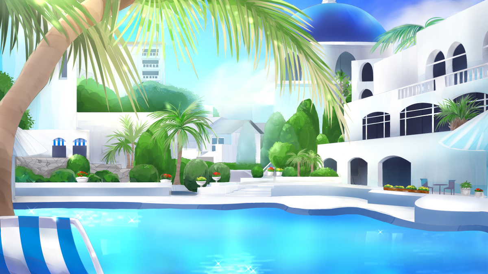
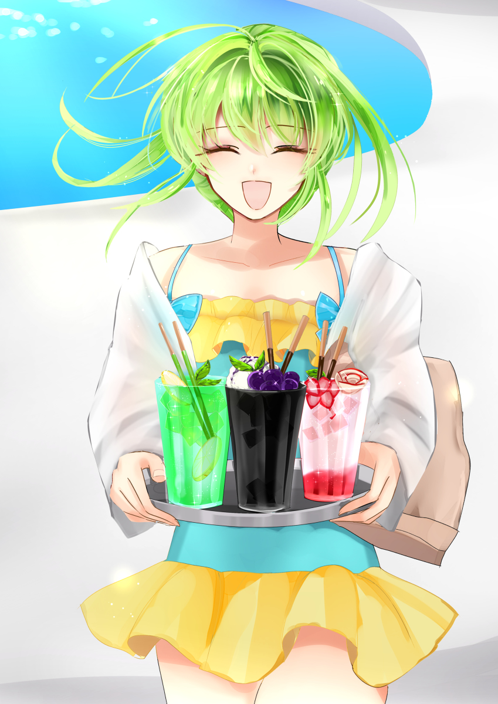

原文来源: [pixiv novel 16180374](https://www.pixiv.net/novel/show.php?id=16180374)
系列: 音楽†SFファンタジー『LOVE WILL』HARMONIXシリーズ
顺序: 8

イクスたちは宿泊しているホテルにある宿泊客用プールでささやかな打ち上げをしていた。せっかくのリゾート地を楽しまないのは損だとレイラが言い張ったためだ。
ビーチチェアに座るイクスを見上げるように視線を向けながら、プールサイドに頬杖をついたレイラがくすくすと笑った。

「イクスくんがうなされるなんて珍しいわよねぇ」

先ほどまで泳いでいた名残で、レイラの赤い髪から水滴から滴り落ちる。水着の胸元が大きく開いていて、プールの水の中で白い胸が揺蕩っている。煽るような水着の赤い布地と対照的な真っ白さに、頭がくらくらしそうだ。
無意識にそちらの方に意識を奪われていたイクスは一拍遅れてレイラの言葉に反応した。

「えっ……あ、ああ……今日の朝のことですね」

「いつもは静かに寝てるから、ちょっとびっくりしちゃった」

「ちょっと夢見が悪くて……」

結局、あの夢はなんだったのだろうか。現実感がない割には妙に生々しく、嫌な気持ちになる夢だった。あれこそ悪夢と呼ぶにふさわしいだろう。何となく夢の内容はエレノアナとレイラには言えないで居た。口に出してしまえば本当にそんな未来が来てしまいそうな、漠然とした不安があったからだ。

「エレノアナちゃんも心配してたわよ……って、あれ？あの子どこ行ったの？」

「え？あ、そう言えばさっきから居なかったような……」

イクスとレイラが少し目を離していた隙にエレノアナがどこかに消えてしまっていた。慌てて探そうとする二人だったが、すぐに遠くから駆け寄ってくる緑髪の少女を見つけて胸をなでおろす。銀のお盆を両手に持ち、小脇に紙袋を抱え、輝かしいほどの笑顔でこちらに向かってきている。迷子になっていたり、攫われていたわけではないようだった。

「こらー！エレノアナちゃん、プールサイドで走ると滑るわよー！」

「あっ！はぁい！歩きます！」

レイラに言われて、走るのをやめるエレノアナ。それでも浮かれた気持ちがエレノアナの足取りを軽やかなものにしている。小走りと競歩の間くらいの急ぎ足でイクスたちの元まで来たエレノアナが銀のお盆を差し出した。

「どうぞ！差し入れです！」

エレノアナが持つお盆の上には三人分のドリンクがある。赤、緑、黒。どれが誰の分かとても分かりやすい三色だ。レイラのドリンクは甘いりんごを飾ったしゅわしゅわのストロベリーサイダー。イクスはブルーベリーと生クリームをトッピングしたコーヒーゼリー風のアイスコーヒー。エレノアナは涼やかなサイダーにはちみつゼリーを添えて、輪切りレモンとミント色のチョコレートキャンディーを涼しげに飾ったドリンクだ。

「お昼にカレーも頂けるそうなので、後で貰いに行きましょう！ルーがですね！同じお皿に二種類盛られていておもしろ可愛いんです！一口だけ先にもらったんですけど、とっても美味しかったです！どっちのルーも甘めで食べやすいんですけど、ちゃんとカレー！！って感じのスパイスの味がして、とってもおいしいんですよ！！」

興奮が冷めない様子でエレノアナは目を輝かせている。

「あら、海辺にカレーって最高ね！でも、誰に貰ったの？」

「ミラちゃんの泊っているホテルの方々です！」

満面の笑みで言うエレノアナにイクスとレイラが動きを止めた。まさか、と顔をややひきつらせながらイクスが恐る恐る問う。

「そ、それって俺たちがこの前忍び込んだ……？」

「はい！ミラちゃんのサインをこっそり厨房のリーダーさんにお渡ししてきました！」

ミラに会うために潜入したホテルで確かにそんな約束をエレノアナは交わしていた。しかしスタッフとして身分を偽っていた身で潜入元にまた戻っていくなど、様々な特殊訓練も一通り受けているイクスとレイラからすれば考えられない話だ。

「そう言えば、さっきサインしてもらってたわね……。二枚書いてもらってるのはなんでだろうとは思ってたけど。まさか、本当に届けに行くとは……」

「だ、大丈夫だったのか？」

「え？はい！全然大丈夫でした！ミラちゃんのサイン、とっても喜んでいただけましたっ！なんでもデビュー初期からミラちゃんのファンだったみたいで、色んなことを知ってて……。あ、バードさんのことも見たことあるし、なんなら話したことあるって言ってました！！」

抱えてきた紙袋にはミラのグッズがたっぷりと入っていた。サインを渡す代わりに厨房リーダーからもらってきたものだと言う。厨房リーダーのお部屋にはミラのデビューCMのポスターまであった、とほくほく顔で話すエレノアナにイクスとレイラは戦慄するしかない。

「お、恐るべしね、エレノアナちゃん……。イクスくん、この子、将来性あるわよ……！私たちで立派なスパイに育て上げましょう……！」

「俺の心臓が持たないのでやめてください……」

すでに胃がキリキリと痛む気がして、イクスは片手でげんなりと腹を抑えた。

「まあ、エレノアナちゃんが無事ならよしとしましょう……！さあ！お仕事のことは忘れて！エレノアナちゃんもせっかくだし泳ぎましょ！」

「はい！あ、私大きい浮き輪借りてきたんです！寝っ転がれるようなヤツです！」

プールサイドに放置するように置かれていた大きなエアーベッドのような浮き輪。誰のものかとイクスも気にはなっていたのだが、エレノアナが持ってきたものだったらしい。浮き輪を抱きかかえてプールに落とすと、浮き輪を追うように水面に飛び込むエレノアナ。
大きめの水しぶきがあげながらエレノアナが一度沈み、すぐにぷはっと元気よく水面に顔を出した。うきうきとそのまま浮き輪によじ登り、まだスペースの空いている自分の隣を軽く叩いた。

「イクスさんも！どうぞ！」

「え、あ、いや。俺は……流石に疲れたから、ちょっと休憩してるよ」

「あ……そうでした。イクスさん、昨日はとても強い方と戦ったんでした……」

しゅんと落ち込んでしまったエレノアナに慌てるイクス。

「ち、違う！そう言うのじゃなくて、その……ええっとだな……あまり、笑わないでほしいんだが……」

「イクスくん、泳げないのよね～。泳げないと言うか、あんまり泳いだことがないから苦手と言うか」

「うっ。はい……」

どう伝えようかと迷っているうちにレイラにずばっと言い当てられてしまう。同僚だった時代に確かにレイラにはひょんなことから知られてしまった記憶はあるが、まさか覚えていたとは。色々な気恥ずかしさでイクスは気まずげにそっぽを向いた。

「その、初めて泳いだときに……泳いでいるつもりがなんでか沈んでいって、だな……それ以来、あんまり泳ぐのは好きじゃない……」

「それ私と一緒にジムの体験行ったときよね！あの時はイクスくんの弱点が意外すぎてびっくりしちゃった」

びっくりするどころか、その時のレイラはにやりと笑ってレッスンで使われていないフリーレーンにイクスを引きずり込んだ。そのままジムの体験もそっちのけで、レイラ先生による水泳個人レッスンが始まってしまったのをイクスは良く覚えている。

「本当に意外です……あ、でも確かに！湖で遊んだ時もイクスさんは泳いでなかったような……？」

「あの時は単純に、替えの服も水着もなかったから」

「でも、イクスくん、水着があったとしても泳がなかったでしょ？」

「…………まあ」

本音としては水着があったら湖くらいは泳いでいた、と虚勢を張りたかったイクスだった。だがここでバレバレの嘘をついても逆にかっこ悪い。目を合わすことはできないまま、渋々イクスは頷いた。
エレノアナとレイラはイクスを無理に泳がせることなく、二人でプールの中で遊び始めた。アイスコーヒーを飲みながら、楽しそうに遊ぶ二人を見ていると、自然とイクスの口元も緩む。平和だ、と思うと同時に、今朝に見た悪夢が影のようにふと心に陰りを落とす。
夢の中で粉々になっていた赤と緑のガラスのような破片。レイラとエレノアナの二人を示唆しているかのような色合いに不安が渦巻く。それに、夢の中でイクスと話していた誰かの言葉から察するに、あのガラス片は恐らくマテリアルなのだろう。

「マテリアルが粉々になる夢、か……。夢だと分かっててもいい気分はしないな……」

「もしかしたら、私の力の名残が残っていたのかもしれませんね」

「！？」

背後からの囁き声にイクスは心臓が止まるかと思った。跳ねた心臓を抑えながら振り向くと、艶やかな黒髪と紫のヴェールが見える。

「ソフィア……！」

岬でイクスの手助けをしてくれた占い師ソフィアだった。ミラを助けている間にどこかへと立ち去ってしまっていたので、てっきり次の目的地にでも向かったのかと思っていたイクスは大いに驚いた。

「かなり強力な予知の力を貴方に託しましたから……何かしらの未来の断片を見たのかもしれません。警告夢という形で」

「あれが、予知……」

「特に貴方は感受性が高いようです……だからこそ、私もあのような形でお手伝いすることができたのですが。悪夢以外に体に変調は？」

「い、いや。特にはない、です」

そっと近づいてきて至近距離から覗き込んでくるソフィアに何故だが気おされてしまうイクス。金緑の瞳は穏やかだが、妖しげな光が宿っていてどきりとしてしまう。
共闘した仲だが、未だにソフィアはどこか掴みどころのない女性だった。

「……問題はないようですね。マテリアルから元に戻して頂いた恩を少しはお返しできたようで何よりです」

ソフィアが視線を遠くの方にやった。釣られてイクスもそちらの方を見ると、バードとミラが居た。あちこち傷だらけのバードは車イスに乗っているが、傷が癒えれば普通に歩けるようになるらしい。それまでは自分が面倒を見るのだとミラは張り切っていた。
ミラはバードの赤いキャップを深く被っているだけだが、不思議と周りにはあの有名女優だと気付かれていないようだった。テレビで見るミラとあまりにも雰囲気が違うからかもしれない。憑き物が落ちたように朗らかに笑うミラは、年相応の普通の少女のようだった。
イクスたちの視線に気付いたミラが大きく手を振ってくれる。遅れて気付いたバードもぺこりと頭を下げた。
二人は助けられたお礼を言いにわざわざイクスたちのホテルまで来てくれていた。
ミラはバードと付き合いはじめたらしい。トゲトゲしい口調でイクスたちにお付き合いを報告したミラだが、頬は赤く、拗ねたような表情はただ照れているのだと分かった。バードの手をしっかりと握ったまま離さないのはミラの方で、見ている方が幸せになるような幸福感が満ち溢れていた。
以前は結婚からの引退を豪語していたミラだが、今は女優を続けていく方に気持ちが傾いているようだった。イクスたち外野からははっきりとは分からないが、どうも決め手はバードの『ミラちゃんはいくつになっても可愛いよ』の一言だったようにみえる。
ミラが女優を続けることについて、ミラ本人よりも彼女のマネージャーとバードの方が喜んでいた。あの二人ったら妙に意気投合しちゃったのよ、とミラが少しふくれっ面をしながらイクスたちに教えてくれた。
バードと話しながらくるくると表情を変えるミラ。拗ねたような顔、怒ったような顔、嬉しそうな顔。様々な表情でありながらどれも幸せそうだ。
ふと、ミラのそんな表情に既視感を覚えて、イクスは首をひねった。一体どこで見たのだろうか……。イクスが悩んでいると、鈴を鳴らすような小さな笑い声が聞こえてきた。

「ふふっ」

「……ソフィア？」

「いえ。私の腕も、なかなか衰えないものだと思いまして」

「え、それってどういう……」

「さて？それでは、また近々お会いしましょう。今度は……どこかの大舞台で」

ソフィアの金緑の瞳が楽しげに細められる。口元を覆うヴェール越しに、うっすらとソフィアが謎めいた笑みが見えた。

「近々、か……ソフィアの占いは良く当たるみたいだからなぁ……」

「ええ。ですがどうかお忘れなく。運命は、自らの手でつかみ取るものだと……」

囁くように言って、ソフィアはどこかへと去って行った。歩き去ったのだとは思うが、ふとイクスの意識がそれたときに視界から煙のように消えてしまった。まるで蜃気楼のような女性だった。
幻の名残を掴むかのようにイクスは手を伸ばす。何も持っていない自分の手のひらをしばらくじっと見つめて、やがて覚悟を決めたように拳を強く握りこんだ。
——運命はまるで未来への約束のようだ。　
いつだったか、レイラに運命をどう思うか問われたときにイクスはそんな答えを返した。そのときは深く考えて言ったものではなかったが、どうしてだか改めて自分の答えが胸の中にしっくりと来る。
約束は守ることも、破ることもできる。優しい約束を守れたならば、それは良いことだとイクスは思う。その一方で、約束を破ることは不誠実で、難しく、どこか恐ろしいことのようだった。約束を破った先に真っ暗闇が続いているような気がして、想像しただけでも気が沈む。
でも。
約束を破れることで守れるものがあるのならば、何を裏切ってでも守り切って見せよう。自らの手で運命を掴むとは、きっとそう言うことだ。
もう迷わないとイクスはとっくの昔に決めていた。

「ああっ！？い、イクスさん！レイラさん！思い出しましたっ！」

レイラとプールで遊んでいたエレノアナが急に大声を出して、慌てたようにイクスのところまで泳いでくる。

「エレノアナ？どうしたんだ？」

「エレノアナちゃん？そんなに急いで泳ぐと浮き輪から落ち——」

「うっ、運命の人！満月の、運命の……きゃあっ！？」

レイラの忠告むなしく、バランスを崩したエレノアナが浮き輪から落っこちてしまう。派手な水しぶきがあがり、イクスは慌てて立ち上がった。

「エレノアナ！くっ……！」

「イクスくん。たぶんだけどイクスくんよりエレノアナちゃんの方が泳げるわよ……って、聞いてないわねぇ」

迷わずに飛び込んだイクスが上げた大きな水しぶきを見ながらレイラはくすくすと笑った。

「そもそもこのプール足付くからそうそう溺れるはずないのよ。ねー、ハピネスちゃん？」

「ピィッ！」

レイラが差し出した手にひらりと青い小鳥のハピネスが舞い降りて、上機嫌に毛づくろいをはじめる。プールサイドの水たまりで水浴びをして、しっとりと濡れた羽毛を乾かそうと羽を広げた。カイポールの熱い太陽がハピネスの羽をあっという間に乾かし、濡れた小鳥はもこもこの青い毛玉のような生き物に変わってしまった。
満足げに目を細めてじっとしているハピネスを見て、レイラはまた小さく笑った。いつも以上に口元が緩みやすくなっている気がして、自分で吹き出してしまう。

「うーん、私もちょっとはしゃいじゃってるかも」

イクスとエレノアナと過ごす休暇に思いのほか喜んでいる自分に気付くレイラ。何故だか、少しだけむずがゆい。だが遊べるときは全力で遊ばなければ損と言うものだった。水に入ったからには、イクスにも一緒にプール遊びをしてもらおう。
不穏な気配を感じたのか、そそくさとハピネスが飛び去る。
チェシャ猫のようににんまりと笑いながらレイラは水の中に潜り込み、見つからないよう静かにエレノアナとイクスの方に泳いでいった。
