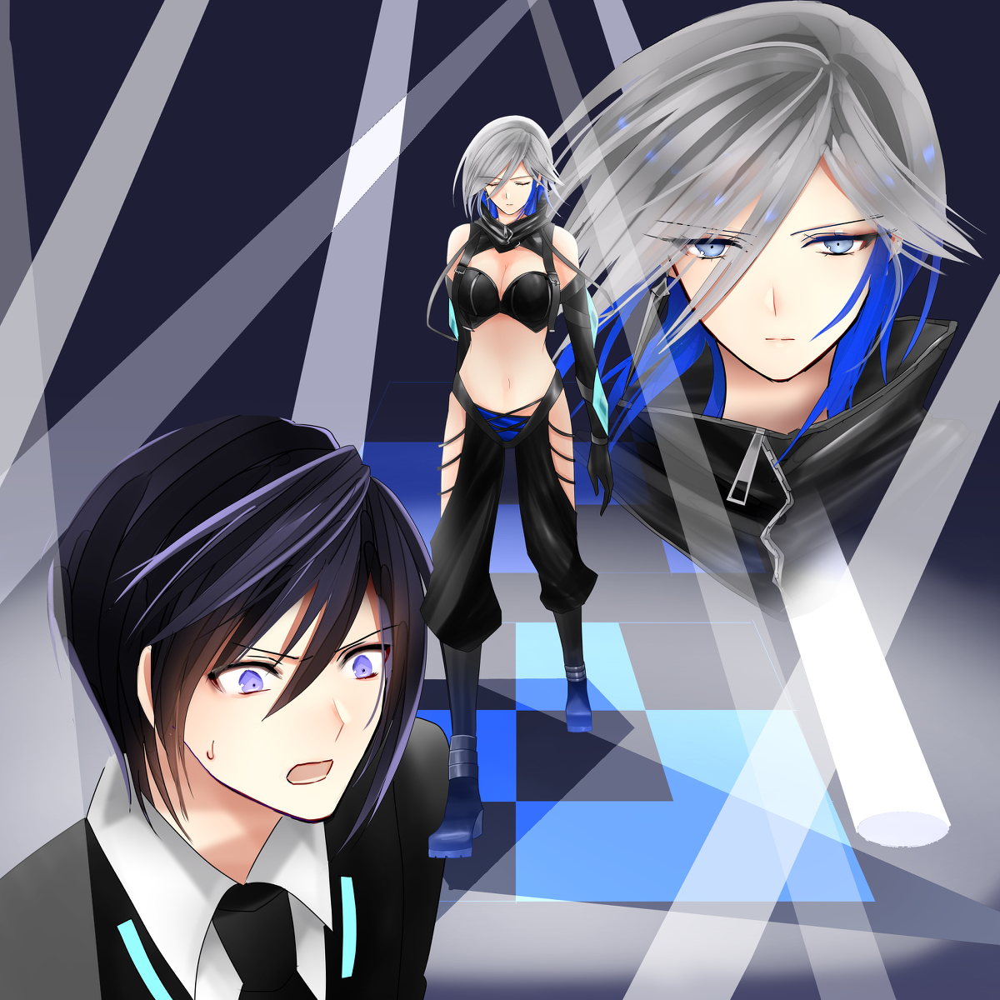
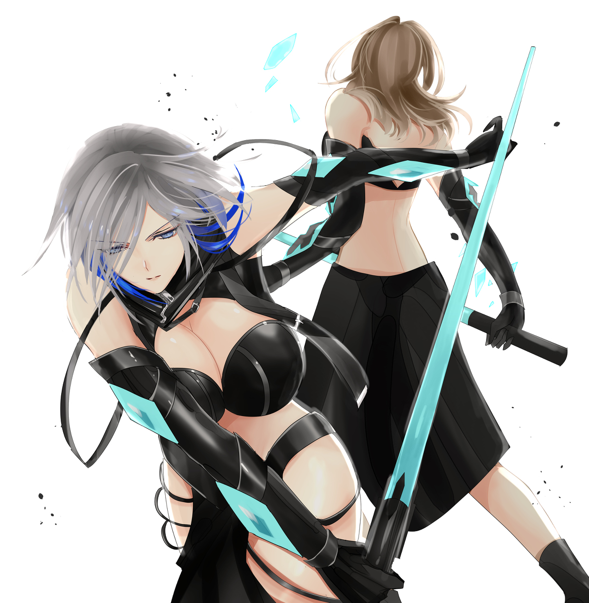

原文来源: [pixiv novel 17357586](https://www.pixiv.net/novel/show.php?id=17357586)
系列: 音楽†SFファンタジー『Relation』HARMONIXシリーズ
顺序: 2

イクスとエレノアナは、試合終了後に慌ててレイラの元へ向かおうとしたが、第３試合を目当てにしている客が会場内になだれ込んできて、席から立つことが出来なくなっていた。
 
「イクスさん…どうしましょう？レイラさんの所に行きたいのに…人が…」
 
エレノアナも焦っているようだが、今下手に動いてエレノアナが迷子になったら元も子もない。
 
「エレノアナ！ダメだ…今立っても入り口に辿り着く前に、はぐれそうだ！」
 
レイラの事は心配ではあったが、元気そうに退場していく背中を見送れただけでもよしとするしかない。
やはり対戦相手の性格を見て、疲れが蓄積しているように見せていたレイラの計算だったのだろう。
 
ここで外に出ようと無理に席を立てば、イクスがエレノアナとはぐれてしまう懸念の方が強い状況になっていた。
 
チェルシーが負けた直後から姿は全く見えなくなったが、チェルシーのファンに言い寄られていたエレノアナだ。
 
それに、この『クオドロ・トーナメント』はさておいても、この地下闘技場の運営側は胡散臭く、ゲノム社の息がかかっている可能性も否めない。。
 
 
「レイラさんなら大丈夫だよ。仲間を信じよう。
それに、これだけの人が注目している試合なら、次の試合でレイラさんにあたる相手かもしれないし！
 
情報収集のためにも、しっかり見ておこう！」
 
「…そうですね！解りました！！」
 
エレノアナが椅子に座りなおしたのを確認したと同時に、気になる声が耳に入って来た。
 
 
『おいおい…次の相手ってあれだろ？ニアにあてがわれた優勝候補だろ？』
 
（優勝候補かぁ…）

イクスはなだれ込んでくる群衆の声に耳を傾け、やはりこの試合は見ておくべきだろうと椅子に深く座りなおした。

本格的な格闘技の試合を生で見るのが初めてのイクスも、今まで感じたことのない高揚感を味わい始めていた。

どんな戦い方をする選手がいるのか情報として知っておきたい気持ちと、自分も一端の男であるからこそエレノアナとは違う気持ちで次の試合も見ておきたい気持ちに駆られる。

イクス自身が選んだ、命を懸けたやり取りの戦闘ではなくエンターテインメントショーとしての格闘技。『クオドロ』に興味と興奮が湧いていたのだ。

 
「俺はよう～これを見に来たんだ！」

いつの間にか、イクスの隣の席の男が替わっていて、その横に座す男と話をしている。
それぞれのファイターにファンが居て、こうやって席の売買などもされているのだろうか？

何かに熱くなったことがないイクスからしたら、この会場内で起こることすべてが異次元のようだった。

「ゾネスって言ったらお前…クオドロ荒らしだろ？」
「ああ！去年は出なかったが、本来の大本命って言っても過言じゃねぇ！ニア対ゾネスってのが、今回の大本命だ！」

（次の試合に人が押し寄せてきている理由は、そのゾネスというファイター目当てなのか… ）

これだけの人を魅了するファイターに、イクスも興味が湧いた。

「凄い人気ですね…ぞの…ゾネスさん？って方！楽しみですね！」

エレノアナもそれなりに楽しんでくれている事を感じて、イクスは安堵した。

一般的な子供時代を歩んでいれば、友達と格闘技の話題で熱くなることもあったかもしれないが、イクスはそうではなかった。
射撃を始めた理由さえ自分の居場所を作るためであり、外界からの逃げでしかなかった。

初めて肌で感じるエンターテンイメントに特化した格闘技戦を観戦して、楽しむことが出来るだけの心の余裕を持てる日が来るとはイクス自身も想像していなかった。

だが、エレノアナは違う。自然豊かな田舎に育ちブランコで遊ぶような健全な少女だ。
エレノアナが格闘技を見て、純粋に楽しいと言ってくれることが単純に嬉しい…。

本来の目的を忘れている訳ではない。
でも、今は少しだけ異世界だと思っていたこのコロシアムでエレノアナと共にレイラを応援する観客になりたいと思えた。

ライトが一斉に消えて、コロシアムが一気に揺れる。

『おおおおおおおおお！！！！！！！』

 大きな歓声が巻き起こる。

 
レイラやチェルシーの登場の時よりも、激しく地響きがするくらいの歓声だった。
 
「始まりますね！」
「ああ！！」
イクスは、息を飲むようにゆっくりとコロシアムに視線を向ける。
白と黒のストライプを模したような、ライティングがクルクルと会場内を沸き立たせる。
 
そこに、ピンポイントでスポットライトが灯された。
 
そこには、全く予想しなかった…影が浮かび上がる！
イクスが、見間違えるはずはない。

「…グレイ！！！…なんで！！」

イクスは全身の血液が一気に凍るような悪寒を感じて、咄嗟に身を乗り出した！
 
「イクスさん？？」
 
エレノアナが心配そうに、イクスを見上げる。
 
マテリアルを人に戻す旅を続けてきて、何度となく危険な目にはあっている。

しかし本当に生き残れるチャンスさえないと悟ったのは、以前マテリアルを追ってリゾート地であるカイポールに訪れた際に、マテリアル保有者であった女優ミラが誘拐された時だけだ。

まるで昨日の事のように鮮明に思い出せる、恐怖と殺気。

あの数カ月前に対峙した…ゲノム社の暗殺部隊を名乗った剣士。グレイに対してだけだった。
 
もう二度と会いたくない。
 心底そう思ったし、思っている。
 
数カ月たったとはいえ、到底勝てる気がしない相手だ。
あの時はソフィアが未来予知の力を貸してくれたから、ミラを救い共に仲間のもとに戻れたが…。
 
そうでなければ、イクスは今此処に居ない。そう断言できる。
 
もし、本当に…あの、グレイだったら…！？
 
 
（何故…？どうして…？なんの為に…？）
 
「イクスさんってば！」
エレノアナが必死に、イクスの異変を心配して声を掛ける。
 
「ああ、ごめん。エレノアナ…。」
イクスはエレノアナに心配かけるまいと、椅子にゆっくりと腰を掛けた。
 
しかし、思い出すだけで、内臓がひっくり返ったような違和感を覚える。
 
 
人を殺すことをなんとも思っていないあの軽快な口調は、人の命も自分の命も軽んじているように感じられた。
 
イクスはそれが、何よりも怖かった。
 
『恐れる心』を持たないものが、一番怖い。
 
今まで旅を通して、色んな思惑を持った人間と対峙してきたが、グレイだけは明らかに何かが違った。
 
まさか、だよな…。
 

コロシアムに立つのは自分ではないのに、脂汗が止まらなかった。
そんなイクスを見て、エレノアナが心配そうに、イクスの手を握る。
 
「もしかして…あの人が…、ミラちゃんを攫った…人。グレイ…さん…ですか？」
 「ああ…。間違いない…グレイだ！」
 
銀色の髪を靡かせ、颯爽と歩いている。
レイラと違いシンプルな黒いコスチュームに身を包み、パッキリと割れた腹筋が目に付く。相変わらずの隙のなさだ。
 
コロシアムの中央と観客席という距離があっても、目があえば動くことは出来ないだろう。そこに居るだけで、殺気とも違う…場を凍らせてしまいそうな独特のオーラを纏っていた。
 
「そんな人がトーナメントに参加するなんて…やっぱり、ゲノム社が何か関係しているのでしょうか？」
 
こっそりと耳打ちしてくるエレノアナだが、関係していたとしてもいわば暗殺部隊のような彼女を、表舞台にあげる理由がイクスには想像がつかなかった。
 
 
その後また地鳴りのような声に、二人の会話はかき消された。

「…見たことないファイターだが、あの威圧感は只者じゃねぇな！」
「こりゃ、面白くなりそうだ！！」
 
声援を送る声からどちらに賭けるかの会話にすり替わっていく。

ここに集まっている輩の本来の目的は、純粋に闘技を見たいよりも、賭けの方が重要なのだろう。
 
イクスは複雑な視線をコロシアムに送った。
 
さっきとは打って変わって、激しいオレンジ色の蛍光色がコロシアム包み込む。
優勝候補の一人というだけあってか、随分と凝った演出が仕込まれている。

 
そこにスポットが当てられ、獅子を連想させるような茶色くうねったロングヘア―を揺らしながら、逞しい女性が入場してくる。
 
『クオドロ荒らし』の名に相応しく、確かに隙は全く無い。
 
歓声に応えて手を振っている間でさえ、間合いに入ってくる者があれば瞬時に斬り捨てるような殺気を身に纏っている。
 
水晶に金箔を散らしたように冷たく光る瞳に映りこんだら、それこそ『蛇に睨まれた蛙』状態になる気がした。
 
 
「ねぇ？あんた…見た事ないんだけど？初めて？…まぁ…でも良い面してる。嫌いじゃないわ…。
だけど残念だよ！初戦からあたいが相手で、ご愁傷様！」
 
ゾネスは確かに賭博のトーナメントに慣れているのだろう。
客を楽しませるように、グレイを挑発していく。
 
しかし、グレイは全く興味が無いようだった。
 
イクスに対してはあんなに饒舌に話していたのが別人かのように、ただ目前に居る獲物を狩る。鋭い視線を返すだけだった。
 
「ふふふ…良い目だねぇ！！！やるよ！」
 
ゾネスがビームソードを光らせ、姿勢を低く構えた。
 
 
「あの構えは、古武術！」
 
イクスがジェノサイド社の警備の訓練を受けている時に、一度だけ見たことがある。
体術の中でも最古で最強と言われている武術であり、それを会得したものは僅かしかいないと言われている武術のはずだ。
 
隙が無く間合いが広いため、対戦相手としてはとても厄介だ。
銃撃戦であっても動向が読みにくく、動きを止めるのにも苦労すると教わった事がある。
 
あんな武術の使い手が剣を持ったら、どうなるのか！？
 
さっき迄の高揚感が嘘のように、イクスはグレイの出方を神妙に見つめる事しか出来なくなっていた。
 
観客たちもいつの間にか息を潜めるように、歓声を止めて二人の覇気に飲み込まれている。
 
互いに一歩も動かない。
否、動けばやられる互いの間合いを計っているようにも見える。
 
明らかに力任せに突進していく戦法に出た、チェルシーとは格の違いを漂わせていた。
 
 
しかし、勝負は一瞬で終わった。
 
 
ガシャガシャガシャ！！！！カラン…！
 

 
恐らくこの会場の中で、その瞬間に何が起こったのか目で追えたのはイクスただ一人だったかもしれない。
 
ほんの一瞬。
ゾネスが半歩間合いを詰めた瞬間にグレイが飛び上がり、無駄な動きを一切せずに構えて居るゾネスの腕に四発の突きをいれてマテリアルだけを破壊し、ゾネスの背後に着地したのだ。
 
ゾネスが剣を振り上げた時には全てが終わり、グレイのマテリアルには掠りもしなかった。
 
余りに一瞬の出来事に、会場中がまさにシーンとなった…。
 
声も出せないとは、この事を言うのだろう。
それを目で追えたイクスでさえ、余りの恐怖に声が出なかった。
 
最初に立ち上がって拍手を送ったのは、イクスの隣に座っていたエレノアナだった。
 
「きゃー！！凄い、凄い…なんかよく解らないですけど、本当に一瞬で勝負がついてしまいました！！何にも見えなかったですけど、とにかく凄いです！！！！」
 
エレノアナの歓喜に我に返った群衆たちも、こぞって立ち上がり拍手と歓声を上げた。
 
『なんだよ、アイツは無敵だ！！』
『遂にきやがった、大本命の負けなしゾネスを打ち取るやつが！！』
『俺は、これから全部をあの、新人に賭けるぞ～！！』
 
いつの間にか、コロシアム中から『グレイ！！グレイ！！グレイ…！！』という歓声に変わっていった。
 
しかしグレイ本人は、顔色一つ変えずに全く興味なさそうにコロシアムを退場していく。
 
 
居たたまれないのは、対戦相手のゾネスだけだろう。
 
 
ゾネスは構えを解くことなく、勝手に試合を終わらせ背を向けて去っていくグレイの背中に向かって斬りかかりに行った。
 
「危ない！！！」
 
それに気づいたイクスが声を上げる前にグレイ本人が瞬時に姿を消し、反対にゾネスの首に剣を突き付けている状態になっていた。
 
群衆は、一斉に息を飲み込む。
 
「解ってるだろ？これはゲームだ。
ゲームじゃなかったら…あんたはもう死んでいる。お遊びに付き合ってるほど、暇じゃないんだ…」
 
淡々と告げるグレイの表情に、イクスは何故か愁いを感じた。
 
 
「イクスさん…。あの人は、本当に死神…なんでしょうか？」
エレノアナがイクスの顔を覗き込んだ。
 
「‥‥」
イクスが知っている、数カ月前に出会ったあの凶器の塊のような彼女には、イクスにも見えなかった。
 
「何故か…とても悲しそうに見えます。すごく、苦しそうに見えます。」
「ああ…でも。ミラさんを誘拐したのは、彼女だった。俺も、殺されるかもしれないと覚悟した…」
 
あの時は心底、二度と会わないで居られるようにと願った。
今度会ったら、敵わないと思い知らされた。
こんな試合を見せつけられて、今でも敵う気はしないけれど、会いたくなかったグレイとは違う気もした。
 
「きっと…この数カ月で何かあったんでしょうね。
人は変わるものですから。変わりたいと願って、変わっていくものだと私は思います。
 
ほら！ティアちゃんだって、ミラちゃんだって、絶対自分は出来ないって言いながらも変われたんですから！」
 
エレノアナに言われると、そうなのかもしれないという気になってしまう。
 
「死神なんて…言われていたくないですよ。きっと…」
 
シュンとしたエレノアナの横顔が眩しい。
 
「そうだね。望んではいないと思うよ。彼女だって…多分。でも…」
 
それでも、命を狙われた事がある相手をすんなりと受け入れる準備が、直ぐに出来る訳ではない。
 
 
そして何より、このトーナメントが進んでいけば、レイラはグレイと対戦することになる。
それが、正直に怖い。
 
 
「次、始まりませんね？」
「ん？？？」
 
慌てて右往左往している、運営サイドのスタッフの姿がちらほら見えた。
 
 
本来は５分１ラウンドを３ラウンド戦うシステムの所を、ものの１０秒で終わらせられた為、運営が追い付いていないのだろう。
 
 
「この後の試合は…前回優勝したニアだね。」
（あんな試合を見せつけられた後は、やりにくいだろうなぁ…）
 
客足も一旦休憩とばかりに会場から出て行く波が出来ている。
 
「どうしますか…？」
「んん…この波に便乗して外に出ないと、レイラさんに会えなくなるかもしれないから、とりあえず出ようか？」
「はい！！」
 
試合を観戦したいという気持ちは完全に失せて、早くレイラにお疲れ様を言いたい気持ちにエレノアナもイクスもなっていた。
 
 
きっとこの会場の何処かで、レイラも今の試合を見ていたはずだ。
 
どうやってグレイを攻略して優勝景品である『スカイブルーの瞳』を手に入れるのか。また、前回の優勝者であるニアを説得して、前回の景品を渡してもらうのか…。
 
 
まさに、暗雲漂う【クオドロ・トーナメント】の初戦となった。
