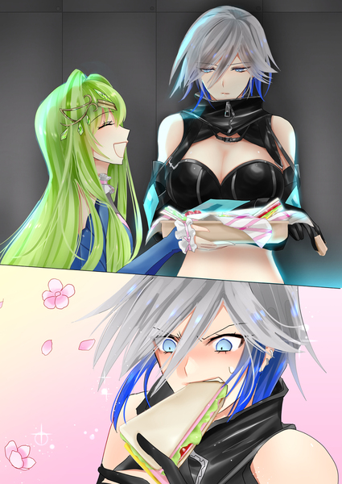

原文来源: [pixiv novel 17357600](https://www.pixiv.net/novel/show.php?id=17357600)
系列: 音楽†SFファンタジー『Relation』HARMONIXシリーズ
顺序: 3

クオドロ・トーナメントが開催されているコロシアムは、熱気に包まれていた。

イクスとエレノアナは一旦レイラと合流しようと席を立ったが、何処に向かえばよいのか分らず、人の波に押し流されるまま入場口の方に向かっていた。

地下闘技場だからなのかコロシアムに入った時から端末の利用が出来ず、レイラと何処で待ち合わせ出来るのかの連絡が取れない。

このまま流れに身を任せ、外に出て連絡を取るべきなのか？

出場者のレイラが闘技場内を歩くわけにもいかないのだから、とにかく自分たちから行くしかないとイクスは考えていた。

イクスはエレノアナとはぐれないように、手を繋いで人の波に便乗して観戦会場から何とか出られて安心したものの、エントランスの酷い混みようにげんなりする。

そもそも人混みが得意ではないから、自ら人混みが予想されるところに行ったことが無い。
何もかもが初めての体験だった。

世間慣れしているレイラが居ない今は、イクスがエレノアナを先導して守らなければならない。

レイラの為にエレノアナが早朝から用意した昼食が入っているショルダーバックは、席を立つときにイクスが持って出てきたのは良いが、イクスの後ろを歩くエレノアナが人にあたる度に「ごめんなさい！すみません！」と声を掛けている姿がとても愛らしくて、握られている手に力が入る。

「イクスさん？」

エレノアナが不安げにイクスを見上げてきた。

「はぐれないようにね！」

イクスは少し照れたように、エレノアナから視線を外した。

闘技会場の方から大きな歓声に乗って『ニア』コールが聞こえてくるので、前回の優勝者のニアは善戦しているようだ。

本来の目的からすれば、一番観なければならない試合ではある。

レイラが今回の大会で優勝して優勝景品となっている『スカイブルーの瞳』と名付けられたマテリアルを回収するだけではなく、前回優勝勝者のニアが持っている前回大会優勝景品のマテリアルの回収も目的の一つであり、どちらかと言えばニアへの説得の方が簡単ではないだろうとイクスとレイラは当初は考えていた。

しかし、状況は変わった。
グレイの登場は、イクス達にとって想定外でしかない。

今は試合の動向よりも、レイラに労いの言葉を掛けたい気持ちの方が先立ってしまう。

それを遮る波にいら立ちを覚えそうになるイクスを引き留めてくれるのは、紛れもなくエレノアナの存在だとイクスは改めて痛感する。

きっと、何があってもエレノアナとレイラとの３人でなら乗り越えて行ける。
不意を突かれたように見せつけられた、絶対的な脅威ともいえるグレイが試合にファイターとして出場していた事だって…きっと。

そんな思考を巡らせているとエレノアナの手が、イクスが進もうとする方とは逆の方にクイッと引っぱり、ハッとイクスは我に返った。

「エレノアナ？どうした・・・？」

「あそこから入りませんか？」

エレノアナが指さす方には【関係者通用口】という看板が立てられている。
壁の一角を切り抜いたようなドアがあり、その前には簡単にくぐれそうなロープが張られていた。

「私たちも、出場者の関係者ですから！」

エレノアナは、時々突拍子もない事をしでかすし言い出す。
それはマテリアルを探す旅で良く知ったつもりでいたので、今更驚きはしなかったが、すんなりあのドアが開いてくれるならそれは有難いが、そんなに上手く行くのか？

という一抹の不安を抱きつつも、イクスはショルダーバックを胸に抱えなおした。

「試してみようか。」
「はい！レイラさんにお疲れ様を早く言いたいです！」

エメラルドグリーンに輝く微笑みに背中を押されて、イクスは入り口に向かう人の流れを逆流するように姿勢を変えた。

「すみません！通してください！！」

試合に興奮している人の波は壁のように重かったが、イクスも腹筋を使って大声を出してドアを目指して逆流を始めた。

イクスの声をサポートするかのように、エレノアナの澄んだ声が闘技場の淀んだ空気と熱気を浄化していくように響くと、自然と目の前の壁が開かれていくように二人の前に道が出来て行った。

「ありがとうございます！」

エレノアナの紡ぐ声が謝罪の言葉から、感謝の言葉に変わっている。

最初はケチをつけて来た強面の観客たちも自然と「仕方ないなぁ」とばかりに身を寄せ、二人に道を作ってくれた。

イクスとエレノアナが【関係者通用口】に何とか辿り着き、ロープを跨いでドアに手を掛けると思いのほか簡単にドアは開いた。

「良かったですね！」
「ああ！エレノアナのファインプレーだね！」

コロシアムに立ち入ってから初めて人の居ない静かな空間に逃れられたからだろうか、少しだけ肩の力が抜けた。

格闘技を見るのは初めてで、しかも生で観戦するのも初めてだったからか緊張していたのだろう。

手汗が酷い…。

それに気づいた時、イクスは人波の難を脱したにも関わらず、まだエレノアナの手を握っている事に気づき慌てて手を離した。

「あ・・・ごめん。俺、手汗が・・・」
「いえ！私も実は、凄い緊張していました！
イクスさんが傍に居てくれたから不安はなかったですけどね。
興奮したし、楽しかったですね！」
「ああ、そうだね。」

イクスはたまに、実はエレノアナは大物なのではないかと思う時がある。

自分の方が小心者のような気がするが、きっとそんな弱音を吐いたらレイラに大笑いされそうだと苦笑いを浮かべるだけに留めた。

関係者通用口は会場エントランスよりも明るく、エレノアナの笑顔がはっきりと見える。

（安心していたのは、俺の方だよ。）

そうは思っても照れくさくてイクスは何も言えずに言葉を飲み下し、抱えていたバックの中の昼食が寄れてないかを確認した。

せっかくエレノアナが早くから起きて用意してくれたお弁当だ。
もみくしゃにされて真っすぐ持てなかったのが心配だったが、白いタッパーが何重にも小分けになっていたからか、ひっくり返ってはいなかった。

「良かった。お弁当も無事みたいだけど、こんなに作ったの？」

「はい、つい・・・気合い入れすぎちゃって。」

自分のできる事で支え合う仲間。
エレノアナなりの姿勢を見せつけられた気がして、イクスの緊張もすっかりほぐれてカバンのジッパーを閉めると、改めてそれを肩に背負いなおした。

「じゃあ、早くレイラさんを探さないとね！」

「はい！！」

コロシアムの会場内の音が漏れないように、防音にでもなっているのだろう。
関係者通路は静かで、人もほとんどいなかった。

たまにスタッフの腕章を付けた人が小走りに通り過ぎて行く。
これだけの集客をしてのイベントで忙しいからか、侵入者であるイクス達に声を掛けてくる様子はない。

掲示されている見取り図を確認すると、出場者控室の区画はイクス達が立っている通路の先のようだ。

「レイラさん。びっくりしますかね？」

エレノアナの足取りが自然と軽くなっている。
コロシアムに入る前には端末で連絡を入れ合う予定でいたが、取れないという事が判明したら、レイラならばその場を動かず待つはずだ。

つまり、そこにレイラは居る。
そうエレノアナも疑っていないようだった。

無機質で人工的な白い廊下を歩いていると、一瞬だけ歓声が聞こえた。

第４試合が終了したようだった。

選手が退場して控室に戻るために、防音のドアを開けたのだろう。
どっちが勝ったのかは、その歓声を聞けばすぐに解るくらいに『ニアー！！』という声が名残惜しそうに消えていく。

（という事は、第５試合はニアとグレイになるのかぁ。）

今回の試合に参加している選手は８名。それぞれ勝ち上がり戦で３回の試合が行われる。
今の試合で、勝ち残りの４人が決定したという事だろう。

初戦で見たあの小柄な選手とレイラ。
そして、前回の優勝者であるニアとゲノム社の死神グレイ。

身内贔屓ではなく、レイラは次の試合も間違いなく勝ち残る可能性が高い。
身体能力と判断力は明らかにレイラの方に分がある。

しかし決勝で当たるのが、ニアでもグレイでも相当苦戦を強いられるだろう。

その時だった。

今まで、殆ど人を見かけなかった廊下の後ろから駆け足の音と、金属音が迫ってきて先を歩くエレノアナにイクスが手をだして、端に寄せた。

「すみません！タンカーが通ります！！」

上下水色の服を纏った数人の男たちが、タンカーを押して駆け抜けて行く。
タンカーに乗せられているのは、ニアと戦った選手だろうか？

詳しい様子は見えなかったが、自力で動けなくなるくらいのダメージを与えられたという事は解る。

イクスとエレノアナは敢えて何も言葉を交わさずに顔を見合わせ軽く頷き合うと、出場者控室がある方に駆け出した。

「やっぱり来てくれた～」

レイラの明るい声が二人の足音を遮った。

自動販売機が並んでいるロビーのソファーチェアに、長い足を組んで悠々とした姿でレイラが二人を待ってくれていたのだ。

「レイラさん！！お疲れさまでした！！」

エレノアナがいつもよりワントーン高い声で、『待ってました！』とばかりにレイラに飛びついていく。

第一声は絶対にそういうと決めていたかのようなエレノアナを見て、再び襲われた緊張感が少しだけ緩むイクスだった。

「お疲れ様です。ナイスファイトでしたよ！」

イクスも負けじと親指を天井に向けて、レイラを労う。

悪戯っ子のように笑って見せるレイラは特段なにも変わらまい様子で、気ままな猫のように伸びをしてから手をひらひらさせてイクスを呼んでいるようだった。

「思っていたより、結構強い選手が多そうで困っちゃうわよ。」

さっき運ばれていった選手の姿は、レイラも見ていただろう。
それでも、こうして笑って流せるあたりがレイラらしいと言えばらしいし、イクスよりも大人な一面だったりする。

「それより、お腹空いちゃった！」
「お待たせしてすみません。人が凄くてなかなか闘技場から出られなくて！」

エレノアナがレイラの隣に座ると、レイラの試合を見た感想や観客席であった事を身振り手振りつけながら説明し始めた。

（まるで、姉妹みたいだ・・・）

そう感じながらも、この数時間が数日のように思えてイクスもレイラの元気な姿を見ているだけで、和やかな気持ちになれた。

闘技場に立っていた時の、『炎の戦闘の女神』ではない。
そこには、いつものレイラが座っていた。

「怪我とかは、してませんか？」
「うん。私こう見えて、受け身は得意なのよ。イクスくん。」

イクスはレイラとエレノアナが座っているチェアの前に置いてある、低めのテーブルに抱えていたバックを置き開けるはエレノアナがするべきだろうとエレノアナの前に滑らせた。

エレノアナは目を少し細め『ありがとうございます』とイクスに伝え、イクスも首を少しだけもたげて『どういたしまして』と合図を送り返す。

「レイラさんの勝利を願って、沢山作って来たので食べて下さい！」

バックからは小分けになったタッパーが５つと水筒が取り出され、小さなテーブルに広げて置くことは出来ないほどになっていた。

「凄い！ありがとう～！！これを楽しみにしていたのよね！」

レイラの最近のお気に入りは、エレノアナ特製マスタードだ。
それを、パンに野菜たっぷり入れて挟むだけで、その辺で食べるサンドイッチとは格段の差になる。

どうやって作っているのかをレイラが聞いても、エレノアナは教えてくれなかった。
実家で作られていた物なのか？という問いには違いますと答えるだけだった。

イクスとレイラと旅を始めるようになって、ジャンクフードを好むイクスの味覚と高級志向なレイラの味覚。
その両方に美味しいと思われるものを、エレノアナは作れるようになりたいと考えて考案された、まさに特製のマスタードだった。

酸味と甘みをつけて、辛すぎる物が不得意なエレノアナでも食べられるように工夫を繰り返した一級品だと思っている。

作り方を教えないのは、リンゴを擦って蜜だけを絞る工程や、微妙な調合のバランスが手間だという理由もあるが、何よりも２人の為にエレノアナが作りたいからという子供っぽい独占欲の方が強かった。

レイラは特に、最近はなんにでもマスタードを付けて食べてくれる。
その分減りは早いが作り置きが出来ないので、このサンドイッチを作るためにエレノアナは昨日の夜にキッチンに籠って作ってくれていたのだ。

イクスとレイラの間で暗黙の了解ができていた。
『マスタードを作ってくれている』だから、エレノアナには声を掛けないでおこうというものだ。

パンに挟まれているレタスやトマトからはみ出るくらいに見えるマスタードに、レイラお気に入りのハムを挟んだ特性サンドイッチに食いついたレイラは、言葉にならないうなり声をあげる。

（本当に、気まぐれな猫みたいだ）
イクスが微笑む。

そんなレイラの前にエレノアナがコーヒーを置いた。

「コーヒーは流石に淹れたてではないですけど。」
「エレノアナちゃんのコーヒーは、いつ飲んでもおいしいから問題ないわ！
あ～胃が癒やされるって、こういう事よね！」

本当に腹を空かせていたのだろう。
レイラは次々手を伸ばして、サンドイッチを頬張っていく。

「じゃあ、俺もいただくよ！」

沢山あるとはいっても、このままではレイラに全部食べられそうな勢いを感じてイクスも手を伸ばし、口に含む。

口内に広がる爽やかな酸味と甘みが、野菜本来の味を引き立てるようでやはり美味しかった。

「本当に、美味しいよ！」
「良かったです。」
「時間が経っても美味しい料理を作れる女は、良いお嫁さんになるのよ？エレノアナちゃん」

レイラが頬張りすぎた口を押えながら、悪だくみしている表情を浮かべた。
エレノアナは案の定顔を赤らめて、ソワソワといたたまれない様子で両手で顔を隠した。

「お嫁さんなんて！まだ、考えた事ないですけど・・・。」
「将来の話よ。あははは～。」

何事もなかったように、何事も起こっていないかのように振る舞うレイラ。
イクスにとっては、そんなレイラも愛おしい存在だ。

選手というよりは戦士としてこの場に居るレイラには、今こうしている時が心身の休息時間なのだろう。

それでも、いつまでも現実から視線を逸らしている場合ではない。

腹が十分に満たされた頃合いを見計らって、イクスから口を開いた。

「レイラさんは、第３試合。見ましたか？」
「んん。」
「彼女が・・・ミラさんが誘拐された時に、俺が対峙した・・・ゲノム社の死神を名乗るグレイです。」
「やっぱり、そうかぁ。」

レイラの視線は、宙に浮いたままだった。
恐らく、記憶した試合をもう一度自分の中でプレイバックしてシミュレーションでもしているようだったが、急に頭を横に振ってからチェアに深く身体を沈み込ませる。

「レイラさん。勝てますか？」

「いや、無理ね！身のこなし、反応速度、彼女は次元が違いすぎるわ。」

レイラが余りにもあっさりと敗北宣言をしたことに、イクスは少し驚いた。

「第１試合の相手なら間違いなく勝てる。第３試合のあの強そうな古武術使いの方だったら、可能性はあると思った。でも、彼女は・・・その比じゃない。
ある意味、常人ではないって事。どうしたもんかなぁ。」

あくまでも冷静に少しの誤差もなく、相手の実力を見極めていくレイラが両手を上げて、まるでお手上げとばかりに振る舞うが、慎重に何かを考えているようにその眼差しは真剣なままだった。

「あのう、私たちグレイさんの試合に圧倒されて観られなかったんですが、前回の優勝者のニアさんの試合は見られましたか？」

エレノアナが心配そうにレイラに声を掛けた。

ニアにやられただろう選手が、タンカーで運ばれて行くのを一緒に目撃したイクスも息を飲んだ。

「ああ、控室のモニターで見たわ。随分と見た目は地味なのに、やることは派手だったわ。」

ニアのデータについては、前回の優勝者だけあって集める事はできていた。

田舎から出てきた無名のファイターで、今回グレイに倒された『クオドロ荒らし』の異名をもつゾネスが他の大会に既に出場が決まっていたため、殆どが新人の中で苦戦を強いられたが見事に優勝した少女らしい。

優勝者としてアンダーグラウンドの記事には取沙汰されていて、優勝の証であるマテリアルを胸に飾っている写真をイクスも数枚目にした。

その中でもひときわ目立つ記事が、クールビューティーという表記と共に、揶揄したように出場前の写真と出場後の写真を並べて掲載して『ビフォーアフター』と書いてあるものだ。

大会で優勝することが、出場選手たちにとってどれだけ人生を一変させる事なのか。

イクスには想像も出来ないが、写真を見る限りでは一目瞭然と思えた。
いたって普通の地味な女の子が、優勝後には挑発的な笑みを零すファイターモデルへと見事な転身を果たしていた。

「ニアに勝てるかどうか、正直、まだイーブンかなぁと私は思ってる。
ただ、勝つだけなら方法が無いわけではないけど、その後に彼女のマテリアルを譲って欲しいという関係でとなると、なんともね。」

レイラの表情が曇るのと同時にエレノアナの瞳に影が落ちる。
エレノアナはただ、純粋にマテリアルにされてしまった人を救いたい一心で此処に居るのだろう。

初めて見る格闘技を純粋に楽しんではいても、今回はマテリアルを取り戻す為に参加しているのだ。それを忘れている訳はない。

レイラがニアを下して優勝し、競技人としての友好を深める事が出来たならとエレノアナは信じていたのだろうが、イクスには懸念があった。

それはまさに、ニアの変貌を特集したあの記事だ。
優勝という脚光を浴びて、その景品を肌身離さず持っているという事は、ニアはマテリアルの力を既に知っているはずだ。

ニアの所有するマテリアルがどんな音を奏でて、どんな能力があるのは解らない。
それを手放すように説得する為に剣を交える事をレイラは望んでいるが、それ以前の問題が山積みになってしまった。

レイラに会いたいと願う気持ちで、エレノアナが『ありがとうございます』という音を響かせ、人の波が動いたようにはいかない。

ニアの野心と、理解不可能なグレイ。

その二大巨頭が立ちふさがり、どちらが勝ったとしてもその先の問題は想像以上に厄介な気がしてならなかった。

もう既にレイラも決勝戦にどちらが勝ち上がり、どう対応するべきか計画を立て始めているように見える。
宙を眺めたまま、大きな胸の前で腕を組んで黙り込んでいた。

レイラの予想も、恐らくグレイの勝率の方が高いだろう。
しかし、はっきりとグレイ相手では無理だと言い切った。

そうなった場合、手合わせしていないニアをどう説得するのか？

『スカイブルーの瞳』という名のマテリアルがグレイの手に渡ってしまったら？

最悪な想像はしたくないと思うイクスだったが、深淵を見つめる紅い瞳はそれを最悪とはとらえずに、策を練っているように見えてイクスは少し反省した。

（前線で戦っているレイラさんの前で、負けたらなんて・・・失礼な事を・・・）

黙り込んでしまったイクスとレイラを見つめていたエレノアナの視線の先に、感動という賞賛で記憶に刻まれた銀色の影が見えた。

さっきとは打って変わって、全く覇気がないためかイクスとレイラは気付いてないようだった。

静かに一人で、廊下を歩いている。
それは先ほどの剣士グレイだった。

口には固形の味気なさそうな軽食を咥えている。

エレノアナはそれを知っていた。
ジェノサイド社に誘拐され檻に閉じ込められた時に、出されたオートミールを固めただけの栄養補給だけを目的にされた食べ物だった。

初めてそれを口にした時、エレノアナは眉を歪めた。
食卓に出たこともおやつとして食べたこともなかったという理由だけではなく、本当に『味もそっけもない』という表現があうようなものだったからだ。

エレノアナは量が多すぎて食べきれていなかったサンドイッチのタッパーを1つ持って立ち上がると、グレイに駆け寄っていく。

急に立ち上がったエレノアナに驚いたイクスとレイラが視線を送り、初めてグレイが歩いていたことに気付いた。

「エレノアナ！」

咄嗟に警戒態勢を取ろうとするが銃がない！

コロシアムへの入場には危険物持ち込み不可とされ、入り口で身体検査があったのでイクスは愛用の銃を見つからないようにいつも装着している腰に付けられず、背中の方に隠し持って入場した事を忘れていた。

アンダーグラウンドとはいえ、流石に闘技として開催されている会場内で選手が何かを仕掛けてくることはないだろうが、イクスはまだ数カ月前に会ったあの『死神』の顔をしたグレイの姿を忘れる事はできない。

そして、さっきの試合で十二分に見せつけられた。
『勝てない』と感じてしまう、実力の差もある。

一瞬でも隙を作った自分を後悔するイクスを制したのは、意外にもレイラだった。

「彼女の目的は解らないけれど、今はファイターよ。それに敵意が無い。」

レイラの冷静さには低頭するしかないが、イクスはグレイを注視したまま少し浮かせた腰を下ろしはしなかった。

「あの、グレイさん！」

エレノアナに前を塞がれるような形でグレイが歩みを止める、というよりは止めさせられた。

しかし、グレイは相変わらず固形のオートミールを咀嚼したままで返事をしない。

「さっきの試合、観戦させて頂きました！凄かったです！カッコよかったです。
お疲れさまでした！私、感動しました！」

エレノアナにとってのグレイは、あくまでもさっき見せられた一人のファイターでしかないのだろう。

グレイは咥えていたオートミールの先を口の中に押し込んで飲み下した。

「そう・・・」

イクスはエレノアナに興味も関心も示していないグレイを見て、少し安心した。
確かグレイは、興味を持てる者は死んでいくと喜々として語っていたはずだ。
今のグレイにはあの時の狂気的な感情は見えないし、殺気どころかまるで心が凍ってしまったかのように見える。
近寄る隙は何処にもないのに、しかしその本体の中身がないような…アンバランスさを感じてならない。

「それ、美味しいですか？」

グレイとは対照的に感情が溢れて零れて行くような、エレノアナの声が透きとおり廊下に響き渡る。

「美味いとか美味くないとか、どうでもいい。体力維持の為に食ってるだけだから。」

淡々と返される言葉が物悲しく思えるのはイクスだけはなく、イクスを止めた手をそのままにしたレイラも力なく手を下ろし、温度差しか感じられないグレイとエレノアナのやり取りを傍観することに決めたようだった。

「私は、食事って、ご褒美だと思うんです。
食べる時は美味しいって感動して、作る側も美味しいって言って貰えると嬉しくなります。
だから、もしよろしければこのサンドイッチ。私が作ったものですが、食べて頂けませんか？
グレイさんは最高にカッコよかったです。そんな瞬間を見せて頂いたのに、今の私にできる事ってこんなことしか思いつかないので、是非とも食べて下さい！」

無反応のままでいるグレイに対し、エレノアナは強引にサンドイッチを目の前に突き出した。

グレイの生気の感じられないブルーの瞳に、グリーンの輝きが映し出される。

それでも、グレイは手を出そうとはしない。

しかし、エレノアナのこうと決めた時の押しの強さを知っているイクスとレイラは少しほっとしたように視線を絡めた。

言い出したら、てこでも動かない！それがエレノアナなのだ。

「美味しくなかったら、そういって貰って構いませんので。
グレイさんのご感想を聞いて、また改善します！！」

自信作のマスタードをたっぷり塗ったサンドイッチを、是非とも感動をくれたグレイに食べて欲しいと思う気持ち。
それと固形の栄養補給のオートミールの味のなさを知っているからこそ、これから試合を控えているグレイにちゃんとしたものを食べて欲しいと思う気持ち。その両方の想いをグレイに伝えたい。

イクスが危険な目にあったことを知らないわけではないが、エレノアナが実際に観戦したグレイの試合と、あの愁いを帯びた背中が気になって仕方がなかった。

「お願いします！！」

人気のない廊下にエレノアナの透き通る声が再び響き、反響する。

グレイは少し眉をひそめてから、渋々に目の前に差し出されたサンドイッチに手を伸ばした。

それが相当嬉しいのか、エレノアナはイクスとレイラの方に微笑みかける。
イクスは複雑な視線を送るが、レイラは両頬を引き上げ『ナイス！』とエレノアナにリアクションを返した。

初めてみる異形なものを手に取ったように、サンドイッチを眺めるグレイ。

（本当にサンドイッチを見るのも、初めてなのだろうか？）

イクスも唾を飲み込んだ。
グレイは今までどんな生き方をして、ゲノム社の暗殺者になったのだろうか？

一体彼女に何があったのだろうか？

サンドイッチを片手に戸惑うグレイは、イクスの知っている恐怖の対象とはかけ離れていた。

いつまでも、トラウマのように背負っていたのは自分だけなのかもしれないと思えてくる。

『死』が目前に迫り、逃げ切れたあの日から数日間は夢にまで出てきた。
まさに恐怖の対象であったグレイに、あの時とは全く違う感情が湧いてくる。

エレノアナの料理は、最高に美味しい。
苦手だったコーヒーも、エレノアナに入れて貰って飲めるようになった。

（食べて欲しい・・・。）

三種三様の視線を向けられ、仕方なさそうにグレイが口を開けた。
最初の一口は、鳥が啄む様に…しかし、直ぐその後。

二口目からは大きく頬張り、曇りガラスを一気に拭き取ったように瞳を輝かせて、サンドイッチを四口ほどで、一気に口の中に押し込んだ。

「うっめぇ！！なんだ、これ！！」

グレイの声が響いた時、エレノアナは潤んだ瞳を輝かせた。
レイラはあたかも自分が作ったかのように、ガッツポーズをしていた。

イクスも自然と体中の筋肉の硬直がほぐれたように、椅子に腰を掛けた。

「本当ですか？良かったです！！もっと食べて下さい！」
「いいのかぁ？」
「はい！作りすぎちゃったので。」

エレノアナが喜々としてグレイにサンドイッチを差し出し、さっきまで纏っていた近寄りがたいオーラと、凍り切った鉄のような雰囲気が一気に崩れていった。

ひたすら「うまい！」と漏らしながら、残っていたサンドイッチを次々と手に取り口に運んでいく。

「喜んでもらえて、嬉しいです！」

目の前でまるで別人のように変わったグレイを見つめるエレノアナの瞳にグレイの顔が映る。

「・・・・はは・・・」

グレイが突然乾いた笑いを零す。

エレノアナの輝く瞳に映った自分の表情を見て、胸の奥に引っかかっていた棘が落ちていくような錯覚をおこした。

「・・・ミルファにも・・・食わしてやりてぇ。」

食べかけのサンドイッチを見つめて、グレイが呟いた。
それは余りにも小さく、目の前にいるエレノアナさえも聞き逃しそうな声だった。

グレイの澄み切った瞳に、食べかけのサンドイッチが映っている。

「ミルファ・・・？
その方は、グレイさんの大事な人なんですか？」

エレノアナが、グレイに聞き返したその時だった。

静かな廊下に電子音が鳴る。

【これより、第５試合を開始いたします。出場ファイターのニア選手とグレイ選手は、闘技場入場口へお越しください。】

グレイは少し俯いた。
その表情はよく見えないが、サンドイッチを握ったままただ立っている。

その数秒後・・・。

顔を上げた時、エレノアナさえも一歩下がることも出来ないくらいの悪寒を感じた。
グレイの冷え切った眼差しはまばたきもなく、そのままエレノアナに背を向けた。

「ありがと・・・」

エレノアナには囁くように小さな音が耳を掠めた気がしたが、そこに居るのはもうさっきまでのグレイではなかった。

固形オートミールを咥えていた無感情な姿でも、サンドイッチを「うまい」と食べていた姿でもない。

そう、それは・・・。

戦場に向かう剣士。

それも、エレノアナとイクスが観戦した第３試合の時よりも冷たい。

一切の情を切り捨てたように、孤独を背負っている。

「あれが・・・死神・・・かぁ。」

レイラがグレイの背中を見送りながら、ため息を落とす。
イクスは無意識のまま、背中に隠した銃に手を伸ばしかけていた。

しかし、エレノアナは胸が酷く痛んだ。
死神に変わってしまったグレイが去っていく背中を凝視し、静かな靴音を追うように耳を澄ませる。

「痛い。とても・・・痛いです。グレイさん。
あんな風に笑えるのに。あなたが背負うものが、痛いです。」

しかし、もう…エレノアナの声はグレイには届かないようだった。
