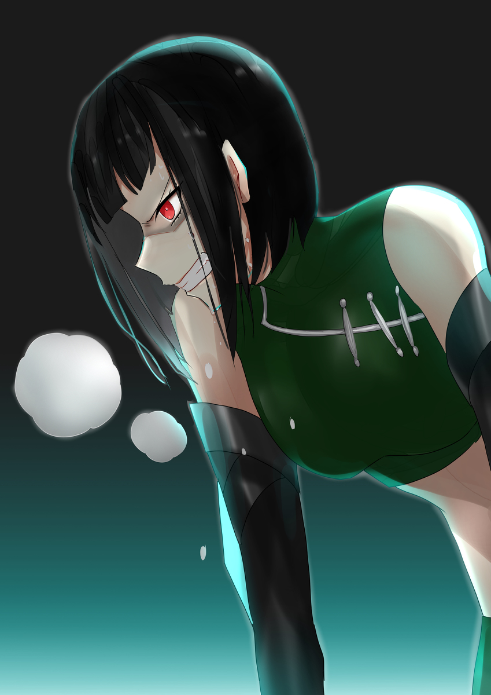
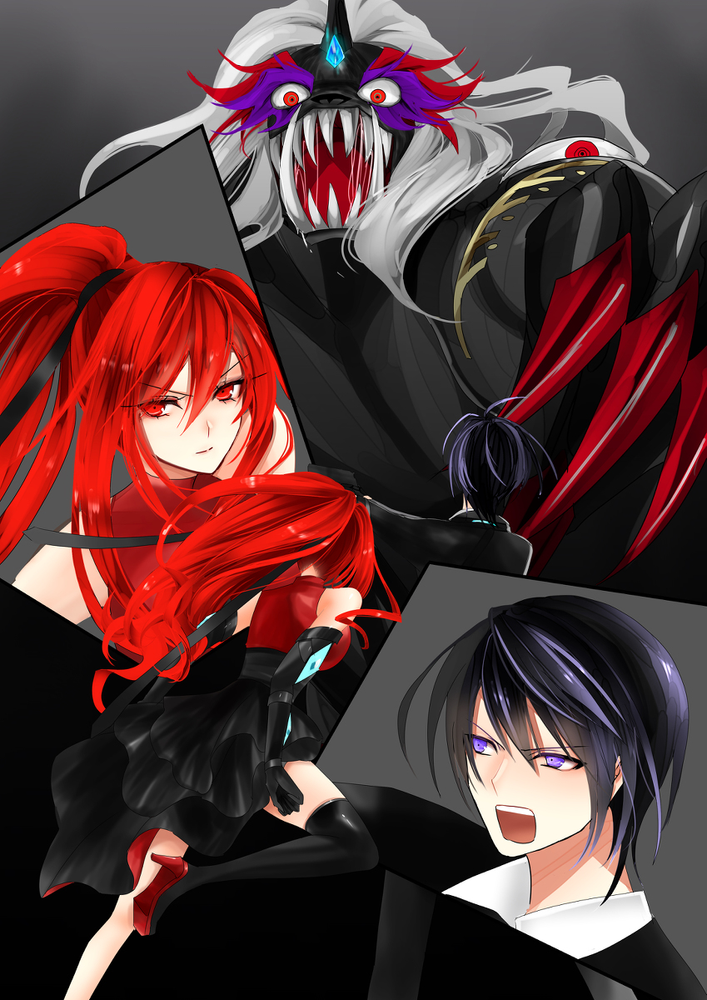

原文来源: [pixiv novel 17357609](https://www.pixiv.net/novel/show.php?id=17357609)
系列: 音楽†SFファンタジー『Relation』HARMONIXシリーズ
顺序: 4

イクスとエレノアナはレイラに促されるまま無機質な廊下を歩いていた。

流石としか表現できないくらいに、レイラはコロシアム内部の構造を熟知しており、大きな両開きの扉を目前にしてイクスは息を飲み込んだ。

レイラの視線の合図とともに、勢いよく扉を押し開けると共に耳を劈く様な歓声に包まれる。

関係者の為に用意された特別席では、下品に声援を送る者はいない。
薄暗くて周りの気配でしか分からないが、静かに拍手をして座っている影だけが見えた。

さっきまでエレノアナと共に観戦していた座席よりもゆったりとした席が並んでいて、まばらに空席もあるようだった。

レイラが言うには、それぞれの選手のスポンサーや今回の【クオドロ・トーナメント】への投資者用の席らしいが、既に準決勝ということもあり、敗者のスポンサーたちが帰った席が空いている。

一般客席に戻るよりそこで次の試合までレイラと共に観戦できるし、先ほどのようにエレノアナに絡んでくる客を牽制する必要もないと考え、イクス達はレイラの提案通りに関係者席の空席で観戦することにしたのだ。

「流石、準決勝ね・・・」

歓声の大きさもさることながら、コロシアムを包んでいく異様な熱気に圧倒されていたのはレイラも同じようだった。

明らかにさっきまでとは何かが違う。

各自好き勝手に歓声を上げていたのが嘘のように、二色に分断されている。
『グレイ』と『ニア』という明確な色を付けられ、準決勝にして決勝さながらの二択を模していた。

レイラは少しだけ眉間に皺を寄せた。
会場の雰囲気にあてられた訳ではない。

グレイの身体能力を見せつけられ、『死神』のオーラを肌で感じ、レイラが勝てる相手ではないと確信できた。

だからこそである。

グレイとニア…。
この試合でどちらが勝とうとも、必ず本来の目的を果たす為に新たな作戦を考えなければならない。

「レイラさん！もし、また機会があったら普通にこういう試合観戦もしたいですね。」

エレノアナがレイラの冷え切った手を握る。

まだ子供のような温もりと柔らかさに包まれた手から、一気に光の速さで何かが体中を駆け巡っていくようで、自然とレイラの眉間に刻まれた皺が解かれてしまった。

「そうね。出場するより観戦する方が楽しそうね。
まぁ、私は一度はやってみたかったから、両方楽しめた感じだけど。」

「レイラさんが、炎の女神様だって発見もできましたし！」

「そうよ？あのチェルシーってファイターとも約束したからね。いつかはやりたいけど、今じゃないわね。」

そんな二人のやり取りを見ない振りしながら、イクスは３席揃って開いている場所を探し二人を促した。

三人がこの地下闘技場に来た理由は、一つだけだ。
【クオドロ・トーナメント】の景品に使われているマテリアルの奪還である。

イクスとレイラも深く話す事はなく、グレイが呼び出されてすぐに試合を見ようとここに来た。

勝負ごとに対して熱くなる純粋な気持ちだけで居られるならば、レイラは来なかったはずだ。

レイラもこの試合の後の準決勝を勝ち抜いて初めて、決勝への切符を手に入れるのだから。

しかし休憩時間にまじまじと見せつけられた、あの一瞬にして殺気のオーラを放ったグレイ。それはまさに『死神』の顔だった。
片や対戦相手をタンカーに乗せるまで痛めつけてしまう、前回優勝者のニア。

既に、ニアの手元にあるマテリアル。

試合に勝てば良いだけでは通用しない。
レイラとイクスは暗中模索の中、この試合の成り行きをしっかりと見届けるつもりでいた。

それとは別に、エレノアナは何か喉元に引っかかるものを持ちながら闘技場に視線を送る。

目の前で、無邪気にサンドイッチを『美味い』と食べてくれたグレイの顔が忘れられない。
生気を感じた瞳が陰り『食べさせてやりてぇ』と言った言葉が忘れられない。

闘技場に立ったレイラは女神のように美しく、眩かった。
ファイターとして正々堂々と立ち向かうその姿に圧倒された。

だが、グレイは違った。

一瞬で勝負を決めたグレイの姿には純粋な感動を覚えたが、闘技場を去る背中は明らかレイラのその堂々とした輝きはなかった。

勝利を手にしても得られない何か？

特性サンドイッチに喜ぶ姿。

レイラも喜んではくれたが、明らかにそれとも違う。

エレノアナはイクスに促されるままに座席に腰を下ろしながら、これからグレイが入場してくるだろうぽっかりと空いた入場口をただ見つめていた。

一瞬暗闇に包まれた次の瞬間。
コロシアム内が全て一体になったかのように、一斉にカラフルなスポットライトが駆け回る。

色んな味を詰め込んだキャンディーの瓶を落として割ってしまったかのようで、綺麗でありながら寂しさを覚える。

凝った演出と共に準決勝の出場者である、グレイとニアが闘技場に姿を現した。
観客の声援が地響きに変わる。

グレイは全く無反応のままだ。
一定の歩幅で中央に向かっていくその姿は予想通りだったが、対戦相手のニアもまた歓声に対して特に反応することもなく、グレイをロックオンしたまま切れ上がった眼差しを向けたまま静かに入場している。

イクスは前回優勝者であるならば、他のファイターのように観客へのサービスパフォーマンスをするのではないかと考えていたのだが、ニアもグレイの試合を見せつけられ、それどころではなくなったのか…それとも、そういうスタイルを貫いて『クールビューティー』と表現されているのか？

『ニアーーーーーー！！！！！』

強烈な声にも全く反応を示すことはなかった。

ゴングが鳴る前だと言うのに、その静かな殺気はグレイにだけ向けられていた。

まだ準決勝だと言うのに…と思う者は、この会場内にはいないようだ。

その時だった。
小柄で今までのファイターより地味な印象だったニアが大きく深呼吸をしたかと思うと、歓声を吹き飛ばすかのような雄たけびを上げた。

何と表現したらいいのか解らないが、思わずイクス達も耳を両手で塞いでいた。

気迫と言うよりは威迫に近い獣じみたその音がコロシアムを飲み込み、コロシアムに集まった全員が口を閉ざしていたが、たった一人だけ…目の前に立ちはだかるグレイだけは直立不動にニアから視線を逸らすことはなかった。

「うるさいのは嫌いなんだ。」

まるで別人のような冷めきった息を漏らしながらニアはグレイに挑戦的な眼差しを向けた。

グレイは何も答えなかった。

「ね？見た目を裏切るファイターでしょ」

レイラがイクスに耳打ちしてくる。
これが、ニアなりのパフォーマンスなのか？

そう疑いたくなる。
コスチュームも動きやすい事を重視したかのように、他のファイターよりも地味で一見すれば普通に街を歩いて居そうな少女だ。

黒髪を綺麗におかっぱに切り揃えていて、白いワンピースなどを着ていれば清楚な少女に見えるかもしれない。

ファイターモデルとして掲載されていた記事の写真でみた時よりも、随分と童顔に見えた。

人が発したとは到底思えない、さっきの雄たけびが無ければイクスもそのままの気持ちで観戦したかもしれない。

（まるで、グレイを威嚇しているみたいだ・・・）

これがイクスの正直な感想だった。

動物が威嚇するのは、明らかに恐怖を感じている時である。
自分より相手の方が強いと感じた時の自衛本能ともいえるだろう。

つまり・・・。

ニアは明らかに、グレイを前にして恐れているのではないか？
イクスは直感的にそう感じてしまった。

「大丈夫でしょうか・・・」

エレノアナがイクスとレイラに声を掛けてくる。
誰も声を出せなくなり、コロシアム内が静まり返ったおかげでエレノアナの透き通るような囁きもしっかりと聞こえたが、イクスとレイラも全く同じ感想しか持ち合わせおらず返答できなかった。

３人が抱く不安を余所に、第５試合の準決勝のゴングは鳴り響いた。

先行で仕掛けたのは、グレイだった。

第３試合の『クオドロ荒らし』のゾネスの時には、間合いを取ったまま数秒相手の出方を見ていたが、今回は一瞬で試合を終わらせるつもりらしい。

グレイの身体能力が並外れているのを目の前で何度も見せつけられよく知っているイクスは、今回も瞬殺で終わってしまうのかも知れないと予想したが、グレイの動きを先読みして完全に逃げに徹したニアが、入場口とは逆の観客席に近い所まで飛びのいていた。

パリン・・・。

まさに息を飲むような一瞬の出来事の中、悲しい音がコロシアムに響いた。

ニアの左腕の人工マテリアルが割れ落ちたのだ。

グレイはゾネスの時と同じように、マテリアルだけを狙って４発突きを入れている。
それを避けながらグレイの間合いから脱して、３つを守り抜いたニアの動きはまるで小動物のように滑らかだ。

イクスが今まで見たどの試合とも明らかに違う。

第１試合の勝者であるファイターも小柄であったし、レイラが対戦したチェルシーも割と小柄で瞬発力も兼ね備えたニアよりのファイターに見えたが、ニアのその動きは線と言うよりは曲に近い柔軟性がある。

つまり、読みにくいのだ。

そこにあるはずの的が、突然消えると言う表現が近いかもしれない。

しかしあのグレイの速さにギリギリであってもついてく時点で、確かに前回の優勝者であると頷ける。

「凄い・・・」

イクスは思わず声を漏らした。
どんなに思案を繰り返しても、先読みをしてもグレイのあの速さについてはいけないと判断した数カ月前の自分を思い出せば、ニアの強さが身に染みて解る。

「クオドロはあくまでも闘技だからね。
身に着けている４つのマテリアルを守り切り、相手のマテリアルを壊すことがルール。
だから、体術や剣術、力技だけで勝利は得られない。」

レイラがまるで自分の中に落とし込むように言葉を吐き出す。

「あの子は多分、サーカスみたいな曲芸を得意にしているタイプのファイターなんだと思う。」

エレノアナが身を乗り出してレイラの顔を伺った。

「サーカスですか？私、一度だけ見たことありますよ！小さい頃に、サーカス団が家の近くに来た時に、両親と一緒に見に行きました！」

エレノアナの跳ねた声を聴けばそれが楽しかった思い出の１ページに刻まれている事は解るが、イクスは実際に見たことが無く、なんとなくの知識だけしかなかった。

大きな玉に乗ったり、ロープの上を歩いたり、普通の人ではできないような動きを披露して各地を回る遊戯演舞を主にしていてサーカス団によっては動物を使役したりもしているという認識しかない。

「でも、ニアの記事にそんな情報はなかったですよね？」

イクスもニアについての記事は全て読んでいたが、ニアの経歴や過去にサーカス団と言う表記は一切なかった。

それに、前回大会の時の記事にも柔軟な動きで相手を翻弄させた等という表現もなかった気がする。

今目の前で行われている戦い方法で前回も優勝しているのなら、その特徴を評価する記事があってもおかしくないのではないか？
『ビフォーアフター』という記事が掲載されるほど注目され、過去を露わにされているファイターである。

何かしっくりこない。

「さっきの試合の時も、あのニアって子は意表を突く動きを見せた。
そして、まるで手品みたいに持っていない方の手に突然ビームソードが現れてね。」

「ええ！！それって凄くないですか？でも・・・」

レイラの話にエレノアナは感動の声を上げたが、直ぐに黙ったのはやはりその対戦相手がタンカーで運ばれて行く姿を見たからだろう。

「そう。勝負はほぼ決まっていた。なのに、あの子ね。
相手の戦意を失わせるまで、最後のマテリアルを割らないで攻撃を続けたのよ。」

レイラが休憩時間に詳しくニアについて語らなかった事を、イクスは察するように息を飲む。

相手が戦意を失うまで、マテリアルを１枚残して攻め続け痛めつける。
つまり、勝てるはずなのに終わらせずにいる理由。

「相手が、二度と自分に歯向かってこないように、調教でもしているかのようだったわ。」

イクスとエレノアナは唾を飲み下した。

（なんで、そんな事を？）

誰もがそう思う事だろう。
しかし、レイラにはなんとなくその意図が解る気もした。

田舎から出て来た地味な少女の人生が一気に変わった瞬間がこの【クオドロ・トーナメント】の優勝だったとしたら、それを奪いに来る者は敵でしかない。

闘技に挑むファイターとしてよりも、得られた地位を守り抜く為にニアは今戦っているのではないか？

だとすれば、ルールを守りながらも相手を痛めつけて参加意欲を削ぐことによってライバルを減らす必要がある。

それは対戦相手だけにではなく、これからトーナメントに出場することを考えているファイターや準決勝や決勝に残ってくるファイターへの牽制にも有効になる。
ニアとの対戦を恐れて、棄権してくれればニアは今大会でも優勝できると考えているはずだ。

少なくとも、レイラの目にはそう映った。

イクスとエレノアナに説明しても全くピンと来ていないようだったが、目の前で先に自分のマテリアルを割られ逃げに徹したニアの憎しみの表情を見るとイクスはレイラの考察は的を射ているような気がした。

『クールビューティー』と世間を言わしめる少女の顔が、鬼の形相に変わっている。

グレイの攻撃範囲を本能的に感じているかのように、距離を取ったまま逃げに徹してはいるが、グレイも攻撃の速度を徐々に上げているようで残りのマテリアルを掠りそうになる。

「貴様！！！！！」

ニアが苦虫を嚙み潰したような表情を浮かべ唸り声をあげているが、グレイはまさに『無音の死神』として身体を異常な方向に曲げて逃げ惑うニアをひたすら追い回していた。

ニアの方が逃げ場を断たれ壁際に追いつめられた時だった。
壁を思い切り蹴り上げ、身体をくの字に曲げてグレイの脇からすり抜けると同時に、ニアが右手に持っていたはずのビームソードが左手にあり、逆手のままグレイの右二の腕のマテリアルを打ち取った。

今まで息を飲むように見ている事しか許されなかった観客たちから、歓声が零れ始める。

がしかし、マテリアルを割られても全く動じないグレイが空中を舞い今度はニアの退路を断つように立ちはだかる。

勢いよく壁を蹴ったせいもあり、このままではグレイの胸に飛び込んでしまう！

「「・・・あ！！」」

イクスとレイラが思わず声を上げて身を乗り出すと、ニアの上半身が一瞬消えた。
いや、正確に言えば消えたように見えたのだ。

ニアは勢いを止められずに、柔軟な身体能力を利用してブリッジのように上半身だけを後ろに反らせた。

しかしそれではバランスが悪い。

グレイは瞬時にビームソードを下に向けたが、ニアは既に割られている左腕を突き出してそれを受け止め、あり得ない体制のまま宙に飛び上がる。

イクスは第３試合でグレイが発した言葉を思い出す。

『これがゲームでなければ、お前はもう死んでいる』

まさにその通りだ。
互角に見える戦いではあるが、それはあくまでも今行われているのが『闘技』の試合だから時間が来るまでこうして観戦していられるし、ニアの交戦も有効なのだ。

試合ならば互角に見えるが、既にニアはかなりの体力を消耗しているようで息が上がっているのに対し、グレイは息が上がるどころか表情一つ変えない。

冷たく凍り付いたまま感情のない剣士。

威嚇し、唸り、奇想天外な攻撃を与え、尚且つ互いにマテリアルを１つずつ失っている状況からすれば、決して追いつめられている訳はないのに、ニアの焦る表情はどんどん深くなっていく。

ルールに守られて互角であるはずの両者だが、精神力と経験値で雲泥の差が開き始めていた。

対戦相手を痛めつける事によって脅威を植え付けたはずが、それがグレイには全く通用しないどころか反対に無言の圧に押されている。

ニアの顔面からは滝のように汗が噴き出ており、それを拭き取る。

「くっそーーーー！！！！」

ニアが再び大きな虚勢の声を上げた瞬間に、第１ラウンド終了のゴングが鳴り響いた。

まさに息を飲むような一瞬の５分間に、何手グレイが仕掛けたのかはイクスさえ数え切れなかった。

グレイの速さについていき攻撃を仕掛けられてもそれを互角に逃げ続けたニアは、相当に体力を消耗しているように見える。

「まさに、ルールに救われたって感じね。」

イクスはレイラと全く同意見だった。

きっとニアにとっては長すぎる５分だったのではないだろうか？

まだあと２ラウンド残っている。
それを、どうやって戦い抜いていくつもりなのか目が離せない。

「でも、お２人とも強くて凄いですね！！ニアさんには、この後の試合も正々堂々としていて欲しいです。」

エレノアナの言う通りだ。
自分より弱い相手を痛めつけるよりも、互角またはそれ以上かもしれない相手に出会った時、人は大きく変わるチャンスを得られる。

イクスも本当に大切な事を、ある意味グレイと対峙した時に気付いたのだ。

―自分の為にだけではなく、大事な人の為に元気な姿で帰りたいと願う気持ちを・・・―

今行われているのは、あの時とは全く違う。
命のやり取りをしている訳ではない。

だからこそ、ニアにも気付いて欲しい。
イクスはそんな願いを込めて水を頭からかけているニアに視線を向けてから、水を飲もうともせずに壁に寄りかかっているグレイを見つめた。

「グレイさん。本当は悪い人じゃないのかもしれないですね。」

エレノアナがイクスに声を掛けてくる。

小休憩になり、チラホラと声援を送る声がコロシアムに響き始めたが先ほどではない。

今大会でも優勝はニアだろうと疑わずに賭けた客たちが、ニアに『負けるな！』『お前は負けないよな』等と身勝手な声を掛けているだけだ。

「身勝手だなぁ・・・」

イクスは思わず言わずにはいられなかった。

グレイの強さを知っているからこそ、ニアが正々堂々と今真剣に挑んでいる姿がカッコいいと思える。
前の試合で何をしたのかを見ていないからそう思えるのかもしれないが、それでもニアの必死な姿勢に賞賛を送りたい気持ちがイクスの中にも芽生えてきていた。

グレイからしたら『お遊び』なのかもしれないが、今ファイターとして剣を交えている二人に対してベストを尽くして欲しいと願えない歪曲した声は聞かせたくない。

「グレイさん！！！！ニアさん！！！！がんばれ～！！！！」

イクスの気持ちを察してなのか、それともエレノアナも同じ気持ちが湧いたからなのか。
エレノアナは特別席に座っているにも関わらず、勢いよく立ち上がり、口元に両掌を添えて澄んだ声援を放った。

周りに座っている高級そうなスーツを着込んだ年配の観客たちが、エレノアナを睨みつけてきたが乗じてイクスも立ち上がる。

「二人ともがんばれ！！！」

その声がニアとグレイに届いているのかは解らないが、グレイが一瞬だけこちらを見たような気がした。

エレノアナとイクスが二人のファイターに声援を送る横で、レイラは顎に手を当てたまま何かを考えているようだった。

第２ラウンドのゴングが鳴り響き、二人が椅子に座る。

「ねぇ、イクス君。どう思う？」

レイラの深紅の瞳にイクスが映る。

「何がですか？」

「ニアのデータはイクス君も見たでしょ？
なんか、変よね。柔軟な身のこなし、手品のような戦法。なによりもあの身体能力。前回の大会の記事には一切記載がなかった。
前回の戦い方と明らかに違うと思う。」

イクスが思ったことと全く同じ疑問をレイラも考えていたようだ。

この試合の勝敗でレイラの相手が決まるからと言うだけではなく、その疑問はそれ以上の何かを秘めていた。

「前回はなかったことが、今回はある・・・。それってまさか！？」

「そう。多分だけどマテリアルの力が何か作用している可能性はあるわよね？」

イクスとレイラが顔を見合わせていると、エレノアナが「え？！」と大きな声を上げる。
それは、二人の会話に対してではなかった。

イクスがエレノアナの視線を辿って闘技場を見下ろした。

「まさか！？」

さっきまで逃げに徹しながらグレイの隙を狙っていたニアが、グレイの背後をとり酷い形相で襲い掛かっていた。

「一体なにが？！」

イクスとレイラがほぼ同時に席を立つ。

そこに居るのはニアであって、さっきまでのニアではない。
目は充血したように真っ赤になり、薄く開いた口からは泡だった唾液が洩れ唸り声をあげている。

まるで、野獣のような形相でグレイに襲いかかる。

グレイもまさか自分が後ろをとられるとは思っていなかったのか、眉間に皺をよせ回避しようとするも大きく背中を切り付けられた。

「何を！！！」

それは、明らかにマテリアルを狙った攻撃ではない。
レイラとチェルシーの試合の時のような、マテリアルを狙う前のフェイント攻撃とも明らかに違う。

「負けられない・・・負けたくない・・・・負けるわけにはいかない！
あたしは、絶対に負けられない！！今回も優勝するんだ・・・邪魔者は・・・消す！！」

雄たけびが言葉になっているかのような、音がコロシアム全体に響き渡った。

人間とは思えない圧倒的な速さでニアはグレイの姿を追いかけ、ビームソードを使うことなく殴りかかっていく。

第１ラウンドとは異なる形でグレイが一方的に痛めつけられ、闘技場に叩きつけられグレイが逃げに徹する。

最早これは『闘技』ではない。『試合』ではない！
反則どころでもない。

余りのニアの変容ぶりに会場中が呆気にとられ、「やりすぎだ」「やめさせろ！」とざわついた時、流石にアンダーグラウンドでの開催と言えども見かねた開催側のアナウンスが流れる。

【第５試合を中止にします！ファイターは直ちに攻撃を止めてください！】

『うるせぇ！！！！！！！
あたしは、負けるわけにはいかないんだ！！！！お前さえ消えれば・・・優勝できる！！』

ニアは殆ど自我を失ったように叫ぶ。
その口から、耳から、毛穴から、黒い霧のようなものが出てきてニアの身体を包んでいく。

「マテリアルなの！？これが！！」

レイラが目を凝らす。

「そんな・・・」

エレノアナは思わず口を手で塞ぐ。

「一体ニアに何が・・・」

イクスも立ちすくむことしかできなかった。

その状況を目の前に見ているグレイは背中の傷を庇いながらも、黒い塊のように変わっているニアを睨み続けている。

戦意を宿したままではあるが、傷が痛むのかそれともグレイでさえも未だかつて味わったことのない恐怖を感じているのか、ゆっくりと猫背になりながらもニアだったモノから距離を取るようにビームソードを構えたまま一歩ずつ後ろにさがる。

黒い霧の中からは唸り声しか聞こえてこない。

鼓膜に突き刺さるような音は、人間のものではなく飢えた獣のようで、霧からは腐った藁のような臭いがして耳を手で塞いで、息を止めても喉に張りく異臭がコロシアムを包んでいく。

観客席からは悲鳴が上がり、イクス達の近くに座っていたスポンサーたちも席を立ち始めた。

その時だった！！！

『グオオオオオオオオ！！！』

黒い霧を自ら切り裂き姿を現したのは、ニアではないどころか…そもそも人間ではなかった。

目の前に立つグレイの二倍の大きさをした黒い四本脚の獣。いや、モンスターと表現した方がしっくりくる程に醜く凶悪な姿だった。

一体何が起こったのか理解に苦しむ状況の中で、人々は我先にと闘技場からの脱出を試みる。

しかし、目の前に立ちはだかるグレイは違った。

何歩か下げた足を踏ん張りビームソードを両手で構えなおす。

（まさか、あんなモンスターとやり合う気じゃ・・・）

闘技場内と特別鑑賞席では随分と距離があるにも関わらず、イクスは足がすくみそうな恐怖を感じるのにも関わらず、グレイは迷う事なくモンスターに向かって切りかかっていった。

エレノアナが悲鳴に近い声を上げるが、逃げ惑う観客たちの怒号によりかき消される。

ニアだった時よりも巨大になった分動きは遅いようだが、背中を切られ何度も殴り飛ばされたグレイ自身のスピードとパワーも減速していた。

鋭い爪の生えた前足で地面に叩き落とされ、ボールでも蹴るかのように壁に向かって放り投げられた。

「グレイさん！！！！！」

エレノアナがグレイの元へ向かおうと、客席の階段を降り始める。

レイラとイクスもそれに続く。

特別席に座っていたスポンサーたちのほとんどが既に席を立ち、関係者専用の廊下の方に向かったようだったが、一般席の方は満席だった分ほとんどの人たちが逃げられていない。

モンスターと化したニアは、再び大きな唸り声をあげると、今度は逃げ惑う観客たちの方に走り出した。

観客席の最前列は壁を登ればすぐの所にある。
巨大化したモンスターならすぐに飛び越えられてしまう所に、入り口までが遠い観客が取り残されている。

イクスはモンスターニアの動きを注視しつつ、グレイの安否に必死になるエレノアナの背中を追った。

「エレノアナ！！グレイを頼む。俺は、ニアを食い止める！！」

イクスは背中に隠し持っていた銃を躊躇することなく取り出して威嚇発砲をした。
モンスターニアは既に、客席に侵入をはじめ座席を壊し始めていた。

被害者が出てもおかしくない危険な状況だ。
会場側からのアナウンスはあれから一向にない。こうなる事態を予想していたのか、それとも想定外なのかは不明だが、スポンサー席の面々が一目散に逃げたため一般席の観客の事は二の次なのだろうことは予想が出来た。

出入口は円形のコロシアムに４つ備わっているが、エレノアナを連れてレイラに会いに行く時でさえ人の波に飲まれそうだったのだ。

このパニック状態の人々が全員避難させることはほぼ不可能だと言い切れる。

それならば、モンスターニアをこちらに引き付けてイクスが戦うしかない。

モンスターに変貌を遂げていくニアを目の前にしても、手負いのグレイは怯まずに闘技用に用意されたビームソードで挑んでいった姿が脳裏を過る。

あの時イクスは、客席でただその脅威を見ている事しかできなかった。

イクスとレイラが、身体能力を全て加味しても勝てない相手と確信したグレイをいとも簡単に吹き飛ばした相手を目の前にしても、イクスの腹は決まっていた。

グレイの剣士としての果敢な姿を目にした以上、イクスも男のプライドにかけて此処で引くわけにはいかない。

鼻に劈く強烈な異臭には慣れ始めていたが、唸り声には耳鳴りの後遺症が残る。

イクスは会場を壊し始めたモンスターニアを止める為に、天井に向けて発砲する。

モンスターニアの近くに打ち込めれば一番効果的にこちらを向かせることは出来るのだろうが、恐怖で興奮した人々の波は何を起こすか分からない。

それに、人が残っている可能性も大いにある以上は直接的な攻撃は避け、自分の方に引き寄せる方が得策である。

「こっちにこい！！！ニア！！！！」

イクスがモンスターニアに向かって声を掛け、発砲するが何百人の観客の怒号や悲鳴でかき消されてしまう。

「くっそぅ・・・」

闘技場の真ん中まで降りてニアを狙うイクスに、後から来たレイラが声を掛ける。

「グレイは意識を失っているようだけど無事よ！」
レイラはエレノアナと共にグレイの様子を見に行ってからイクスに合流したのだ。

「エレノアナは？」
「グレイの介抱をするって残っているわ！」

2人は走りながら、必要最低限の情報だけ共有し逃げ惑う人とモンスターの間に立ちはだかった。

「イクス君！あのモンスターの脳天にある黒い光！あれはマテリアルよ。
あれを壊せば！」

レイラは何処に隠し持っていたのか、愛用の銃をモンスターに向けていた。
一瞬、レイラのコスチュームのどこに隠していたのか疑問に感じたが、今はそれどころではない。

「あれは・・・」

「前回優勝景品のマテリアルに間違いないと思う。
ニアはそれをずっと持ち続けて、本来の彼女ではない力を発揮していたと考えるのが妥当だと思うわ。
負けたくない一心で、第２ラウンドから本物のマテリアルを身に着けて暴走させたのよ！」

「てことは‥‥！？」

前回の優勝景品のマテリアルならば、それは元人間と言うことになる。

イクスはエレノアナがいる方を一瞥すると、気を失ったままのグレイを抱えながらこちらを見つめるエレノアナと視線が合う。

マテリアルになった時の記憶があるエレノアナの気持ちを考えたら、マテリアルを打ち抜く事がイクスには出来なかった。

「迷っている場合じゃない！」

そう言うレイラの声にも迷いを感じる。

（それ以外に方法は無いのか・・・？）

一瞬の迷いを見破ったように、モンスターニアがイクスとレイラに襲い掛かって来た。

2人は、左右にその攻撃を避けとりあえずモンスターの標的に自分たちがなっている間に、観客が少しでも多くに逃げられるようにと、闘技場の方へとおびき寄せる。

「ダメ止めて…そんな苦しい声で泣かないで！！」

エレノアナが必死にモンスターニアに変身させたマテリアルに声を掛けるが、全く反応がない。

気を失っているグレイの頬に暖かい雫が零れ落ちる…。

―なんだ…ミルファ…また泣いてんのかよ…守るって約束したんだから、そんな顔すんなって…―
