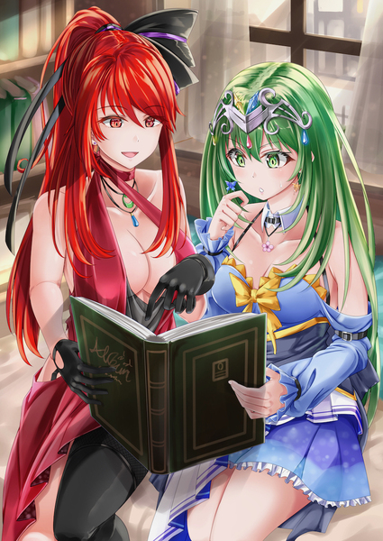

原文来源: [pixiv novel 19381454](https://www.pixiv.net/novel/show.php?id=19381454)
系列: 音楽†SFファンタジー『EternalScale』HARMONIX シリーズ
顺序: 1

赤く輝く宝石が男の手の中で瞬いていた。
その瞬きは炎のように、あるいはアンタレス赤灼星のように、強くもどこか儚い。
「アンタレスは死にかけの星、だったかしら」
　アイスブルーの瞳の女が、感情のない瞳で赤い宝石を覗き込んだ。
　夏の夜、南の空に浮かび上がるさそり座。さそり座を形作る星々の中で最も明るく、赤く輝く星がアンタレスだ。青白い星々の中で一等目立つその赤色は、アンタレスが星としての老年期に差し掛かっていることを示している。
赤い炎は青い炎よりも温度が低い。アンタレスは既に青白く光る程の熱量をもう持たないのだ。いつかはやがて死に絶え、空から消え去る星。あるいは、ひょっとしたらもう何億光年向こうの空では既に消えてしまっているかもしれない星。
女は冷たい色の瞳に、僅かな関心を浮かべて宝石を眺めていたが、すぐに興味をなくしたように視線を外す。
「貴方のマテリアル。それ、まるでアンタレスね。……どうでもいいことだけど」
「君は意外と詩人なんだな、シキ」
　男がくつくつと笑う。
　シキと呼ばれた女は気分を害したように口元をわずかに引き結ぶ。
「別に。ただの客観的事実よ。そのマテリアルは死にぞこないでしょう」
　赤い宝石を一瞥したシキが淡々と言う。
　『マテリアル』とは規則的な音を奏でる、不可思議な力を持った宝石だ。マテリアルが奏でる音は太古の時代には『音楽』と呼ばれたこともあったらしい。時には人の心を操り、時には超自然的な現象を引き起こす、危険な力だ。
「マテリアルにでもならなければ死んでいたモノを、『死にかけ』と呼ぶことに誤りはないわ」
　そんなマテリアルに道具を見るような冷たい眼差しを向けながらも、シキはその宝石がまるで生き物であるかのように言う。それもそのはず。マテリアルの材料は生きた人間だからだ。男の手の中に収められている、赤い光をうっすらと放つこのマテリアルの中にも生きた人間が閉じ込められている。
「冷徹な女だ。見た目と同じく」
　シキの冷たい物言いを男は愉快に思ったらしい。機嫌よさげに目を細めて笑う。シキの方は、逆に男の反応に気分を害したようだった。
「くだらないわ」
「マテリアルを――人の魂の音色をくだらないと称する君だからこそ、この舞台の観客に相応しい。これから起こる全ての物を見守っていてくれ」
　男は別れを惜しむような、愛おしい手つきで赤いマテリアルを一撫でした。
　そしてマテリアルを台座のような物に設置する。
　カチリ、と音を立てて収まったマテリアルからひと際強い光が溢れ出す。光が溢れ、薄れ、そしてまた溢れ。まるで星そのものであるかのような明滅が男とシキの周囲を赤く染める。
二人を囲う金属光沢を持つ黒塗りの壁が、サイレンのような赤色に照らし出された。位相幾何学的な、何らかの儀式的意図を思わせる紋様が壁中を張っている。
シキたちが居る部屋の四方には、それぞれ大きな窓が一つずつはめ込まれており、赤い明滅が窓の外の夜空まで伸びていく。地面よりも空が近いそこは、塔のような建物の、最上階に近い場所だった。窓に近付くと眼下にうっそうとした森が広がっているのが見える。
南側の窓の向こうには、文明の灯り――小さな街がある。森を越えて、街すらも覆いつくさんとする勢いで赤い光は伸びていき、そしてまるで幻だったかのように掻き消えた。
シキと男は肩を並べて、赤い光に一瞬だけ包まれた街を眺めていた。
「……冷たいのは、貴方の方じゃないのかしら」
　ぽつりとシキが漏らす。
　変わることのない淡々とした声色に微かなからかいのような含みを混ぜて。
それ、家族なんでしょう、と。
　台座にはめこまれたマテリアルを冷えた眼差しで一瞥した。
「くだらないよ、家族なんて」
　男は面白い冗談を聞いたように笑ったが、シキの言葉を否定することはなかった。
「たまたま同じ家に生まれただけの他人同士だ。血の繋がりはただの枷でしかなく、人生のお荷物にしかならない。君もそう思うだろう？だから私に力を貸してくれている」
　温かみのある声でひどく冷めきった台詞を男が紡ぐ。そこにあるのは侮蔑と嫌悪。良心のある者が聞けば顔をしかめたであろう台詞だが、シキの表情は変わらなかった。
「さあ、どうかしら」
　用は済んだとばかりにマテリアルに背を向けるシキ。黒塗りの壁に覆われた部屋から退出するシキを男も伴った。
　少しばかり錆びて、軋んだ音を立てる鉄の扉を開いて外に出る二人。
　冷たい夜風が吹く夜だった。
　吹けば揺れてしまいそうな、吹きさらしの外階段をらせん状にぐるりと回って二人は鉄塔を降りていく。二人分の靴がカンカンと音を響かせた。
　階段の中腹に差し掛かったところで、シキが足を止めて顔を上げた。
　マテリアルから発せられた赤い光は幻のように消え失せ、静かな街の眺望だけが残っている。深夜に近い時間帯だと言うのに、ちらほらと温かみのある灯りが見えるのはきっと『フェスト』が近いからだろう。お祭り前の準備がしめやかに行われているのだ。
「シキ？」
　立ち止まったシキに男が気付く。
　夜風で乱れる髪を片手で抑えながら、シキは独り言のように呟いた。
「なんでもないわ。足元が暗かっただけ」
「ああ」
　察したように男が片手をシキに差し出す。シキはちらりとその手を一瞥してから、静かに己の手を重ねた。
まるでエスコートされる女王のようなシキの佇まいに男が屈託なく笑う。
中年に差し掛かる齢でありながら少年のような屈託のない笑みを浮かべる男だった。愛想のような、親しみやすさがそこにあった。それが本来の人柄からにじみ出るものではなく、ただの仮面であることをシキは知っている。天真爛漫な明るさとは似てもつかない見せかけの人懐っこさ。
「くだらないわ」
　もう一度、自分に呟くようにシキは言う。そして再び歩き始める。
「君はご機嫌ナナメな時でさえも美しいね」
　無言のシキとは対照的に、上機嫌に笑う男。満足げで、僅かに悪辣なチェシャ猫のような笑顔でくつくつと笑う。
　男は燃えるような赤い髪を夜風になびかせながら、シキを伴って塔を後にした。
