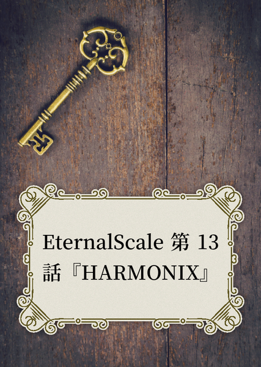

原文来源: [pixiv novel 19381579](https://www.pixiv.net/novel/show.php?id=19381579)
系列: 音楽†SFファンタジー『EternalScale』HARMONIX シリーズ
顺序: 12

目が覚めると、イクスは電波塔を上る階段の中ほどで立っていた。随分長く立ち尽くしていたのか、体がすっかり冷えている。
ふと足元を見ると、宙に浮いたつま先の下の遥か下に地面が見えた。ちょうど劣化して折れてしまった手すりに身体を向け、階段から今にも飛び降りそうな体勢でイクスは立っていた。
「イクスさん！　止まって……イクスさんってば！！」
　悲鳴のようなエレノアナの声。はっ、と振り向けば必死にイクスの腕に縋りつくエレノアナが居た。ずっと、そうして掴んでいてくれたのだろうか。イクスの服はすっかりシワになってしまっていて、エレノアナの指先も血の気が抜けて青白い。
　エレノアナの目から涙の粒がこぼれ、宝石のように風に散って行った。
ああ、また泣かせてしまった。
まだ茫然とする意識のまま、イクスは空いている手を伸ばす。また再び零れ落ちそうだったエレノアナの涙をそっとぬぐった。
「……エレノアナ」
「イクス……さん？」
　エレノアナがはっとした。イクスが意識を取り戻したことに気付いたらしい。
「イクスさん……イクスさん…………」
「ありがとうエレノアナ。ずっと呼んでいてくれたんだな」
「イクスさぁん………」
　イクスの腕に顔をうずめて、声をこらえて泣くエレノアナ。よかった、と漏れた小さな声が怖いくらいに震えていた。
　電波塔に登っている途中でマテリアルの干渉を受けたらしい。電波塔のてっぺん近いところから飛び降りようとするイクスを、ずっとエレノアナが止めていてくれたのだろう。
　それがなかったらイクスは今頃。――あの夢の中で、大事な物を打ち砕いてしまっていたかもしれない。
「もう大丈夫だ、エレノアナ。行こう」
　レイラが待っている。そうイクスが言うと、エレノアナは更に肩を震わせた。
「エレノアナ……？」
　どこか遠くから甲高い鳥の声が聞こえた。警告音のような耳をつんざく叫び声。切羽詰まったようなそれがハピネスの声だと気付いたのは、視界の端で青い羽が舞い落ちていくのが見えたからだ。
「ずっと聞こえるんです……塔に近付けば近づくほど……はっきりと聞こえてくる。誰かの悲しい音色と……」
　声をつまらせて口を閉ざしてしまうエレノアナ。必死でこらえる嗚咽に、イクスまでもが悲しい気持ちが伝わってくる。
「エレノアナ、大丈夫だ。きっと……いや、絶対大丈夫。今度は俺が何とかするよ」
　『きっと』なんて曖昧な言葉では安心させられない。何が起きているのかはまだ分からないが、今度はイクスがエレノアナにもらったものを返す番だ。
エレノアナが笑えるようにするのがイクスの使命だ。エレノアナとの出会いから始まって、レイラに救われて、今の『イクス』ははじまった。だから、これは義務であり、イクスの責任だ。
……イクス自身が、そうでありたいと選んだ道だ。
ゆく先の見えない道を進むと決めた時に、本当は固めていなければいなかった覚悟を今更、胸に刻む。
いつも一歩だけ足りなかった。イクスは一歩だけ、エレノアナとレイラの後ろにいた。
まずエレノアナが駆けだして。そうでなければレイラが飛び出して。イクスはそれを追いかける。
二人に手を引かれて歩く距離が心地よくて、そこがまるで自分の居るべき居場所のように感じていた。
だけど、それじゃあきっとダメなんだ。
これからどうしたいのか。この先、誰の隣に居たいのか。
それはイクスが自分で決めなければならないことだ。
そして決めたからには、自分で守り抜かなければならないものだ。
――悪夢に犯されていたときから嫌な予感がしている。
いや、イクスを深い悪夢に落としたマテリアルの“音”が聞こえてから、本当はどこかで気付いていた。混乱する広場からレイラが居なくなった時から、本当はほとんど確信していたのだ。
あの“音”はレイラの声に良く似ている。
きっと、この先には残酷な真実が待っている。
「必ず、レイラさんを連れ戻す」
　エレノアナをそっと抱きしめて、はっきりとイクスは宣言した。冷え切った体にエレノアナの体温が馴染んでいく。そのぬくもりが心地よい。エレノアナを守ろうとしているのか、自分が暖を取ろうとしているのか、分かったものではない。
「だからエレノアナ、頼んでもいいかな」
「イクスさんが私に……ですか？」
　涙の名残を目元に残しながら、不思議そうな顔をするエレノアナ。イクスは自分の口元が照れたような誤魔化し笑いを浮かべようとするのを感じた。
　目と口をぎゅっと閉じて、表情筋に貼り付いてしまった『いつものポーズ衒い』を捨てる。
　息を吸って、吐く。
　肩肘が下がれば、自分が本当に思っていることがちゃんと表情に浮かんだ。そんな気がした。
　それがどんな表情かはイクス自身には分からなかったが……
「また俺が間違えそうになったら助けてほしい。そばに居てくれ、エレノアナ」
　エレノアナの顔から戸惑いと悲しみが薄れたところを見れば、きっと『正解』だったのだろう。

　電波塔の階段を上り切った先にある、分厚いドア。ここがコントロールルームのようだ。まだ電波塔が稼働していたとき、ここから電波の送受信を行っていたのだろう。
　重い鉄製のドアに鍵はかかっていなかった。両手で押すと、ゆっくりと開いていく。中からこぼれだす赤と青の光。
　赤はマテリアルの色。青はきっと、コントロールパネルの光だろう。
　誰かが中にいて電波塔を操作しているようだ。
　覚悟を決めてイクスはドアを思いっきり押し開けた。
　――その先でレイラが泣いていた。
　床に崩れ落ち、髪を振り乱して、聞いたこともないような悲痛な声で泣いている。赤子が言葉に出せない苦しみをなんとか伝えようと、全身を使って泣くように、レイラは大声で泣き叫んでいた。
　崩れ落ちているレイラの前に一人の男が立っている。燃えるような赤い髪の男だ。片手に持ったマテリアルが血のように赤い。
「レイラさん！」
　イクスの呼び声にレイラが肩を震わせた。顔をあげないまま、ずっと俯いている。
「イクスくん……私…………」

[pixivimage:105727807](https://www.pixiv.net/artworks/105727807)

　聞こえてきたレイラの声が弱々しく震えていた。
「君たちがイクスくんとエレノアナか。レイラが随分世話になっていると聞いているよ」
　男は微笑みすら浮かべながらそう言った。泣いているレイラの様子が見えていないかのような態度だった。
「お前は」
「レイラの叔父のシュイと言うよ。私の話を聞いたことはないかな。……そうか、ないか。残念だ。この子が小さいときには私の後をついてまわっていたものだが……もう１０年以上前の話だから、仕方もないな」
　シュイがレイラの叔父だと聞いてもイクスはあまり驚かなかった。男の赤い、切れ長の目がレイラと良く似ていたからだ。屈託のない少年のような表情を浮かべながら、口角に皮肉げな印象が浮かぶところも、濃い血の繋がりを感じさせる。それでいて、このシュイと言う男からはレイラにはない酷薄さが漂っていた。
「それで、こんなところまで来てどうかしたのかな。今日はフェストの夜だ。お互い、静かに家族と過ごしたいとは思わないかい？　こちらは久々の団らんなんだ。いくら仲が良くても、プライベートは尊重すべきだと私は思うけどね」
　穏やかに言い含めるような口調にまとわりつく、どことない嘘くささ。まるで理解のある親戚のような顔をしながら、泣いているレイラには目もくれない。そのアシンメトリーな態度が不気味な気迫すら感じさせる。
「……その人は」
　イクスはあえてシュイの言葉を黙殺した。まともに取り合ってはならない予感がしたからだ。
　代わりに、今何よりも確かめたいことを訪ねる。
「その人は、誰ですか」
　イクスの視線はシュイの持つ赤いマテリアルに注がれている。レイラとシュイの髪と同じ、燃え盛る炎のような赤。まるで血の濃さを示すように、鮮やかな色を放っている。
「分かっているのに尋ねるなんて、見た目よりもまどろっこしい子だ」
　シュイが悪意など一筋もなさそうな、無邪気な笑いをくすくすとこぼした。
　今まで見た中で最も強力なマテリアルの力。その赤色。なにより、レイラをここまで動揺させる人物と言えば。
「……レイラさんの母親」
「正解だ」
　あっさりと肯定が返ってくる。
「でも、レイラさんのお母さんは亡くなったと聞きました……」
　辛そうな顔でエレノアナが尋ねると、シュイはやはりにこやかに頷いた。
「レイラが、母親の死に目に会えなかったことは聞いたことあるかな。……ああ、その顔はないんだね。姉さんはずっと病気で入院してたから、いつ亡くなってもおかしくない状態だった。だが家族には普段通りに過ごしてほしかったようだ。姉さんが亡くなった日――いや。『姉さんが亡くなったことにされた』日も、レイラはいつも通りスクールに通っていた。それで、家に帰ってきて初めて伝えられたのさ。母が亡くなった、とね。病院の規定で遺体を目にすることもできなかった。……と言うことになっている」
「なっている、と言うことは、本当は違ったってことか」
　シュイはイクスの言葉に頷く。
「ホープは……ああ。私の義理の兄、つまりレイラの父親のことだ。彼はどうしても姉さんとの別れが受け入れられなかった。だから変えたのさ。姉さんをマテリアルにね。姉さんが亡くなる直前に、こうやって永遠の時を刻む宝石の姿に変えてしまった」
　ホープ博士がマテリアル実験に没頭したのは、レイラの母を人間に近い姿に戻すためでもあった。マテリアルとなった者とは、通常コミュニケーションが不可能だ。
「だからホープはずっと探していた。何らかの手段で人間ともマテリアルとも交信できる力を持ったマテリアルを。姉さんともう一度話をするために……ふふ。あれほど渇望していた適合者が現れた直前に殺されてしまったようだが」
　冷え冷えとした視線がエレノアナに向けられた。イクスはエレノアナをその視線から庇うように一歩前に出た。目の前の男の視界にエレノアナが映っていることが不愉快だった。
「分かるかい、イクスくん。君ならきっと分かるはずだ。何がレイラの心を折ったのか。おっと、そんな目をしないでくれ。私のせいじゃない。姪の悲しむ顔が見たいわけないだろう。私はただ、本当のことを話してあげただけだよ。レイラ自身がそれを望んだのだから」
　シュイが淡々と語る言葉。それはひどく残酷な真実だった。
「マテリアルは最初から人間を素材に作られていたんだ。だからホープはフィランダーの手を取った。大企業の権力で研究素材を手に入れるためにね」
　レイラの肩が大きく震えた。自分を守るように両腕を抱きしめながら、うずくまる。聞きたくないとでも言うかのように頭を激しく振りながらこらえきれない嗚咽を漏らした。
　イクスはそこで耐え切れなくなった。エレノアナも同じだった。二人は同時に駆け出して、レイラの傍に向かう。
危うい光を放っているマテリアルと、その持ち主に接近することになっても構わなかった。レイラをこれ以上放ってはおけない。
抱きしめたレイラの肩は氷のように冷たい。小刻みに震える背中があまりにも弱々しくて、何故だかイクスも泣きたいような気持ちになった。怒りと悲しみがぐるぐると腹の中で渦巻く。
ぐつぐつと煮える感情を叩きつけても構わない気持ちで、イクスはシュイを睨みつけた。
「お前はそのことをどう思っているんだ。……ホープ博士のやったことを」
「私がどう思っているかだって？　それはもちろん、良い気持ちはしないよ」
　へにょりと眉尻を下げるシュイ。言い方は軽いが、不愉快そうな表情は本当のように見えた。
「家族のためだからなんて免罪符を振りかざしていたが。ホープのやってたことは姉さんのためなんかじゃない。ホープ自身のため。ただのエゴだ。それを上手に他人のせいするものだから、腹立たしい気持ちにはなるね」
どうせ他人なのに、とシュイは吐き捨てるように言った。
「本当にバカバカしい」
　どこかズレている。イクスはシュイの言葉をそう感じた。
レイラの父とマテリアル研究の始まりについて、イクス自身もまだなんと思ったら良いのか分からない。倫理的に間違っていると断じるべきだとは分かっていても、大切な人を失いたくなかった男の気持ちが理解できないこともない。
何を引き換えにしても奪われたくない物がイクスにもある。彼女たちの死がもし避けられないと知ってしまって、魂と引き換えにそれを救えるとしたら。誰か他の人の命を犠牲にすれば、大切な人を助けられると知ってしまったら。自分はその誘惑を拒み切れるだろうか。
だけどシュイには葛藤がない。姉の死に対する嘆きすらもないように見える。正論を言っているようでいながら、ホープ博士の妻への想いを、レイラの家族への慈しみを容易く踏みにじる。
ホープ博士の行いを庇うつもりはない。だけど、シュイの無遠慮な言い方はイクスの癇に障った。
「他人を想うことが、お前にはそんなにおかしい事に見えるのか。叔父のお前のその言い方が、何よりレイラさんを傷付けてるってことが分からないのか……！」
　イクスの声が怒りに震える。シュイはイクスの怒りに気付いたようだが、その理由が分からないかのように不思議そうにしていた。
「分からないなぁ。イクスくんが今そうしていることも。君は私に対して、ひどく怒ってるようだが、その理由も良く分からないよ」
「お前のやっていること全部だ。マテリアルを使って、俺の故郷の人たちを操って、傷付けて。今、レイラさんもこんなに傷つけて、それで平然としていることに怒ってるんだ！　なんでこんなことをする！」
「何故って……実験だよ」
　あっけらかんとシュイは言った。
「力は正しく試されなければ、暴走する危険がある。AREA-31の有様を見ただろう。軽い扇動をかけただけのつもりが、暴徒化してしまった。影響が小さい街一つで収まってよかったよ。本番前に試しておいて本当に良かった」
　イクスの故郷を襲った若者の暴徒化。やはりその原因はシュイだった。この男がマテリアルを使って人々を洗脳していたのだ。そしてシュイのたくらみはそれにとどまらない。
「『本番』って……」
「姉さんの力を全世界に使うんだ。それが私たち一族の役目だからね。ミューズの力で人類を導く。『正しい』方に。悲しみも怒りもないような、平和な世界へと。……まあ、ゲノムの考えは少し違うようだが。知ったことか。一族の一員でもないのに、『ハーモニクス』を操ろうだなんて、無謀だし、不遜だ。不愉快だよ」
　レイラの母は“音”を操る特別な一族の一員だった。シュイにもその一族の血が流れているのだろう。古の女神ミューズから与えられたと言う一族の力をシュイは『ハーモニクス』と呼んだ。
「………………」
　イクスは何を言ったら良いのか分からなかった。シュイの目には曇り一つない。自分の行いが何一つ間違っていないと考えている者の目つきだった。純真とも言っていい。だけどそれは他人を平然と傷つける類いの純真さだ。
「まあ、姉さんがそれを望んでいるかは確かに私も分からないよ。元々、一族の力を使うことには積極的じゃあなかったし、無くても良いって考えてるくらいの人だったから、今言葉を交わせるとしたら文句のいくつかは言われたかもしれないな。……ああ。イクスくんが怒っているのはそう言うことなのかな？　姉さんの力を、姉さんの望まないやり方で扱うなんて、とでも言うように。会ったことのない人のためにそう怒るだなんて理解できないけど……そう言う感情が只人の中にある、と言うことは知識としては知っているよ」
「……人じゃない」
　イクスは思わずそう言った。シュイは嬉しそうに手を叩いて笑った。
「分かってくれて嬉しいよ。そう、ハーモニクスを扱う私たちは君たちのような人間じゃない。……末裔とは言え、レイラも勿論」
「違う！　レイラさんは人間だ！　お前と違って、真っ当で、立派な人だ！」
「君がどう思っているかに関わらず、事実としてそうだって言ってるんだが……。飼い猫とか飼い犬を家族と呼ぶことはできるけど、彼らはどうあがいても人間にはなれないだろう？　そういう話だ」
　そう言ってから、シュイはイクスの顔を見て困ったような表情を浮かべた。イクスが納得していないと分かったらしい。
「君、ちょっとめんどくさいね」
　そしてあっさりと分かり合うことを放棄した。イクスもまた、この男を理解することを諦めた。今この場で、理解する必要もないと思った。
「さて。話し合いもむなしく、私とイクスくんたちは敵対することになったわけだが……レイラはどうするんだい。彼らはマテリアルを壊すよ。きっと、壊す。今じゃなくても、いつかはその選択をする。それが姉さんを殺すと言うことでもね」
「わたし、は……」
「止めなくていいのかい？」
　どこか他人事のようにシュイは言った。レイラの震えがひどくなった。咄嗟にイクスとエレノアナの二人で強くレイラを抱き寄せる。
　だが急に振り上げられたレイラの腕が二人を振り払った。
「レイラさん！」
「ダメです、レイラさん！」
「……ごめん。ごめんねイクスくん。エレノアナちゃん。でも私……」
　ふらつくレイラの背中をシュイが支えた。優しい手つきだった。眼差しも優しい。だが、レイラの涙を拭おうとは少しも思っていないようだった。
　シュイがレイラを支えて、イクスたちの前に立たせる。されるがままに立ち上がったレイラは、ゆっくりと太腿のホルスターに手を伸ばした。ガタガタと震える手で拳銃のグリップを掴んで、引き抜く。指の震えが銃口まで伝わって、レイラの腕全体をひどく不安定に揺らした。
「無理だよ……ママを見捨てるなんて。また会えたんだよ！　マテリアルの姿のままなら、もっと一緒に居られるんだよ！　パパの分も、一緒に……。間違ってるって分かってるのに……私……パパのやったこと……嬉しいって思っちゃった……だから……お願い。帰って。二人とも、ここから立ち去って全部忘れて。じゃないと、私……」
　銃口がイクスに向けられた。何度も背中を預け合って共闘してきたレイラの拳銃が、イクスを狙っている。震えた人差し指を、どこか決意を固めた様子で引き金に添えるレイラ。
「イクスくんと戦うことになる」
　レイラはただ静かにそう言った。

　銃口を向けられたまま、イクスは静かに立ち尽くしていた。片手に握った武器は下ろしたまま、じっとレイラを見つめる。
レイラから預けられた警棒のような武器で戦う。いつもの愛用の銃がないからだろうか。シュイを止めるためにはそうしなければならないと分かっていても、イクスはどこか現実感のない気持ちになった。
「構えないの、イクスくん」
　レイラが敵に向けるような不敵な眼差しをぶつけてくる。皮肉げで、酷薄で。でも抑えられた声が少し震えている。どれほどにいつも通りを装っていても、レイラがこの戦いを嫌がっていることが手に取るように分かる。
　だけど、やめてくれともイクスには言えなかった。
　レイラさん……と隣のエレノアナが小さく呟く。そうだ、エレノアナでさえも迷っている。いつも迷いなく駆け抜けていくエレノアナでさえ、今のレイラに何と言ったら良いか分からないのだ。
　……だったら、イクスがどうしたらいいか分からないのも当然じゃあないか。そう思うと心が少しだけ楽になる。嫌な救われ方だ。自分の卑怯さを思い知らされてうんざりする。それでもちょっとだけ温かい気持ちになるのはなぜなのか。
　気付けば、こんな場面だと言うのにイクスは微笑んでいた。
「レイラさん。俺にはレイラさんがどうすればいいか分かりません。戦いたくはないですけど、でも……他人に変わって物事を決めれるほど、俺は……強くは生きてこれなかったから。でも、俺がどうしたいかは伝えることができます」
　息を浅く吸って、深く吐き出す。
　雑念、雑音。戸惑い、逡巡。深呼吸とともにあらゆるものが吐き出されて、クリアな思考だけが残る。
　得物の切っ先をレイラに向ける。持ち手をしっかりとつかむ指先、まっすぐ伸ばされた自分の腕。自分自身が武器と一体化して、それだけのための装置となったような、オートマチックな感覚。
「マテリアルを解放します。……それがたとえ、レイラさんのお母さんのものだとしても。たとえそれが……」
　迷いはない。細かく考えるのも、後悔も後でいい。今は体の衝動に従うだけ。
「レイラさんから大事な人を奪うことになっても……」
　もしかしたら、イクスたちもホープ博士と同じ道を選べるのかもしれない。その考えは頭の中にずっとちらついていた。レイラの母をマテリアルのままにして、治療法なり、健康な人間に戻す方法を探す。そう言うこともできるのかもしれない。
　今は動揺しているエレノアナだったら、ひょっとしたらそう言うのかもしれない。……いや、絶対そう言うだろう。
　でもだからこそ、これはイクスがやらねばいけない事だと思えた。
「もしマテリアルをこのままにして、レイラさんのお母さんがマテリアルとして生き続けることができたとしても……その先に居るレイラさんは、嬉しそうに笑っていないと思います」
　無邪気に喜ぶには、積み重なった犠牲が重すぎた。ここでホープ博士がやってきたことを許せば、きっとレイラは二度と立ち直れない。
「自分のやったことにいつだって胸を張れる、堂々としたレイラさんはいなくなってしまう。俺はそれが嫌だ」
「ちがう！　私、そんな人じゃない！」
　レイラの銃先がぐらりと揺れた。
「私、そんな人じゃないよ……私はイクスくんとは違う……ずっと虚勢を張ってただけ。かっこつけなんだよ、ただの。悪く思われたくないだけ。自分を守っていたいだけ。私は……私は…………イクスくんみたいにはなれなかった人なんだ」
　咄嗟にイクスは何も返せなかった。レイラの慟哭は深い。イクスが思っていたよりも暗く、重苦しい何かがレイラの胸に巣食っている。
　頼りなく、かぼそく――そこはかとない悪意のような何かに彩られたレイラの声。それははじめて聞くような声でありながら、どこかいつもの飄々としたレイラよりも迫真に迫るものがあった。
それがまるで、レイラの本当の姿だとでも言うかのようで。
濡れた声色に混じる卑屈さに仄かな嫉妬が宿っていると分かるからこそ、イクスは戸惑ってしまった。レイラはそんな人ではない、と否定するのはあまりにも軽々しすぎる気がして、何も言えなかった。
「イクスくんは……ううん。イクスくんとエレノアナちゃんは強いよ。二人とも、とっても強い。二人が心の中にしっかり持ってる『芯』が大好きで……うらやましかった。」
「レイラさんだって……」
　ぽつりとエレノアナが小声を漏らした。泣いているかのようにひどく震えた声だった。
「レイラさんだって、芯の強い人です。迷わなくて、いつだって正しく……ううん。誰よりも自分に厳しく、正しくあろうとする人。私の憧れの女性です。私は……」
　エレノアナは一度だけぎゅっと目をつむった。そして乗り出す勢いで思いのたけを叫ぶ。
「私はレイラさんが好きです！　強くて！　綺麗で！　かっこよくて！　優しくて！　そんなレイラさんが私は大好きです！　レイラさんは強い人です！　だから私はレイラさんが大好きで！　だから、だから……一緒に居たいです！」
「エレノアナちゃん……」
　優しく、子どもに言い聞かせるように微笑むレイラ。柔らかな微笑みで、彼女は秘めていたはずの棘を静かに突き出した。
「それは、イクスくんより？」
「っ！」
　エレノアナが息を飲んだ。咄嗟に答えられない自分に傷付いたような表情を浮かべた。そんなエレノアナを見て、レイラの顔が歪む。
「……ね。嫌な女でしょう、私は」
　どこか吹っ切れたような――どこか砕け散ってしまったような、歪な笑みをレイラが浮かべた。自嘲を越えた、自己嫌悪に飲まれた笑み。
「レイラさん……」
　そんなレイラを見ているのが嫌だとイクスは思った。
　今までのレイラと違う姿だから、ではない。レイラが自分自身を深く傷つけていることが分かったからだ。既に傷ついているのに、更に自分で自分の心に言葉のナイフを刺している。
「レイラさん。俺はどんなレイラさんでも好きですよ」
　レイラが目を見開いた。
　驚きはやがて泣きそうな表情に変わる。必死に笑みを浮かべるレイラの目から懺悔のような涙が零れ落ちた。
　それでも止まれないのだとレイラは泣いた。
「ほんと……イクスくんのそういうところ……大好きよ」
　ぶらりと銃口を下ろして涙をぬぐう。武器は下ろしたはずなのに、レイラの全身からまだ悲愴な決意が放たれていた。
「シュイ叔父さん。さっき言ってたヤツ、やって」
　目線も向けずに背後のシュイにレイラは言葉を投げかける。シュイは分かっていたとばかりに微笑んだ。
「おや。いいのかい」
「うん」
　力なくうなだれたレイラの腕から銃が落ちた。カラン、と床に武器が落ちる乾いた音。
「こんなんじゃ、私イクスくんに勝てない。ごめんね、イクスくん。イクスくんが思ってるよりも私は卑怯で……弱い。だから……私もママのところに行くよ」
　嫌な予感がした。
「やめろ、シュイ！！」
「では僕らのお姫様の仰せのままに」
　シュイは黒い鍵のような何かを手に持っていた。それはイクスたちの持っている、マテリアルを人間に戻すアイテム『キュア』に良く似ている形をしていた。だが色があまりにも禍々しい。
　レイラの背中に恭しく突き刺さる黒い鍵の先端。カチリ、と時計の針が重なるような音が鳴る。その瞬間に漆黒色の位相幾何学模様が部屋中に広がった。光を飲み込むほどの深い闇にイクスの目が眩む。
　闇に染まったイクスの視界の奥で、シュイのせせら笑う声が聞こえた。
「シキは天才だよ。キュアの設計図を元に、真逆の効果をもたらす道具を開発した……さしずめ、『アンチキュア』とでも言うべきかな、これは」
　そしてまばゆいプロミネンス紅炎が部屋中にほとばしった。

　闇が炎の灯りに振り払われ、イクスは目をうっすらと開ける。レイラの姿はない。代わりに揺らめく炎をまとう、灼熱のルビーがシュイの手に握られていた。レイラだ。マテリアルに変わってもなお美しいレイラがそこにいる。
　耳をつんざく“音”は悲鳴のようだった。全てを焼き尽くすほどの激しい炎に呼応するように、“音”もまた心臓をぐらつかせるほどに激しく鳴り響く。
　心臓から舌先まで燃え上がるような感覚がイクスを襲った。喉が熱くて咳き込む。
痛みと共に、血のように真っ赤な何かがイクスの唇から滴り落ちた。
　炎だ。
体の中を、灼熱の炎が暴れまわっている。炎は“音”となってイクスの全身を揺さぶる。血が沸騰するほど激しく唸りたてる炎の“音”。
　これがレイラの“音”。レイラの叫び。
「レイラさんの……『怒り』」
　行き場のない誰かへの怒りが暴れまわっている。ぶつける相手を傷付け、怒りを抱える自分自身をも傷付け。
　これがレイラのマテリアルの力だとイクスは理解した。
　怒りを炎に変えるマテリアル。いかにもレイラらしい力だとイクスは思わず笑った。
　いつもみたいに、気の抜けた笑いがこみあげてくる。
　ああ、だって。
　あんな事を言ってたけど、レイラさんはやっぱり強くて美しい。真紅の薔薇のような人。
　いつだったか、エレノアナが言っていた。薔薇の棘は自分を支えるためにあるのだと。きっと、レイラはそうやって懸命に立ってきたのだ。一人でも背筋を伸ばして、凛と立てるように戦い続けていた。折れそうな心を必死に隠しながら。
「ああ……やはりレイラは姉さんによく似ている。その強さと美しさが万人の心を打ち付ける。人を狂わせるほどに。……やり方は違えどもね」
　シュイが二つのマテリアルを掲げて目を細める。荒れ狂う炎と、サイレンのように明滅する赤い光。そのただ中で冷静にシュイは立っている。
「レイラさんに触らないで！」
　エレノアナが叫んだ。
「レイラさんにも……レイラさんのお母さんにも！　貴方が道具みたいに使っていい人じゃない！」
「理解は求めないよ。これは『家族の話』だからね」
「それなら私とイクスさんと、レイラさんの方が家族なんですから！」
「へぇ？」
「一緒に旅をして、ほんとの家族みたいに過ごしてきました。私は家族だと思って過ごしてた！　家族のどっちかなんて選びたくない！　私はレイラさんもイクスさんもどっちも欲しいです！　同じくらい、大事で、特別で……手離せなくって。お二人がもういいって言うまでは、ずっと一緒に居たい！……うっ」
「エレノアナ……」
　エレノアナの怒りに呼応してか、炎が激しくなる。心臓を抑えて崩れ落ちそうになるエレノアナをイクスは支えた。イクスの胸もキリキリと痛む。だけど、エレノアナとレイラの前で無様な姿は見せられないと必死に歯を食いしばって耐えた。
「聞いてますよね、レイラさん！　私は……二人がもう嫌だって言っても、私はすぐには諦められません。……こんなのはわがままです……分かっているのに……私……」
　イクスに支えられながらも、ゆっくりと立ち上がるエレノアナ。きっ、とシュイと、そしてレイラのマテリアルを睨みつける。
「こんな形でレイラさんとお別れなんて嫌！！」
　ぜったいにいやだ。エレノアナは全身を使って叫ぶ。
「どうしてもと言うのなら、納得させてください。力づくでも。もうレイラさんなんて嫌！　って、私に言わせてみてください。さっきのくらいじゃ、私、絶対にあきらめないんだから！」
　取り返しがつかないほどに、傷付ける覚悟はあるか。エレノアナは目線でレイラに問いかける。エメラルドの瞳に映る炎が、エレノアナの魂にまで火をつけたような苛烈な視線だった。
　もしそれだけの覚悟があると言うのならば――自分を倒してみせろ。そう言わんばかりに。
武器も持たず、身を守る術一つなく。その体一つだけでエレノアナはイクスの横に立って、シュイの前に立ちふさがった。イクスもそんなエレノアナを止めなかった。
二人で肩を並べて、ただレイラの前に立つ。
「……すみません、今回は、俺はエレノアナを止められません。……同じ気持ちだからです。レイラさんのことを俺と同じくらい想ってるエレノアナに、引き下がれなんて言えません。俺たちは……仲間で………家族ですから」
　イクスが警棒を構え直すと、“音”が二重で響き始めた。レイラの母のマテリアルが動き始めたのだ。くらりとイクスの脳が揺れる。否応なしに現実から意識が引きはがされていくような感覚。じわりと視界の端からにじりよる悪夢の気配に全身が総毛だった。
　底なし闇に落ちていくイクス。救いを求めて咄嗟に伸ばした両手を誰かが掴んだ。黄金と蒼海の輝きが闇を照らす。光の先に居る双子の少女、エレナとノアナが屈託なくイクスに笑いかけている。
　――大丈夫、私たちもいるよ
　声なき声で二人はイクスに囁きかけて、光の中に溶けていく。
　イクスがはっと気付くと、エレノアナの手が背中に触れていた。小さい指先からしっかりとした体温を感じる。それは今まで感じたことのない程の安心感だった。
「マテリアルの洗脳の力はもう効きません。何度やっても……『私たち』がイクスさんを連れ戻します」
「なるほどね。君はイクスくんとは違う意味で感受性が高いね」
　シュイに焦った様子はない。炎が荒れ狂っていて、依然としてシュイに近付くことはできないからだろう。
　だが、近付かなくても出来ることはある。レイラの戦う理由を奪うことなら、この身体一つでできる。そのせいで、たとえレイラに一生恨まれたとしても――
「イクスさん、お願いがあります」
　エレノアナがそっとイクスの袖を引いた。イクスは振り向かずに首を横に振る。
「レイラさんと戦うことは止められない。ここで止めないと……」
「はい。だから……」
　エレノアナは平然と、イクスを驚かせるような言葉を吐き出した。
「私をレイラさんたちのところまで連れていってくれますか？」
「炎の中、駆けて行けって？」
「はい」
　イクスは笑った。エレノアナが迷わずに頷いたことですら可笑しくて、腹を抱えて笑いだしそうになる。
　真っ直ぐなエレノアナの言葉。その端からあふれんばかりに伝わってくる信頼が心地よい。
　ああ、勝てないなぁと思う。今度こそ自分で決めてやらなきゃと思う気持ちと、エレノアナから信頼を受ける心地よさ。天秤がどちらに傾くかなんて、聞くまでもない。
「わかった。エレノアナを二人のとこまで連れて行けばいいんだな？」
「はい。聞こえるんです……レイラさんのお母さんの声が……」
「分かった。やってみよう。しっかり掴まっててくれ」
　イクスは武器をしまって、エレノアナを抱え上げた。エレノアナは一瞬驚いた声をあげたが、すぐにイクスの首にしっかりと腕を回した。
あまりにも軽い少女の体を落とさないように抱きしめて、駆けだす。
炎が躍った。イクスの行く手を塞がるように激しく燃え上がる炎の熱がイクスの頬を焼く。幻想的で、幻影のような美しい炎だが、その熱量は本物だ。近づきすぎれば本当に焼かれてしまう。体か、心か。脆い方が先に焼き尽くされるだろう。
　しかしイクスは恐れずに炎の中を駆け抜けた。エレノアナが焼かれないよう大切に抱きかかえて、マテリアルを持つシュイをまっすぐに見据えて走る。
　髪の先が焼ける。頬がちりちりと焦げる。全身が熱い。太陽の真横を走っているかのような感覚だった。熱風に焼き尽くされそうな感覚を振り払い、ただただ走った。
　シュイとの距離が迫っていく。シュイはマテリアルを両手に持ったまま、不思議そうな顔をしていた。逃げようとも、避けようともせず、向かってくるイクスを観察している。その行いの意味を図ろうとしているかのように。
　そしてエレノアナの両手がマテリアルに触れた。
　キィン、と甲高い共鳴音が響くと同時に、部屋中に眩い光が満ち溢れた。

　
　優しい声が聞こえる。
『エレノアナちゃん、貴方の歌は繋ぐ歌。二つの違うものを一つに調和することは、ハーモニクスにとってとても大事なことなのよ』
　聞いたことのない声だと言うのに、イクスにはその正体が分かった。AREA-31に来た時から本当はずっと聞こえていた“音”の正体。レイラの母の声だ。
　光の中にぼんやりとした人影がある気がして、イクスは目を凝らす。
　長い赤髪を三つ編みに結んだ、優しげな女性が座っていた。その顔はレイラによく似ている。女性の膝の上には、同じ髪の色の小さな少女が座っていた。
　少女はキラキラとした目で女性を見上げている。お母さん、とその口が言った。弾む声色と薔薇色の頬。少女は幸せそうに母親に抱きしめられていた。
『いいかしら、レイラ。人の心には必ず歌がある……伝えたい想いがある限り、ハーモニクスの力は宿る。私たちの一族は、その力を少しだけ分かりやすくしてあげてるだけ。選ばれた、特別な力なんかじゃないのよ』
『そうなの？　でもシュイ叔父さんは私たちは“選ばれた”ひとたちだ、って……“せかいをみちびくための力”って言ってたよ？』
　母親は仕方なさそうに笑いながら、ゆっくりと首を横に振った。
『本当はね。ハーモニクスは人の心を操る力なんかじゃないの。元々はそんな物じゃなくて……不器用な人間に贈られた、女神様からのプレゼントだったのよ』
『プレゼント？』
　幼いレイラが尋ね返す。レイラの母は優しい顔で頷いた。
『自分を伝えたいと言う想い。誰かと心で繫がっていたいと言う願い。それがハーモニクス共鳴歌。言葉だけじゃ伝わり切れない何かを誰かと共有するための……それ以外の意味なんてない、ただの娯楽だった。役に立たないものなんて、って言う人も居るけれど……私はそんな“何の役にも立たない”ハーモニクスが好きよ。愛してる』
『れ、レイラとどっちの方が好き……？』
『あらあら。ふふ、そうじゃないのよ、レイラちゃん。ハーモニクスはね……』
　貴方に愛していると言うための力なの。
　そう言って、レイラの母は口から旋律を奏でさせた。それが子守歌だと呼ばれる物なのだと、イクスは理解した。
　幼いレイラとレイラの母の“音”が重なって響き渡る。楽しくて、暖かいその音色につられて、気付けばイクスも一緒に旋律を奏でていた。イクスだけではない。柔らかなエレノアナの“音”も聞こえてくる。
　レイラと、レイラの母と、エレノアナと、イクスと。それぞれが別の“音”を奏でながら、一つのまとまりとして重なっていく。互いの心が解け合っていくかのような不思議な心地だった。
　“音”が大きくなれば大きくなるほど視界が明るくなっていく。真っ白な光に包まれて、ふとイクスは自分がどんな“音”を奏でているのかが気になった。耳を澄ませてみると、自分の声に近いような“音”を共鳴の中で見つける。
　光の中でイクスは自分の歌を聞いた。
　それはイクス本人が思っていたよりも――。
