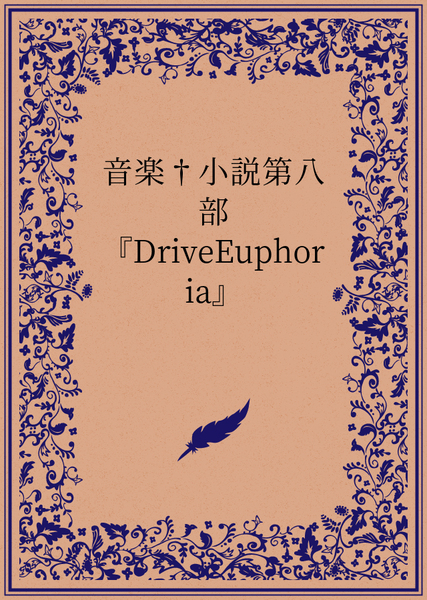

原文来源: [pixiv novel 20841703](https://www.pixiv.net/novel/show.php?id=20841703)
系列: 音楽†SFファンタジー『DriveEuphoria』
顺序: 14

イクスは、リョウスケにバトルを挑むための車の準備を、レイラとダイチが中心となって進める様子を見つめていた。自分もそんな風に誰かと気が合うことができるだろうか、と考えながら、二人の打ち解けた様子に若干の嫉妬を感じてしまった。イクスの心の中で、その感情に戸惑ってしまう。

ダイチはレイラと共に車のエンジンや足回りなどをチェックし、調整を行っていた。彼らはどちらもメカニックとしての腕前が抜群で、その共通点からすぐに意気投合してしまったのだ。

「レイラ、このサスペンションをもう少し硬めにすると、コーナリング性能が上がるんじゃないかな？」

「うん、そうね。でもあまり硬くしすぎると、路面の凹凸に対応できなくなるから、適度なバランスが大事よね」

ダイチが提案すれば、レイラが答え、二人は一緒に車の下に潜って作業を進めていった。

イクスは、レイラとダイチが楽しそうに車をいじっている姿を見て、どうしても心がざわついてしまうのを抑えられなかった。自分自身もレイラに対して持つ感情がわからないが、その様子にどこか寂しさを感じてしまった。

そんなイクスの気持ちに気づいたエレノアナが、彼の横に寄り添って言った。

「イクスさん、大丈夫ですか？なんだか、ちょっと元気がないみたい見えますけど…」

イクスは、エレノアナの優しい声に感謝しつつも、彼女に自分の心情を打ち明けることができず、うわべだけの笑顔を作って答えた。

「あ、なんでもないよ。ありがとう、エレノアナ。オレは大丈夫。ただ、ちょっと疲れただけ」

レイラとダイチが車のチューニングを終えると、イクスはその車に乗り込んで、リョウスケにバトルを挑むための走行テストを行うことになった。イクスは慣れない車での走行に若干の不安を感じていたが、レイラとダイチが手をかけた車には確かな自信があった。

エンジンをかけ、ゆっくりとアクセルを踏み込んで走り始めた。最初は慎重に、しかし徐々にスピードを上げていく。車の挙動はレイラとダイチが予想していた通り、快適で安定していて、イクスの運転もその車にすぐに馴染んでいった。

「なるほど、この車はかなりポテンシャルが高い。これなら、リョウスケさんに勝てるかもしれない」

イクスは、心の中で車の性能に満足しながら走行を続けた。

そんな彼の横の助手席にレイラが座っていた。彼女は、イクスの運転が上手くいっているのを確認すると、安心した表情を浮かべた。

「流石ね、イクスくん」

レイラは、イクスに励ましの言葉をかけてくれる。

「ありがとう、レイラさん。オレも頑張りますから、みんなでリョウスケさんに勝とう」

その後、数日間にわたって、イクスはレイラやダイチ、エレノアナと共に、車の性能をさらに高めるためのチューニングを続けた。彼らは、リョウスケとのバトルに向けて、少しずつ準備を追い込んでいった。

二度目のテスト走行が終わり、いよいよ、明日の夜にリョウスケとバトルすることになった。

その夜、イクスは、ダイチに呼び出され、少し緊張しながら彼の元へと向かった。何の用だろうと不安に思いながら、ダイチと対面すると、意を決したような表情のダイチから問い詰められた。

「イクス、正直な気持ちを教えてほしい。君はレイラさんのことをどう思ってるんだ？好きなのか？」

ダイチは真剣な表情でイクスに問いかけた。

イクスは、その問いに答えるのに困ってしまい、しばらく言葉に詰まってしまった。彼は確かに、レイラとダイチが親しく話す姿に嫉妬心を抱いていたが、それが恋愛感情だとは自分でもはっきりとは言えなかった。

「オレは…レイラさんを、大切な仲間として思ってるけど…好きかどうかは、わからない……です」

イクスは、自分の心情を正直にダイチに伝えた。

すると、ダイチは少し安堵したような表情を見せ、続けて言った。

「じゃあ、オレが言うことに驚かないだろう。実は、オレはレイラさんに惹かれていて……。もしリョウスケとのバトルが、オレとレイラさんのマシンの勝利で終わったら、レイラさんに告白するつもりなんだ」

「そ、そうなんですか。わ……わかりました、オレにダイチさんとレイラさんのことに口を出す権利はありませんし……」

ダイチはイクスの言葉を聞いて、彼が複雑な感情を抱えていることには気づいているようだったが、それ以上は追求せずに話題を変えた。

「ありがとう、イクス。明日のバトル、どうか頼むよ。僕たちのマシンで勝利を掴んでくれ。そして、僕がレイラさんに告白できるよう、力を貸してほしいんだ」

イクスは、自分の心に秘めた想いに蓋をした。そして、ダイチの願いに答えることを決意した。

「分かりました、ダイチさん。明日のバトルで、絶対に勝って、ダイチさんがレイラさんに告白できるように力を尽くします」

ダイチはイクスの言葉に安堵の表情を浮かべ、彼に感謝の言葉を述べた。

「ありがとう、イクス。本当に頼りになるな」

その夜、イクスは自分の心の中で、レイラへの想いと向き合いながらも、それを封じ込める決意を固めた。彼はダイチとレイラの幸せを願い、自分の複雑な感情を抑え込んで、目の前のバトルに集中する。それしか未来への道は開かれないのだと信じて。

「明日はバトルに勝つためだけに、全力を尽くす。それが今、オレにできることだ」

イクスは自分の心に誓いを立て、リョウスケとのバトルに向けて、気持ちを一つにした。
