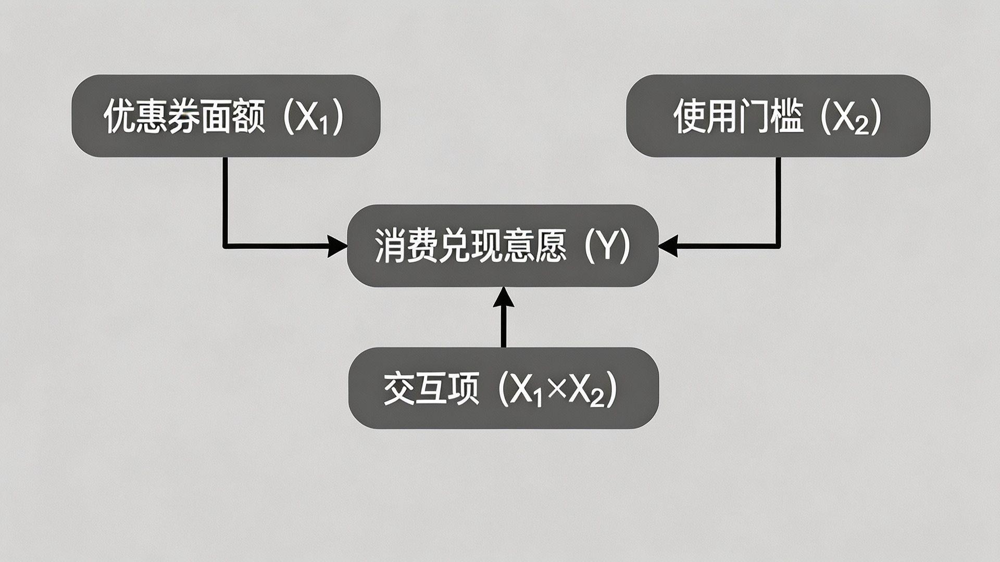

## 汇报流程

- 一、变量名称及其定义
- 二、假设的完整陈述
- 三、模型的图示
- 五、自变量的操控方法和检验方法
- 六、实验流程设计
- 七、预实验设计
- 八、数据分析计划

# 一、变量名称及其定义

## 三个核心变量

- 自变量1：优惠券面额
- 自变量2：使用门槛
- 因变量：消费兑现意愿
- 研究问题：消费者如何权衡“省多少钱”和“要多花多少”

## 优惠券面额

- 指优惠券可直接减免的金额
- 例：“满100减10”中的10元
- 本研究设置为 5 元 vs. 25 元
- 面额越高，感知交易效用越强

## 使用门槛

- 指优惠券生效前必须达到的最低消费额
- 例：“满X元可用”中的X元
- 本研究设置为无门槛、满30元、满80元
- 门槛越高，消费者的额外成本越高

## 消费兑现意愿

- 消费者实际使用优惠券并完成消费的主观倾向
- 不是单纯喜欢优惠券，而是“会不会真的去用”
- 使用 7 点 Likert 量表测量
- 取多个题项均值作为 CRI 得分

# 二、假设的完整陈述

## H1：面额的正向作用

- 高面额带来更直接的经济收益
- 消费者会将较大优惠理解为更高交易价值
- 25元优惠券应比5元优惠券更能提高消费兑现意愿

## H2：门槛的负向作用

- 使用门槛提高了获得优惠的消费成本
- 门槛过高时，消费者会觉得“为了优惠而多花钱”
- 无门槛组 > 满30元组 > 满80元组

## H3：面额与门槛的交互

- 面额的吸引力取决于门槛高低
- 低门槛下，高面额更容易被理解为划算
- 高门槛下，高面额的促进作用会被削弱

# 三、模型的图示

## 研究模型

- 面额、门槛及二者交互项共同影响消费兑现意愿

{width=70%}

## 2 × 3 被试间实验

| 因素 | 水平 | 含义 |
|---|---|---|
| 优惠券面额 | 2个水平 | 5元、25元 |
| 使用门槛 | 3个水平 | 无门槛、满30元、满80元 |
| 实验组数 | 6组 | 每位被试只进入一组 |
| 计划样本 | 180人 | 每组约30人 |

## 六个实验处理组

| 组别 | 面额 | 门槛 | 优惠券信息 |
|---|---|---|---|
| 1 | 5元 | 无门槛 | 5元立减，无最低消费限制 |
| 2 | 5元 | 满30元 | 满30元减5元 |
| 3 | 5元 | 满80元 | 满80元减5元 |
| 4 | 25元 | 无门槛 | 25元立减，无最低消费限制 |
| 5 | 25元 | 满30元 | 满30元减25元 |
| 6 | 25元 | 满80元 | 满80元减25元 |

# 五、自变量的操控方法和检验方法

## 实验情景

- 被试想象自己是一名大学生
- 平时会购买咖啡或茶饮
- 收到虚构品牌“悦享咖啡”的电子优惠券
- 饮品约15-25元，轻食约20-35元
- 优惠券有效期为7天

## 自变量操控

| 面额 | 门槛 |
|---|---|
| 低面额：5元 | 无门槛 |
| 高面额：25元 | 满30元 |
| 25元约等于一杯饮品 | 满80元 |

## 预测试

- 招募 15-20 名不参加正式实验的被试
- 随机分配到 6 个实验组
- 检查面额识别、门槛识别、情景真实感
- 若识别率不足，调整优惠券卡片和情景表述

## 操控检验

- 面额识别：优惠金额是 5 元还是 25 元
- 门槛识别：无门槛、满30元还是满80元
- 情景真实感：是否贴近真实咖啡消费
- 信息理解度：是否清楚面额和使用条件
- 放在因变量测量之后，降低需求效应

# 六、实验流程设计

## 被试获取

- 本科生和研究生，18-28岁
- 过去一个月买过咖啡或茶饮
- 有过优惠券使用经验
- 通过校园微信群、朋友圈、班级群和线下海报招募

## 样本量

- 6 个实验组，每组约 30 人
- 中等效应量 f = 0.25
- 显著性水平 0.05，统计功效 0.80
- 最低样本量约 158 人
- 考虑无效问卷后计划回收约 180-186 份

## 问卷结构

| 顺序 | 模块 | 作用 |
|---|---|---|
| 1 | 筛选题 | 确认目标被试 |
| 2 | 知情同意 | 告知研究与权利 |
| 3 | 情景材料 | 呈现实验操控 |
| 4 | 消费兑现意愿 | 测量因变量 |
| 5 | 混淆变量 | 控制个体差异 |
| 6 | 操控检验 | 检查操控有效性 |
| 7 | 人口统计与解说 | 背景信息与去欺骗 |

## 消费兑现意愿问项

- 我会在有效期内使用这张优惠券
- 我愿意为了使用它而专门前往消费
- 考虑到优惠券条件，我认为使用它是值得的
- 原本没有购买计划时，也可能因此去消费
- 与其他促销相比，这张优惠券有吸引力

## 质量控制

- 注意力检查：要求被试选择指定选项
- 剔除作答时间低于 2 分钟的问卷
- 剔除认真度低于 4 分的问卷
- IP 去重，检查开放反馈
- 预计剔除 12%-15% 的无效样本

# 七、预实验设计

## 预实验目的

- 选择最合适的消费品类
- 降低品类偏好和品牌偏好的干扰
- 检查实验情景是否真实、易懂
- 如果咖啡/茶饮不合适，再替换品类和门槛金额

## 候选品类

| 品类 | 典型场景 | 优势 |
|---|---|---|
| 咖啡/茶饮 | 校园周边饮品 | 高频、价格清晰 |
| 外卖/简餐 | 平台满减优惠 | 门槛促销常见 |
| 线上超市 | 日用品即时零售 | 商品较标准化 |

## 评估维度

- 熟悉度：是否了解该品类
- 优惠券感知：是否认为该品类常见优惠券
- 偏好一致性：同学之间偏好差异是否较小
- 情景真实性：是否贴近真实生活
- 每项采用 1-7 分评分

# 八、数据分析计划

## 数据清洗

- 删除筛选题不符合要求的样本
- 删除注意力检查失败和认真度过低样本
- 计算 5 个 CRI 题项的均值
- 检查正态性和方差齐性

## 操控检验

- 面额识别：使用卡方检验
- 门槛识别：使用卡方检验
- 情景真实感：比较各组均值
- 预期面额正确率不低于 90%
- 预期门槛正确率不低于 85%

## 假设检验

- 核心方法：2 × 3 双因素被试间方差分析
- 面额主效应检验 H1
- 门槛主效应检验 H2
- 面额 × 门槛交互项检验 H3
- 交互显著时进一步做简单效应分析

## 信度与稳健性

- 对消费兑现意愿量表计算 Cronbach's alpha
- alpha 不低于 0.70 视为可接受
- 将优惠券倾向性、价格敏感度、情绪和品牌偏好作为协变量
- 使用 ANCOVA 检查结论是否稳健

# 汇报小结

## 本实验设计的重点

- 用标准化情景实验隔离面额和门槛的影响
- 用 2 × 3 设计同时检验主效应和交互效应
- 用预测试、操控检验和质量控制保证内部效度
- 回答“小优惠是否以及何时能撬动消费”

## 谢谢大家

欢迎提问
